# 【QMT量化交易实战】4.xtquant使用 - P1 - 量化投资技术 - BV1sC41137he

大家好啊，这节课呢我们讲一下sd count的使用，首先我们说一下SD框的这个是什么，SDQUANT呢是一个Python包啊，这个Python包是训头这家公司编写的啊，是嗯给KMT去用的啊。

通过使用这个包呢，我们可以在任意的地方写Python程序啊，嗯并使用这个mini q mt里面的功能啊，在QM简介那些课程中呢，我们已经介绍了mini k m t跟MQMT的区别啊。

那这个S框的这个包呢，主要是针对于mini mt用的啊，这样呢我们基于Python搭建的量化交易系统，就可以独立于mini q q m t存在啊，两者只要运行在同一台机器上。

而不需要将程序运行在k mt内部，这样就实现了量化交易系统的本地化，完全的本地化啊，大概在嗯从技术上解释一下什么意思呢，就是嗯当这个包运行起来，与KMD产生一个链接的时候呢，我们就把嗯。

k mt这个极简版当成一个服务的存在啊，我们不再需要在，你在他的软件里面去编写代码啊，只要我们的Python程序呢跟他建立了链接，就可以进行下面的量化嗯，策略还有一些操作的编写嗯。

这就是km那个TT这个包的一个优势，然后讲一下X光的这个包的下载啊，下载呢就我贴了一个链接，后续我们都会实操一下啊，然后需要说明的是，那个SK框的这个包呢，并没有发布在啊PIPI上啊。

PIPI在我们上节的这个Python环境安装的时候，我们介绍的这个东西，这个是Python的第三方的接线员，我们的开源包呢基本上都发布到这，但迅头并没有把X光的这个包发布在这上去。

他需要上讯头知识库的官网去下载啊，所以我们没法通过pip store安装它啊，我们要到迅透知识库里，对应对应的界面去下载啊，就是一个下载的截图，然后迅头呢会定期的更新它啊，我们去下载最新的版本就可以了。

嗯然后再说一下X框的使用啊，呃首先切记在使用X框呢之前呢，我们必须要启动mini com t客户端，也就是QMT的极简版啊，这里要强调的是你必须得启动极简版啊，具备极简版的权限。

启动那个非极简版是不行的啊，嗯然后X框呢主要分为两大模块啊，一个叫x x t date，一个叫XTTD这两个模块呃，呃顾名思义可以理解为呃，x date呢就是用来做数据获取的。

然后呢xt china呢是用来做电话交易下单的，嗯这边我们也简单介绍一下它，后面我们都会进行一个实操啊，x date是数据获取接口啊，我们可以实现数据数据的获取，下载和订阅，也就是说所有需要获取数据啊。

订阅数据嗯，比如说历史数据啊，财务数据啊，一些特色的数据啊，包括啊股票的基础信息啊，这些这些数据接口都会在这个SD框，那个STD这么一个模块下啊，这是一个事例啊，这个就是获取历史数据啊的一个呃。

实例获取的是这是茅台的这个日线，一会儿我们会实操一下，获取回来的这个是一个数据，是一个字典，每个key对应的值是一个pandas的data frame，也就是说在使用这个东西之前呢。

大家要对pandas进行一个简单的学习，嗯pandas呢就是呃Python科学计算的一个包啊，他他这个data frame呢代表的是一个数据表的类啊，我们可以在这个数据表里啊，嗯很灵活的操作这个数据啊。

所以这块呢嗯应该对量化有些了解的朋友呢，对pas应该不会陌生啊，如果没了解过这个包呢，大家自己去找教程去学习一下啊，不是很难啊，我们可以根据我们的需要去处理这个数据，获取到数据之后呢。

他就是基于pandas的方法，进行一个处理就可以了，然后啊，然后那个xt china呢它是交易相关的模块，我们可以用来下单撤单，下面我们一个简单的例子看一下这个例子，我们一会儿也会跑一下啊。

嗯行那然后我们再进行一个实操啊，嗯在代码实操之前呢，我们再详细的介绍一下驯龙知识库，因为我们要下载这个SC的话，需要到训头知识库里面去下载啊，这个在我们com简介里呢也大概介绍了一下，这里再强调一下啊。

呃讯投智库呢是呃k mp这个软件的，可以认为它是官方的技术文档啊，嗯目前呢它的文档是比较全完善的啊，然后呢这里是他的首页，首页可以看到这里有很多的数据啊，啊这里有主要有两个分类，一个是内置拍摄。

一个是原生Python啊，在这API这里也能找到啊，啊这个新手入门呢就是一个入门教程，大家看啊，需要的看一下，然后之前我也说过，内置Python的对应的是呃非极简版，也就是主QMT。

然后原生Python呢对应的是我们的mini com t啊，我这里着重讲的是linux mt，那我们就点击原生Python，然后可以看到这里呢com p的下载地址在这啊，在他的这个目录的最后面啊。

我们在这点击这个就行了啊，这里呢就是它的这个呃X框的的各种版本啊，我们这里呢他会呃就去下载最新的就可以了，你可以看到镜头呢会定期的更新一些额数据啊，更新一些一些一些问题啊，这都是一些用户反馈的。

比如说啊很多都是反馈的，像这个这个是我给他反馈的，有些有些板块没有啊，他会定期的去嗯修复这些问题啊，那我们如果它修复的问题呢，嗯解决了呢，你可以再去下载一个新的包啊，去更新它，那这里呢我们就去下载它。

现在最新的下载一下啊，懂了，嗯好我们下载完了，然后我们这是一个压缩包，我们就给它解压一下啊，这里我就简单剪一下，放在桌面上，解压完事之后呢，就可以看到这个包了啊，比如说他这里。

就我们这个解解压之后的这个X框呢，就是它实际对应的这里面的源码包啊，嗯然后这个包呢其实它也是开源的啊，啊这里的主要的代码呢都是嗯都是呃Python的脚本，但是有一部分是这样的，就是对接这个数据中心呢。

就是实际上对接KMG的这个底层的接口呢，它是啊它是编译编译的啊，这块我们是看不到的，但是呃呃它的上层代码啊，这些PY啊，这些PPY文件的我们是可以可读的啊，如果需要阅读源码的话，也可以看到它。

看它的相关相应的源码啊，然后这个目前呢我们把这个包下载到本地的，但我们在程序中怎么用呢，嗯其实就是把它复制到我们的项目里，就可以了啊，我们下一步实操一下。

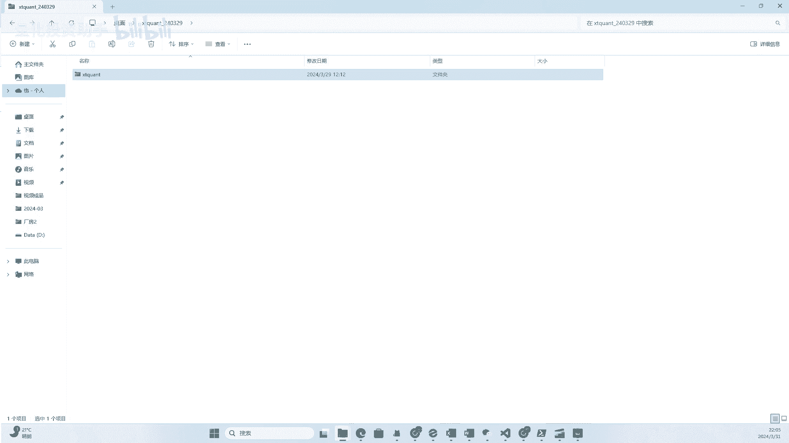

这里找到我们上节课啊建的这个设计项目，然后我们把刚才下载好的这个啊插啊插地框呢，这个包呢复制过来啊，啊他问我是不是要复制，我就复制一下，然后这个包呢现在就呃以本地包的形式呢，在我们的这个系统里了。

我们接下来呢就可以把它当做一个本地的Python包，进行一个使用，接下来我们简单完善一下我们的项目啊，S框呢复制进来了，然后我们给我们的这个项目呢，因为我们安装了git，我们建一个代码仓库啊。

嗯这里就初始化了代码仓库啊，然后嗯这里建一个get一个node文件，这个是要把你不想存到仓库里的，这个文件夹的一个闹掉啊，那我把查理矿的一个闹掉，因为它是一个第三方包，然后下一步呢我们建了一个这个呃。

JUPITER的一个文件啊，这个应该嗯大家了解Python的话，应该也了解，然后vs code呢是支持这个主peter的这个，notebook的编写的，嗯可以安装插件。

这个插件的话就是呃这个就收JUPITER，就可以了，然后相关的他都会安装上，安装上之后呢，这边就可以用啊notebook去编写下的呃，这个程序进行测试啊，然后我们再调一下这个啊。

命令行面板的位置给他调到这边，这样就比较好一点了吧，嗯然后我们嗯，做一个例子啊，做一个例子，首先呢我们用叉刚才已经说过了，如果想用差距框的呢，首先要保证这个你的这个QMT的。

mini q m t这个客户端需要启动，也就是说你要打个QMP勾选极简版，然后登录上去啊，然后我这里已经登录了啊，嗯大家如果没登录呢，自己一定要先登录一下，要不一会儿会连接失败。

然后这里呢那可以去选择一个核心，就选择运行环境，我们选择啊这个啊，我们之前安装的这个虚拟环境在这里能找到，看到了吗，啊，这样的话就跟这个刚才那个虚拟环境连接到了，连接到一起了，在这运行的话。

就是用我们之前创建好的这个环境，所以很方便对吧啊，大家如果反正用别的编辑器的话，也可以自己去搞一搞这个东西，就是嗯要把自己的环境呢搞通顺啊，好用一些啊，嗯如果你用这个py charm什么的比较顺手的。

你就用那个啊，其实无所谓啊，应该都支持类似的功能。

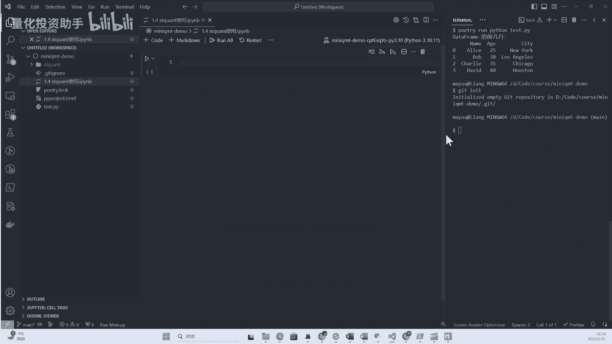

嗯然后呢，我们把我们之前例子里的这个小小的程序呢，例实例复制过来。

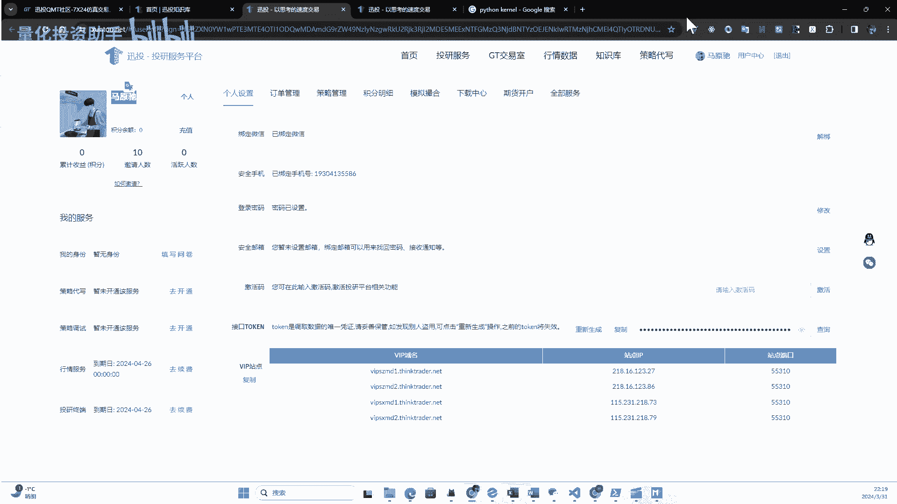

嗯可以看到复制过来了，然后我们点击一下运行，现在应该运行不起来，因为我应该没装相应的包啊，我们先试一下啊，啊提示我这个没有这个包啊，那我们就把它安装一下啊，这里报了个错啊，说没有这个包。

那我们就把这个包按一下啊，这个我们还是用这个我们之前的PY，用我们的这个，用它来安装啊，A a，Py kernel，哦前面还多了一个掉，安装这个呢还是需要消耗一些时间的，我们稍微等一下啊。

OK我们安装完了啊，我们这里是一直用是用的polish代替这个pip，去来管理我们的项目，这个可以看到它的安装，这个模式和信息会更清晰，而且这里你可以看到安装完之后呢。

相应的包呢就会在这里去啊啊看到了啊，然后我们再尝试运行一下这个啊，再尝试运行一下啊，可以看到已经开始运行了，然后现在运行完毕了啊，嗯这里呢我们就成功获取到了这个6005，一九，60519就是茅台嘛对吧。

然后他的日线可以看到呢，这个日线返回的其实是一个字典啊，他是嗯他这个接口呢是以每一列每列去返回的，比如说我们可以在这里查看啊，嗯查看open试一下啊，然后我们再运行一把，还可以看到这个啊。

它是以这种形式展示的啊，这个结果啊，这里呢我们就先大概看一下，这个相应的这个运行，先体验一下，后面我们会详细介绍这些接口啊，以及这个获取历史数据的，其实它还有很多的方法，有的会反弹pandas嗯。

有的会返返回这种啊列的字典啊，然后我们再去试一下那个相应的交易模块嗯，刚试完数据获取之后呢。

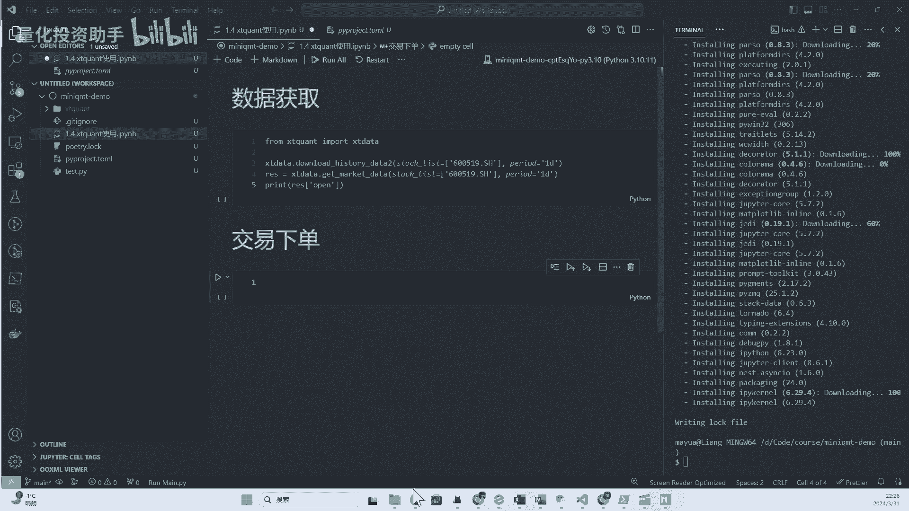

我们再试一下我们这个交易的这个例子啊。

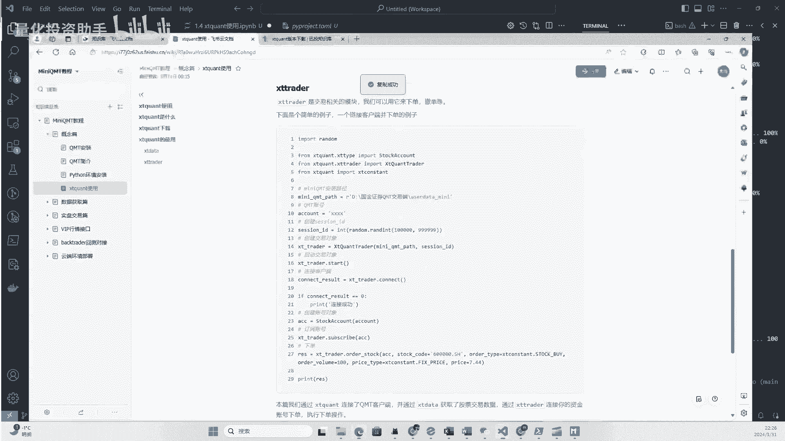

那我就写好了，然后大家可以复制过来试一下嗯，这里需要说明这几个地方啊，这里呢有一个mini q m t pass啊，要传到这里面，这个路径呢需要填写你本地安装的这个把路径，比如说我给大家看一下。

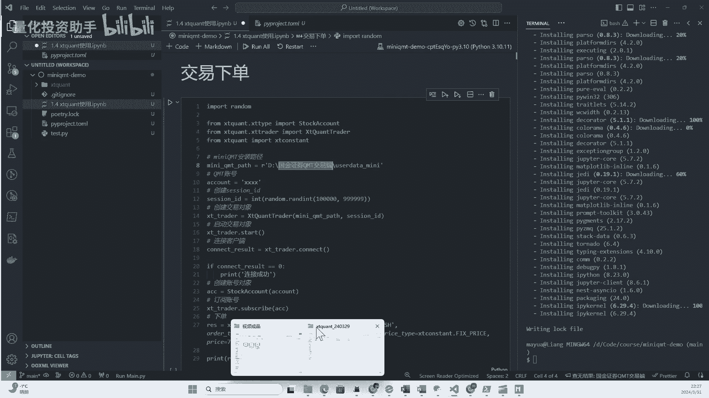

我这里安装的啊啊我是安装到了D盘，然后。

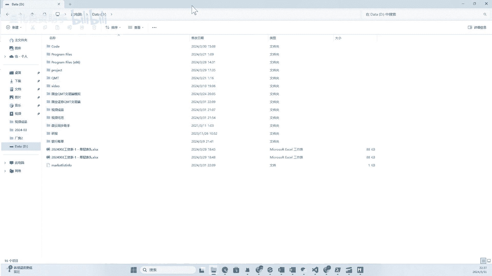

嗯地盘的啊，国庆交易这里，然后啊，这个文user user date mini这个文件夹。

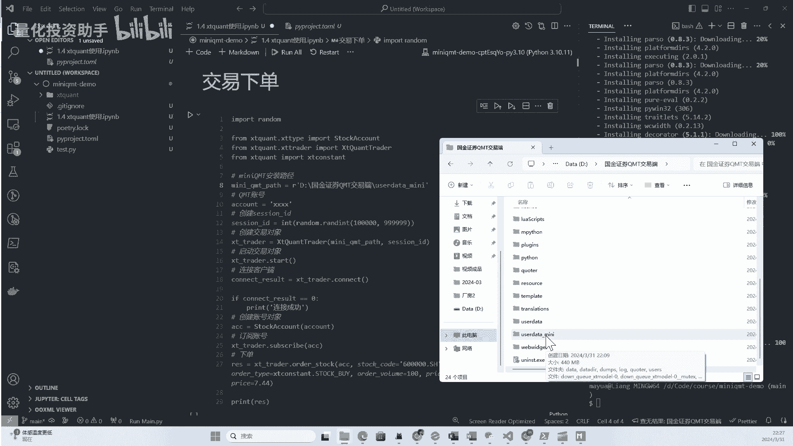

这个文件夹嗯，你你安装的目录呢不一定跟我这个一样啊，这是以你这个为主，以你当本地的为主，然后这里后最后写的这个这部分肯定是一致的，要定位到这个user user。

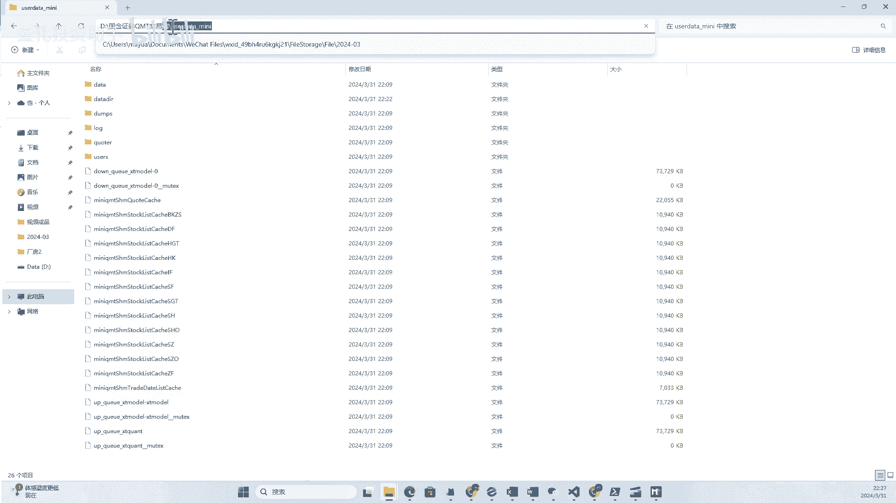

data gumi的这么一个文件夹下，这里需要替换成本地，然后账号呢就替换成自己的账号嗯，我这里替换一下我自己的账号啊，啊嗯我们把这个复制过来之后呢，试一下这个嗯下单的功能啊。

然后我们这里还是点击运行嗯，可以看到下面提示连接成功，然后返回了一个我们这里打印的是订单号，这里呢这里就是下单的程序，然后呢嗯我这里是嗯相当于买了一手啊，那个浦发银行对吧，然后因为我现在是非交易时间。

所以他它会形成一个预买单。

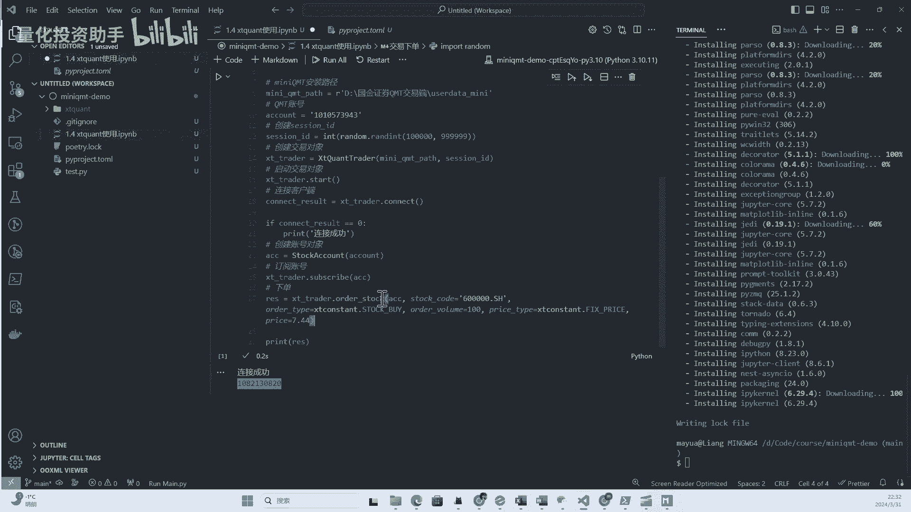

如果你账户里有资金的话，可以给大家给大家看一下啊，这里委托啊可以看到这个刚才这个测试的啊，下单呢就已经买下来了，那就成功了，然后这里需要我简单说明一点是什么呢，就是嗯预埋单呢，一般可能我咨询过训头。

需要等到十大概十点钟以后嗯，你比如说在下午收盘之后的，五六点钟或者三点之后的呃，到十点之前的这个预埋单是不太啊，是是是很容易失败的，因为他还在结算阶段嗯，然后需要你这个如果想预埋单的话，需要晚一点啊。

我记得是十点之后，或者是你在12点之后也可以啊，会更靠谱一点，然后这里如果有资金的话呢，就会呃嗯买那个买单成功，然后如果比如我们再执行一次啊，啊因为我这里我的账号里已经没有可用资金了。

然后我这里再执行一次啊。

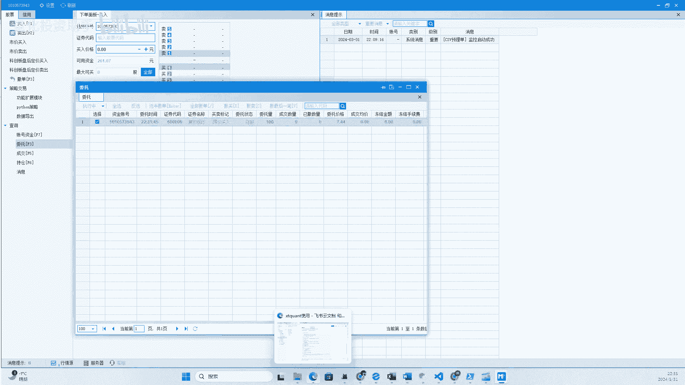

嗯看一下，我们再执行一次，可以看到这边连接成功，然后又产生了一个订单，但是我现在可用资金已经不够了，不够了之后呢，它会产生一个。

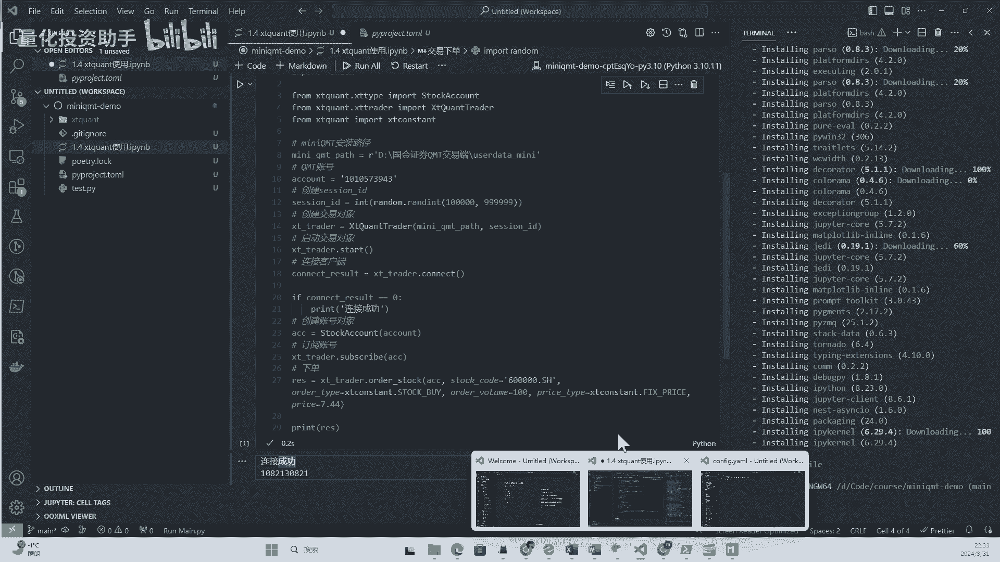

它会产生一个可以看到这个委托的话。

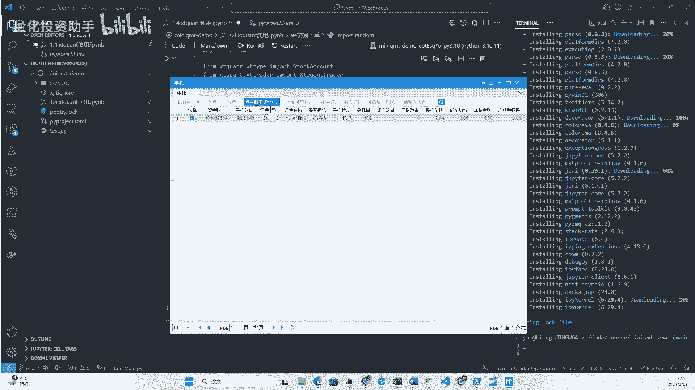

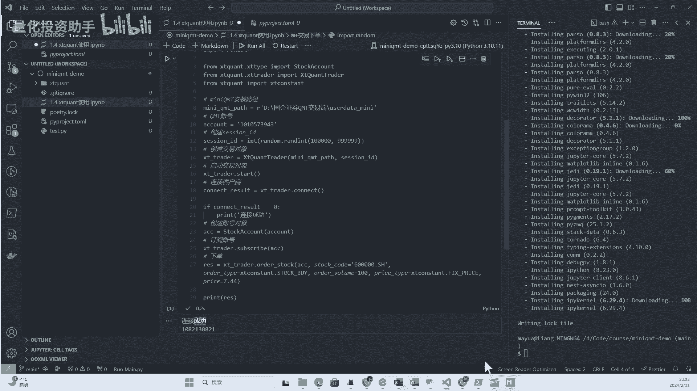

委托都没成功，可以看到一个下单下单之败失败，原因是资金不足，也就是说如果你下载失败的话呢，会在这个消息提示里收到消息啊，这里会有相应的提示，一定要关注这个东西。

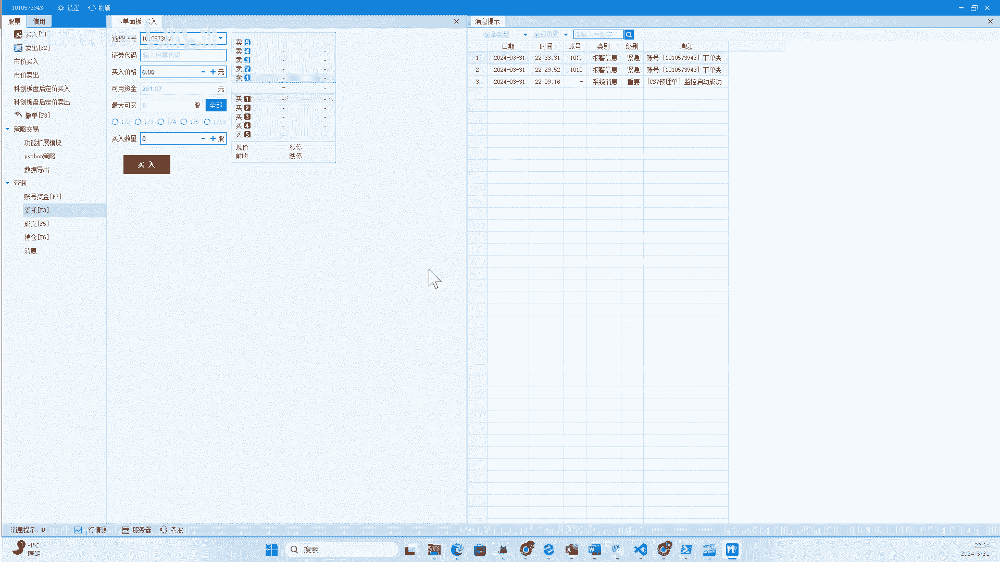

有可能你的下单会失败啊，嗯然后呃因为下单失败也是有原因的嘛，然后这里的话我们现在只是简单的做一个下单，其实在程序里呢也可以监听到下单的结果，比如说成功失败或者是失败的相关的信号啊。

后面我们会进行一个演示，嗯那这两个例子跑完之后呢，嗯大家应该就能看到啊，我们使用SD框呢可以第一获取历史数据呃，就是行情数据，第二呢我们可以进行一个程序化的下单啊，这个简单的量化交易最核心的两部分。

我们就可以通过插件框呢来实现啊。

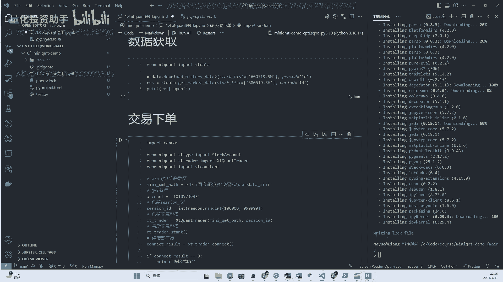

呃然后我们再回到这个群头知识库啊，呃可以看到我们这个还是点击这个原生Python的，这个嗯目录啊，然后这里面的原生Python其实就是介绍插地，插地矿的，还是自己放的啊，这里面有详细的啊。

那个S框的每个接口啊，有哪些接口，然后每个接口怎么用啊，都是有实力的，那我们如果用MICROMT嗯，呃用用S框的呢，就是我参考这个文档就行了啊，然后如果呢是想用这个主q mt。

就是非嗯极简版模式的这个k mp呢，大家都看这个内置的，那我个人更偏向于用这个原声的啊，这样的话程序会更加灵活啊，我只是用你的接口就可以了啊，我的量化交易系统嘛，可以更好的由我自己来定制啊。

这是我认为他的一个优势啊，嗯最后呢我们再来呃，说一下这个S框呢跟mini com t的关系，其实其实mini com t是大家的一个俗称，就是大家平常圈子里啊，或者是网友互相交流的时候。

就用MKMT指代呃QMT的极简版啊，然后呢嗯SQU呃训头开发的这么一个Python包啊，这个Python包呢可以极简版的KMT，进行客户端的啊交互啊，也就是说进行链接啊，链接之后呢可以获取行情。

可以报单，这里他也有解释啊，这是他俩的联系和区别啊，所以如果你用mini com t呢，那你必须要熟悉s count这个包的使用啊，那接下来的大部分课程呢，我们也会围绕啊。

icon的各种的使用方法进行展开啊，好那这节课呢就介绍到这里。

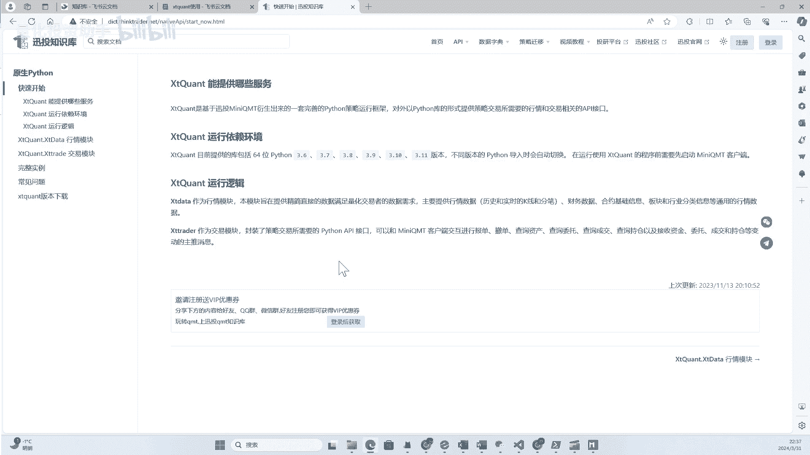