# 【python数据分析精华版来了（附文档代码）】10小时学会Python数据分析、挖掘、清洗、可视化从入门到项目实战（完整版）学会可做项目 - P10：05 统计函数 - Python万能胶 - BV1YAUuYkEAH

计函数哈，接下来我们要讲解的是统计函数。

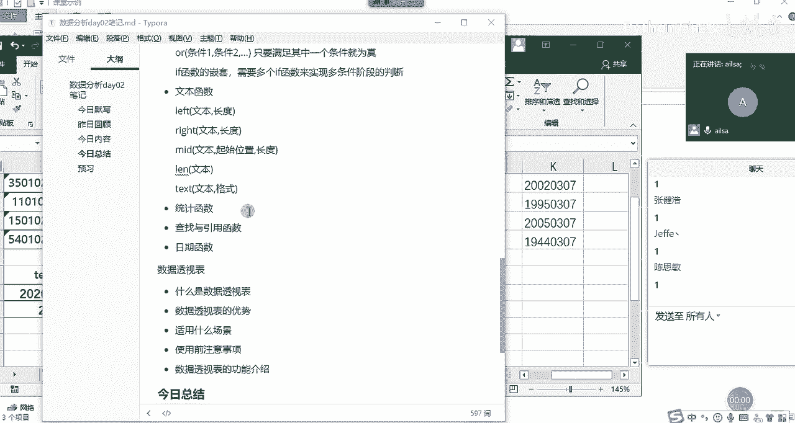

还少一个replace哈O啊replace啊，那我们再补一个补一个replace哈。replace函数的话相当于是一个替换，也就是替换文本里面的内容。那我们该怎么去操作呢？

我们先把它打出来看一下replace里面都有哪些组成部分啊，我们可以看到第一个是old杠t。也就是说你既然要对它进行一个替换，你替换的原始的文本是谁？那我们肯定是手机号码，然后你要就是它你要替换。

你不可能替换所有的，你可能是只替换其中一部分。那你从哪个地方开始替换，也就是跟me里面的一个呃起始位置是一个意思。那这个时候比如说现在我们想隐藏的是。那8到10位，那就是从第八位开始啊，第八位开始。

然后你要替换多长的啊一个文本内容，我们看是三个，对吧？那它的长度就是3，那你要替换成啊把这三呃三个呃字符，你要替换成什么内容呢？这个时候啊我们要替换成三个星，我们把星输入进来三个星哈，那你要写一个星。

它就会替换一个啊替换成一个星，然后这个时候我们按ent键，它就所达到了我们所想要的效果。那也就是说replace它的组成部分，第一个就是你的原始的啊原始的文本。第二个就是你要替换的起始位置。

然后第三个就是你整个替换的长度，最后一个就是它啊我们呃就是你要替换成了一个新的文本内容，你指定的啊这一部分替换成了一个新的内容啊，我们补充一下replace。

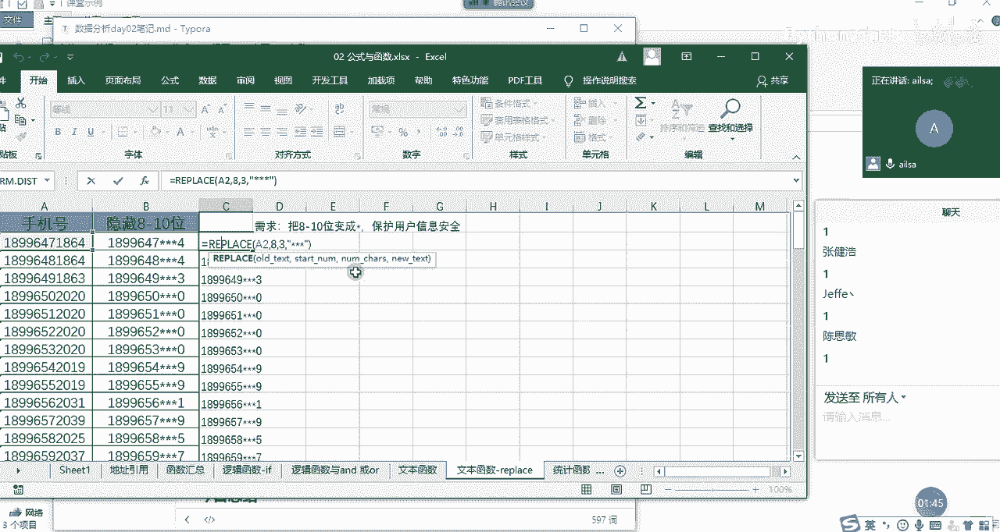

OK我们最后还有一个replace IP。L有ACE哈L。啊，其实对于每一种呃每一种方式而言，你只要掌握它的语法就可以了。它最终的呃呃思想是万变不离其中的啊。replace第一个就是我们的原始啊文本啊。

第二个就是它的替换起始位置。嗯，第三个是他的嗯。呃，第三个是它替换的长度哈啊文本啊替换长度啊。第四个的话就是它的替换的新值啊，就是替换的新内容啊啊，这是我们的replace。

啊大家大家对于replace啊，有什么问题没有，现在可以自己操作一下哈，操作一下。如果操作完没有问题，我们就讲下面的文统计函数。没有问题的话，给我扣个一哈。操作完之后。好的还挺快哈。

看来我讲的是比较简单一些哈。大家大家都学会了，也很开心。😊。

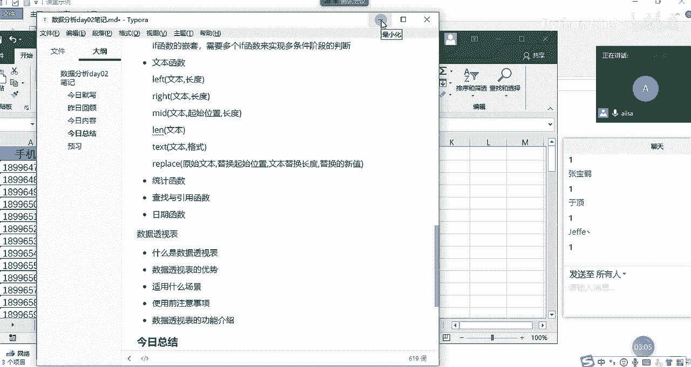

好的，那我们说下面的一个啊统计函数。统计函数的话，其实就是嗯就是我们在计算数的当中的一些啊应用哈，用的不多哈，这个真的是用的不多啊。首先我们先看第一个啊，第一个向下取整哈，向下舍入取整啊。

这跟四舍五入还有点差别，什么意思呢？你比如说啊int函数。我们在这里啊这给了几个数值。然后我们看一下它所想要的效果啊，int啊，它只有一个啊，它只有一个参数，就是number啊，你给一个值。

然后它给你向下舍入取整，什么叫向下舍入取整呢？哎，我们看一下啊，我们啊需要画一个图哈。

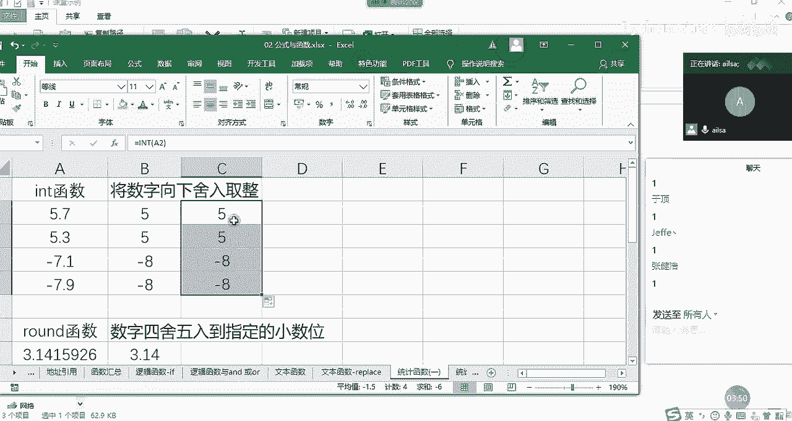

需要画个图，我跟大家解释一下什么叫线下收入取整哈。我的妈呀，我的鼠标坏了。

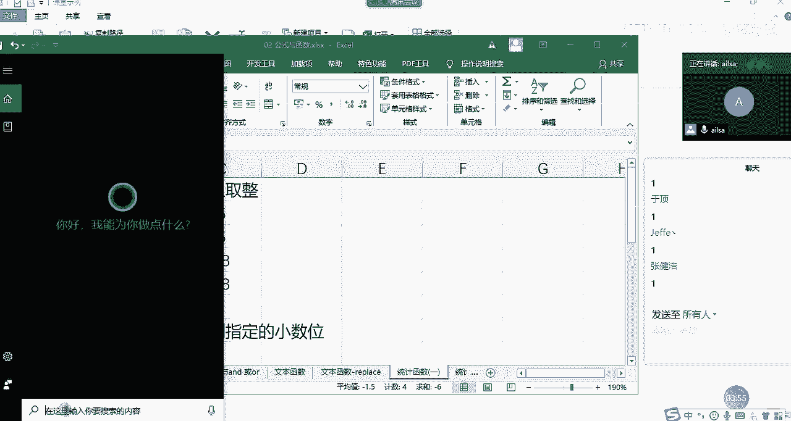

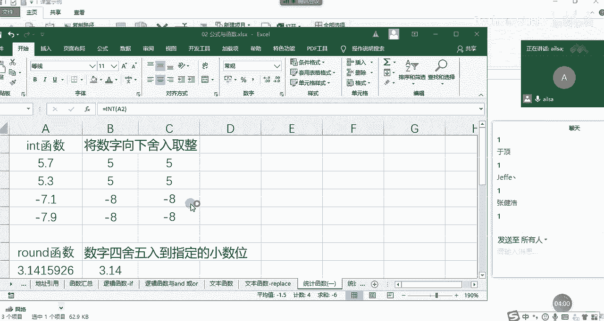

嗯。我这是灵魂画着哈，希望大家理解一下。没有鼠标啊。然后这个时候这里面是0啊。哎呀，妈呀，真的是0，然后这个是呢。这个是5。啊，5啊，然后这个是8。难为我了。负8哈负8。然后这个是。啊。

假设哈大家不要看长度哈，长度的话就不合理啊，这个是负。7啊，这个是我们看一下这个值哈啊，这个是呃6。啊。6。来，同志们，我们看一下它整个的一个啊整个的一个值哈，5。7啊5。7是在大概这个位置啊。

这个位置啊，我们换个颜色啊。用刷子吧。啊，5。7大概是这个位置，对吧？看这个位置，那它向下时候取整指的是向它就是在这个它相邻的整数当中偏小的这个那5到6之间偏小的整数就是5，对不对啊，是这样。

那我们对于正数而言，其实特别好理解，就是它相邻的那个小的那个整数啊取整就可以了。那对于小数而言，大家需要有一个思维哈，就是小数的话，数值就是这个我们不看负号值越大，它越小所以说你看负7。1。

大概是在这个位置，对吧？那它在这两个相邻的整数当中偏小的是-8啊，是吧？所以它返回的是-8而不是负7，大家这个一定要扭转过来就可以了。我主要想强调的是这个嗯。

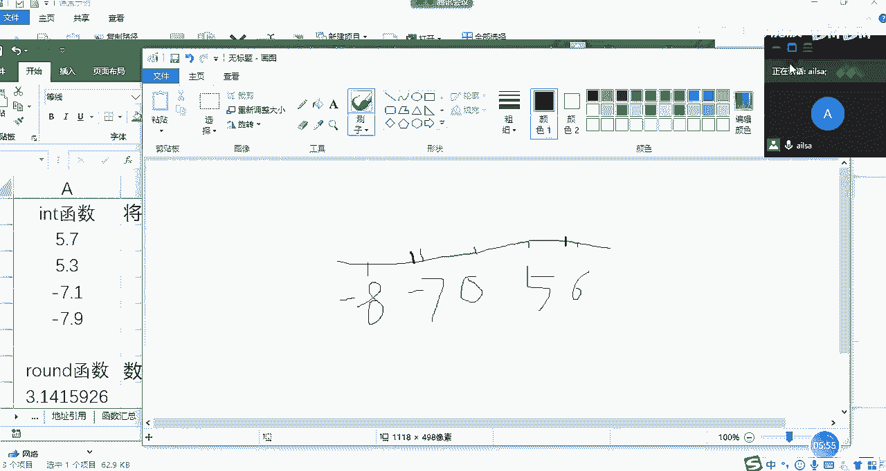

哎，这个明白了吗？

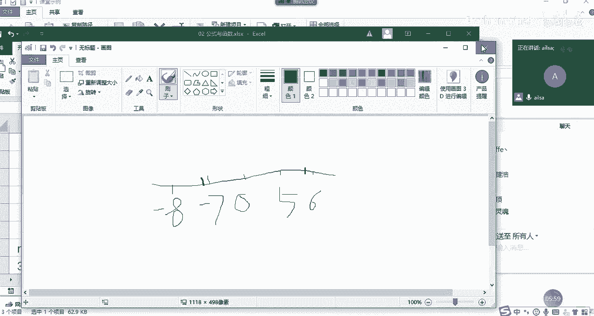

啊我这个鼠标啊真的是啊啊鼠标真的是啊非常给力哈。在我需要它的时候，它真的是没电了哈啊，它的电池。😊，啊，大家这个明白了没有？明白，给我扣个一啊，别别管是不是灵魂画者了。OK哈啊，这是向下省入去整啊。嗯。

OK这是in哈。然后我们再看一下round函数，round函数，我们都学过哈，就是四舍五五入，这个就没有什么好说的了。我们看一下它的函数的组成部分，我看函数组成部分，就是把它函数输入进来。

然后看一下哎它到底是怎么来啊啊你呃怎么来组成的哈啊啊，首先它第一个就是你要进行一个小数位的呃呃四舍五入，你肯定要输入你的数字，对吧？第二个，你要呃计算小数位，你得告诉我它这个哎你要保留几位，对不对？

很简单啊，我们一般是两位啊，选择它直接就出来了啊，这个就很简单哈。对啊，思敏说的没有问题，就是比它小的这有时候理解起来有点费劲，画个图就可以了哈。画个图就比较简单一些。

然后runund函数我已经讲完了哈，现在已经到round函数了，然后看mo函数哈，mo函数就是取余数嘛，两数相乘取余数啊，这个的话它就等于mod啊，我们看一下组成，第一个就是我们的除数。

我们的除数是5然后被除数是3啊，然后我们看一下得出来的结果就是2啊，5除以3啊，就等于2，就是它的组成部分，一个是除数啊，一个是除数一个是被除数啊，mo的函数。

我们可以看到统计函数还相对的比较简单一些哈，我看还有没有ok没有了哈，我们讲了一个int函数，round函数，还有就是我们的mo函数这三个。啊，这三个函数啊，就是我们的统计函数的一个简单应用哈啊。

当然了，不仅仅是这些啊，我这边先做一下我们的笔记。

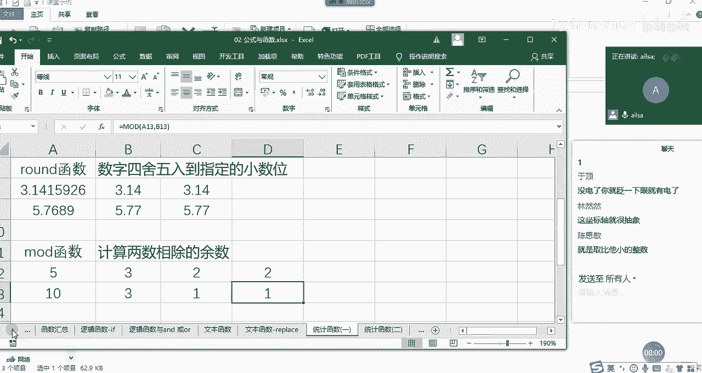

给大家总结一下我们的int函数。还有就是呃round函数。ROUND roundund函数，还有就是mo的函数啊。mo函数，然后int函数的话啊，它们的组成部分其实都一样啊。

就是我的number啊这个数字。然后第二个就是啊啊那这个只有一个啊只有一个number啊数字round函数的话，第一个是数字。第二个就是你取得小数位，对吧？小。数倍数。嗯，那mo的函数。木的函数。

第一个是啊我们的除数。第二个。被除数。对吧啊这样的一个呃组成部分，这三个就已经讲完了。然后呃我们再解释一下哈，int函数就是向下。舍入啊曲折。舍入。哦。摄入区长。OK然后runund的函数就是啊保留啊。

保留几位小数。然后目的函数就是我们的呃呃正除取于。取余数。对吧OK这就是我们的统计函数的前几个。然后大家对于这三个函数有没有什么问题？没有问题的话扣1。嗯，相信大家都具有数学背景的，应该都不难哈。

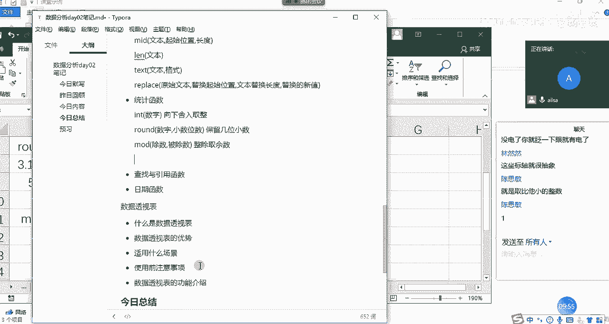

啊，都不难。我们再看一下，再看几个比较简单的。余数应该没有小数吧。你见过余数是小数的吗？对吧。嗯，我们再看一下哈。OK其他人还有没有什么问题？没有问题给我扣1，我看还有没扣的啊。

还真能小说OK那我们私下聊一下啊，私下我们再讨论一下。嗯，好，那我再接着介介绍我们统计函数的第二个部分，也是比较简单的最大值最小值均值求和计数哈。比如说哎这是我们之前一个班的一个成绩。

然后我以它为例来给大家讲一下啊，这个就啊一带而过哈，这个大家经常用哈，那最大值我们都知道什么max对吧？哎一组数据当中最大值，那我们可以知道它的组成部分就是给你一组数据，那对于一组数据而言。

然后我们可以单独一个一个数字进行输入，如果是连续的数据区域的话，我们直接选择啊我们的数据区域就可以了哈啊，我们看到啊还挺长。这没鼠标的日子，稍等啊啊，还好我有快捷方式哈OK那我们选择这个东西之后。

然后我们按ent键。那接下来。这个就是我们在我们的这组数据当中的一个最大值。然后我们看最小值，它又等于什么，等于幂，对吧？一组数据等到最小值啊，那就是B啊，我们还是看笔试成绩啊，B几呢啊B3啊B2啊。

B2到多少呢？啊，我这边先写B1。哦，60应该够了。那，我们看一下A，46，我们看他是到。哦，B63哈。看一下。我们这个区域的选择可以自己手动输入哈，也没必要说非得啊怎么怎么去选OK最小值是44。

最大值是68。那均值怎么来写呢？就是averageAVAAV12AGE就是这个值返回它的算术平均值OK那它也是啊这样的一个组成B1啊到。B63。嗯，1到63吧。OKB1到B63。

这就是我们的一个均值的啊计算。好，那下面求和哈啊求和没有关系哈啊没鼠标也没有关系。然后我们求和也是从B1啊，然后到B啊63。啊，这样的话是3580OK没有问题啊，这是大家记一下哈，我们最大值是max。

最小值是me，均值是average啊，然后是求和是someum啊，然后技数是countt啊啊，这个跟我们学的是一模一样啊，然后是BE。嗯，不是为了给你们讲课嘛？我也没招啊啊对吧？

我我等一会儿去看一下我们家里有没有电池啊，OK哈，这是我们的啊最大值最小值均值啊，均值求和和技术。我们接下来总结一下啊，我们总结完了之后就休息哈，我去找个电池。

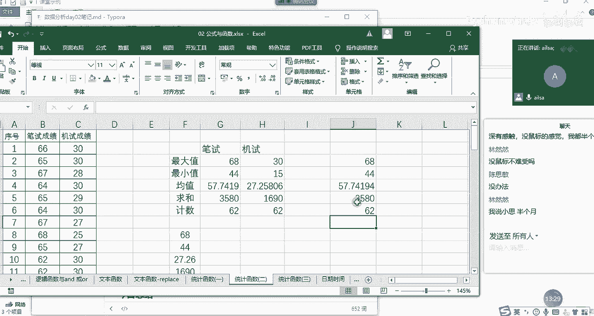

啊，然后我们再想一下哈，最大值max啊最小值幂，然后均值AVE2AGE。AVERAAGE均值，然后是sum求和啊，然后countt基数对吧？这种都是最简单最简的统计函数了。那它的组成部分都一样。

是什么呢？都是我们的数据区域啊，都是我们的数据区域啊，我这边就只写一个，然后这边啊我在啊最大值啊，最小值。最小值，然后是平均值。平均值啊，这是我们的求和。求和，然后是奇数啊，对吧？奇数啊。

这样的一个计算方式啊就可以了。好的，那我们啊那我们10点38。我们休息一下啊，休息10分钟啊，休息10分钟，然后到呃到50啊，我们到5010点50集合啊，不有什么集合，10点50上课哈。

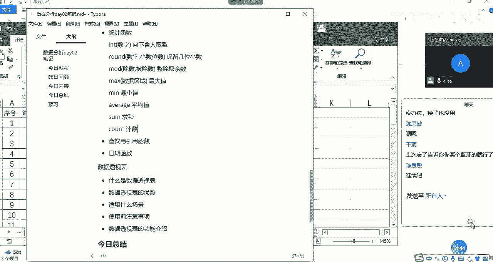

Yeah。