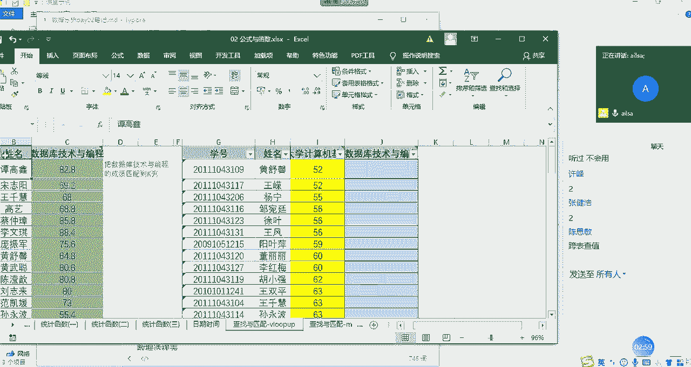
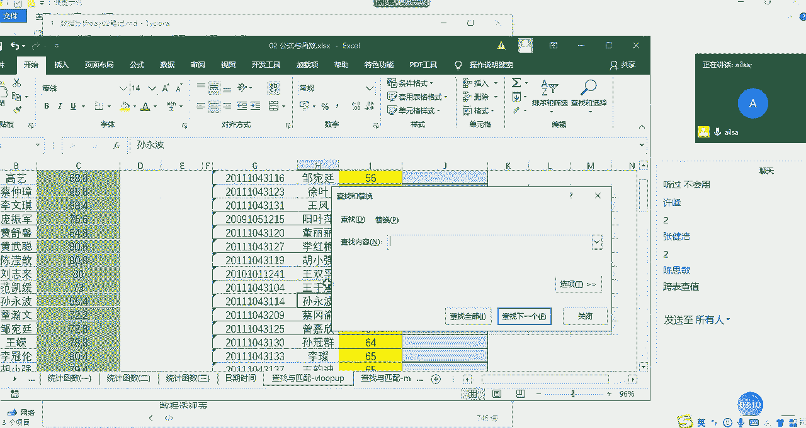
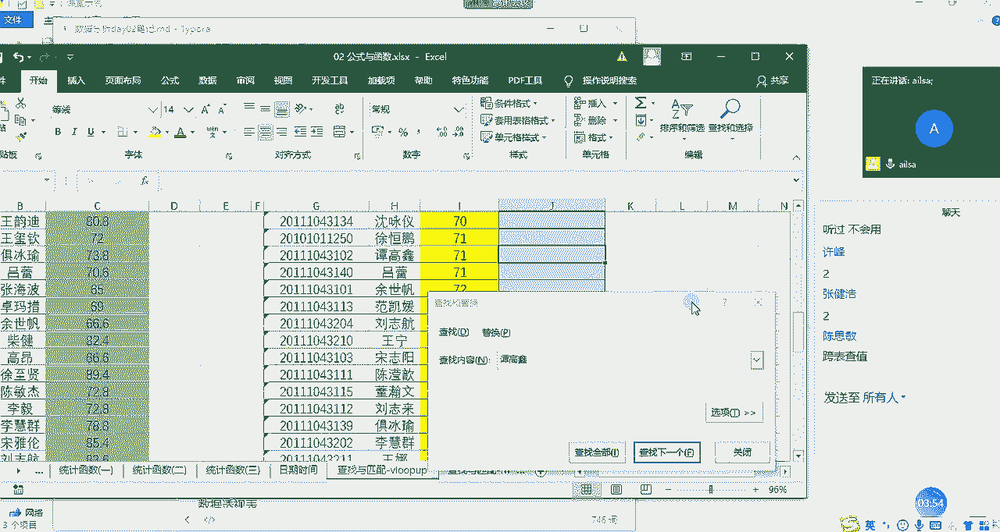

# 【python数据分析精华版来了（附文档代码）】10小时学会Python数据分析、挖掘、清洗、可视化从入门到项目实战（完整版）学会可做项目 - P12：07 查找与匹配函数 - Python万能胶 - BV1YAUuYkEAH

啊，我们的查找与引用函数了哈，日期函数我们最后讲哈。

查找与引用函数哈啊OK我现在先不讲这个东西，我问一下大家啊，有没有人听说过welook up。有的话扣一哈，没有的话扣2。你看啊思米应该啊思米应该用过哈。

因为welook up函数在我们的呃它号称明星函数哈，也就是说几乎在很多呃工作当中或者很多岗位当中啊，很多做数据分析的做用excel的人来说，都是经常用到的。跟大家举一个就比较逗的事例哈。

我之前有个学生啊，然后呢嗯他嗯他也是想从事数据分析方向的一个岗位的。然后他在这，但是他在这学的是开发。然后来呢他在处理一些数据的时候，然后用到了welookup。然后他又找我。

然后我就给他家详细讲了一讲，哎该怎么去使用，注意事项是什么什么。然后他后来找了一份数据分析的工作。他跟我说，他前一个月全靠welookup支撑他度过的难关。然后就说老师你教的一个知识点。

竟然就是解决了我工作当中大部分的一个问题哈。当然了，他因为他刚去的时候呃刚去的时候是个小白嘛，所以说主要是做数据处理啊等等清斜啊这样的一些工作啊，那所以说这个函数还是非常重要的啊，大家一定要好好学哈。

嗯，那我讲一下这个函数的应用场景啊，什么情况下我们需要使用welookup呢？啊，就是比如说哎你想做一个啊一个表，哎，这个表呢它的数据源啊，是类似的啊，格式是类似的。但是它的数据源来源于不同的地方。

比如说有别的部门啊统计的有从系统中导出来的啊，但是它都属于同一类型。你比如说都是人员相关的数据，比如说成绩，你的大学的计算机的成绩，数据库的成绩，你的统计学知识的统计，这些成绩可能都来源于不同的系统。

然后你需要把它归纳到一个表中然后去看这个人所有科目的成绩，这样的一个需求的时候啊，那我们有的人说那你直接复制粘贴过来不就可以了吗？啊，当然也可以，但是你有没有考虑过一个问题。

我们在进行系统开发的过程当中导出来的人的姓名的。排序真的是一模一样的吗？不可能吧，对不对？有的是这个顺序，有的是那个顺序，有的是乱七八糟顺序，有的是按A到Z怎么怎么着，反正就很乱。

那我们如果说想从这边啊这边这个表在这里找到这个人，然后并把成绩。匹配过来的时候，那我们如果不会welook up的话，那我们只有一个个找啦，对吧？我们在这里面找到弹高新。

然后在这里面去找找啊找啊找controrl加F，对吧？有的人说哎，ctrol加F，我去找到它啊，我们可以ctrol加F一下啊，试试。

啊，要复制一下啊，稍等。那我们演示一下，如果说不会welook up的话，该怎么去操作哈，conttrol加C啊，对，control加F然后粘贴过来啊，看再看找下一个哎，找到了谭高新啊，非常好啊。

找到了谭高新，他的成绩是多少呢？我们看一下谭高新的成绩是呃82。8，然后我们就可以把谭高新啊，的成绩写在这里，对吧？82。8啊。

啊，谈高兴的成景，没有鼠标，真的好麻烦。我来一下。啊，这个时候我们在这里面写上82。8对吧？那这这这这个哎这种操数好像好像也行啊，但是真的真的好笨呐啊。或者说如果你的人特别多的时候，你一个个进行查。

岂不是哦要废了，对不对？啊，所以说我们面对这种情况，就是跨表的查值查就是你这个表达也可以。但是我们更多的是啊强调了它的一个匹配。哎，就是我从这边找到这个人把它的值匹配过来啊，就是我们叫查找与匹配啊。

这样的一个函数。那怎么来操作呢？首先。

我们在这里输入等号，然后输入我们的welookup啊welookup函数。然后我们看一下它它的函数组成部分。第一个是lookup value，就是你要根你要查找的对象是什么？大家可以理解为查找的对象。

这个时候我们可以根据学号进行查找，我们也可以根据姓名进行查找，但是有时候姓名有可能重名，对不对？所以说我们会根据学号，学号是唯一的啊，那我在这里演示的时候是根据姓名哈，因为姓名我这边都查过了。

都是没有重名的啊，这个都看大家的一个需求就可以了啊。我选择姓名，这就是我查找的对象啊，那既然你有了查找对象，你这个table杠 array，大家都知道ar是数组的意思。那我们再理解一下。

它就是列表的意思。那你在哪个表里面或者哪个表里的某个区域去找这个姓名呢？那我们是在哎这个表当中的这些区域当中去找。

对不对？那我们选中一下。

啊，我选到这里，然后这就是我们的查找区域，我们叫查找区域哈，查找区域。然后我们可以呃在这里写哈。然后第三个组成部分是什么呢啊？sorry，我写错了哈，这边应该是B列到C列哈，我们的查找区域啊。

它不是单独的一列，它是一个啊它是一个区域啊，我们查找的是从姓名开始后面的这些值啊，大家明白了吧。嗯那我们查找区域确定了之后，第三个组成部分是我们可以看到COL是什么意思呢？就是我们的collum。

就是我们的列啊index就是位置的意思numb哈，也就是说你在这个区域里面根据这个姓名去查找你最后想得到一个呃哪一列的值啊，我们想得到的是不是啊数据库与技术这样的一个成绩的值啊。

那它在这个区域当中是属于第几列，它是从一开始的哈，这是第一列，你选择区域的第一列。第二列，所以我们在这里面输入的是2。那第三个啊组成部分啊，这是第一个第二个第三个。

那第四个组成部分就是你的查找方式到底是近似查找还是精确查找那近似查找的话，就是它比如说这里面有黄的，它都会给你找到。那如果是精确查找，就是必须叫黄书心的，它才能给你找到。一般情况下。

我们再进行为lookup匹配的时候，都采用的是精确查找，因为模糊查查找的话，它的呃错误率太高了啊，一般选择是零啊，零作为我们的精确查找作为false零是false一为 truee啊啊。

我们这边看一下ent键。然后64。8，这就是我们找到的这个成绩，我再来解释一下这个函数哈。因为刚才有的地方稍微说的不是特别准确。首先第一个你要查这个姓名在这里面啊，它对应的值。

你是不是想要想要这样的一个效果？这个时候我们第一个组成部分就是我们的查找对象。第二个组成部分就是我们的查找区域。哎，那你这个你在哪个区域里面去找这个学这个姓名，并且你想找到什么值。

在这里面需要强调一下你的这个查找对象必须是在查找区域的第一列。什么意思呢？你是根据姓名进行查找的，你的区域不不可能要选择呃要选择ABC这三个列。如果你选择的话，那他就找不着，它就识别不了。

所以这个姓名必须是在你选择区域的第一列。嗯，啊，你根因为你是根据姓名进行查找的。然后后面的话，对应的是你到底想查找什么值。我们想查找的是这个成绩。那这个成绩在你选择区域的第几列，你要告诉他那。

这边的话它的列的选择不是根据ABC来言的，它是根据你选择区域的第几列。那默认是从第一列开始、第一列、第二列、第三列这样子。所以我们选择的是2。最后一个就是你查找的方式，你到底是精确查找还是模糊查找？

一般情况下默认的都为零，是我们的精确查找。我们按entt键。这个时候我再往下拖动的时候，大家会发现一个什么问题。我们这个区域是不能发生变化的，对不对？所以说我们需要加上绝对引用的符号啊。

加上绝对引用的符号。啊，按F4。ant键好，这个时候我们再双击一下。说一下，这就我们就达到了我们所想要的效果。可能有人说哎，这里面会有报错啊，那当然了，你在进行一个welook up匹配的过程当中。

肯定会有没匹配上的。这个很正常。因为他有可能这个人没有成绩，或者还有可能是因为你进行的是一个精确匹配，有可能这里面的姓名加了一个空格呀啊，你看不到，所以他也匹配不上，你需要进行一个一一的核查。

然后现在我问一下大家，对于welook up有什么问题没有啊，有问题就说啊，因为这个稍微有点难。OK啊，有问题有问题扣2，然后抛问题，没有问题扣1。啊，这个一定要下去的话，一定要练习哈。

我们也有对应的一个练习题啊啊，这个大家倒是放心啊，绝对让大家练够了。今天的作业会有点多啊。所以做好心理准备啊。好的，那没有什么问题啊，其实你们应该再抛出一个问题啊给我。如果能抛出这样的问题的话。

我觉得你们的思路还是能打开的。什么意思呢？就是说啊我们在进行数据匹配的过程当中哈，假设啊假设这两张表都很重要。我既然是以这个表匹配为主的那会不会存在在这个表里没有这个表里有的成绩，而我却没有统计上呢？

啊，会存在这样的问题吗？啊。啊，如果认为会存在的话，扣1。然后啊对会存在。那我们该怎么去解决呢？嗯啊我们的解决方案有两种啊。第一种的话，如果别人就告诉你告诉你说，我只统计这些人的成绩，那你就不用管了。

对不对？那如果别人告诉你说啊，我需要看数据库与技术整个的一个成绩体现的话，我们还需要在这里啊重新匹配一下，看看啊，看看哪些人漏掉了。那就是哪些人报错了。如果他报错了，说明他在这里没有。

你就需要把它复制过来啊，进行一个结合啊，这个大家能听明白吗？思敏能听明白吗？就是再反向匹配一下，如果没匹配上，说明啊这个人在这里没有，你把它复制过来就可以了。这主要是根据实际的业务场景啊来去区分哈啊。

其他人呢其他人听明白了，给我扣个一，我们就接着往下讲m函数。OK哈O那我们等会儿讲完了match函数，再给大家做这个笔记哈。match函数呢它也是匹配函数。

但是它跟welook up之间有什么不一样的地方呢？首先啊它比welook up要简单啊，我告诉大家，它所应用的场景是什么样子的？就是就跟刚才有点像哈，其实刚才我说反向去匹配。

这个时候可以用match函数什么意思呢？就是说。假设这个这一列当中啊有这么多人啊，这一列当中也有这么多人。现在我想知道啊我想知道H列啊啊，这边应该是应该是呃IF列F列的姓名在A列啊，在A列的位置。

就是什么意思呢？就是说呃我想知道这些人。好，这些人是不是都存在在这个表里，也就是进行一个相互的啊相互的匹配。看呃这里的这些人是否都在这里或这里的这些人是否都在这里，就是两个表进行一个互相匹配啊。

看有没有差异的人员，然后进行一个的操作，我们先给大家做操作哈，大家看一下就明白了。你比如说呃你比如说现在我在这里写上match函数MAT它返回的就不是值了，它返回的是一个位置啊。

它的第一个组成部分还是look up value，也就是我要查找的对象啊，还是一样的。第二个就是look up杠 array，也就是我查找的区域。啊，我们在这个区域进行一个查找。

那第三个组成部分就是你的一个我们看一下哈，我们把鼠标提供到这里。第三个组成部分就是呃你的大于小于等等这些啊，我们就我们一般情况下使用的都是精确匹配哈，我们直接选择零就可以了。

那我们在这个过程当中需要对我们的数据区域进行一个绝对引音的啊使用哈，所以加上X啊，然后我们按右括号ent键，然，我们看一下我们看一下这个返回的四到底是什么？柳完海，对吧？它的它在这个位置。

它这个四代表什么意思呢？稍等哈，我们拉一下。

我们会发现哎这个四好像是对应的第四行吧，它在整个数据区域的，是不是也是第四行啊？那它这个四其实返回的就是什么？他所在选择区域的位置，他返回的是一个位置，如果说他能够返回这个位置的话。

那就说明他在这里面是存在的。如果他返回的不是，那说明这个人是不存在的。你比如说哎后面这几个人他在这个表里就没有返回位置。那说明这个人在这里表里就不存在，我们就要去核对这些人到底是什么情况啊。

这样的一个操作手段，就是去判断两两个不同的呃就是表之间他们的人员的差异，或者是说他们的数据的差异啊，这样的一个应用场景，他返回的是。这个数据在这个选择区域里面的位置，如果说能返回位置，那说明存在。

如果不能返回报错了，那说明不存在啊，是这样的一个结果。大家对于match函数啊能够理解吗？理解扣1。

啊。啊，如果能理解就扣一哈。啊，自己在自己可以手动的操作一下哈。

嗯，它主要就是为了匹配两列之间的一些呃存在与否的值，然后返回的是它的位置，记住这一刻就可以了啊。嗯，OK哈，那我看都都差不多了，我们这边记一下笔记，嗯，查找与引用函数，我们啊。

讲的是we look up。we look up一定要练哈。啊，我讲的是最基本的用法哈，它还有跟其他函数进行一个嵌套使用啥的啊，这个我们只要知道函数的一个用法之后，后面就可以自己去琢磨去研发了哈。

它这个其实。啊，其实是师傅领进门修行靠个人啊。we look up的第一个组成部分就是我们的查找对象。第二个组成部分啊，我要加几个逗号。第二个组成部分就是我们的查找区域。啊。

第三个组成部分就是我们的呃呃就是我们的要返回的返回的值啊所在。所在区域第几列？出区的列。啊，所区的第几列吧。第几列啊，然后最后一个就是查找方式，精零代表精确，一代表模糊。嗯，查找方案。

这是我们的一个呃查找。匹配函数。还要匹配函数。那match函数呢，我们可以对比一下看看啊。那也吃韩暑。它第一个组成部分就是我们的查找对象。对吧然后第二个组成部分就是我们的查找区域。第三个组成部分啊。

你看它没有返回的例哈，它直接就是啊查找方式。因为它不需要返回值啊，所以它不需要指定你到底给我带过来呃，哪个哪返回哪个值。他只要说呃你到底查找的方式什么就可以了，所以它少一个参数。OK啊。

这就是我们的呃呃怎么写这来了？没有鼠标。没有鼠标没有关系。OK我们的match函数啊放在这里啊，这就是我们的一个也是查找与匹配函数。好吧嗯。下面我们讲最后一个日期时间函数哈，让我们断一下。

