# 【python数据分析精华版来了（附文档代码）】10小时学会Python数据分析、挖掘、清洗、可视化从入门到项目实战（完整版）学会可做项目 - P15：10 数据透视表简介 - Python万能胶 - BV1YAUuYkEAH

OK好的，同学们，那我们啊接下来讲解我们的数据透视哈，好像很官方的样子。啊，没关系啊，哎，我们讲解数据透视。这个数据透视是一个什么东西呢？其实啊我们通过一个呃需求来给大家讲一下。

我们在实际的啊工作当中如何去发挥数据透视的一个优势的，好吧。还什么样的一个业务需求呢？首先我们看一下，比如说哎领导给了你这样一张表，我们可以看出这个表大家很熟悉了哈，之前也见过，哎。

就是某一个地区啊很嗯这个城市，然后它的不同的品牌的不同的车型，它的一个销销售数据，对吧？销量收入这样的一个数据。然后领导啊。假设啊假设我是你们boss。啊，我的elsa是我们的boss。

然后呢呃我给思敏发布了这样的一个任务。我说思敏呢，你把这个哎你把这个数据给我整理成这样行吗？哎，我明天要给领导呃给我的呃客户，然后去展示一下我们整个的一个呃公司的业绩啊，你接收到这个需求之后。

大家接绍这个需求之后，想一想我们该怎么去实现啊，我们啊的一个呃效果，我用我们经常之前学的那些内容的话。嗯。买不起哈。没关系。买不起没关系，现在买不起，不代表将来买不起。啊，大家有什么好的思路没有啊啊。

现在畅所欲言啊，你觉得我想要把这种一种形式，然后实现成这样的话，该怎么去操作？相当于就是说我对每某个品牌，然后进行一个汇总啊，求它的销量和收入的总和，对不对啊？有没有人有思路？啊，大家大家都叫思思啊。

好亲静哦。啊，不是welook， look up是匹配的，这个是有点计算的。你比如说奥迪这里面是一条条的数据，但是在这里面你比如说这个80，它来源于这些啊所有的数据的加和啊。对吧。啊。

还有没有人有其他思路？啊，对啊，你看。啊，郭晨就想到了sum if，因为我们有点类似于条件求和，对吧？哎啊，OK思敏说的也没有问题哈啊，我们看我们先说s if。它这个是不是我们的条件是我们的品牌。

然后我们的求和区域就是我们的销量和收入，对吧？这是可刚好可以用到我们刚学的一个someum啊，然后我看雨顶的思路，按照品牌进行一个排序，然后分表插入空行啊，筛选复制啊，思敏呢是筛选复制啊。

相当于雨鼎和思敏的思路都是对于操作啊，操作的方式，然后进行实现的那我们一个个来看啊，我们先看第一步就是说我们想实现这样的效果的话，我们用最开始的那种呃方式啊，就是我们筛选啊，我们就用筛选，我们筛选奥迪。

奥迪奥迪是个好车啊啊，对我们筛选奥迪，然后把我们的销量呢拉一下，来看看。看看多少个，哎，这里面哎，你看我们的excel里面这边是有记录的，求和是96，对不对？哎，那个计数是6啊，怎么着？

那求和我就可以把这个销量的和填到我这个表里面。奥迪啊，奥迪哎销量是80哈，我们就可以可能我后面数据修改的话，我们可以这样填到96，然后收入的话，我们再进行一个加和。哎，我们再拉一下。

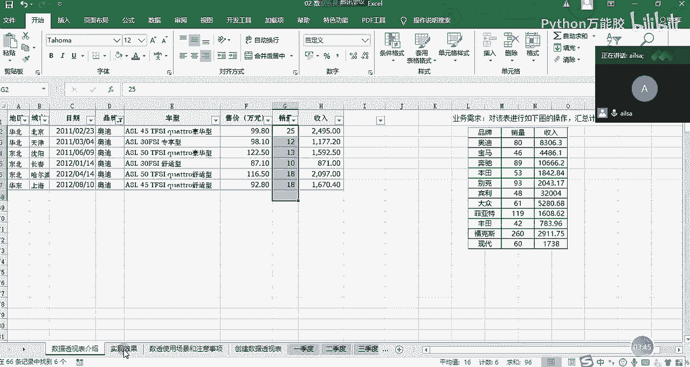

我这边数据可能会有变动哈，这个没有关系，9903。1，然后我们再填到这里面是吧？一个个的进行每个品牌的一个填写就可以了。那如果说啊我们的品牌就这么多。那我这么来实现的话。

也大概10分钟20分钟也就实现了，对不对？但是我们会发现我们在进行这样的操作过程当中来回的去进行手动的填数的话，其实是比较麻烦的，而且还容易出错。

所以我们第一种方法筛选的话是相对来说啊最嗯啊最直接也是最基础的一种方法啊，相对来说没有那么高效。那我们再看第二种方法，第二种方法，刚才有人说了哈，我们啊间浩说的，我们用的是some if函数，对吧？

我们用函数来实现，我们刚学过，那我们就练习一下吧，好吧。

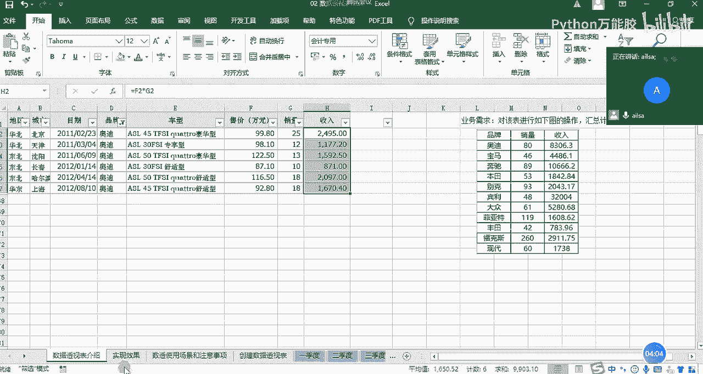

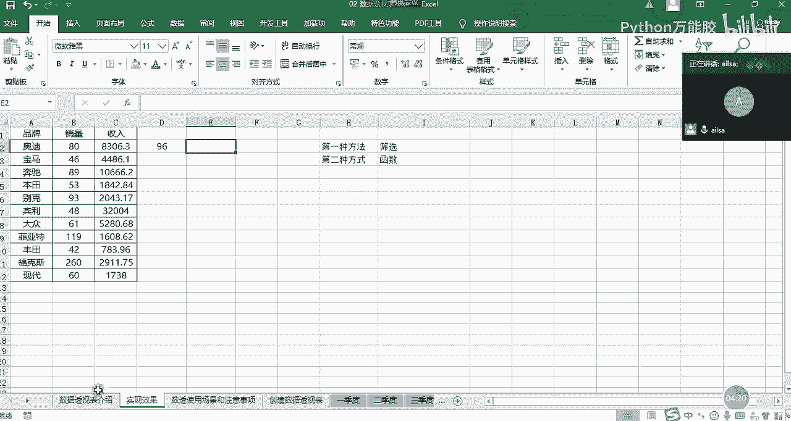

怎么来做呢？首先呢我先输入some if函数，因为它只有一个条件，就是品牌。然后我们的区呃就是我们的呃这个呃区域，也就是我们这个条件啊，这个品牌所在的区域是在这个工作表当中。你看我们刚才讲函数的话。

从来都没有讲过跨工作表这样的一个情况。现在我们点选它。然后哎呀不好意思啊，我这边需要把这个先取消掉。

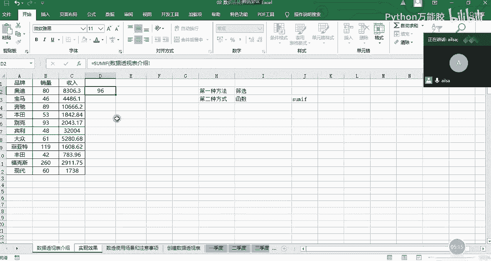

不然的话，这区域选择会存在问题。

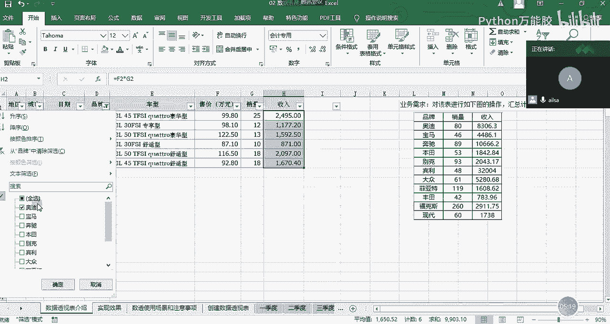

啊，大家大家别看我这个操作比较笨哈，是因为我没有鼠标啊啊，所以说我用键盘的话会稍微麻烦一些啊。然后我们的第一个是我们的区域啊，我们选择我们的品牌，哎，我拉到后面。

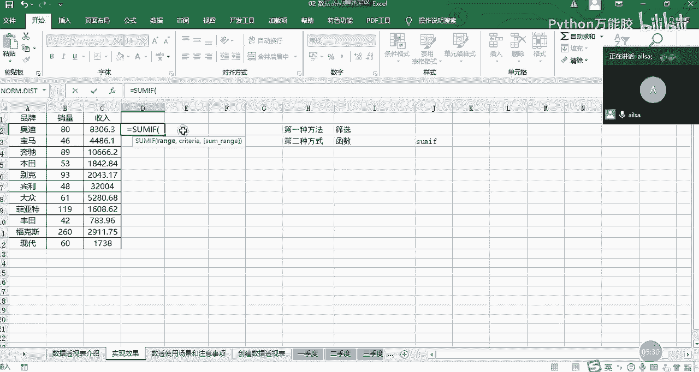

到这里。然后这是我们的品牌区域，然后我们再回到我们这里来，大家看到一个。

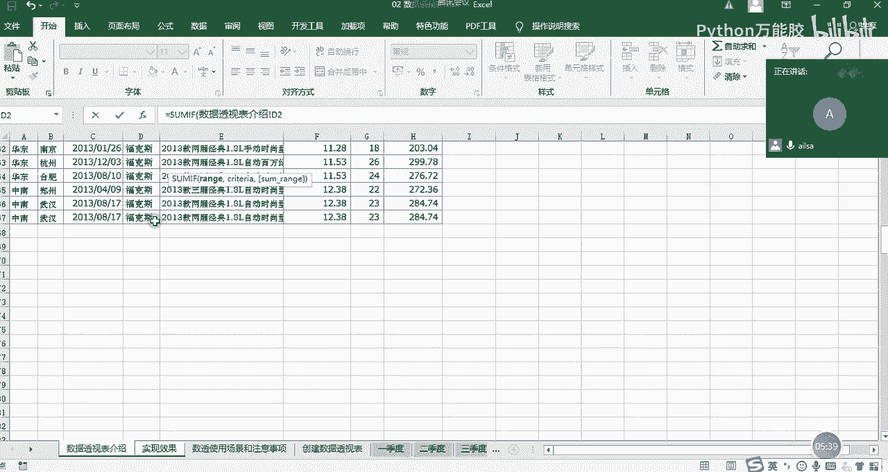

出现问题了啊。啊，这应该是数据透视表介绍啊的一个第二。我刚才切回来的时候。可以改哈。数据我本来想讲一下这个数据透视表。介绍啊啊第二啊第2到第67，这是我们的一个呃条件区域。我们可以发现。

在不同的工作表之间，它啊如果说不在本工作表下面，如果你使用公式的时候，它会带上这个别的工作表的名称加一个叹号，这个地方大家不要随意更改，好吧嗯。知道是这种格式就可以了。然后第二个就是我们的求和区呃。

就是我们的条件区条件，那么条件就是奥迪，对吧？那那这个时候他也会在这个里面加上这样的一个呃效果啊啊，就是我们的整个的一个工作表的名称。然后第三个就是我们的求和区域，求和区域应该是啊。我们回到这个表里来。

然后选择啊选择我们的求和区域，应该是销量和收入。那我们需要一个个进行啊选择这个时候我们选择它啊，然后我们按右括号就可以了。我们的这个销量就出来了。我们看96是不是跟刚才是一样的啊，然后往下拖动啊。

这个时候我再往下拖动的过程当中，大家应知道我们应该注意什么吗？啊，我们应该注意我们的区域是不发生变化的，所以需要在我们的区域这里加上绝对引用的符号啊，这个时候我们按F4哈。

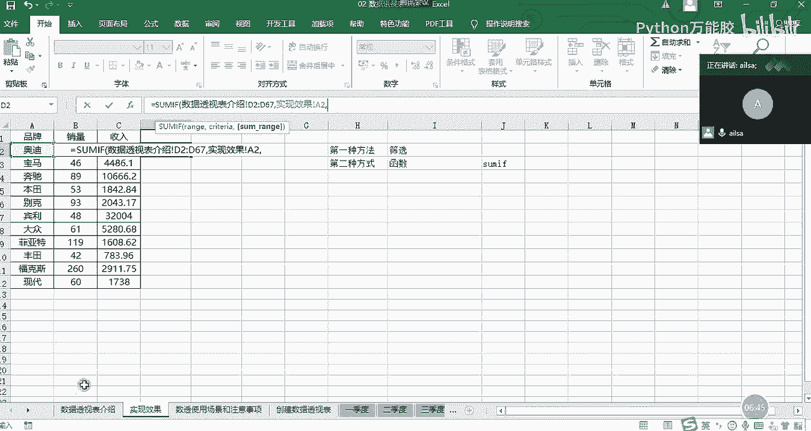

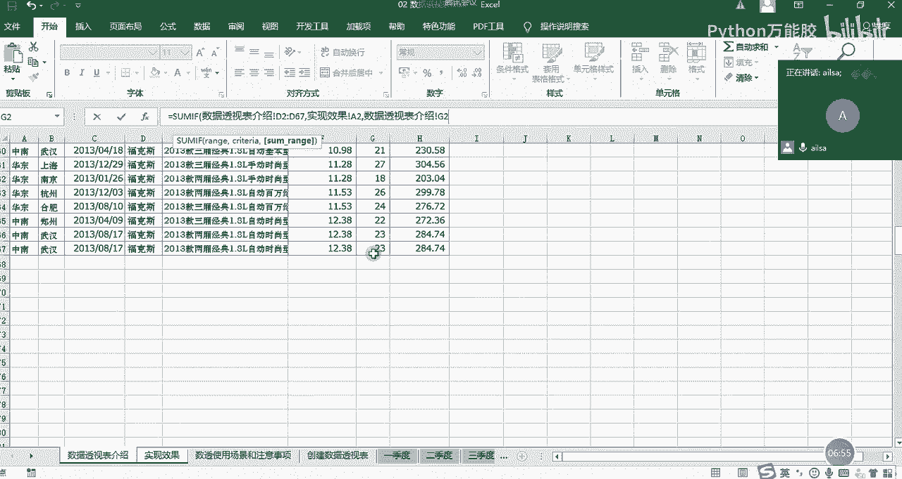

F4，然后还有我们的整个的一个求和区域也是不发生变化的。稍等一下。求和区也是不发生变化的啊，这样，但是我们的这个条件，奥迪、宝马、奔驰，这个其实是希望它发生变化的。所以这个我们就不动。哎。

我们按entt键，然后再往下拖动，就实现了我们所想要的效果。你看是吧，就实现了我们所想的效果。你看下面都是因为数据可能会有更新，所以会有略微不同。这个倒没有关系。然后这是我们的一个销量的计算方式。

那下面就是我们的呃收入的计算方式。我们看一下它俩的区别在哪呢？它俩区别就是我们的求和区域不一样，从G变成了H，对不对？那我们就改一下就可以了。这个时候我们如果想复制这个公式的的话，我们是双击进来啊。

或者是你单击进来也可以进行编辑状态。然后把这个公式选择哎，选择了之后，cttrorl加C大家选择完了之后，记得一定要按一下ESC键哈ESC键，然后让它还原回来，不然的话你这个公式有可能会啊被覆盖啊。

不信你可以自己试试一试哈啊，在这里面我复制进来，复制进来之后，我需要把G改成H就可以了啊，G改成H。改成H啊，然后这个时候就是我们的整个的一个呃销售额的一个计算啊，这是我们用函数来实现的。

是不是相对来说也比较厉害。但是我们会发现我们在进行一个操作的过程当中，区味的选择呀，然后这等等这些的时候，其实还是略微有点麻烦，对不对？OK我看一下大家的反馈啊，大家对于刚才我讲的这个操作啊。

理解的扣1。

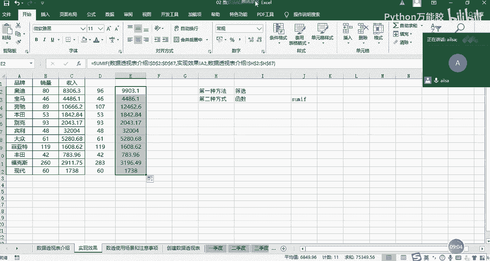

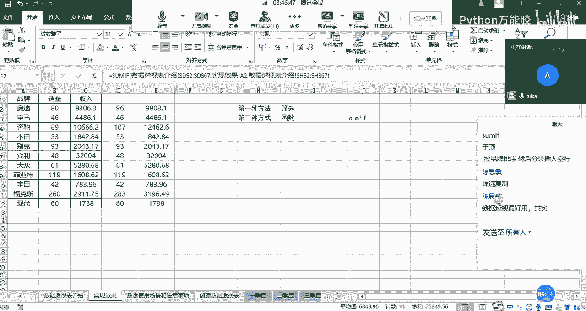

嗯，理解的扣1OK那我们讲了这两种方式之后，那接下来我给大家讲一个啊更高效的方式，就是我们的数据透视。我们看看它是怎么来实现的。数据透视的实现方式啊，第一步啊，我们可以在啊这里啊这里来实现。第一步。

我们需要在把我们的数据哈，把我们的鼠标啊不要定义在不要放在这里，也要放到我们的数据区域当中，你不用选择不用全选你的数据区域，你只要放在这里，它就知道你想干什么了。然后点击插入选项卡下面的数据透视表。

点开了之后，我们看一下这个创建数据透视表的一个呃，我们需要动的地方。首先第一个就它的选择的区域，它默认给你选择了A一到H67，我们看一下是不是我们所想要的效果。A列到H列是没有问题的。是啊。

是不是到67呢。哎呀，也是就是我们整个连续的数据区域。OK没有问题，这是一个我们需要动的点。第二个的话就是我们选择放置数据透视表的位置。它你如果选择新工作表的话，它会单独给你放一个新的工作表。

但是我这里为了演示，我就给大家放在当前现有的工作表当中。如果你选择了这个之后啊，你需要告诉它一个位置，就是说你要放在这个excel当中的哪个地方，那怎么告诉它呢？就直接选一个d位置就可以了。很简单哈。

我们选择这个位置，哎，就出现了它哎这6这个位置，然后我们点击确定。点击确定了之后啊，我们可以看出来它这边有一个数据透视表字段，我们该怎么来实现呢？哎，我给大家先啊进行第一步操作啊，因为我现在没有鼠标啊。

比较费劲哈。我们先看一下，我们想要的是品牌对品牌进行一个分类汇总，对不对？那这个时候大家看我的操作，我把品牌拖到行方向。啊，我们把这个拉一下。哎，它这个行标签里面就出现了各种品牌，对不对？

假设我把它拖到列方向上。啊，稍等啊。我把它脱掉哈，如果说我不想要它了，我就可以把它。脱掉。啊啊删除字段这个时候就没有了。那我如果把品牌啊拖到列方向上。还好吧。啊，这个时候他就会在列方向上去出现这个数据。

对不对啊，那我们再把它删掉啊，删掉，移输这个字段。那我们还拖到这个行方向上，我们看我们有了这个不同品牌的一些分类之后，我们想对这些分类进行求和的操作。那对哪些字段进行一个求和呢？是对销量和收入，对不对？

那我们把销量拖到值方向，我们看一下哎，它这个销量是不是已经求和了，它这个求和是怎么来的呢？其实是在这里有一个设置啊，设置值字段设置啊，这里面又可以计算的类型求和技术平均最大最小乘积。你看是不是特别方便。

也就是说我们对某一个分类进行这么做的一个计算，它都可以满足，现在我们默认的是求和，那刚好满足我们的情况是没有问题的那接下来我们还要对收入进行一个求和，我们就可以把收入拖到我们的值方向。哎。

销量和收入都有了，看到没有？那其实我们从简单的来说的话，我们通过拖拉拽的形式，就可以实现对数据的进行一个分类汇总，求呃分类汇总的计算。这种形式啊或这种方式就叫做数据透视啊，通过对数据的呃呃一些整合。

然后达到我们所想要的效果啊啊，这个听明白了没有？嗯听明白给我扣个一。听明白了哈，这就是这就是我们数据透视表的一个用处啊，它就是用来进行快速的分类啊分类汇总啊进行一个计算啊。

这就是它的一个呃有一个使用的场景啊，那对于数据透视表而言哈，你们在后面学到on的时候哈，就是后面讲on数据分析的时候，你就会会发现一个很大的特点。就是啊它有一些操作方式真的跟excel好像好像啊。

因为在啊on里面它也有数据透视，它也有分组啊，分组叫group然后数据透视的话叫table还是table pIOT啊，你们到学到的时候就可以知道了。真的啊你学了excel之后，你在学那些东西啊。

就简单了很多。因为你的思维已经定为到这种二文表的一个形式了。那我们讲了数据透视啊，怎么去创建的啊，这样的一个形式之后，我们再讲一下数据透视它的一些满足的条件哈，或者是我再介绍一下这个界面。

首先行方向你拖动了字段之后，它会在行的这个地方显示。如果你在列方向去放的话，它会在列方向显示，然后值这里面的话，它是根据你不同的分类进行一些相应的计算。你到底是求和计数最大值最小值。

大家先记住这三个简单的分类。然后如果说你不想要了，你直接把它拖出就可以了。如果你想要你把它拉进来啊，拖拉拽来的形式很简单。那我们在使用数据透视的时候，有什么注意事项呢？啊，那我接下来说一下啊。

并不是所有的数据都能够满足做数据透视的一个要求啊。首先的话，因为我们会发现数据透视，它其实是对于列明啊有一定要求的。因为它列名要放在这里进行一个分类。所以说我们的第一个注意事项，就是它的列明不能为空。

不能重复。因为你重复了，它也识别不了，你到底想干嘛，为空的话，它也不好去识别。所以说列明要保证完整啊，而且不能重复，这是第一个第二个的话就是我们尽量在我们的数据表里面不要有空值啊，不要有空值。

然后这样的话就是避免我们在进行数据透视的时候出现呃就是就我们就可以叫残缺值，或者叫嗯错误值这样的。所以说我们可以填充为0啊，保证我们的数据完整，就是这里面的数据的话就有点。

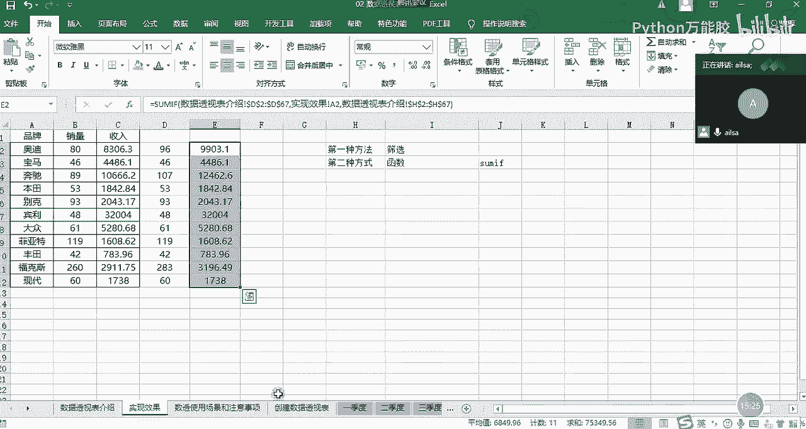

因为这里面设置了哈设置了一个零就显示斜杠的这样的一个操作哈啊啊所以说啊我们尽量把它保持完整啊，就可以了。就跟我们数据库里面的数据一样啊啊，就是正经的流水流水账的那种啊标准的一个数据格式。

还有就是不能有合并单元格。因为我们都知道哈，比如说在这里我给大家啊在这里我给大家加了一个合并单元格，我给大家看一下合并单元格的原理啊，是什么？我们把鼠标定位到这里之后，我们看到这里15啊。

15代表的是这个合并单元格的上面的这个也就是说你在所有的合并单元格当中，它只会默认左上角的这个东西。如果是两列的话，它也会默认左上角的这个东西。那如果对于多列而言，其他的列，它会默认为零啊。

而且它会影响到。还数据透视的一些操作啊，就比较麻烦一些。有可能它的车型啊就有一个为空的啊，你就不知道是什么东西了。所以说啊不能有合并单元格。还有最后一个就是要保持数据的类型的一致，特别是数值型数据而言。

为什么这么说呢？如果说你这个里面的数值，它你存了文本格式。那你在进行计算的时候，它是不参与计算的那你这个你算出来的数据就是就是错的啊，所以说尽量保持我们的数值型的数据都是数值类型的，而不是文本类型。

特别是文本哈，它完全识别不了啊，完全识别了呃那个文本类型的啊这样的一个数据。所以你只要满足这几个条件，那你在做数据透视的时候，它就是啊比较完整啊比较正确啊。

然后也是比较能够符合我们所想要的效果的啊这样的一个结果啊，数据透视有这几项要求。那我最后再说一下数据透视的一个应用场景哈。什么时候哎，我们需要用到水透式啊，往下。

稍等哈，我看一下嗯。

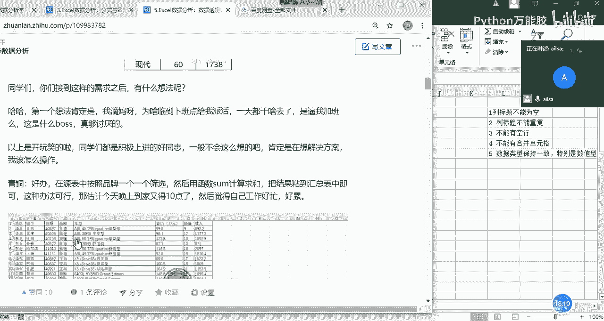

啊，首先呢就是我们的数据量比较大啊，我们在进行函数的计算或者操作的计算的时候比较繁琐的时候，我们就需要用到啊数据透视。第二个就是我们希望快速的制作整理啊，分析各类报表的时候也是需要的。

然后还有就是数据源经常发生变化，并且要经常分析和处理最新数据的时候啊，我在下午的时候会给大家讲我们如何进行数据的更新啊，数据源的选取啊，不等这些。然后还有就是想快速动洞察数据背后存在的意义的时候。

我们就可以用数据透视。其实简单来说，它就是对数据进行一个快速的分类汇总计算。然后达到我们所想要效果的这样的一个目的，这就是我们的数据透视啊，啊，那我们看一下哈啊什么是数据透视表啊啊。

我等会儿会把这个补全。我在这里就不详细说了。然后大家对于数据透视表的创建，有什么问题没有。

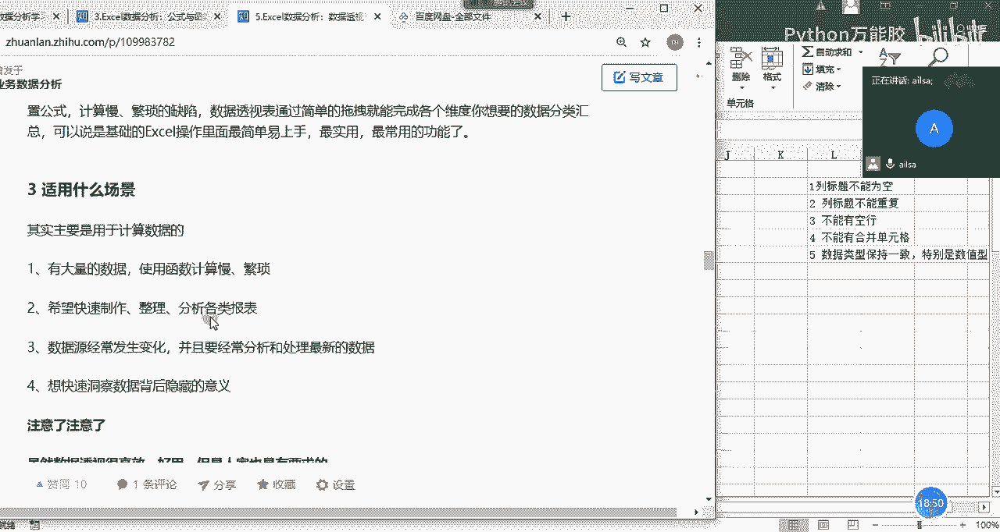

嗯，没有问题扣1。其实特别简单，对吧？你直接选择插入，然后选择数据通时表，然后再把你想要的字段拖进来就可以了啊呃三步走啊就可以了就可以实现了。好吧啊，OK哈，那我们下午的时候啊。

会讲解数据透视表的其他的功能。然后包括我这个知乎文章里面写的所有的功能，我们都会讲完。然后讲完之后，然后大家就可以写作业了。然后下午我们是三点开始啊。

大家对这个有什么问题没有？我先把。