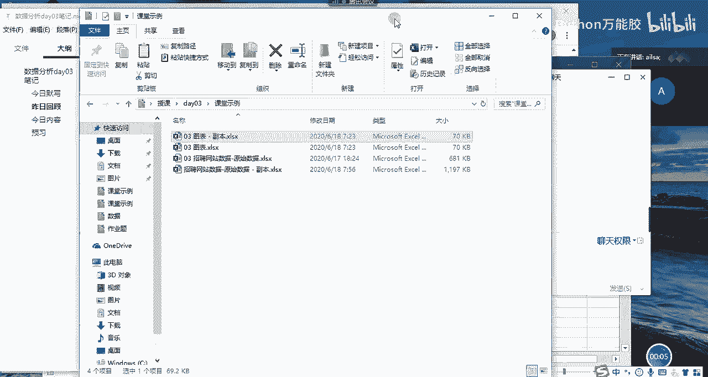
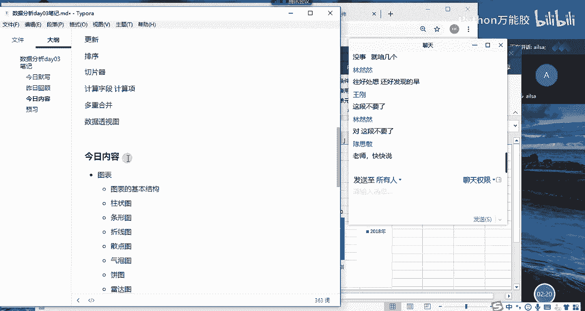
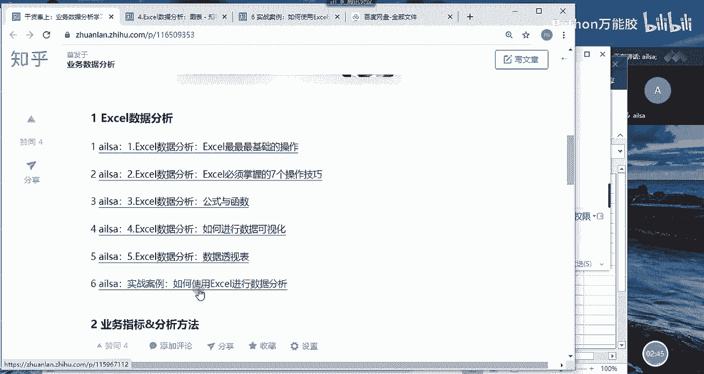
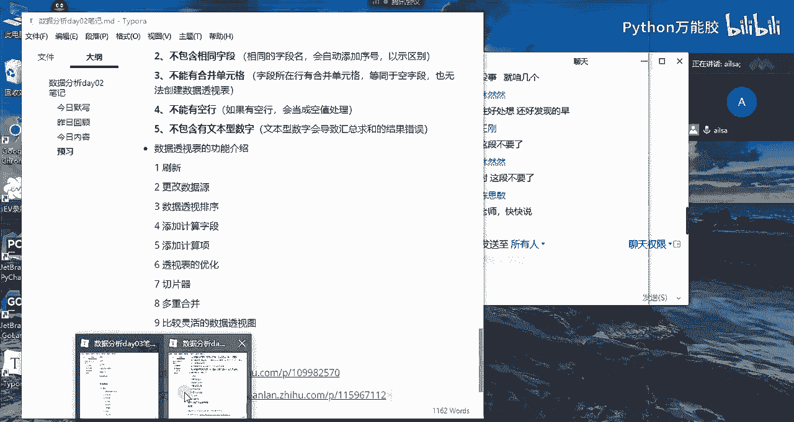
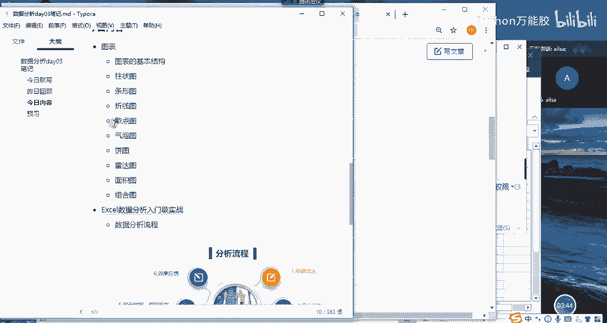

# 【python数据分析精华版来了（附文档代码）】10小时学会Python数据分析、挖掘、清洗、可视化从入门到项目实战（完整版）学会可做项目 - P19：01 昨日回顾&今日内容 - Python万能胶 - BV1YAUuYkEAH

我们嗯。

哎，我我先看一下啊，他在这里啊。

主要是因为我们是第一期上课，所以说呃我尽量把我所讲的内容都录下来啊，都录下来，然后以方便后面的学生去学习啊。OK哈，没有关系哈，我们进入到今呃进入到我们的昨日回顾哈。我们看一下昨天我们都讲了哪些内容哈。

我们主要讲的是两大块啊，一个是公式和函数，一个是我们的数据透视表啊，那对于公式与函数而言呢，我们主要讲的就是啊地址的一个引用是一个很重要的点。那还有就是我们按照不同的类型分为逻辑函数文本函数。

统计函数查找与引用函数日期函数，对吧？😊，那我们每一个类型的函数也都介绍了相关的常用的操作哈，相信大家昨天也都已经嗯有了一个很全面的认识以及练习。啊，那这第2块内容就是我们的数据透视表。那数据透视表。

它是一个快速的对数据进行一个分类。然后汇总计算的啊一种操作方式，它在我们的excel当中属于比较灵活的啊高效的一个使用方法，也是我们在工作当中非常常见啊和常用的一种啊使用方式啊。

所以说啊我们要学它这样的话，我们的工作效率就会提高很多。那它有它有它自己的优势，也有它啊使用之前的一个注意事项。我们在昨天都已经说过了，还有它常用的一些功能啊，包括我们的更新操作啊。

排序操作切变器的一个操作，以及如何计算字段计算项，还有多重合并和数据透视图这样的一个操。做啊啊，所以说这这就是我们昨天讲的内容哈，我们可以看出来昨天讲的内容其实。啊，其实比前天量要大一些。

但是也没有相对来说也没有那么多哈啊，所以说呃我们还是稳稳稳的啊往前进行哈那这是我们昨天讲的内容，我们看一下今天我们讲什么内容哈。我们今天讲的内容就是图表了啊，那我跟大家说一下。

我们之前在看我们整个的一个呃数据分析的一个呃课表的时候，我们就会发现我们讲excel数据分析的话，就讲操作公式与函数以及数据透视表，还有最后一个就是图表。我们讲完了之后。

我们excel相关的内容就已经讲完了。那接下来就是这个案例的话，就是我们对它进行一个实际的练习。那我们今天就进入到的是呃excel的最嗯。

嗯，excel的最后一项内容啊，也就是我们的图表操作。那我们图表的话主要讲的是首先我们会介绍一下图表的基本结构。然后我们会介绍不同类型的图表有哪些呢？

有柱状图条形图啊折线图散点图气泡图影图雷达图面积图和组合图，这些图介绍完了之后啊，大家对于图表的创建的话，应该有都已经很熟悉了。那么我们讲完图表之后，我们会讲一个案例。

这个案例呢就是针对我们从boss上，然后采集下来的关于啊我们数据分析师招聘岗位的一些信息。我们针对这个数据，然后结合我们之前所学的所有的内容啊，进行一个excel的数据清洗，然后以及简单的数据分析。

这就是我们今天讲的主要内容哈。O我断一下。

