# 【python数据分析精华版来了（附文档代码）】10小时学会Python数据分析、挖掘、清洗、可视化从入门到项目实战（完整版）学会可做项目 - P20：02图表1 - Python万能胶 - BV1YAUuYkEAH

嗯，我们在讲图表之前呢，我先给大家举一个简单的例子啊，为什么我们要学习图表，我们做数据分析，不是对数进行一个处理吗？那我们做图表的意义何在呢？我给大家举一个啊。

就是在我们日常生活当中啊的一个小小的实例哈。你比如说啊你比如说你想描绘一个啊一个动物，比如说就猫吧啊。

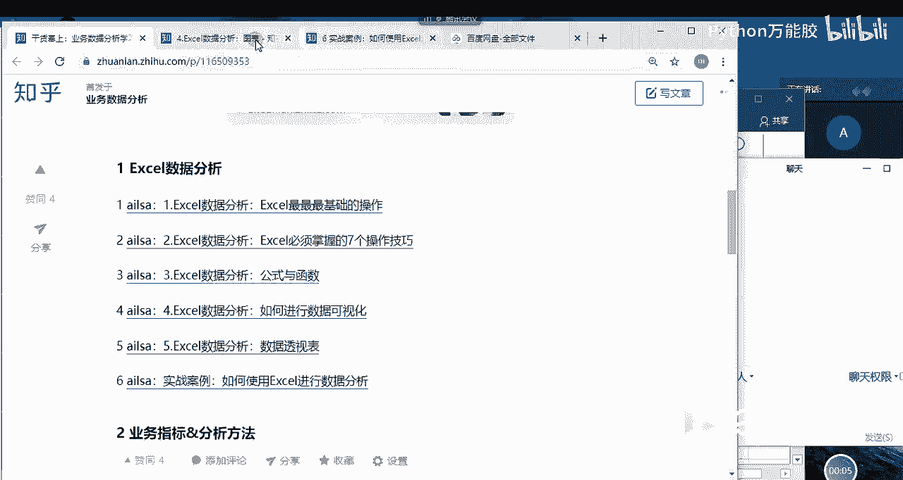

呃，他的一个呃就是整个的一个呃就是我们给别人描述的时候啊，我们家猫特别特别啊毛软软的，然后一就是然后特别活泼，然后特别可爱。然后别人说了一大堆。你也想象不出来它到底有多可爱，对不对？

你也没有想购买的欲望，你也没有想养养猫的一个欲望，反正就是他描绘的这些东西啊，就这个语言的表达能力再差一些的话，你完全都没有吸引力，但是呢如果这个人啥都不说，然后就把啊就把他家的猫。

或者是他养的猫这一组照照片啊，给你放出来之后，其实它什么话都不用说，你会觉得说我去这个也太可爱了吧，是不是这个小猫好可爱，然后就特别想养，对不对？然后其实这就是一个什么样的一个效果呢？其实。

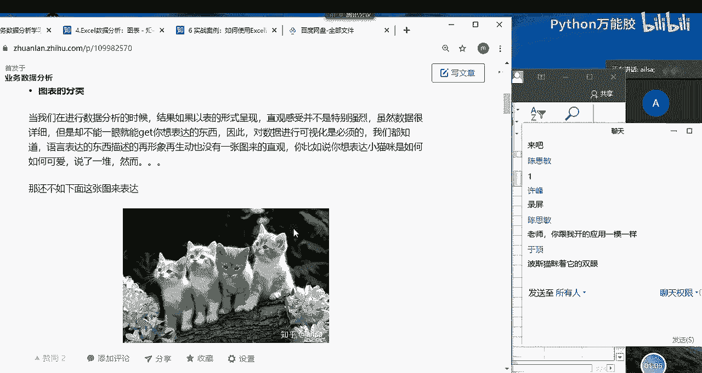

他就是嗯就是我们用语言表达的一个给人的一个效果，跟呃照片给人的一个效果的一个冲击力完全是不一样的。就是图片它可以给人的一个视觉冲击是很强的，但是你给别人描述一大堆，其实效果也不是特别明显。

这就是啊这就是我们学习图表的一个意义所在。那我在给别人看一堆数的时候啊，你比如说哎我打开这样一张表啊，我在给别人看这一堆数的时候，其实看不出来什么样的一个效果，对吧？别人也不知道你到底想表达什么意思。

那如果说你把这个数做成一个图表的话，哎，那别人就知道一眼就看出来啊，这个广州地区的一个营收情况是比较好的。而且他还也愿意去看这样的一个图表，因为你给数的话，可能很多人就不愿意看。你给图表的话。

就是哎这种呃这种效果会更好一些。所以说。

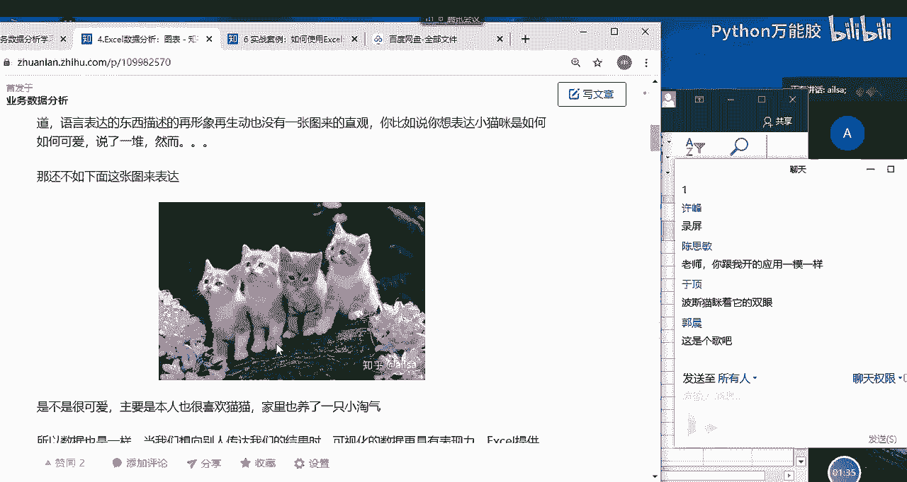

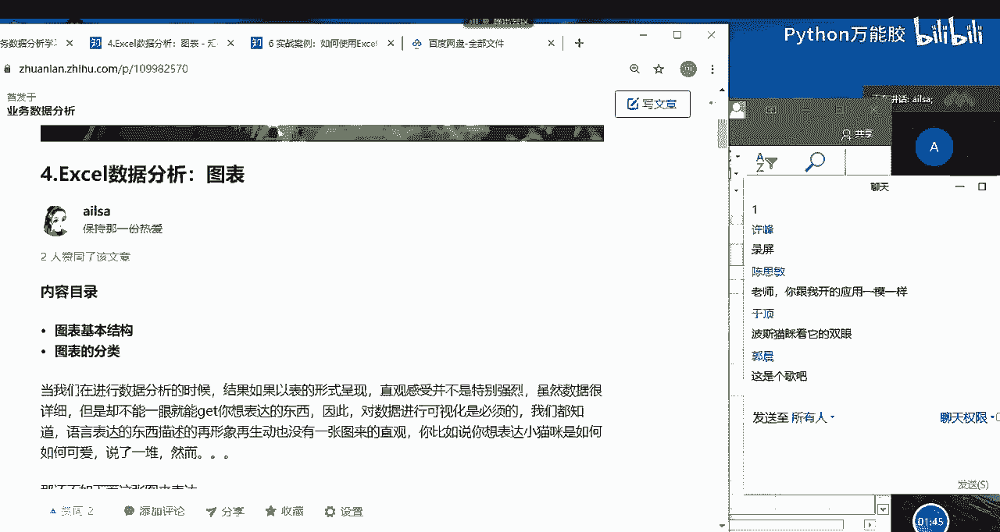

我们在做数据分析的过程当中有一个非常重要的步骤，就是我们把它分析出来的结果呢，我们要给相关的人员去做汇报。那如果说我们给他汇报的东西，他不喜欢他不愿意去听，不愿意去看的话。

那我们怎么去呈现出我们所呃想表达的思想呢。那我们就要采取另外一种方式，也就是图表这种方式。通过很直观的啊这样的一种形式给别人用通俗易懂的语言来来表达你的一个分析的结果。

这样的话啊然后才能达到我们所想要的一个效果啊，这就是我们学习图表的意义。

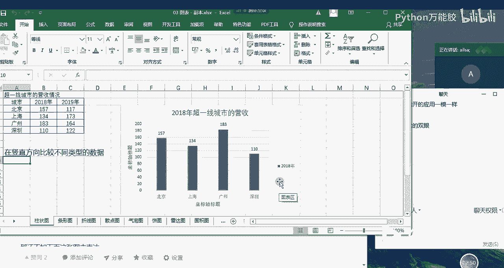

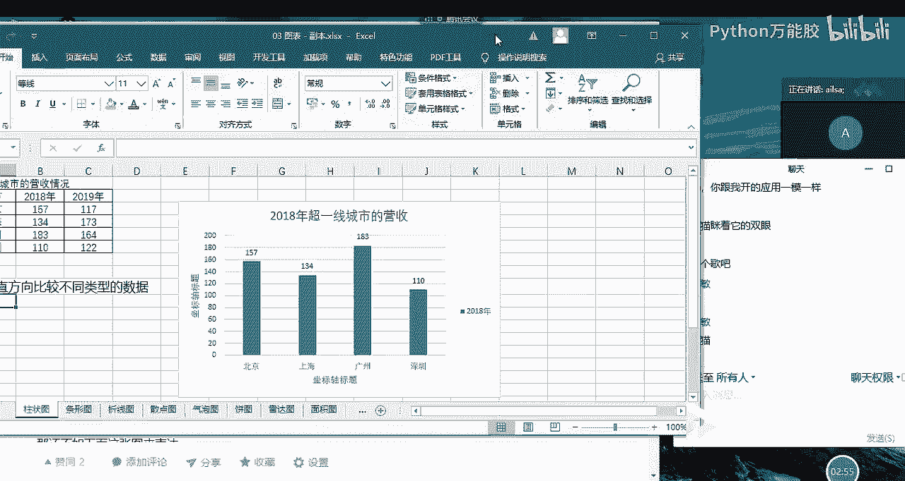

啊，这个我说明白了哈。那我们在学习图表之前呢，我先教大家去创建一个最简单的图表。你比如说就拿这个例子而言哈，我们就创建一个最简单的柱状图，我们先看这个数据哈，这个是超一线城市的一个营收情况，这个是城市。

然后这个是每一年的营收，现在我只以2018年的数据为例。然后我先选择我想要看到的数据，然后点击插入啊，大家看到没有？这个地方是我所有的图表区域，我们可以点击推荐的图表，我们也可以点击这里都可以哈。

我们直接点击推荐的图表，你看它就推荐我为柱状图，说明这个数据可能比较适合柱状图，那我直接点击确定。

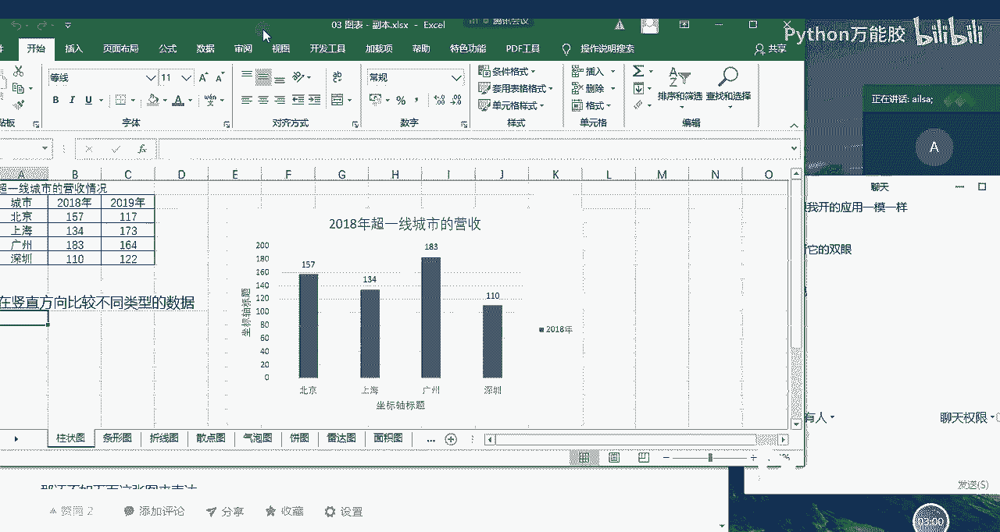

哎，我点击完确定之后，看到没有？这就是一个最简单的图表。那我们对于这张最简单的图表而言，我们需要掌握哪些知识呢？首先我们先认识这个图表的结构啊，我们看一下这个图表由哪哪几部分组成哈。

首先我们知道这个地方叫图表的标题，也就是说你这个图表想表达的呃一个中心思想或者是想表达的一个呃数据代表的意义。那这就是2018年超一线啊城市。的营收对吧？啊，这就是我们所想表达的一个数据的核心。

就是我们的标题，让别人知道你这个数据是来干嘛的啊，这是我们的第一个标题。那第二个我们把鼠标定位到这里，哎，我们可以看到这是我们的一个整个图表的核心地区，这个叫啊我们看一下，这个叫我们的一个绘图区哈。

绘图区就在这里，那这啊这就是我们再看啊，我把图表标签填下来哈。我们看这个地方显示的就是说每一个城市，它所代表的它的营收的数据啊，这个叫啊这个叫数据标签。我把鼠标定位到这里，这是叫我们的数据标签啊。

那这些是什么呢？其实这些就代表的是我们整个的一个数据的一个大小，它用我们的柱状图去显示的，我们称之为系列哈，这是上北京系列啊，上海系列广州就是每一个系列。

然后这个是对应的它的值啊去显示的这就是我们的一个绘图区，也就是我们最核心的一个地方。那再往下来走的话，这个就是我们的水平轴啊，跟我们画坐标轴是一样的哈，这是我们的水水平轴。

然后这个啊就是我们的一个垂直轴啊，横坐标和纵坐标来组成的一个我们的一个图表啊，那呃还有一个就是图例，在这里没有显示哈，我们可以点击它，这就是我们的图例啊，它代表的就是说你这个柱状图是什么意思啊。

是这个意思哈啊，就是我们的图例啊，那就是它大概就由这几部分组成，也就是我们的标题，我们的绘图区啊，我们的水平轴垂直轴，还有我们的图例以及我们的数据标签啊，当然它还有这个什么。

还有我们的整个的一个网格线啊，也是我们的绘图区的一个组成部分。哎，这几部分组成。那有的人说你教我们这个组成部分到底有什么意义所在呢？第一个就是啊告诉你这个图表是由哪几部分组成。

第二个大家看一下这个地方哈，我们有时候需要对这个图表的某些部分进行一个自定义格式的设置的时候，我们需要选中它，你比如说现在我选中的是绘图区，然后右击选择设置绘图区格式。哎，它就会出现这样的一个边框。

那它有两个选项。第一个就是有点像填充啊，你看一个桶往下倒的啊，填充啊，我们可以填充它的什么什么啊颜色等等这些啊，一般情况下，我们选择默认就可以了哈。然后还有我们的边框，也可以对它进行一个设置。

然后这里面呢就是一些阴影啊发光啊，这些这些用处不是特别大哈。你看这是我们的设置绘图区的一个格式。现在我把鼠标定位的标题。大家看一下会有什么样的变化。唉，那它这里就显示了设置图表标题格式的。哎。

你看刚才绘图区是不是只有啊两个选择，到标题这里的话，就是三个选择了，有一个填充啊，然后还有一个这个阴影发光，然后还有一个什么对齐方式，因为它是文本形式的对吧？

那我们再把我们的鼠标定位到我们的水平轴的时候，你看它就出现了设置坐标轴格式的一个四个选项，也就是说它根据不同的区域来对应设置不同的格式。哎，这就是我们想表达的意思哈。我们经常用到的是这个。

也就是它是它设置它坐标轴的一些啊类型啊编号啊，刻度啊等等这些。但是呢啊也不常用哈啊还有标签啊，这样但是也不常用，基本上它默认的我们都可以去实现了。除非说你想要一些啊自定义格式的时候。

你可以采取这样的一个形式啊，那这个垂直轴也是一样，因为它们俩都叫坐标轴啊。你比如说现在我把鼠标定位到数据标签，它就是设置数据标签格式的这样一个对应的一个选项啊，那这就是我们图表的一些组成部分。

以及它对应的设置格式的一种方式哈。那针对于这个啊，大家有什么问题，没有没有问题给我扣1。

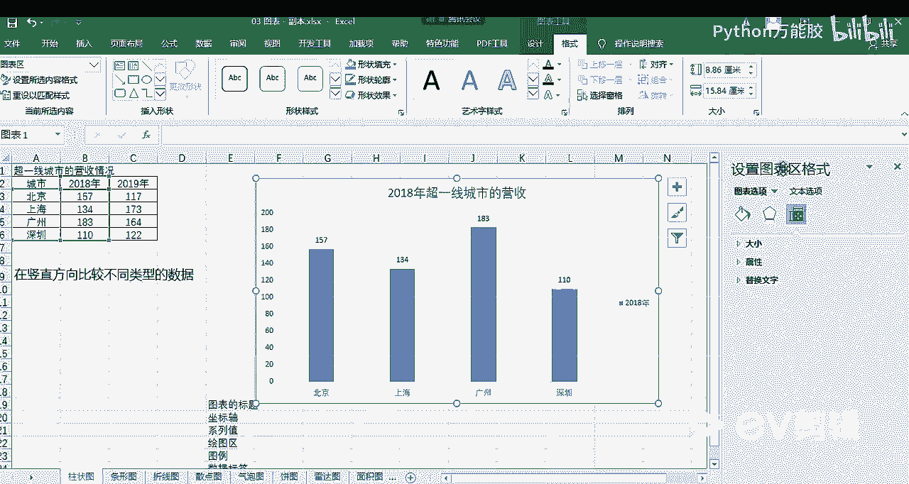

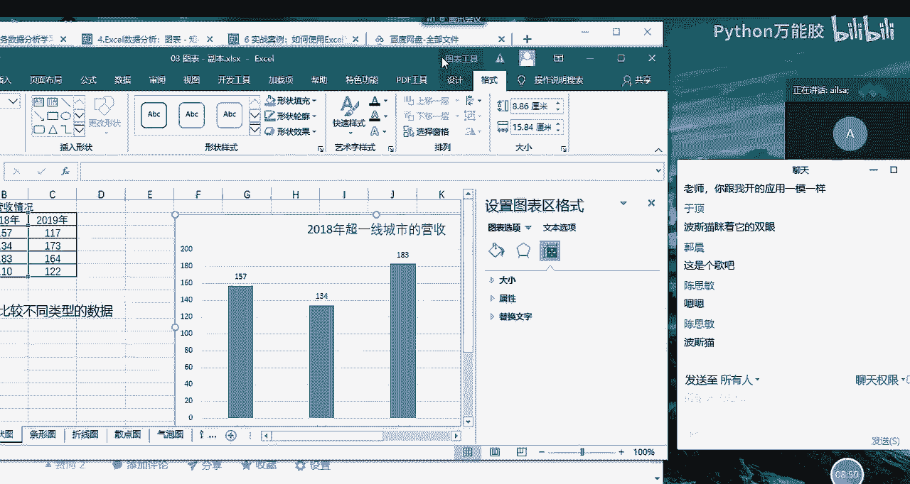

嗯，好的。还有人没有回复哈。OK啊，那应该没有什么问题了哈O没有什么问题。这就是我们图表的一个组成部分。那接下来我该讲第二个内容，也就是我们如啊我们如何创建柱状图条形图等等这些不同的图表的分类哈。

那刚才我已经演示了啊，创建一个柱状图，相信大家也都看明白了。那现在我又提了一个需求哈，我又提一个什么需求呢？你看你这边不是有2018年和2019年两年的数据吗？那我可不可以创建北京地区哈。

2018和2019两个数据呢？啊，当然也是可以的哈，我这边啊我这边尝试一下，拖一下。哎，大家看到没有？我把的数据区域。

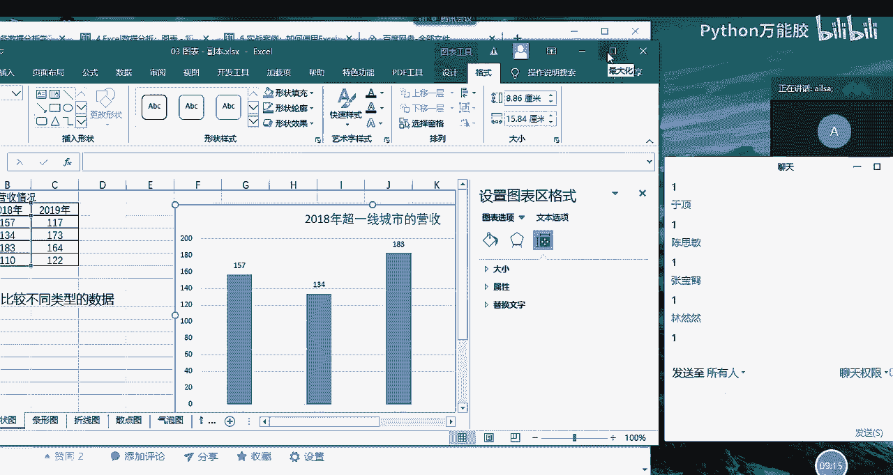

一拖动啊，鼠标盯到这个右下角部分哈，然后再拉。哎，我这边2019年的数据就出来了。那它通过不同的颜色去标注，看到没有？这个代表的是2019年的橘色代表2019年，然后蓝色代表代表代表2018年。

这就是柱状图的一种啊另外一种对比的一个展现形式图就是在竖直方向比较不同类型的数据啊，竖直方向比较不同类型的数据，这就是我们啊呃柱状图的一个作用，竖直方向。

然后比较北京、上海、广州、深圳这种不同类型的数据，好吧。嗯。呃，柱状图听明白了吗？听明白给我扣1。

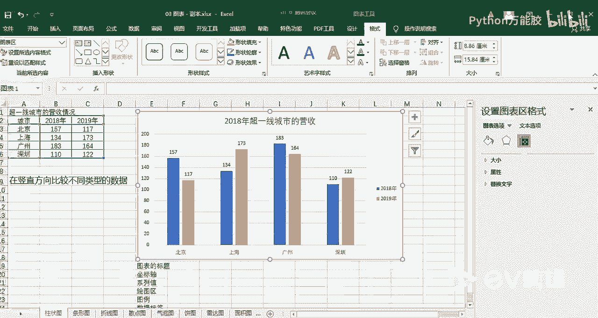

这是我们最最最最最最最常用的啊一种啊我们的图表的表达形式哈。大家现在啊大家现在可以跟着我跟着我的操作，然后在自己的电脑上，因为文件我已经发给大家了。然后呃跟着我的操作，然后自己去呃呃操作一下。

然后看能否达到这样的一个效果。那我刚才讲了我们的数据源进行一个拖动的时候，可以这么来选择。但是有的人说呃如果说我不想采用这种方式，我还有其他方式吗？当然也是有的，我们直接选择整个的一个图表。

然后右击选择什么呢？选择选择数据哈选择数据，然后在这个对话框当中，我们就可以对应的选择我们的原数据了。那这一类这一列代表的是水平轴，什么叫水平轴，这个就是水平轴。你所想要放置的分类哈。那这边。

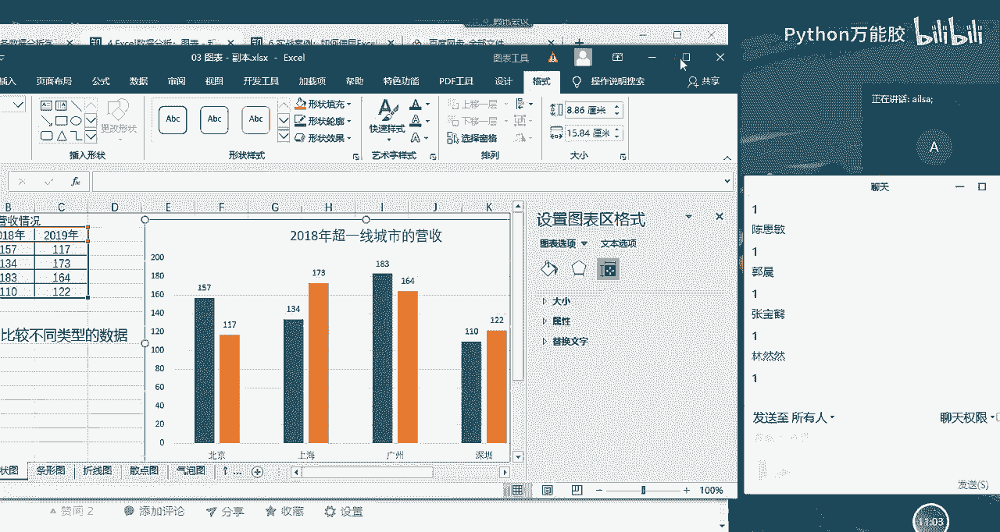

那就是我们的垂直轴的方向了。那你比如说现在我把2018年取消掉，它也就不显示了，它只显示2019年。所以说我们还有另外一种方式，就是选择数据，在这里面去指定我们想要的数据结果。

你比如说现在我把2018年删掉。然后我如果想在新增2018年的时候，我们可以点击添加。然后这个叫系列名称，哎，系列名称就有点像我们的图例了。那我们这边可以写上2018年。

我们也可以选择我们的单元格的位置哈。你比如说我这边步输2018年，我选择2018年啊这样的一个单元格里面的值也是可以的。我的系列值，然后就是我这些内容，然后我们再点击确定看啊，这边是系列一哈。

我看有没有。啊，系列名称啊。我们需要再重新定一下，就是2018年。然后点击确定啊，再点击确定啊，这就是我们所想的效果了。也就是说它有两种方式去选择我们的数据区域。第一种方式就是我们右击选择数据啊。

这种方式第二种方式的话，就是我们可以直接在我们的这里面去拖拉拽来实现我们所想的效果。那第二种方式我记得应该是在07版的时候是没有的，可能到后面的版本更新的时候才有啊。

这样的一个形式哈啊这样的一个拖动的情况啊。啊，我们一般情况下在做这个东西的时候，我这个呃我这个轴啊或者是这个叫这个叫什么来着？这个叫网格线哈，网格线我一般都不要，我觉得它会影响我整个的一个审美哈。

所以说会把网格线删掉哈。网格线只要选中，然后按delay键就可以删掉了啊，大家对于这个有没有什么问题，没有问题，我们就讲条形图。

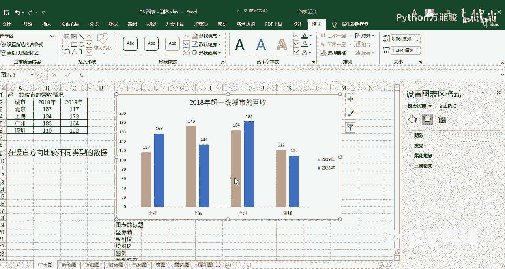

嗯，没有问题给我扣1。而且大家操作完了之后啊，没有问题给我扣1哈。嗯，自己画一个柱状图，看长什么样。好的啊，那我们都没有什么问题之后，我们接下来看条形图哈。条形图。然后其实跟柱状图差不多啊。

它差在哪儿呢？我们先看一下哈，我们先看一下我们柱状图呢是在啊我们的竖直方向上，对不对？那条形图它就是在水平方向上啊，这个条啊不是竖着的是水平方向上，然后去显示它的不同类型的一个对比。

也就是它是在水平方向上比较不同类型的一个数据。然后这样看起来的话啊，跟我们的一个审美啊，或者是查看图的一个习惯的话，我们看起来更直观一些。所以说是对比同一类别，在不同啊，可以对比同一类别，在不同时间。

也可以是不同类别啊。

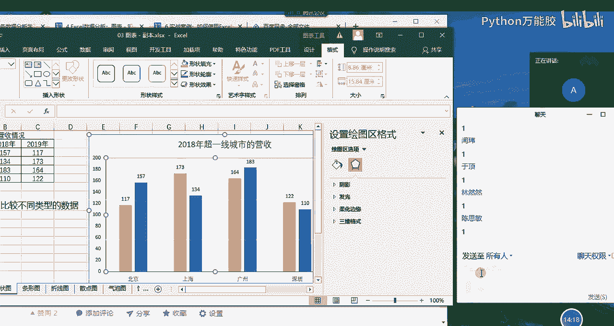

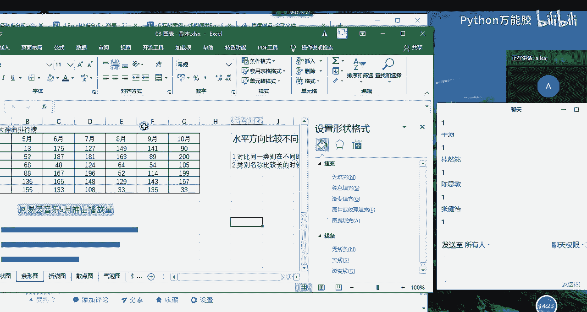

在呃就是在水平方向的上的一个演示哈，我给大家建一个条形图，看是怎么来操作的哈。首先呢我们还是再选一个月的数据啊，我们先选5月份的数据，歌曲是这么多，然后这是5月份的数据，我们点击插入。

然后选择推进的图表，哎，我们选择条形图我们点击确定这个时候就出来了。哎，每一个呃歌曲在5月份它的一个呃整个的播放量啊，播放量的一个数据对比，我们会发现这应该是这应该是前几年的数据了。

因为小苹果哈小苹果这首歌在据说有一段时间内是非常非常火的，是吧？

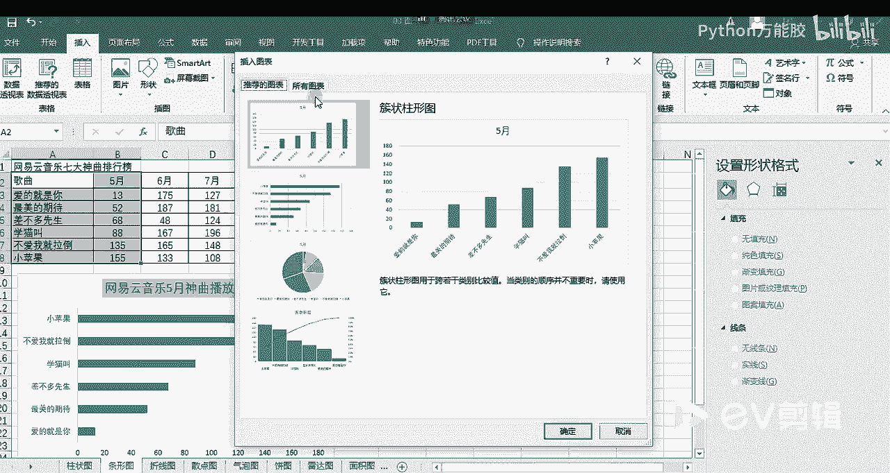

嗯，这就是水平方向上一个条形图的一个数据对比情况啊，大家看一下，我讲完这个柱状图之后，我再讲条形图，其实就觉得好像也差不多啊，没有什么特别大的不同，对吧？啊，大家现在在自己电脑上有没有把条形图做出来。

如果做出来了，给我扣个一。

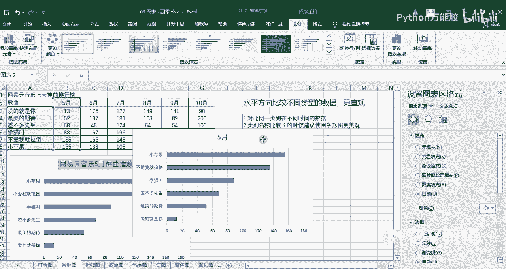

嗯，那我跟大家说一下，我们什么时候用柱状图，什么时候用条形图啊，其实。啊。丑吗？啊，还好吧啊，是我画的丑吗？啊，呃我跟大家说什么时候用条形图哈，就是说你这个列啊。

你这个分类的这个内容如果特别长的话啊特别长。然后你放在这个柱状图这下这下面的话，它有可能会显示不全。啊，而且看起来不够美观，所以说条形图的话有一个使用的呃场景就是它的类别也比较长的时候。

我们可以把它放到这个方向上，然后去横过来，然后去看它每一个一个的对比情况啊，这个意思哈呃，基本上它俩就看个人习惯，你想要哪个就能哪个啊，没有说啊特别说哎我这个场景我就必须用它啊，我一般会把网格先删掉哈。

然后把我们的。嗯，把我们的呃就是标题再改一改。然后的话我是不是想对它进行添加数据标签呢？这个数据标签是在哪添加呢？是在这个加号这里，我们看到它可以添加很多很多个内容啊，我们可以添啊，就是数据标签啊。

坐标的标就是坐标轴的标题都可以。然后标签，然后就放在这个地方它这个标签的位置啊，也可以居中，然后在标签内部在什么什么啊就是轴内侧然后数据标签Y等等这些啊，我们一般情况下都默认的是数据标签Y。

然后去选择去呃放这个的标签来显示这个分类的一个数据的大小啊，这就是我们的条形图啊，我应该是说明白了，也比较简单哈。

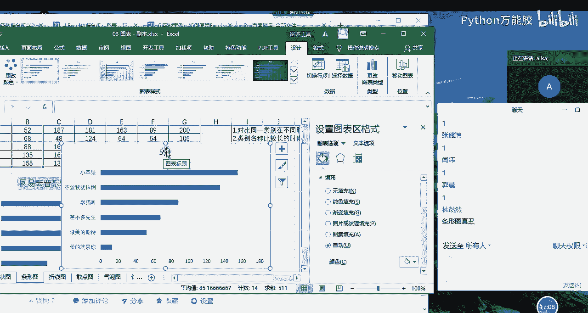

嗯嗯，那接下来我们就说啊我们就说重装图哈啊不对。

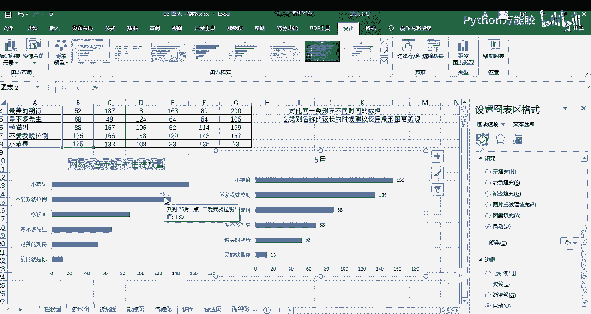

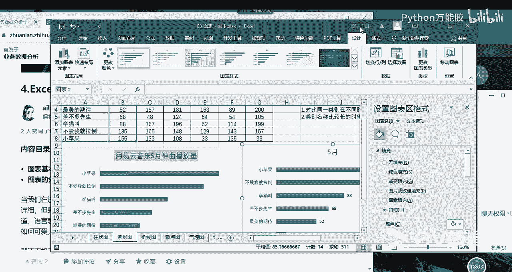

我只顾关注这个我这个录屏了啊，我们先看折线图，折线图其实它就是它跟前两个都不太一样了。它是显示一段时间内数据的一个变化趋势。因为折线嘛，我们经常是为了发现它的波动情况。所以说它是它的一般情况下。

它的水平轴的话都是时间，然后呃纵轴的话都是我们某一个分类所代表的数据量。那它不仅仅可是一个分类，也有可能是多个分类啊，所以说它是按照一定类别显示一段时间内数据变化的趋趋势。这就是我们的折线图。

下面我给大家建一个折线图来看一下，我们先按照一个分类来进行一个创建。先选择哎我们的歌曲爱的就是你哈好老的歌了吧。

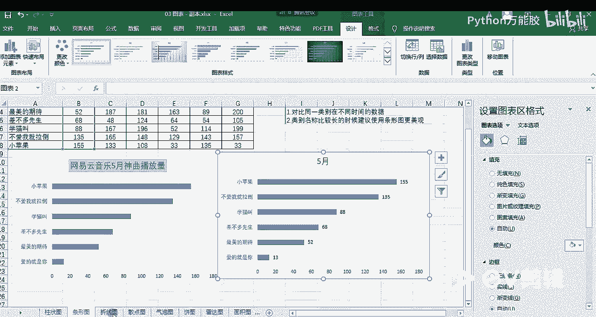

然后是我们每个月的一个播放量，然后我们点击插入，然后点击推荐的图表，然后选择折线图就可以了。我们点击确定OK那它这个啊它这个图就代表的是这首歌在不同月份的一个播放量的变化趋势。

那我们可以看到在5月份其实是最低的啊，然后在6月份达到了最高。然后接着又由往下走的一个下坡路的趋势哈，就是有可能火一阵，然后突然突然就不火了啊。

这样的一首歌那我们就呃可以看出来折线图它是反映了一段时间内的变化趋势这样的一个走势的情况，经常大家都知道哈我我所知道的就是大家玩股票的时候啊，经常看这个波动啊，哎跟心电图似的啊，就波动的比较厉害。

它就使用的是一个折线图啊，这也是折线图的一个用处之一哈。那这是一种哈第二种的话，我们还可以让它跟不同的类别进行一个在时间轴方向的一个对比。哎，那这就是不同歌曲了。我们选择啊。所有的数据。

然后点击插入选择推荐的图表啊，我们还是选择这个折线图，然后点击确定。哎，那通过这张图的话，我们就可以看出来它每一个歌曲在不同时间内的一个变化趋势，以及它们整体的一个走势情况。你比如说在9月份的时候。

三首歌基本都差不多啊，热度都差不多，播放量都差不多。而在8月份的时候，这个灰色的啊灰色的是小苹果，小苹果它整个的一个热度就全部都下来了，也就播放量特别特别少，对不对？而前两个歌曲却啊呈现了一个好的呃。

就是基本持平的一个趋势。我们可以从这个方向上大概去分析一下这这三首歌的一个走势对比。

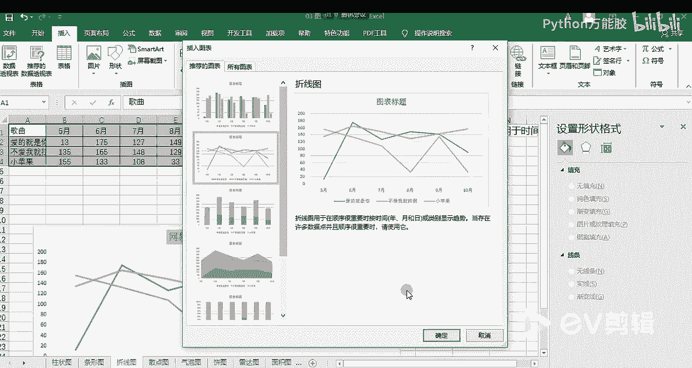

嗯，这就是我们折线图的一个用处。如果说你想去分析某段时间内，然后几种类别或者是某一类类别的一个变化趋势的时候，你必然要用到的就是折线图。OK大家对于折线图啊，有没有画出来啊，有什么问题没有没有问题扣1。

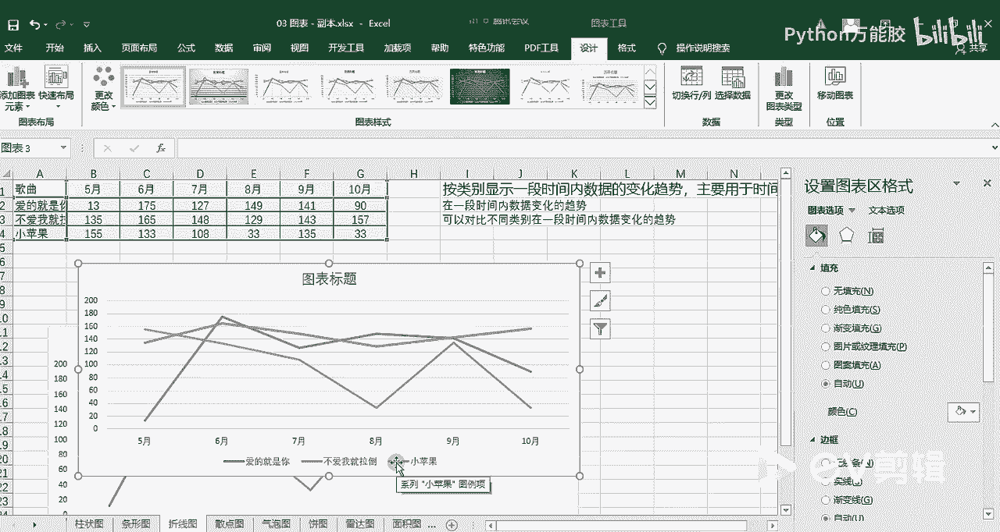

嗯，大家一定要手动去操作哈。OK啊都在操作是吧？嗯，好嘞啊，我这边没有对它进行一个啊进行一个那个啊什么优化呀，美观啊等等这些啊，就是最基本的。我一般情况下做的就是把网格线去掉，然后把我们的数据标签啊。

数据标签看情况。如果说你看这个图当中你添加数据标签就不是特别好看了。我们也没有必要去纠结它到底啊，它到底哪个具体是什么值，我们只要看走势的时候，可以选择不添加啊这样的一个形式。

然后把标题什么改一下就可以了。我们选择的是默认的一个版本，它这里的话，你看设计里面，还有其他很多个版本，以及我们的格式里面还可以设置这些东西啊啊，但是啊你比如说有的人比较喜欢用这种啊黑色背景的。

可能看起来更直观一些吧啊啊但是我还是啊这个也可以啊，这这种格式也可以，很多人也会选择这种啊就是。

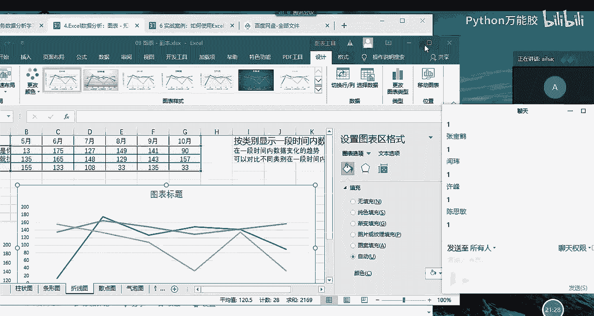

怎么说呢？啊，这个看个人的一个审美吧啊，其实图表这个东西啊就是有的人觉得好看，有的人觉得不好看啊，我就觉得他这个默认设置的还都OK啊，但是我一般不喜欢添加这个数据标签，作为它的一个显示的效果。嗯。

这是我们的折线图啊，我们看散点图啊，散点图啊，这个就有点意思了哈。散点图啊，它就是由一个个点组成的那它代表的是一个二维数据之间的一个相关关系。你比如说拿这个例子而言，哎一个身高和体重。

这个就是我们很常见的一个问题了。那身高越高的人相对来说体重就会越重啊，但是这只是相对而言，对不对？也不是说绝对的，也也也有的人很高很瘦，也有的人又矮又胖，对不对？那我们想看一下它如果说数据量特别大的话。

我们想看一下它具体之间是有什么关系的时候，我们就可以通过散点图来实现。我们是先选择啊这部分的数据。

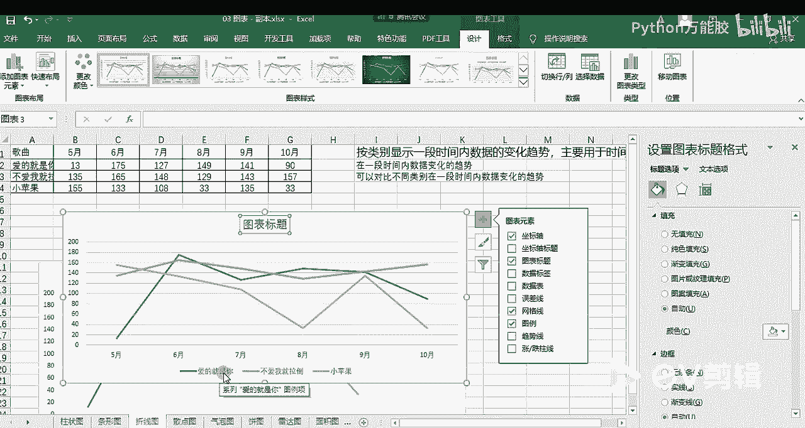

然后直接点击插入，点击推荐的图表，然后选择我们的散电图啊，我看一下散XY的散电图啊，应该是选择这一类啊，跟刚才一样，就是我们的呃纵坐标，我们的横坐标是体重，纵坐标的话是身高。哎，我们点击确定。

就出现了我们的一个散电图的效果哈啊，大家可以看一下，随着身高的一个变化，我们的体重大概啊大概是往上走的一个趋势。那我们画散电图的时候，一般会加上趋势线。看它们到底是是不是呈线性关系哈。

我们加上趋势线之后，哎，发现好像是呈缓慢的一个上升的趋势的那说明啊就是啊身高啊和这个体重它们之间是存在一定的线性关系，但这个线性关系到底强度有多大呢？我们从这张图上也看不太出来。

但是我们excel也给我们提供了啊，我们这样的一个计算线性系数大小的一种形式哈。你看这里我已经算出来是0。9了。那怎么去算呢？选择我们的数据，点击插入啊，不对哈，点击数据选项卡啊。

你们电脑上应该没有这个功能哈。不过我先给你们做演示，等会告告诉你们该怎么去把它选择哈，点击分析啊。分析有点慢啊，这边会有一个呃相关系数点击确定。嗯，这个时候我们输入区域啊。

也就是说我们呃想呃去验证它整个的一个相关关系的一个区域。然后输出区域的话，我们选择在这里啊，点击确定。我们看一下它啊，列二啊列一和二列二之间的一个关系就是0。9，说明它的关系系数还是很强的哈。

那接下来啊我问一下大家，你们电脑上有数据分析这个按钮吗？

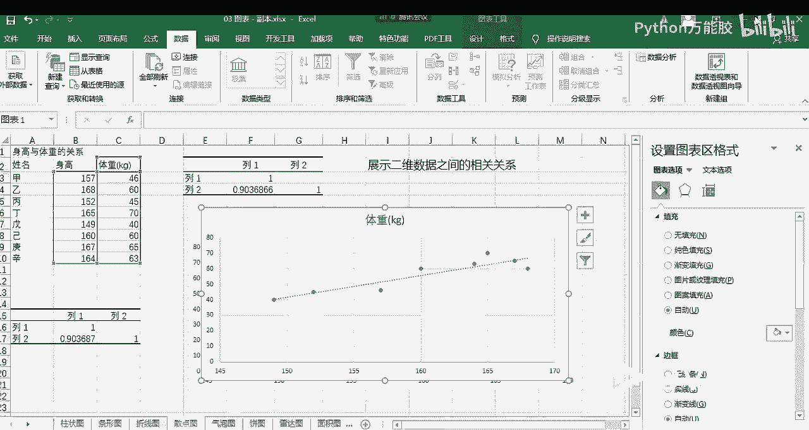

有数据分析这个按钮吗？功能吗？没是吗？我跟大家说在哪里去设置啊，点我因为它不是一个必备功能哈，所以说呃呃我们需要在后台给大家点击出来，大家跟着我的操作步骤哈，点击文件，然后是我们的选项按钮。

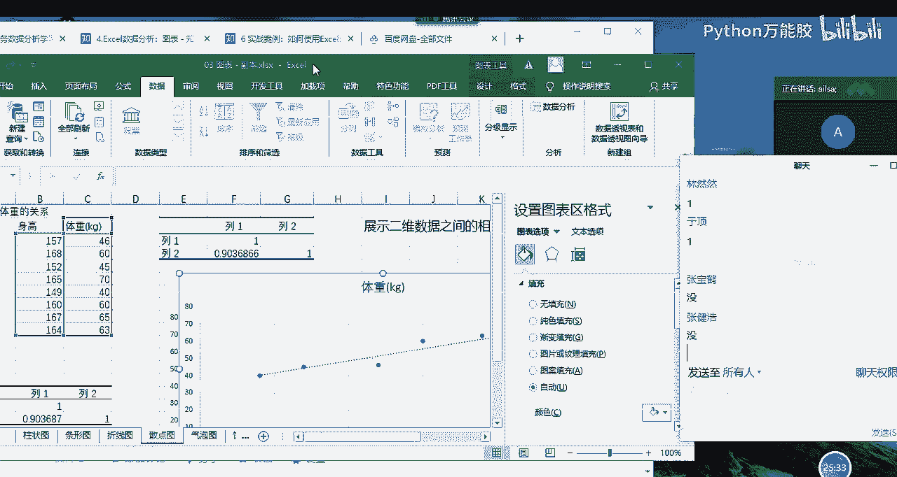

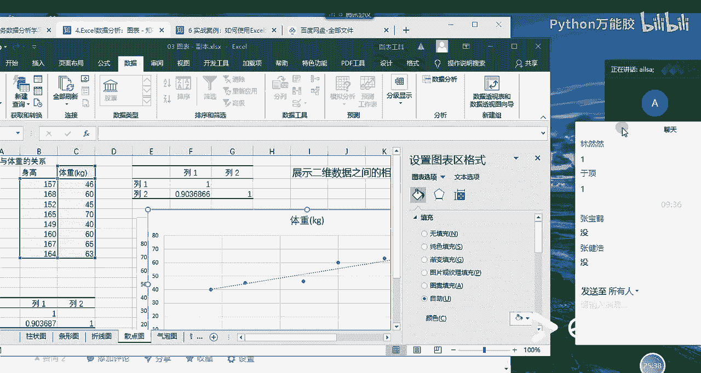

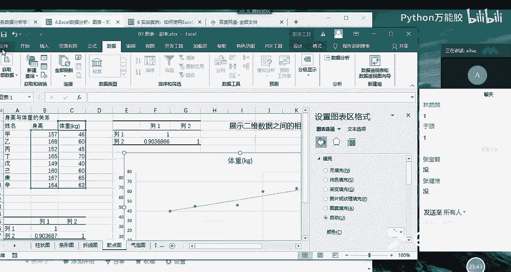

然后在我们的我想想在我们的。呃，加载项。啊，有一个啊excel加载项啊，看到没有？点击转到啊，这里面有一个数据分析啊，数据分析库啊，我们把它打上对勾。

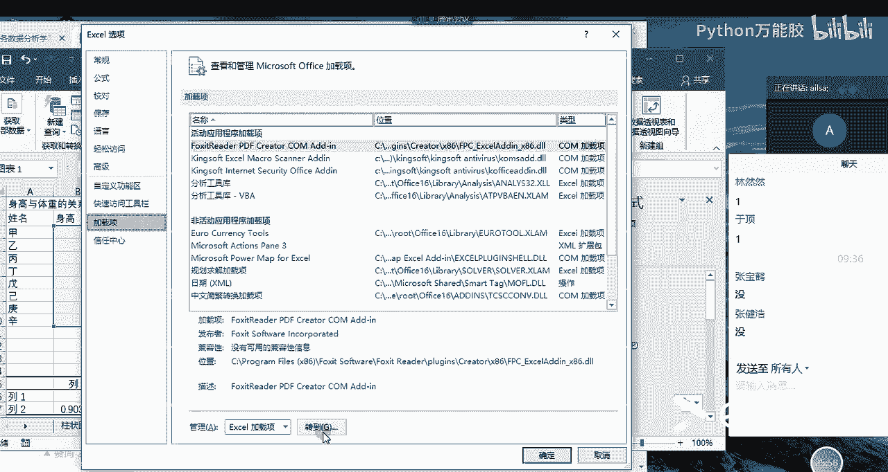

哦，点击确定啊，大家再回过头来看数据全员卡下面是否还有数据分析的一个呃呃功能。啊，有的话给我扣1。OK那我再带大家操作一遍，我们如何计算相关系数哈。首先啊首先第一步我们可以选择我们的数据。

然后点击数据分析，然后选到我们的相关系数，然后点击确定。点击确定之后啊，然后这里面有输入区域，输入区域，我们选择我们的身高和体重的数据。记住这这里的数据必须全部都是纯数哈。

不要把身高和体重这两个内容选进来，只选择这个数据，然后再把我们的输出区域告诉他，你要放到哪里就可以了。然后点击确定就出来了。如果大家这个相关系数的计算已经出来了，给我扣个一。啊，有了是吧？

OK那这个相关系数代表的就是两组就是两维一个数据之间啊，就是身高和体重之间的一个相关的一个程度的大小衡量。我们可以看到这边是零。9，那说明他们的相关性还是挺大的，对不对啊，那我们通过图形去展示的话。

就是这样的一个结果呈现啊，这边有系数的大小，这边还有图形的去展示，它们之间确实是存在很强的相关性啊，这就是我们对于散点图操作的一个作用。散点图主要就是为了体现二维数据之间的相关关系。

那对于这个散点图而言，有时候呢我们需要强调啊一些数据或者是突出显示一些数据的时候，我们可以在这个图表上进行一个着重啊，就重点的一个突出表达啊我们对格式该怎么去调整呢啊，比如说我们想把这个点。

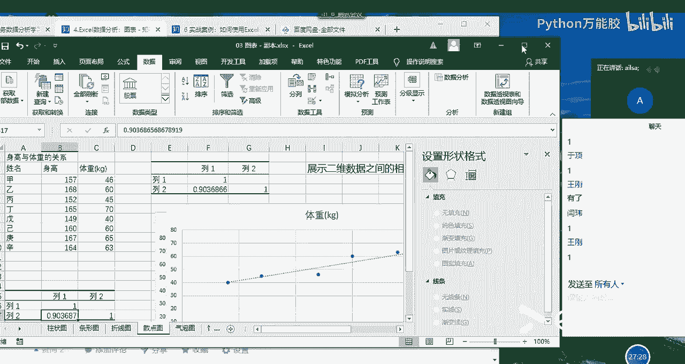

啊，去呃突出表达一下，因为它好像离整个线比较远，说明它的一个相关性就比较离散一些。所以说我们想重点表达它的时候，我们先点一下我们这个。整个的一个点，我们第一次点的时候，你看它全部都选中了，我们再点一次。

哎，它就只选中它了。我想让它变大一些，然后颜色跟其他颜色不一样，我们就可以在我们的设置数据点格式。看到没有？这边已经有数据点格式了。如果大家没有出来，可以直接右击选择设置数据点格式也就出来了啊。

我问一下大家，大家都出来了没有？

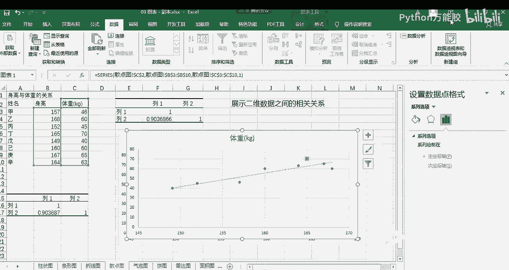

发光发亮就是那个有阴影什么的，大家这个地方出来了没有？就是设置数据点格式有了是吧？然后我跟大家说，我们应该在哪里去操作。这下面有三个选择，我们直接选择第三个就可以了。下面有一个稍等啊。

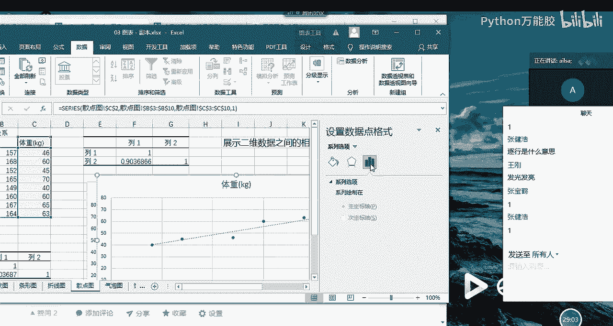

看一下。啊，第一个哈sorry哈，我们在第一个啊啊设置数据数据点格式下面第一个，然后有一个下面有两个选择，一个线条，一个标记，我们选择标记啊，下面啊大家看到没有啊，有一个一数据点着色啊，我们选择它。

然后我们给它改一个颜色。啊，不是这个啊不是这个。不是这个啊，我们在这哈有一个颜色。Soorrry哈。😔，sorry啊，真的抱歉哈，说错了。在我们的标记下面有一个标记选项。然后我们先看这个内置的啊。

我们点击内置，它有一个呃类型啊类型的选择，我们可以选择圆，也可以选择三三角，也可以选择什么什么类型都可以。然后有一个大小的设置。我们给它加大，哎，你看到没有？这里面已经突出的比其他地方都要大了。然后呢。

我们再对它进行一个颜色的填充，这边啊填充是自动的，对不对？我们选择纯色填充哈，填充纯色填充，然后我们再试一下。啊啊，这个时候他就已经选成它就变成红色了啊，大家看到没有？

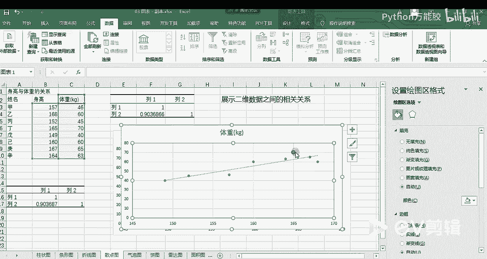

我刚才操作有点失误啊，不好意思，抱歉啊，这个点的话，因为设置格式的话，可能有时候需要自己琢磨一下哈。我再给大家演示一下，我们如何对某一个点进行一个突出的显示。首先我们先选中它。

然后在我们的第一个啊设置数据点格式下面第一个啊下面有一个标记标记下面有一个标记选项。这里面有一个呃就是呃有一个内置的啊，我们选择内置，然后类型，我们可以自己自定义去选择。然后有一个大小啊。

我们可以自己去设置啊，设置成大的小的都可以。然后设置完了之后，我们对它对于它的颜色填充的话，我们可以选择纯色填充，然后给给我们设置一些颜色啊，这样的一个设置就可以了。啊，当然它还有一个边框是吧？看。啊。

他这刚才我到边框了哈，它边框我们可以选择无线条，这样的话它就没有边框了，看到没有？嗯，大家这个实现了没有？是不是稍稍讲的有点乱？这个实现了没有啊，实现了是吧啊。OK哈，我主要是想告诉大家。

我们这个呃设置这个格式到底是怎么来操作的。其实就是呃针对某一些数据类型，然后你进行不同的一些呃想实现效果的一个描述哈，这是一个设置格式的内容。那除了这个格式设置之外，我们还有还有其他的操作，什么操作呢？

我可以在这里面加上文本内容去表达我想表达的东西。你比如说这个点哎我想表达说词典啊，嗯就是呃相关啊就是脱离主体啊，类似于这样的一个表达啊，这个时候我就可以插入文本框，在这里面点击。有个文本，哎。

我们插入文本框。啊，这个时候我就可以表达啊词典。异常。或者是怎么怎么着，或者是说大家可以啊写一些公式，在这里面也可以哈。根据自己的一个需要词典。词典异常吧嗯词典异常啊，然后这个时候你整个图哈。

你整个图的一个核心啊。你整个图的一个核心都在这里面了，然后他大家都会关注这个点，然后存在一个什么问题。当然除了加文本框之外，我们还可以插入一些啊就是啊插入一些什么呢？插入一些我们的形状。哎。

你比如说箭头啊等等这些，然后去对我们整个的一个图表进行一个优化和展示。嗯，那就是呃想在这个图表的基础之上进行一些另外内容的一些添加。那我们总的来说的话，对于图表，我们可以根据它对应的啊不同的区域。

然后去设置相应的格式。我们也可以对它进行插入我们的文本框进行一个描述，我们还可以插入一些形状啊图片啊等等这些啊，没有图片哈啊也就只要是形状哈形状啊，对它进行一些特殊的说明和展示。

然后来呃把我们的图表进行一个最优的啊呃意思的一个表达就可以了。

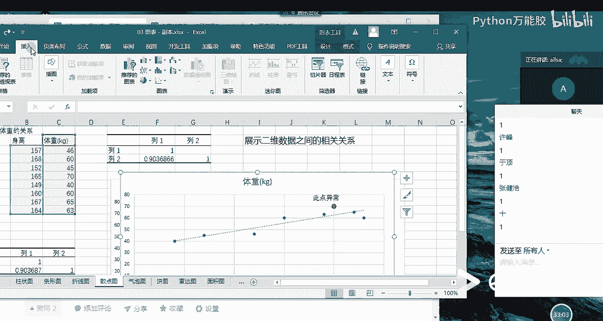

啊，这是我针对散点图来给大家做的其他的一些演示的内容哈。

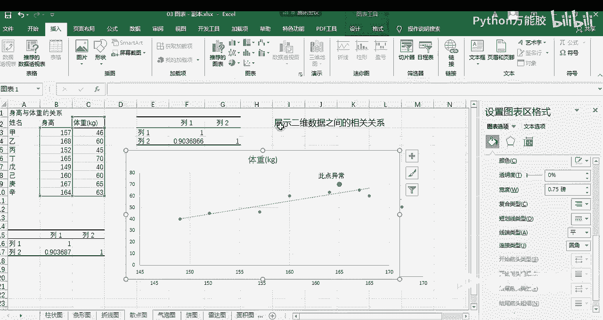

OK大家大家对于这个听明白了没有？听明白给我扣个一。OK啊，我们需要把我们的图表讲完之后才能下课哈。所以说大家再耐心的等待一下哈。我们还有啊我们还有哎呀。

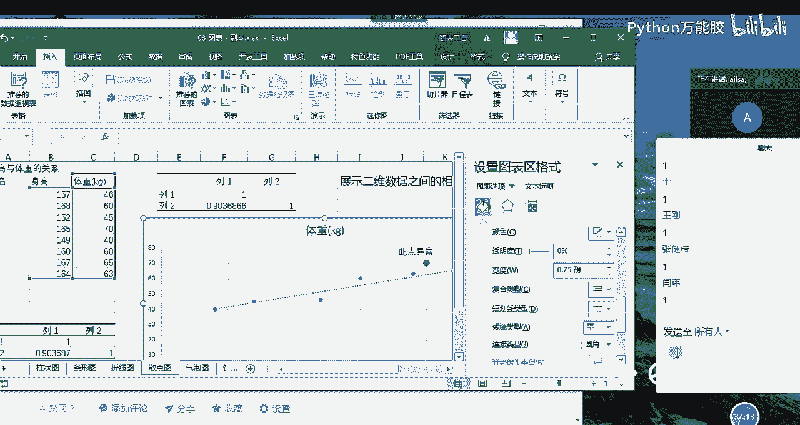

啊，行吧，那我们就先讲到这里，接下来可能还要再讲半个小时左右啊，等不了了。OK我先切一下。

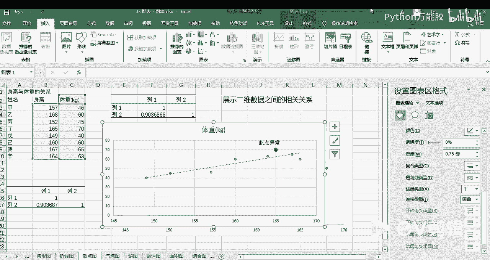

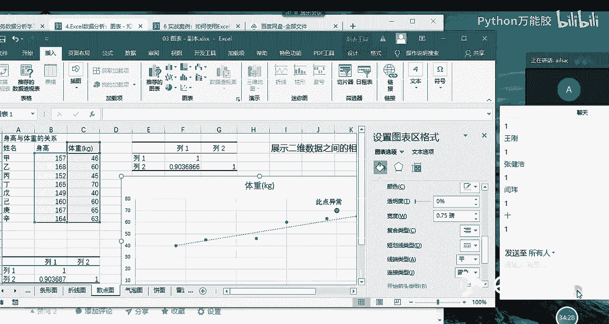