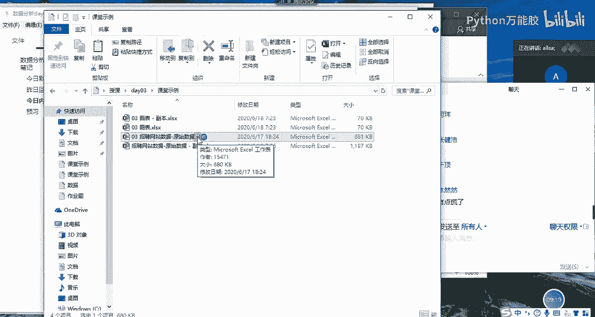
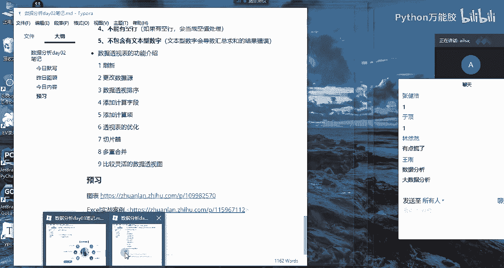
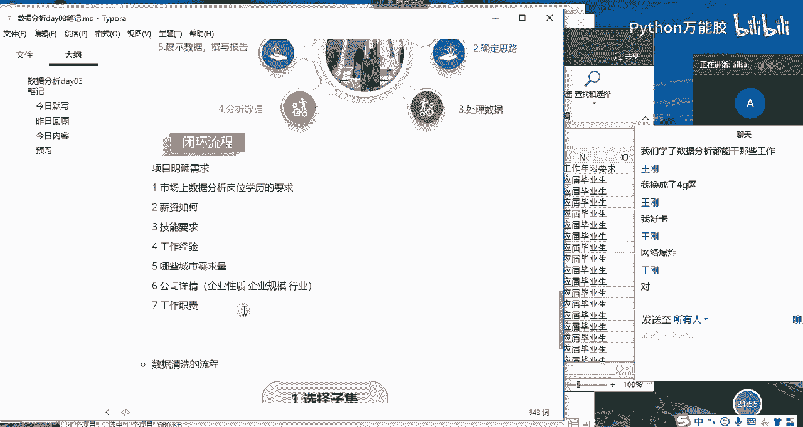

# 【python数据分析精华版来了（附文档代码）】10小时学会Python数据分析、挖掘、清洗、可视化从入门到项目实战（完整版）学会可做项目 - P22：04 数据分析流程 - Python万能胶 - BV1YAUuYkEAH

嗯。啊，这个就呃这个就呃进正式进入到啊我们的一个呃数据分析的接下来的一个课程内容当中了哈。那在实际的工作当中啊。我们接上接到了一项需求任务了之后，哎，我们该怎么去做分析啊，大家想一下。呃。

我跟大家大家说，哎，比如说呃比如说我给了你一套数据，我说你给我做一个分析吧。其实你在想的时候，哎呀，妈呀，那我该做做什么，对吧？是不是有点头大？你又没有告诉我你想要什么，那我怎么去做呢？

那所以说从这个角度来说的话，我们第一个啊第一个任务就是要明确我们的需求。一般情况下我们做分析，都不是我们自发的啊，都是领导安排的啊，那领导根据业务当中存在的一些问题说，哎，要不你去分析一下吧。啊。

那这个时候我们在跟领导进行一个沟通的时候啊，他有时候表达需求并不是特别明确啊啊你比如说。啊，你比如说呃他说我们举一个最简单的例子吧，就是说公司最近网站运营情况不是特别好。哎，你给我分析一下吧。啊。

这个时候其实就感很尴尬哈，因为这个网站运营涉涉及到的内容太多了。你要分析的话，你每个维度都要进行分析的话，其实你完全啊啊你一个月两个月都做不出来。而且你分析的问题也会比较泛，因为你没有聚焦。

所以说你需要跟领导再次确认，你想看你想看哪个哪个方面的维度的一个分析，公司目前运营方面到底存在了哪些问题。然后你要针对这些问题啊，然后展开一步一步一步的分析。记住我们数据数据分析不是简单的数据呈现啊。

真的不是简单的数据呈现，很多人。很多人在做数据分析的时候，都是啊就是哎目前公司赚多少钱。哎，目前公司有多少个课程，目前公司啊有多少人，类似于这样的一个形式。那这种形式的话。

如果说你把你的整个这个汇报的结果给到领导之后，领导会觉得说啊，这四个人都能做，我要你干什么，所以我们数据分析是最重要的一个目的啊，你要明白，它肯定是要针对某一项问题去发现啊，就把这个问题挖掘出来。

发现了，然后并且提出自己的一个建议方案。然后这个方案能够落地是最好的啊，如果落地了并且达到一个很好的效果。那你这个价分析价值就是有意义的那我们在做所有的这个达到这个目的之前，我们第一个就是要明确需求。

我们要提出啊，就是领导想要解决的这些关键的核心的问题。OK那第二个如果说你明确了需求之后啊，那第二个就是确定思路了，你该怎么怎么去分析，对不对啊？那你比如说采用什么样的分析方法啊。

使用啊到底是使用excel来实现，还是使用 circlecle来实现这样的一个分析的思路啊，这样第二个就是就是你自己干的事了，针对这些问题，然后你确定你的分析思路。那第三个呢就是你的思路确定了之后。

你就要去找数了哈，找数，然后看到底是需要数据库的数据，还是说别人别的部门需要提供的数据还是怎么怎么着，就是把数据找出来之后，然后进行一个清洗，我们大部分时间都花在这了哈，大部分时间都是在做清洗数据哈。

然后数据清洗完了之后啊，我们就可以做分析了，哎，从通过我们提出的这些问题，然后一步一步的进行一个分析。然后我们找出来一些问题啊，或者是分析出来一些原因，然后把这些原因或者是整个的一个分析的过程进行。

一个结果的呈现，然后输出我们的那个报告。但是这个报告的专写的话，我们主要看我们整个嗯。整个你接到这个分析项目的一个重要程度，如果是一个简单的分析，那你可以不写报告。如果是一个比较规范的啊或者大型的。

我们可能要写报告。那最后的话就是你把这个报告要汇报给你的呃，就是相关负责人，谁让你做这个的啊，你要汇报给他们，然后汇报给他们之后，他们会进行一个相对应的方案的落地，你要进行一个跟进，到底效果怎么样啊。

有没有说给公司带来好的一个影响啊。如果没有啊，如果没有哈，公司目前某些某个业务问题还一直存在。那不好意思，你可能还要再重新来一遍啊，对，还要再重新来一遍这样。这有这就是一个数据分析的一个基本的流程哈。

那我结合啊我结合我们今天要讲的啊。呃，没有没有没有那么夸张哈。其实我跟大家说一个特别特别普遍的一个现象，就是你不要以为说你在呃公司做数据分析师，你一下子就能给公司带来几千万或者是多少万的一个收益哈啊。

你做出来的分析效果啊，所有的你做出来的效果都特别明显，都一眼就看穿了啊公司内部存在的核心问题啊，没有啊，真的真的不会有可能你干个一两年啊，你才有可能去发现一些问题。啊。

而且和每家公司都有自己的就是那个不可解决的问题，而且还牵涉到一些某些人的利益啊。所以说嗯你做数据分析师的话，其实就是一个得罪人的活，为啥呢？啊，你说呃比如说你分析出来市场部存在很大的一个啊什么什么问题。

你就把市场市场部给人给得罪了哈。假设领导觉得说你说的对，你就把市场部的人给得罪了。然后你又说呃你又通过一些数据分析，发现财务部那边也存在很大的问题。那不好意思，你把财务部的人也得罪了啊，因为这些问题啊。

不是说大家不知道，只是说看你愿不愿意去解决啊，有一些问题是这样的啊，当然也有一也这是一个就是不太好的一面。如果从好的一面去讲的话。

就是说确实是很多人都比如说运营过程当中很多人都想为什么我这个活动的效果特别不明显的，我该怎么办呢？这个时候你通过你数据的形式给他做一个很好的呈现，或者说你发现了哎。

是不是你在这个活动过程当中某一个小的细节没有做好哎，造成的，你给他提出这样的一个建议方案之后，他改进了他的活动效果突然就变好了，给公司带来了很大的一个收益，解决了不少成本的时候。

这个时候你就是有有有价值有意义的了。明白了吗？啊啊对数据分析他对于啊我我只说业务数据分析哈。你要说机器学习数据挖掘那方面的话，他对于业务要求不是特别高的时候，他还好。

但是他只要牵扯到业务就会牵扯到很多部门了啊，所以对于个人的一个沟通表达能力啊，还有你的整个的一个情商啊，还有你的一个协协调能力啊等等这方面都要做好充分的准备啊。

不然很容易就得罪人了啊啊还有很多数据分析师在工作当中啊，就很没有地位，为什么呢？是因为他们没有给公司带来很大的一个价值。所以公司就认为说好像有你没你都一样的那种感觉的时候，这个时候就很尴尬。好吧嗯。

那我在呃我就呃大家分析流程听明白了没有？就是我们呃很多人很多人在接到一项任务需求啊，数据分析的需求的时候，很多人啥都不想，直接就来第三步了哈，直接就找数据了，然后做了一堆分析，啊。

然后也没有发现特别大的一个问题的时候啊，其实你都做的是无用功。有可能你的根本就没有聚焦到某一个点啊，我们做数据分析一定是专而精，而不是广而泛啊，专而精哈，针对某个问题开展的。

你不可能把公司所有的业务都做一遍啊，这不可能啊，一定是专而精的。啊，专而精而，不是广而泛啊。广而泛的东西做出来没有意义。因为你分析不透。数意分一定要分析透了啊，某个点就像针扎了一样啊，扎到你出血。

那你这个分析就有价值了。就什么叫痛点啊？就这个意思嗯，大家对于分析流程了解明白了吗？啊，明白了扣1。嗯。OK好，那我们啊那我们想一下哈，我们打开我们今天要讲的实例。

我们今天要讲的是其实今天要讲的东西的话，真的是就相当于我们是业务方了。为什么呢？你看我们现在想从事数据分析这个岗位的工作，对不对？那我们对于这个岗位呢，其实并不是特别的了解。

那我们就想知道哎这个岗位目前啊有什么样的一个呃要求啊，或者是哪些公司招这个岗位啊等等，这些我们需要知道这些东西的时候，相当于我们是业务方，对不对？那比如说呃你你找到数据分析师。

你说我最近在找数据分析相关的工作，你给我分析一下，我应该从哪个呃从呃去哪个城市去找，应该做什么准备。哎，类似于这样的啊，我们如果作为业务方，我们想一下，我们想啊想分析得到什么样的一个结果。

假设你是业务方，哎，你想提需求。哎，比如说呃我我我作为你们的数据分析师，你想给我提需求，你说你给我分析一下目前市场上数据分析岗位的一个情况。嗯。你们能提哪些需求呢？就是你想得到哪些信息呢？啊。

大家这个时候可以畅所欲言了。啊，就是我们的一个提出问题的一个环节啊。啊，第一个就是明确需求。对，我们就可以直接从自身出发哈啊。你看有的人就想知道啊，第一个就想知道，就是说目前市场上啊数据分析岗位。

对于学历的要求，对吧？学历对。学历的要求。对吧然后还有就是薪资怎么样，对吧？就业环境啊就业环境你这个就说的有点大了哈，你这个就业环境就类似于嗯就是没有表达表达清楚啊，什么叫就业环境？啊，要求的技能啊。

这个是没有问题的。啊，就是啊工作经验呗，对吧？然。技能要求。啊，第四是工作经验啊。还有吗？还有吗？还有没有人想知道什么？没有人想知道啊，对，工作地点就是哪些城市啊需求量需求量比较大，对吧？啊。

城市城市的位置啊，这个就有点细了吧。啊，就是说我觉得应该是哪些城市啊需求量。比如说比如说假设哈我现在在成都，哎，我就想知道成都目前的一个数据分析师的一个需求量如何，跟全国应个对比的话。

它这个量到底是量大还是量小，男女比例呀？男女比例这个可啊。男女比例。数据分析师哈业务数据分析师大部分都是女生哈。因为女生首先在软实力方面是占很大优势的啊，他的整个的一个沟通表达，他的一个情商。

还有他的整个的一个数据分析过程当中的一个谨慎的思维，还有细心啊，这些他都是占优势的。男生的话更偏向于说呃就是大数据分析或者说数据挖掘方向。因为他的理工科思维很强，就是他整个的一个逻辑能力。

还有他的一个代码能力啊，这个是有是有倾向性，但不是绝对的。如果你真的想找啊想找个对象，那你可以去做业务数据分析哈，女生还是挺多的。呃，在我原来的部门的话是男女比例是1比1左右的一个呃状态。

因为我们部门还承接了其他的一个研发的内容，所以他们会有一部分男生啊，女生偏少啊，我们部门是女生偏少。男生会稍微多那么一两个。OK男女比例单身情况啊。啊，公司详情。

OK公司详情啊公司详情其实你主要了解的就是它的一个呃企业的性质哈啊企业的性质。比如说是民营啊，到底是民营的企业多呀，还是呃国企多呀，还是说呃那个上市的公司多啊，这样的一个企业的性质。

还有就是企业的规模啊，到底哪些规模的公司需要数据分析，还有就是呃呃还有就是什么呃，我想想啊，还有就是它的行业，公司所属的行业到底哪些行业需要的数据分析师的一个量比较大，对吧？哎，那还有什么呢？

我们看一下但是。单身情况这个这哎呀，你这个的目的就有点不太纯了，你知道吗？你这个就不是去找工作了。你就是找对象去了啊，工资发展啊与房价涨幅哈啊工资啊。工资情况啊。

也就是目前这个岗位它的呃薪资啊平均水平在哪个呃哪个水平上，对吧？那房价涨幅的话，这个其实是跟城市有关系的。啊，你就不应该是放在这里了。因为我们主要说的是呃工资那个数据分析是岗位的啊。

你房价涨幅其实是跟工作没有太大关系。啊，而是说这个城市啊对。嗯。工资发展前景哈这个前景啊你可能得用到预测了啊，我们现在只能是通过过往的数据，然后去得出目前处理什么样的一个水平啊。还有吗？同志们。

大家就是散发性思维哈。你就你你当你作为一个业务方，然后你去跟一个数据分析师提要求的时候啊，你就会发现你自己都想要的东西特别特别多。然后我作为数据分析师呢，我就得给你我就得给你是有舍有也就是有舍有取。

我不可能全部都接受。因为有一些东西压根就没数，我就没办法给你做分析。然后当你们换位思考，换位思考，就是说你作为数据分析师，我再给你提了一堆需求之后，你肯定也是说哎我能满满足你80%，但那剩下的20%。

我是满足不了的。如果说你每一次都满足了别人所有的需求。那你接下来所有的工作就会比较累了啊，因为他会认为说哎你这个人好像比较好说话，我给你提的所有的需求，你都能帮我做。

那是不是以后我就可以给你提那种天花乱坠的各种各种需求。对，还是有有趋势哈，有趋势。真的是你自己当别人给你，其实当别人给你提出他要对接某项业务的一个数据分析需求的时候，你的脑海里就要想一想。

你目前手里都有哪些数据啊，这个时候你要对数据特别熟，你有哪些数据，你能实现哪些东西啊，你心里要有个底，不然你答应了之后，你没做出来，人家就觉得你这个人能力有问题，明白吧？

OK那基本上哈我们对于整个的一个目前的一个项目啊，项目需求哈，项目需求啊我们已经明确了，大概也就以下八种8种哈。第一个就是说目前市场上数据分析岗位的一个学历要求啊。

到底是什么个样子的那肯定是占比情况对吧？啊，到底本科多少啊，本科多还是大专多还是硕士多这样的一个情况。然后第二个就是它的薪资情况是如何的啊，这是工资情况重复了哈啊，薪资啊如何，就是这个岗位啊。

目前的一个薪资是如何的。第三个就是对于技能啊，数据分析岗位的技能要求有哪些？第四个第四个的话就是工作经验啊，哪哪个时间段的工作经验要求的啊，占的比例比较大啊，还有就是哪些城市的一个需求量比较大啊。

其他人呢其他人呢？加班情况加班情况一般情况下就很难做统计。因为公司在招聘简章上不会给你啊体现他整个的一个加班情况啊。不卡是吗？嗯。OK哈。

然后男女比例哈男女比例这个啊这个在我们的招聘的里面也没办法去体现哈，所以这个也做不到啊，这个也做不到。啊，然后第呃六个的话是可以的，公司的详情。啊，工作流程都是什么哈？每家公司都不一样。我跟你说啊。

真的每一家公司都不一样。你这个问的问题只能说呃只能说你在面试到某一家了之后啊，然后你问他你们具体的工作流程是什么样子的，真的是每一家公司都不一样啊，每一家公司有每一家公司的文化啊。

这个肯定我敢给你保证哈嗯，那我们就把刚才跟大家沟通的过程当中。嗯，不太一样，这个数据分析师他目前的岗位发展没有像其他岗位那么成熟，他还是处于呃就是就是就是什么呢？哎。

我我就是我我就每个公司就觉得哎我这么做对，哎，我就这么做。啊，基本上都是全包啊，我跟大家说，数据分析师很少有外包的情况啊啊，除了你是咨询的啊，我们数据分析师是有这样的一个岗位的，有两种公司类型。

第一种公司类型就是自己家公司，然后开的一个数据分析师的岗位。数据分析师基本上外包的特别特别少啊啊，基本上都是自己公司内部的人。因为数据分析师他的工作时间越长，对于公司的一个呃呃对于公司的一个价值就越大。

他如果采取外包的话啊，不太好，没有什么价值和意义。因为他需要培养这个人啊，成为他们公司的一个呃技术人才或者是很有能力的这样一个人，他要培养，他不会外包。因为外包的话。外包的一个风险在于什么呢？

就是说他如果公司目前不需要这个岗位了啊，他们这个项目做完了，然后他就可以啊把他这个人撤掉了啊。数据分析师不是他做的时间越久，对于公司的价值就越大。那第二种就是咨询公司。

就是这个公司呢就是他专门给其他公司做数据分析的也就是说其他公司呃不想去养这一帮人啊，我可能就是针对某些业务问题，然后去做一做数据分析就可以了。这个时候他就可以找到这个咨询公司给他们做一次啊。

这种呃分析的项目啊，这种公司是专门给其他公司做分析的那他们的分析师也是全包的，也没有外包啊。我们学了数据分析都能干些哪些工作啊？啊，那就是呃那其实就是我们的什么呢？就是我们的一个呃工作职责呗，对吧？

我们在招聘简章里会有写啊。啊，工作职责对吗？就是说你负责哪些工作啊，做什么东西。对吧啊，每家公司的业务都不一样，所以说他们对于数据分析师分的工作岗位也略有不同。我们可以从我们的工作职责里面去啊去看到啊。

王刚是这个意思吗？现在还卡吗？啊，我是说你这个。嗯。OK哈，我是想问你这个呃，你刚才问的问题，学了数据分析能干些哪些工作，指的是我们在此次的一个分析当中呃，就是每一个公司他所对应的工作职责详情吗？嗯。

对，OK哈。那也就是说我从大家的整个的一个需求来说的话，我们有以下7个点。哎，刚才又重复过了哈啊那些需求量，然后公司的详情，然后工作职责啊这样的一些东西OK那我们需求确定了之后。

接下来哎我们就可以确定我们的思路该怎么去分析了啊，那我先断一下。

