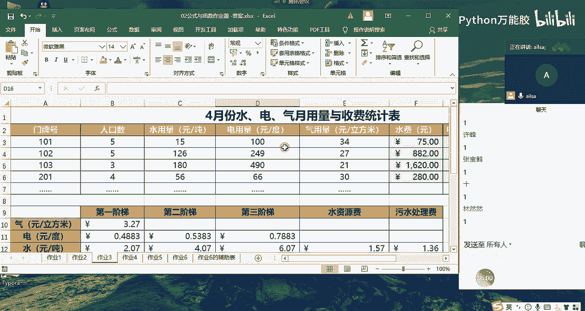
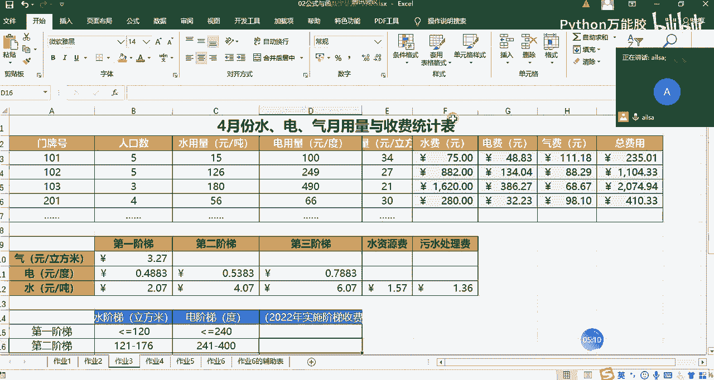
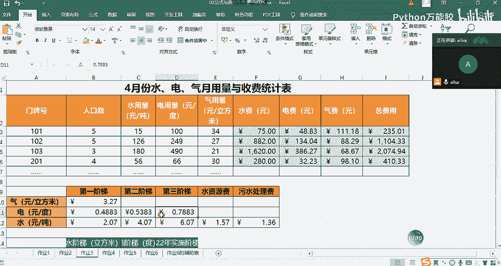
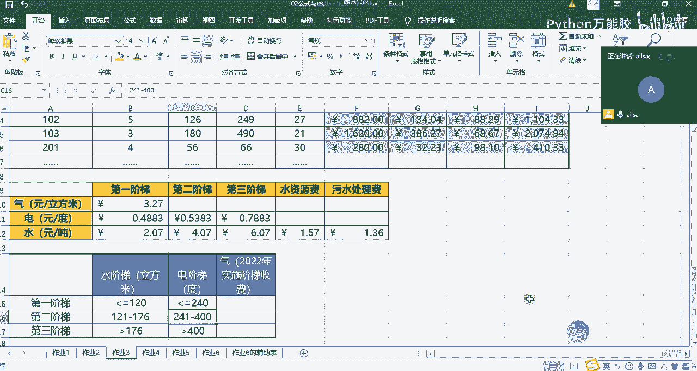
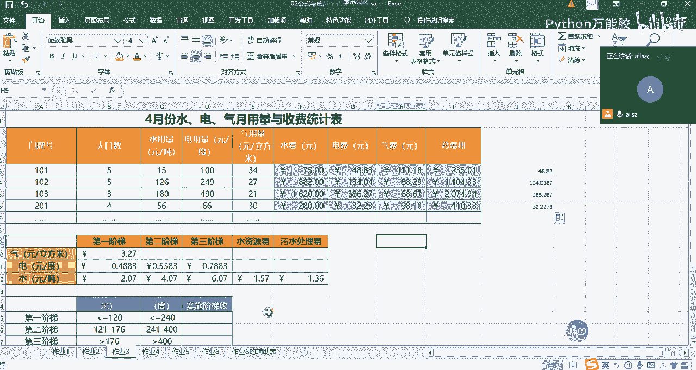

# 【python数据分析精华版来了（附文档代码）】10小时学会Python数据分析、挖掘、清洗、可视化从入门到项目实战（完整版）学会可做项目 - P25：07 公式与函数作业2 - Python万能胶 - BV1YAUuYkEAH

OK嗯，那我们刚才做了这样的一步操作了之后啊，因为我们的公式啊，我们的乘法表一般都是这样的一个形式，对吧？那我们可以看到这个单元格为空的条件是什么？我们来分析一下啊。

我们来分析一下这个一和一是相等的那一跟二一是小于二小于三小于4，对不对？那到这个单元格之后，二是小小于等于二的，然后小于等于三，小于等于四，小于等于5，但是它是大于一的，对不对？

那三呢是大于一大于二小于等于3，也就是说我们会发现这个单元格小于等于这个单元格里面的内容的时候，它就会显示，如果不是它就为为空，对不对？那我们就可以根据这个条件来进行判断。

就是如果说B30小于等于A31。然后我们就让它显示我们计算出来的值，然后否则的话就为空。对吧那因为我们这边要进行进行一个拖动，所以说我们还跟我们后面的这个结果一样，就是在我们的列方向上，在数啊。

在我们的数字啊，前面加道乐夫，我们不希望它的数字往下拖动的时候发生变化。那对于这个行方向上，我们希望它的行发生变化。而列啊啊，我们希望它的呃行发生变化。而列不发生变化。所以我们在列方向上加了道乐夫。哎。

这样的一个结果，我们再重新拉拖动一下，往右拖动，然后再往下拖动，就实现了我们所想要的效果。那九9乘法表呢，它是一个很好的来理解我们混合引用的啊一个题哈。那相信大家在学python的时候。

我记得应该是大家的课程应该在第二天的时候就会用呃用python来实现99乘法表的一个算法，对吧？也是用if的判断，它俩之间的一个值的大小，然后进行一个计算。是吧是吧，同志们，这道题听懂了吗？

听懂给我扣个一。嗯，好的哈。好的。嗯，好的，那我们看作业二啊，作业二的话它其实啊就是一个还是一个条件判断。也就是说我们啊这是一个班级的成绩哈，我们都知道我们上大学都有不同的科目。然后呢。

现在要计算一下三门均通过啊的啊，如果说这个人三门都通过了，它返回的是te。如果不是它返回的就是false。那还有一个就是它三门只要有一个通过了就为troe，有呃如果说都没有通过啊。

三门都没有通过才为fse，那就是if and的一个联合使用，以及if和out联合使用。我在这里跟大家写一下哈。

那它要等于首先我们要写一个if，对吧？然后我们的条件就是它这三科当中只要三门都都要通过，也就是什么叫通过呢？就是大于等于60分，我们就叫及格。然后那我就可以选择啊，我们先把我们的and写上哈。and啊。

我们的函数，然后里面的条件用逗号隔开就可以了。我们选择数学大于等于60啊，然后是计算机大于大于等于60。然后是我们的英语大于等于60啊，这样的一个结果，我们啊啊没输入完哈。sorry。

然后这是我们的and啊，就是我们的条件输入完了之后，如果它成立，我们就返回处啊，在这里面应该是我想想啊，应该是啊如果说我们想返回一个字符串的话，我们就输入处。啊，然后否则的话是返回的false。

大家一定要记得用啊双引号哈啊，不像我们在写python的时候，单引双引都是一样的。在这里话是不一样的哈啊，我们拉动看一下。OK啊，跟我们想要的结果是一样的那如果说啊有3分之1啊，就是只要有一个通过的话。

我们是用的奥写法是一样的。我们只要把我们的and改成奥就可以了哈，复制到这里。然后我把这个and。改成2。就可以了。OK那这就是我们所达到的一个效果哈，这个就比较简单。我们在课上已经讲过了哈。

没有什么问题啊，然后我再接着往下讲我们第三道题啊，第三道题其实啊其实不难啊，它就是逻辑上啊稍微有点复杂而已啊，这种的话在我们的工作当中也比较常见哈。你不要觉得说啊你不要觉得说你在工作当中啊。

就真的啊就会处理一些特别简单的数字哈。有一些还是挺复杂的。

把，这样换了啊，在这。OK我们把它拉近一些，然后去看哈啊，我们看这个数据，就是我们先看标题哈，4月份水电气啊，每个月的用量与收费的一个统计表。

也就是说啊这个表里面是每一户人家它的整个的一个呃人口数量、水的用量，电的用量和气的用量。现在想让你算一下他们每一个月他们这个呃4月份需要交的水费、电费、气费分别是多少。然后以及总费用是多少。

这样的一个呃呃呃这样的一个应用场景。那我们在计算不同的费用的时候，它有不同的标准。那都分为哪些标准呢？我们看一下。啊，对于气而言就比较好算了，对吧？气的话直接就只有一个价格。那我们在这里面算气啊。

就直接是等于哎它的气用量啊乘以啊，它的一个价格就可以了。我们按键看一下是不是？但是我们要往下拖动，所以说我们的这个价格是不发生变化的。我们直接在这加上一个刀勒伏就可以了，对吧？然后我们再往下拖动。

看一下。哎，是不是跟我想要的啊效果是一样的那这就是我们的气费的一个计算方式啊，我在这删面就可以了。然后接下来我们看电费的一个计算方式，它分阶梯的啊，第一阶梯啊，如果说你达到第一阶梯是这就是这个价格。

如果你达到第二阶梯，就是这个价格。如果达到第三阶梯，就是这个价格。那其实就是一个逻辑判断啊，那它是分三种情况，所以说我们需要用到F函数的嵌套。

我们看一下呃电费的话，它的一个的它的一个呃计算的标准。哎，我们看电费啊电费是240啊，有一个阶段，400有一个阶段。那这个时候我们就要写我们的逻辑判断，我先把表稍微缩小一下啊，放到一个框里去写。

OK啊，发不到。OK啊，240啊，400和呃240和400是两个阶段哈。现在我们计算一下的是电费啊，我们先写等于F啊，然后我们先看一下我们条件，我们的条件肯定是电费的一个用量，我们去给大家做一个判断啊。

我一般习惯性是从大到小哈，你也可以从小到哪都可以哈。假设这个它的用量大于啊大于400啊，大于400。那它的一个呃电费的计算方式就是100乘以它的一个价格是多少呢？它就达到了是呃第三阶梯，对吧？

那电费的第三阶梯是这个价格，我们乘以它就可以了。那如果说它小于400的话，它要分两种情况，对吧？分两种情况，一种是小于等于240的那这个时候我们又需要加一个F函数进行一个逻辑判断，就是我们这个电用量。

然后如果说它小于是400啊，然后呢它大于240啊，大于240。啊，大于啊小于等于400，大于240。240啊，这样的一个结果的时候，它返回的就是我们这个电容量乘以啊啊第二阶梯的一个价格。

否则就是我们的电容量啊，就小于等于240的时候，就乘以的是我们的第一阶段的价格，这就是我们所想要的效果。但是在这里我们需要往下拖动。所以说我们这个价格是死的。所以我们需要给它加上道勒福。

就是我们整个的一个11啊，就是我们的价格都需要加上绝对引用的符号。这样的话才不至于说我们往下拖动的过程当中，它的数据发生变化。OK我们输入完了之后，我们需要加两个括号。第一个括号对应的是内内部的F函数。

再加一个括号，对不的是外部的一个函数。其实这个呃这个逻辑判断，对于我们而言真的是太简单了。因为你们用thon写的时候，FLFLF等等，好多好多个判断。我们这个其实就嵌套了几层而已。

然后我们看一下结果啊是一样的对吧？O没有问题，这就是我们的电费的计算，那接下来我们看水费的计算，水费的计算呢跟电费的计算是类似的，它也分三个阶段，但是呢它后面还有一个水资源费和污水处理费。

这个的话是什么意思呢？就是说。啊嗯呃水费是吗？OK他就是说我前面计算了一堆之后，我还要把我的呃把我的这个呃水。啊，看啊水费的啊，这个用量乘以啊我的呃我的污水啊，水资源费和污水处理费，这也是按吨来计算的。

所以说我需要在前面进行逻辑判断之后，还需要单独加上水资水资源费和污水处理费。那这个的话我就不给大家做演示了哈，因为它跟前面是一样的逻辑判断嗯，它这边的分阶段的话是176和120啊。

176和120作为一个分界点来进行了一个计算的。嗯，那大家对于作业三有什么问题没有啊，没有问题的话，给我扣个一。

嗯，好的啊，我讲的应该是算比较详细了哈。O那我们看作业4哈。嗯作业四的话嗯，我嗯作业四其实没必要去讲了。我再跟大家说一下，作业四，它就是说我想统计一下，我想统计一下我这个呃这个清单里面啊。

带借字的啊带介字的一个的呃金额的计算，以及就是借方和贷方，它总共的一个金额的分别计算，那我们相当于是一个条件的求和，我们的条件是我们的借和贷，我们的求和区域是我们的金额，对吧？

然后按照我们sif的一个呃三个组成部分。第一个就是我们的条件区域。第二个就是我们的条件。第三个就是我们的求和区域啊，这个就比较简单了。那贷方也是一样，我们的条件区域条件啊，求和区域啊这个样子。

这个我就不详细讲了哈，然后我们看一下作业5，作业5的话嗯，作业五的话它用的是我们的条件计数啊，条件技数我们看一下它这个它记录了啊我们的呃统计迟到和旷工的次数，呃呃A代表全型，B代表迟到C代表旷课。

那就是一个条件计数，因为它没办法求和呀，它是数它是文本，对不对？那我们就是嗯条件计数的一个组成部分，就是条件啊，条件区域条件，那我们的条件区域就是我们这啊这么多日期当中的一些数字啊呃内容哈内容。

然后我们的条件就是B，对吧？旷课的话就是啊我们的C，然后我们这边写完了之后进行一个计数就可以达到我们所想要的效果，对吧？这就是count if的一个考察，然后我们再看作业6。

嗯，作以六的话大家遇到的一个问题在于什么呢？在于这个出生日期哈，因为出生日期我们是从身份证号码当中提取出来的，提取出来的时候，有可能它不是日期格式，然后我们啊来一一演示一下这个东西哈啊。

首先我们要提取我们的呃那个出生日期，那我们是要使用me的函数，因为它要从中间去提取，对吧？然后我们知道它是从第七位吧，123456对，第七位啊，第七位开始，然后取8个啊这样的一个内容，然后按按键，哎。

我们看到它已经有了，对不对？1980年3月23号，然后我们把它选择了之后，我一般建议我们先把公式去除掉，我上回教大家的是选择性粘贴直接粘贴数值就可以了。那我今天再教大家一种更简。变的方法。嗯。

嗯大家看好了哈看仔细了哈，我把鼠标选中这一列，然后啊然后大家看到没有？嗯。Oh。嗯，你这个也没有问题，同志们刚才是不是卡了？啊，现在能听到我的声音吗？能听到呃呃，可以哈，OK好的，嗯。

你这个也没有什么问题啊。可以的。啊，因为你是呃你是把年月日提取出来之后使用date来实现的，完全OK哈，很好啊，我给大家演示我这种方法哈，听我讲完，然后我们选择这一列，然后在当鼠标出现，大家看到没有？

当鼠标现在是我这个状态。也就是说四个方向的箭头的时候啊，也就是选中边边上四个方向箭头的时候，我按住鼠标的右键不放。向左拖动一下啊，向右拖动一下，然后再拖动回来。这个时候我们选择紧复制竖值啊。

它就变成文本了。就可以直接把公式都去除掉，你看在这里啊直接去除了，然后我们把它变成日期格式就可以了。也就是我们的数据分列。嗯，然后点击下一步，点击下一步，选择日期输出完成。OK它已经变成日期了哈。

如果大家不想要看到这样的一个形式，我们直接输出这样的格式也是可以的，看到没有？这个已经啊就是我们想要的日期格式啊，那接下来我们看一下后面的一个要求，年龄啊年龄怎么计算呢？就是我们的当前的时间对吧？

当前的时间减去我们的出生日期啊，它就是我们的呃年龄，那返回的是一个年Y，对吧？嗯，这是年龄的计算，这个倒没什么问题。但是前提是你这个这个一定是日期格式哈，不是日期格式，它是识别不了的。

这就是为什么我告诉大家，在我们计算表的过程当中，一定要是日期格式。然后工龄是怎么来计算的，就是当前的一个时间减去入职日期，就是我们的工龄。但是我们的。公龄是以年作为统计单位。那这个有什么不好的点呢？

就是说如果他不满，你看他这个我们计算一下哈。啊，现在是2020年6月，那他这个入职日期是2003年1月啊，也就是说他算整年的话是17年，但是它是17年多点，不足一年呢，它就直接舍去了啊，是这个意思。

现在我们要计算到呃工龄精确到月的时候，我们还需要把工龄计算出来。然后再看它的月份是多少。这里的话我们采用的是这样的一种方式，就是我们把它的月份差值计算出来之后，除以2，它整除啊。

整除整除12得到得到的那个余数，哎，那个余数就是它剩余的这个月份。那它整除的那个比如说它除以它那个值得到的整数，就是它的年啊。嗯。Hello。同志们，信号弱吗？啊，在吗？都。呃，信号好吗？

因为我这边一直显示信号弱。OK没有问题哈。哦。信号没问题OK我这边一直显示信号弱。好嘞，那这就是工龄的一个计算方式啊啊还有我们的一个工龄的月份的计算方式。大大家对这个有疑有疑问没有？没有疑问。

给我扣个一。OK啊嗯。嗯，可以。你想直接相减吗？相减得出来的应该是添吧。我可以试一下。嗯，你如果不用dd的话，你想用什么呢？哦，你你想要还想用函数的话，最好还是用d to date啊。

它是一个嗯它是一个很好的处理时间差的啊这么一个函数啊。嗯，我我最后再呃再说一下，很多人说嗯你说有一个结果的呈现，我到底是用函数好呢，还是用操作好呢？啊，我跟大家说一下，如果说你要用函数的话。

因为函数它的底层封装的还是代码。所以说它的它对于系统对于这个函数的处理的话，相对于操作而言会慢一些。啊，会慢一些。我看一下烟文啊，这个d个d然后。减去是减去呃I2乘以12。嗯。

所有的嗯excel里面啊都不会啊dd是一个隐藏函数啊，是一个隐藏函数。也就是说它不会它它如果你呃如果你不使，如果你使用它它是没有提示的啊，但是据我所知的话。嗯，除了03版，我不知道03版有没有。

但是07版之后都是有的啊。如果闫尾这边集算的结果是没有问题的，也是可以的啊。啊，只是我们的一个相当于是一个公式的问题哈。db正好在07万级以后都是有的啊，这一点我可以保证嗯。

OK那接下来是我们的一个呃省直辖市呃县的这样的一个计算方式哈这个嗯。好，我先问一下大大家对于这个目前的一个呃呃呃掌握了吗？嗯，就是说我们we look up的时候，我们的目标啊。

我们的目标是通过前面的一个身份证号码去提取的，相当于是一个嵌套的使用啊，嵌套的使用OK啦是吧？啊，对，嵌套嵌套的使用我提取出来啊，仍然没有搞定吗？这个所在的直辖市和地区。是吗？是的。

OK那我重新演示一下哈嗯。我以为可以呢，OK。啊，那接下来我就告诉大家，我们该如何通过啊提取我们身份证号码的前几位，然后去匹配我们这个表里的所对应的啊所对应的啊市啊和呃这个对应的呃省市吧啊。

就是对应的省核市我们看一下哈。OK呃，那我们先研究一下哈，先研究一下我们这个身份证号码，我这边的公式里面写的是。啊，第二的前两位前两位是37哈，我们先啊做个试验哈，37。啊。

它这个前面啊前面是代表的是省，然后后面代表的是我们的啊对应的一个区啊什么什么的这样的哈，我们试一下，我们先试一下哈。等于啊we look up啊we look up。第一个是我们的查找内容。

假设现在我们只提取前两位，那我们就是learn啊，我们从啊left是吧？left哎，我们这个。表的身份证号码，然后我们提取前两位，前两位之后，我们得出来的就是对应的是我们省的编码啊。

就是我们要找省的编码，在哪个地方去找呢？在我们的辅助表里面去找哈，辅助表里面去找。这个时候我们选择的时候，我们只要选择我们两位的啊东西就可以了。我们试一下啊，然后我们选择这一部分数据区域。

然后加上绝对引用选择我们我们的数据区域之后，我们是在我们选择区域的。

啊，第二列啊要的值对吧？我们要的是省，然后返回零啊，精确查找。andad键，我们试一下。双击进来是不是就是我们所达到的一个想要的效果了，对吧？哎，这样的一个呃一个结果啊啊，那个然然听明白了吗？

你这边卡在哪儿了吗？啊，你问他啊，知道自己的问题所在就可以了哈啊，没加do了是吗？啊，这个一定要加这个一定要加，不然的话区域会发生变化啊，一定是如果说我们某一个区域是不变的话。

你在拖动的时候一定要加do落。那对于曲线的一个选择，我就不做演示了，是一样的哈，也是这么来操作的那其实你会发现说我们在用函数的时候，并不是说一个单一的函数。

而是说我们要把一些小的函数和一些大的函数进行一个嵌套的使用，然后来达到我们所想要的效果。所以说大家对于函数的一个了解的啊组成部分呢以及以及它的功能啊一定要了解明白，然后才能够进行一个融汇贯通的使用。

好吧。那我们呃函数与公式的作业。