# 【python数据分析精华版来了（附文档代码）】10小时学会Python数据分析、挖掘、清洗、可视化从入门到项目实战（完整版）学会可做项目 - P28：01 昨日回顾 - Python万能胶 - BV1YAUuYkEAH

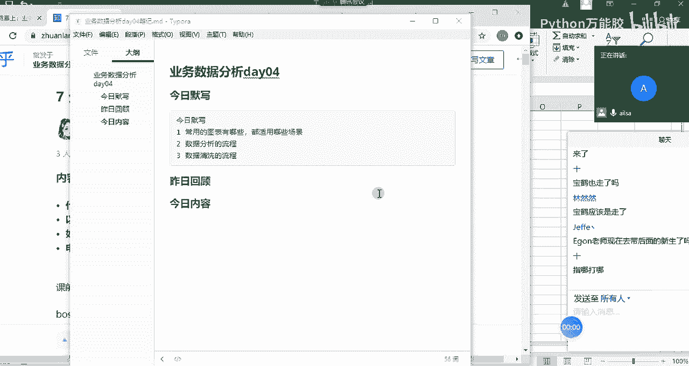

好的，同学们，那我们呃就是默写已经完成了。然后我给我给大家说了每个人存在的哪些问题。然后嗯我们在后面注意一下就可以了。然后接下来我就进入到我们的昨日回顾。哎，我们昨天讲了什么内容啊。

其实就在我们的默写当中了，是吧？所以说我直接来讲就行了。今天的讲课的任务有点重哈，我们就不提问了嗯，然后我们昨天主要讲了两个啊内容，一个是我们的图表操作。嗯，图表操作。

然后第二个就是我们讲了一个excel的一个啊啊实例啊，我们通过这个实例给大家介绍了啊我们的数据分析的流程，对吧？还有就是我们在其中啊我们在进行数据清洗的时候，它的一个步骤啊，这样的这些内容啊。

相对来说是不多的哈。那我们看一下图表我们都讲了哪些。

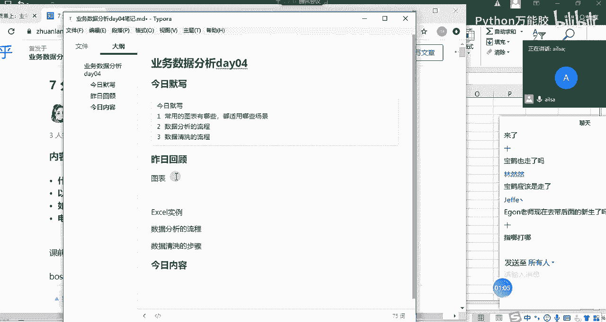

来，我们看一下哈。图表我这边回忆一下哈，图表我们讲了柱状图，对吧？哎，我们首先介绍的是图表的一个组成部分啊，组成部分啊，这是第一个啊，就是它的结构构成。那第二个的话我们讲了不同的图表类型。

我们讲了啊有柱状图柱状图啊，还有就是条形图。条形图，然后以及啊我们还讲了是折线图，对吧？

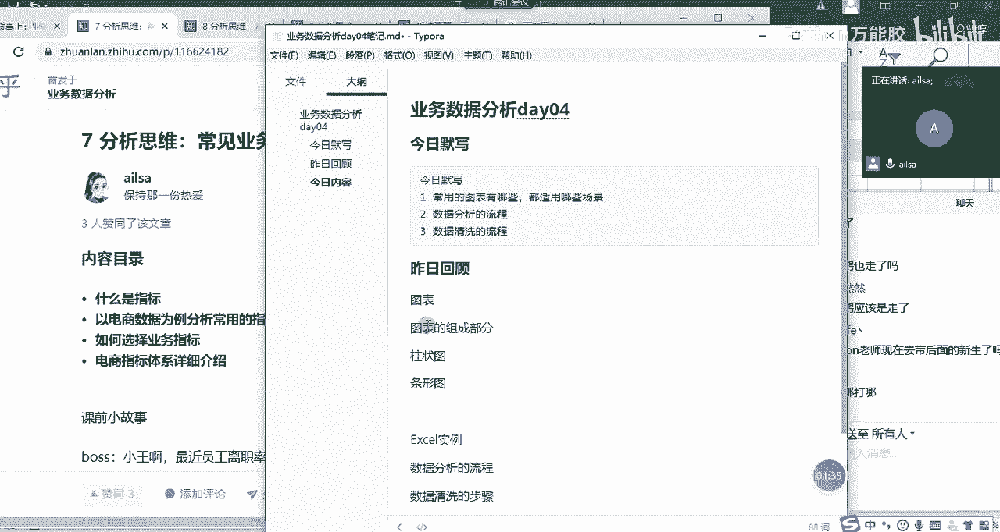

折线图啊，以及我们的散点图。

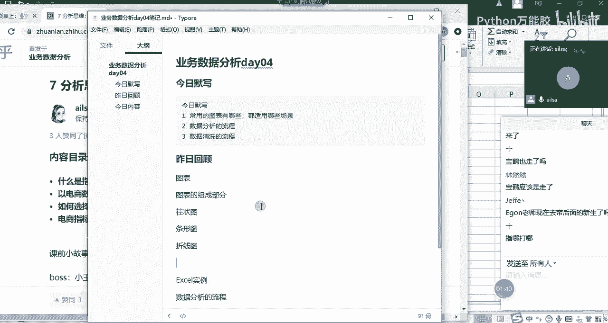

还有气泡图啊，以及我们还讲了我们的啊丙图啊雷达图。

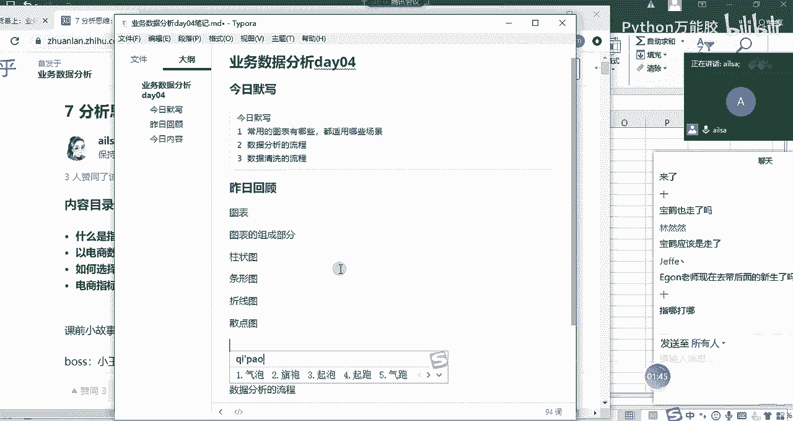

啊，还有组合图，大概应该是这么多哈，我记得大概应该是这么多。okK这是我们上节课当中讲的这些内容。那对于柱状图而言，它是在垂直啊是垂直。啊，垂直方向啊进行啊不同类型的数据对比。

所以说它主要是用来对比的那条形图的话，它是在水平方向啊，进行不同类型的啊数据对比，我少个面积图是吧？好嘞，等会儿啊。看一下。OK少了一个面积图。OOK那折线图它一定要是反应一段时间内啊。

某一类型或多个啊类型在。呃，的一个变化趋势，一段时间内某一类型或多个类型的一个变化趋势或者数据变化趋势。那如果是多个类型的话，它不仅仅能够体现在一段时间内，它还能够体现这些类型之间的一个对比情况啊。

这是折线图，一定是一个变化趋势，一个走势和一段时间内啊，再者就是散点图，它反映的是一个二维啊，也就是说两种数据类型啊，之间的啊线性关系哈和之间的一个相关关系。嗯，相关关系我们是用的散点图来体现的。

气泡图的话，它访问它其实跟散点图是类似的，它就多了一个气泡的大小，所以它可以反映三维或者是三种数据类型啊，数据之间的啊之间的某些联系哈，我们只能说是某些联系或某些关系不一定是相关的啊啊。

三维数据之间的一个某些联系。那丙图呢它主要体现的是部分与整体的一个关系。也就是部分啊部分啊与整体。啊，整体的关系比如说占比啊，就是一个整体由哪些部分组成这些部分，它的一些数据的一个占比情况啊。

进行一个对比和分析哈，就是丙图。那雷达图它是反映。

啊，反应不同类型啊不同类型在啊不同维度或者在多个啊维度的一个啊综合啊对比啊，综合对比分析。我们也叫能力图。也就是他在多个维度，这些维度值啊，他们呃比如说我们的一个考核。那他会在沟通能力，技术能力。

还有他的一个呃其他比如说呃学历啊等等这些方面能力进行一个综合的对比分析。然后来去评估到底哪个人能力更强，或者说哪个人在哪些方面更具有优势啊，那还有一个是面积图。嗯，面积图的话，它就是通过啊面积的大小。

啊，来啊进行啊不同类型的数据对比，啊，就是面积越大，它的呃整个的一个的数据就会越大。通过面积大小来进行一个对比分析。那组合图主要是啊运用啊两种啊。两种一般是两种哈会议上两种不同的。

图表类型啊类型就是它组合图肯定是不仅仅一个图表类型，肯定是两个图，两个及以上的图表类型，然后进行的啊进行的一个数据啊展示啊和分析啊，你比如说在什么情况下，我们会使用组合图呢。

就是说我们在对两类数据进行一个对比的时候，他们相差的啊，他们相差的值特别特别大，我们用一种数据，一种图表类型已经完全体现不出来它们之间的一个差异了。也就是说他们之间没有一个可比性。

那我们就可以通过啊两种啊数据两种图表类型来进行一个体现。你比如说啊我们的销售额跟我们的销售额占比啊，一个是0到1之间的，一个是几千几万啊，即是几十万这样的一个数据。所以说我们会用到组合图。

这就是我们图表啊，这些讲的这些内容。那我们再看第二个，我们讲的excel的实例。我们讲了啊就是通过一个实例来介绍我们数据分析的一个步骤和流程哈。那excel的数据分析的步骤，首先第一个就是明确问题啊。

因为你要对数据进行分析，你首先要知道啊对方想要什么。所以说第一个你要把对方的一个需求搞明白，就是要明确问题哈，我们也可以叫明确需求啊，明确需求也可以。然后第二个的话就是你明确了需求，知道对方想要什么。

想要解决什么问题。那第二个就是你要确定你的思路该怎么去分析啊。如果说你这个的问题比较大，你的思路肯定会稍微复杂一些啊。比如说你先啊从哪个哪些维度去分析，采用什么分析方法啊，然后等等这些。

如果说这条路走不通，你还要再换一条路啊后去。

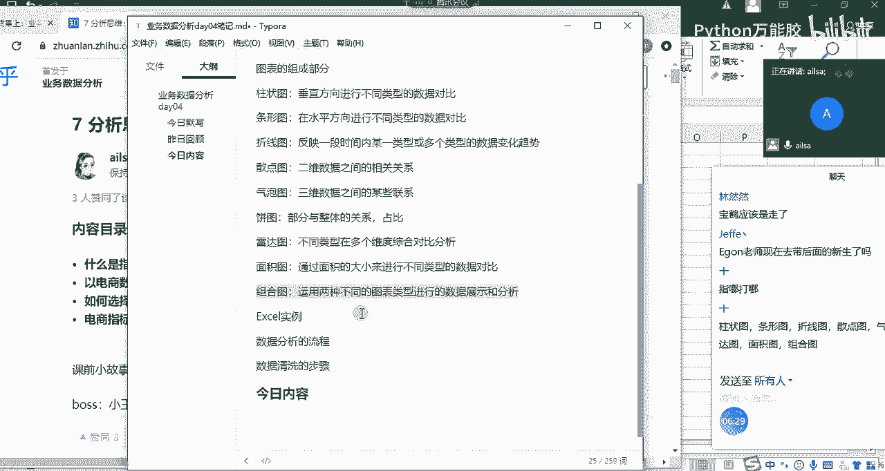

啊，去确定你的思路这样子。那第三个的话啊就是。我们前面两个工作做完了之后，我们接下来就要干实事了，也就是就要做具体的分析了。我们在做任何数据分析之前，都要是先获取数据，获取到数据之后。

不是说这个数据就比较完整啊，比较干净。我们需要对它进行一个数据的清洗哈。我们这里也可以叫数据处理都可以数据清洗，数据清洗完了之后，我们才能啊结合我们的思路，还有我们完整的数据进行一个数据分析。

分析完了之后，我们会进行数据可视化啊，数据可视化，就是数据呈现。然后如果说啊这个项目比较大。然后我们还需要对它进行一个数据报告的撰写和数据和那个呃专门开这样的一个会议进行汇报你的工作成果。

那最后呢我们要提出自己的一个建议方案，然后进行一个落地执行啊，建议方案啊，落地执行。

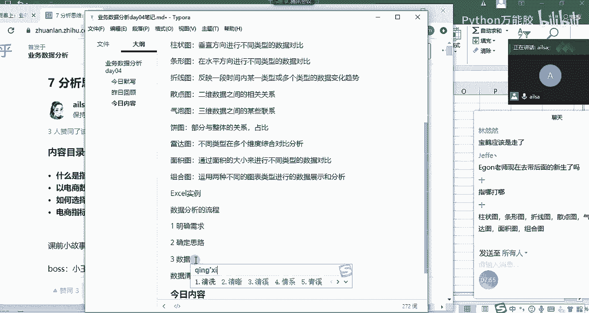

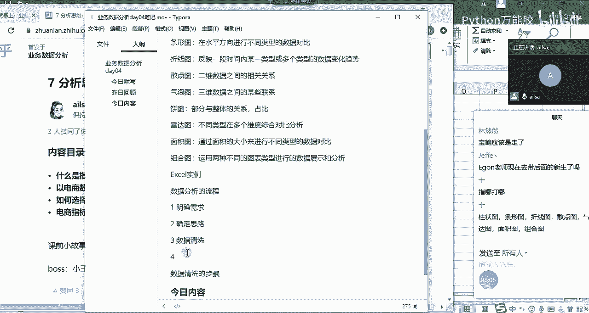

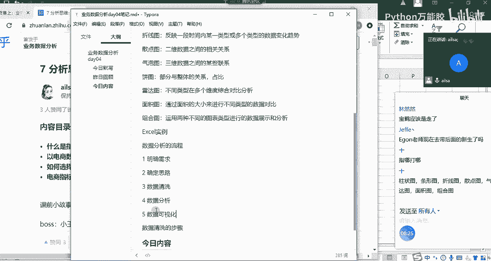

然后还要进行一个跟进啊跟进啊，效果跟进效果。也就是说你做出来这个分析报告得出了这样的一个结论，它应用它到底呃业务方有没有采纳，那采纳了之后，它这个效果怎么样。如果说不好，我们是不是要再重新来一遍。

再进行一个更加深入的分析，然后找到问题的原因，然后再一步一步这样去操作，这就是我们数据分析的流程。

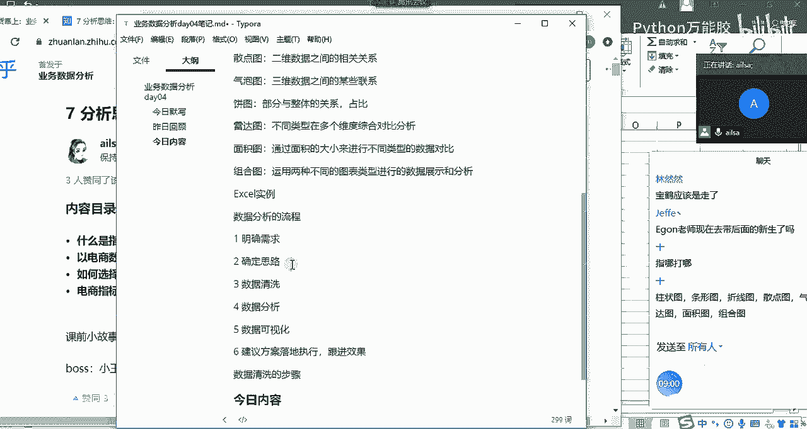

接下来给我们看我们在进行数据清洗的时候，其实是一个非常重要的一环。因为数据清洗它是占我们整个数据分析的过程当中啊，很重要的一个环节。所以数据清洗的步骤的话，第一个就是选择子节啊，这个其实嗯呃怎么说呢？

呃，我只是在这里给大家总结了。我在工作当中有可能会涉及到这些步骤，但绝对不是啊绝对不是一成不变的。你你必须你必须得先走第一步选择子集。没有哈。如果如果不需要，你就可以不走。那第二个。选择子集完了之后。

就是列啊列重命名，对吧？我们的列名如果不合适的话，我们需要再进一个重命名啊。第三个啊，列名重命名完了之后，我们看一下哈。

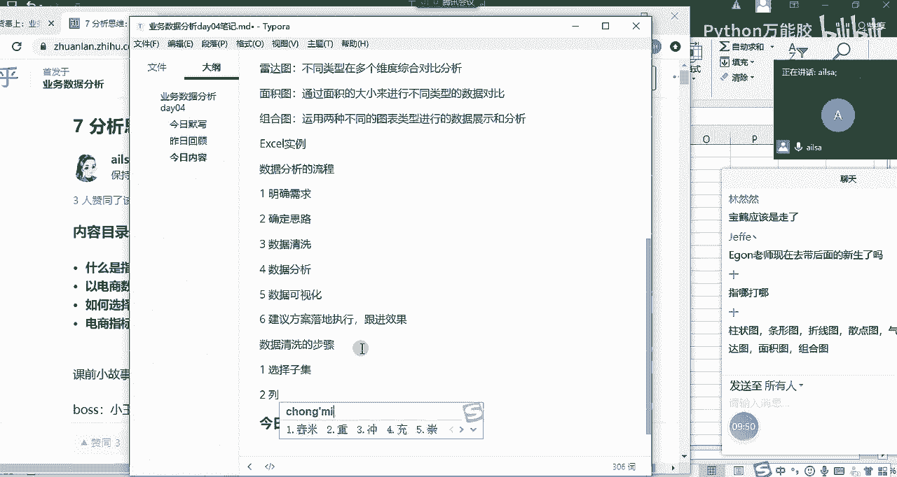

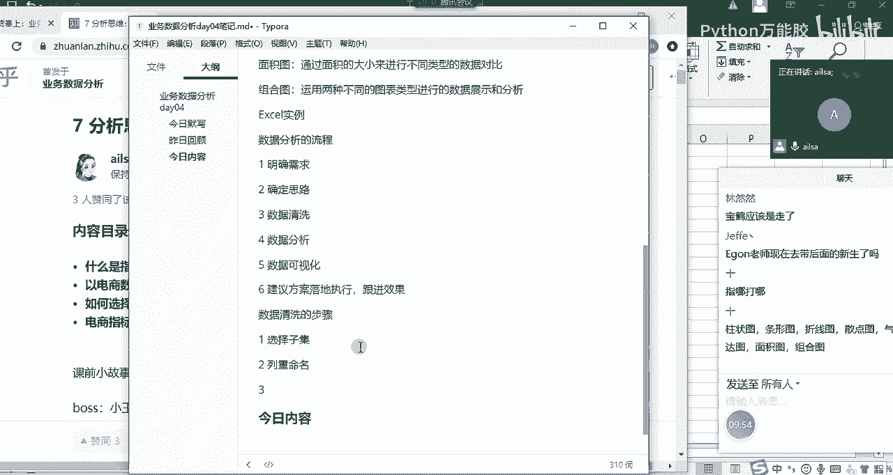

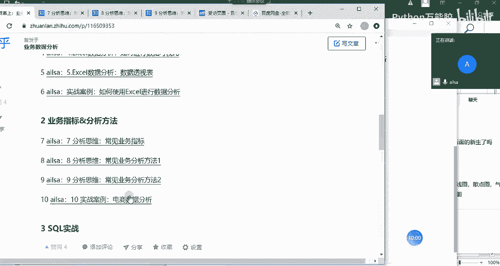

我们的呃。好，我应该是放在这里哈。2030。

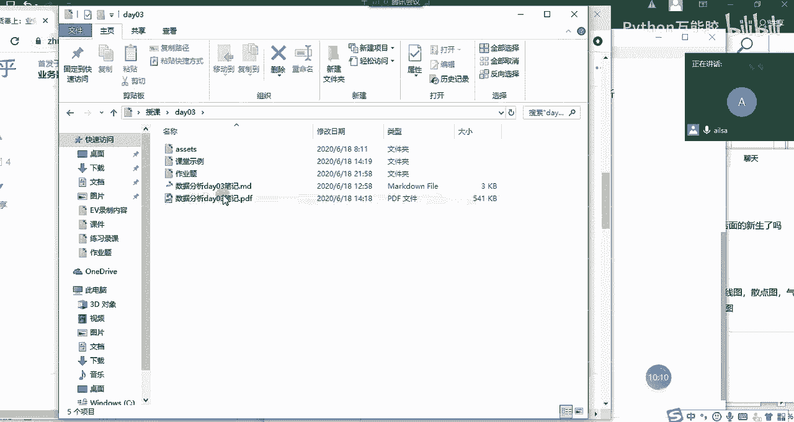

我们之前画了一个图哈。

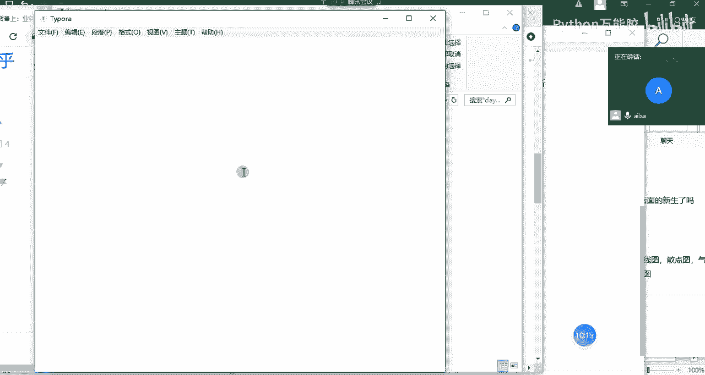

啊，那我们再进行啊在进行呃数据清理的过程当中，就是重复值的一个处理啊，缺失值的一个处理，还有一致化的一个处理啊，就是列名啊重呃就是列重命名，我们需要对它进行一个。如果有这样的一个情况，我们就处理。

如果没有就就就算了。然后还有就是删除啊重复值。这个的话是经常用的。因为我们的给的表当中难免会有重复值的存在。所以说删除重复值这一项的话，我们是要再检查一下的啊，然后第四个啊就是。

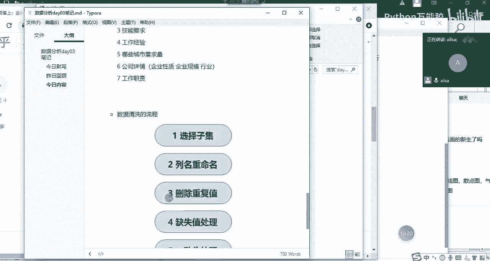

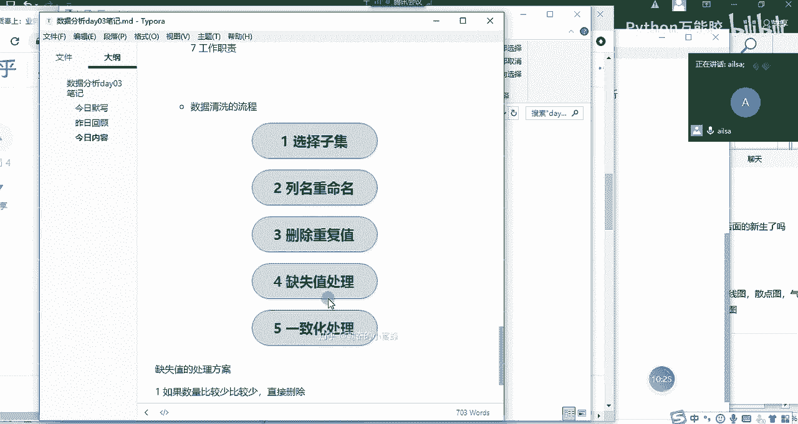

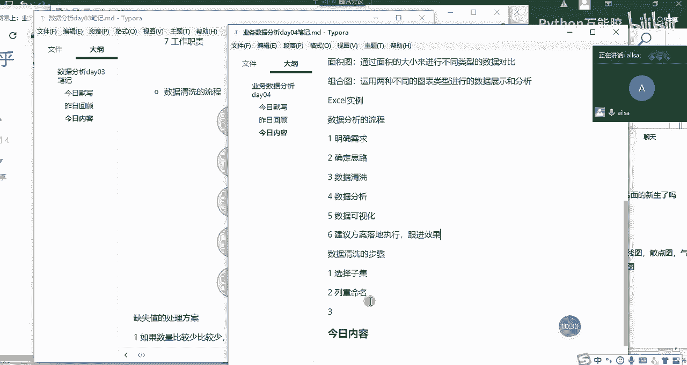

啊，就是我们的缺失值的处理啊，叫空值的处理，缺失啊值啊的处理啊。也就是说我们的数据如果里面有缺失的，哎，我们该怎么去处理？我们有三个方案，对吧？第一个就是如果呃数量不大啊，数量不大，那就直接删除，对吧？

啊，不影响我们的结果就直接删除，这个数量不大是相对于你总体的数据而言，它数量不大啊，那第二个的话是什么呢？就是它如果是文本啊内容的话啊，而且量也不大哈，量啊数量。数量也不太大啊。

你可以根据其他列的内容进行啊人为修改。也就是说，因为列跟列之间它们之间是有关联关系的。所以说你可以根据其他列的内容去判断这里面大概是什么内容。当然它的量如果太大的话，你人为修改起来，工作量很大的时候。

我们也不建议这么去操作。然后第三个啊，第三个就如果是数值啊内容的话，然后它缺失量比较大的时候，我们可以采取啊采取填充啊，填充。我们可以用什么呢？均值或者是中位数。啊，都可以哈。但是我们优先是均值。

那什么时候使用中位数呢？就是说你使用均值的时候，你会发现这个数据这一类的数据离散性比较大的时候，也就是说它的数据差异很大。你用均值你用均值完全代替不了它整个的一个水平的时候，你就要需要采用中位数了。

这个我们在后面统计学的时候会讲到均值和中位数的一个差异啊，这就是我们的缺失值的处理。缺失值的处理和删除重复值。这两个在我们进行数据处理的过程当中啊，几乎是啊都要用到的啊。第五个就是一致化的处理啊。

什么叫一致化的处理呢？就是说有一些单元格里的内容，它不符合要求。比如说哎我们呃昨天讲到的那个工资。因为我们要计算它的工资的平均水平。所以它必须是数值型，但是它确实文本性，而且它是一个区间。

所以我们要根据啊实际啊情况。对数据进行啊统一规范啊，这就叫一致化的处理。在这里还有一个啊大家记一下，还有一个我没有讲叫异常值的处理。啊，异常值的处理。我们昨天其实也也说到了。

就是说我们在对我们的整个的一个呃采集过来的数据当中，如果不是相关数据分析师岗位的数据，我们是需要给大去除的那这个就属于异常值哈，就属于异常值，异常值的去除，就是我们需要人为判断哈，人为判断啊。

去啊去进行删除啊，如果是文本的就是人为判断。如果是数值呢啊数值呢，我们比如说嗯我们可以求一下它的最大值最小值等等这些。因为你比如说我们有一个订单的数据。

然后它每天的一个每个订单的一个销量撑死了也就啊10个左右，或者说一个两个一个订单下的下的商品的个数哈，一般不会超过10个。但是如果有一条数据，它一下子达到了几千个。

然后造成了你所有的一个呃你分析的过程当中都会受到这个数。

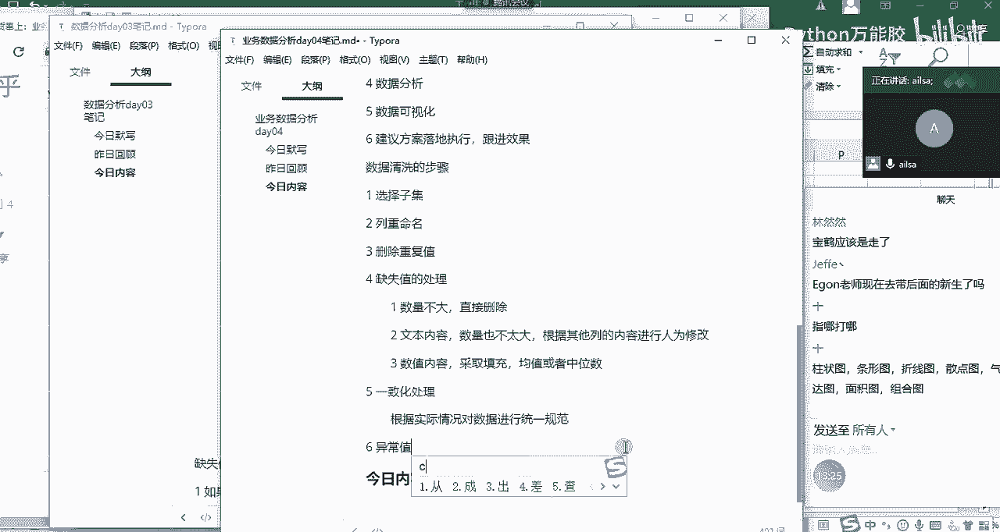

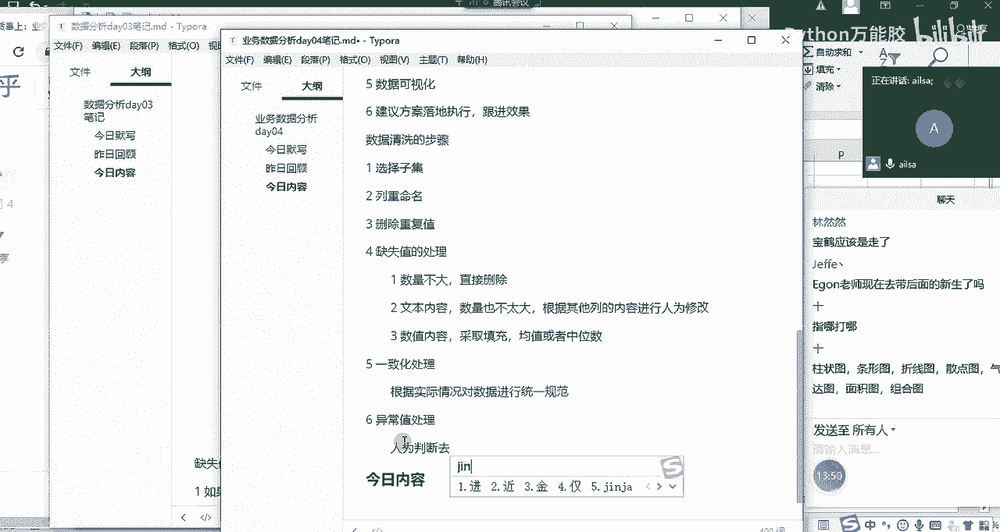

的影响的时候，他其实就是可能是属于异常值，因为它有可能不是一个人购买的，他有可能是公司集体团购的那这个对于你的分析来说就没有什么重要的一个参考值。而且它直接会带跑偏你整个的一个分析的结果。

所以你要把它剔除。所以说数值的话也是需要进行。啊啊，怎么说呢？啊，进行啊啊进行经验啊经验的判断吧。啊。这样的一个啊就是我们需要对异常值，然后进行一个关注，看一下他们的最大值，最小值有没有说特别偏的。

如果特别特别偏，我们就需要把它给删除啊，就不要这个异常值。因为它会影响我们整个的一个分析结果。那我们昨天讲的内容大概也就是这么多了。因为昨天我们讲了一个实际的案例。

也引入了我们数据分析的整个的一个过程和我们怎么进行一些一次完整的数据清洗的流程，然后大概是这样啊，OK那我们在啊我问大家一下，对于昨日的回顾，大家有什么问题，没有没有什么问题扣1。

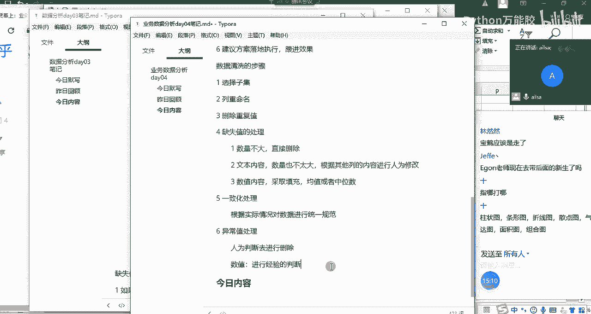

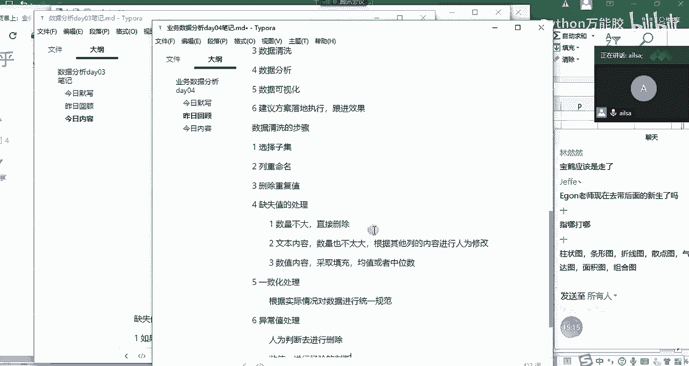

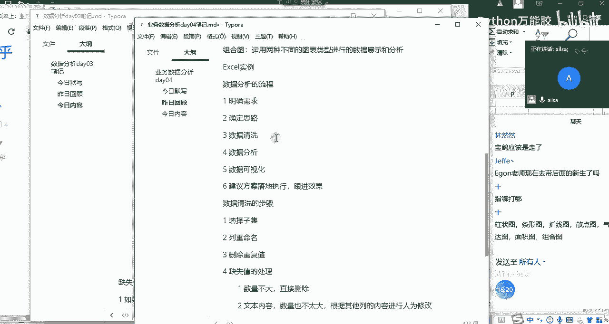

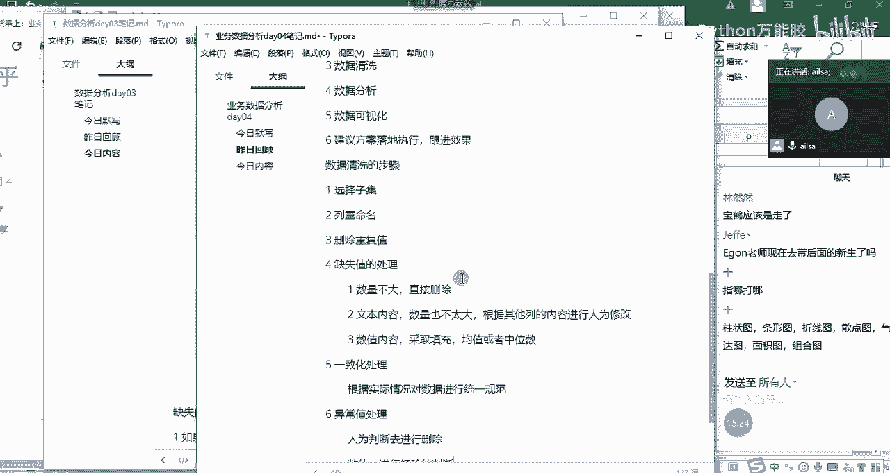

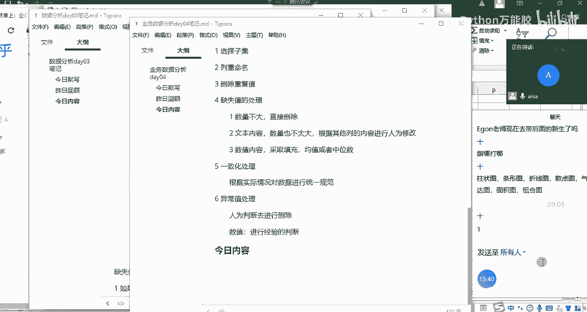

好好的嗯，那我这边断。