# 【python数据分析精华版来了（附文档代码）】10小时学会Python数据分析、挖掘、清洗、可视化从入门到项目实战（完整版）学会可做项目 - P32：05 行为维度指标 - Python万能胶 - BV1YAUuYkEAH

处理就简单了哈，我就讲的快一点哈，因为可能我讲的太详细了啊OK呃，首先我问大家有没有啊有没有听说过PVUV。啊，有没有听说过PBUV？访问量点击量。哎，这是。H是不是？嗯，听过是吗？

那我跟大家演示一下哈，你比如说我现在打开啊，大家想看哪个网站啊。

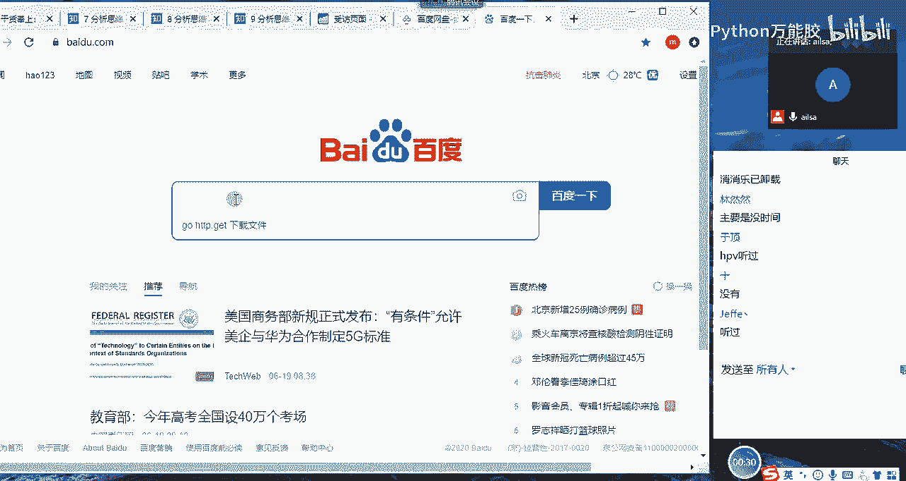

嗯，知乎吧。啊，比如说现在我打开了知乎啊，这个时候啊这个时候那我就相当于是一次点击了啊。比如说我点击这个详情页啊，这个标题，那这个时候又又对于这个详情页而言，我又算一次点击了。对于整个网站而言。

我已经算两次点击了。那接下来哎我刷新了一下。

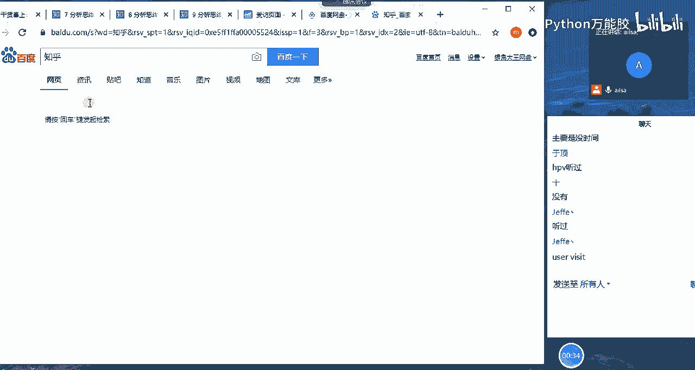

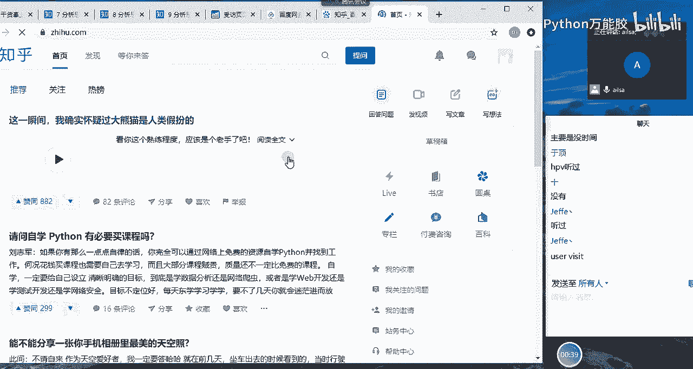

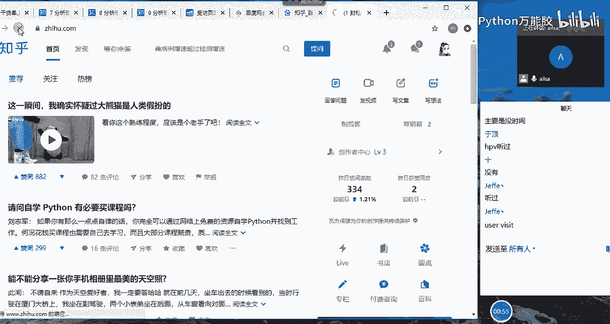

啊，刷新一次也算一次点击，为什么呢？因为我们的点击量的计算指的是前端页面向后端发送一次请求，就算一次点击。相信大家前端啊后端都学过了，对吧？啊，所以说呃所以说我们的点击量的计算就是大家从底层的去理解。

就是说我前端页面向后端发送一次请求，那么它就算一次点击量。哎，比如说我点击这个，它肯定会向后端发送一次请求，把这个详情的页面给我显示出来，对吧？啊，那这就是我们的点击量啊，那我们再看第二个。

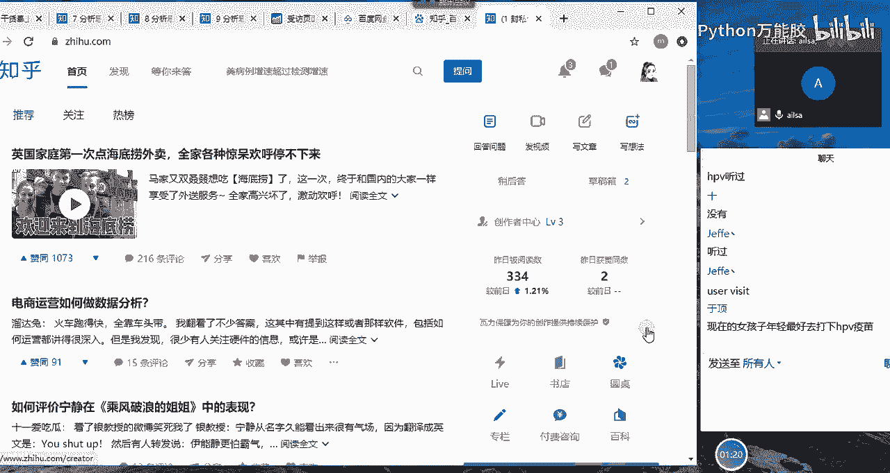

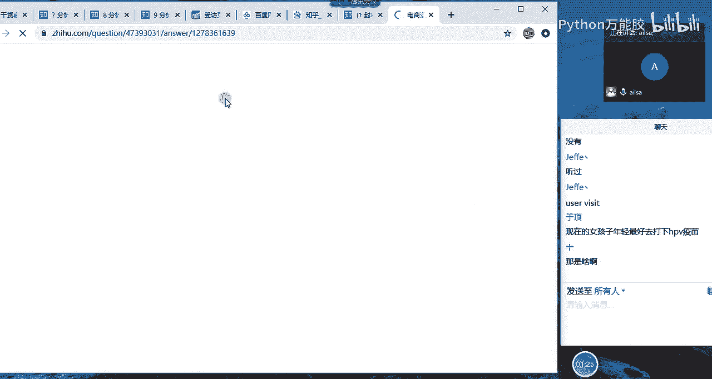

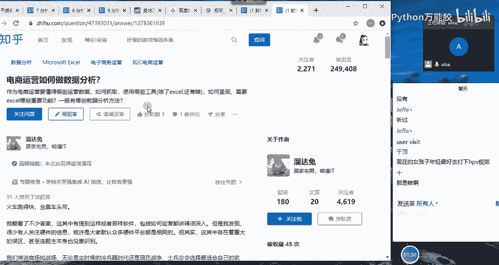

啊，是我们的UV独立访客数。那是什么意思呢？你比如说现在在我这台电脑上，我有我自己的一个cookie，对吧？浏览器都有自己的cookie。然后我在这访问访问，然后就一直在访问知乎里面的一些数据啊。

或者是一些内容啊，乘风破浪的姐姐啊对，然后我访问了之后呢啊这个时候我走了啊，或者说下午的时候，思敏过来说，哎，我想用一下你的电脑，然后看一些东西啥的然后他又打开了知乎。那对于呃对于实际的实际当中。

我们俩其实算两个客户了对，两个用户，但是他能识别到的还是一台电脑，一个cookie，所以说只能算一个嗯，那如果我们的电脑不再不清楚cook的话啊，就是思敏在用之前不清楚我的cook的话，还是那一个啊。

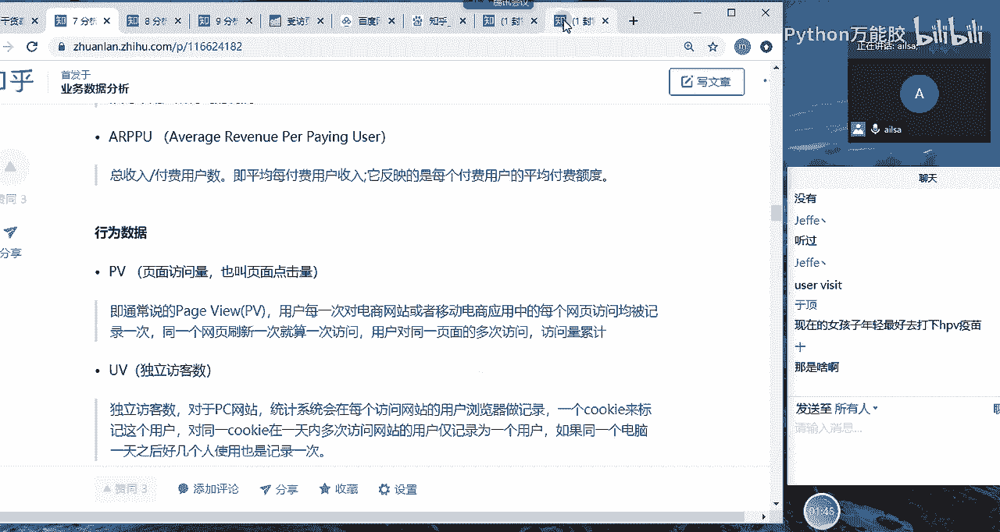

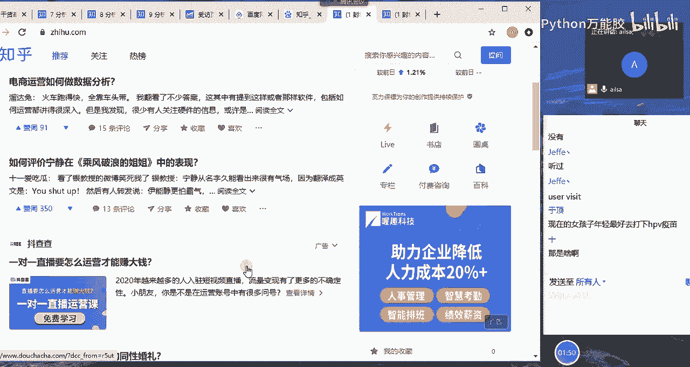

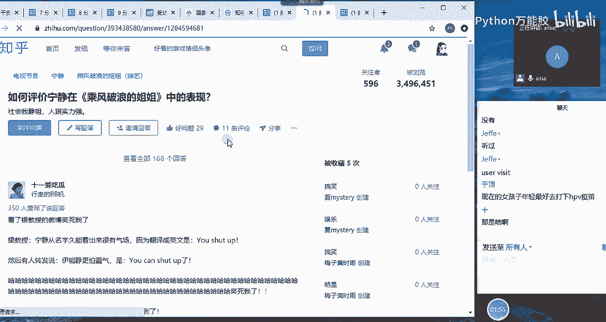

啊，是这个意思哈，这就是我们的啊它主要是以cookie来标记这个用户的啊呃就是对同一个cookie在一天内多次访问网站仅仅为一个用户。如果同一个电脑一天内被好几个人使用，也会记录一次。

这就是独立访客数啊。那我们看一下另外一个统计方式呢？叫IP啊，什么意思呢？他他就是为了避免啊，就是说同一台电脑好几个人使用，它就只记录一次的话，我这个数据会不被不准。

所以说他使用1个IP那IP是主要是以电脑啊，电脑的1个IP地址作为统计方式。它这个也会有问题。

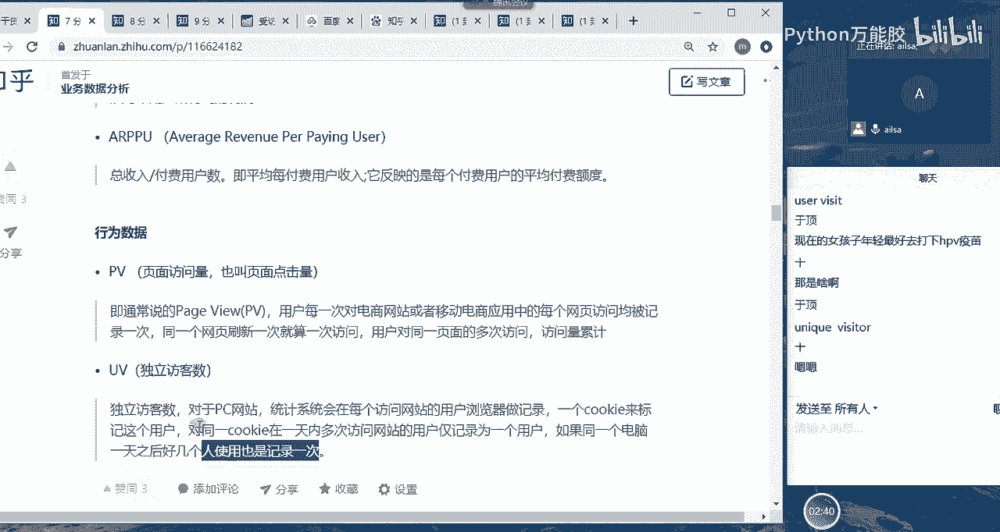

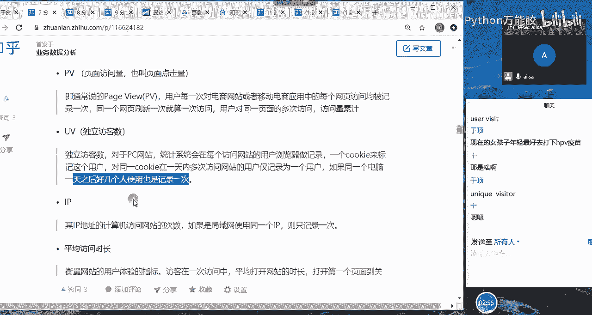

呃，他他这个也会有问题，而且他这个问题会比这个UV还要大啊，你们就不要再讨论这个。这个这个东西了啊啊这个这个IP比UV这个问题还要大啊，是什么呢？是因为呃比如说局域网大家的IP都是一样的。

所以他会算一个客户。而且说如果说呃对于同一台电脑好几个人使用的话，它的IP也是一个，所以也避免不了这样的问题。所以我们一般统计用户数的时候都使用的是UV好吧。

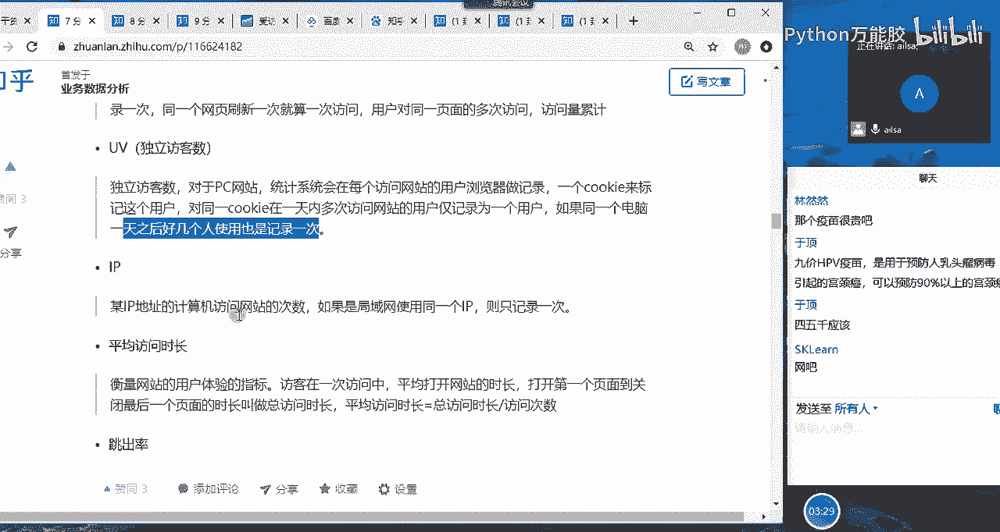

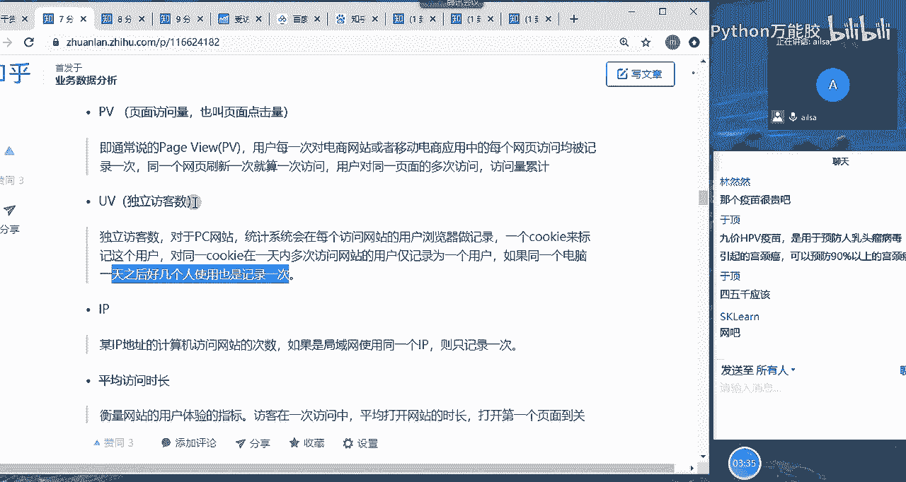

啊，好吧啊，然后下面是一个网站的平均访问时长。也就是说我们访问一个网站，从第一次打开到最后一次离开的一个总时长，然后除以我们的访问次数，也就是我们的点击次数，我们可以把它理解为点击次数，总访问时长。

所以我们的点击次数次数啊，嗯，这是我们的平均访问时长。然后还有个跳出率。跳出率是什么意思呢？就是说你来到这个网站之后啊，只访问了一个页面就离开网站的一个访问次数。

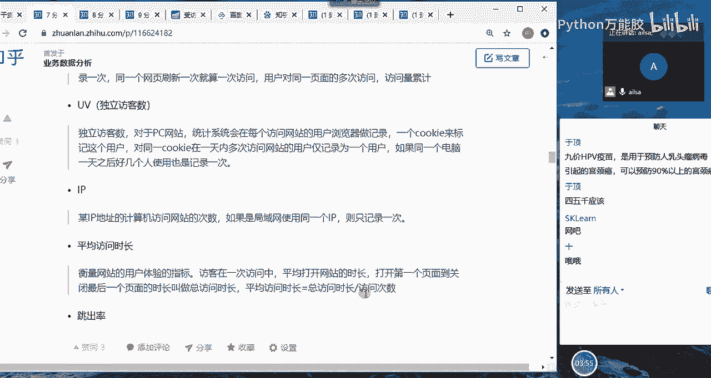

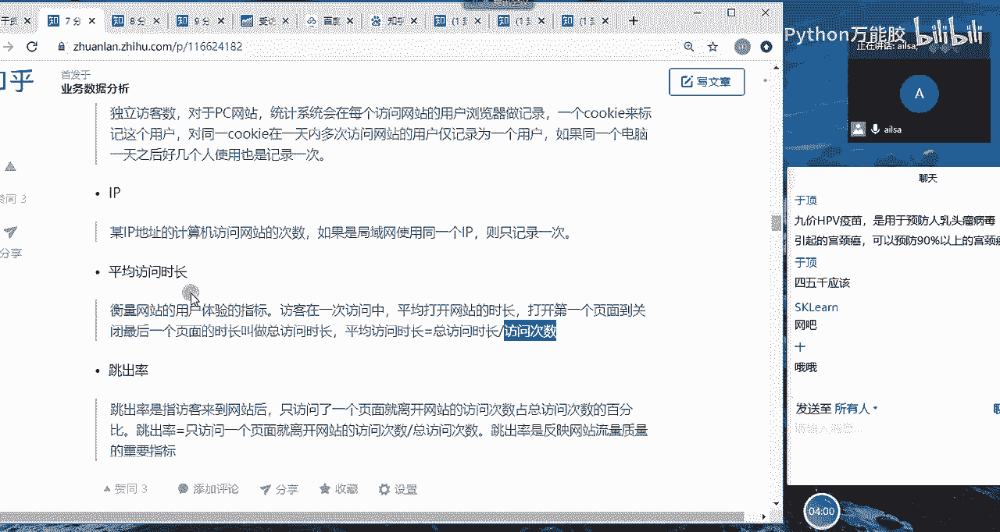

占总的一个访问次数啊，这就是跳出率。你比如说。啊，你比如说你作为一个用户，你过来了之后，你只访问了一次，然后你跳出了，那你就是它的分子了啊，只访问一次就离开的一个访问次数啊。

那总访问次数指的是有一些用户来了之后访问了很多次啊，所以说作为它的一个分母来进行一个计算的啊啊，这就是我们的跳出率。那转化率就是啊我们在我们的每一次行为哈，就是潜在用户在我们网站上完成一次。

我们所期望的行为叫一次转化。什么意思呢？你比如说我刚才打开了淘宝。那打开淘宝之后，他是希望我去点不同的商品。比如说有100个。

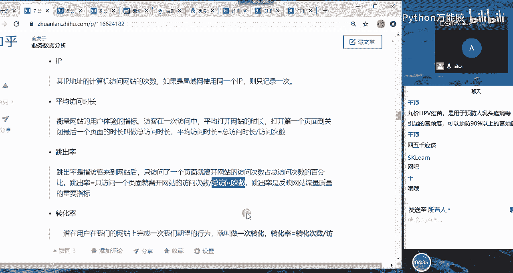

啊，100次点击点100次点击点击了网站的首页，然后只有50次点击了详情页，那它的转化率就是50除以100。哎，那呃在这50个人当中，又有10个人点击了加入购物车。那这个的转化率就是10除以50啊啊。

这样的一个计算方式，明白了吗？这就是用我们所期望的啊用户行为，然后每一次啊每一次他所达到了我们就叫一次转化，然后他的计算方式是转化次数除以访问次数啊，啊，这是我们的一个转化率的计算。那刚才这几个指标。

大家很明显发现，好像跟网站的关系性很强，对不对？那我们就可以拿一个实际的例子来看一下。

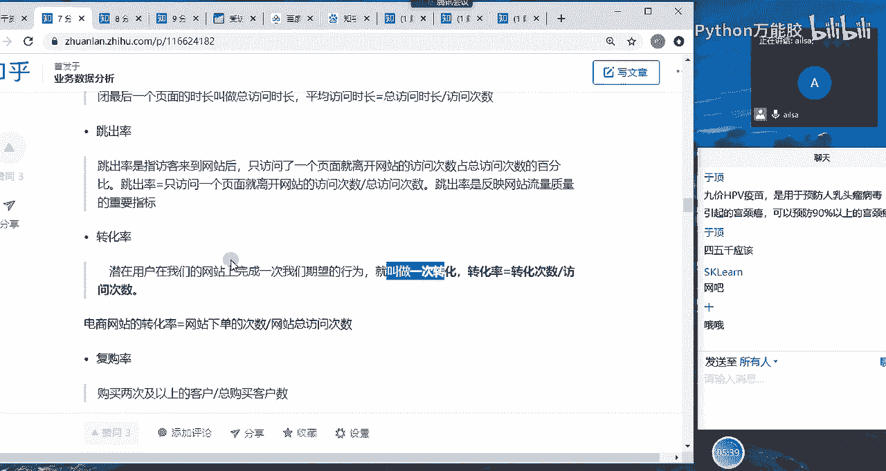

啊，我跟你说，这些数据都是公司内部的数据都不对外公开的哈。但是咱们公司咱们老男孩还是很大方的哈，直接把账号和密码给了我。我给大家看一下我们公司后台的数据哈。当然了，这个数据不太好看。

因为他这个网站啊为了。啊，就是应该是目前情况下不进行一个运营了，所以说会数据量不是特别好看。我们看一下哈。

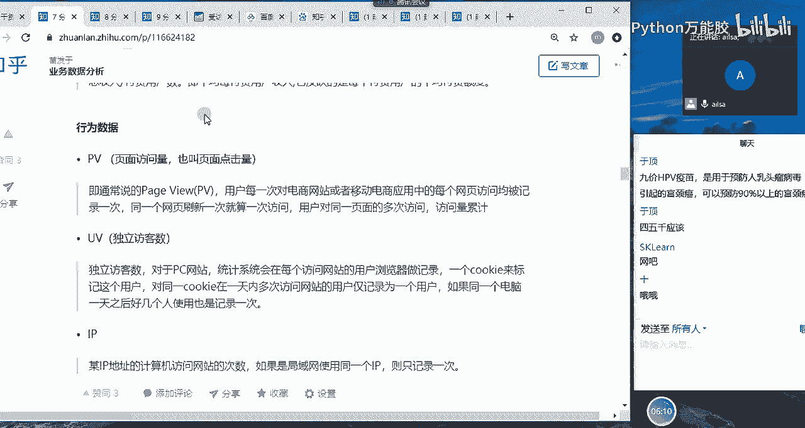

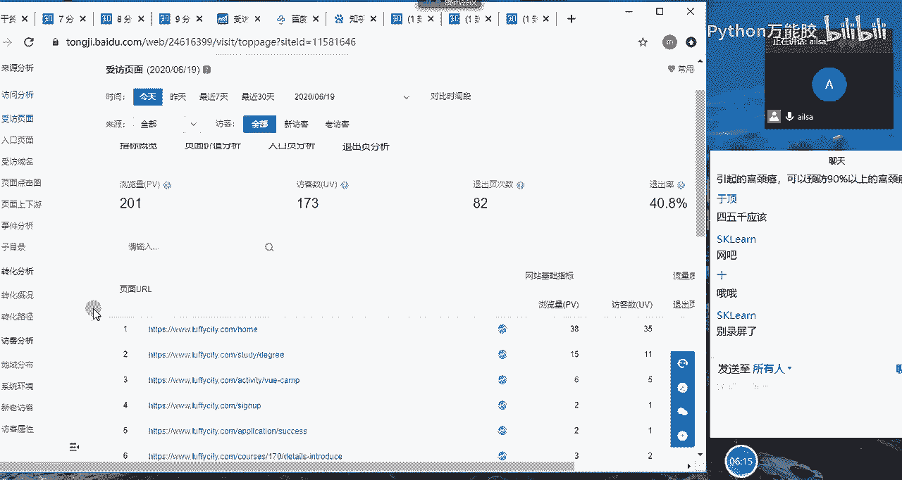

啊，OK那我们先关掉哈。复购率哈这个复购率啊其实就是呃我们的呃那用户啊在网站上到底购买了几次的一个占占比哈，就是购买两次及以上的用户占总购购买用户的一个数量。那这个复购率呢。

其实就是如果说你在某一个网站上别人给你拉新啊，花了很很不少钱拉过来了之后啊，然后你这个呃你这个你就买了一次，那对于整个公司而言，或对于整个产品而言就不太好。他就希望你多多买点，是不是？

所以我们就要看他的复购率，如果他复购率很高的话，说明用户对于他公司的各方面的产品还是很认可的，说明用户还有还是有一定粘性的，对不对？所以说这个复购率也是也是要看的。你比如说我们在淘宝上买东西。

我们都不知道买了多少个了，对不对？那说明淘宝的复购率是很高的啊，他的产品还是很认可的。至少人产品比较丰富，然后也有很多很大的一个用。用户群体，而且用户都愿意在上面去买东西。啊。

比如说每年的春夏秋冬换季的时候，大家都要买新衣服，这个时候都会去淘宝上去看啊这样的一个东西哈。那再比如说。还有一个还有一款APP叫那个我们都知道抢票软件，对不对？抢票软件啊。

然后比如说铁友啊什么什么呃什么智行啊什么反正那些。然后只要就是我们没有办法去看他每天的一个日活跃用户数。但是我们可以看一下它的复购率，这一年的复购率是不是一到节假日你到买票的时候啊。

大家都会用它的APP如果是的话，那说明他这个APP还可以。那你不能说你看每天的一个日活跃用户数吧。因为你不买票的话，你不是节假日，大家也不会上去上面去买，对不对啊。好的，那我们啊。

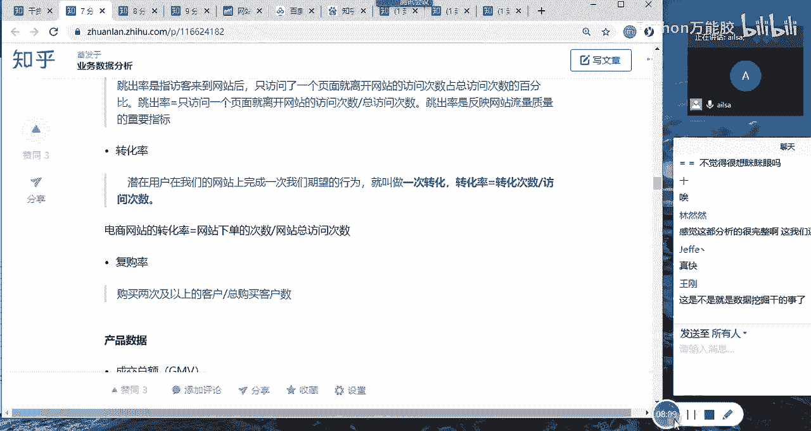