# 【python数据分析精华版来了（附文档代码）】10小时学会Python数据分析、挖掘、清洗、可视化从入门到项目实战（完整版）学会可做项目 - P3：02Excel简介 - Python万能胶 - BV1YAUuYkEAH

好嘞，哎，我们开始今天啊正式的内容讲解。哎，很简单哈，我们首先来介绍介绍一下excel的一些简单的介绍啊，简单的介绍excel啊。首先我们先介绍历史啊啊。

其实excel呢它属于它属于电子表格哎的的一类哈。所以说我们介绍电子表格的一个发展史。那世界上第一款电子表格啊，不是excel哈啊，那个时候还没有excel在1978年的时候，然后发明的一个叫VC啊。

这个一个上线使用。它这个啊是我们第一款电子表格是用来做数据处理的哈，当时发明这个呃这个软件的一个原因在于什么呢？就是之前是没有电子表格的那他们怎么用来计算呢？就是手算哈写在纸上写在黑板上。

然后手算不管是教授级别的还是小白级别的，都是怎么来进行计算的。然后有个学生就在想这样也太麻烦了。我改一个数，然后其他数都要进行一个修改。所以说。

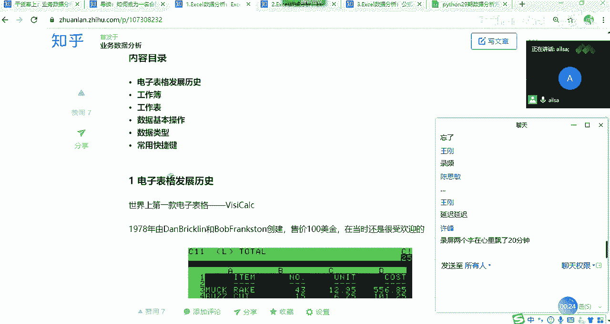

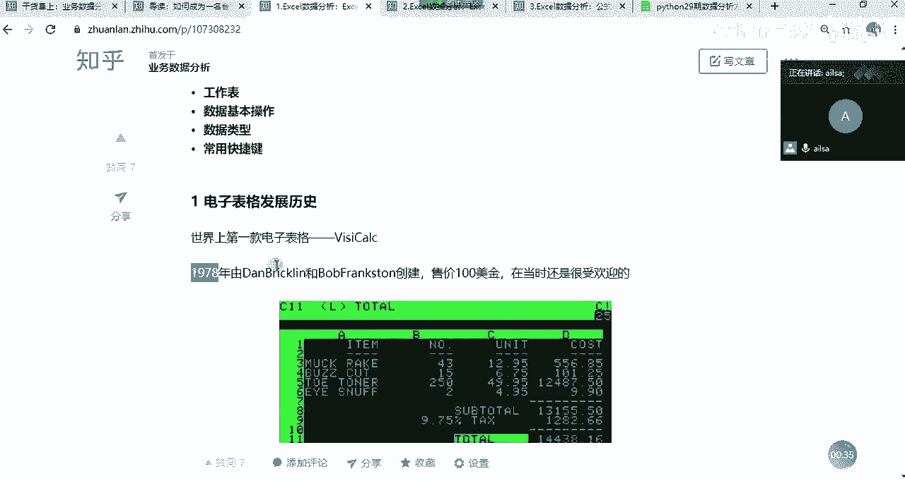

他就在想我可不可以设设计一款电子表格，那VCco就应运而生了。我们可以看一下这个的截图哈。

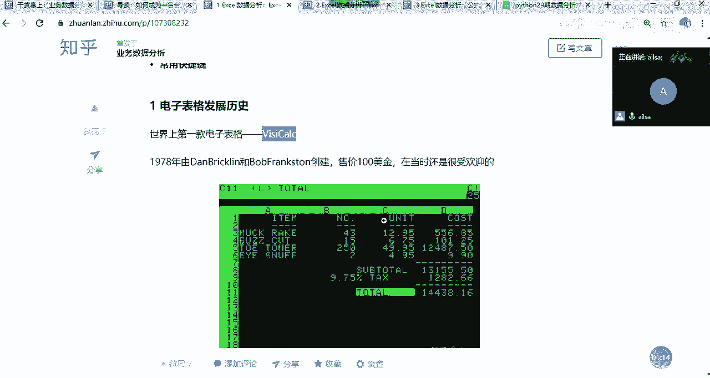

嗯，我们看一下它这个电子表格呢啊，我们可能现在好像有点像算术式是吧？那其实我们不要看内容，我们可以看它的一个列ABCD唉，跟现在的excel是不是有点像，它是不是由列和行组成啊？

1234567是不是一个二维表啊，说明当时的时候再进行一个数据处理的时候，它的结构已经定型了，就是列由字母组成啊，行是由数字组成这样的一个结构，然后进行数据的一个计算。那当时发明了之后呢。

还是很受欢迎的哈，100美金也不便宜哈，很受欢迎。那为什么它我们只是称它为第一款电子表格呢，是因为后来发明的一个叫lowta123的电子表格比它还要好用？所以说它称为第一款，它称为一个成功的电子表格。

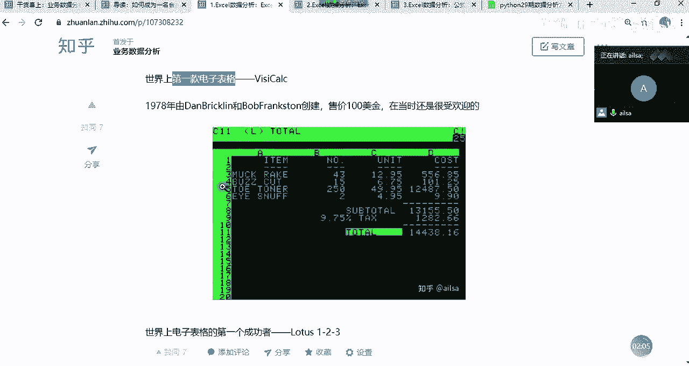

那既然它是成功的电子表格，为什么我们现在用的是excel呢？啊，这又要讲到接下来的一个故事了。就是他当时发明了这个load123了之后呢，我们可以看从个界面上来看哈，这边哎有图表，哎。

竟然当时就已经有图表了哈，还有我们的表格哎excel的一个数据处理。据说它当时还承载了一个小型数据库的这样的一个功能，所以叫123，也就有三个三大功能来组成的。所以说它一经问世啊。

也是销量非常非常的好啊，当时售价是495美金啊，你看就很贵哈，但是啊还是非常好用哈。但是它当时我们看1983年那个时候windows操作系统还没有盛行，对吧？所以说它当时开发的应该是DOS的一个系统啊。

适用于那个的一个软件。

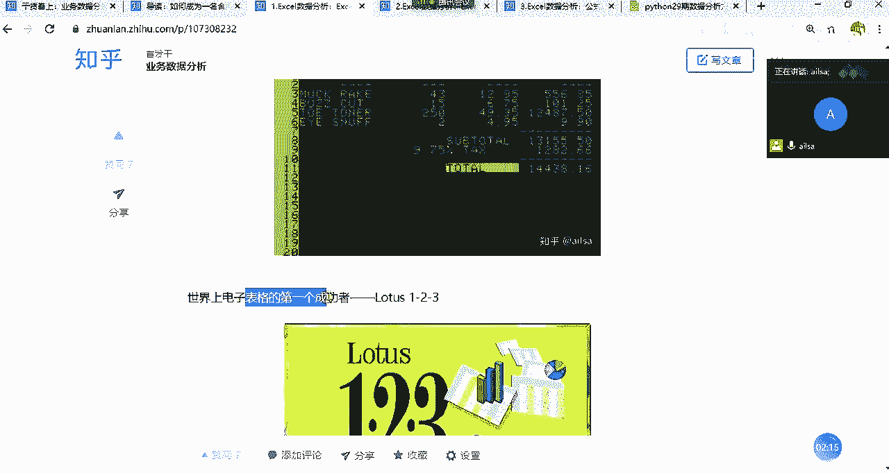

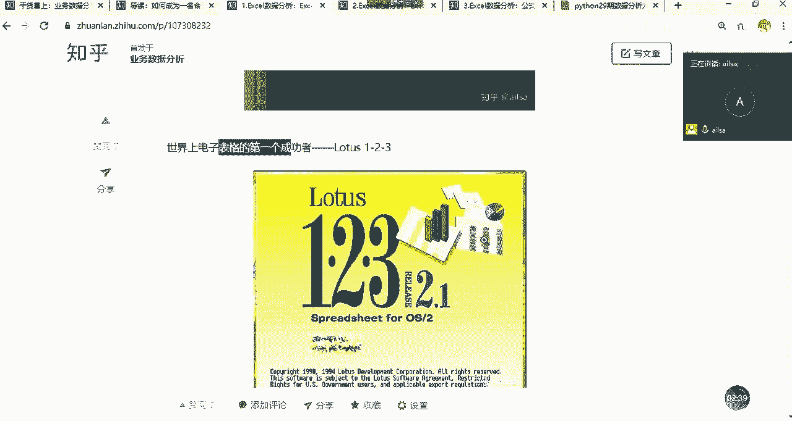

那我们看一下接下来什么时候excel上场呢？就是呃就是呃当时啊微软公司他们也发明了电子表格，因为他们也看到这样的一个市场，他们早在1982年。

也就是比他还要找一年的时间就发明了第一款电子表格叫multti plan。但是呢哎他没有人家lous123好用，所以说就bu给了lous123啊，那哎据说哈当时因为这这个事件。

微软公司还专门召集了所有的高层以及他们的技术研发人员开了一个会。然后讨论一下，我怎么才能够开发一个软件啊。然后能够既继承了lous123的优点，又比lous123还要好用。哎，这样的一个会议。

还据说还是秘密会议哈，那开发召开了这样的会议之后呢，在1985年的时候，他们推出了excel。那excel它其实就是m multiplay的一个呃更新。然后而且他继承了ote123的很多的一个优点。

但是他当时开发的时候是m克系统的哈，首先推出的是呃麦克系统的excel。那他当时1985年推出来之后呢，也并没有说哎特别特别厉害，直接就把loote123给打败了。没有那什么时候打败了呢？

就是不是因为excel多么多么好用哈，是因为操作系统的问题。那微软公司它到1987年或者是那几年的时候开发了windows操作系统。非常非常受欢迎哈那其他的系统几乎都没有windows系统好用。

因此呢呃微软公司采取了这样的一个方案，它把excel和windows操作系统绑定，哎，这样的一个销售手段其实是很厉害的哈啊那就这个时候大家觉得windows好excel唉好像也跟差不多也好用。

所以说哎那个时候excel就开始畅销了。那ote123是怎么败下来的呢？不是因为它功能的问题，还是因为操作系统的问题。它既然windows当时比较盛行的话。

它就要开发出适合于windows操作系统的这样的一个呃这这样的一个版本，但是它开发的不好啊，可能是因为ote123自身软件的一些兼容性的问题。所以说哎大家都用的windows操作系统。

但是123又不好用，那直接就采用了excel啊，所以说后来excel就成为了目前市场上第一主也就是说。电子表格以后就是excel的天下了。啊，那后来呢就是据说微软还把公司给收购了哈。

把ex123还给收购了哈啊那我们看一下接下来这几年excel的一个发展的历史哈，它其实每年都在不断的迭代更新。那9090年的时候推出了excel3版本。92年推出了excel4版本。

然后93年的时候推出了excel5版本。那这个他在93年的时候，还把excel绑定进了micsoft office，我们都知道office它有什么excel啊word呀PPT啊这样的一个组成。

它绑定起来之后，相当也是一个呃就是办公软件的一个呃嗯就是呃捆绑销售。然后在1993年的时候呢，他还支持了VB哈VBA是一款。啊，是一款呃就是依附于excel的一个后台的编程语言哈啊。

大家可能不是特别了解哈。我之前学过VB哈，自己在工作当中学的，它就是说主要是为了实现excel呃自身的啊一些操作的自动化啊这样的一个功能。所以说其实excel还是很强大的人也有自己的编程语言是吧？哎。

所以说不要小看它哈，我们可以看到当时的一个界面哈，93年哎当时一个界面，跟当时的电脑还真有点像哈，这种突出的一个标签的一个设计啥的。嗯，然后95年的时候推出了95版本哈，也叫7版。

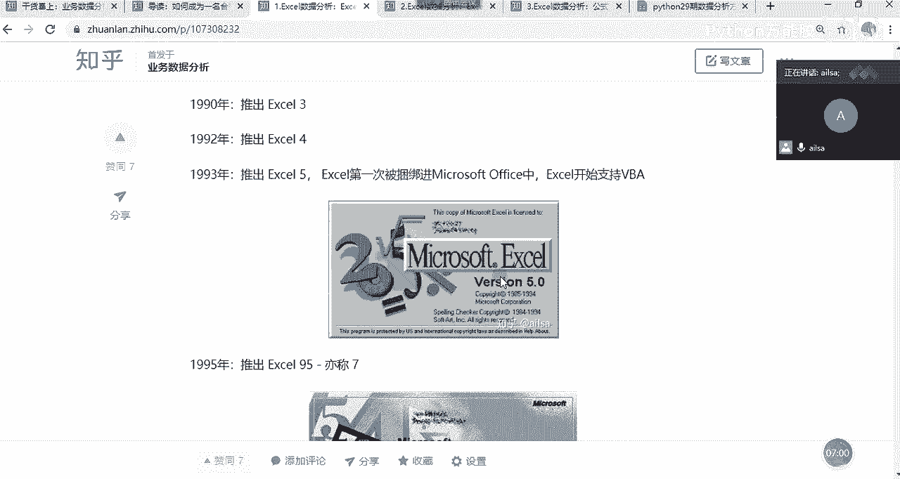

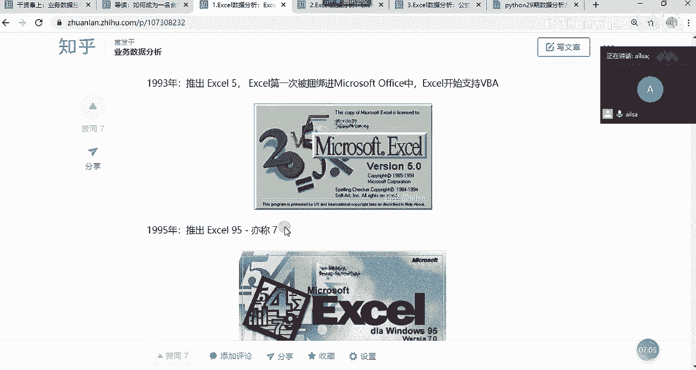

那我们可以看到，哎版本有了明显的更新哈，有点像有点像什么有点像涂鸦哈，就是这个一色彩还是比较的啊比较的炫酷哈。可能跟当时的一个审美有一点关系哈。

在我看来好像也还一般哈不是特别的专业哈那我们看97年的时候，97年推出了1个97版哈，也叫8。我们97版啊，97版是一个很重要的转折点。为啥呢？它推出来了之后啊，97版。😊。

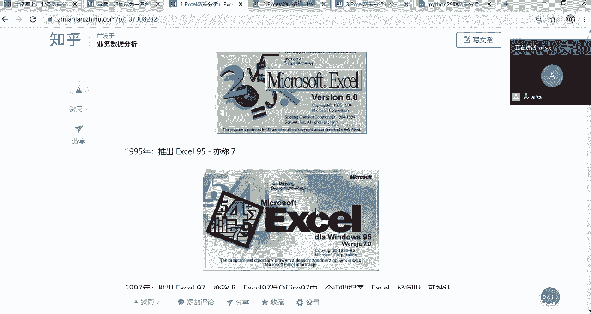

啊，在很多功能上都进行了一个更新哈。他所以说它当时被认为是功能非常强大，使用非常方便的一个电子表格。我们可以从这个界面上去看的话啊，它整个的一个呃外观呢啊都比较结结合现在的一个审美了。嗯。

97版是一个很重要的版本，那在99年的时候推出了啊推出了啊excel2000，然后一乘91年是叉P。其实这几个版本在相对于97版而言的话，没有特别大的更新。那03年推出了03版哈。

03版也没有特别大的更新。但是哈有一个很大的特点在于什么呢？03版在中国哈在我们国内啊非常受欢迎啊，为什么呢？它它既然相对于97版也没有特别大的更新。为什么它会这么受欢迎呢？

其实我觉得应该跟当时的中国的计算机发展有关，在03年的时候，中国计算应该有一个很大的一个发展进步。所以说。

啊，所以说我记得我刚进公司的时候，还有一些很老的电脑里面装的都是excel2003啊，它这个版本是相对比较老的。嗯，那在接下来这几年呢，就是06年啊07版、10年10版以及13年的13版。

还有现在的16版，还有19版啊这样的每次的一个版本更新。那从07版之后。它整个的一个外观上啊，内容上啊，功能上啊都没有特别大的变化了，只是变得越来越智能，越来越美观而已啊。

这大概就是我们excel的一个发展史。那在整个的excel的发展的版本更新迭代的过程当中，我们需要记录几个版本哈，一个是03版哈。因为我们在空作当中经常叫97-03版。

可能是因为他们之间的版本差异性不是特别大哈。所以我们叫97-03版，就其实就指的是03版。然后呢，还有一个就是07版啊，07版。啊呃0呃07版啊这样一个版本，然后最后就是10版16版这其实都差不多了。

哎，这几个版本的话，在工作当中哈，现在的一个公司当中用的比较多的啊，就是这几个版本，就是比较老或者是比较传统的公司，有可能还有一些文件使用的是03版，但大部分都是07版10版了啊啊。

16版的倒不是呃倒也有啊啊，因为10版跟16版其实差不多，但是功能上没有16版新哈啊，这是我们的一个呃整个的一个版本的介绍。大家一会儿我就会跟大家说，我们介绍这个版本的意义所在哈。哎。

我看一下大家的一个。反馈。啊，对于这个有什么问题吗？啊，WPS比off好用的多。呃，这个啊仁者见啊仁者见仁，智者见智哈啊就每个人在使用呃就是软件的时候，我们不能说哪个软件特别特别好啊。

哪个软件特别特别差。因为你比如说现在我们讨论一下世界上最好用的编程语言啊，可能啊我们花一天的时间也讨论不出来一个结果哈，那对于这个工具的一个使用的话，看个人的一个喜好以及每个人他最开始接触的那个版本。

可能他用WPS用习惯了，他就觉得A比较好用。但是呃你比如我我从一开始接触电子表格的时候，我就接触的是excel啊，所以说所以说我就觉得excel特别好用，你能把我怎么地，对对啊，没有哈。

这这个看个人的一个习惯啊啊，但是就他有可能在某些方面啊，只能说他有一些在某些方面，他可能哎设计的比较合理，比较人性化。还有一些在那些方面的一个东西。但是我们从目前市场上来说。哈市场上来说。

使用呃excel或使用微软产品的还是占很大多数的。所以说我们讲的是excel，是因为这个啊这个问题。啊，WPS现在也是会员制了啊，所以说有些功能你还是要花钱的。我我我我是了解到的啊，因为没有用过。好吧。

那我们就简单的了解一下历史哈，大家看我们的课程是不是非常的轻松啊，轻松哈。OK我们接下来啊就要进入我们整个excel的介绍了。那我们在讲excel之前，我是不是要建一个excel文件呀？哎。

那我们新建一个这样的一个excel。哎，大家看这是不是一个文件，那这个文件其实它就叫什么呢？叫工作簿excel的工作簿哈，我这边命名为excel。Yes。嗯，就是他的文件名，然后大家再看哎工作簿。

工作部啊。不念报哈工作簿。然后我们可以看一下它的文件名的一个后缀哈，我们要研究一下它的后缀名是XLSX这个后缀名呢是在07版及以后就使用的是XLSX了。所以我这边要介绍一下版本哈。

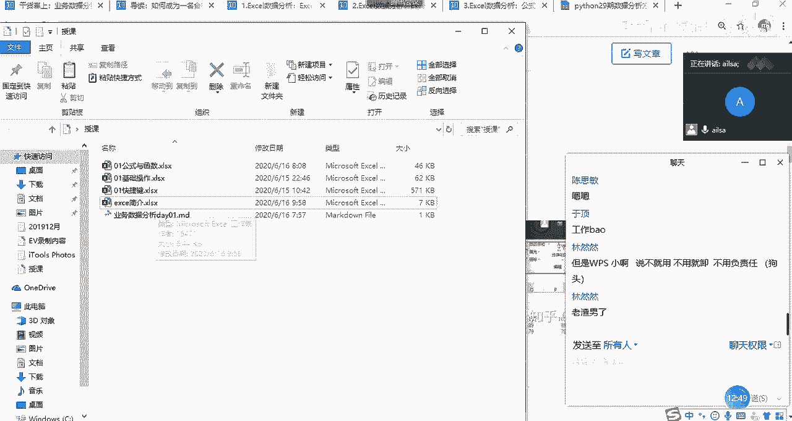

我这边要介绍一下版本，因为我们在后面进行一个呃跟其他数据分析进行一个交互的时候，我们会用到这个哈。

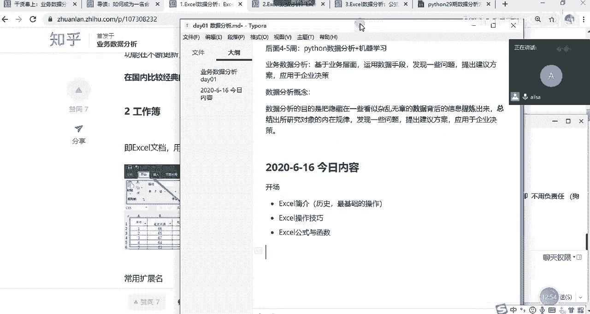

然后Xel剪辑我们刚才讲了历史，然后重点介绍一下。工作部啊。工作部我这么写的哈。工作部啊，这叫工作部，然后会介绍一下版本啊。后缀名为XLSX，就是07版。以后。都是啊呃XLSX然后。XLS的啊。

这个版本的是手7杠0300。我们是不往前再追溯了哈，往前再催溯，大家都没有出声的哈。所以说也没有必要哈啊，所以说我们呃在工作当中也就到啊也就到03版就结束了哈。

所以说哎大家看一下我们的版本大概是是两个97-03版啊，那我介绍这个版本有什么意义呢？我跟大家说一下，就是啊呃就是说你的高级版本。你比如说你的07版本是可以打开你的啊03版本的。

也就是说高级版本可以打开低级版本哈，但是啊但是你的03版的1个excel的程序是打不开07级以后的一个文件的，明白吧？低级版本打开，打开不了高级版本，所以说我有咱们在进行一个沟通的时候。

不有同学说他的电脑安装的是03版，那就不行。因为我们的都是07版级以后了，所以就打不开，所以必须得用07版级以后的那对于07版机以后，比如说07版10版16版好。和呃呃19版这样的话。

他们就很有具有很好的兼容性了。他们都可以打开啊这个样子啊大家明白这一点就可以了。我们主要区分这两个。那我们呃在那个进行数据分析交呃工具交互的时候，比如说你要导入呃excel的文件的时候。

它会提醒你后缀名啊，是XLSX啊，还是XLS你就要明白它主要是为了区分这两个版本而已啊。因为在我们国内也就到03版就结束了啊，好吧。哎，这是一个版本，我应该讲明白了哈。嗯，OK那我们再接着往下说。

既然我建了这个文件，我是不是要打开它呀啊，双击它就行了哈，这废话。

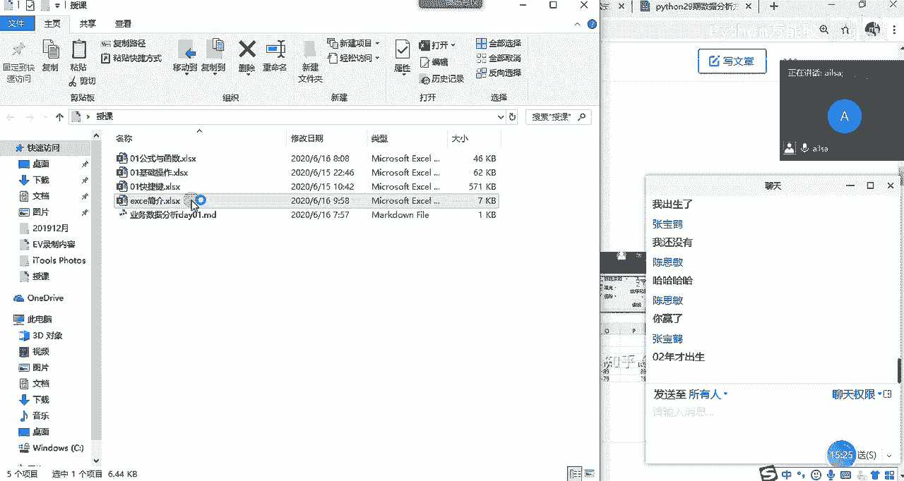

OK我们再打开这个文件哈，我们打开这个excel工作簿了之后，相当于是启动了excel的一个程序哈。excel程序已经启开了。然后这是我建的一个excel的工作簿。

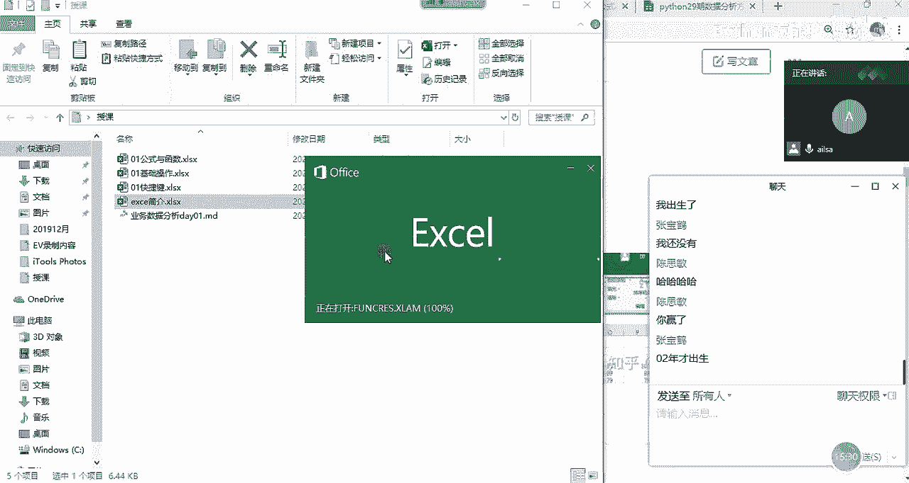

啊，稍等啊，工作部。

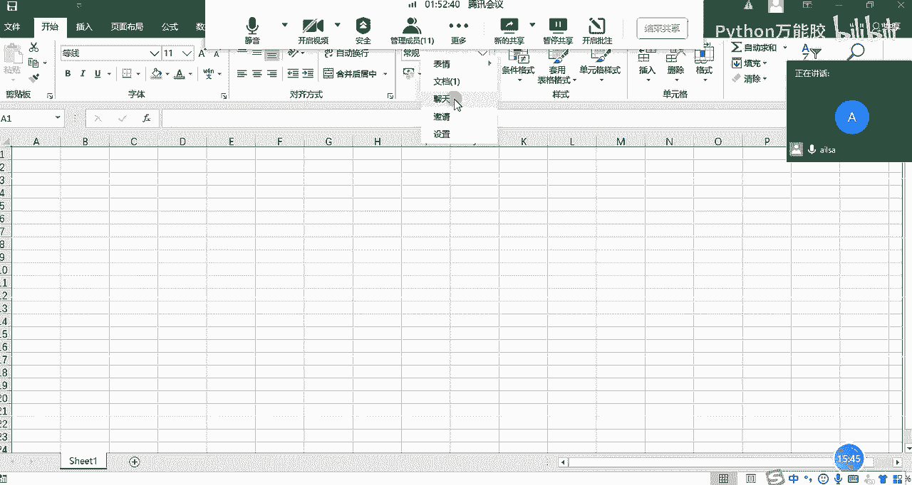

我需要把大家的聊天切出来。

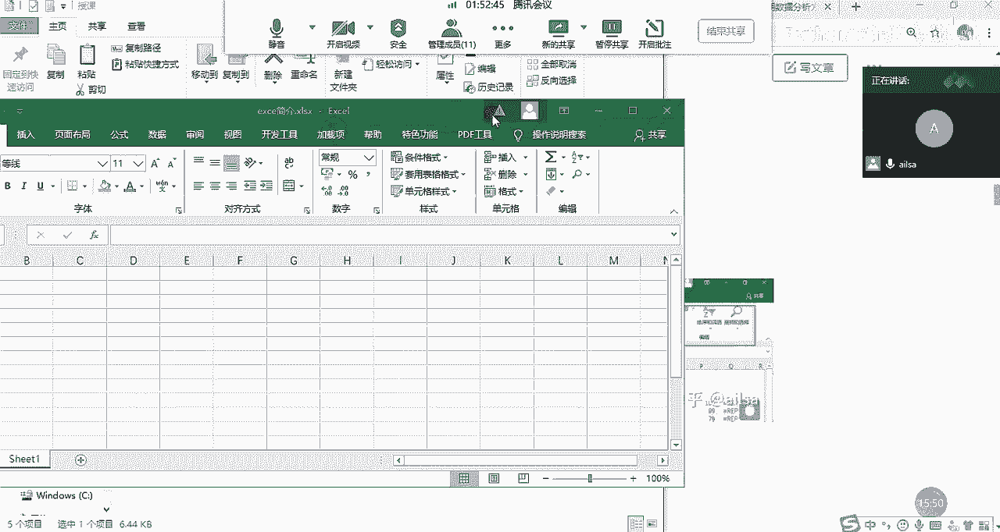

OK啊，我那我们打开这个工作簿之后啊，我们从上往下给大家做介绍。首先呢啊我们看一下这一部分区域，这一部分区域哈，叫功能区，什么意思呢？就是说我要在这接下来做excel的其他的相关操作的时候。

我所有的功能都放在这里了。那我们都知道excel是一个啊图就是那个什么标签式或者是叫点点点的这样的一个操作形式啊，图标式的一个操作。所以说我只要点某一个功能，它就可以实现。

那你看它还会按照不同的一个功能进行一个划分。你比如说开始这里主要是一些常用的功能。那插入这里呢主要是插入一些唉功能。啊，页面布局就是布局相关的功能。公式呢？就是公式与函数相关的功能，它有不同的分类。

那这一个个分类叫什么呢？啊，叫什么呢？叫选项卡标签哈。也就是说我在接下来的过程当中讲，哎，请你定位到公式选项卡标签，就指的是公式选项卡标签。下面的啊什么什么什么功能的啊这样的一个介绍。

就是这样子的数据选项卡标签，下面的分裂功能。哎，你要知道怎么去找啊，哪个功能啊，这是选项卡标签，这是我们的功能区哈，我跟大家说一下啊，我们再介绍啊，第二个就是功能区啊，功能区有一个选项卡标签。

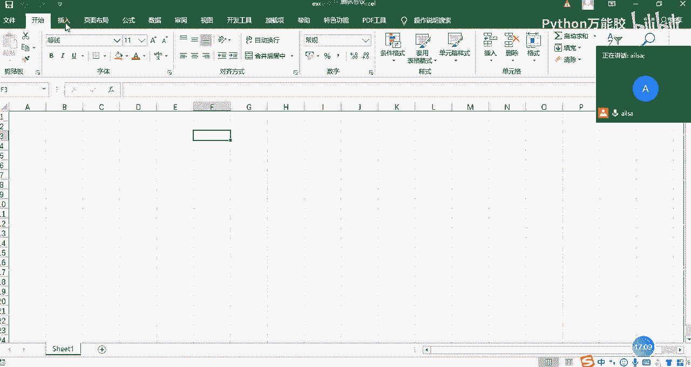

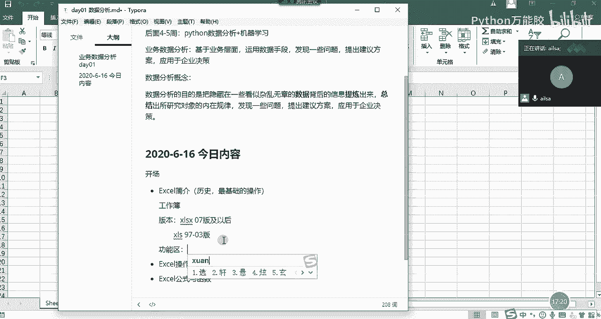

这样的一个介巧。然后我们知道了这个呃功能区了之后呢，哎这边有一个小小的操作技巧，什么呢？就是啊我们如果哈假设假设你要给老板去汇报汇报你的一些数据的时候啊，然后呢比如说这个电脑屏幕比较少的时候。

你会不会觉得它占了很大的面积，那我们想隐藏它该怎么去操作呢？啊，其实特别特别简单啊，双击它就行了啊。有的人说哎呀不行不行，你把它隐藏了，我要把它展示出来啊，那该怎么办呢？啊，也简单。

再双击一下就可以了啊，知道了吧？如果你不知道这个功能的话，其实啊其实也其实呃也也可以哈，因为你不对他不对它做操作也可以了。但是你知道的话，你可以灵活的去应对不同的一个工作场景哈。

那有些人不知道就很尴尬哈，我给你展个特别逗的一个笑话。啊，之前部门来了一个新人，然后呢啊然后他让我给他家看一些表，然后这个表数据量特别特别大。然后我就觉得这个功能区有点费劲，我就给他双击进去呃。

双击进去了，然后给他家看完了之后我就走了。后来呢他对这个表进行一个操作的时候啊，他是这么来操作的。点开选项卡，然后啊给他加了一个颜色，完了之后，鼠标定位，哎呦，怎么隐藏了，就再点开再操作，再隐藏。

再点开再操作再隐藏。然后我过了一过了几天我又去看的时候，我说你为什么要这么干呢？他说你给我隐藏了，我不知道该怎么办了。我说你双击就行了啊。其实这个很很小的一个点啊。

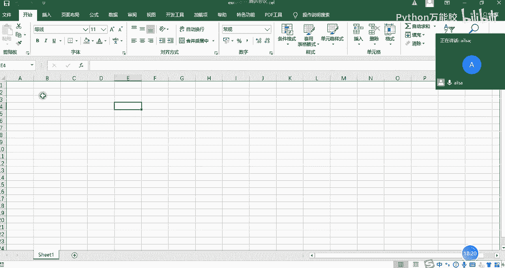

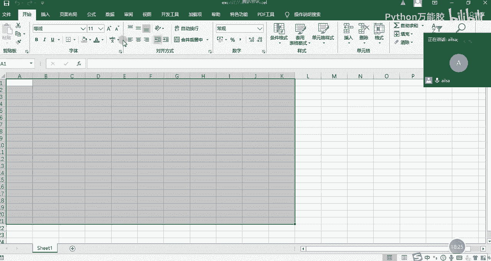

好，所以说呃知道这个还是有好处的哈。那我们再接着往下来走哈，往下来走。我们看这个地方，大家看到没有这个地方B3是个什么东西呢？哎，我们可以想一想，我们在讲电子表格的时候。

第一款电子表格VCco它是不是它的列是不是由字母组成啊，它的行是不是由数字组成是吧？那行和列所组成的这个东西叫什么呢？叫单元格啊？啊叫单元格。那我听到这个单元格之后，这里面显示的A一是什么呢？

我们很明显知道A指的是列，一指的是行，它代表的是单元格的地址。也就是说A一。代表的是什么呢？单元格的。在元格地址啊，就是说我们在啊这整个的一个excel表里面，我可以对它进行一个唉值的一个呃输入啊。

存储等等这些。但是我要想用的时候，我直接对于地址的引用就可以了。这样的话，如果说我这里面值发生了变化，那也会相应的发生变化。其实这就是excel的一个很重要的一个特点。

那你比如说如果你不用excel做存储，你把数字写在黑黑板上，黑板上它是一你改了。比如说哎我们画一个白板哈。啊，画画。

OK画图啊。哎，比如说啊这是我的一个啊，大家能看到吧。

。我为什么我这个聊天啊，大家能看到的话，给我扣个一。的聊天老是调不出来。啊。그 분。对，有有些人找不到的话，也挺逗的哈OKO都能看到哈。现在啊现在我给大家，比如说我现在是一个黑板哈，我在这里面。😊，哎。

我在这里面啊输入123啊，很丑哈，超级丑。然后这个时候我想计算一下1加2加3加3等于多少，是不是？然后我就在黑板上写A等于多少，等于等于等于多少啊，然后我写了好多好多行这样的一些数值的计算。

那其中有一个数发生变化了。比如说它发生变化了，化换成了5，那我整个的一个值是不是也要发生变化，对不对？哎，这样的一个形式，但是excel不用哈，你比如说你这换成了5，然后我在这里面进行一个加和啊。

它它它它。

哎，你看它变成了九，我改成了67，哎，它真的就发生变化了。那我对于地址的引用就非常的方便了哈，对吧？哎，这就是它的一个很大的一个特点。OK那我们知道了这个它的地址组成哈，这一定要记明白哈。

它的地址组成是先有列啊，再有行，在某列的第几行代表的就是它这个单元格的地址。OK我们讲完了之后，我们再看一下这个地方，哎，我把鼠标定位到这里，它显示的是A一，我把鼠标定位到这里，它显示是单元格地址。

那它这里显示的就是什么单元格的值，是不是？哎，那呃确实是哈我看到的是单元格，这里面显示的也是单元格OK那在这里给大家介绍一个小的点哈？比如说我在这里面输入了一个公式哈。😊，在excel当中。

输入公式需要加等号的，等于A1。哎，大家看一下会发生什么样的变化哈。OK这里面我们看到的是不是A一啊，是吧？哎，它等于A1，所以它最后计算出来的结果，哎，就是公式计算出来结果是A1。

但是你看这里面显示是等于B1，也就是说这里面显示的是这个单元格最原始的值，对吧？哎，那我们入眼看到的是结果，那它这里单元格里面显示的是最原始的值。所以说你想知道这个单元格里面具体显示的什么值的时候。

你就可以在这里去看，或者是说你把这个单元格双击进来，你也能看出来啊。有时候我们不需要说的话，直接把鼠标定到这里，就知道它要显示什么内容了。那我们在做公式的时候，经常这么在这里面去看。

你比如说鼠标这里面显示的是不是11，那我把鼠标定到这里，它显示的就是A3加B3加C3啊，这样的一个结果。啊，这个听明白了没有？嗯，OK啊，明白了，给我扣个一，我接着往下讲。OK呃，3个4个5个。

其他人呢？好嘞。啊，我们在每次呃回答和响应的时候，因为我们就9个八九个人，所以说大家每个人都要回复哈。我这边看到大家回复了之后，我就接着往下去讲啊，那我们刚才介绍了我们整个的一个单元格的组成。

那我们再介绍一下我们整个的一个啊数据的区域。那这里面的话其实就是我们来存述了，对吧？哎，我们进行一个数据的存储，然后进行一个处理，然后进行一个最后的数据计算，然后数据分析数据图标展示等等。

这些就在这里面去操作了。那我们今天不讲那么多哈，我们今天就先认识一下这里面这每一个个单元格哈。

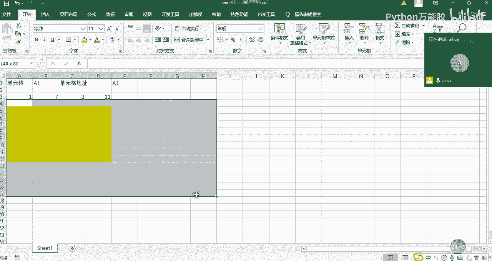

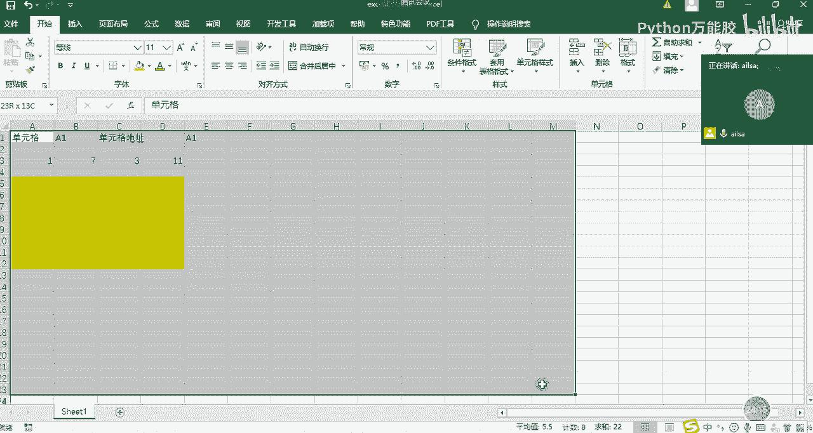

哎，其实好像没有什么可讲的，对不对？在这里我给大家说一下，我们就了解一下它的最大值吧。我们想知道它有多少行。哎，这个数据这个工作表到底能存多少行呢？哎，我们看一下它到底能存多少行哈。哎，我们先不看哈。

先问一下，有人知道吗？有人知道吗啊，他有多少行？有人知道吗？猜一下它能存多少行。啊，65535这是老版本了哈。O。哎，看有个聪明的人哈，1048576行哈，那怎么就是100多万哈，我们怎么去看呢？

okK哈，有没有人一个个往下拉拉到最后的哈，没必要哈，我跟大家进行一个简单的操作，大家看我啊。😊，哎，104856行哈，我说怎么进到这里了呢？啊，我现在不告诉你。😊，等到讲到我们操作的时候再告诉你哈。

😊，那我们看一下它有多少列哈。OK再考察一下哈，有多少列，看有没有人知道哈。😊，有多少列？A到Z啊XFD啊XFD大概是多少类啊？OK哈非常好。1638实列哈，我们怎么去看呢？唉，大家可以看一下。

看我怎么来操作的啊。😊，嗯啊这个就是到了我们的XFD呃FXFD哈，这个是07版机以后啊，大概能存啊这么这么多这么多数据哈。那03版的话其实存的会更少一些哈。OK这是我们在这个单元格里面能存这么多数据啊。

我们大概了解一下就可以哈，给大家开了一个小的玩笑哈啊，我发现啊键号是个厉害的角色哈，因为呃没有人这么闲，然后去了解它到底有多少行多少列哈啊，它能存100多万行啊，但是啊跟大家说excel哈。

你的数据量达到了10万啊，就建议不要使用excel了，它虽然能存100多万，但是你的电脑扛不住啊，你的数据量如果达到10万之后，你每做一次操作，你的电脑就会卡的要死。所以说如果说你的数据量有点大的话。

啊，大家尽量是用编程语言来实现，用python去打开，然后去做相应的操作。那说到这里的话，跟大家说一下，我们在。😊，哎，我们在进行面试的时候哈，如果是大家是初级分析师的话，唉，你跟人说我会python。

哎，我还会excel，人家就问，那你能给我介绍一下pythonexel的区别吗？啊，其实他们都是都可以用来做数据处理。但是如果数据量级啊，我们数据量级是有一个区分的。如果说比如说啊数据量比较小。

十条百条千条万条的这种的话，我们用excel去做会更加更容易上手，而它做的很快。那如果说你的量级很大，你用excel打开就比较慢的话，建议是用编程语言，用python去打开，然后去去做操作会更快一些。

那这是第一个就是数据量级。第二个就是我们针对一些分析的维度的时候，如果说是比较简单的维度，用excel可以实现的话，我们尽量是用excel因为编程语言它相对来说开发的效率是低的。

你比如说我们excel的一个鼠标操作，你要写编程你可能要写两行啊。的一个开发效率是有低的。我们要根据我们整个题目的一个难易程度以及数据量的大小，然后去区分，明白了吧？OK那我们简单说到这里。

然后我们再接着往下来说啊，说我们的。嗯，说我们的一个工作表哈，大家看到没有？我打开我新建了一个工作簿啊了之后，它会给我默认带一个sit一，对吧？这个sit一是什么呢？就是我们的一个工作表。我们刚才说了。

它有16384列和1048576行，哎，这是一个工作表。那这个时候我们看有个加号，对不对？那我再点开它，点开它，哎，它要给我默认了一个sit2啊，很多人念shit哈，我跟大家说sit是骂人的哈。

所以他念sit啊，sit。不要不要不要不要闹笑话哈。😊，我们再点一下哎st4啊5哎这样的一个啊一个工作表的一个添加哈。那我们说明了一个什么问题呢？就是说好像一个工作簿可以建很多张工作表，哎，对吧？啊。

那其实就是这就是这样的，就是一个工作簿可以建多张工作表，就像你的日记本一样，一个日记本包含了很多个页。那每一个页里面都可以存很多个数字也可以写很多个日记，对吧？哎，这样的一个结果，那对于这个工作表。

我们有哪些操作呢？哎，我们第一我们可以给它进行重命名，因为它默认的是系t一嘛，那重命名有两种方式，第一种方式就是双击，哎修改名字啊，就是说重命名重名啊，一啊这样的一个方式，那第二种方式就直接。啊。

直接右击哈右击点击重命名也是可以的啊，这两种方式都是可以啊。我一般双击就可以了哈，双击比较简单，这是第一个操作方式。那第二个的话就是我们可以右击，然后有什么呢？哎，我们可以看一下，它有工作表标签的颜色。

我们可以把它标注为黄色，大家看到没有？进行一个特殊颜色的标注，更有利于你的工作的一个梳理。哎，比如说这个标成红色的话，就更它比较重要一些。这是颜色的标注，这是第二个操作。那第三个操作的话。

它还可以进行一个删除，这个就不用说了吧啊，因为我们在学任何东西的时候，你要会新增就得会删除哈。因为不然的话就很尬了，就没学完啊啊，就要删除删除就可以了啊，这是比较简单的一个操作哈。OK我们再看一下。对。

哎，没毛病，是sit哈。OK那我们再接着啊接着往下来走的话，就是我们讲一下工作表的移动和复制。啊，什么时候我们要用到移动和复制呢？就比如说哎假设哈大家现在假想一下这个表呢有很多个数据，然后呢。

领导给你发了啊这么一张表，就只有这个系统有数据。他说你要对这个表里面进行一些呃修改，或者是更新操作，然后完了之后给他发一个新的版本过去。然后啊你作为一个职场小白，然后去了之后呢。你改错了，你知道吗？

你改错了啊，然后你想恢复到原来的他最开始发给你的那个状态，然后你就撤销啊撤销啊撤销啊，发现还是没有改完怎么办啊，怎么办？大家说。啊。啊，大大家说怎么办啊，大家有什么方法没有啊？😊。

如果说这个数据只有一份，然后你还改错了，然后现在想要。啊，关了不，假设你已经保存了，因为你隔的时间比较长了嘛啊撤销没有撤销到最原始的状态。有可能你就是说没有撤销到你那个关键一步，因为它撤销也是有几步的。

比如说五部啊啊，这个没有关系啊，你可以给你领导再要一份啊，对不对？但是呃对，但不没有，这你可以跟领导再要一份，因为他手里是有原表的，但是这个就不是给人的印象就不是特别好。因为有可能领导在忙。

或者是说呃他在开会，然后他还有就是他脾气不是特别好的时候，他觉得你这人工作太马虎了啊。没有没有那么严重啊。那我们基于这种情况，就是说做数据分析啊，一定要谨慎。

所以说在领导特别是领导发过来的一个重要文件的时候，你一定要备份。对，这句话说对了，一定要发过来之后先建立一个备份。如果说你不单独复出来复制出来一个excel也可以，你怎么着呢？

你可以直接啊把它保存为两个啊工作表一模一样的。那我们怎么来操作呢？你比如说这是一张啊很完整的工作表，然后你右击，然后选择。移动或复制，然后。点击建立副本。你比如说你把这个副本移植到最后，然后点击确定。

这个时候我们会看看到有两个一模一样的表在这里了啊，这样的话相当于是你已经有一个副本了。然后你在这里面怎么改都可以。因为你已经呃有一个最最完整的版本，然后然后去给你做保底啊。

那有的人说哎我不这么操作也可以啊，我直接把这个表全选，然后复制出来，然后新建一个工作表这么去操作也是可以，当然是可以的。但是它可能会在格式上啊，然后等等方面会有发生一些稍微的变化。

所以说我们针对于这种啊一就是所有内容都全部一次性复制的时候，我们就可以采取移动或复制这样的一个操作。那我刚才讲的是复制的功能，也就是建立备份的功能。那我们下面讲移动的功能。你比如说你这个工作表呢。

哎你想调整一下位置，那你就需要移动，对不对啊啊，当然了，现在版本比较比较都比较厉害了哈。我们移动哎，你拖一下就行了，对吧？对你想拖哪就拖哪呗，对吧？这样就可以了。那如果说呃我们想啊采用另外一种方式的话。

就是右机点击移动或复制，我们可以给他我们这个时候就不用建立副本了，我们可以给他指定一个位置，比如说指定到最后啊或指定到谁的前面都可以点击确定，哎，它就移动到这里了，这是异步操作。好。

那我刚才讲的哈讲的唉，大家说唉就是也很简单，对不对？都是针对一个工作部而言的。如果说现在想让你把这个工作簿移到一个新的啊，或者是另外一个啊工作部的里面去的时候，把这个工作表移动到另外一个新的工作部。

就是工作部之行的一个交互的时候，该怎么去操作呢？啊，这个时候我们要先建一个新的工作部cttrol加N啊啊，我们看哎是不是建了一个新的哈，我们快捷方式后面会学哈，那我新建了一个之后呢。

现在我想把这个工作表移动到这里我们该怎么去操作呢？

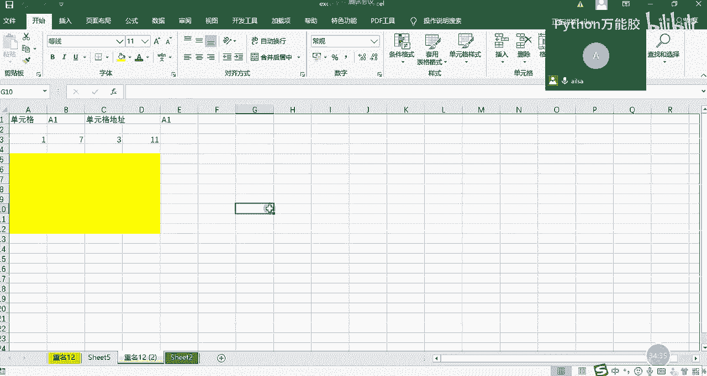

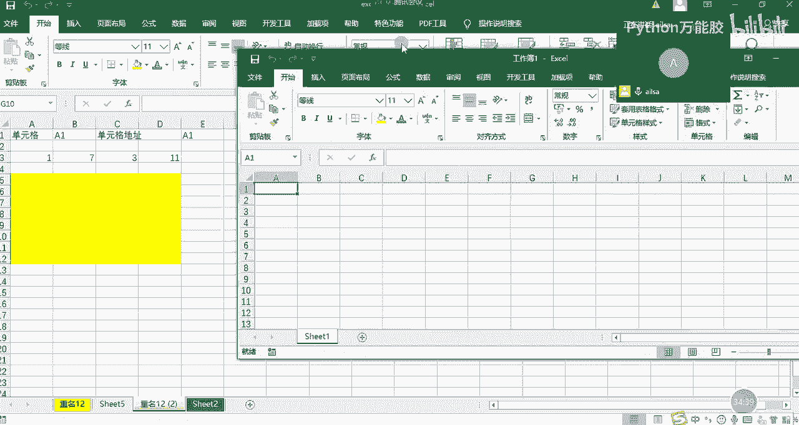

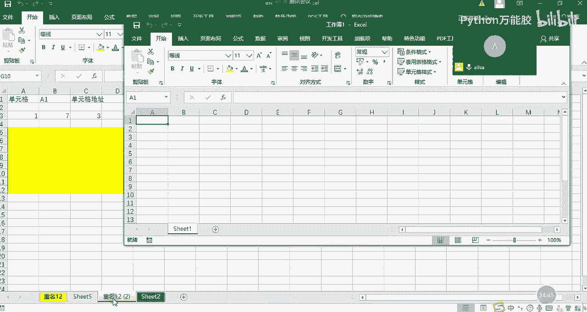

还是右击，然后选择移动和复制，选择什么呢？选择先选择我们的工作部，大家看到没有？有个工作簿，然后选择我们新建的这个工作部就叫工作部一，然后选择它，然后再选择指定的位置。如果你想复制的话，就建立副本。

如果不想复制，直接移动的话，就直接点击确定，大家看一下，是不是就到这里来了，这就是不同工作部之间的一个交互。

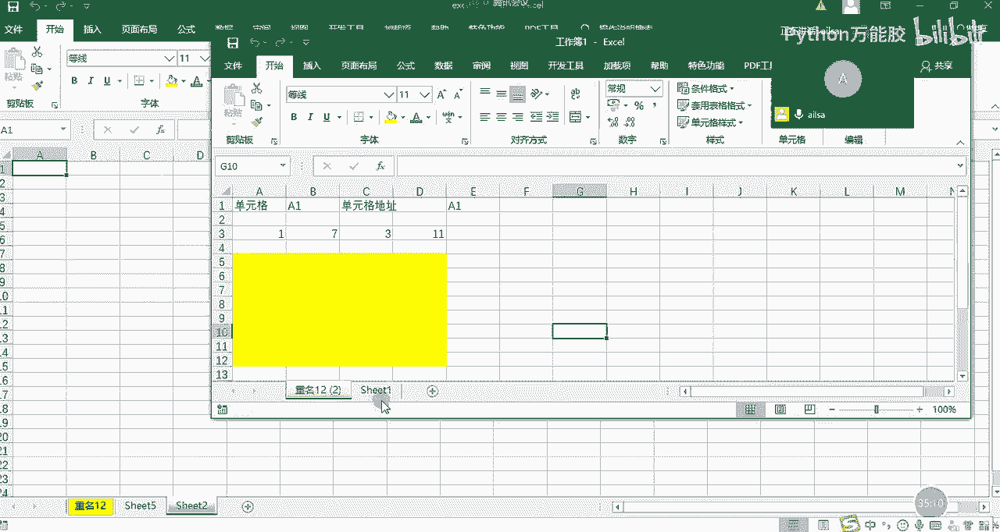

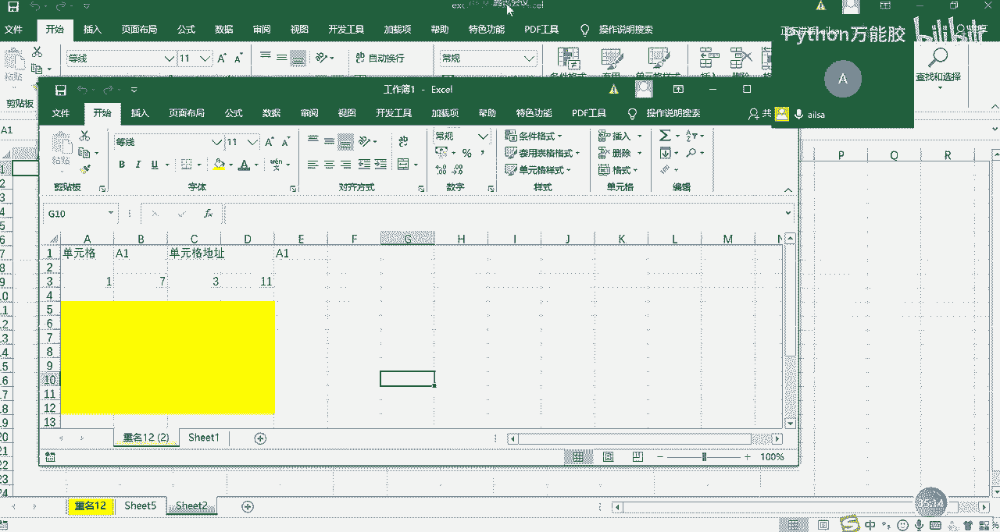

是吧啊，大家这这一块听明白了没有？听明白了，给我扣个一。嗯，好的啊，那没有什么问题哈。那我们简单的去总结一下，总结一下我们刚才讲的东西哈。因为我刚才没有做总结OK我们讲了功能区，然后讲了单元格地址哈。

单元格地址，我们可以把它写成A一，然后还讲了我们的工作表，工作表讲了什么呢？有重命名。

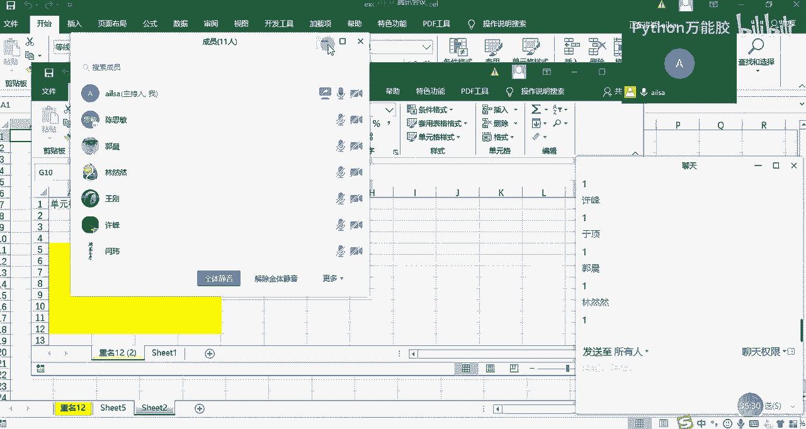

删除对吧？还有。啊，移动和复制。还有什么就是添加。啊，工作表颜色。对吧咱们这四个功能。

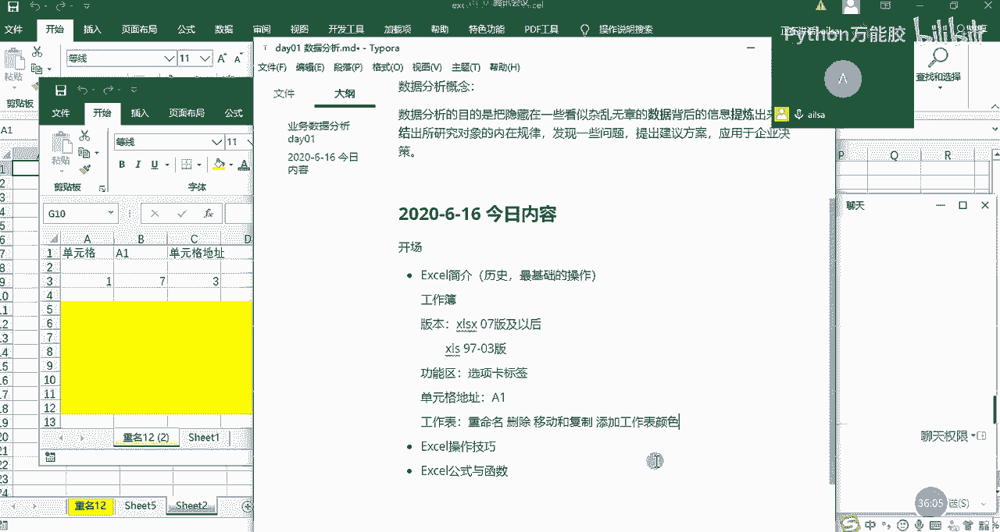

OK咱这四个功能。那接下来我再介绍一个。介绍一个我们的工作表当中的一个功能叫什么呢？叫啊冻结和拆分窗口啊，大家可以来看一下怎么来操作的哈。

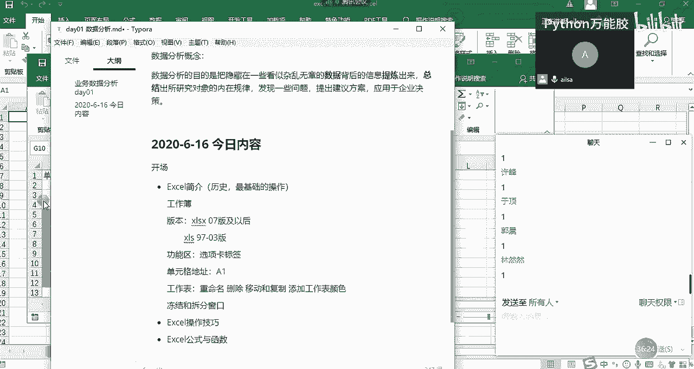

稍等一下，我喝口水。

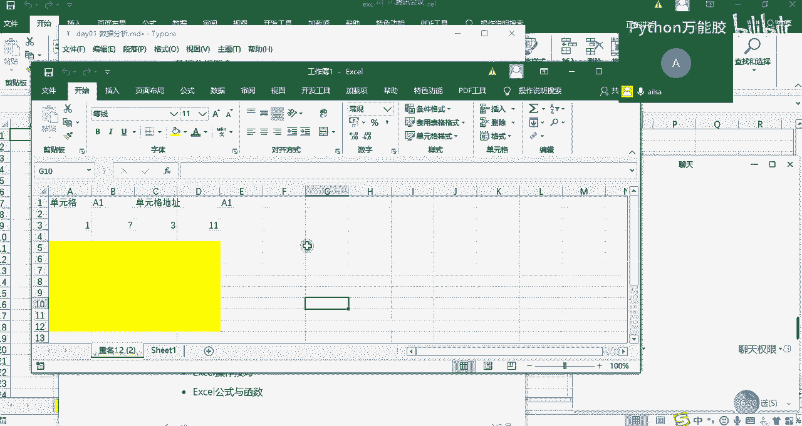

OK我们有的时候呢，我们在进行呃整个的一个表格的设计的时候啊啊那我们如果数据量比较大的时候，我们希望比如说我们很多种情况下，我们的啊我建一个新的哈，给大家说一下我们的首行都是标题，对吧？标题。

然后我们的单列当中都是我们的一些分类。你比如说部门啊，部门一啊，我们2。是这样的一个格式。那我们在进行这样的一个操作的过程当中呢，我们有时候数据量比较大，我们需要进行一些下拉的操作。

那在下拉的操作过程当中，有时候我们的标题就不见了，我们就不知道这一列代表什么意思。那我们就想让第一行第一行进行一个冻结，或者是第一列进行一个冻结。那我该怎么去操作呢？啊，很简单哈，我们就在我们的。啊。

视图选项卡下面啊，这叫视图选项卡下面的冻结窗口，我们选择冻结首行。这个时候我们看到有一条啊稍微粗一点的线哈。我们再往下拉。哎，我们的首行就啊冻结了啊，那我们要冻结首列该怎么去操作呢？就是选择冻结。

然后冻结首列。这个时候我们看到列方向有一条很深的线，那我在往右拖动的过程当中，我们的A列是不发生变化的，这就是冻结首行首列啊，大家大家啊了解这个就可以了。然后有的人就说老师啊我不想我不想冻结首行首列。

我想冻结我想要的啊，我自己想拆分好的，你比如说我想冻结前两行前两列，哎，这种自定义的形式能实现吗？啊，当然也是可以的哈啊，难不得老师哈啊有点像自色之化的时候，我看一下。啊，所看OK哈。

我这个因为我在之前的啊之前的就是给人分享的时候，别人有问到过这个问题哈那我们讲一下该怎么去实现。😊，哎，如果你想冻结前两行和前两列的时候，我们看一下它是不是有个交叉点在这里啊。哎。

这不是前两行前来的交叉点。好，那我们就把鼠标定位到这里，然后点击什么呢？点击拆分。OK我要需要把那个取消掉吗？稍等啊。把鼠标定位到这里，然后点击拆分OK点击拆分了之后，我们看到它出现了一条很粗的线。

就是在我们的这个交叉点的左上方出现了一个很粗的线。这是前两行前两列，这个时候我们先拆分了之后，再点击冻结窗口哈，这个时候不是冻结首行，也不是冻结首列了，就是冻结窗口。O我们点击完了之后看到没有？

有两条很深的线，我们再往下拖动的过程当中，我们的前两行是不发生变化的。我们在往右拖动的过程当中，我们前两列也是不是发生变化的。所以说你要是想自定义冻结的话，你需要对它进行一个拆分。

那拆分的一个特点在于什么呢？只要是这个单元格的左上角的一个交叉点，它所对应的行和列都可以进行啊一个分割啊，这样的一个过程就可以实现了。嗯，OK呃，动结合拆分明白了吗？明白了给我扣个一。好啊。

我讲的都不难，对吧？啊，都挺简单的。相相啊我我我相信大家应该都听明白了，因为这对于编程而言，这简直就是小儿科哈啊啊这就是呃一小小点知识啊，积累起来的。

OK那工作表和工作簿以及excel的简介呢呃大概就是我们介绍excel就介绍到这么多了。那接下来我要给大家介绍的是。

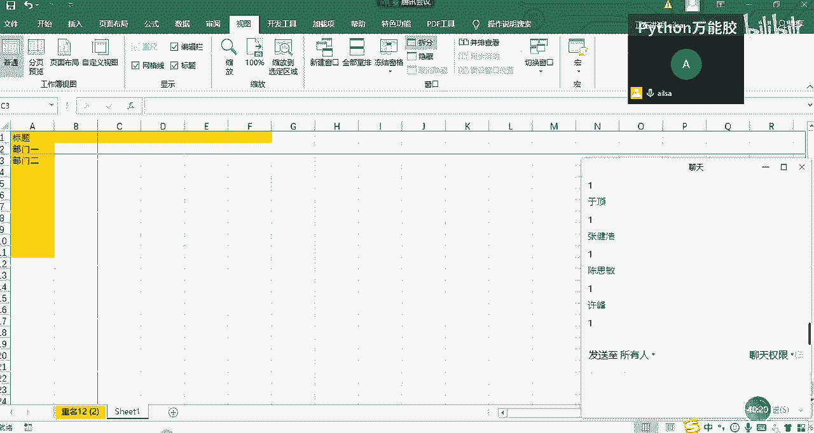

介绍的是一个啊什么呢？是我们的快捷方式哈。啊，这个其实不用保存啊，刚才是我做例子。哎，稍等一下，我打开咱们的快捷方式，我也给大家发了哈。

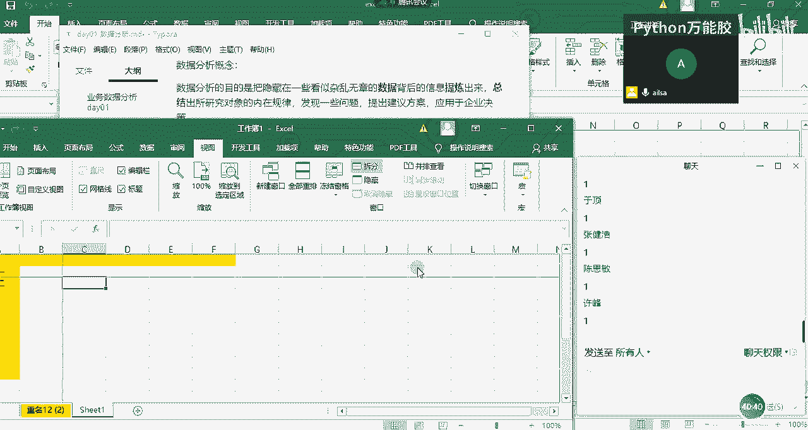

真的有点慢。

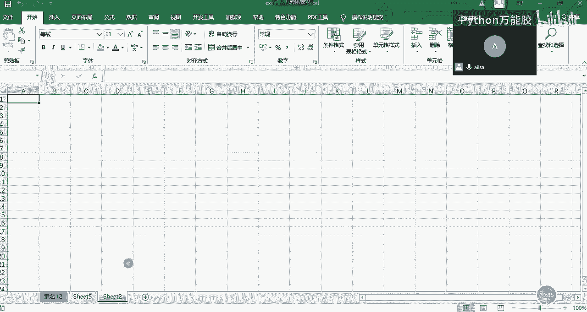

OK我们看一下我们的快捷方式。其实讲快捷方式这个东西的话还挺好玩的。

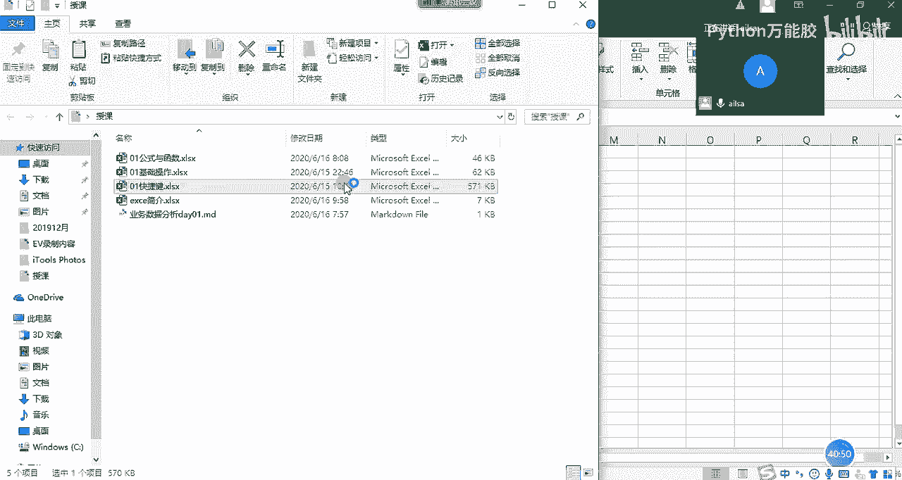

呃，就是你要是不知道呢，哎你自己就用很棒的很笨的方法去实现。但是你要是知道呢，你就觉得哎就是你要是知道，然后你觉得这。啊，陆屏停一下。好嘞。

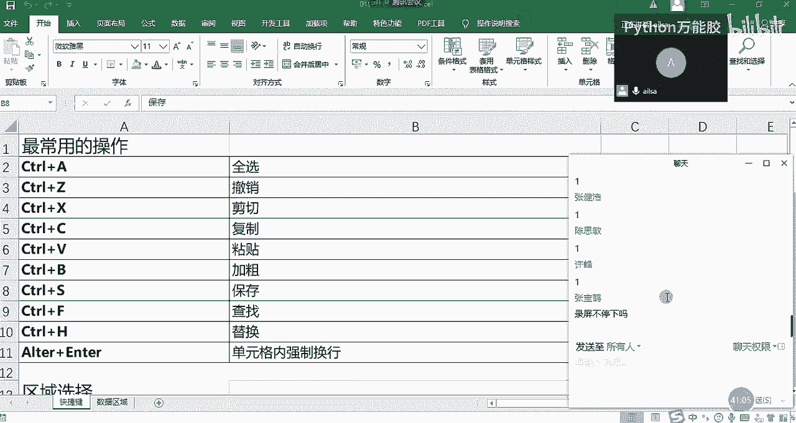