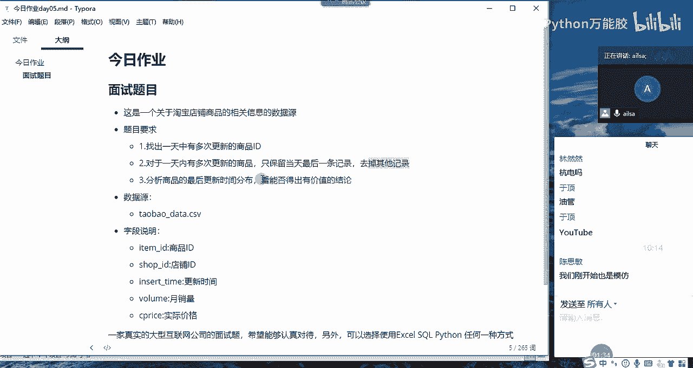
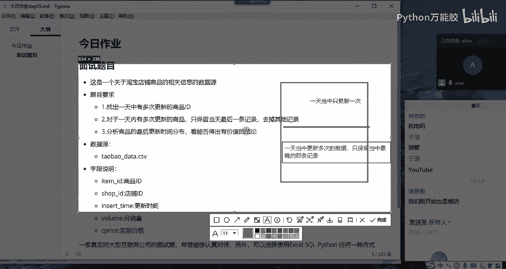
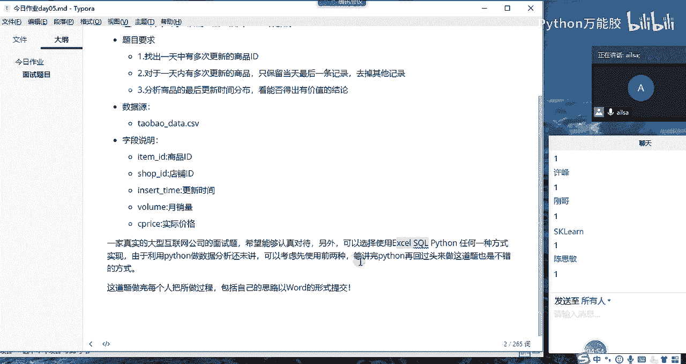

# 【python数据分析精华版来了（附文档代码）】10小时学会Python数据分析、挖掘、清洗、可视化从入门到项目实战（完整版）学会可做项目 - P41：03 今日作业介绍 - Python万能胶 - BV1YAUuYkEAH

嗯，今天的作业是还是你看还是电商数据的一个分析哈，它是关于淘宝店铺商品的相关信息的数据源啊，我跟大家说一下这个题目是什么意思呢？就是说我们淘宝啊，淘宝不是有很多个商品，很多个店铺嘛。

那他每一个店铺的下面都会有很多个商品，对不对？因为你比如说一个专门卖女装的，他可能卖短袖，对吧？短袖有很多种类，然后短裤有很多种类。等等这些。所以说它有很多个商品。那对于每一款商品的页面。

它都有可能进行更新啊，都有可能进行更新，这是很正常的。然后他一天当中啊有可能会进行更新多次啊，所以说啊啊我们的题目要求是这个样子的。就是说我们要找出一天当中更新多次的一个商品ID。

就是哪些商品更新了多次啊，然后把这更新这么多次的数据全部都找出来。然后第二个，对于一天内更新多次的商品，多次的一个商品，然后只保留当天最后一条记录，什么意思呢？就是说一天从零点开始到24点。

那整个的一个时间当中啊23点59分啊，多要多少秒，59秒是最大的一个时间，就是最晚的是一个时间，也就是说当天的最后一条记录。然后我们前面的呃那些都不要只保留最后一条记录就可以了。

也就是日期最大的那一条记录就可以了。然后去掉其他的记录。然后。第三个就是分析商品最后更新时间的一个分布啊，呃简单什么意思呢？就是我给大家画个图哈。

你比如说有这么些数据，然后有些数据是一天当中只更新一次的，我们不动啊。比如说啊这些数据是一天当中。只更新一次。我们就不动了。更新一次我们就不动。然后我们把一天当中啊更新多次的数据筛选出来。

多次数据筛选出来，筛选出来之后呢，给它去一下虫啊，怎么去虫呢？就是只保留啊只保留一天当中最晚的那条记录。只是保留一天当中最晚的那条记录，然后保留完了之后，相当于这呃这些多条记录呢，它也变成了一条。

对不对？那这一部分数据加上这一部分数据综合在一起去分析它整个最后更新时间的一个分布。我们能够得出什么有价值的结论啊，就这么简单的一个问题。然后大家听明白了没有？

嗯，大家听明白听明白给我扣个一。同志们？嗯，听明白了哈。啊，这三个问题其实是连贯的啊。也就是说我们从整个分析来说，就是一天当中啊有多有多次有一次的。然后一次我先不管，我先把多次的筛选出来，筛选完了之后。

我给根据一定的条件给他保留一条记录就可以了。然后把这所有的数据放在一起，然后进行一个最后一次的更新时间的这样的一个分布，然后得出我们有效有价值的结论就可以了。其他人呢只有一定一个人明白了吗？

OK都没有问题了之后啊，然后大家看我的要求哈，这道题需要每个人啊把做的过程包括自己的思路，然后以word形式提交哈啊，这个需要交到我这里哈，直接发给我就行。也就是说啊这个题这个实现的形式。

你可以用excel没有问题，你可以用circle也没有问题。如果你会python也没有问题哈，你用python也可以，当然这三个都可以实现哈。我这边采用的是pyth来实现的。

因为你们还没有交python数据分析，所以说应该大家都不会哈，我们只要选择前两种形式就可以了。如果你有时间，我建议你两种都选择一下。如果我们在面试的时候，别人给发了这样的一道面试题。

如果你分别用excel circle和python都做出一套来。那说明你还是挺厉害的。明白了吗？啊，或者说你直接采用circle和python也是可以的啊。

因为excel的话相对来说嗯相对来说是必备技能哈啊，所以说呃所以说circle和python更能体现你的优势啊，我们可以选择后两种，你在面试的时候，如果说你在实际的沟通当中，大家啊实际的训练当中哈。

大家的excel还不太熟的时候，可以采用这三种方式的前两种，先采用前两种，然后学完python数据分析，再回过头来把这个做一遍，然后就可以了。

好，那。