# 【python数据分析精华版来了（附文档代码）】10小时学会Python数据分析、挖掘、清洗、可视化从入门到项目实战（完整版）学会可做项目 - P9：04 文本函数 - Python万能胶 - BV1YAUuYkEAH

函数。

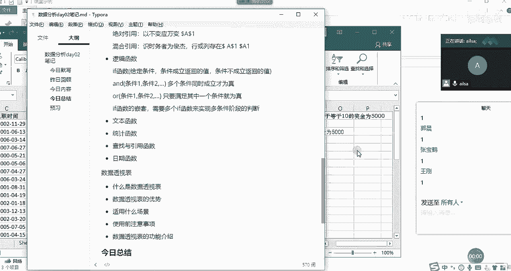

文本函数的话，其实它是相对于文本而言哈啊。相对于文本而言啊，我这个鼠标坏了啊，稍等。

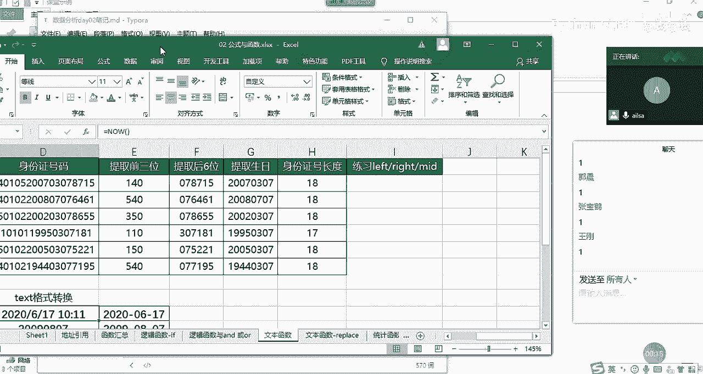

我们可以看到哈它这个是我们的身份证号码，我们都知道身份证号码里面包含了很多很多个信息哈啊啊有我们的省份的编号呀啊，还有我们的啊出生日期呀啊，还有就是性别呀，这些都可以通过身份证号码去判断。

那接下来呢我就想从这个18位的身份证号码当中提取一部分。我所想要的信息。这个时候我们用到的就是文本函数。那文本函数的三剑客，就是left right meet，啊，就是左右中啊，从左边开始取。

从右边开始取，从中间开始取这啊三个嗯。的一个不同的取值方式。我们在这里面去写，跟它进行一个核对哈。那你比如说我想提取前三位的时候，那我们想一下前三位。然后对于我们而言，它就属于是左手边的前三位哈。

所以说它啊就是我们面对电脑的左手边，还要等于left。啊，left然后我们看一下它的组成部分，函数的组成部分是有两个。第一个是text，也就是我们的文本。也就是说你想对文本进行一个操作。

你到底是对哪个文本进行一个操作呢？就是是我们是对它进行一个操作。那你想取它左边几个啊几个字符的长度呢？这里面的啊字符的话就是一个数字算一个字符，一个汉字还是算一个字符，一个英文单词也是算一个字符。

在这里没有什么啊长度啊，到底内存地址或者是啊占位符啊等等，这些都没有哈，我们都默认是一个就可以了。这个都比较呃比较那个统一一些。所以说我们left然后取前三位，那我们在这里面输入三就可以了。

number，就是你输你截取几个东西哈，截取多少个。我们按右括号，然后我们可以看一下啊，双击下来。哎，这就是我们所想要的效果，140540350啊110啊这样的一个结果啊，这是left啊。

我讲完left right和me之后，再呃跟大家进行一个互动哈。大家现在也可以自己手动操作一下。那我们看一下right函数啊，也是一样的，就是从我们我们的手的右边进行一个取值哈，面对电脑RIGHT啊。

right函数，它的组成部分也是一样，一个是文本，一个是取得长度，那我们的文本还是我们的身份证号码。那我们的长度呢就是后6位。那我们就输入6就可以了啊，输入6。然后我们看一下哎，好像结果也是一样的。啊。

结果也是一样的啊，那接着我们看一下，我们如果说想从中间取值的话，稍等啊，我现在没有鼠标啊，有点费劲。

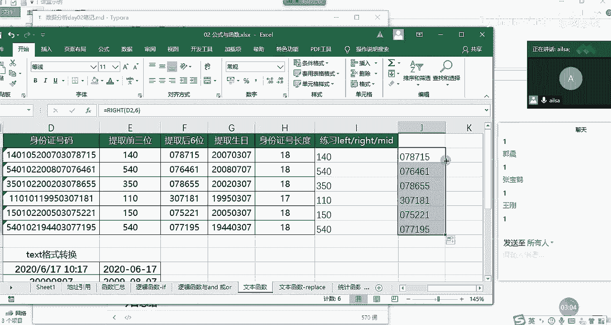

我们现在想从啊中间取值的话。

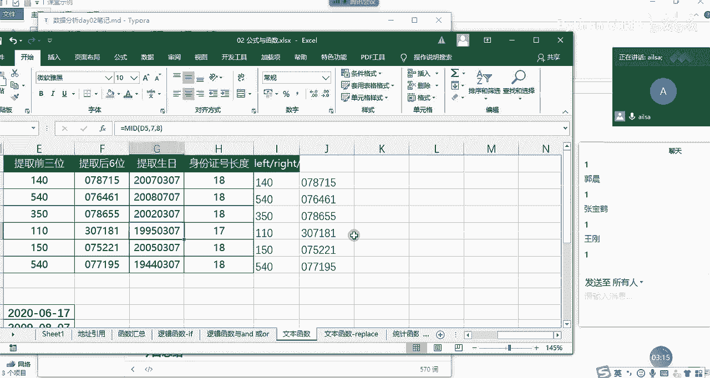

啊，中间取值啊，我们可以看一下，那也就是要提取生日，我们都知道生日的话是我们的第几位啊啊，生日应该是我们的，我们数一下哈，123456，第七位开始，对吧？第七位开始，然后是年是4个啊，然后取多长呢？

年是4个月和日是分别两个，那就是取8个，对吧？取8位，然后啊我们从第也就是说从第啊。

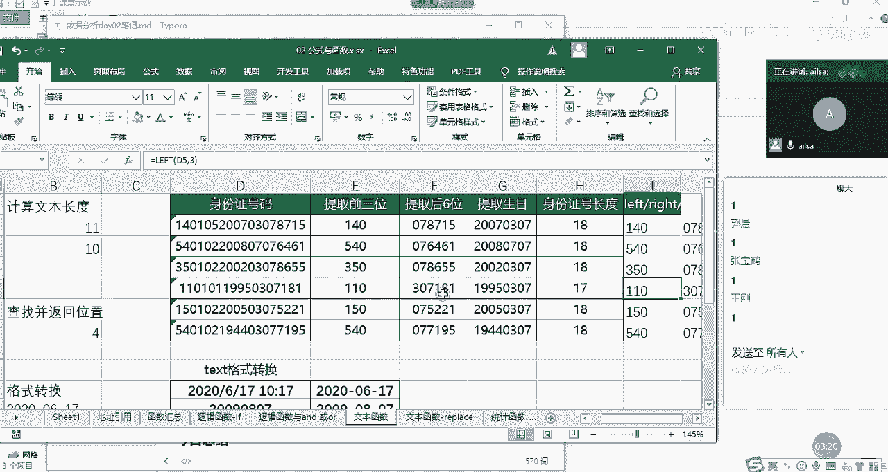

我看看啊，从第啊7个啊，这里面的位置的第七个开始，然后取8个这样的一个长度。然后跟大家说一下，在我们的excel当中，它的位置取不是从零开始的，是从一开始的哈，所以说是me的。

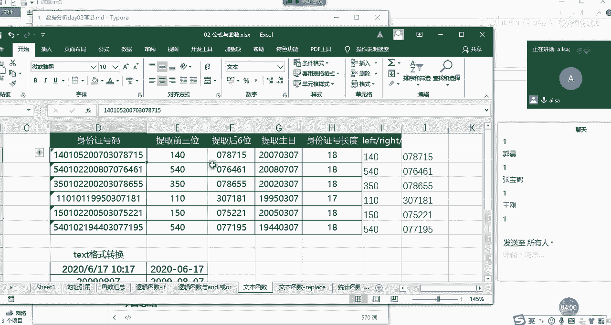

然后我们的text还是选择我们的身份证号码，然后从start number呢，就从第几个开始取。我们刚才数的从第七个开始取，然后取多长啊，number chance就是取8位啊，我们看一下所想要的效果。

哎，那就是我们最终得出来的就是我们的呃年月日的一个出生日期的啊这样的一个结果，这就是left right和me函数。我们在对于问文本进行一个呃操作和截取的时候，主要使用这三个兄弟函数啊。

大家对于这三个有什么疑问没有。啊，没有疑问的话，扣一，有疑问扣2，然后抛出问题。好的啊好的，都没有什么问题是吧？好，那我们接着讲一个叫len函数的哈。len函数就是我们的长度啊。

我们在python当中也都学。那其实这个就是很简单。那什么时候我们会用到Ln函数呢，就是在我的工作当中，我经常用到的就是有一些啊有一些长度它是固定的。你比如说手机号码，身份证号码啊。

或者是那个邮编啊等等这些，它的长度是固定的。但是有时候你需要检查一下，就是数据清洗的过程当中，你需要检查一下它的它到底数据是不是准确的，你就可以通过它的长度去判断，你比如说这个身份证号码，它就是18位。

我们看看它有没有啊填错的哈。因为一般情况下，身份证号码都是手工进行一个记录的，要等于L。

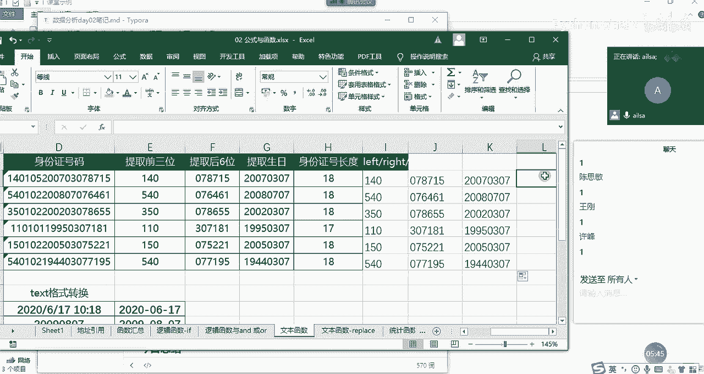

然后它这个函数的组成部分就只有啊就只有很简单，就只有我们的文本，我们选择它啊，我们选择它。然后在这里写哈，因为我现在表格已经过不来了啊，我们选的entt键，我们可以看到是18位。然后我们再双击下来啊。

双击下来，喂，我们看到有1个17位的那说明啊这个。

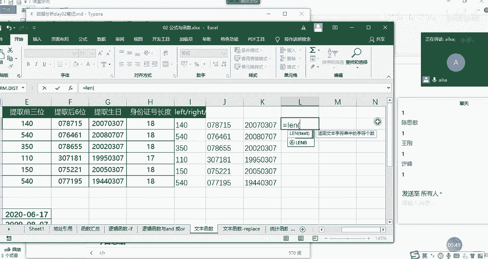

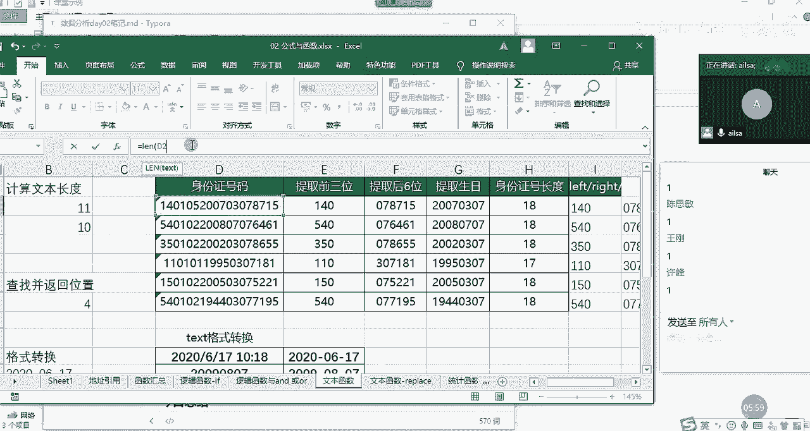

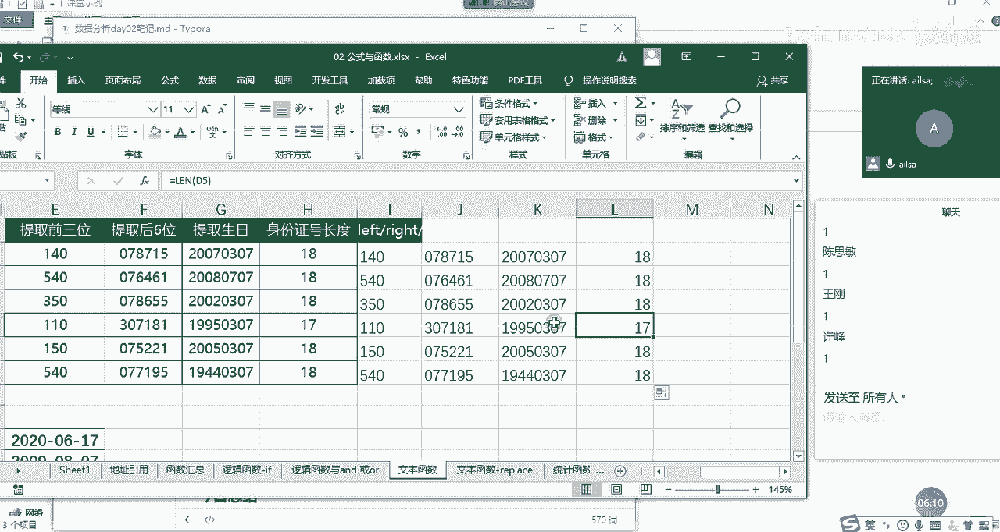

这个啊身份证号码就少了一位啊，那就存在录入错误的问题，你就要去跟相关的人员去核对啊，然后它正确的身份证号码是什么？对于一些很重要的数据而言，我们可能真的是需要一个个去核对它的一个准确性的问题啊。

这是呃allan函数，我们再接着往下走看texax函数tex函数也是文本函数，但是它主要是对于格式的转换。

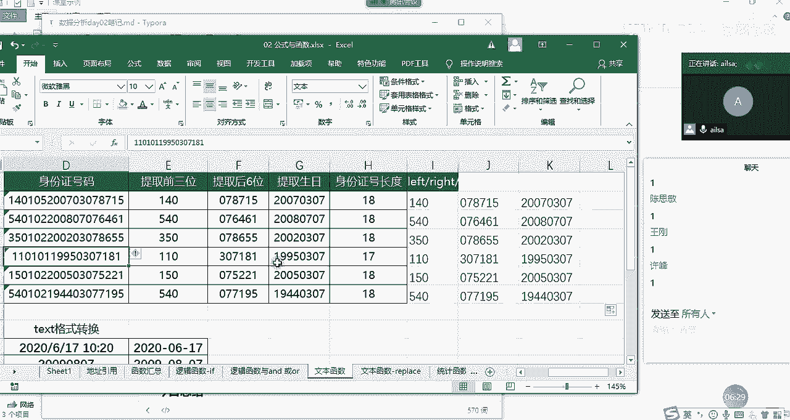

我们在昨天讲那个呃日期时间格式的时候，也说过text啊，我们看给定这样的一个日期时间格式之后，我如果想让它转成这样的话，我们可以第一步操作就是controrl加一，然后把它设置成日期格式就可以了。

因为这种有很多种形式，对吧？你设置成哪种形式都可以。那第二种方式的话，你就是可以用text啊，tex我们看一下它函数的组成啊，它函数组成的话，第一个就是value。

也就是说你要针对哪一个啊单元格里面的值进行一个格式的设置，我们选择它那第二个我们看到format就知道是格式化了，对不对？哎，我要对它进行个格式化。

要设置成什么样的这个时候我们可以把它设置成啊YYYY啊，就是年啊杠啊直接是杠，然后是MM啊杠DD这样的一个形式，然后输入完了之后，我们按右括号，我们可以看到就可以达到我们所想。

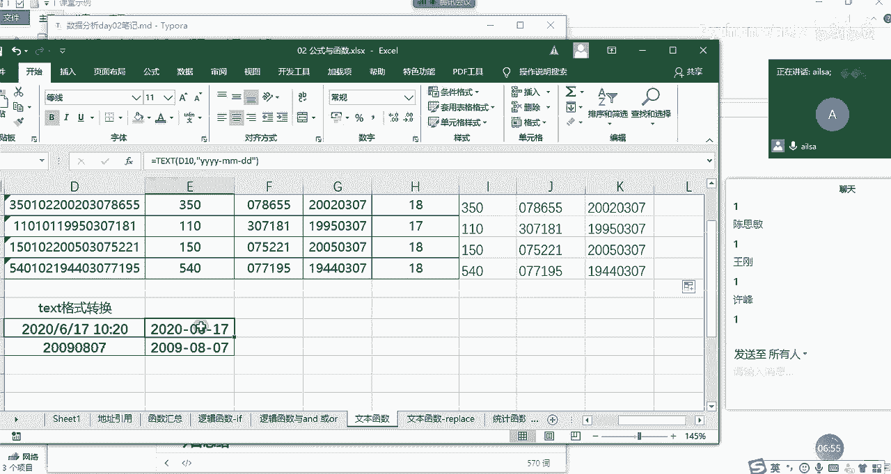

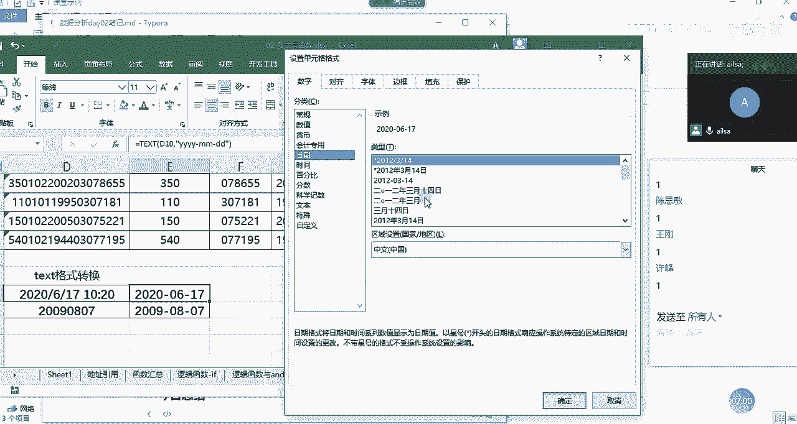

的效果。那对于tax格式的转换，它还有一个很重要的功能在于什么呢？我们可以看到就是设置单元的格式有一个自定义。

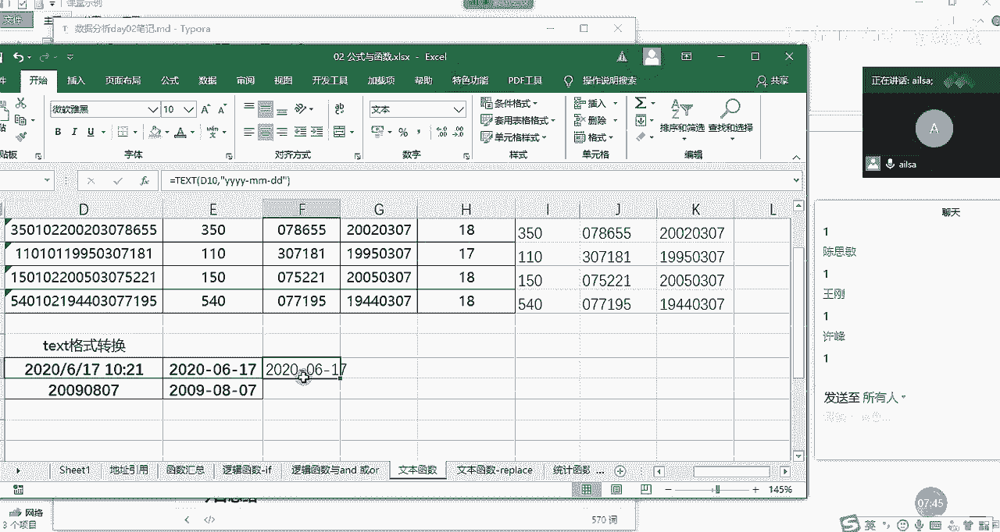

啊，这里面有很多自定义的一些格式，大家可能都看不懂啊。就是如果呃你想对它进行一个就是特殊特殊格式的一个自定义的时候，你可以用tax，然后按照这里面的一些书写方式来实现自己的一个个性化的格式设置啊。

因为这个有点难哈，所以说啊大家目前不用掌握啊，我就跟大家说一下，有这样的一个功能就可以了啊。那呃我们接下来我把笔记给大家做一下。嗯，那我们的文本函数的话，我这边讲了啊left。

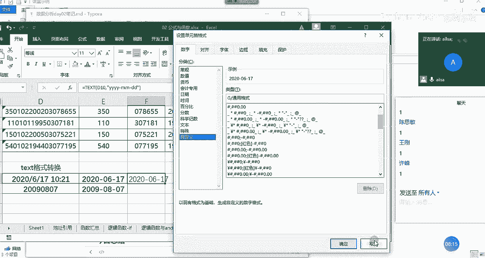

Right。RRIJGpri，然后还有我们的me函数啊，以及嗯我们的len函数和text函数。那对于left函数而言，它的组成部分。第一个就是文本啊，你知要对哪个文本进行操作。

那第二个组成部分就是它的长度，你要截取多长的字符。这里面的字符的话啊，就是呃不管是数字字母还是汉字都是一个啊，长度都是一哈啊，rightite也是一样，文本。嗯，文本啊，然后是长度。啊。

然后幂的函数稍微啊多了一个参数，就是什么呢？首先是文本，第二个就是它的呃起始位置，因为它是从中间截，你要告诉它一个位置，就起始啊位置。然后第三个啊第三个的话就是它的长度。啊。

记得我们所有的逗号都是英文状态下的。不仅仅是逗号，包括我们的括号，也是英文状态下的啊，不然你输入中文，它就会报错。learn的话就只有一个就是我们的文本啊。那text它有两部分组成。

第一个的话就是文本啊。第二个就是你要转换的一个格式啊，这个格式可以是自定义的啊，按照一定的书写规则就可以实现我们所想要的效果啊，那这个就是文本函数，我就讲这么多，然后大家对于文本函数有什么问题没有。

没有什么问题扣一。嗯，好的，那我啊断一下啊。

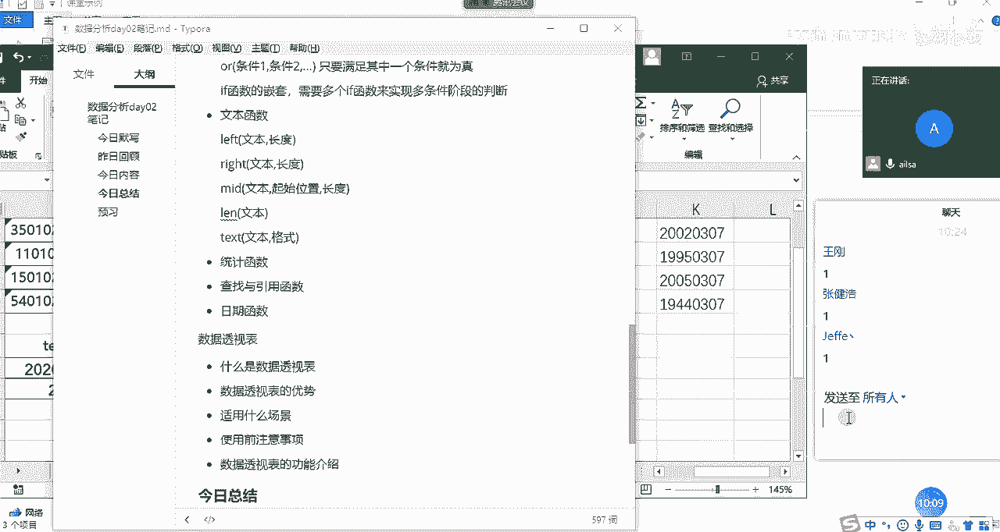