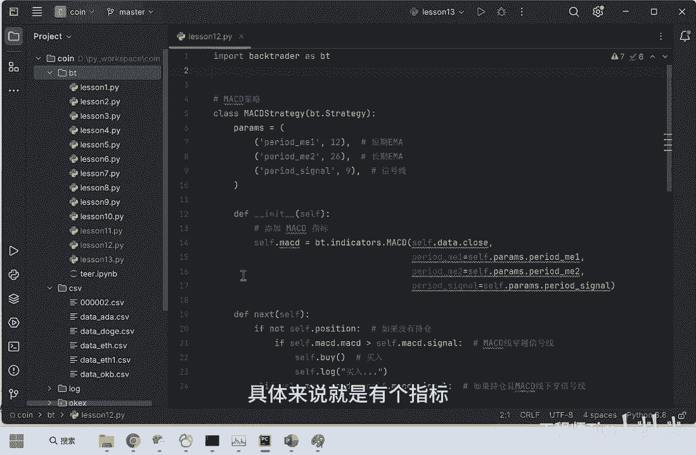
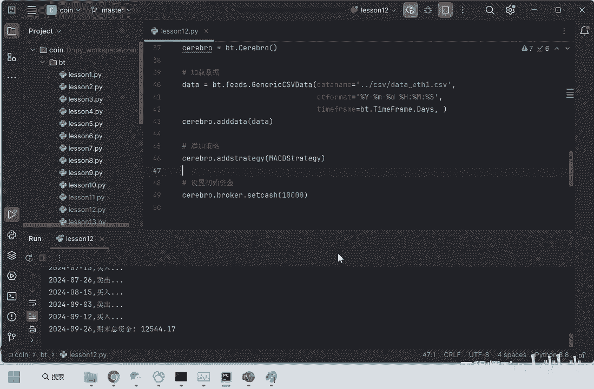
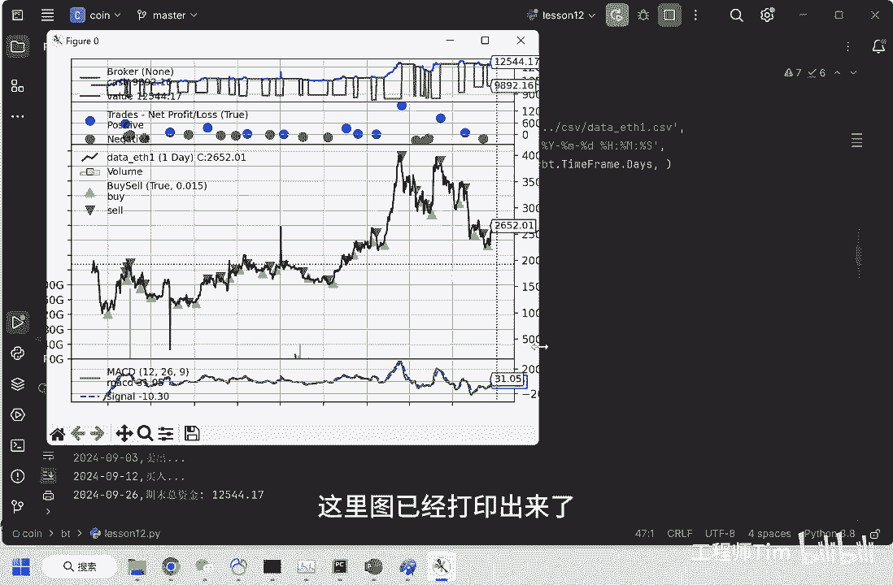
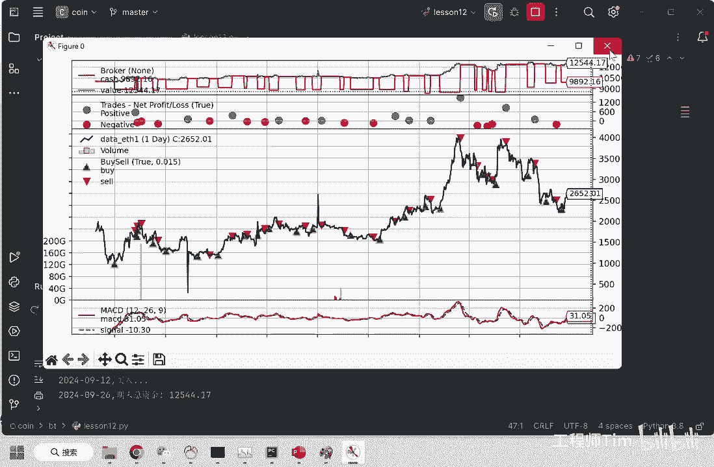
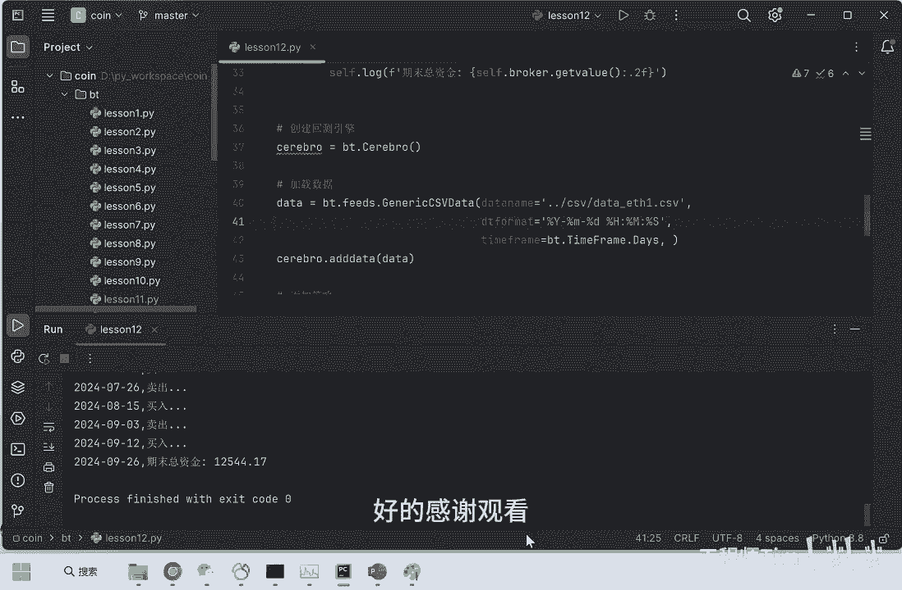

# 【python量化学习】macd策略代码实现，虚拟币市场测试效果（以太坊ETH行情数据测试） - P1 - 工程师Tim - BV1yCxXeyEyK

哈喽朋友们，今天给大家讲一下MACD策略，以及MACD策略运用到虚拟币市场的效果，首先来说一下什么是SMAACD策略，具体来说就是有个指标。

有个指标叫EMA，EMA它叫指数移动平均线，EMA呢它又分为短期，短期眼眉和长期眼眉，短期EMA和长期EMA的A的差值就是MACD的值，这就是买入和卖出信号的产生，就是和这个MACD值相关。

另外还有一个值是signal，他也有自己的计算公式，买入和卖出信号的产生就是MACD和signal产生的，如果MACD向上突破了signal，因为MACD也是一条线，他如果向上突破了signal。

signal也是一条线突破了，那么就产生买入信号，反之产生卖出信号。

在后面代码中我们会讲到，好了代码我已经写好了啊，下面来讲一下MACD策略的代码，实现使用的测试数据呢，是以太坊的ETH的历史行情数据，具体来说一下这个代码，这个策略的实现呢。

我使用的是bank trader这个Python库，把它引进来，As s bt，使用呢就是首先初始化一个bank trader的实例，叫cell bro，初始完之后呢，就填入数据，你的测试数据。

我的测试数据使用的是ETH，也就是以太坊的历史行情数据，我已经提前准备好了，这个数据字段的有时间开高低收，还有一些其他的字段，它的历史行情数据从22年到24年，然后参添加策略设置初始本金是1万。

然后运行打印，最关键的是这一步，ADD是strategy设置策略，这个策略呢就是上面我写的这个MACD策略，他继承了这个WECHAT给这个类，然后实现里面的INIT和next的方法。

最关键的就是INIT和next的方法，在INIT里面我们初始化了MACD这条线，使用的bang trader里面的MCD计算公式，填入你的参数，短期我填的是12天，长期26天，信号线填的是九。

在next里面就是买入和卖出信号的如何是产生的，如果没有持仓，并且MACD突破了signal这个信号，那我们就买入，反之就卖出，这就是信号的产生，另外还有日志的打印，哎呦，策略执行完毕的方法好了。

我们运行一下这个策略，Ran。

运行完毕，这里图已经打印出来了。

放大一下，嗯先来解释解释一下这张图最下面的这个条，这条线是MACMACD线，红色的这条这条蓝色的这条是signal，所以说MACD向上突破signal就买入，反之就卖出，这个黑色的线是行情数据。

ETH的行情数据，这个小三角是买入，向上向上小三角是买入，向下小三角是卖出，这样买入卖出买入卖出，上面这两条线是蓝色的，是净值，红色的是余额，净值一开始是10000or嗯，经过回测呢。

最后是1万2544，蓝点和红点的意思是，蓝点是赚钱了，红点是赔钱了，这就是整个策略。

另外在这里也有打印，6月29号买入，然后卖出，买入卖出都有打印，对应的是这一行log打印，期末总资金1万2500，初始本金是1万，也就是说这个策略在两年时间内赚了2500。

