# 【python金融量化精华版来了（附文档代码）】10小时学会Python数据分析、挖掘、清洗、可视化从入门到项目实战（完整版） - P19：19.重复值和异常值的清洗 - python技术栈-大王 - BV1AGzFYVEYY

就来处理一下这个后两种形式的数据清洗啊。

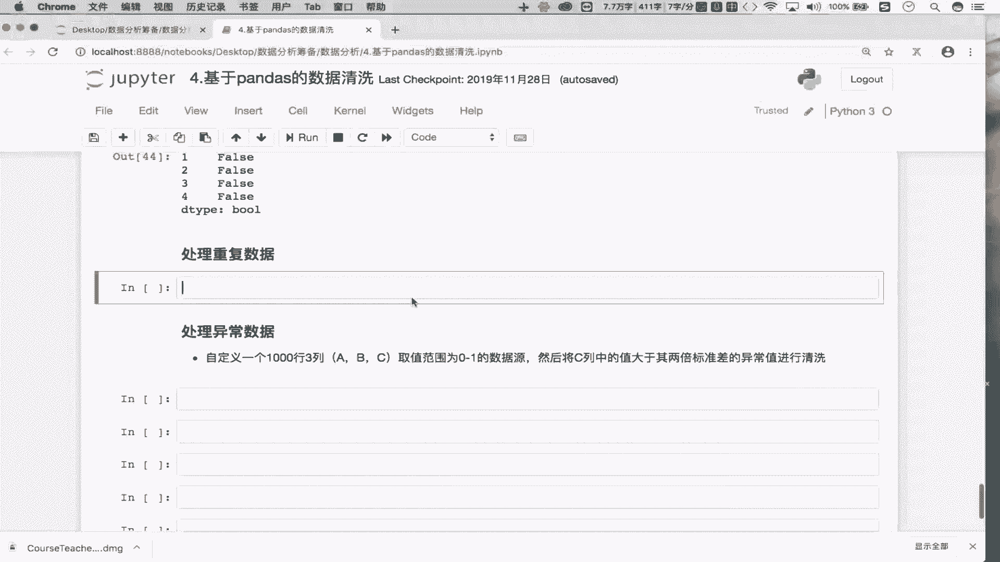

一种是对我们的这个重复数据，另一种是呢是对我的一个异常数据，OK吧，首先呢先看我们的重复数据吧，那首先在这第一步啊，我们先给它生成生成一组，这个带有重复数据的数据源。

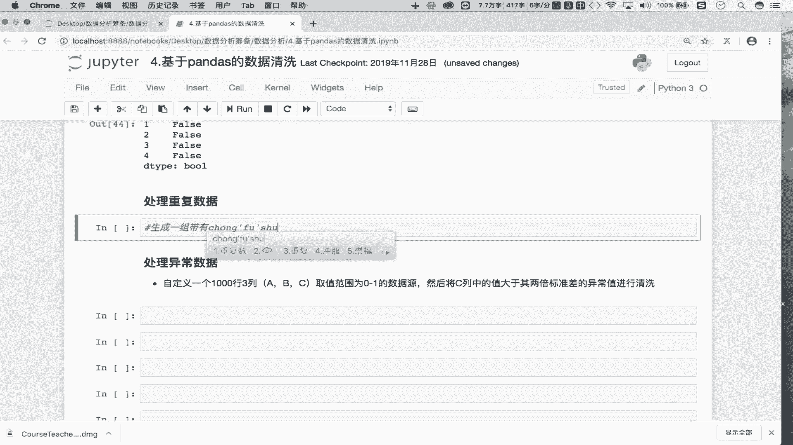

OK吧，这块的重复数据指的是什么呢，指的是我们有重复的行数据。

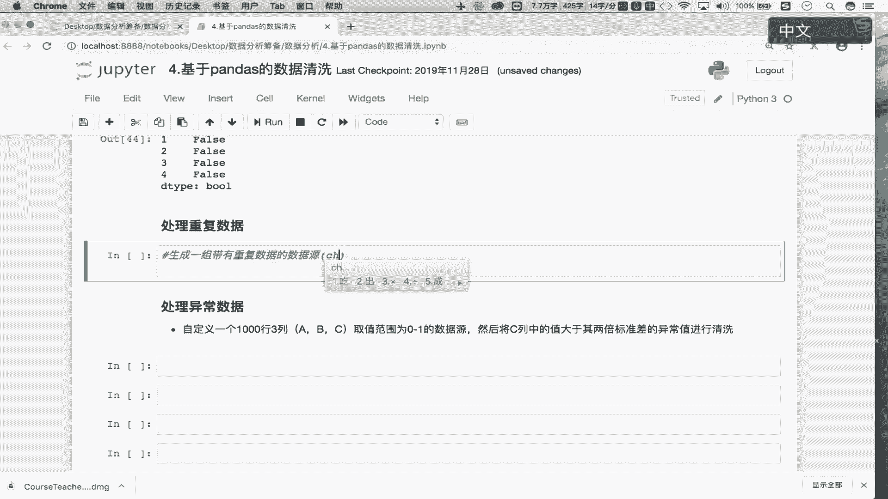

重复的行数据OK吧，那在这的话DF啊，DF就等于data frame好，那这块的话，我们的数据源还是通过我们NII生成啊，random点random int0到100size好。

那这块的话给他一个给它一个八行四列吧，八行四列所对应的一组值啊。

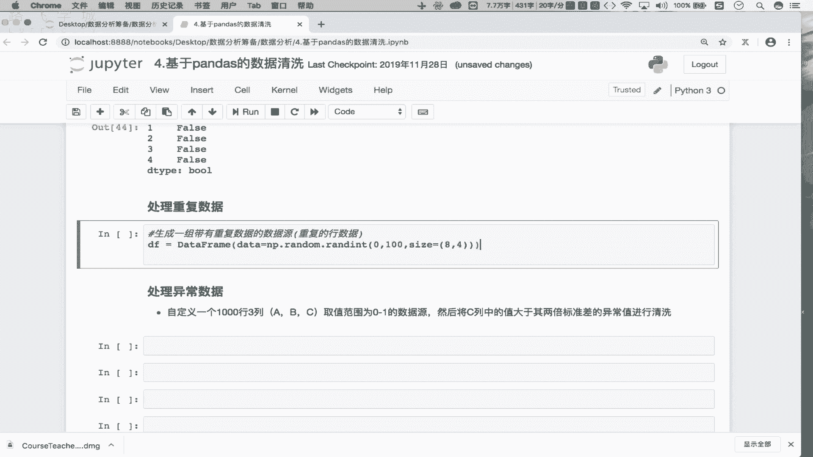

好那现在的话DF就有了，那这组DF当中是没有重复行数据的吧，在这咱们给它生成一组重复的行数据好，那在这的话咱们去访问一下行啊，访问一下行行的话就是点i lock中括号二吧。

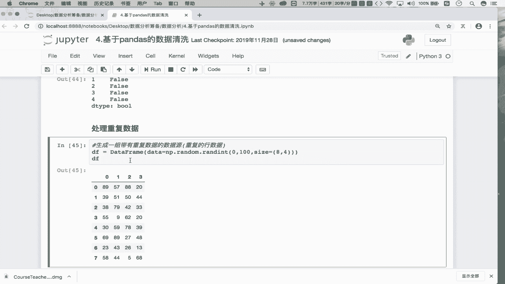

就访问了一组行数据啊对吧，让它等于什么等于这个0000。

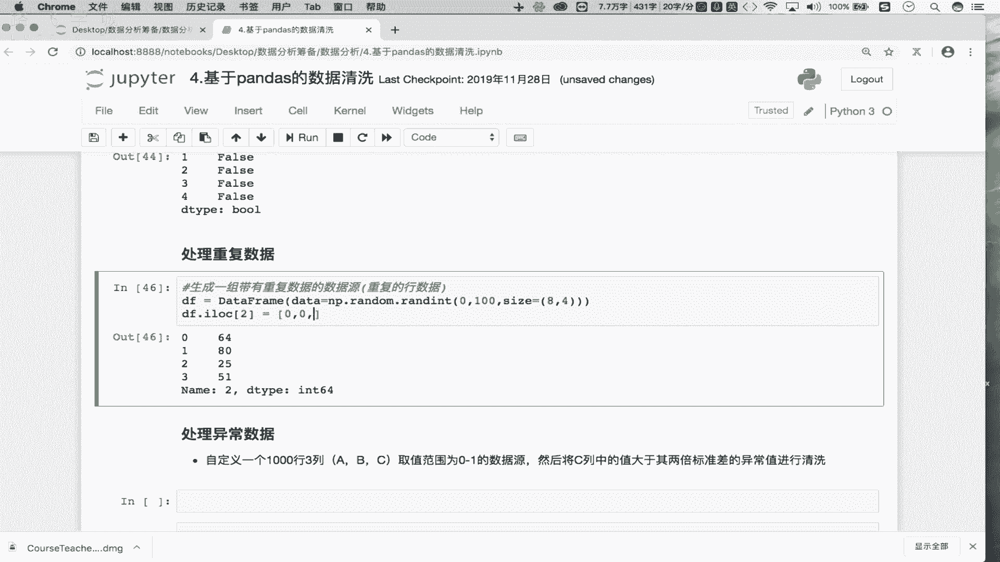

OK吧，好那么我们生成，另几组重复的行数据，四五再看DF走。

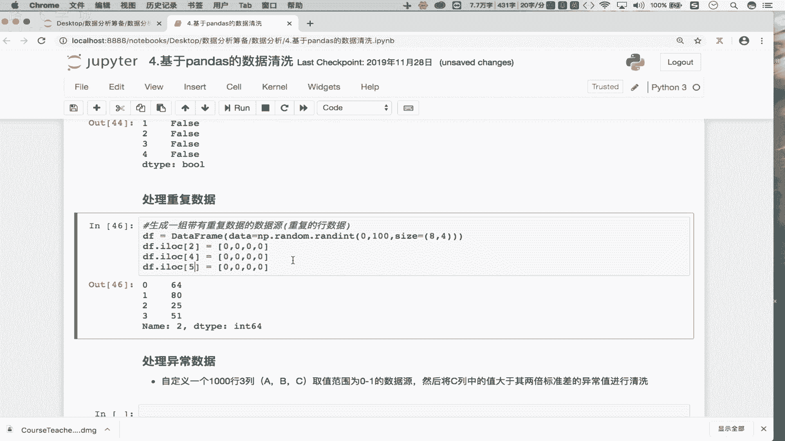

现在DF当中是不是有这个三行，重复的行数据啊对吧。

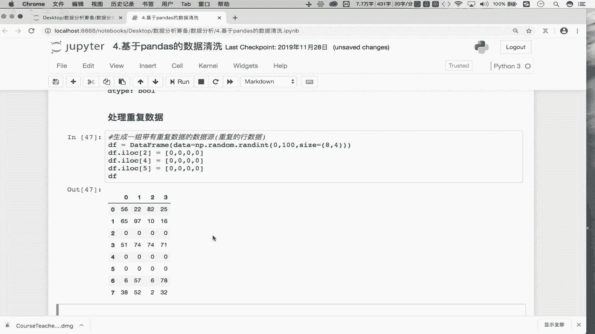

那么有重复的行数据之后，咱们在这怎么去清洗呢对吧，这块清洗的话就简单了，就是使用什么呢。

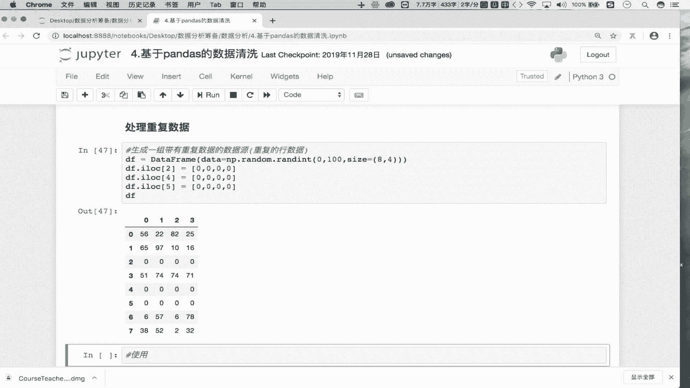

进行一个清洗就可以了啊，那这块咱们就是DFDRDROP，你看drop系列的函数拥有三个job，咱们学过了吧对吧，drop down刚刚也用过了吧，它是用来啊，它是用来清洗我们重复的行数据的啊。

使用它进行行数据的清洗啊，在这的话看一下它的参数，这我们只需要指定一个keep就可以了啊，Keep keep，如果keep等于force，什么意思啊，keep是保留啊，keep是保留保留。

first是保留第一次出现的重复的行啊，你看我们的第二行啊，索引为二所对应的这行不就是第二行。

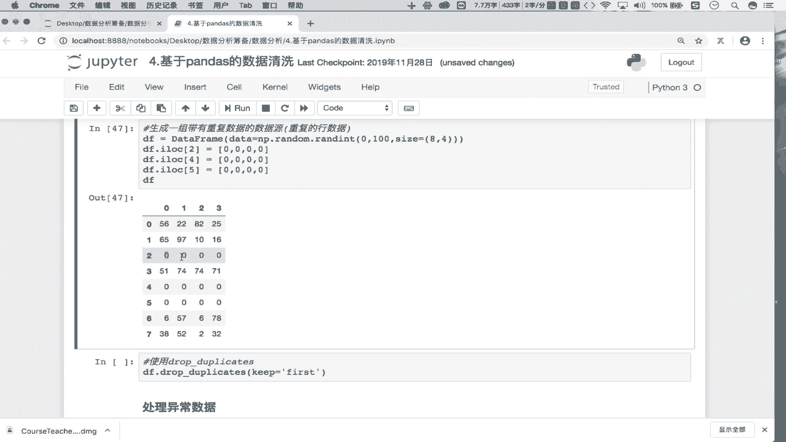

就首先第一个出现的重复的行数据吧，那我去执行走看一下第二行还有吧。

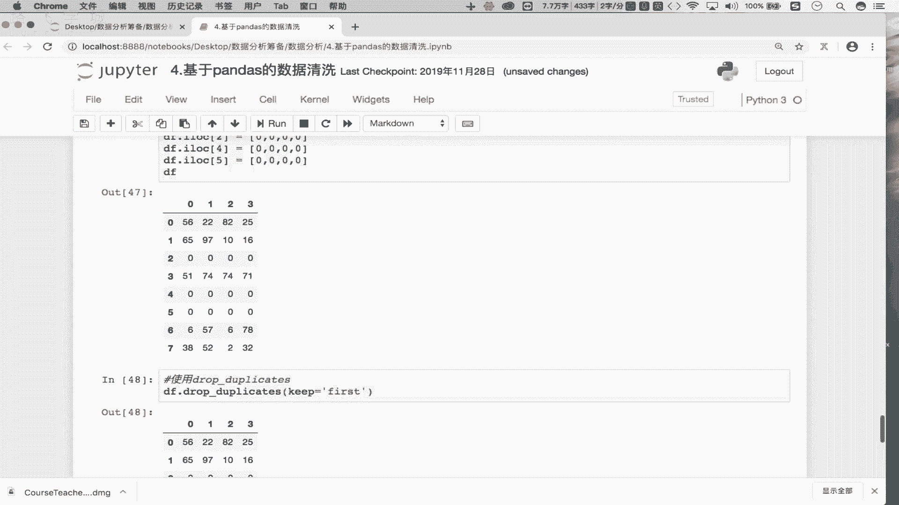

剩下的四五，这两个重复的行数据是不是就没有了对吧，那这样的话我们重复的行数据就被删掉了，OK吧，它能等于first还能等于什么呢，last是保留最后一行，第二行是不是就没有了，第五行有吧是吧。

然后呢它还可以等于什么呢，等于一个false对吧，false就是说把所有重复的函数都删掉啊对吧，都删掉，那这块的话我们就使用它默认的什么呢，first吧，你看它的默认值是不是就first对吧。

那这样的话。

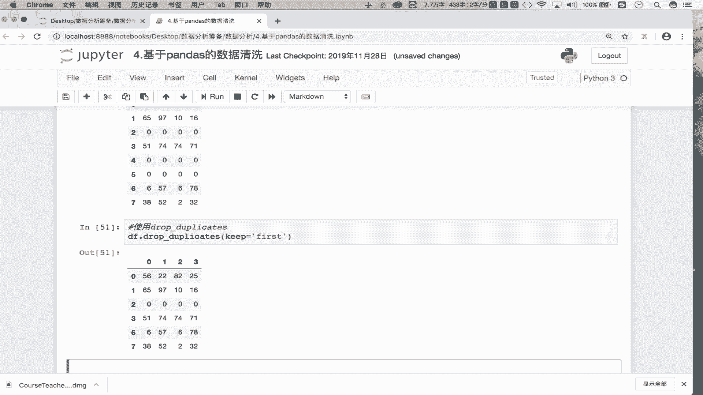

咱们就将重复的行数据给它进行一个删除，那这块比较简单是吧，好我们就一带而过啊。

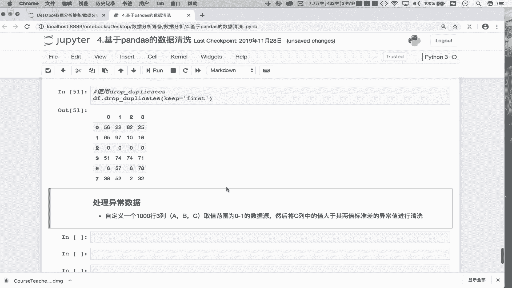

那最后一个清洗我们的异常数据啊，清洗异常数据，那什么叫异常数据呢，举个例子啊，比如说我们所采集的是一个蔬菜大棚的温，度数据吧，A突然间啊有些这个温度传感器哈，它比如说坏了或者失灵了。

它所采集的温度有一些温度是零上呃，50或零上120℃，那么零上120℃，这些一定是常值啊对吧，大棚怎么能有这么高的温度呢是吧，所以说这些不符合常规的值，就是我们所谓的一个异常值，OK吧。

这是我们的异常值啊，那么这块的话咱们对异常值进行一个清洗，咱们来看一下怎么去清洗啊，首先这我们定了一个需求啊，那就是说我们需要生成一个什么1000行，三列的这个数据源啊，那么值的范围是0~1之间吧对吧。

好我们先生成一下DF就等于啊data frame，好，data就等于NP点random点random吧，因为这个random点random啊，它生成的随机数就是从0~1的，OK吧。

好size等于是不是1000行三列啊对吧，然后指定一下它的列索引吧，列索引分别是谁呢，是A。

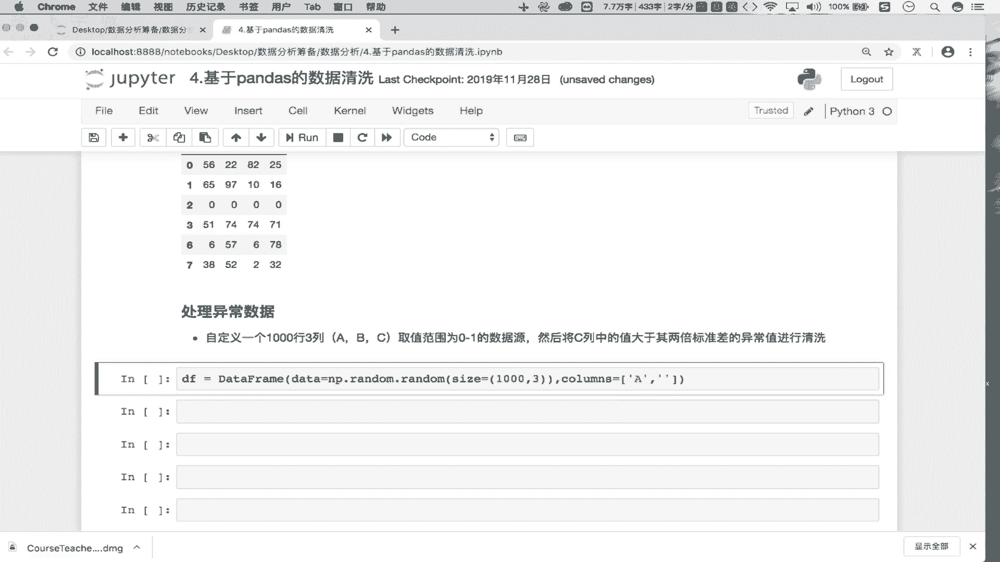

C是不是好看一下DF，那现在这一组原数据就有了吧，然后接下来我们在这需要对异常数据进行处理，那题目已经告诉我们了啊，他说我们所谓判定异常值的条件，就是说C列中的值，如果大于C这一列两倍标准差。

那么这个值作为异常值进行判定，OK吧，那就将这些异常值进行处理。

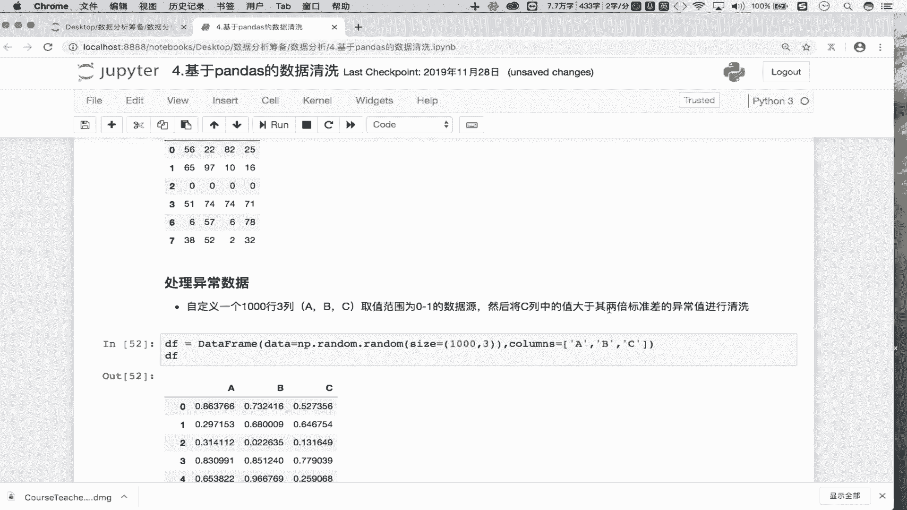

是不是就可以了，比如说哈比如说首先0。64啊，比如说这个值已经大于了C这一列，对应的这组数两倍的标准差了，那么意味着这个值就是异常值吧，我们需要将异常值给它删掉，怎么删呢，那这就不能填充了吧。

不只能将异常值所对应的行数据给他删除啊，对不对好，那这样的话我们就先找哪些是一项值吧，那首先我们在这先去设定一个什么呀，是判定异常值的条件啊对吧，那异常值的条件就是说C这一列的值。

大于C这一列两倍的标准差吧。

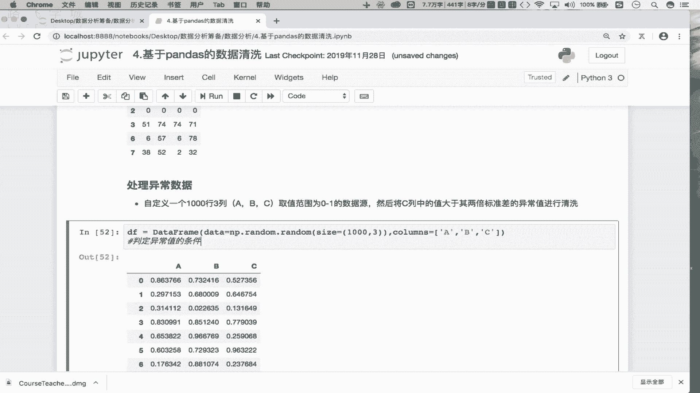

首先DF那C这一列两倍的标准差怎么求啊，不点STD是我们的标准差。

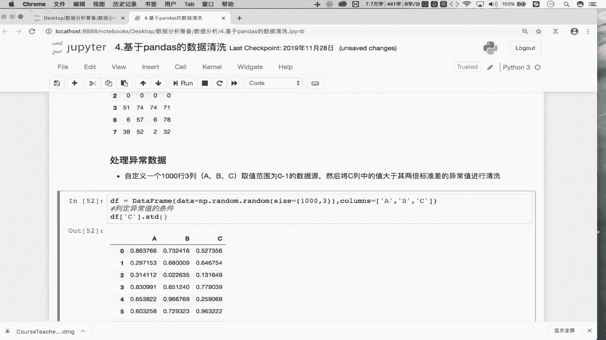

对不对，是两倍标准差，是不是乘以一个二啊，对不对好，那这就是我们的这个这个t w i c twice，杠STD说两倍标准差就是他呀，对不对，那我们需要判断啊，这个是我们判定意义上乘的条件。

那就是说首先DF先取出C这列吧，C这列如果有的值大于了twice杠STD，那么这些值就是一项值吧，对不对，那我现在执行这样的一个条件判断的语句，那返回的就是true false吧。

true是表示这个值啊，零所定的指数满足异常值条件，它就是异常值啊，对不对，那false表示它不是一项值吧。

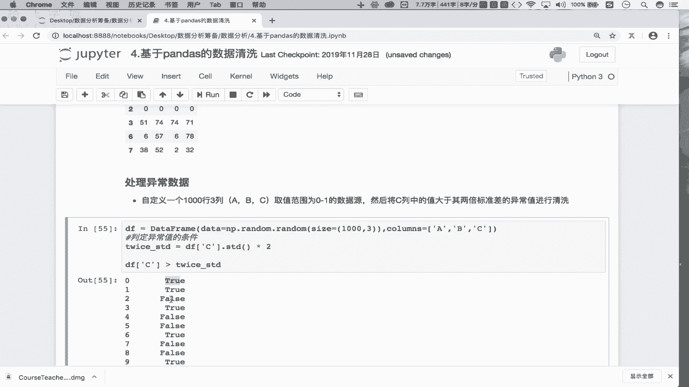

那我们是不需要将true所对应的行给他删除啊，对吧，那如果你将这组原数据直接代入到啊，将这个布尔值直接作代入到原数据的话，作为原数据行数据的话，是不是只只能保留TRU而忽略host啊对吧，那怎么办。

我能不能前面取个反，取个反取反，就是说它原先的true变成了false了吧，走对不对，那就说false表示的是异常值吧，true表示的是正常值吧，那怎么办，就把它作为原数据的行索引就可以了对吧。

把它作为原数据的行索引就OK了啊，好那么咱们作用一下啊，在这的话就是我们的df d r lock好放进去吧。

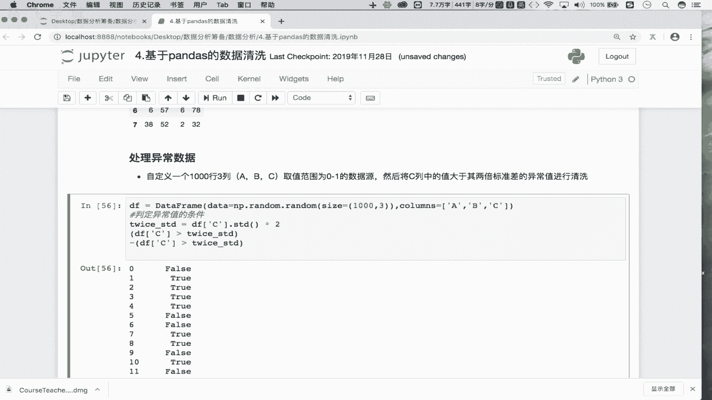

走你那现在这组原数据啊。

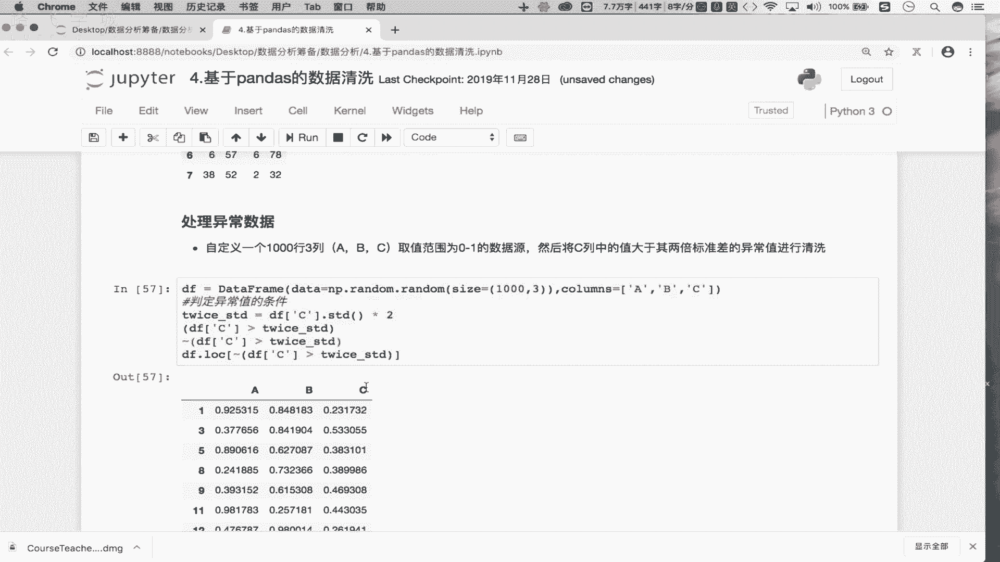

这组数据看到的情况，这里边就没有异常值了吧对吧。

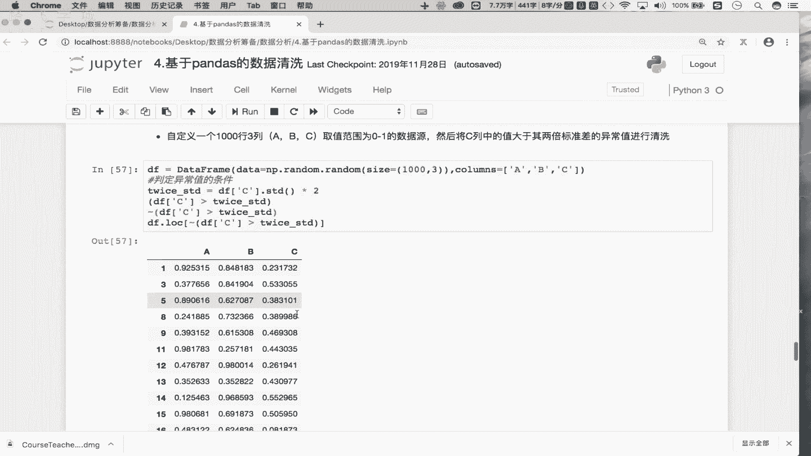

我们看一下我们原先的异常值，twice杠STD是多少呢。

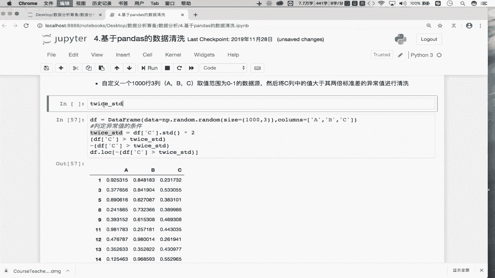

是不是0。57啊是吧，那现在你看C这列里边。

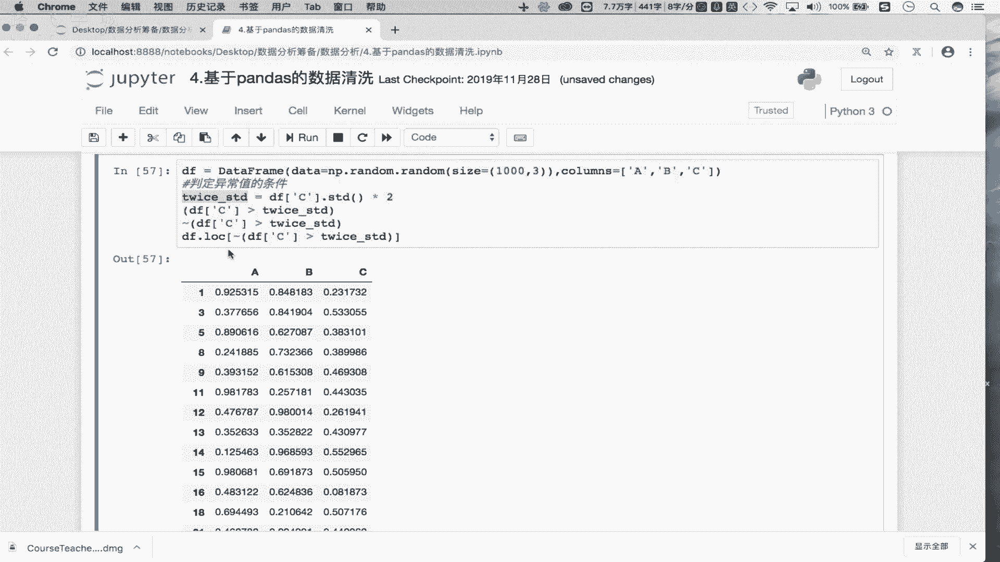

还有没有大于0。57的值，没有了吧，那么就意味着，咱们已经将整个数据当中的异常数据。

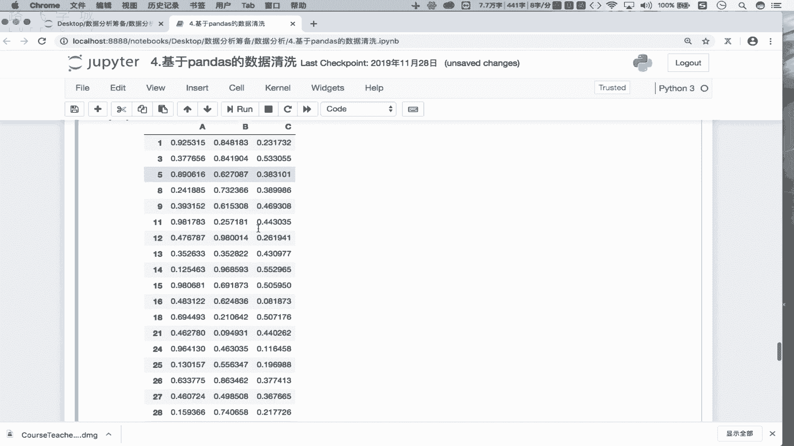

都给它进行了一个过滤和清洗吧对吧。

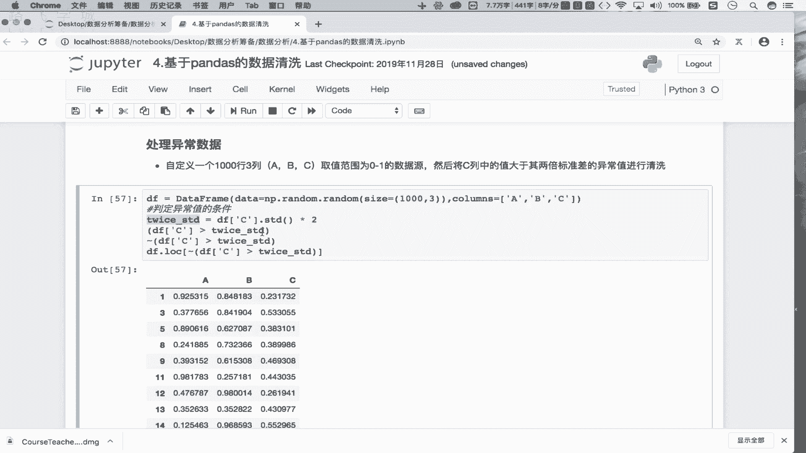

所以说这块的话，就是对我们异常值进行的一个清洗，你要知道对异常值进行清洗的话，一定要有一个判定异常值的条件吧是吧，有了条件之后，根据条件去做判断，将满足条件所对应的行数据给它删除就可以了，OK吧。

那么至此的话，咱们整个的一个数据清洗就到此结束了对吧，我们可以清洗异常值，清洗缺失值，清洗重复值是不是都可以了。

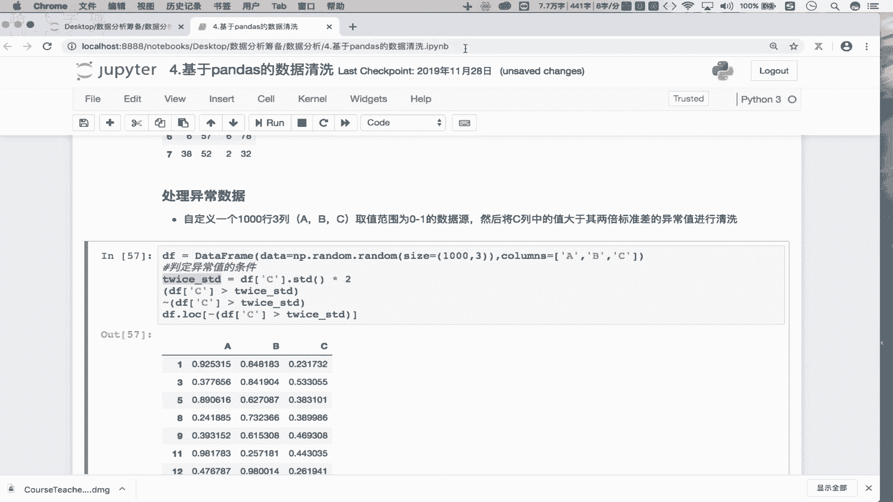