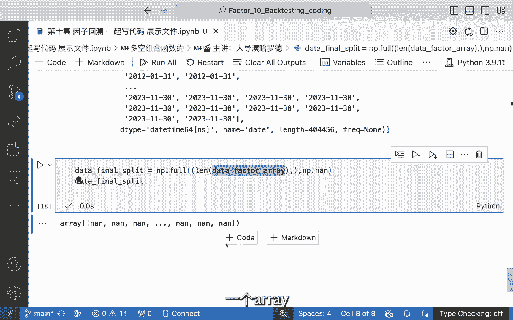

# 【因子实战10】Python代码实现因子分组（第二部分：Numpy数组代码详细讲解） - P1 - 大导演哈罗德 - BV1Y1421Q7zN

OK那data等于data的job，Nn，subset等于factors，这样之后我们能得到的就是一个，我们现在想想一想哈，我们跟着我的思路，我现在有了这个factor，我现在想得到什么。

我现在想得到一个12345对吧，大家还记得我们当时的目标吗，我们想把它分成五组，那分成五组的话，我要怎么做呢，也就是我要再加一个，比如说group一个column。

那这个group column它能做到的一个结果呢，就是可以把这个事，比如说他们就在第一组，他们就在第二组，我如果能得到这个，然后大家想我既然能用stack，那肯定也能on stack对吧。

那on stack我就直接把它变回了一个呃，我想要的一样这样的一个数据集，这也就是我想达到的这样的一个目的好，那在这样之后呢，大家会发现我想要去呃做的事情是什么呢，也就是我要写一个函数。

我要define一个函数，这个函数的目的是什么，它可以input这个data，它的output应该是什么呢，它的output呢就相当于是有一个group column，可是要完成这个事情。

是要用一个for loop的，要用一个group，为什么要group by，大家想想，我肯定要group by这个I这个date对吗，我每一个date进行同样的操作，来进行一个group。

还有一个什么呃需要做的，我需要一个PERCENTER，大家想是不是这个道理，因为我需要有一个百分比嘛，就是大家想这种分组，一般我觉得学过统计的，大家都知道。

他的逻辑就是我找那个twenty percent，Twenty，percent pertile和，forty percent pertile和sixty percent pertile。

然后把它每一个PERL找到之后，属于每个这个比例中间的，它就属于第几组，我其实第一个想要的是什么，我不想，首先我一定要把这个factor这个值拿到对吧，OK那我怎么把这个factor值拿到呢。

那我就把这个data factor array把它先给定义出来，它是一个什么值呢，它就等于data factor，然后点什么呢，大家想想点value嘛对吧。

这样的话呢我就会把他所有的value给它拿了出来，那我个人习惯就是每一行每一个函数，我们先把它看一下，大家看这个的展示有点迷惑性，它让你感觉它这里面只有一个呃，就是一个era。

但如果大家用这个line函数来把它打印出来的话，大家会发现哦，他有四个这么多万，那这么多万个是什么意思呢，哦也就是说他有这个所有的这个factor的值，从上到下好，大家发现如果我这么做，我丧失了什么。

我得到了所有的factor的值，但我丧失了它属于哪个组，我得要我不能弄乱了，弄乱了对吧，我要弄乱了就就就就不好了，因为我要弄乱了的话，那那那那可能后面就会出问题，所以我下面一个想去做的事情。

除了这个data factor aa，我现在想做的呢是呃，我想有一个这个group group呢，是为什么，大家如果对这个group bye这个函数不了解的话。

大家可以去这个pandas document，去找一下他的这个group bi的函数，因为我觉得goodbye这个函数还是很重要的，所以大家能知道它应该是什么吗，The index。

大家也知道他是一个moot index吧，我刚刚说了，就是它是一个moot index，Moi index，我有两个index，也就是说一个index股票，一个index日期，那我们是想用日期来分组。

还是用股票来分组，还是说股票和日期来分组，大家思考一下，而如果对于一个MTT这里有个函数叫get get level，In deuget level values，那get level values吗。

就是因为它有两个value，就像我说的有两个name，这里我已经起好name，一个by name是一个name是asset，那如果他有两个names的话，我get value的话。

第一个get的呢就是它的date的这个value，那get这个date value之后呢，我就能够得到我想要去啊，我可以打印下来这个group，大家就可以看到哎呀这group长什么样呢。

它就是一个OK它是一个多长的，它是一个O这么这么长的，它是一个呃，我即将去进行了一个分组，但是它里面当然有重复的，但这个并不影响我去做下面的分组，那下面大家知道我最后想去做什么吗。

我想去做的事情就是我的最后的结果，比如说final result，这个呢我想前面也先把它定义出来，我的final result，或者说我的final split，为什么叫split。

因为我想把它split，我想要现在大家看这个data factor array，我再把它打印出来，大家看一眼，它是一个4万多，就是它每一个有这个，我想把这每一个值取代成什么。

我不知道大家如果能回答出这个问题，证明大家跟上我的思路了，我想把这个值取代，为什么取代为我们如果分成五组的话，那就是取代为啊，0~4或者说1~5都是一样的意思，就是说我们要打印出它的组别。

那这个data final split，我想要先用这个空值先填补一下，用一个同样的长度，那这时候呢我们就用这个NPD这个food这个函数，那它要填补的一个长度是什么呢。

他要填补就是这个data factor array的一个长度，但是我要做一个一维的，因为呃为此的话，我才可以去做一定的这个呃空间，可以去填补这样的一个数据，那在这样的话哦，我好像应该少加了一个冒号。

还是我在错误的地方加了一个冒号，还说这里有这里没有没没没有错吧，还说，哦我在这里少加了一个逗号，所以我也想把这个整个过程给大家展现出来，就是说你在写代码的时候，你其实整个呃这个过程也是非常非常，1。

1滴的去做的吗，不是说你能啊直接就把它全部都写好啊之类的，什么什么什么，你也会出现很多bug，然后你也会一点一点的去找，到底是哪里出了问题，那接下来我们要做的就是。

我们要去做这个data final split，我们把它打印出来一下，我们看一下它是什么，OK那当然了，他是跟他一样的一个长度的一个呃data frame啊。

第一个AIAI的这样的一个序列。

