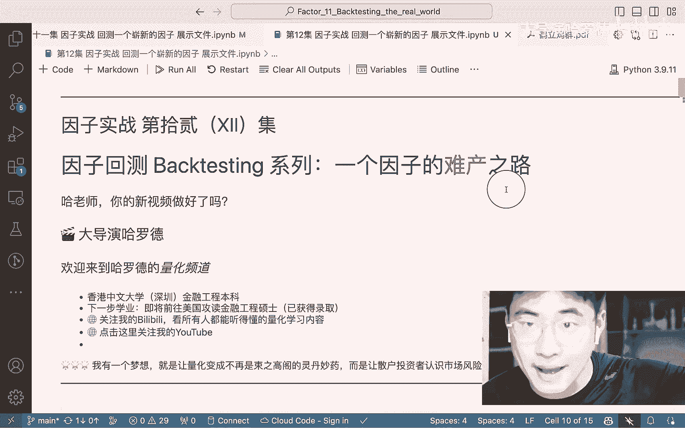

# 【因子实战12】一个因子的难产......（Python因子回测）# 开源免费量化教学 - P1 - 大导演哈罗德 - BV1Ri421y7DP

大家好，我是大导演哈罗德，欢迎回到我的量化频道，然后好久不见，然后这段时间也是非常非常感谢朋友们的支持，然后我的频道也越来越多人来找我咨询，但这也不是重点，重点是我也非常的啊，接受了大家的建议。

我们这节课我首先想告诉大家，我们要讲的是什么，我们要把整个这个新因子啊，也就是这个鹤立鸡群因子，把它的回测完全的写出来，那在这个过程之中呢，我也会跟大家分享整个在量化研究中。

你是怎么从一篇paper然后看到一个因子的啊，诞生的方式，以及我把这个名字呢应该改了，我不叫回测一个崭新的因子，我叫它一个因子的难产之路，这个过程中，我想让大家真正体会到所谓的这个多因子选股。

或者就是因子研究，这样一个这样一个所谓的就是量化选股，它其实是非常非常痛苦的，但大家也会知道，就是我们这个因子它是一个会不断的失效，并且同同时呢也是一个不断积累的过程，如果你相信这一点的话。

那你其实是可以得到一个非常好的一个嗯，所谓的一个收益，或者说一个长期的收益，因为他前期一直都是一个积累，那作为一个量化呃行业的，所有的，就是所谓的就是在这个啊门槛之外的同学，大家很多同学呢就想说。

我应该怎么样入门这个量化，我觉得如果你跟着我的量化实战系列，从头到尾的看下来，那你看到这一步的时候，我们想一想，我们已经知道怎么去回测一个因子，我们知道我们有怎么样一个数据集。

我们把它扔到我给你的那个怎么样的一个包中，你就可以回测出这个因子的有效性，那么我们这一个系列，这个小小的就是回测新因子的系列，从我们上节课开始，我们想做呢，就是如果有一篇新的论文，有一篇新的paper。

我们要怎么样把它的关键点，从这个paper中提取出来，并且完成这个因子的回测，我们还记不记得我们上节课我们做的事情，首先我们读取完了数据，我们同样的跟之前我们回测这个，第一批因子之类的。

用同样的一个因子回测的一个函数，但是我们之后我们说这篇论文的观点是什么，我们上节课讲过了，他呢是构建了一个所谓的因子吧，或者说这个因子的一个最原始的一个形态，也就是这个涨跌停的个数。

也就是说他把涨停和跌停的数量，这是一个绝对值相加除以，当天他观测到了所有的股票的数量，然后得到了一个这样的一个百分比，他得到这样的一个百分比之后，我们说这个会怎么做，那我们会发现OK涨跌停的话。

那就是说我的是close price，也就是说啊B式的时候，它的price和它的这个开始的时候的price，如果我们减再除以它的open price，如果这个嗯值它大于0。09，我们做一个0。09。

为什么，因为这个是在论文中也有写到国内呢，他对这个涨跌停是有严格要求的，你不能涨超过10%，如果而且它的有一个最低的一个，比如0。00啊，0。01也就是一角钱，你的股股价最多上涨或者下跌一角钱嘛。

你不能上涨一分钱，那就是说很多时候，他不能有一个完整的10%，但是其实9。9%其实已经是涨停，已经是他能涨停，或者是它跌停的一个最大的幅度了，已经是我们能做到最大的一个幅度，不知道大家能不能理解这个点。

那我们在这个点的方向，大家会发现哦，这个ZT什么叫什么叫涨停吗，我为什么要把它叫ZT，那涨停其实大家想想这个因子是很好构建的，那我觉得这里面想跟大家说的就是构建因子，其实就是最主要的点呢。

还是你背后的一个理论的逻辑，所以我会为什么会很建议大家很多同学去问我，就是你如我如果想升量化的硕士，我应该要选什么课呃，我觉得我想说的一点就是，你其实很多时候啊一个很重要的一个领域呢。

就是你要去做更多的这个ESIPRICING的一个研究，以及还有一个哪个领域呢，就是所谓的behavioral finance，我觉得虽然从上说到下，这两个领域算是量化构建因子中，最啊常用的两个领域了啊。

当然也会有MICHAEL的一个领域，当然我们下一集就会想做一个，就是我会做一个这个呃宏观择时的一个课件，那这个课件呢，其实也就是因为我们最开始的这个pee，pee的值。

我觉得可以说是一个s pricing的一个，因子的构建方式，那我们这节课所做的这个呢，是一个很纯粹的一个behavioral finance，因子的构建方式，那我们下节课做的一个宏观择时呢。

也就是可以说是用一个宏观经济，它对于这个股票的影响，大家想想煤炭的发电量，如果呃这个季度的高了，它会不会对我们某一些类型的股票的收益，或者说下一个月的收益，或者说这个月的收益有一定的影响。

大家想想这个问题，其实这个问题也就是，我们如何从宏观的角度去找一个因子，那根据这个煤炭的发电量，我就可以选择给这个哪些股票打分嘛，那这个打分其实在呃交易的属性上，我们呈现出来的方式呢。

就是我要买什么样的股票，如果煤炭的发电量非常高，可能我就要去重仓，比如说这个煤炭行业啊，或者是这种石油行业啊，那有可能石油行业因为你这个煤炭发电量高，但石油发电量低，巴拉巴拉巴拉，其实大家会发现。

其实这里面会有很多逻辑，那这个逻辑是不是正确的，是不是对的，那其实呢，很多时候就需要我们用这个因子的回测，用数据的方式真正的来展现出来，好的那还是希望大家能够喜欢我这种就是偏呃。

一边跟大家讲一些呃一别的知识，一边也跟大家讲我们今天的主旋律，我们的主旋律我再重复一下，我害怕就是我跑，或者大家没有跟得上，大家还记得我的主旋律，就是想把这个论文给复现出来，我把这个因子回测出来。

那我中间讲了很多别的事情呢，那也只是就是呃在这个复现论文的时候，想跟大家讲一讲一些，我对于这个量化研究或者是量化的一些感受，那还有一点我想跟大家分享，就是我在这个B站上开设了一个。

就是因为很多粉丝朋友们有很多的问题，然后呢他大家在有这个问题的时候，其实也想问我问题，那我开设了一个就是跟哈老师的初步咨询，这个呢我也觉得是B站，最近他进行了一个就是说up主的变现的呃，一个尝试吧。

然后我也跟着B站去做这些的尝试，我肯定不会去想去，比如说呃因为如果一个up主，就比如说之前我收到一个粉丝的评价，他说的我还是蛮感动，他说他在B站上真的没有见到，除我之外一个好好的教量化的一个老师了。

那我觉得其实这个背后的原因呢，是因为嗯所有的这个，比如说其他的量化领域的up主，他们的变现方式就是所谓的麦克，这个事情是我绝对是不想去做的，因为我觉得迈克他就非常非常不好的点。

就是他就取决于那我想去分享的这些课程，他就必须得是有所保留的，那这也是我当时比如说在去咨询一些留学，中介啊，或者是咨询一些啊行业中介啊，这些人的一个非常难受的点，因为我知道他会有所表达。

因为他想要把这个呃课卖给我，那所以说我看到他这一课，我就知道他一定是嗯，他肯定不会把他最想讲的东西讲给我，因为他讲给我了，那我凭什么还要买他的课，所以我一定不会去做这个麦克的这个决定，但是呢。

因为有些时候一些同学也是像我有些咨询，然后毕竟我觉得用爱发电呃，也是一个不可持续的方式，所以我现在想到的有两个点，一个呢就是我还是蛮喜欢这个包月充电，也就是虽然说他叫的这个名称。

我为什么我不是不懂他为什么叫的这么的呃，幼儿化，但是我觉得它本身本质上就是一个订阅的服务，那如果他这种订阅服务可以去，有一个我觉得还蛮持续发展，就是如果你进行一个充电，那其实也能激励我。

因为我现在发现已经有十几个人给我充电了，那这样的一个充电的形式，我觉得也会激励我呃，去做更好的这样的量化的内容给大家，并且免费的开放给大家，还有一个方面呢，就是呃我也提供了一个就是啊一个咨询。

半个小时的一个咨询的服务，那这个服务呢你也可以，如果你有一些问题想要问，我觉得你也可以用那个服务啊，就相当于是呃感受一下，就是如果我能帮到你，我们可以继续做一些别的咨询，但如果我帮到你。

我觉得你的损失也不会很大，所以那这呢就是我做的两个小小的尝试吧，但是如果粉丝朋友们有任何的建议，或者是见那个呃改进的建议的话，我觉得我都是非常非常接受的，那我们接着往下看，我们做了的下一个事情。

就是我们构建出这个涨跌停的个数，那下一个呢，我们计算出这个涨跌停的个数是多少个，然后我们去做了一个这个那个factor的一个界定，这个factor是什么呢，是这个number of stock。

Too much，也就我too much，也就涨停嘛，除以这个number of stock，那这样的话我就构建出来一个因子，这个因子呢就是说是一个日频的因子，什么叫日平的因子，现在说呃讲到这里。

大家其实应该已经懂了对吧，日频因子是每天都有一个因子值，那它也很简单，那这个因子是不是分钟频率的呢，是不是高频的呢，比如说分钟频率秒频的呢，可不可以是呢，大家想想其实可以是的。

如果我是每秒有几个股票是涨停的，怎么怎么样，其实它也可以变化成一个分钟屏，但只不过问题是什么，问题是我们这个A股一共呢，他就大家看它有几个，他有5000多只股票嘛，那5000多只呢。

如果你说每秒有几个股票涨跌停，那个数其实太少，所以说这个如果我想把它，就是说这个维度的延展，从一个时间序列上，我们现在从一个一天的一个频率，大家看一天，我才能只有一个1%的股票有涨跌停。

那如果我们把这个来搞到一个比如说秒级的，那可能这个数字就太小了，给我们意义就不大了，但是这是不是一个可能去尝试的方向呢，是的，所以这样呢，也就是我们所谓的把量化研究的，这个高频和低频就是一以贯之了。

所以这样的一个方式我觉得也是啊，我们去思考这个因子构建的，一个非常非常重要的一点好，那在这之后呢，我们来看，其实这并不是，这只是一个因子，其实如果说这个因子的话，大家想我们可以做什么样的一个选股的策略。

立马就能想到一点，就是我肯定想要知道有一些股票，它对这个涨跌停的一天，如果这一天的涨跌停很多，他会不会很敏感的，他的股票的走势会是怎么样的，那比如说我有一个A股票和B股票。

那A股票在涨跌停的股票多的那一天，他的表现就会非常非常的好，那B股票呢，他就是在涨跌停非常非常少的那一天，他的表现会非常非常好，如果是这种情况下的话，那我们发现这个因子已经可以给我们做一个。

这两个股票的一个对冲策略了，也就是说如果这个值它大于某一个值，我就重仓A股票，如果这个值呢它小于某一个值，我们就啊重仓B股票，如果这个只在某两个值中间，我们今天呢就空仓的状态。

那这是不是一个量化的策略呢，这其实也是这个策略，它到底有没有可能会有比较好的收益呢，它可能也有，但是如果我接着说，其实我觉得整个系列这个视频，我想把这个哈罗德的这个量化观点，想传递的给给大家。

其实中间很多的思维在这跟大家的对话中，其实我希望大家有所感触的，那这个思维有一个很大的问题是什么问题呢，我们说量化其实最忌讳的，或者说是最不希望的，就是individual risk对吗。

那有没有可能你光用一股票或者是呃，就是说一个股票A和一个股票B，那他们这个individual risk会非常大，那你的这个虽然说他们可能的确存在，一个比较好的一个关系，就是说和这个呃。

和涨跌停的这个指标是有关系的，那会不会因为他们个股的一些原因，这个完全就抽离开了这个所谓的这个指标的，能够啊告诉我们的这个信息的作用呢，有没有这种可能，不知道大家有没有听到我刚刚说的这句话。

其实我觉得我刚刚说这句话也说的不是特别好，但其实我的观点就是量化选股，不应该，或者说是不能够光用两只股票来进行一个选股，所以说这也就是我们在撤回那个很大的问题，就是普通人或者是来问我说你是做量化的吗。

我说是，那你能不能给我推荐一只股票，那其实这里面也就是我刚刚说的，这个也是意义观，只是下次如果有人来问你说你能不能，你也可以这么来跟他说，你说量化其实是相信是一个一个股票池子，是我可以给你推荐的。

根据我的这个因子，我推荐你这一群股票，可是你真的能买吗，或者说你能买吗，那你只能把钱交给我管，然后我来给你投资资金啊，所以他肯定会觉得哇你在骗我，你为什么不光给我推荐一只股票就好了。

你最近我一只股票我去买，我就不要给你管理费了，那他们呢可能就不太懂这个点，那其实这个点大家如果仔细思考一下，是非常非常有趣的，也就是一个很大程度上，为什么量化不能让大家去，所谓的就是在看到如果相信的人。

他就会相信，因为他相信的人，他就会把钱交给你，然后你能管理你的量化基金，不相信人，他会觉得如果你量化，你是不是推荐给我一个股票，像那些主观研究一样，他们这个推票退票，所谓就是推股票嘛。

退票的这个啊更加的有一种直观的感受，那我作为一个行业研究，食品饮料行业研究，我今天就推了桃李面包，然后那桃李面包过了三个月突然涨了，飞起来了，或者是跌的飞起来，那我直接就对这个呃主主观的经理啊。

或者研究员有了一个很好的判断，可是量化的不一样，我给你推的这个因子，这个因子的有效性，你其实不一定会去跟踪的，或者你也不一定会去拆解的，当然这个其实都是题外话，但我也相信这些题外话。

其实也在我们今天的这个呃，回测一个崭新的因子的范围之内，为什么呢，因为其实我们今天想要给大家得到了一个知识，得到了一个技能，其实还是非常非常实用的，这个技能就能让大家去在量化实习，找到一个量化实习。

因为你相信我，99%的你的第一份量化实习，就是在做我今天做的事情，可能你的平台不一样，可能你做的数据不一样，你可能做的不一定是股票，你可能做的是别的东西，但是99%，你做的事情就是在复现一篇论文。

但在复现一篇论文的时候，你的leader想要看到你身上的品质是什么呢，呃是第一是很细心的，你能把一个事情，你能把一个论文中写到的一个观点，给它复现出来，还有一点我觉得一个leader也非常看重的。

就是你能不能用你的统计学的观念，一个fundamentally的一个基础的，一个统计学的观念来佐证你的所有观点，我觉得这些反而比我等一下会给大家展示的，这个一个因子的难产之路。

这个因子是怎么从就是出来的，我为什么要啊，Anyway，就是比那个反而要更有效哦，效果大家只是在仔细想想，我的重点是在于，也就是说我们现在有了这个每天涨跌停，股票的比例，OK12月29号。

2023年12月29号是1%，1。5%，1。8%，OK下一步我要干嘛，我刚刚讲了一种可能性，就是所谓的我有A股票和B股票，但是我把它否决了，因为这不是我们量化型我想要做的事情，所以这个时候你会发现。

其实这也是为什么就是所谓的量化研究论文，为什么你要积累经验，你不积累经验，然后你不去多思考的话，你最开始你想出来的各种观点，是很难达到一个能够使用的范围的，那我们来接着往下看这个论文。

也就是我们刚刚上节课提到了这一点，那我们先来看这个论文是做的什么，这个论文在计算出来这个涨跌停的proportion of，他叫ALH，那意思就跟我们说，就说涨跌停的比例，它计算出来之后。

所以你看学英语真的很重要，对吧啊，不提这个了，下一个呢他做了一个贝塔，那这个贝塔其实是个2。2才是啊，这个论文真正想得到的因子，那其实你看很多论文，你都会看到这些奇奇怪怪的。

这好多好多英文我应该怎么去看它，其实这几个公式才是最重要的，但是呢我也相信你要是真的喜欢，你，要真的想去学量化研究，我真的真的真的，我甚至有点想求你好好把这篇论文看完，我认为她写的特别漂亮。

她漂亮的点是在于，它真的是从一个行为金融学的一个视角，你先不谈这个因子到底有没有用，但它写的非常的清晰，而且它呢又结合到了这个farmer french，这种偏sm pricing的一个领域。

然后又用到了一个回归分析，这些都是你在回测其他论文，或者说是其他的一些东西里面可能会用得到的，并且它甚至是一个包含的关系，就是很多的论文，它的因子的构建方式其实是偏简单的，我可以说就是它更多的。

比如说像是均线怎么怎么样，那其实就是用一个stock price或者，stock change的这个moving average，然后来把它构建出来一个因子，或者说是这个交易量啊之类的。

但其实他们的维度还是比较低的，而且他们呢更多的就是所谓的这个量价数据，甚至他们有点就是所谓的technical analysis对吗，他们是技术分析，而当然技术分析背后有他的si pricing。

或者是有它的behavior finance的一个原理，但是这篇论文可以说是它是直接从一个啊，behavioral finance的角度出发，然后从这个角度给大家发现了这个呃，应该是如何。

这个论这个因子的有效性的原理是什么样子的，这个我上一节课也讲过，如果大家嗯记不太清楚，也可以仔细看一下我上一节课讲的关于这个呃，这个叫什么attention catching的一个点。

那如果我现在因为大家有可能脚会比较麻烦，我现在简单的跟大家讲一下，就是人的精力是有限的，那市场涨跌停，如果呃一个股票涨停停了，或者一个股票跌停，大家的是呃attention。

或者说精力全部都被吸引到那股票上了对吗，这是他的一个逻辑，人的精力又是有限的，精力又全被吸引到这个上面的，那溢出效应是什么意思，也就是我我的精力吸引到这个股票上面，我与此同时。

我会关注跟这个股票有强相关的一些呃股票，比如说伊利涨停了，那我可能立马就想哎蒙牛今天怎么样，就是这种感受就叫做涨跌停的溢出效应，那这是作者观察到的一些现象，并且他是对于从一个BEHABU反弹。

从人人是不会变的，人性是不会变的，这几个现象就是呃市场在变化几百年，我觉得这三个现象都很难改变，除非就是说information highly efficient。

那大家其实可以观测到所有市场的所有举动，但如果这三点存在的现象的话，那这个作者首先我们刚刚说了，它计算出来了每天涨跌停的一个比例，接下来还构建了，接下来接下来他构建了一个这样的一个回归，什么回归呢。

大家看一下，To determine，Which stocks are sensitive to daily price，Limit in each month t。

We estimate the price，Limit beta of individual stock with the following regression。

OK意思就是说呢他想要去观察哪些股票，对这个每天的涨跌停的比例更敏感，他就去把这个R，也就是说这个股票，这个股票I的这个股票I的一个monthly的daily return。

这是一个daily return，它等于一个这是一个平均值，所以你看统计学真的很重要，regression as真的很重要。

虽然说现在啊machine learning的那种neural network的，或者是pattern recognition的呃，这种东西越来越多了。

但是这种fundamental的这种regression as，我认为还是我们不得不去掌握的一个东西，它是所有的，我觉得后续的一些呃machine learning的一个基础。

那他第一个这个球的回归的是什么呢，是这个涨跌停的因子，也就是说，我刚刚求的这个每一天都有一个值的因子，第二个和第三个和第四个和第五个是什么，是farmer french3因子五世界联通了，还记不记得。

我最开始跟大家讲这个FARMFRENCH3因子，那个应该是因子实战五，我当时为什么要讲这个FMFRENCH3因子，我其实更主要的是想讲，它跟我们的一个因子的一个区别，这个我认为它是有两种。

一个呃因子的一个three factor，他们的这种factor呢更多的是啊，所谓的就是是从股票得到的一个factor，那这个factor的值可以作为一个所谓的，我们去选股的一个策略。

但它更多的是我们做一个pricing的策略，所以说我们叫它ess pricing的领域嘛，但不不管怎么样，这个three factor这个farmer french。

three factor是你可以在啊，所有的这个数据库上下到的，也就是说我每天的这个值，这个值是有的，OK那我们来看一下，我们接下来想要做的这个事情。

也就是说大家看OK这是pfolio one two three four，这是怎么怎么怎么样，我们先不看这个，那也就是说我现在很清晰了，我现在要做的事情呢。

就是说我要把我的everyday return of the stock，Was the stock，the daily return和我的涨跌停因子，和我的market和我的SMB。

和我的hm ml和我的这个来做一个回归分析，然后我真正想看的，也就是我最想要的一个因子是什么，这里大家可以暂停，或者说仔细思考一下，大家想想那个因子也就是我我要一以贯之嘛，所以因子要每个股票每个月读吧。

有一个值，大家知道这个回归分析我要传进去一个vector，我要传进去一个，比如说不能为光传一个，只做一个回归分析，当然也是可以的，但是重点是这样就不准确。

所以说大家看他上面说的就是说啊each month，We estimate individual stop，那意思就是说他要用一个monthly的一个，做一个regression。

return的这个analysis，那他这样的做一个each month的话，哪个值在每个月每个股票才会有一个值，并且这个值是我们关心的呢，我不知道大家知不知道，但我希望大家是能猜到的，或者不是猜到。

应该是自然而然的跟我说啊，一起能够想到的，那就是这个贝塔，大家想这个本身这个回归分析这个过程，它能让我们得到什么，或者说是知道什么，也就是说他能知道我们对这个啊，所谓的这个涨跌停，或者叫做对这个呃。

对这个价格的溢出效应的这个涨跌停，溢出效应的敏感度，那这个贝塔值越大，也就代表了这支股票，它对于这个涨跌停的这个比例，对它的股票的收益的解释性更大，那我们相信就是说这个解释性更大，证明了什么。

大家看就是说它下面proportion of stock with，Extreme daily return in price limited beta decline，他把他做了几个PFOLIO。

然后呢再把它一个进行了一个，就是这个排序，大家看一下这个figure它讲的是什么，它是proportion of stock with extremely raw return panel shows。

The proportions of stock with，Tremely delivery returns in each price。

Limit uh beta decays and panel b shows，The proportion of stock with extremely date。

Real return in each apl beta decay，Our sample period is from july a january two。

Thousand and six to december two，Thousand and twenty，所以在这样的一个基础下，我们就会发现，那我们现在要去做的事情，就是要把这个回归分析给写出来。

其实嗯可能就是对于我而言，就是如果我去给大家看代码，大家会觉得哇好帅啊，就是在这个代码，但其实今天大家会发现我花了更多的精力，用嘴皮子上给大家讲，这个因子的回测的一个方法。

那我会认为其实这个呢也是同样最重要的，为什么是这样的呢，因为你真正的也只有理解了这个原理，其实我们之前讲的所有课，已经给了我们足够的能力，去把这个啊，去把这个所谓的就是因子回测给做出来了。

为什么我要这么说呢，大家想一想，我们其实今天会做的是什么，我们今天因为其实啊，我不想去把它整个的都跑出来，因为跑出来的话会非常非常慢，我之前在这节课之前也把它跑出来了哦，还有一件事情。

就是大家经常会说就是没有这个text file，但这个file因为是太大，如果大家想要的话，也可以在后台私信我，但我觉得我应该是放到那个百度云的链接上，如果大家可以去看一下，看看在不在那里。

Anyway，那我们这个呢是上节课讲过的东西，然后这个呢这个就是我下面想要做的东西，做的是什么事呢，首先大家看上面这一点，就是我们刚刚已经从我们上一集11集看到了，我们算了一下每天的涨跌停的一个个数。

那下面一个呢就是我用的一个farmer french，三因子，大家看这三因子是什么，也就是说啊AAP哦，我把他combine成了一个四因子，也就是说三因子分别呢就是risk premier。

也就是那个market premiere的那个因子，market risk的那个因子，然后呢使用SMB和HML，我们用第四个因子是因为什么，因为我没有找到它，但是这个也能给大家一个tip。

就是你在回测因子，或者是做很多论文的复现的时候，你并不一定能百分之百把所有的数据都找到，你也不能说是把所有的数据都找到了，再去开始做这个复习，那你能找到这个数据，大家想如果我去做这个因子回测。

我用了四个这个指标和用了四五个指标，这里面的解释性的差异，其实因为我最开始最后是想要看这个APL的，这个beta的，那他们之间会不会有什么很大的差距，或者说可能他们差距很小，可以忽略不计，我也不知道。

但是我现在呢就是选择我用这样的一个方式，那也有可能这样的方式，甚至比他原来的文章里做的要更好，那也说不好呢，在我们做了这样的一个reorder之后呢，接下来我就要写这个回归分析了，写这个回归分析。

我觉得我下节课如果大家这个需求非常强烈，大家也可以在评论区上给我写，就说啊哈老师，我想要去看你写这个回归分析的整个过程，但我会认为这个回归分析，其实写起来还是蛮简单的。

我给大家整个WALKTHROUGH一下，这个回归分析的啊，写的方式吧，首先大家知道用的那个package呢，肯定就是这个啊statistic model啊。

就是这里面有一些啊rolling or honalist啊，list square嘛，就是那个回归分析的包，那我真正想做的回归分析其实还是蛮简单的，首先Y是什么。

是这个stock的一个daily return，而且我想去把他的所有daily return，我把stock每个stock做一个便利嘛，然后把它储存在所有的result里。

那X呢就是呃这四个啊所谓的这个因子的值，然后我去把它全部都改成一个NUMERO的，也就是数值的方式，供我后面去做这个所谓的回归分析，那我想要去，那大家知道我是每个月每个月需要做的吗。

那首先我要做一个start date和end date，也就是说我要有一个开始时间和结束时间，那开始时间和结束时间我得到了之后，我们在每一个呃trading day fate。

这个filter呢是monthly training day，也就是说我这个每一个便利的呢，就是每一个比如说每个月的最后一日，如果大家有点不懂的话，我还可以把这个给大家打出来看一下。

他们就是OK是std和ENERDAY，也就是说每个月的第一个交易日，和每个月的最后一个交易日，那我要做的呢就是把它的中间，把每个月的开始的交易日和结束的交易日，给它提取出来，把它提取出来之后呢。

我能做的就是在这样的一个数据中间，首先我要确认它们的长度是一样的，并且是大于零的，那大家看后面这个就是首先你要hand in，就是处理一下缺失值，然后呢就开始做这个回归分析，做完这个回归分析。

我要要的呢就是parameter的哪一个值呢，大家看啊，哦我应该是把所有的parameter都把它取出来了，因为和未尝不能，没准还可以试试其他的这个回归值会不会好用，那其实这已经结束了啊。

我觉得懂的人肯定懂了，不懂的人可能还是一头雾水，没有很懂我的这整个的编程的一个逻辑，但这个逻辑我相信大家呃应该还是稍有了解，但是我今天这堂课，可能暂时不想要去，把这个回归分析给大家写出来呃。

由于时间的原因，我不想把这个视视频录那么两个小时长对吧，那有可能如果大家需求非常强烈的话，下个呃节课可以帮大家啊，手动的把这个呃回归的这个代码写出来，But anyway，我们来看一下最终结果。

我们最终结果呢就是每个股票，其实昨晚我也不知道为什么这个东西跑了，还有80分钟，那可能是我觉得是啊，130分钟跟可能是我哪里写的，稍微有点问题，但是不管怎么样，大家会发现，其实呃我如果给大家看一下。

这个这个这个这个值的话，大家看，比如说首先这个低股票，那他呢就是啊有一个这样的一个risk premium，以及这个这个SMB它每一个这个值，那大家看这个值APL的这个呃。

所谓的他的就是叫什么叫parameter，叫他的中文叫什么，等一下它的系数，它的系数是这个值，也就是这个系数，也就是我想要去得到的一个最后的结果，所以我在后面用了，我把这个APL提取出来。

用了一个on stack transpose，然后大家会发现这个东西长得跟谁很像呢，他长得就跟我们最开始用的第一批因子，如果大家去看一下因子，实战七异性十三八，他们长的其实是一样的。

意思就是说我相当于我用了一个崭新的因子，那接下来一步大家应该就非常熟悉了，我要做的事情呢就只是把我的啊，因子，分成五列，但是的确是这样的，并且我也是要把它丢进。

我之前花很多很多节课写好的一个package里，那我丢掉了这个写好的package里，之后呢，我可以看看他的rank c，看到C然后呢把它的group turn给打印出来，然后把它画出来。

但会发现其实这个因子的表现，至少说我回测出来的这个结果并不是很好，它的group for也就是说这个最大的这个值，它的这个收益是最小的，这是可以接受的。

但是呢他这个group zero的收益也并没有很好，反而是在中间的这个值，也就是group to更最好的一个收益，那这个东西是不是反常识的，或者说是它是不是呃不对的呢，我们先不去做这样一个结论。

但有没有可能是我没有去把它这样的一个呃，系数取一个绝对值，我也没有把它取绝对值，我应该是取绝对值了呃，我得到了一个stack，好像没有诶，因为这个因子是按理讲应该全部都是anyway，我想给大家看一下。

试一下这个会不会给大家有一定的这个呃，有一定的感受，因为这是我昨天真正跑完的那个程序嘛，那因为大家会发现我是没有取绝对值的，那我想先试一下去把它呃，应该这个还是能跑出来的。

OK那我想把它去取一个绝对值呃，你大，而且我想给大家展示一下，因为我其实现在也不是特别，应该是可以直接用这个呃，我看一下an absolute，我不需要把它这样，我只需要取一个这个嗯。

我看一下这个东西打出来会是什么东西，OK很明显它打出来就是一个取完绝对值的东西，那我去看一下这个东西，取了绝对值等于这个东西，OK然后我去把它给跑一下，rank c和C的值。

看看会不会有什么不一样的结果，呃这应该不会出问题吧，OK没有出问题，那我们来看一下它的i c min和i c win ratio，好像也不是非常高，但我们来再打印一下这个这个结果，会不会这样的话。

就可以是group zero哦，大家看如果是这样的话，他这个反而这个解释性会更好一点，这个group zero呢就是在一个最上面，group1呢就在第二，然后group2呢在第三，这也是合理的，为什么。

因为这个对这个所谓的涨跌停的敏感度越高，这个绝对值应该是把它删掉了，因为你不管是正数啊，应该应该是绝对值，才能体现他对这个涨跌停的敏感性更高，如果我对涨跌停敏感性高杆，根据论文里的这个说法。

就是他会有一个这个overpricing的一个倾向，那从长期来看也符合了我们的直觉，就是你这个敏感度越高，你的长期的收益就会越低，那其实这样看出来的话，大家会发现哦，这个因子其实长期的表现。

至少对我们选股，如果我们做一个对冲的话，它其实还是蛮好的，并且这个东西它是纯粹从behavioral finance中，提取出来的，和之前的因子相关性，我相信也是很低的。

那不管这个东西真正有没有帮你赚到钱，我认为它至少是一个你从量化研究的一个起点，我希望大家就是呃叫什么，走过路过，不要错过，你可能一直在等，等待一个因子给你回撤，等待一个实习呃，我说我开始实习。

我才会回回测一个因子，因为这个当然不是你的作业，所以你的动力可能也没有那么强，但我真的还是希望大家，因为我之后会把我所有的代码和数据，发到那个网上，会发到我的get up，或者是发到我的公众号的后台。

能不能你就真正把我说，这个数据我都不需要你去找了，你就把它下下来，然后一点一点的尝试把这个论文先好好读好，然后看一看我到底在做的事情是什么，你会发现其实你看起来很长，其实你读前多少页就可以了。

那读完之后你会发现，其实你就完完整整的回收了一个因子，并且回测了一个蛮能学到东西的因子，那回测了这个因子之后呢，你在之后的一个不管你有没有实习，并且你做不做这个呃相关的研究，你都会对这个因子回测。

我认为有一个质的一个飞跃的理解，那其实到这为止，我们这一个因子的难产之路哈就已经结束了，我们接下来下一期视频我想给大家去看一下，就是宏观的，更多的就是择时，宏观指标则是因为我之前做了一期择时。

大家对这个还是很感兴趣，当然谁不能因为大家每次买股票的时候，都想说，我能不能通过一些指标来看一看，现在这个股票是不是一个很好的入场时机，现在A股能买吗，就像我们当时说的，但这期视频其实基本上算是完成了。

我整个的一个因子回测系列，我们从头开始搭建了整个的因子，回测的一个package，然后呢我们又去把这个因子首，最开始我是演示的因子，我就只是随便的一个因子，然后现在呢我们到了一个崭新的因子。

我们就把它做了一个回测，之后呢，我想在这个系列的基础上，可能会定期的去给大家一起看一篇论文，然后跟大家一起去回测一个因子，但在这个过程中，我可能更加的会去关注整个代码的实施啊。

而今这今天这节课我对代码的要求就没有很高，我就没有说跟大家说，OK这个代码应该怎么写，而更多的我关注的点是在于，这个逻辑应该是什么样的好，那这期内容呢就先到这里，然后喜欢我的视频的小伙伴们。

也欢迎大家点赞订阅收藏，然后如果可以给我充个电，当然就更好了，当然不充也其实也没关系吧，但是然后如果大家有任何的问题，可以到后台私信我，或者去跟我预约一个半个小时的咨询，呃。

我觉得我尽可能的会去用我的经验，或者说我的能力去尽可能帮助到大家，然后呃除此之外呢，所有的视频的所有的文件也都会大家免费的啊，能够获得到，然后这个整个的一个呃所谓的这个因子的实战，或者是因子的测试之路。

我觉得还在继续，并且每次我可能会觉得嗯，经常会受到一些呃鼓励，当然也会受到一些质疑，也会受到一些自己的鼓励和自己的质疑，那在整个的过程中，我想跟大家说的最后的一句话就是啊。

希望大家能够真正的去做一件事情，就认真的把它做好，我相信最后呃你是可以有机会，或者说是可以得到一个你想要的一个机会的，好，我是大导演哈罗德，我们下期再见。

