# 【因子实战13】摸摸暖气片买煤炭--宏观择时 #开源免费量化教学 - P1 - 大导演哈罗德 - BV1gw4m1Y7Mi

大家好，我是大导演哈罗德，欢迎回到我的量化频道，这是因子实战系列的第13集，然后距离我做的第12集，也就是我完整的实现了啊，一个因子的回测，Back testing，这个回测框架已经有了差不多两个月了。

那为什么中间会有这么长的时间呢，嗯当然原因是多种的，但是最主要的原因呢是因为我在啊实习呃，因为我实际是下私募，我发现就是说啊不太像以前那样，可以随便的跟大家讲，我在干嘛干嘛干嘛。

但总之呢我是在做一个高频交易，然后在做高频交易的一些嗯策略的开发，我觉得还是很有意思的，虽然说也非常的有挑战性，还有一点呢就是我们项目啊，也就是我即将去就读的，卡耐基梅隆大学的MICF这个项目。

他其实已经开学了啊，而且他开学开的非常的彻底，就是他不是说啊，只是给一些serious lectures1些讲座，让你听听，他其实是权限开始了啊，具体的我也不展开来讲，但总而言之的话。

我也觉得嗯北美衡水嘛，然后也觉得也是实至名归，并且这个学校也的确是整个的这个配套，我觉得他在量化北美就是量化找工这个行业，我觉得这个方向还是很好的，然后呢如果有对啊这个学校这个项目感兴趣的。

对这些很多事情啊，或者说美国的量化行业感兴趣的，我觉得都欢迎大家去啊预约一个我的这个呃，咨询好讲这么多，我们现在来看我们的第13集，其实这一集并没有特别特别多的嗯，原因为什么要突然插上来。

这一集就像是我在第八集还是第七集，其实我都已经记不得了，哼当时突然就想到了一个择时呃，讲完择时是很多人就觉得哇嗯好有意思，为什么他们觉得很有意思呢，因为这个是跟更多的普通人息息相关的，这么说。

为什么这么说呢，因为大家都是想知道什么时候去买一个股票嘛，那现在该买吗，还是说我应该等十天买，这个是每个人都能够从中获益的，那当时我们那个择时呢是用的是相当于，如果这一集叫宏观择时，那一集就叫微观择时。

我们有股票本身的一个属性，或者叫基本面择时呃，PBPE呃，这个市盈率市净率我们根据他的那个市盈率，市净率的这个值的高与低来判断，OK这个股票它是这个这个PBP太高了，那可能接下来就会跌啊，多的话。

然后我们用这种方式来进行一个择时，然后我们用一个算法，或者说我们用一个策略啊，把它呃实现出来，然后看看这个策略的表现，他的胜率呃，我们当时没有讨论盈亏比，但是就是基本上就是他的胜率。

以及它回测区间内的表现是如何的，那今天我们想讨论一个宏观择时这个话题，其实更有探讨的价值，为什么这么说呢，因为宏观则石的应用面更广，如果大家同时做一个微观则时，宏观则时的案例呃，项目的话呃。

也就是比如说你跟着我这个代码去复现一下，你会发现宏观则使你用系列的因子，就是相当于是一个vector，一个一乘N的一个因子，你其实可以做N乘N的一个测试，为什么，因为宏观对所有的股票都是一样的啊。

这个恒大和碧桂园他们俩有不同的PB和PE，那你就相当于要计算一下这个因子值，然后再去做一个测试，可是如果你根据宏观的这个一些数据，来给他们做择时，你就不需要去计算两种数据。

你甚至就可以在同一个基准上去对比，每一个宏观子呃，因子对每一个股票的表现预测能力怎么样啊，然后效果怎么样啊，我觉得这个呢也是一个非常啊非常有意思的点。

那接下来我们来先，首先要看一下这个宏观数据长什么样啊，首先这个呢是我们说宏观择时，那首先有一个标的物额，刚刚我说的恒大碧桂园这种股票就是个标的物，那今天呢我们想尝试的呢就是两个标的物。

一个标的物呢是指数呃，中证300啊，中证500，然后什么什么沪深300之类的哦，我们先不管它，那呃还有一个标的物呢，就是行业的标的物，也就是说它是index code，一个呢是如果说哦这个是打不开的呃。

但是等下我们就会看到啊，标的物，首先我们先明确了，我们做因子呃，实战的话有两个很重要的，就是我们在哪个标的物上做这个择时，还有一个呢就是我们根据什么数据来做测试，也就是这个因子是怎么生成的。

那今天我就给大家看一下。

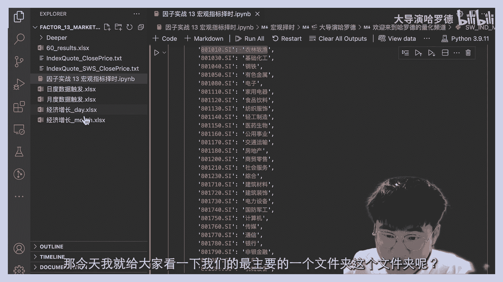

我们的最主要的一个文件夹，这个文件夹呢就是我们说的这个宏观因子，然后我我稍微给大家看一下这里面是什么东西，大家就会发现哦，哦原来如此，这个呢是新出口订单啊，我为什么会找这些数据。

是因为有一些之前有些研报，我参考了一些研报，一些研报说这些东西有效果，有效果的点在什么地方呢，如果我用大白话来解释一下，也很简单。

就是大家看这之间有个发电量，那一个很简单的解释，并且大家也会觉得make a lot of sense，就是我们这里学院行业有这个钢铁行业，有这个应该还有电力设备啊，然后一些呃通信设备啊没有发电嘛。

在传统的是32个行业，或者说煤炭行业啊之类的哦。

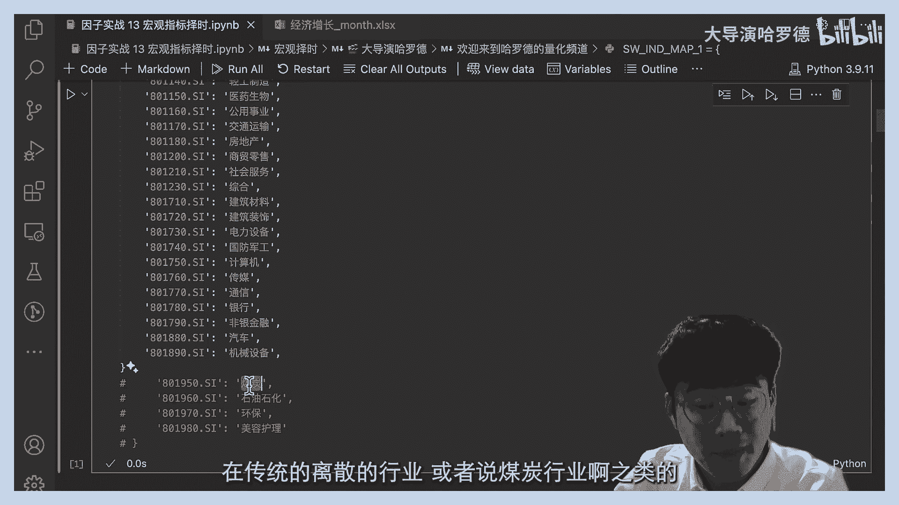

为什么我会呃我要说这个，那大家想这个呢是一个月读的数据，从11年一直到23年的5月，然后我们看到我们现在有这个发电量，也就是说发电量每个月的一个发电量吧，虽然说我也其实不是学电专业的。

我不懂这个为什么是3000多，4000多之类的，而且他怎么算的，这是从万德上下载的数据，但是怎么算的，我也不得而知，我也不关心一个很简单的intuition，或者说一个很简单的一个直觉的想法。

就像是我们当时BPBP一直觉，或者说我当时一直讲的，我的老观众可能知道老板情人啊，不是老板情人影子，是老板孩子影子呃，但是也差不多嘛，就是说你要有一个故事，并且这个故事是有一定的理论的一个支持的。

然后这个支持只要他是呃符合直觉，并且他是人性的一部分，他就不会变，至少我们做计量化的是希望是如此的，然然后并且我们可以啊，看到这个市场的有效性和这个市场的不完整性，好，那说了这么多。

我想表达的意思是什么呢，就是我这里的故事，就是我认为这个每个月的发电量。

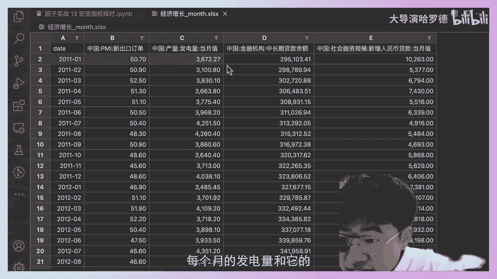

和它的一个行业的下个月的，或者说是这个月的，或者说是嗯一个收入return嘛，就是涨跌幅啊，收入啊是有关系的，是有相关性的，也很简单，就是大家知道就是像煤炭这种行业，我们叫它红利行业。

或者说还有一点的会叫，觉得他就是一个周期行业，为什么就是简单的逻辑，就是呃一个老太太之前有个故事，我也给他讲一下，今天有些同学可能也听过一个老太太，他这尤其是这在这段时间，可能其他行业跌的比较惨的时候。

大家就会觉得哦煤炭呃，有一个老太太她怎么买股票呢，她就是说自己家的暖气片，如果说她摸摸热了，她就去买点煤炭的股票啊，冷了就把它卖一下，或者就是持有一下，不不去加仓，那我为什么要说这个意思。

就是说这里面也是一个直觉。

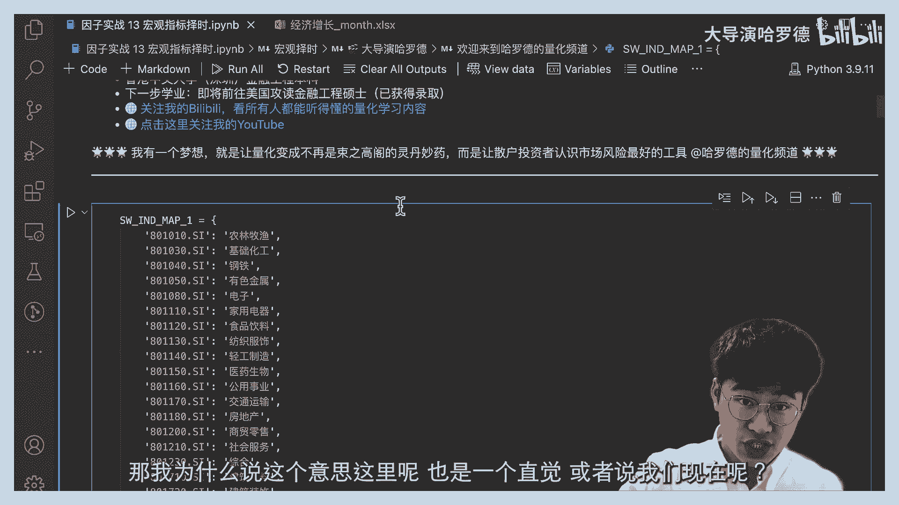

或者说我们现在呢就要用量化的手段，验证这个直觉，没准这个发电量它一多或者一低，发电量多，有两种可能性嘛，一种就是他供求关系的话，他的这个供给就更多了，供给多了也有可能证明就是发电量多。

证明这个制造业兴旺，要不然的话这个因为它是根据这个需求来的嘛，如果说这个嗯需要的电就很少，那可能这个月的发电量就会很少。

所以如果发电量很多，我们会认为我觉得这个钢铁行业啊，或者说是一些有色金属行业啊，或者说是交通运输行业，或者就是这些建筑业，或者是用到电的行业就会接下来就会涨，同样的道理大家也可以看。

就是这个中长期的一个贷款余额，这里面其实就是一个啊，如果谁学过宏观经济学，就是非常有用的一个点了，而这里我也想说，的确，宏观经济学在很多程度上，在做量化里面都是一个很重要的事情，在宏观层面上的量化。

就说宏观和量化是不分家的，那其实它是一个非常非常，我认为是一个非常非常有意义的点，并且它其实是让你可以脱离出一些单独股票，有可能股票本身就是乐色对吧，但是整个的这个宏观啊，这个行情也好啊。

或者说是宏观的这个影响还好，永远是在这里的，并且呢就说中国的股市，它对政策的影响也是比较大的，所以我觉得用同样的逻辑，大家也可以思考到哦，为什么我会有这么四个指标，也可以分享额贷款余额嘛。

就是也可以看到这个市场上的这个，投资的活跃度啊，资金的活跃度啊，也就可以P逆出额融资啊的一个嗯，一个一个社会对融资的一个兴趣，也就可以看出这个行业的一个增长，新出口订单。

也可以看出我们去这个出口出口如果好的话。

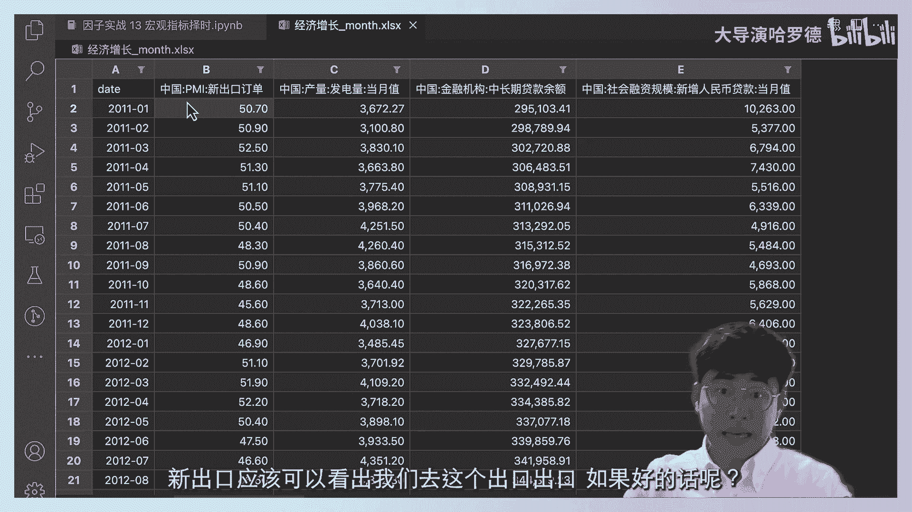

那可能就是某些行业，比如说呃制造业啊，比如说一些家用电器行业啊，他就会做得好，OK我说了这么多，那可能还是讲多了，因为可能还是代码来的，大家会比较的呃清晰一点，那还有一个是daily的一个数据。

就是我们的这个国债国债利差，这个呃也是一个可以展开讲很多的，但总而言之就是说呃10年期国债和印一一个月，就短期国债，他们中间是有利差的，并且这个利差是代表了一个呃，可以说是一个融资的一个信心吧。

呃如果说10年后，如果大家觉得啊这个钱我不想去投资，那可能10年后的这个利利，利率应该是要低一点的，但如果大家就是投资的非常活跃。

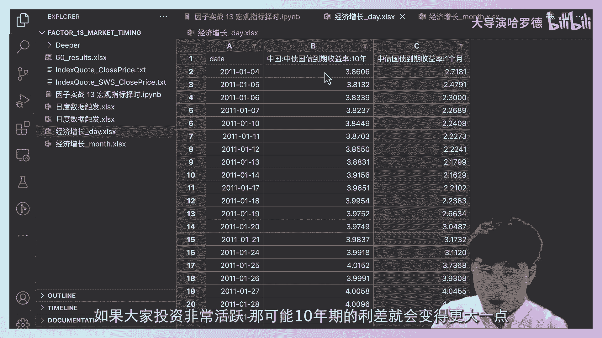

那可能10年期的股额利差就会变得更大一点，那说完这么多的话，那我们就来先先把数据读出来嘛，那我们接着往下看，首先呃好久没有讲课了，但是也希望大家没有好久没有听课啊，大家会听到这个的时候也是感觉哦。

这都跟以前是很像的，那我做的事情是什么呢，很简单的一个事情，就是我把啧这个两个这个数据呃读出来，虽然说我不知道为什么他读这么慢，可能这个kernel呃读起来会有点慢哦，读好了。

那接下来呢就是一个df day，然后这里呢给大家推荐一个这个叫data regular，data regular这个插件，我觉得还蛮有意思的，因为他其实可以给大家一个蛮蛮蛮直观的，一个认识。

就是哦这个数据长什么样，大家可以看到哦，蛮这个蛮这个这个叫什么，这叫这个分布的，就是are normal distribution吗，就是标准标准标准分布的，我现在确就是中文都有点烫嘴。

之前我还被人训过，但是也不能完全怪我，因为这个本身它就是normal distribution的，大家还会怎么去叫它标准分布吗，但是呃大家也可以看到，OK这里面就是大家可以看到这个哦。

这就是每一个时间对应的一个每一个值啊，然后对应每一个值有怎么怎么怎么样，OK那这样的话我们再去看一下这个，我们我们接下来想要去做的点，就是我说的一个呃一个利差嘛，那利差就是你要去把10年期的利差减掉。

一个一个月的利差啊，这就是我的一个值，然后之后我要去set index，set index的好处是什么，就是之后我可能呃读取信息的时候，因为呃我还是跟大家说过，之前就是说你在处理数据的时候。

你一定要统一，你可以不set index，那你不set index的话，它的所有的index就是零到N让你调用的时候，你就要用零到N就不能说小于等于一个时间，大于等于一个时间。

但如果你set index，你也不能说呃，括号一其实你还是可以的，应该就上来，第二第一个他应该还是支持的，所以相当于是你如果set index的话，你可以更多的有一个从时间维度上选取，自己需要的数据。

所以我觉得是还蛮好的事情的，然后我们接着往下读一下，OK那我们看一下这个10年利差的一个分布吧。

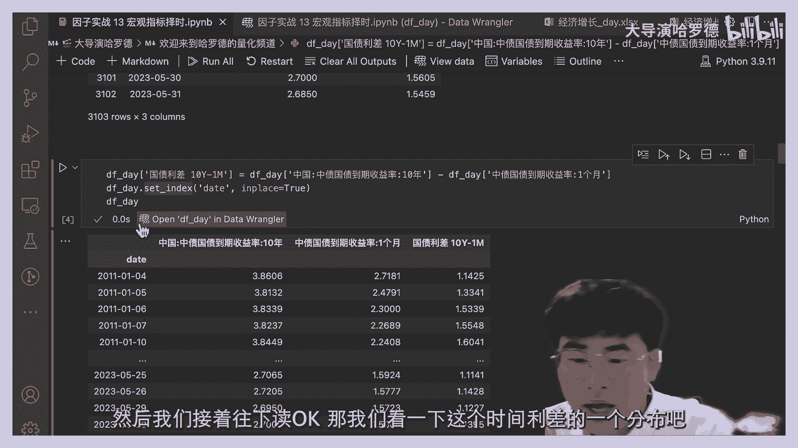

大家会发现OK，那这个10年利差的一个分布是怎么样的呢，我们去看一下哦，我们点他这边就写了啊，一共3000多个呃，两两这个不管它，然后standard deviation，然后mean其实还是蛮标准。

那个那个虽然说他应该是min是一，然后说sandard division是0。5左右，然后minimum，然后这个maximum medium maximum，大家会发现哦。

其实有些时候这个短期利率竟然会啊，长期利率竟然会小于一个短期利率，Which is pretty amazing，这因为它取决于供需关系，那我刚刚其实讲了一个逻辑，其实我甚至都以为我讲错了。

但是不管怎么样，其实大家可以看到，就是我相信大部分看我的观众，其实听到现在为止，很多的这个概念大家是知道的，尤其是这个利率的一个差距啊，或者说是一个呃这样的一个差值，大家都是听过的。

可是嗯真正用过的同学可能并不是很多，并且有一个很直观很直观的，为什么一些宏观经济学家那么厉害，我个人认为有一个点，就是他们对这些东西已经了如指掌了，就是他们是顺手掏出来就可以用的。

那这一点我觉得我们也是要像这样，就是你能有一个非常好的一个解释性。

也是我觉得在做量化，一个非常重要的一个事情吧，好我们得到一个呃，那个日日评的数据，我们再来看一个呃阅读的数据，如果我们还是想看一下的话，虽然说我这打开的有点多，但是我的电脑还是能支持住的。

然后我们就可以看到，OK那它就是这么样一些东西，然后其实你看这个其实他们都挺不normal distribution的，但是但也看不太出来，因为你看他这个distribution。

有点像那个那个那个那个那个叫贝塔，还是叫什么skill，就是它是最小的，这个值多一点，然后那个最大的值量少一点，但是嗯不管怎么样，就是我们这个为什么点两下它不出来呢。

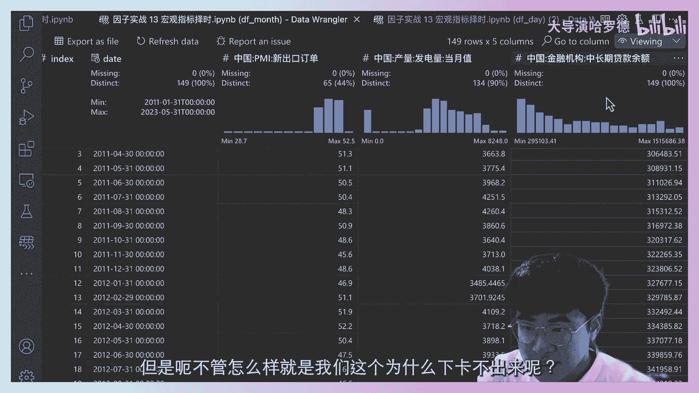

啊不管他了，反正我们就哦有一个general understanding of the data，那我们有了一个df model之后，我们同样做一个处理，就是把它set一下index。

用这个数额日期来set index，OK接下来就到了，其实下面就只有一个idea，然后就写这么多代码，那我要怎么样，用什么样的形式来把这个idea给大家讲出来呢，很简单，其实就是我现在哎呀。

额我现在要择时，我现在要择时，也就意味着我现在需要这个数据嘛，这个数据有了，然后我们先理一下，理一下，感觉有点乱了，因为讲的东西有点多，标的物是什么，我刚刚说了，就是那个我的数据里面有的是呃指数。

分为这个行业指数，和宽基指数，什么是行业指数，什么是宽基指数，那啊行业指数呢就是那些行业的指数，宽基指数指的就是沪深300，我应该我我如果没记错的话，应该是应该是中证300，中证500。

还有一个中这一个应该是中证300，这应该中证500，这个是什么东西啊，嗯我不是很记得了，如果我从一个结果导向的话，我去看看他应该是呃，没有看到哦，创业板指数哦，创业板哦，还有一个是创业板指数。

那依旧是有一个中证300，中证500和一个创业板，那我们接着往下来看，我们其实有点剧透了，但是大家应该不会介意的，我们有了这个标的物，然后我们的因子嘛，因子宣战到现在我就不说了啊，再说因子是什么东西。

如果大家不知道这个可以去从头开始看一遍，我认为啊我真的认为，如果你把我这个从头就是，尤其第零集到第12页重新看了一遍，我认为你就对这个因子回测，有一个非常非常清晰的认识，而且你真的不知道这个对对对。

你的申请或者是很多其他事情有多么的重要，说完不说这个，然后那我们说标的物是这个，我们因子呢就是一些月频月度频率乐评的，数据，那它们包括什么，它们包括一些呃金融方面的，比如说那些国债利差呀。

额融资的那个那个那个数量啊，还有一些呢是这个制造业方面，巴拉巴拉吧啦对吧，OK接下来呢就是一个信号信号应该怎么生成，如果说这个的信号大家不知道要怎么生成的话，其实也很正常，因为生成的方式有很多。

首先我先讲一个，第一种就是你可以嗯有一个阈值吗，为什么叫阈值呢，就是你去把它的刚刚我们看到的这个值吗，这些值的百分之nseventy five percent ta。

你去做一个呃90%的percent of，或者是99%的PERSER，如果这个因子值大于这个阈值，我们就开仓，还有一种方式呢就是我今天用的一个方式，就叫rolling window的形式。

rolling window的形式其实跟阈值有一定的区别，这个rolling window我也写个中文吧，叫滚动窗口，其实我发现这个我其实在讲之前都不知道，我总结的这么好，其实这个还是总结的蛮清晰的。

一个是阈值，一个是滚动窗口，那阈值的话就是呃大于一个阈值，我们就开仓，可以想象，如果说今天或者说这个月吧，我今天高频做多了，感觉月读数据就好慢好慢，是一个月一个月做一次调仓，但是anyway。

但是就是OK我月底去根据这个因子值，如果它大于这个阈值，我们就开仓，滚动窗口的话，可能就稍微有一点不一样了，为什么我们刚刚看有我设了一个变量叫window size，Windows size，什么意思。

就是窗口大小，比如说我的窗口大小，窗口大学窗口大小，我感觉我真的要学下五笔，我发现这个拼音打字确实有点慢，而且确实打的不是很准，窗口大小呢是是60，假设，那我开仓的方向是，如果因子大于中位数。

我们就开仓，其实滚动窗口的开仓模式，其实有些时候也还是蛮合理的，因为你不应该去，你如果用阈值有一个很大的问题，就是嗯，当然这个可能中位数也有点问题，但是阈值的问题就是。

你并不能保证你现在此时此刻对比的一个行情，是具有说服力的，你说的这个我现在说的这个阈值，而且还有一个问题就是，其实这个今天这次就是这种低频的，好像就完全不适合阈值，因为你一定要注意的一点呢。

就是呃嗯不要透露未来的信息，虽然说其实在这个情况下，因为我们不是在做股价预测，这样透露了未来的信息，并不一定会对结果产生太多的影响吧，但其实这种这种啊策略就是不能复现的了，呃我说的有点简单。

不知道其实听懂的人应该听懂了，听不懂的人应该没有听懂，就是你用阈值的话，你要有首先有一个data呃size，就你首先就要有一个数据集，那你在这个呃问题下，我们从11年到23年，那你能做的一个事情呢。

就是你用阈值的话，就是你取前面的50个信息作为一个这个样本，然后你后面的就一直根据它的阈值90%，99%来根据这个值来开仓，那这个有一个很重要的问题，就是一数据量太小了，完全就是太小了。

就完全没有任何的，我觉得没有任何统计上的意义，第二个问题呢就是呃你前面的很多是用不了的，虽然说rolling window也有这个问题，但可能你rolling window如果是60的话。

那就是前面的60个月你是不用的，然后而且这个rolling window它是不同的在更新的，所以说证明你在这个比较的值是有一个呃，呃可参考意义的，那我们今天呢就按照第二种这个方式。

还有一个点就是很重要的，就是一个评价标准，那今天我们的这个评价标准是什么呢，我们说有一个很简单的就是胜率，还有一个呢就是PNL，我稍微解释一下，因为这个我应该讲过，或者说我也没有讲过，但可能以后会展开。

我发现我这个课程的确不是很系统，但毕竟我也没有助教啊，并且我也没有呃拿钱，所以说系统的就奇怪了，胜率指的是什么呢，就是假设假设我窗windows，我们用这个滚动窗口，那呃我现在开仓。

然后我现在要去看一看呃，我诶等一下我这window size应该指的是呃往前看的了，还有一个window应该是有两个window size的，就是还有一个window size呢，就是往后看。

为什么要往后看呢，就是往后比如说30天啊，30个月，那其实有点哦，好吧好吧，我发现我的确这个高频做多了，你就会觉得这边也得要有一个window size，但是其实不需要，为什么不需要。

因为它下一条数据不是2ms后的，下一条数据就是一个月后的，那其实一个很简单的一个胜率判断，就是在这个月的月底，我去做了一个开仓，那我胜率的判断标准，就是看他的下个月的月底呃，的价格是高还是低呃。

用这种方式，我们就可以看到我的，相当于这个择时的效果好不好嘛，如果我在高买低卖，那这个折射效果就不好，如果是低买高卖，这个折射效果就好，PNL的判断标准的方式呢，就是说我去构建一个投资策略。

胜率其实很简单啊，我就不写了，PNL的话就是构建一个投资策略嗯，构建投资策略怎么样，如果我用一个单一资产的话，呃呃单一资产的话，那我构建投资策略的方式呢，就是我根据他呃这个这个单一资产的一个表现。

那我在月底如果说呃他的这个值，它的这个值超过了前面滚动的50%，中位数的话，我就去做一个加仓，然后如果是低于中位数的话，我就做一个减仓，甚至我就是看空它，如果说那个也就比较理想的，可能做起来啊。

其实那个指数是有期货的对，所以其实是可以实现的，那如果它大于中位数，我就做一个额看多，如果小于中位数呢，我就作为看空，那这个呢就是可以作为我们的一个额投资策略，那我们接下来就往下看啊。

因为演示的一个需要呢，我就不去呃，跑那么多个window size了，呃你看他还给我更多，我就一个就够了，OK我们现在只要这一个window size，大家看这个函数是干嘛的。

这个函数呢就是用这个rolling media，其实很多时候最核心的点我其实已经讲完了，我发现我讲的时候我也没有敲黑板，我应该敲一下黑板，砰砰砰砰砰砰砰砰，这个是最重要的一个部分。

就是这是我们的一个整个策略的结果，大家如果对这个有问题的话，也可以跟我留言，因为我觉得我讲的还是蛮清晰的，呃如果大家还是有问题的，其实这个是最重要的部分，这个是整个我演示代码里面最重要的部分。

就是我们的一个开仓的一个呃方式吧，OK那我们来看一下真正的代码实现部分，可以跟大家强调的就是这种东西，就是呃多去模仿和多去嗯多去写，然后真正的难的地方，或者说是要精炼的地方，有可能就在那么几行代码之间。

首先你可以看的就是，我们说这里有一个calculate exceed medium，呃，这个函数的目的呢就是我刚刚说的，要去看它在这个window size上面的media，是不是呃大于它的。

也就是说我们在这个data，我们说呃到column n和window size，我们说exceed medium，那我直接返回的呢就是一个整个一列，是不是呃比这个rolling size要大呃。

如果比这个rolling size要高的话，要比这个rolling size的medium比它的中位数要大的话，那它就会产生这个如果他小的话，他就会变成零，我们就计算出来这个的情况。

然后我们来看下面这个代码，这个代码实现起来也很简单哦，它出问题了哦，因为我没有，我没有做这一行的代码，那呃这一行代码大家看看是什么意思，就是我再把这个哦这个df data。

为什么我会把df data放进去，因为我不需要去呃给他做这个呃，这个这个column name in column，因为它只有这一个嘛，并且对你，所以我就没有把它放进去。

然后这里我就相当于直接把两个就放到了，一个就是呃一个是daily的，一个是monthly，那我们先把它看一下，其实大家就很清晰的看到了哦，如果他exceed的，它过去60天的，我把它给现在先把它打出来。

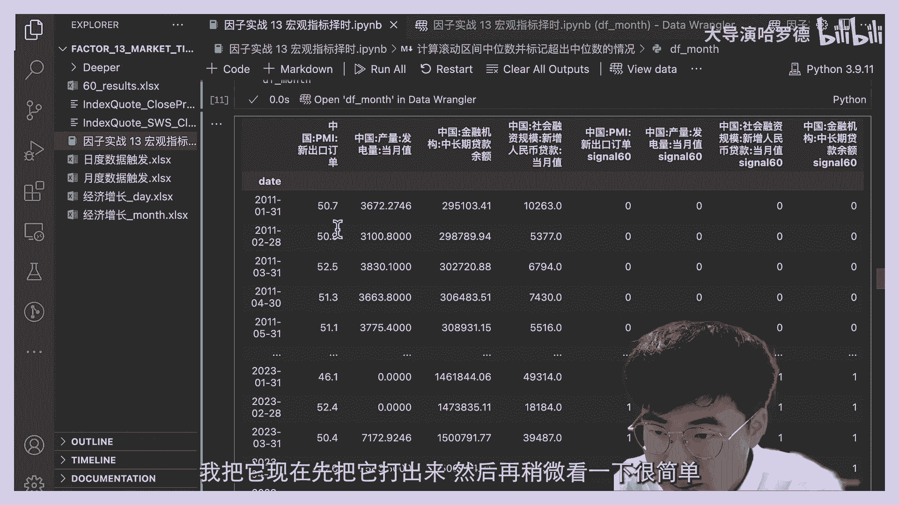

然后大家稍微看一下吧，但其实也很简单，嗯对如果他medium超过了他的medium，那它就会是一，如果说是小于它的B点，它就会是零，大家会发现这个分布呢有些时候是平均的，有些时候是百分不平均的。

还蛮有意思的，可能就是在于最开始的那呃60个medium的问题，那得到这个之后，大家看我这个daily也得到了，然后我去把它给啊保存起来，那我之前已经保存过了，我就不做了这件事情了。

然后下一个呢就是我做的一个win ratio的test，这个test的呢，可以说其实看起来也是有点呃抽象的嗯，为什么，因为它要小于等于signal的这个DF，就等于它这个小于它这个max。

这个是什么意思啊，这个我其实现在也有点看不懂了，那我如果先把它就是先加载一下，这个就只是一个呃win ratio test，我之前相当于写的时候，你看大家可以看到，我还是相当于print到很多东西。

然后去把它写，如果大家不都懂这个代码什么意思呢，大家可以后台给我私信留言，然后我也不想此时此刻就是去在说这个，wreal test是怎么算入的，但是大家可以想象就是说我其实做的事情呢。

就是去对比一下它的一个哦，我这里还是有一个window size的哈，那这个window size呢就是win number，然后range减win number减一，因为你不能超出了那个index嘛。

因为如你有一个window呃size的原因，所以你就不能去超出了这个index，然后嗯发现事件发生的时间，然后如果发生事件，也就是说如果超出了一个中位数的话，我要做的事情呢。

就是如果他呃就是说此刻如果小于呃对啊，如果小于之后的这个温window的话，我就去加一二十日，60日和触发次数诶，哦有趣，因为我会发现其实这里有一个问题，就是我其实因子是月度的。

但是这里的话我的window size是一个日频的数据，也所以说我最后的结果就是20日的剩余，60日的时间和触发的次数，那大家如果先看一下，我接下来读取的首先就是读取我的这个close price。

如果说大家想看的话，我也可以把这个close price给大家打出来，然后大家先看一下，这个是一个什么样的一个数据，OK首先嗯很明显它完全就不怎么normal distribution啊，哈不管它。

因为但在那个的确也不是。

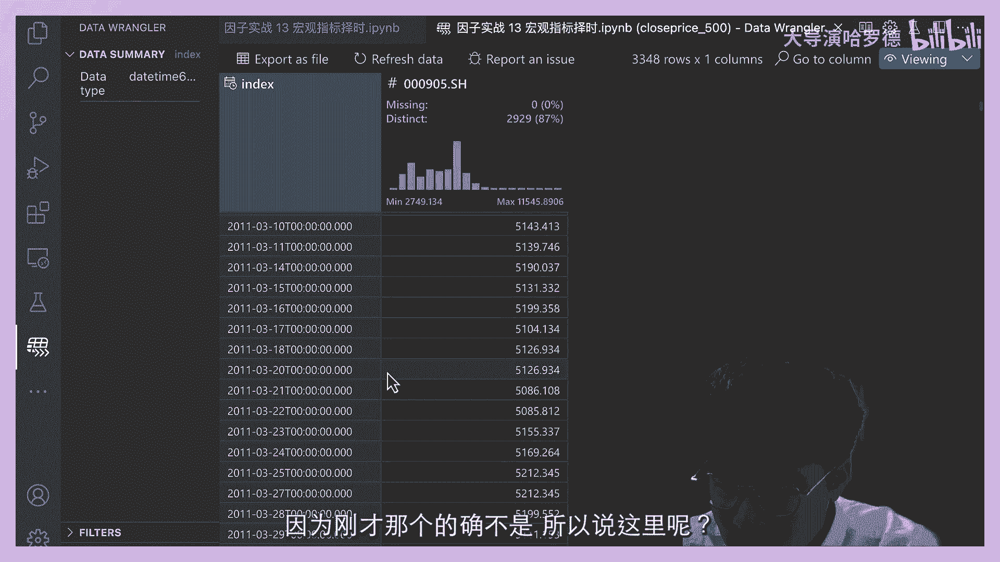

所以说大家看这里呢，它是一个日频的一个数据，那我们来看一下，我这个最后这个是怎么去把它底翻出来，首先大家看我这样的之后得到的这个值，如果我把它做一个text window的话，大家可以看到OK嗯。

在每一天会有一个值，然后在这每一天的这个值如果是零的话，然后这个呢是一个月评的数据，就像我最开始说的一样，也是我刚刚有疑问的地方，就是它是一个月频的数据，这个信号呢是用乐频的触发的频率啊，如果是零的话。

证明他没有超过中位数，如果是一的话，证明它超过中位数，然后这前面呢就是几个我的这个值，那但是这个国债利差它是一个日频的一个数据，如果是一的话，就证明它超过了一个window size，好我们先往下来看。

我们就看这个window size，然后我们现在这个二二十和60，所以我们要看20日和60日的胜胜率，所以还的确有两个window size，然后这里呢就相当于直接调用了这个window size。

来做这个函数，那所以我们再到头来看，去看一下这个window size的函数是怎么做的，其实也很简单，就是我去啊在这个日期下呃，如果有胜率的话，我们就看20日和60日的呃，这两个是分开的。

因为因子是尤其是呃不是，尤其是只有这个行业的因子，所有的这个宏观的因子，除了那个国债利差，其实都是月度触发的，那所有月度触发的呃，数据的话就是去把它呃每个月月末做一个判断，然后找到这个时间点。

找到这个时间点之后，看看20日和60日之后的一个数据，是什么样子的，然后如果我们跑我们在跑这个函数的哦，这就跑完了，其实我本来还想就是说，如果稍微看一下这个函数的话，我刚刚已经把相当于是逻辑讲出来了。

那实现方式的确呃，看起来有那么一点点的，这个tricky和一点点难写，其实呃这个逻辑我认为嗯，在我现在看来就已经算还是比较清晰的了，嗯再说一下，就是呃有一个信号，然后每一次信号。

我们就看他是不是超过了中位数，超过了中位数，我就把它给额看一下，他20日和60日后的价格是在今天的上面，还是下面，如果在上面啊，就是呃是正的呃，是一个成功的信号，如果是下面呢就是一个不成功的信号。

那呃我跑完了这个诶我跑完了吗，我跑完了，这个相当于window size在这个宽基指数上的一个表现，那我接下来要去跑的呢，就是它在呃诶这个应该是一样的吧，嗯我看一眼window size有20和60。

这个应该是呃一样的，那我再去把它跑一遍哦，这里面相当于是多跑了一个，刚刚我跑的相当于是一个行，那个行那个宽基主持嘛，呃沪那个中证500，中证300和创业板，那下面我跑的呢就是一个中证啊。

和一个行业的指数，那行业的指数大家看这是行业的指数，是呃去行业里面去对应的，就是我最开始给大家展示的这个一个表格呃，每一个值它就有对应的一个行业值，然后我们去把他的数据读取出来，然后去进行一个对比。

那这个呢对，这个呢应该可能要稍微跑一点点的时间，为什么，因为它行业有这么多，他要在每一个行业都去啊，做一个对比哦，其实反正30秒就跑完了，然后接下来呢我们就把结果呃读出来，为什么只有哦。

这个就是60日的一个相当于这个60的window，指的是我觉得如果大家能回答上这个问题，证明跟上我的节奏，就是回望朝考的那个window size，而我们做的20日和60日的胜利。

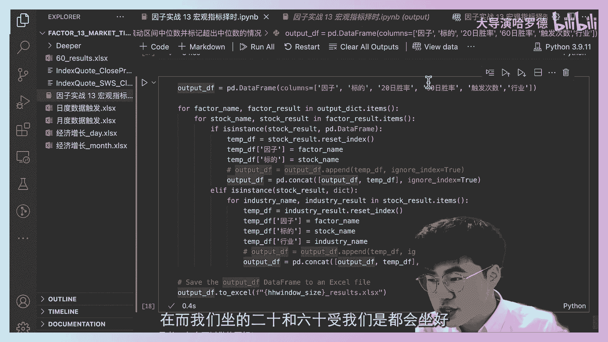

我们是都会做的好，我们看我们这个漂亮的漂亮的这个表标，如果我去根据这个来做一个ranking的话，哎这个太小了，这个完全就反了过来了，大家会发现啊，终于可能看到这个其实大家是最爽的。

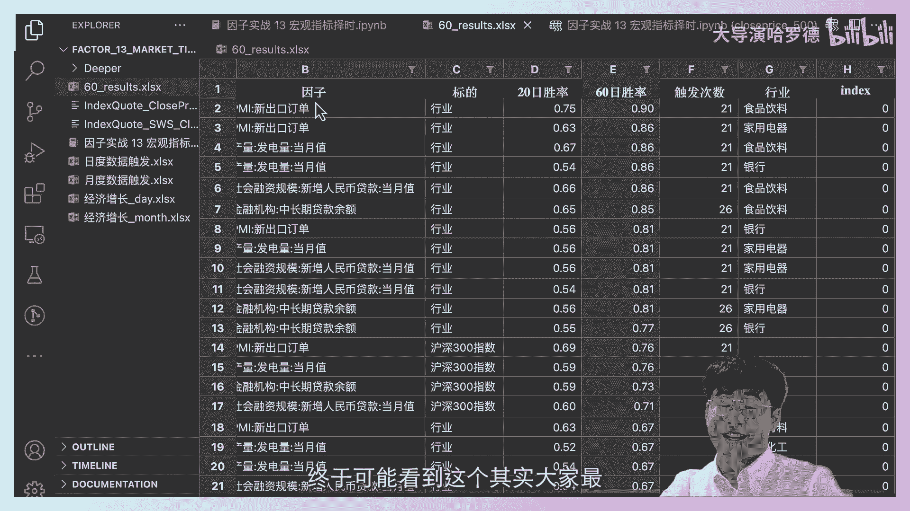

为什么这个看到这个最爽呢，因为这个其实是跟钱最相关的呃，可能一些可能大家就会觉得哇，这个表格代表了什么意思呢，就是我们如果用刚刚说，我们这个月度的新出口订单在哪个行业，在食品饮料行业上在这么多啊。

一共是多长时间，应该是额好吧，也挺多时间的，他触发了20一次，他60日之后的价格比现在要高的概率，有90%，当然这个触发次数并不算很多，我们如果把它也做一个排序的话哇，大家会发现国债利差超过中枢。

因为他是日平的数据，他超过的适度就稍微多一点，只有0。550胜率，但是其实0。55的胜率已经算蛮高的，如果0。57的这个胜率已经算非常高，而且他触发的次数还是蛮多的。

所以说食品饮料行业跟这个国债利差的相关性，有没有一些论文分析过呢，其实这个时候大家就可以去网上找找，我为什么会把这个拿出来哦，应该是大家就可以到网上找找，就是OK就是有没有一些论文去讲。

这方面的一些事情，那其实这个宽基这个行业择时。

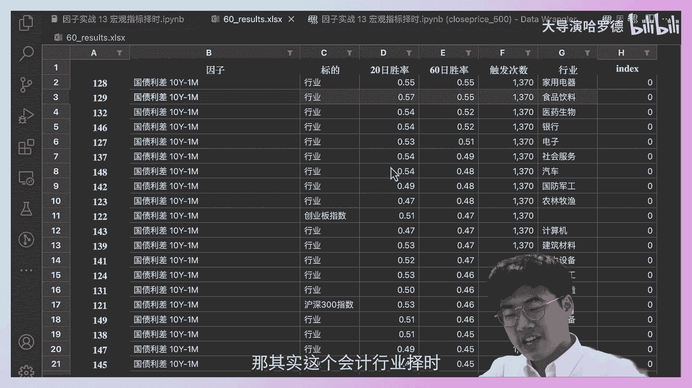

这个择时宏观择时这个话题其实我已经讲完了，我把这个呃结果输出来之后。

我就想发问给大家发问，就是怎么样可以做得更好，哪些地方有问题。

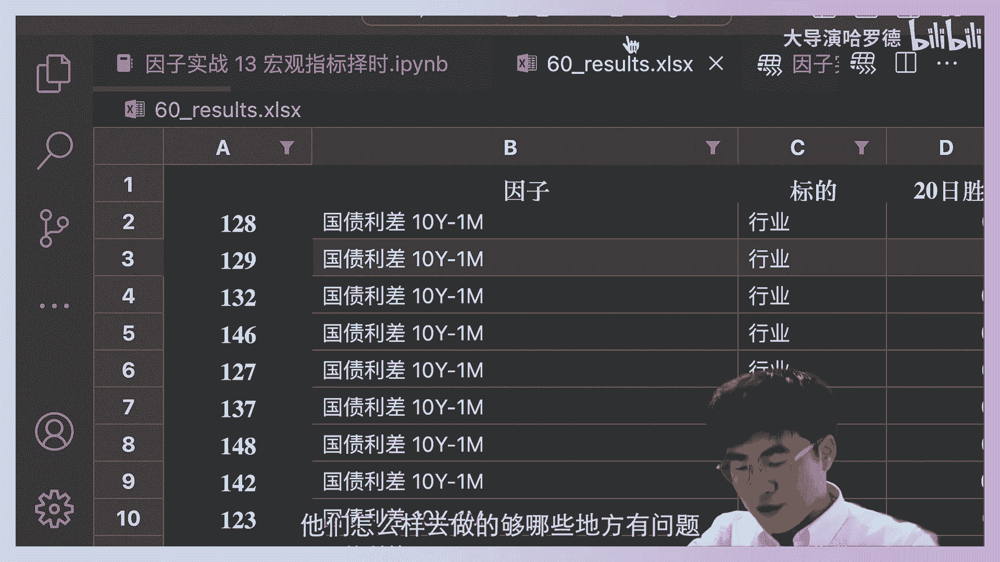

这个方面我认为其实也是非常非常重要的，大家可以学到很多很多东西的，然后我也非常非常想跟大家分享的一个点，一个点呢，就是我们刚刚看有90%的胜率，的一个问题，就是这个啊。

新出口订单在食品饮料行业触发了20一次，有90%的胜率，如果大家真正的去询问的话，其实有60%左右的胜率，已经算非常非常高，只有90%胜率，你会不会说好棒，我这里想给大家的第一个点。

也就是非常重要的一点，就是很多时候在金融行业的这个概率，或者说在统计学上的一些值是，不符合一些，比如说如果说是你用一个系统的，你不能说这个东西90%，不是一个随机出现的一个事情，为什么。

因为他只触发了20一次，在这么多个月里面，他只触发了20一次，一共有多少个，应该是呃应该得有好吧，应该也只有100个左右吧，因为我们的时间也不是很长，那他有90%胜率，这个代表是个什么，还有一个点呢。

我觉得可以改进的点就是这个胜率，我们计算的逻辑是他60后的价，60日之后的价格是比现在要高，我们就算剩的，但高了多少呢，低了多少，如果每次高的是我每次高了一下，我只赚了五块钱，但每次低我赚了1万。

我亏了1万块钱，那这个90%的胜率也不足以，让我能够赚到钱，所以这个呢也是呃很重要的一个点，所以就是我们所谓的一个盈亏比，我认为就现在我在私募实完习之后，我发现啊。

这个这个这个这个值也是也是很重要的一个点，那呃不管怎么样呢，我认为这个demo或者说是这个课件是一个，大家可以做一个这个宏观测试。

一个起点宏观测试是一个很有意思的话题，然后大家如果去呃百度去呃。

不是百度，就是反正你百度也应该也可以，就是啊去搜索一下的话，应该可以看到很多呃有意思的一些文章，比如说像这一篇呃宏观量化，宏观择时的一些呃研究，那这些研究的话，大家如果去仔细看了话，大家就可以看发现呃。

他跟我们今天做的一些事情还是蛮像的，然后我也会把这个论文啊贴到呃我的这个GITHUB上，或者是放到那个百度网盘上，但我百度网盘现在不是坏人了，我都不知道我应该不会去放到百度网盘上了。

应该就只是GITHUB。

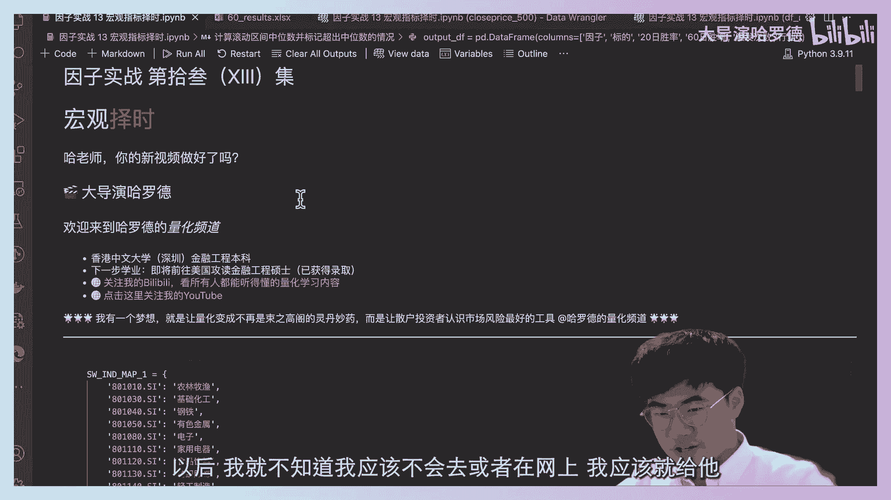

但是啊不管怎么说，就是希望大家能够呃去多去了解一下这个。

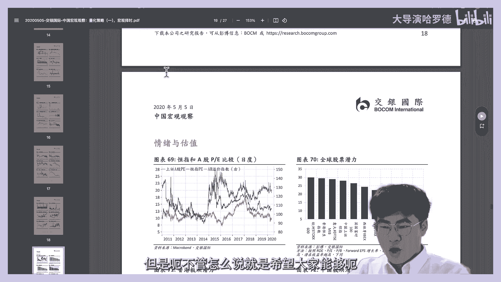

因为我觉得其实他对于我们普通投资者来讲，还是个蛮有意思的事情，大家有没有想过，如果你去买一个基金的时候，你可以做一个这个事情，很简单的一个事情，就是如果你用我现在有的demo。

然后你可以几乎就得到一个参考呃，会不会当下买某一个基金或者买某一个股票，是个非常非常非常差的事情，我们不保证，我们能在一个非常非常好的时期进入，但是如果现在就是一个，非常非常非常差的时期呃。

因为很多时候我会发现呃，金融行业有一个非常不好的点，就是它会给你推最热的股票，这个很正常，但是如果你从一个量化的角度，或者说是从一个收益的角度，你会发现，如果最热的股票是最容易亏钱的。

因为因为他是你最容易在高位买入的，而不是低位买入的，可是万恶的资本主义吧，他就是会推一些最热的，因为只有推最热的，大家才会去都去看，所以他有他的里面的attention，所以他才会赚钱。

可是这些东西如果是这样的话，那其实是你们是赚不到钱的，你们其实在最高的方向买额最高的点买入，并且呢他又所有铺天盖地的新闻，全部都是要买这个买这个，因为这个前10年已经涨了百分之1万，那如果在这种情况下。

你该不该买，其实理性的分析呃，因为你想要在市场赚钱，你就需要反人性，你只能理性一下，你会分析哦，其实他应该是个不太好的事情，因为前面已经涨10年了，那可能他的估值已经高到一种啊，不现实的地步了。

那但是真正能做到理性呃，去反人性其实很难的，所以很多时候我们就通过一些量化的指导，我们去看一看，如果这个宏观啊层面上，或者说是呃微观或者基本面层面上。

这个股票或者说这个基金他已经被overpriced了，这可能也是一部分我的血的教训，那如果你已经发现这个点了，可能暂时就不是一个非常好的入场时机，或者说你只适合一些定投啊。

或者是小额买入一个低仓位的买入，呃希望呢这期视频对大家有一呃有帮助，然后接下来呢我也会去继续开展我的这个因子，实战的系列，下一集呢我想要去给大家解释一个，大家非常非常感兴趣，就是经常在后台问我。

就是这些数据你是怎么获得的，我会给大家去演示一些啊常用的一些啊数据集，然后就是获得的方式，也会对比一些不同平台，获取数据方式的有效性和高效的程度啊，那也希望大家能喜欢这期视频的内容。

然后欢迎大家点赞订阅收藏。

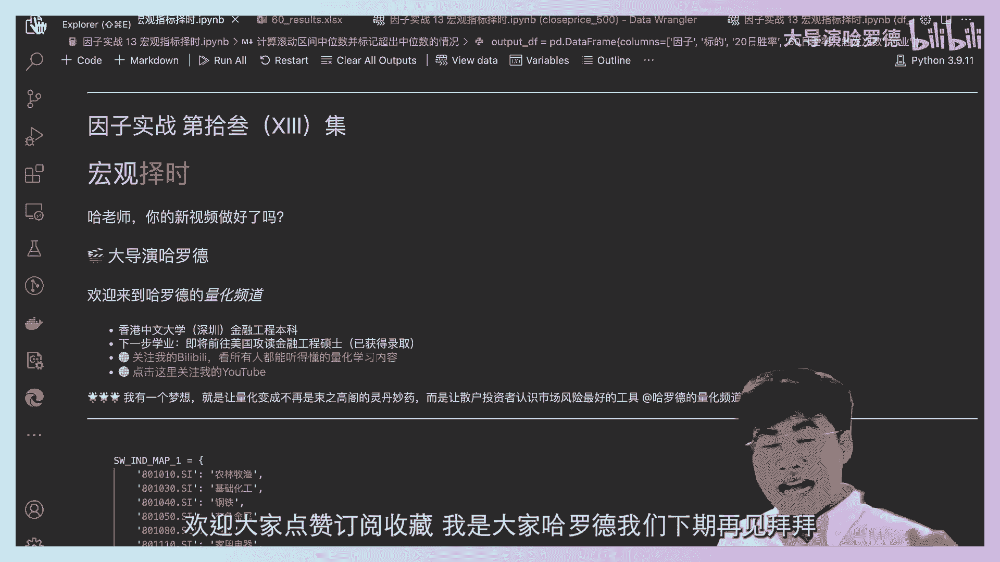

我是大战哈罗德，我们下期再见。