# 【数据分析之量化案例】五天学会python金融量化数据分析 - P12：day03-03 捕获股票跌幅的日期 - 计算机老油条 - BV14VBCYqEcn

那么我们继续呢来看一下下一个需求。

我们说下按一个需求需要我们找到什么呢，这支股票所有开盘比前日收盘，跌幅超过27%啊。

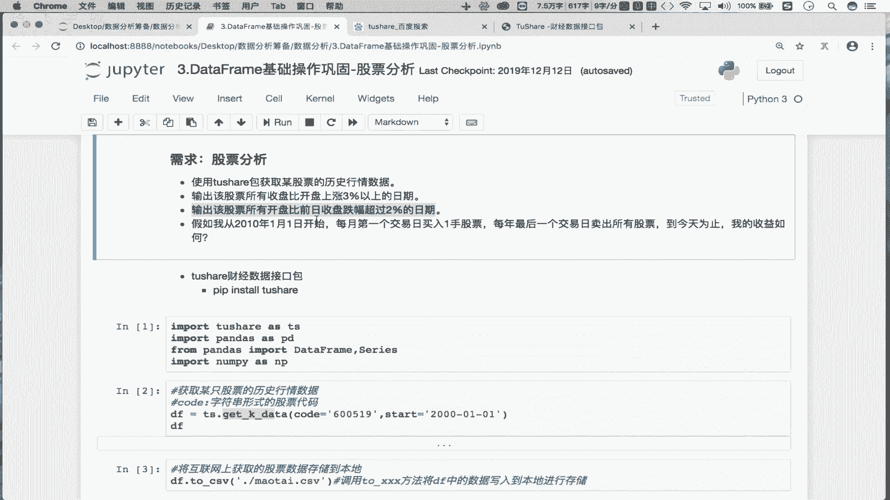

要找跌幅的日期了吧对吧，好写一下啊，这块是该支股票开盘比前日收盘，跌幅超过27%吧。

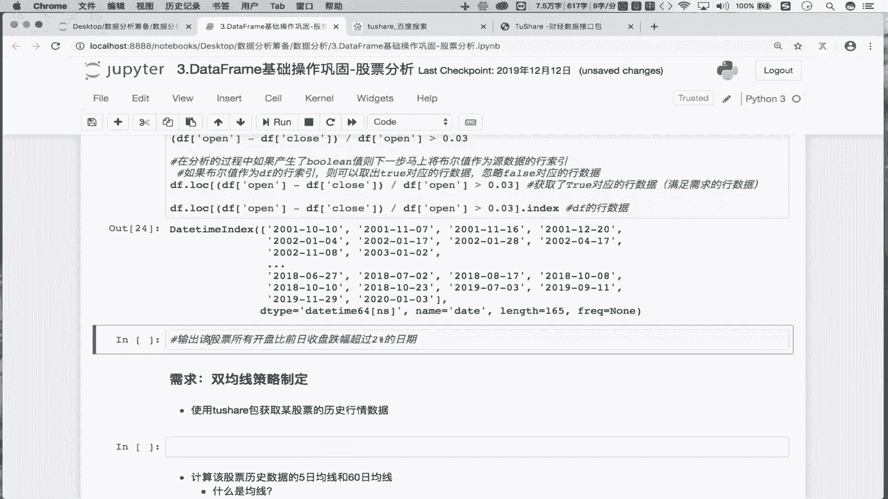

首先还是先写我们的伪代码，是不是伪代码，那应该是什么呢，先是我们的什么呢，不开盘开盘减去什么呢，是不是前日收盘啊，并不是收盘了吧，而是前日收盘，对不对，是开盘所对应的前日，收盘OK吧，然后再除以谁呢。

除以我们的前日收盘对吧，跌幅超过2%，怎么用来表示跌幅超过2%呢对吧，那首先先给大家固定一下跌幅的话，我就想用负的0。02来表示OK吧，那负的0。02假如表示的是跌幅的话，那跌幅超过2%。

那这应该是大于负的0。02，还是小于负的0。02呢，有奖吧，负的0。02表示是跌幅，是不是2%啊对吧，那如果是负的0。03是不是跌幅3%，那跌幅3%是不是超过了2%啊。

是不是跌幅3%是满足我们需求的对吧，那负的0。03是大于负的0。02，还是负的0。03，小于负的0。02啊，是不是小于啊，不小于二对吧，所以这是负号，你要知道这用大于号还是用小于号啊。

这个是咱们的伪代码，那伪代码的话就可以写成真正代码了吧。

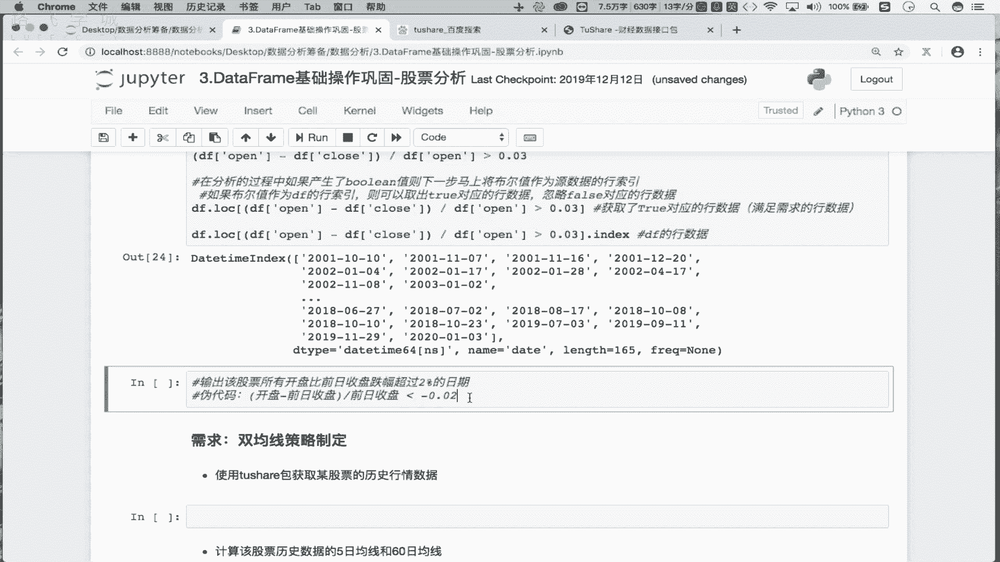

怎么写呢，首先啊这块的话开盘是DF好open，没问题吧，好那收盘是DF不df close啊，但是这不是收盘，而是说要找出前日收盘吧对吧，那什么叫前日收盘呢，你比如说哈比如说在这看一下交换数据。

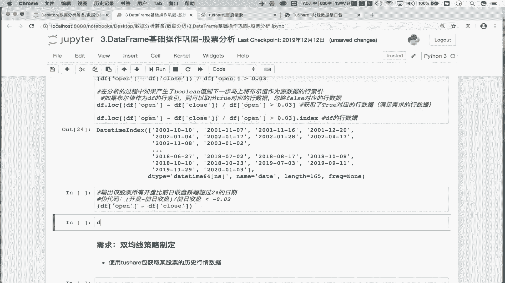

你看首先我们看一下8月28这一天，它的开盘是不是五块四毛六啊，收盘是五块七毛五，是不是啊，那我们如果就针对8月28这一天开盘时，它那么这一天的前日收盘是不是27号的，收盘是五块五毛五啊，对不对。

你看那么29号这一天的开盘是五块七，那么29号的前日收盘，是不是28号的收盘对吧，那我们是不是应该让我们的什么呢，让我们的开盘减去前日收盘，那怎么去表示前日收盘呢，你想一下。

那就是说如果哈你看我们是不是让它减去它，对不对，让它减去，它是不是错了一位啊，是不是错了一位，那错了一位的话，必须得对齐之后才能减吧，要不然没法减，是不是，那怎么办，那我们就可以这样啊。

我如果让close close整体下移一位，那么意味着数5。7是不是就到这了对吧，那5。7如下一位到这的话，那么意味着你看那5。777-5。7，不就是29号的开盘减去前收盘了吗，能理解吗。

所以说让close这一列整体下一位，那么它就可以表示我们的前收盘，那cross系列怎么整体下移呢，咱们去试一下啊，首先你看一下啊，DF我先拿到什么呢。

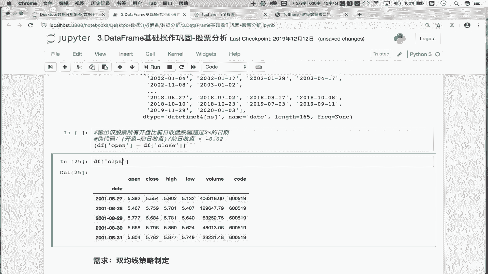

cloth系列走是吧，那如果让他整体下一位，意味着五块五毛五就跑到了28号的位置，不是跑到这了，那这就补空是不是就行了点儿什么呢。

shift1走看一下是五块五毛呃。

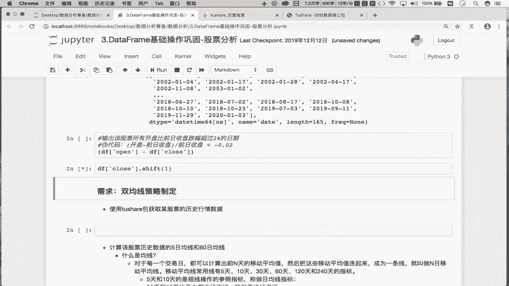

五块五毛五分四厘就跑到28号那天了，上面就补空啊，这个是不是让整体下移位啊，那这个就是我们所谓的前收盘，OK吧，那在这点儿shift一个一是整体下移位吧对吧，那一的话是不是整体上移位。

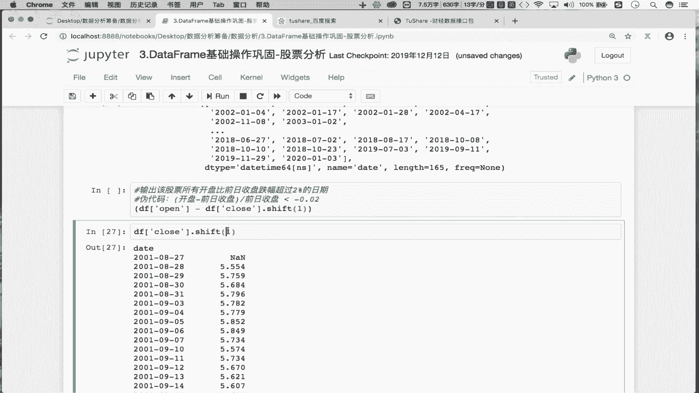

对不对，没有必要让他上一吧，所以这个就是我们的前日收盘，是不是它就是我们的前日收盘好，然后让它除以谁呢，除以前日收盘，然后是不是小于负的0。02啊，走你那这也得到一组B值吧对吧。

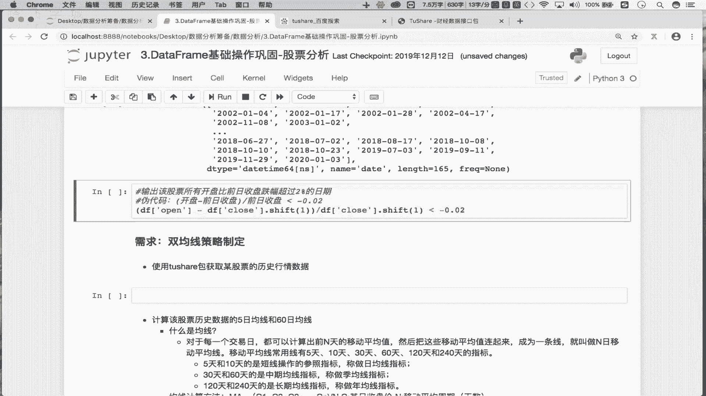

那这组布尔值得到之后，接下来马上将这组布尔值。

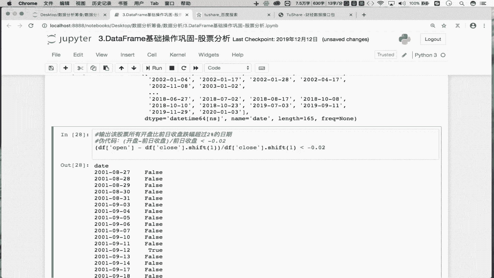

作为原数据的行索引吧，因为这组布尔值当中，true所对应的时间就是我们想要的时间吧，对吧好，将布尔值作为原数据的行索引，是不是取出处对应的行数据啊，对吧好，那d f d r lock中。

括号这里边放的是我们的行索引吧，对吧好，将这个表达式返回的布尔值全部作为行索引。

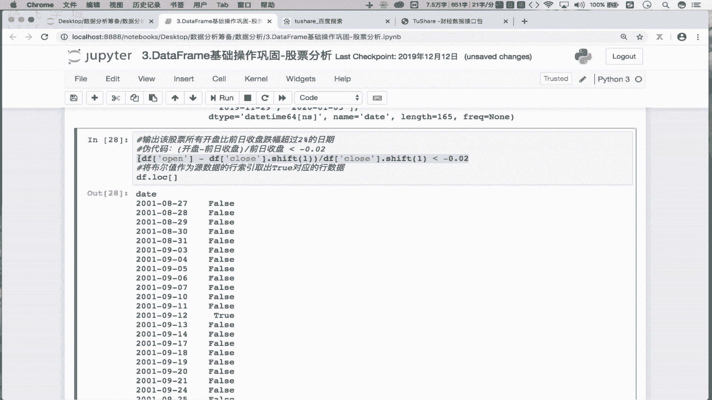

对不对，找你不就拿到了满足需求的行数据了，那最终我们想要的时间而不是行数据吧，那怎么办。

不在这在这个表达式返回的data frame当中，是不是点一个index就返回时间了。

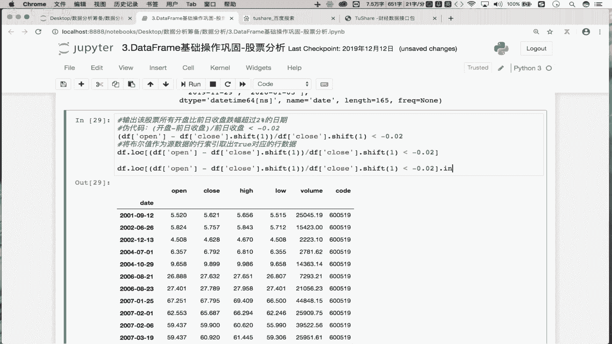

SONY对吧，那么这些时间都是股票下跌的时间吧，是不是跌幅超过2%的日期啊，对不对啊，那所以说最终哈，我们的这个需求，只需要这么一行代码就可以实现吧，但是这一行代码如果一步到位，写出来可能比较难。

那我们是可以通过逐步的分析，逐步的去写啊是吧，最终只需要提交这一行代码，就可以得到咱们需求对应的一个实现了吧。

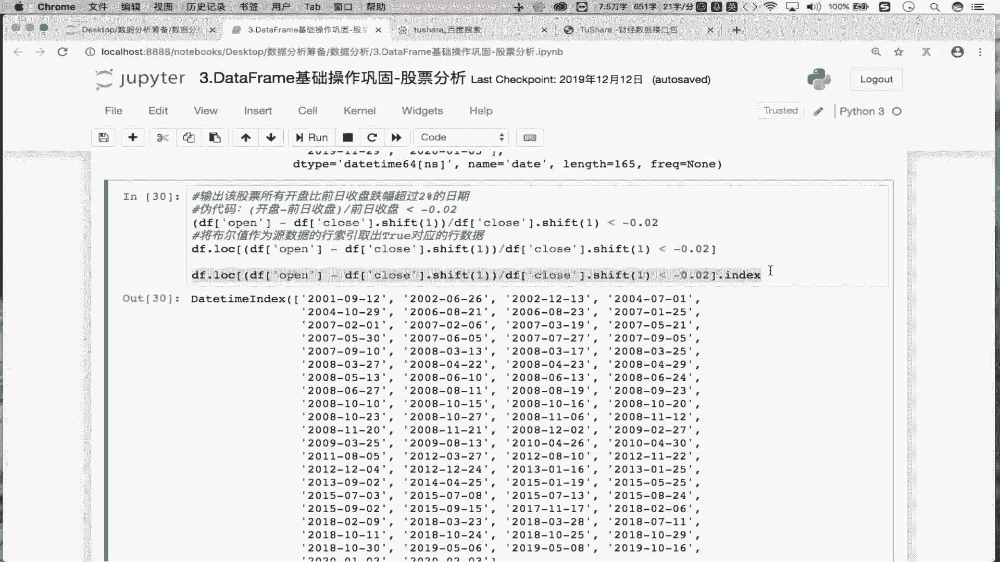

OK吧好，那么意味着你看现在的话。

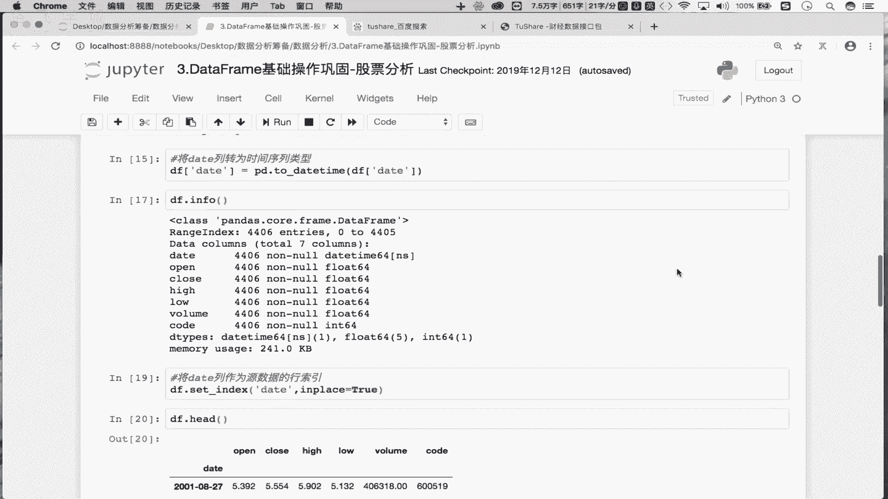

那么这两个需求咱们都实现了吧，还是相对来讲比较简单的，是不是好，那么下一小节。

