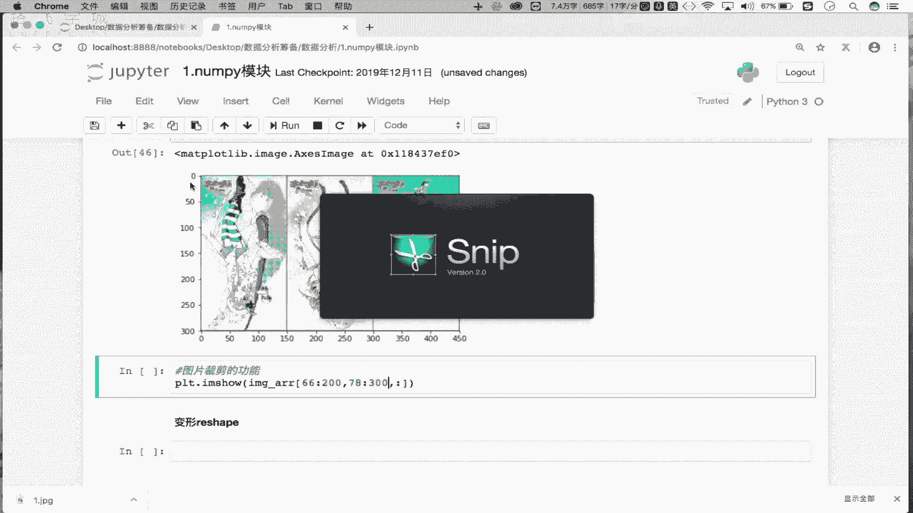
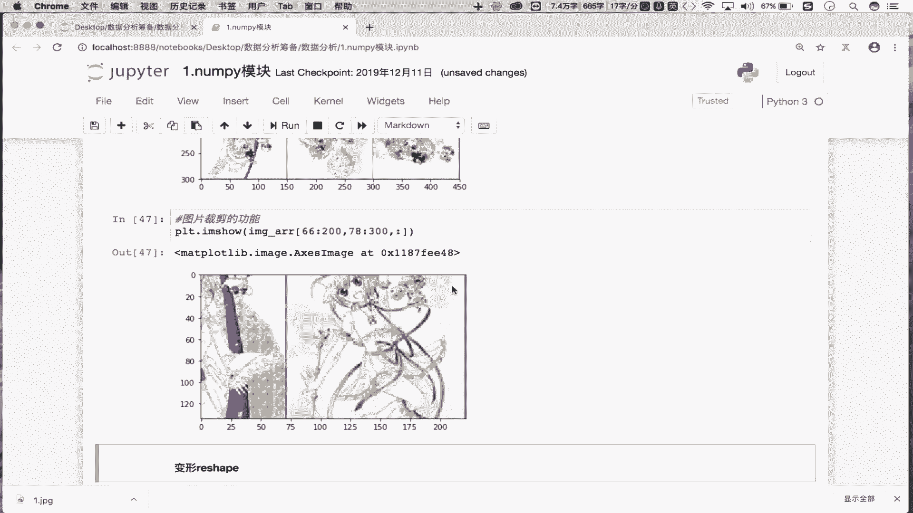

# 【数据分析之量化案例】五天学会python金融量化数据分析 - P5：day01-05 numpy炸天之索引和切片 - 计算机老油条 - BV14VBCYqEcn

那么接下来的话，咱们来看一下n的索引跟切片的一个操作啊。那首先这个n的索引和切片是咱们整个nty模块当中的一个重点内容。OK吧？大家一定要仔细的去理解和仔细的去听。那首先我们知道这个索引跟切片。

咱们之前在列表里边是不是已经用过了，对吧？已经用过了。那我们说这个索引和切片是可以帮助我们去呃取得我们的数组或者列表这样的一些个容器当中任意的数据吧，对吧？那么在我们的这个。nP模块当中。

它的索引跟切片更加的灵活。那怎么去用呢？我们依此来看，首先先看一下索引操作啊，那么nP数组索引操作跟我们数组啊跟我们的这个列表索引操作是一样的啊，nP模块对吧？它的索引操作跟我们列表索引操作是一样的。

比如说咱们在这儿的话，先有一个er瑞va是吧？er瑞啊创建一个这个nP数组，我们用一下random。第二，random先创建一个nvy数组从1到100size给它一个呃5行六列，可以吧？好。

在这先打印一下ar，这是一个五行六列的一个nvy数组是吧？那它的索引怎么用呢？arrow中括号一对吧？那这我取的是什么呢？是吧？取的是不是数组当中的第一个数元素啊，那谁是数组当中的第一个数元素呢？

是不是列表套列表的第一个列表啊。就是他板是不是第一行，对吧？那这块我们就通过索引取出了什么呢？取出。那nP数组中的第呃这个这个下标唯一的行数据吧，是不是呢？总你这返回的是不是行数据，对吧？

这取的是不是单行嘛，是吧？那想取多行怎么办？你看在这儿我写一个一。3。4OK吧，走这儿返回的时候取出来下标为一，下标为3，下标为4这三行数据啊，就是取出什么呢？多好，对吧？

那这个就是我们的npy数组的索引操作，它跟列表是不是一模一样啊，对吧？是一样啊，重点是看它的切片操作，OK吧，切片，那首先切片怎么切呢？首先在这看一下第一个需求，我们想切出谁呢？切出。

Error数组的这个钱。亮。行的数据吧，前两行的数据啊，那这块的话怎么去切呢？首先aror是吧，就是我们原始的数据吧，是吧？切出它的前两行中号这里边就放切片呗，0冒号2走，这切的是不是前两行，对吧？

所以说我们这个eror中括里边放的是不是我们的行切片对吧？就可以切出指定的行，那想切裂怎么办呢？好，在这看一下。起诉。去除eror数组。中。的钱。两列吧。这个怎么玩呢？El中号这写一个零冒号2。

一定切的是行啊，你想切列怎么办？在这儿加一个逗号OK吧？好，试一下，走，这儿切的是不是前两列O吧？那这个逗号啥意思呢？我们会发现eror中括号逗号左边是什么呢？左边需要放行切片。右边放裂血片。

那现在你看行切片我切了吗？没切吧，是只对列进行了一个切分呢，所以在这是不是切出了前两列呀，对不对？好，很有意思，是不是啊？那在这儿前两行跟前两列我们都切了吧。那第三个需求切出前两行的前两列。

那这个就毋庸置疑了吧，对吧？还是使用我们逗号的机制吧？ia中括号不零冒号二是前两行逗号0冒号二是前两列，到这是前两行的前两列。对吧？好，那接下来看一下反转。那如何将数组进行一个反转呢？什么叫反转？

看一下我们原始的数据是长这个样子的，反转，就是说我们可以将所有的数组元素进行一个倒叙啊，比如说你看88是最后一个元素吧，69是不是第一个元素吧，那倒置之后是不是69成最后一个了，88成最第一个了。

对不对？当然我们也可以让指定的行客指定的列倒置，比如说在这儿我们先提一个需求。这个将。数组的什么呢？行倒置啊，将数字的行倒置怎么倒置呢？中括号这里面写一个冒号冒号-1。

那这种形式走你看一下是不是将我们的行到这了，原始的数据看一下是不是这样的呀，69737处第一第一列。第列吧啊，然后呢，我这是现在看一下啊现在看一下啊，我们在这儿啊，我们是将行倒这是吧？这个是不是第一行。

698是不是第一行，现在698是成成最后一行了，原来5463最后一行吧，它是不是成第一行了，对吧？这将我们的行到这能将行到这是不是也能将列到这，对吧？将数组的列倒置列到这怎么玩呢？arrow中号好。

再加上逗号的这吧，逗号组边是行行到这吗？不倒置列到这吗？倒置冒号冒号-一好，这表示是不是将列到这走看一下，现在你看是不是4434是最后一列，现在是变成第一列了，对吧？列到这，然后呢。

还可以将整个的元素倒这。所有元素导置，那所有元素倒这不就是行列都到这吗？是吧？就是冒号冒号-一逗号，冒号冒号-一找你。那现在所有的元素都到这了吧，对吧？原来69是第一个元素，现在88乘第一个元素了吧。

OK吧，这个是我们切片实现的数组的行列，包括元素的一个倒置吧，对吧？那么倒置你会来之后呢，我们来看一个呃具体的一个效果吧。比如说在这儿我们能不能将一张图片进行上下左右的反转呢？可以对吧？可以。

怎么可以呢？好，在这儿我们看一下啊。将一张图片进行什么呢进修这个左右反省吧。那首先我得先有一张图片啊，对吧？

比如说image杠erure等于PLT是不是mat排的列排啊点I am read是不是read哈，这是读取是当前目录下有一个叫做一点勾PG的一张图片，是不是？好，我们先显示一下原始图片呗。

I am show。好，这个是我们显示的原始图片吧，对吧？并没有对其进行一个倒置吧，对吧？那我们怎么对它进行一个倒置呢？okK啊，在这儿我们就进行一个倒置的工作。

那倒置的话是不是对我们的图片进行一个什么呢？进行一个这个左右反转啊，对吧？左右翻转，那你说应该是对行倒置还是对列倒置呢？你讲。看看我鼠标，这是不一行一行一行，如行倒置的话，不就是说让图片上下翻转吗？

是不是列倒置才是对图片左右反转啊，对不对？那咱们就来试一下啊，那怎么玩呢？PLT点I am show，还是对图片进行一个展示吧，对吧？

那只不过展示的不是我们原始的image error这样的一个出组了吧，我们需要对其进行一个翻转。那首先你要知道这块的image error点 shift看一下它的形状是不是三维啊。是不是三维啊，对吧？

那三维每一个维度各表示什么意思呢？你看前两个维度表示是图片的像素，第三个维度表示是图片的颜色。O吧？那我们只是想让图片进行一个这个左右反转啊，颜色不变吧。

那么意味你看这个是像素意味着300是行450个列啊，对不对？那行列是不是组成我们的一个像素，对吧？那所以说啊所以说在这我们想要让我们的图片左右反转的话，就是说让我们的列反转吧，那三0百是行450列吧。

好，冒号对吧？就是行行不用管吧，冒号号负一是不是列倒是啊好，第三个维度是不颜色，颜色不用管吧，不用管吧，对吧？总你看一下图片有没有左右反转，对比一下，是不是左右反转啊，对吧？左右反转啊。

那所以说在这儿我们的image error中号，它的每一个维度各表示是什么呢？各表示行。裂和颜色吧。我们是不是只要列到这了，对吧？大家你是不是可以通过同样的操作，使得我们图片上下翻转？图片上下反转对吧？

还是一样的PLT点IM show对吧？好，对image error它的行进行冒号冒号复一到这吧，裂动吗？不动吧，颜色是不是也不动啊，对吧？等你看一下是不是上下反转了，对吧？上下反转啊。

那通过图片的一个显示，我们可以更加清晰明了的看见我们整个反转的一个效果是不是啊，反转的一个效果，好，那么接下来咱们在这还可以基于我们切片实现一个什么呢？图片裁剪的。功能对吧？

你比如说我想将图片的局部的区域给它裁剪下来，怎么裁剪试一下啊。比如说在这儿。呃，PLT点儿。I show对吧？我在这展示的不是PL，不是我们的这个inmail原始数据的吧。我需要对其做一个什么呢？

局部数据的补货吧。比如说在这啊，我就想捕获到什么呢？捕获到。将他的什么将他的这个呃，你看第一个维度是不是行？第二个维度是不是列？第三个维度是颜色，颜色是不用管啊，对吧？不用管就不用切冒号就不用切吧。

那行想切的话，比如说我在这儿啊切下行行的话，我就从这个从66切到200可以吧？那列的话，我们就从这个这个78切到1个300K以吧，对吧？就对行进行了切片，对列也切片了，对吧？颜色没切吧。

那对行列切完之后，我们就可以拿到局部的一组数据了。你看我们行切的话怎么切列？等等啊，行我们7月份的话是这么切的。

行是从66切到280，66是哪儿啊？大是这吧，就从这儿。7到200的位置。对吧列怎么切断？列是不是从787到300啊，78是哪儿？大概是这的位置吧。切到300从这的位置啊。

最终咱们切出来的不就是这部不就是这部分的内容吗？

对不对？那是不是呢我们来看一眼吧，看一眼啊，走这样的话是把局部的一些个内容就解析出来了，对吧？所以说通过咱们的切片，还可以将我们的这个图片进行一个裁剪。OK吧。

这些都是基于咱们的切片跟索引的一个功能实现的吧。OK吧？好，那这块的话各位一定要守知一定要熟知啊。那么这条节我们就先到这里。

