# 【整整198集】这太完整了！python金融分析与量化交易实战课程，全程干货无废话，入门到精通一步到位，(数据挖掘分析／大数据／金融／股票／) - P26：2-基于百分位去极值实例 - 人工智能- - BV13K11YiEbb

接下来啊咱们要完成这样一个操作，我说现在啊这个数据啊，它的一个范围我就不管了，我说现在那Q1我们能算Q3，我也能算，我说小于这个Q1的，那就都等于Q1吧，大于这个Q3的，咱就全等于Q3，是不行啊。

相当于数据，你给它规范到一定的范围当中吧，我们要做这样一件事好了。

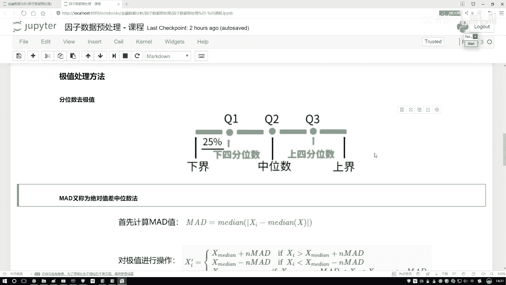

咱们来看一下吧，怎么样去做，首先我先指定个列名啊，对哪个列执行这样操作。

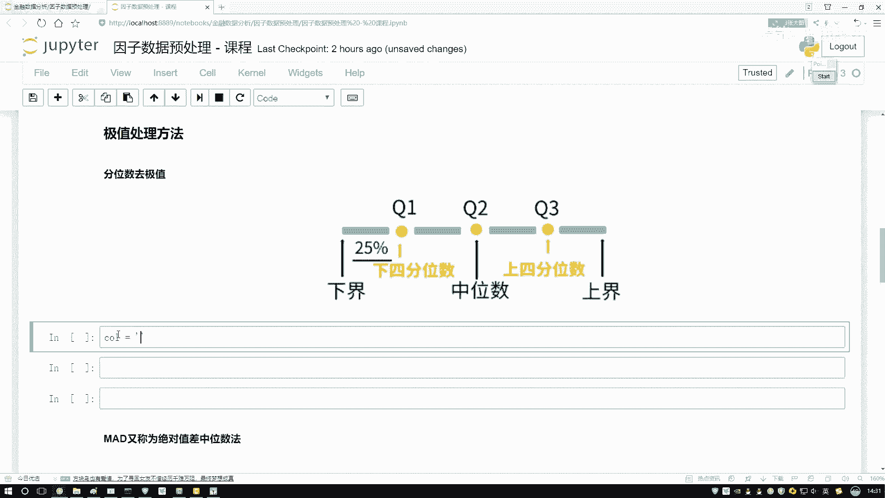

我随便选一个，咱们只是举例子，也不选什么因子了，随便选择一个列好了，D选完了，那接下来我说要写个函数了，这个函数啊帮我去做了，我们当前的一个过滤操作，过于操作谁呢。

是不是说我们现在啊对我的这个极值来去执行，咱们当前的一个按照什么百分比吧，其实这里啊我说的是一个按照一个Q1，还有Q3，那你说按照一个别的百分比，咱能不能去做呀，是不是也行啊。

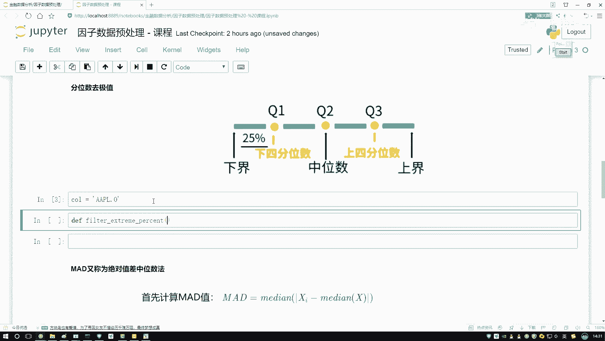

哎这是我们写的函数，在这里我们要过滤，那一会儿呢我会传下数据啊。

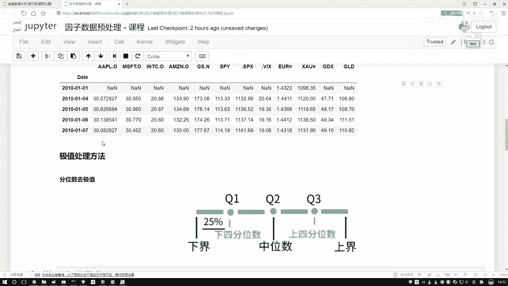

数据这是一个data列表当中，我们选了一列，是不是选了一列啊。

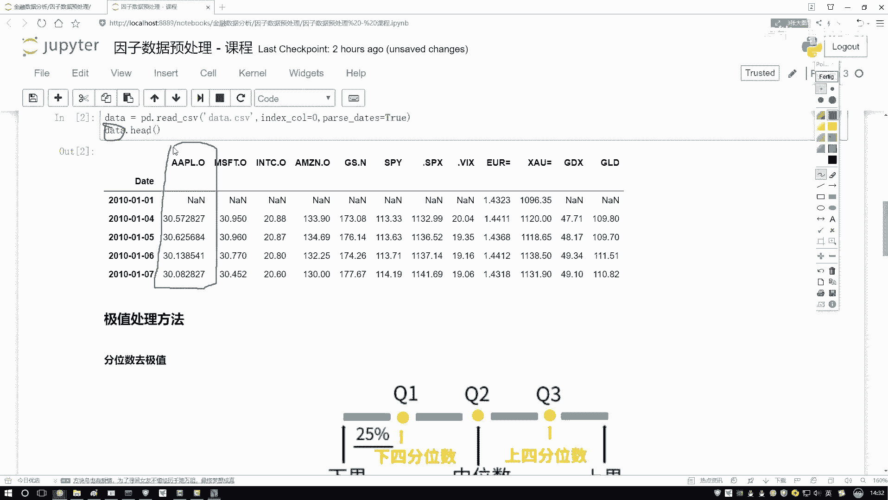

一会儿那一列是什么一列，它是不是一个series结构啊，所以说我传进来的就是一个serious，然后呢你还得告诉我什么，哎呦你的一个最小诶，你想保留的是一个百分之多少呢。

可以比如说这个Q1拿25%可以吧，一会你可以自己改这个参数啊，然后再来一个参数，我说最大你想保留多少呢，这个任务当中，咱是不是就是一个75%啊。

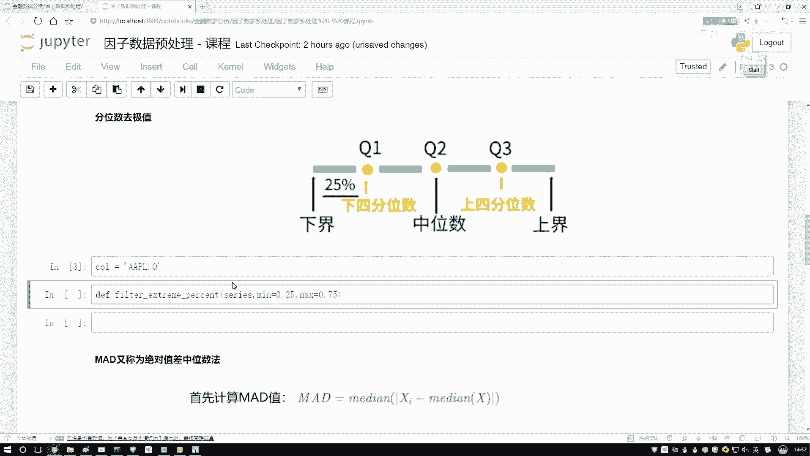

好了在这里我们来写一下写吧，第一步干什么，哎你说数据。

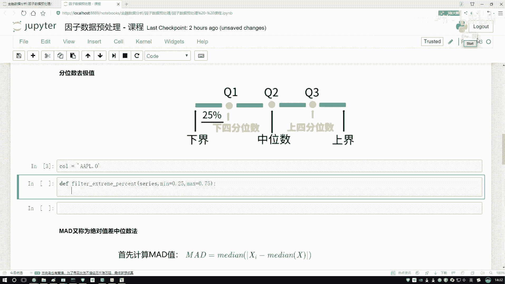

你看一开始的数据啊，都是有大有小，有大有小的，不一定吧，那你说当我们去做这个中位数的时候。

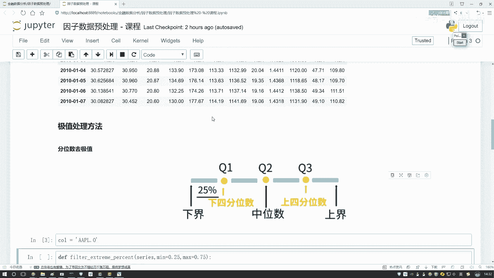

那数据得怎么样，那是不是得按照从小到大。

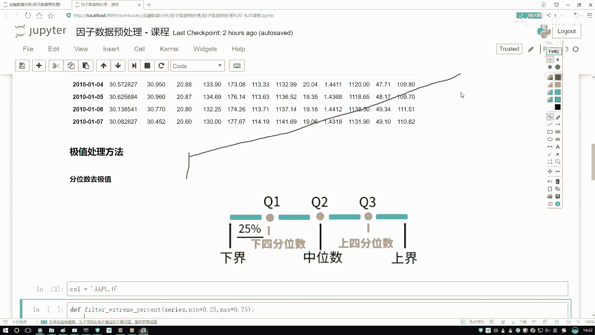

你得做一个排序啊，所以说第一步咱们要对数值诶，完成这样一个排序的操作，因为只有啊你的一个排序完了，你才能去算哎中间那个是哪25%是哪。

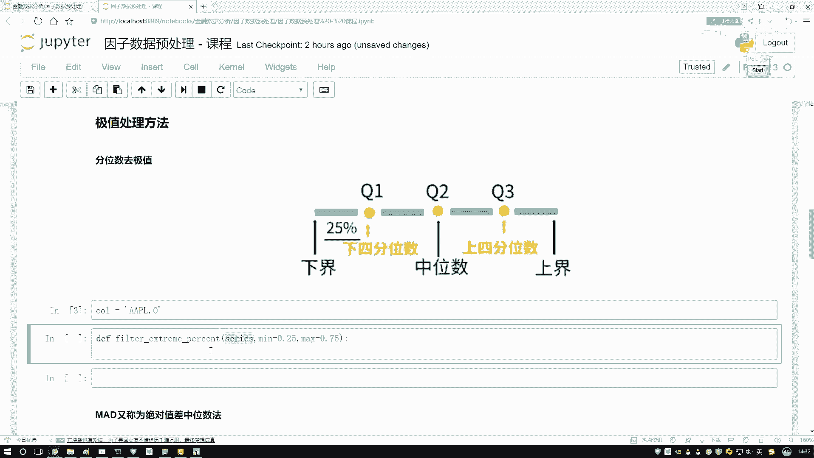

75%是哪吧，好了，对我series来说，我说呀我说对它做一个排序，salt value一下sert values，那就默认它就是一个从小到大排序的serious，等于它当前的一个排序结果。

这个是我对咱们当前这一列数据啊，重新做排序了，重新排序完之后啊，然后你是不是得告诉我哎，现在你这里边，你只给我传出一个25%和，一个75%，哎我说我是不是得知道啊，这个25%是等于哪个数啊。

75%是等于哪个数，我一会儿好做对比哎，小于这个数的都得这个数，大于那个数的哎，都得最都都都得那个大于那个数，是不是我得把这个最小和这个最大两个数，算出来了吧，行老师这里啊，咱说我现在有一个Q吧。

Q就是我的一个呃，这里边存的就是我一会儿的，一个最小的和一个最大的好了，把这个series拿到手，哎这里咱可以直接有个函数啊，帮我们去完成这样一个计算的操作，呃挺简单的，就是在这个pandas当中啊。

很多函数咱都可以直接用起来，这个函数意思是这样，就是当前啊你往这里边输入进来了一个序列，然后呢你跟我输入了两个参数，比如说你输入一个0。25和一个0。75，他就实际帮你算一下哎。

在这在在这个Q1和Q3位置，它的值分别是多少，所以这块呃我把这个最小值一个哎，这块里边里边你传进来，就是传进来的是一个list list当中，你说你要把数据当中你算哪些个值，我说算最小的ADR5。

这个再算一个最大的0。75，这个行了，然后呢我说我写一个返回值吧，现在我是不是个最小有了最大有了，那接下来我是不是说得对我数据干什么了，做一个规范吧，这个南派这个函数是这样一个意思啊。

就是呃这里边比如说你现在有一个呃，133579，然后十一十三吧，然后这一块你要传建三个参数，第一个参数就是你这个序列啊，像咱们直接一会儿把这个series传建就行。

然后第二个参数就是你希望这个序列当中啊，一个最小值是多少，一个min，然后第三个参数就是你希望这个序列当中啊，最大的一个值哎它是多少哦，我们要写三个参数，然后比如说你最小值它是等于三的。

最大值是等于一个11的，那它会返回什么，返回的也是一个序列啊，只不过说这个序列我拿来策划这个序列，它又变成这样了，你看第一个值小于三吧，会变成什么小于三的哎，都变成三了，只有三三，然后呃3579 11。

最后什么也是一个11吧，啊相当于把所有数据啊做了一个规范。

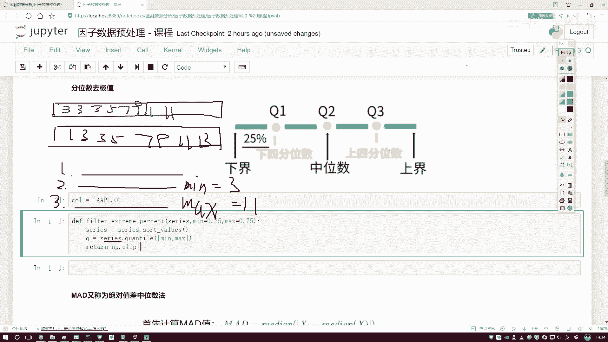

在这里哎我们有三个参数，第一个参数我的一个serious啊，我们当前的这个序列，第二参数呢在这个Q当中啊，它会有两个返回值啊，返位置第一个就是它的一个最小，因为这个序列当中我不是传建两个吗。

所以说它里边就会有这么两个值，那最小值我LC一下，它就是一个零是吧，然后接下来Q再点LOC一下，然后第二个值最大值它就是一个一好了，这样我们就把当前这个函数给它写完了吧，相当于哎我们第一种方法。

这个方法呢按照我传进来一个呃，就是一个series啊，一组数对自数数啊，我选了哎最小多少，最大多少，然后呢，你按照我当前这个比例，把我这个数据做一个规范啊，这样我们就可以完成一个去极值的操作吧。

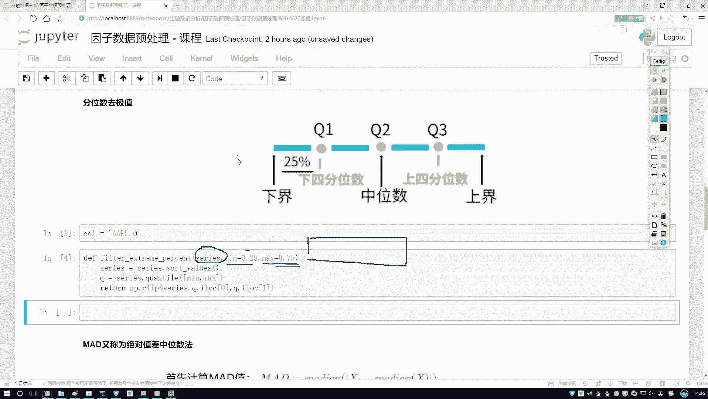

好了，这里啊咱们先把哎我们的一个函数给它写完了。

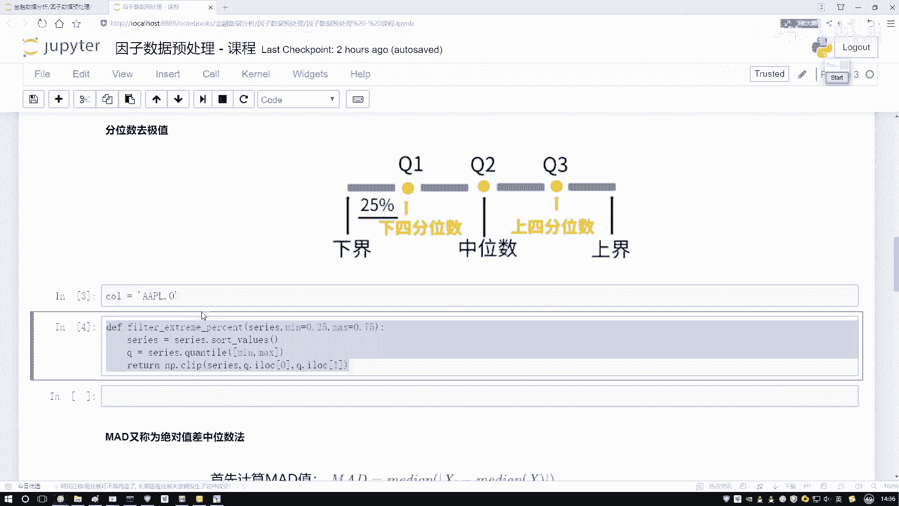

这个代码啊，咱们是写完了，那接下来看一看它去讲极值的一个效果吧，在这里我们来去执行一下，执行这个函数，然后呢只有这个函数就对我数据做操作吧。

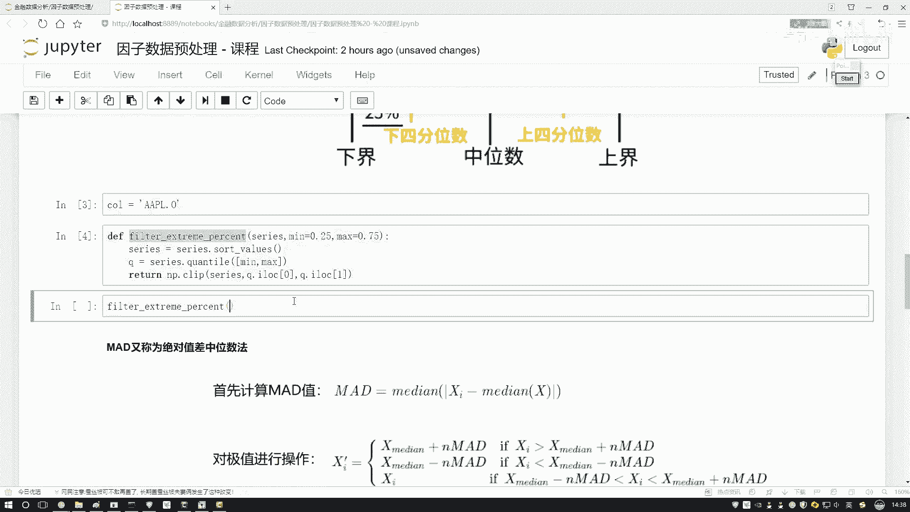

然后我数据就是啊咱们直接写吧，数据就是data对数据当中的某一列，我把这个列名给它传进去啊，这就完事了，这样咱就完成了一个啊基本的按照百分位啊，取一个啊去极值的一个操作行了，那我们去完了一个极值哎。

咱们给它指定一个返回值，对于这个返回值来说呀，那咱们来给它画图看一看啊，现在这个结果它能长什么样子呃。

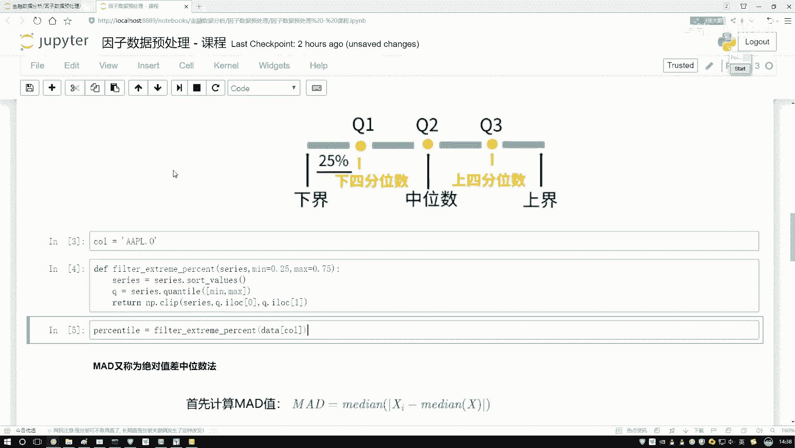

画一个图就是点PLOIT一下好了，这里啊我说呃哎直接对我们这个结果吧，哎直接对这个结果对我当前的这个结果啊，我说给他点2pat一下，plot to完之后，哎这是第一步，先做一个哎呀这样不行。

这里边我们得画两个图，一个是原始的。

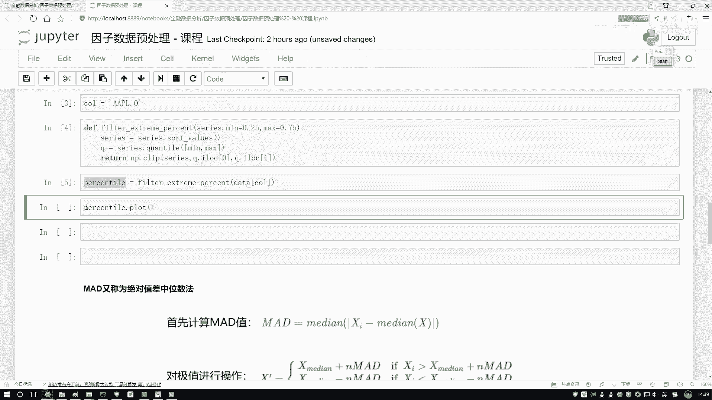

一个是咱们做完之后的吧，好了，我们得画两个，第一个就是一个原始的原始图啊，就是原始的一个数据，我去点PLOIT一下是不是就行了，然后一个新的，就是我刚才做完了我的一个规范之后。

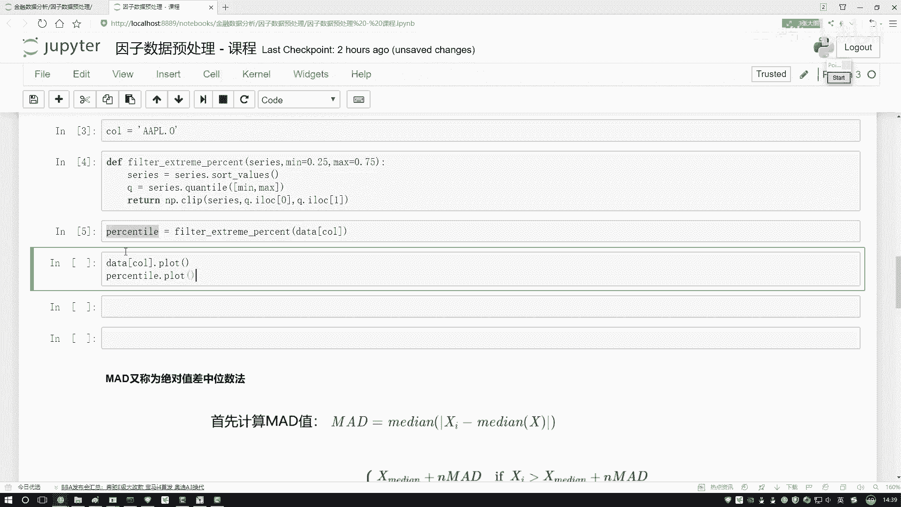

咱们再点prat一下，看一下吧，呃看这个结果有点奇怪，我们来检查一下，没有什么问题啊，第一步在这里，我说我是对我们当前的原始数据啊，做了这样一个操作，第二步呢是我现在啊执行了一个规范化之后。

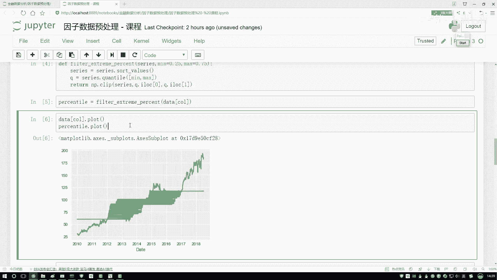

然后对我这个数据咱又执行了一个操作，从这个图上来看啊，基本上就逻辑上没有什么问题啊，因为他已经把他的一个范围给大家画出来了，但是这个呃它会有些重叠，这个重叠看起来不是特别好看，这样吧。

我在把这个放到下面，把这个放到上面给它加下顺序。

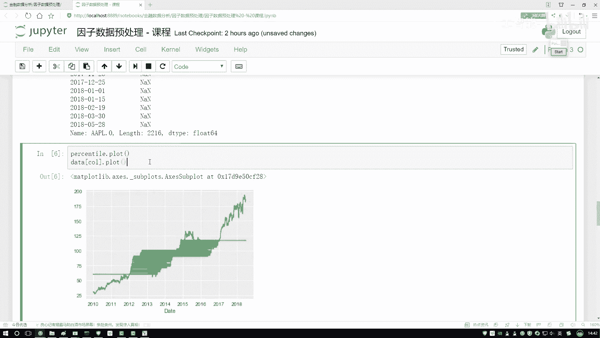

这样大家能够看的会更明显一些啊，他就是说呃这块它出现了一些什么哎，它有一些比这个当前这个值可能是60左右，比它小的，那应该等于是个蓝色的，这块呢有些大的，有些大的应该等于什么。

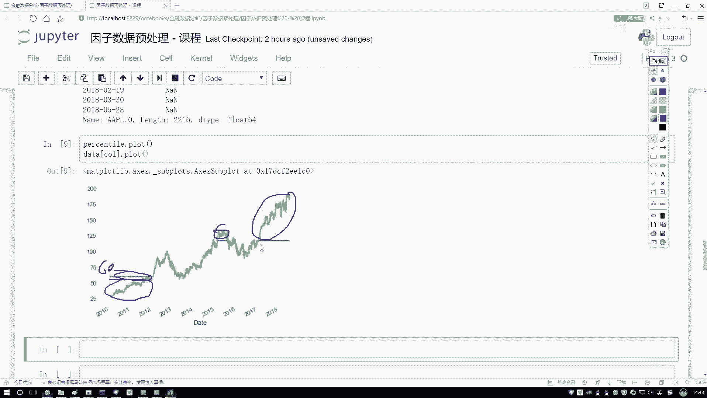

也应该是等于蓝色的，这个是给大家先从图上咱简单练就行啊，主要是说哎咱们的一个流程啊。

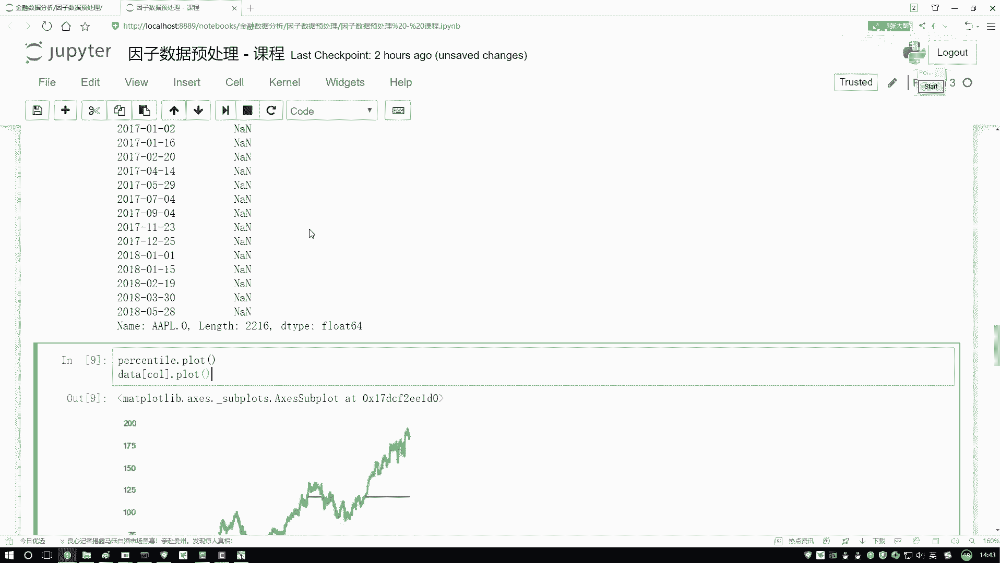

该怎么去做啊，这我刚才给他打印了一下，给他删掉行了。

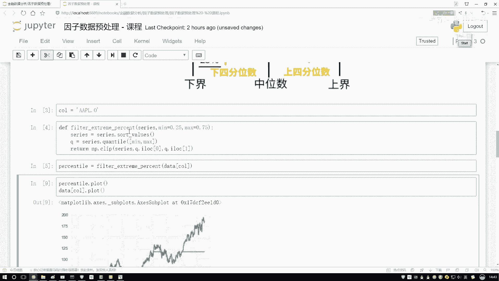

这样我们完成第一步啊，就是我们的第一种方法啊，在极值数据当中。

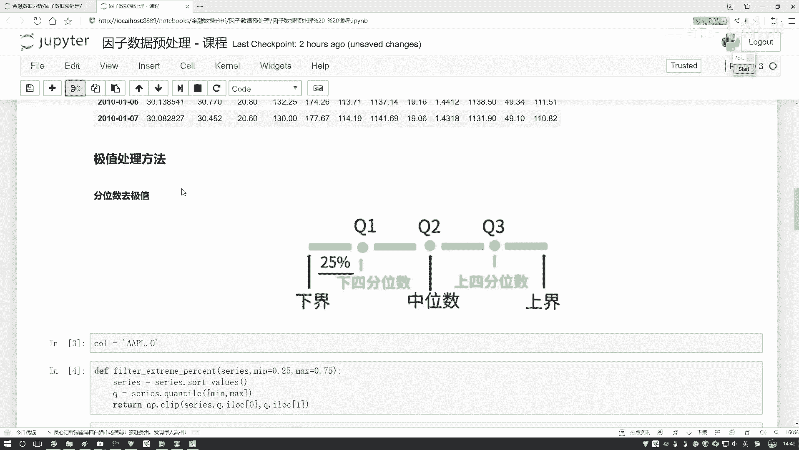

怎么样根据一个分位数去去这个极值，可能在实际操作过程当中啊。

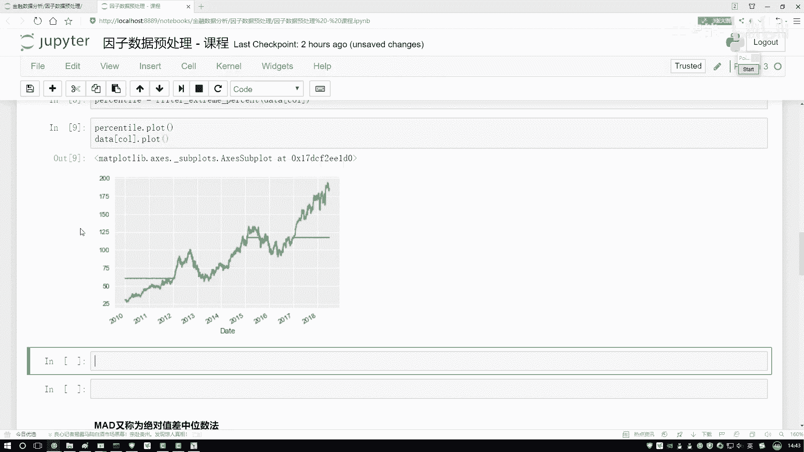

呃不可能说你指定个这么大一个值，0。250。75，这个相对来说也太大了，你把绝对多数值都当做是一个异常点了，可能在很多因子当中啊，我们是可能什么样0。025，0。975是吧。

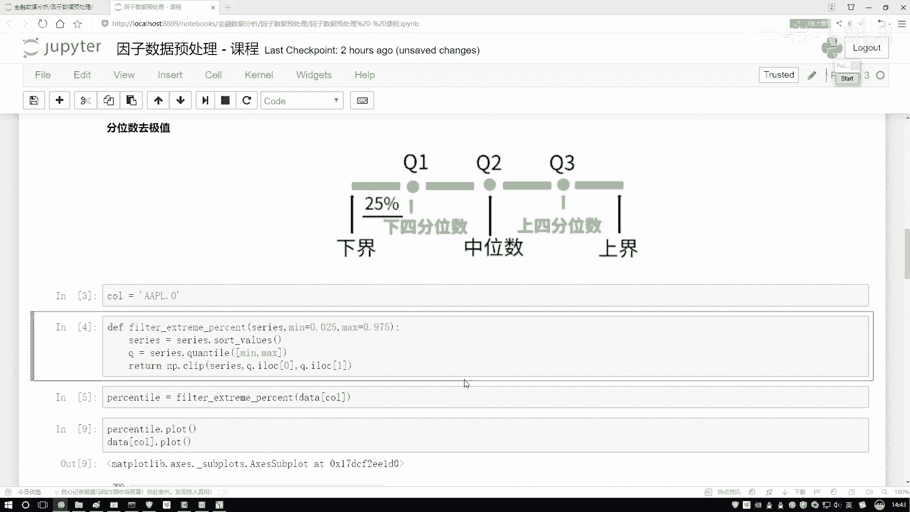

这两个值可能是会更常用一些，但是我们今天的例子里啊，为给大家展示的明显一点。

所以说啊，我把这个值，可能在有些地方再给它稍微的放大了一点啊。

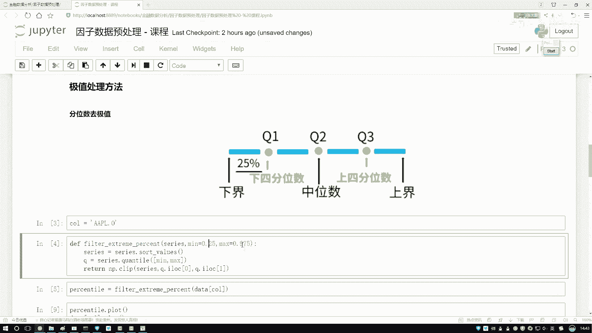

大家明白这个意思就行，实际当中啊，我们的范围应该会更小一些啊。

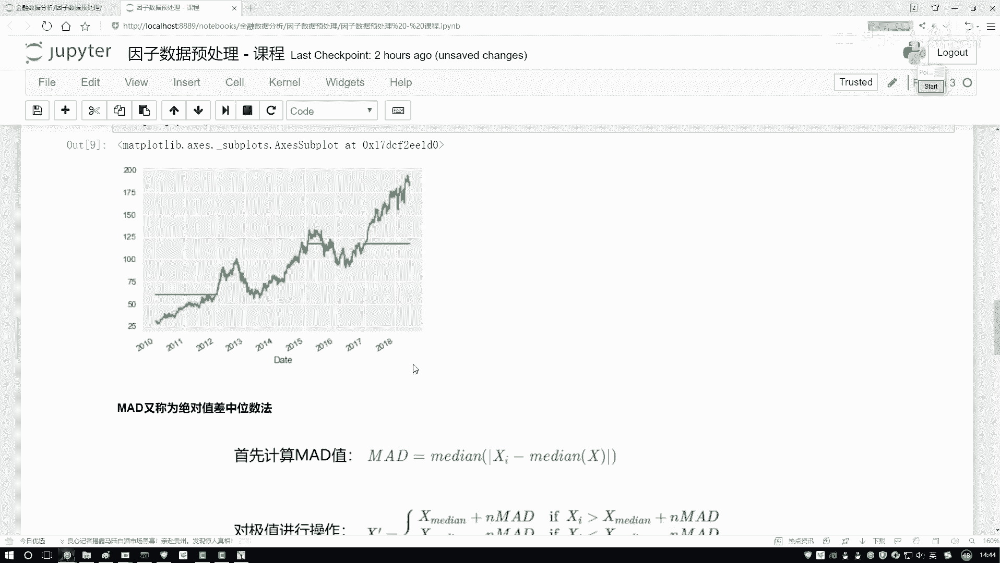