# 【比刷剧还爽！】这太完整了！AI量化交易实战课程，全程干货无废话 入门到精通一步到位！（数据挖掘分析／大数据／可视化／投资／金融／机器学习／算法） - P11：第一十一章： 量化交易的特征工程 - 机器学习教程 - BV1Km421G7nH

唉好，各位同学能听到吗，嗯我们过一会再开始啊。

我们再稍微等一下其他的同学，嗯行我看今天可能也不会有其他人过来了，那我们就先开始吧，嗯今天这节课程主要是给大家介绍，就是强化学习当中的q learning，然后这节课我们会简单的做一个呃。

一个一个小的project，是在呃就是在一个地图当中，然后让你的robot去最终去逃出，走到最终的这样一个目标，然后下节课呢我们会接着这节课的q learning，用写出来的q learner。

然后去尝试去去把它应用到股票的交易上，交易当中去，然后可能很多同学呃不知道呃，先问一下大家，就是了解过强化学习，或者说知道啊q learning是怎么回事的，同学在群里打个一，但是当然不熟悉，也没问。

没问题没问题，应该讲的我我觉得还是比较比较容易去接受的，对他并不会去向其他机器学习，特别复杂的逻辑在里面对，所以我们今天的课程大概是对，应该希望在两个半小时到三个小时之间，能够把这个东西。

小小的一个就是q learning这个东西给做出来，然后我们先看一下这个问题的，就是呃problem setting是什么样的，对，像我们提到这边是一个啊，我我们接下来会有很多的test case。

就是说每每个是一个地图，然后他是一个10×10的矩阵，10×10的矩阵当中，然后我们这是我们的一个起始位置，然后起始位置呃，在接下来的其实呃我我们的啊整个游戏是这样，就刚开始我们会从起始位置开始。

然后每次你可以上下左右各呃各移动一步，然后这个这个就是说我们对应到强化学习当中，就是所说的我们所做的action好，那接下来我们会具体的去formalize，说这个action是什么，那接下来就是说呃。

它我们的最终目标是走到地图当中啊，为salvage，也就是我们最终的目的地，然后这里面有几个有几个限制，一个是地图当中的这个一一是代表什么意思呢，就是说看这是一个墙，你不能过去，如果你走过去的话。

你还会就是你，你你是说相当于说你不能跨越过去，然后五五是可以走过去，然后但但但它它是一个流沙流沙的，意思是说你当你走过去的时候，你需要你你你的你的reward，就是你会扣很多很多的分，那整个呃为什么。

为什么说要去做这样一个的problem setting，就是说这很类似于我们的一个股票的交易，因为我们希望说我们的模型到最后获取，我们的目标是获取长期的一个收益，或者说是我呃我的目标是获取每天比较小额。

每每天尽可能去获取一个正收益，当然这两个目标的设定不一样，会导致呃你学习的模型可能会非常不一样，但是在这边呢，我们先是先简单就是说嗯，我们我们这个问题，为什么是是一个简化版本的模问题。

首先是我们每一步决策是一定是说是离散化的，我只有就说呃我只有说1234上下左右，就说我想向上向下，向左向右四种决策，但是在股票交易当中，其实呃嗯不是的，或者说现实生活中绝大多数问题都不是。

因为还涉及到说你到底呃除了说你交易的方向，你还有交易的标的，交易的你持仓的交易的数量等等对，但是呃我之后是可以有办法把嗯，连续的交易去想办法去把把它进行离散化，但是我们先考虑最简单的离散的模型对。

嗯然后我们先看一下，就是说我先把整体的这个模型给跑一下，给大家看一下是什么情况啊，我们最重要跑的是一个test you learner，然后在这个task you learner当中呢。

呃我们现在是说这是一个original的这样一个文件，这这也是我们待会去实现的这样一个文件，就是我们先先就是说如果说我们的每一步状态，就是说都是随机的，就是说先是随机的，我们来看一下会是什么样的情况呃。

Test q learner，OK呃，它会跑50个，就是跑50次，然后然后大家看到就是说这个呃对，然后这个这个零就代表是墙，你不能穿越过去，然后这边的呃at是相当于是一个流沙。

然后最终star这个星是你的目的地，这个点呃是你实实际上是你经过的路径，大家可以看到在随机过程当中呃，随机的过程当中，你最终很有可能出现的情况，就是说你把图当中每一个点，都是都会便利过去了。

然后最终你才会去走到这样一个目的地，对呃然后OK啊，然后我这边之前还写了一个，就是说加上了一些加上了q learning的部分，然后这时候看一下它的路径，就是给大家一个直观的感受，呃大呃先注意一下。

就是说之前的刚刚这个score是刚刚是-1000分，大概我现在是-33分，-33分是什么概念，先解释一下，是说我们这边的reward是什么呢，呃或者像我们先看直接直观这个路径。

大家可以看到跟刚才的呃非常密集的路径，走到终终点不一样的是，这边路径相对来说会比较直观，对就相对来说会比较直接，就是说最理想的路径当然是从就是说中间呃，中间最下面这个点了，对我们把它放到右边来。

就是从二这个点，然后向左走，再一直向上走，我可以呃逃过所有的阻碍跟流沙，我最终达到目的地，这样来说是是说是对我的惩罚是最小的，呃注意这边我把reward跟乘法放做呃，换到同一个，因为呃本质上来说。

我把我每一步的reward做成一个复数就可以了，然后事实上这个模型当中，我们也是这么来处理的，然后我们接下来具体看一下，就是说整个的process跑这样一个simulation，到底是什么意思。

首先就是说我们走进的是TESCO这个反函数，就说我我们今天整个要做的事情，就只是去implement这个QCOLEARNER这样一个class，对我们只需要去implement。

这两个函数其实并不会很很麻烦对，但是最终效果还是可以的对，然后刚开始他先做了一个事情，是load地图，那load地图之后，它把它变成了一个呃long派的array，对，比如说我读了这个CSV。

然后这个时候他做了一个事情，嗯这边是跑了epoch，是跑了OK跑到500，然后这个时候是初始化我们的q learner，这样的一些参数，而具体这些参数的含义，接下来我会去给大家一个个讲过去是什么意思。

然后嗯然后这个时候，然后这个时候他我嗯其实每次simulation，你要做的事情，就是说是去计算一个他的total reward，对呃，然后total reward计算在上面会有，然后我们这边是。

我们我们今天先去考虑non dina的这样一个q learning，然后有时间我们再可以看一下，就是DINA的q learning，其其实呃对，了解了这个之后再了解这个不会很麻烦对。

然后我们看看就说这个reward是怎么算的，就是说啊首先刚开始的时候是star position，这是我们每一张地图，你都会有一个你初始的这样一个位置，然后对我们找到这个二这都是你的位置。

然后三是你要去的目的地对，然后零是可以正常通过，所以其实是就一是相对来说是比较简单的，一个地图对，然后到了后面的地图，可能对他都会比较trick一点，可能就类似于迷宫，可能只有一条路径才能走过去。

然后正好也可以测试一下，就是这个算法的表现，然后啊这边有一个DISCTIZED，这是什么意思，其实其实说我们不是10×10的地图吗，你把这相当于一个二维的这样一个二维的，这样一个地呃地图。

你就相当于说是呃变成了这样一个state，state是什么呢，呃我们这边实际上是100个state，每一个你啊robot你处于每一个地点，每一个position，你就是说你处于二维矩阵。

每一个位置你都对应一个位置啊，都对应一个你的你的最终的状态，比如说000102，这是我们拿坐标对吧，但你我们可以把零呃零呃，我们可以把就是说比如说是D，我们从左上角作为作为起始地吧。

对我们把就是说嗯第五行第六列，那那你可以把转化成是说5×5乘以呃，SR5-1乘以十加上加上多少加上六呃，加上五对2+6吧，这样这实际上相当于说你是第46个位置，相当于说是说我把这二维的这样一个map。

你DISQUALIZE得到这样一个state，比如说我们这边的state，就是说你啊这个这个这个点处于每一个位置，都是对于这样一个state对嗯，然后是说接下来action。

就是我们的q learning要去做的事情，就是说这个是当然是初始化cue set state，所以说我们先是把整个的就是说呃整个的呃，呃整个的就是说我们刚开始的这样一个呃，就是说在初始的这样一个位置。

我要去做怎样的一个行动，对就是说这本质上我要return，就说我的action就说，所以其实强化强化学习过程当中，最重要的就是说一个是state，就是我当前状态是什么。

然后根据当前状态我要做什么action，那做完这个，接下来我们要看，就是说根据这个action我会得到什么样的reward，OK所以接下来就是说要做的一个事情，就是说嗯他说我没有到达最终目的地。

以及说我move次数小于1万次的时候，我需要去跟我需要去来移移动，我的这个去以我的robot对，那这个时候就可以看一下，就是说上面这样一个函数嗯，就是说他是要去根据你的呃原来的位置，然后根据你的地图。

然后根据你的action，就是说呃我在处于当前的位置，我做了什么样的行动对，然后来要要要来计算机的reward对嗯，这边是一个random rate，这边是默认是0。2，然后这这就是我们刚刚提到的。

说当我遇到一个流沙的形状的时候，也就是说这边的是，也就是说这边的state是呃，就是说如果我遇到的是，就是啊如果是五这个类型的时候啊，如果是五这个类型的时候。

我的我的我我的reward就会变成是-100对，然后嗯嗯OK，然后这边就是说，如果说是说是在random state的时候，那这个时候我不是采取呃，不是采取，更不是采取我的实际的就是action。

就不是我采取我是传进去的action，而是说随机在呃上下左右四个方向当中，我随机选这样一个方向对，然后嗯这个时候然后再去更新它的test location，test location的话。

这边一个是啊test呃，Roll and column，本质上来说，如果你向北移动的话，就是说你的row number要去减一，如果你啊向东移动的话，你的啊color number要去加E。

然后向南和向西也是一样的，对这边有一个对，这边也可以看到一下，就是old position呃，然后想想这边传建对，它传递的是一个二维的，这样一个就是row index跟column index类似。

这样一个东西，然后接下来就讲到他的，就是说我默认的reward都是一，这一轮就是说哪怕你不动呃，事实上你一般会去会去动啊，但是有时候你可能说是你超出边界了对。

但是我默认的default reward都是一对，那所以说我们整个游戏的目标是，最终我希望我到达long run来说，就说长期来看，我到达最终目的地的，reward是相对来说是不要让他付的太多。

或者说你你可以理解为maximize或者minimize，仅仅是一个符号的问题对，然后说这边有就是说这边有几个帮助，肯定是要去注意的，就是当你逃离地图的时候啊，你就说你如果要去新的位置。

超出了就超越界的话，那我那么就是说呃你需要还是保持原来的位置，就是对，因为reward仍然是一，你的地你的位置是不会去变化的，然后如果说你是走到了你下一步走到了这个呃，嗯就是走到了quick sand。

走到流沙这边的时候，那这个时候你的reward会变成new reward，会变成就是嗯就是-100，因为我们这边定义的是嗯quick send，reward是-100对，然后并且是对。

然后然后如果你达到了目的地，你这个时候是变成一这个时候，并且游戏同时结束，对最终的时候就是本质上这个游戏是说嗯，我要去根据我的地图的设置，然后然后希望让这个让我的这个robot，能够自主的去计算。

怎么去根据我当前的状态状态，然后以及我的得分去考虑我下一步的决策，对这其实也是说是q learning要去做的这样一个事情，然后我不知道这样的一个问题的设定，大家有没有先了解清楚。

对大家就是这对于这个问题的设定有有问题吗，那其实呃看起来代码有点长，但其实还是OK的，就是你每次的话，其实呃要做的事情就是嗯我写好了这样一个嗯，Q learner，然后我每次的话是我要去做的一个事情。

是嗯是在sorry，对你在test的时候，本质上要去做的事情是，你我要向这个learner去根据我当前的state，跟我的上一步的reward，能够得出我下一步的action是什么，就是我们的目标是嗯。

我知道当前的state是什么，然后我也知道reward是什么，然后我的q learner要去算出我下一步的action，这其实嗯就是说这个q learning还是非常嗯，类似于我们股票交易的。

我知道当前的市场状态是什么，然后我上一步的决策已经做完了，买卖或者是持仓不变，然后我也得到了最新的PNL就是我的reward，然后这个时候我要去考虑，在当前这样一个时间节点，我要去做什么，我要做什么。

Action，对其其，这这也是为什么我们要去考虑，就是这样一个就是rings spring enforcement learning，或者说我们在这边就是用它的，我们这边主要看的是q learning。

对，所以就本质上，他是说我们就是来做这样一个的呃，我们的位置会去变化对，然后那时候我们会根据我们的position，得到我们的state，就是我每次运动到不同地方，我的state是会变化的对。

嗯这块现在大家有问题吗，然后然后这部分呢就是q learning这一部分呃，对或者我不知道可能是不是讲的有点快，就是可能需要就是给大家一点时间来去理解，这个里面的一些细节对，但是没关系。

我们之后写代码的时候，也会慢慢来去跟大家来去，就是理解这些事情吧，对或者我先给大家看一会，大家先可以先先开2分钟，然后有什么问题再来问，我就是核心是在这一块，就是这是一个就是simulation。

啊我看到有就是有后来的同学，就是说我们今天讲的是就是讲的是q learning，然后我们现在是有这样一个呃问题的，这样一个setting，就是说我们会从我们会漏的一个地图，然后会从初始二这个位置。

希望这个robot能够自行走到三这个位置，然后我们考虑整个过程的这样一个reward，我们希望去就是minimize cost，或者说是maximize the reward对。

然后一是代表是这样一个抢对，然后五代表是这样一个流沙，然后一是过不去，然后五的话我们的就是呃，就是说我们的reward会变成会变成-100对，这个我看看这个这边地图对啊，不是每个地图都是有五的。

但一这个地图相对会典型一点，对，然后这边是用q learning跑出来，这样一个它的一些轨迹，然后这个来说相对来说这个是比较快的一步，总共用了12步就达到了目的地，可以说是一部都没有浪费，对。

OK嗯如果没有什么问题啊，我先来讲一讲，就是就是说可能现在大家看的有点懵，就是我们要怎么去做这样一个q learning，因为我们拿到的就是，就我们拿到就是这样一个呃function。

然后这个这个这个时候呢对我我什么都不知道，我只知道每一步的就是我新的状态是什么，我只知道我新的状态，然后我也只知道，就是说上一步的这个reward是什么，比如说我只知道上一步呃。

新的状态以及上一步的reward，要根据这个来去计算我的新的action，其实条件会有点少对对，但就是直观的想一想啊，直观的想一想，就是说我们在做股票交易的时候，就是说我们考虑的是什么呢。

我们做交易的时候考虑的是，我们固然要指考虑是说我当前状态是什么，就是说我当前有没有没有持仓，然后我也知道，就是说我上一步去做了什么事情对，然后我也知道就是说我上一步交易完，或者是嗯对我确定完之后。

我有一个reward，就是我的PNL对对，然后然后然后我就要去做，我这个时候要下一步要去做什么样的交易决策，但事实上我们在交易的时候，不仅仅考虑的是上一步的决策跟reward。

我还会去考虑上一步之前的决策，也会去记住历史上我每一次亏损或者是盈利的，这样一个呃记录或者是event对，然后这个时候其实我人工的主观交易的时候，我是把我历史当中，我每一次的交易都记在我的大脑里。

形成了这样一个模型去交易，那我现在其实q learning，本质上也是要去做这样一个事情，我我也希望说是把我历史上每一次的，state是什么样，然后我每一次state的reward又是怎么样。

然后我希望来去考虑根据，就是说如果说最最最如呃，如果说我当前的这样一个state，跟历史上state已经是重复出现过，并且并且在我们这样的一个问题的设置当中，呃，我们的state总共就那么几种。

那么一定是历史上出现过的，在出现这样一个相同的state的时候，我需要去，我需要去考虑怎么来做出最佳的这样一个决策，这也是我们就是q learning要去做了这样一个事情，对那为什么要去。

就是说是q learning呢，呃你可以说就是说呃，我们来接下来就是有一点点理论的一个部分，但是不会太多。

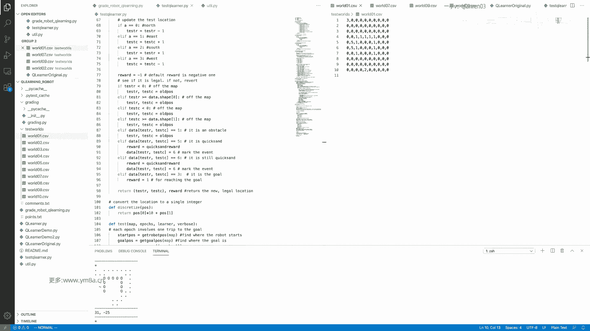

OK就是说，Hello，不好意思，刚刚可能网断了，现在大家有看到吗，OK呃刚刚刚刚我我们讲的是哪儿，不好意思啊，这个这个出了点意外对，对我们刚刚刚刚讲到哪里啊，是嗯觉得呃我做了不同的决策。

我都会得到相应的这样一个reward对，然后呃，我希望能说是我随着我做不同意这样的事情，我做的我的reward也会变得我做了是不同的事情，我得到了不同的结果，我的reward也会变得越来越丰富。

那这个时候我希望不断的去更新，我自己的这样一个q table，然后最终我就得到了说，我根据我的q table可以去指引我未来的决策，当我遇到相同的state的时候，我可以选择哪一个。

比如说我现在state100，我选择呃，我历史上做了这么多决策，得到了综合的这些reward，我选择其中最大的这样一个，所以对，那如果这选择这个这最大的并不意味着说。

在接下来我一定会获得额更大的这样一个，哎reward，哎sorry，现在网网网OK了吗，我想起来了，不好意思，我今天没有插有线网，对嗯OK那那这样我我我我设置一下网络，然后大家先就是先休息5分钟。

我把换成有线网，然后之后应该会稳定一些，OK啊现在应该现在应该不会断线了，就不好意思，我今天那个没有没有，就确实是没有切成有线网，现在切到有线网之后，我把WIFI关掉，应该会好一些了，对呃sorry。

很抱歉影响大家的听课的体验啊，呃大家大家大家大家千万不要睡着啊，这千千万不要睡着，这部分是看起来有点枯燥，但是对于接下来我们就是说理解，就是这两周我们都会围绕这强化学习这部分，来做一些文章，对呃对。

然后对这这一次的project的话，我还是希望这个大呃应该不会花大家太多时间，如果大家理解了整个的过程的话，我觉得可能应该一个小时到，两个小时之内就可以搞定，对代码不会很长，就差不多十几行吧。

对然后呃对然后就是说就是说本质上来说，q learning是相当于说我们人从小到大也会做呃，很多很多的事情，对，然后呃做很多事情说我们有些事情是做对了，有些事情是做错了，呃。

3号的话嗯那之后在面临相同的情形的时候，我们会去考虑怎么做事情呢，那我们肯定要去考虑在历史上我回顾到，比如说啊OK我当前又到了这个状态，对那这个reward可能是上次我选择了decision a啊。

我这个reward是-50，然后选择decision2的话，我这里word是-100，然后有-150，然后甚至负9999对啊，OK我们选一个正的吧，对那那作为一个正常的理性来说。

我当前处于stay three这样S3这样一个情形，我上次吃了这么多亏，OK那么我选择了action，肯定要是更考虑说嗯，选择我对我自己利益最大化的这样一个行动。

于是我自然而然的就呃sorry我利益最大化的，那我肯定会选择正50，也就是说我们查到了我们这action a，所以本质上q learning就是在做这样的一个事情。

所以说我们看整个q learning的process，就是说呃我会有一个初始的随机这样一个状态，也就是说相当于说我们刚刚来到这个世界上，或者说我们刚刚作为新手交易啊，我也不知道怎么去做。

其实说新手去做交易的话啊，完全都是随机的，然后嗯有一些啊有些说所谓的新手的运气，那可能是因为他运气真的是就是刚开始赚了钱，那是因为新手的运气比较好，有些人亏了钱，但总体来说应该是呃对相对来说。

在应该是处于一个可以说是均值来说，新手应该是都是会亏钱的，对，那不管，那我们说刚开始我们说我可以说initialize，是randomly，我不管用一个JK还是uniform这样一个分布好。

接下来的时候呃，我会有一个初始这样一个位置，state s就像我们刚刚初始的呃position。

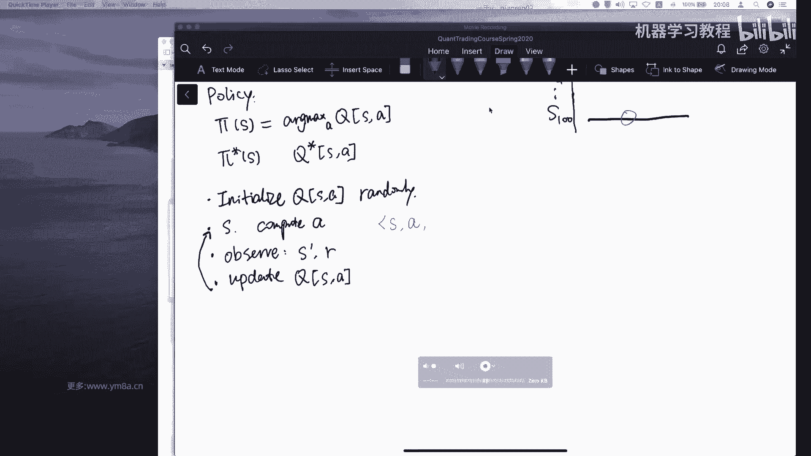

在这对，那得到得到了这样一个就是说呃初始的位置。

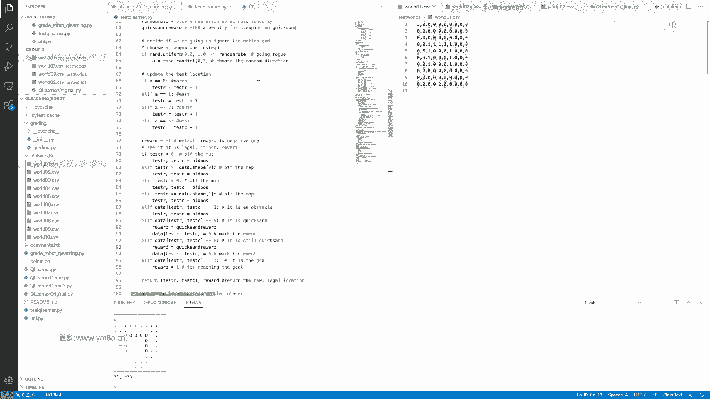

初始的位置之后呢，我们会去根据我们的这样一个table去查，我们应该去做什么样的computer，我们的a action，那得到了我，我们既然做完action之后的话，我会得到我新的的state。

同时我也会我根据我上一步的action，我也会得到相应的啊，得到相应的这样一个反馈呃，对得到这样一个相应的反馈之后，我再会去呃得到，就是说得到reward之后，我才会去考虑说更新。

我得到了新的这次进经验教训，比如说我这次选了action a ok然后是真的是挣钱了，或者是那选了就选了action1，我真的挣钱了，那这个时候我考虑说我要更新我这个表格，比如说把正50变成了正百对。

所以说，然后我们可以不断的去循环这样一个过程对，然后我说在整个过程当中，其实我们比较关注的是什么，是呃是当前的state，然后我当前的action以及我根据当前的action之后呃。

我得到了新的state，以及在这个过程当中得到的一个reward，这样一个突破是我们比较关心的这样一个事情，那接下来的时候嗯，嗯我们就要考虑说我们来怎么去计算，我们的这样一个就是最核心的是。

我们怎么去计算，我们来怎么来update我们的rule，Ok，然后我刚刚也提到了，说我们在上面的这样一个guiding的principal，是immediate immediate。

然后加加一个discounted对嗯，首先我们在就是在machine learning当中，如果大家学过就是steep descent，就知道有一个就是说我在下降的时候。

有一个叫learning and，就是啊其实不管是哪个，你任何一个就是有梯度的算法，你都会有一个叫呃learning rate，阿尔法，learning rate阿尔法，然后一般是。

0~1OK那这样的意思是说什么呢，我们上面考虑说是我会去考虑我discount reward，然后加上一个immediate reward，然后那如果我们用公式来写的话，就是说。

啊记住是这是我更新的这样一个q q table，然后我要去，把握历史的我回去记住1+2法，其实这个是我历史的这样一个q table，然后接下来呢我要去根据我的learning rate。

我选择一部分去学习，我新的这样一个improved estimate对吧，这部分大家可以理解吧，就是说我学习的就是说啊记住记住这，这这个是一个你就是说我们这是q table。

你可以理解为是矩阵当中每一个元素了对吧，然后这第四行第A列，然后你说我会去考虑说，记住我当前历史的这样一减阿尔法，然后加上我新的improve的一些estimate，然后咳对啊，然后这这这个时候你知道。

其实就是想的是说我们improve estimate，怎么去来做，额这个时候可能又要去引入一个新的参数，然后我们说一般这个阿尔法我们取0。2，然后我们这个时候会取一个discount rate。

我们叫伽马，也是0。0到1。0，那这样一个呃improved estimate是什么呢，首先我会有当前的这样一个reward，呃同时说啊我需要去考虑，就是说为什么他是要一个叫呃discount。

我会去考虑这样一个伽马，还要记住这里面就是说有一部分说是，这部分是什么呢，就是说我会考虑说improved estimate，我会考虑嗯，我新的state，然后这个时候的action是什么呢。

就是说我会去考虑说呃action，我要去考虑使得我在新的这样一个state的情况下，我要做出找到最大的这样一个A，然后再去找到我新的这样最大的A的，这样一个在当前的这样一个Q。

在这样一个当前的这样一个q table，去找到他这样一个值，对这部分可能会有点绕，大家可以去想一下，然后这个时候也是会类似的呃，伽马啊，伽马的话哦，想一想啊，默认的应该是呃，Sorry。

这个我有点忘记了，待会我可以看一下这个是多少，如果记得不错的话，应该也是0。2对，然后如果你把整个合起来的话，呃，对我们会得到这样一个，我怎么去更新我这样一个q table。

然后加上阿尔法一个reward，加上一个discount，OK呃大家可以先对着这个式子呃，看一会，对啊这这也是到今天可能就是最最theoretical，最理论部分就到这就OK了，对。

其实其实我们这就是就是说，接下来我们就是来看怎么就是实现这个公式，就是说呃我们为什么要去这么做吧，或者说就其实整个的principle，就是说我在根据我得到了新的，就是说我怎么去把我历史的经验。

跟我当前的reward去结合在一起，其实考虑的就是这样一个，这就是这样的一个事情，然后记住q learning的话，其实不只说这一种，也应该有其他这样一种，也有其他的这个函数。

但是说我会觉得这种方式是还OK还挺不错的，对就是说呃对对，相对来说其实它实现起来会比较简单对，因为我们涉及到的一个是说，我把这个是我历史的这样一个部分记住了，我取了80%对吧，然后我新的我20%。

20%，除了说是我现有的这样一个reward，然后我还考虑了说是在新的这样一个状态下，要记住这个这个S是s prime，prime是可以得到的，因为只要有了呃，有了当前的，就有了历史的。

这样就是商业部的这样一个state，然后我又得到了action，那么我们就可以自然就可以得到。

就是新的呃新的这样一个state对吧，因为因为在反映到我们呃这边里面是。

只要我走完，不管是向哪个方向走一步之后，我都会得到新的这样一个as prime，对我得到了这样新的一个s prime之后，我要去查这样一个嗯q table，但这注意说我查的是在新的state下。

我会去查什么样的一个QTL，比如说我从S3走到了S4，那我要在看S4的情况下呃，对怎么来把我的额额，我来把S4的情况下，然后我找到了我其中最大的呃这样一个action，然后我去查到呃。

然后把这个对应的action这样一个呃reward给返回，对二，把这样不是不属于我是一个Q值给返回，对，其实说我就要找的是最大的这样一个呃，Q值对吧，所以这边也是qs prime呃。

对但这注意的时候这个是对对这这个的呃，as prime的不一定是就是说是呃呃对，这个这个是一个s prime，然后就注意这个是啊，这边的a prime为什么要用a prime，它跟A不一样。

对就是说我不是找的，我这边这边不是说是我在新的状态下，我仍然采取上一步这样一个行动，那显然是没有道理的，我考虑的是在新的状态下，按用旧的这样一个q table，我仍然会考虑呃。

我我仍然会考虑做出怎样的这样一个，还要考虑呃，我仍然要去做出最优的这样一个action，然后把历史上的把在新的状态下，在旧的表格的这样一个，旧的q table里面的这样一个值。

我把它按照一定的discount再去乘进去，对如果简单的理解来说是这样子呃，大家可以再想一想，对其实仔细理解一下，它并没有很麻烦，就是说我在更新的时候，其实说我需要去记录历史。

待会也要去去考虑加入新的东西，对，就如果说我丢掉了伽马乘以这一项，也相当于说我不我就是说我没有考虑说呃，我新的这样一个state呃，会去对我的这样一个CUTABLE会造成什么样的影响，对吧。

那我只有我只有说是我家，我不仅仅说是说呃就有q table，然后我我就是说不仅仅说我要去算新的q table，但同时说新的q table，我对于我就是说新的action要去把它去纳入。

因为如果是没有新的next action的话，呃啊对这部分会这部分会有点tricky吧，我觉得，我不知道我给大家讲明白了没有对，那个那个对哎那大家先就是先课间休息10分钟，然后对。

然后把这部分也可以去理解一下，然后嗯不是特别理解的话，可以去课间时间再去搜一下，就是q learning到底是怎么回事，对我我我已经就是说我尽力给大家给讲明白，对，然后下节课我们再来看看。

就是说我们怎么把这个游戏再去，然后有了这些概念之后，我们再来去再去进一步详细的去解释，这样一个project我们怎么样去做好吧，好那大家先休息一下。

OK嗯同学们，我们现在回来哈，然后嗯，这个时候的话，Sorry，刚刚提了这边R啊，伽马的默认的rate是呃，零点是0。9，不是0。2，所以刚刚对刚刚那个是给大家说错了嗯，OK然后的话是，The uh。

所以嗯大家现在就是对于这一块，就是我刚刚讲的就是整个问题的setting，就是我不知道有没有有没有给大家讲清楚，然后就是说我们现在用q learning这个算法，来去尝试说实现应用到这个。

应用到这个问题上面去，嗯就是如果刚开始的话，OK呃我们先就是print一下，是我们输入的是输入的是什么，Sorry，Um，Print data，就我们这边输入的是额word01。

然后我们把它读成一个矩阵，怎么样break这rap呢，UAIT知道可不可，啊大点work，OK我把，V我把VERBOX改成false，然后再print这OK，就是说我们的input是这样一个地图。

然后呃实际上传进去是一个two dimensional，这样一个呃二维的这样一个array对嗯，然后嗯，然后这个时候我们要做的就是事情是嗯是Q呃，就是INITIZE这个Q啊，Q learner。

然后我们这边用的是小号这样的q demo，然后我们我们还是回到，original对，OK大家这个时候可以看到，就是呃我们用的是NDA的这样一个SCREWARDING，看这个是接近-1200啊。

-1200大概什么概念呢，可能就是我们不是说嘛，在一次那个流沙当中是-100，那差不多得跑了可能好多次对吧，这个是然后是对，就是对，50次的这样一个应该是是或者是平均对，然后嗯对，然后我们来看一看。

就说这个要去怎么来去做吧，就整个问题是呃我们刚开始会去input，就是说把这样的一个地图给输进去，输进去之后啊，然后要做的事情，就是说我们不是有500个epoch吗，然后这个时候然后去算。

我对于这样每一个epoch都会去，就是我都会去算一下他的reward对吧，然后我的input是什么呢，就是说我的我的我的这样一个learner，然后对啊，我们把它先变成，一每次就跑一次。

然后verbals改成true，他每次都要跑，啊每次都要跑50个吗，但，49OK哦，想一想OK，Step，Epoch range，我是1~2，Two tone uh e。

OK比如说然后嗯刚开始的还是好get a，我得在这边把它给count等于main time out，门boss他会print哦，Sorry，来去练break，Dream，我希望他只跑一次，看一下是不是。

哦OK，77嗯，OK这边是只跑了一步啊，如果把它去掉的话，诶奇了怪了，好吧，我们先看，就是我们现在就是说我们要实现的，这样一个class吧，就说我们在实现的这个过程当中说是呃。

如果我们刚开始默认的action的话啊，在这边就是我们会是一个随机的这样一个action，对吧，嗯嗯比如说我们会选择是呃，我们总共是self number actions。

总共是number of action，总共是四个，也就是上下左右，所以我们会选择呃random in当中的说任意呃，任意一个对，然后如果说对，然后相应的相应的来说我们这个时候嗯。

然后然后然后这个时候就是我们的计算的reward，这样一个过程会通过啊，move bottom这个函数来实现，然后我们我们回到就是说这个例子的话呃，就刚开始的例子，如果我们是在二这个位置。

然后我们随机呃上下左右四个方向，不管怎么样，其实reword都应该是一啊，我们可以看下这个逻辑是怎么处理的，就是首先是说old position的话，应该返回的是九五呃，是呃对，是返回的是啊。

应该是九五，你可以print看一下，Uh what uh，Okay，这个人是有随机的吗，嘶，OK他每一步sorry这样太长了，比如说我们首先可以看到它返回的，是这样一个呃每次这样一个position。

然后嗯然后嗯然后如果说是我们朝北走的话，嗯这边是那什么都没有，就是正常是可以走，OK那这个时候word会变成一，然后同时它的呃column会也就是T呃呃sorry，向北的话是roll会减一对。

roll number会减一，然后其他不变，所以这个时候你可以返回它的那new就是新的test，这样一个呃roll和test column对，然后对，然后这个时候从reward里返回，这个是相当于说。

我们每一步是走到这样的一个过程，但是如果说举例子是从八，那就是说从这一行呃，呃第八行，然后第三列，然后你这个roll index应该是七三啊，七二对，那如果是七二的话啊，如果是我接下来也是要向北走。

那这个时候会遇到什么问题，就是说当我的呃一层obstacle，就是说我遇到阻碍的时候，那我的位置保持不变，相当于是我没有走对，但这个时候我我仍然是一，我仍然是保持这样的一个位置对，但其实可以去想的话。

如果我每一次，如果我每一次都是采取相同这样一个角色，接着向北走，我的reward只会不断的会变得越来越富，越来越富，但事实上就是说总归会到某一个极点，我的选择向北走，这个reward会啊会超出嗯。

会使得会使得就是说呃会使得是说远远的超出，选择其他方向的这样一个reward，于是那么自然而然我们根据q learning，刚刚我们说我们要选择optimal这样一个action。

使得我的这样的一个Q的值是最大，那自然而然他就不会去选择向北走，而可能会选择是向左或是向右对，这就明白了，这这个里面主要的逻辑是这样对，然后如果是在就是说是在如果是向北走。

遇到了五沙地里就是流沙的情况的时候，这个时候quick send reward，我们这边定义为是-100对，那定义-100的时候呃，呃同时他又会说把就是说我原来这样一个data。

把这个地方标记为这样一个六啊，这也是我们之前就是大家看到的，算了，我这边PRT一下，然后呃我不知道它返回的是copy还是原来的嗯，OK你说如果是走到五的话，那这个时候说是呃。

我会把这个就是说我这个地方就是标记成呃，标记成这样一个标记成六，然后如果接下来是六的话，说我接下来还是会在呃会在咳咳，会在流沙里面，那相对来说是说我现代里面的话，就是说呃会reword会变的。

就是说其实会增长的非常快，就是说一定要去想办法就去走走出去对吧，然后那其实我们要做的事情呢，呃大家要想着说，我们要去做整个整个这样一个q learning的话，我们先一步步来尝试做吧。

就是说刚开始的时候是我们是呃有这样一个action，对吧，呃那其实我们先试试看啊，我们先不看，就是说我们接下来每一步仍然是这样一个，QY哎，就是QY的话也然是这样一个随机的。

大家看到就说我这边没有做任何变化，都是啊random nice，然后就是说我零到嗯，Number of actions，就是我总共有四个action，我随便选，我既然都是随便选。

那我们先做先做了一个事情，说是我能不能在呃初始化的时候先去说，我不再是说是不再是说直接的是这样一个啊，Random number，我先根据我的随机给定一个q table，然后让他来去额。

选择这样一个初始化最大的一个方向，那么因为刚刚我们要想到说。

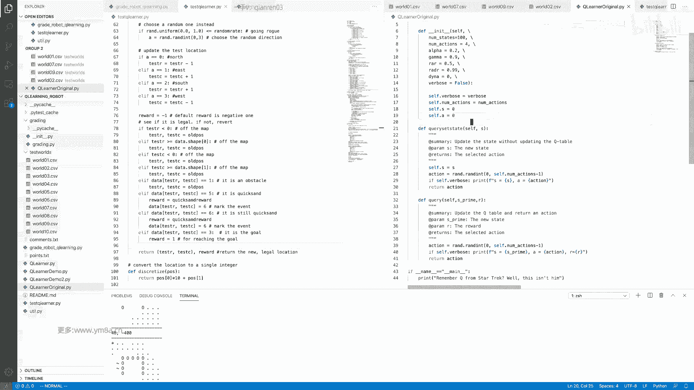

我们的q table是什么来着，我们说刚在刚开始的第一步是呃。

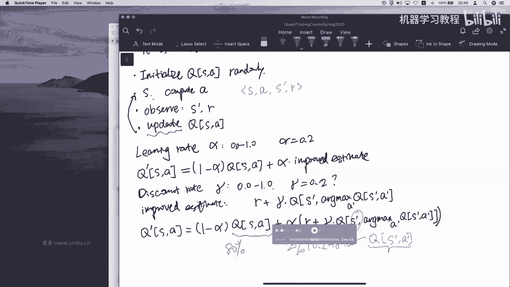

要做的事情是啊，Initialize a que table randomly。

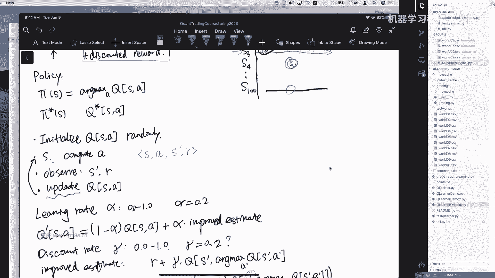

那这边的时候我们要做的事情，就是说我会选择呃，比如说我就用一个uniform distribution好了啊，这边对我这边我把它写成Q，然后这个时候，哦NPKU这个时候他的dimension该是多少呢。

有哪位同学可以告诉我，就是说我我我要做的事情是对，每一个state我都要给出一个action对吧，我这边用uniform，然后选择是-1。0到1。0的这样一个。

然后这个是一个matrix的dimension呃，能告诉我哪位同学可以告诉我，他的维度是多少呢。

就说我们要啊，就是说我们q table，然后回到我们这个图吧，我们q table是什么。

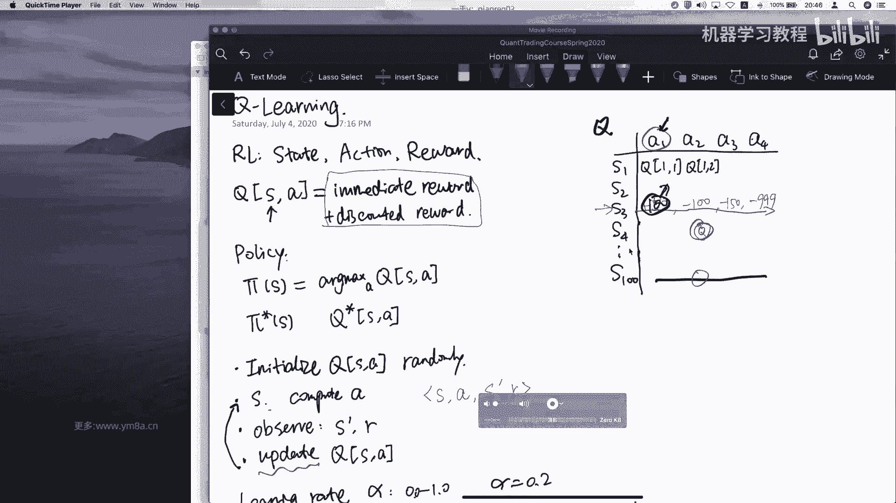

就是说我们之后都要去维护这样一个q table。

所以我这边才把就是写成是这样一个，class的属性变量，我们之后都会去更新self点self到Q对吧。

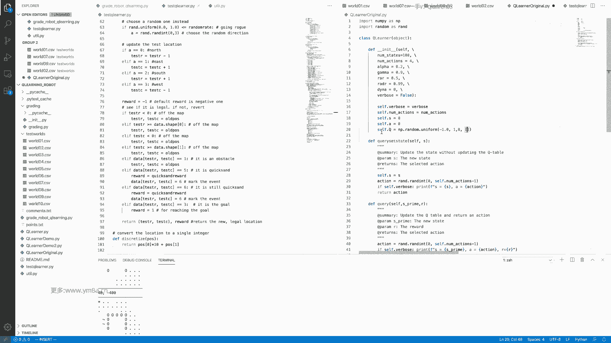

然后对，其实这个这个图影已经写出来了，就说我要根据每一个state，都要给出这样一个action对吧，01240123，但我们这边先做的事情也是说我就都要给出，Sorry，这边不不是0123对。

是我这个q table，是要根据q table给出这样的不同的呃action，但我CUTABLE里面实际上是什么，我刚刚说的是是我们的reward对吧。

我们reward法function在下面对我们他要回来实现这个，那哪位同学可以告诉我，他的就是q table的维度是多少呢。

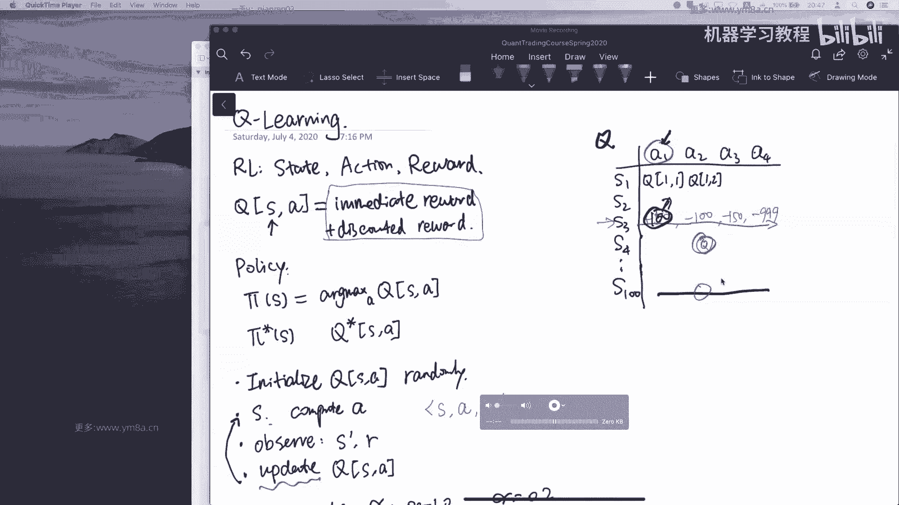

这个问题应该不难吧，其实我已经写在这边了，对，又说我要根据我的每一个state，都要能从这个q table找出对应的一个action对吧，哎记住我们这样一个q learner的class。

不仅仅说是说是对于我这样的一个game，你没发现，我这个里面没有涉及到任何的什么position，我没有任何的position，我我只有我的state，我只有我的action，就理论来说。

我把这个class稍微去修改一下，我是可以无缝的应用到股票的交易上去的对吧，我要修改的仅仅是我的一些state，然后reaction对，因为相应的股票的时候，我在确定的时候，我只不过传传进去的时候。

我都是呃我的reward是能记住，不是说有这个class来去负责计算的，是由我这个test culearner来计算的，相对来说如果把它改成股票q trading。

我只要传入新的reward function就行对吧，所以所以说就是说我是说理解这个class是怎么，q learner是怎么去运作的，我觉得还是比较重要的，所以希望大家能跟我就是一起去思考吧。

对这个这个这个这这个dimension到底是多少，就说我们我我要做的事情是根据这样一个q table，从不同的state，然后找到这个state对应的呃，几个action当中，reword哪个最大对吧。

那么那么这个dimension是什么，我们刚刚知道我们这边number of states是在这边对吧，所以其实其实我们刚刚说的是根据我的number of states，uh呃呀140。

然后当然我们是记录的时候，我们这边是如果就是cos变了之后呢，对所以这边其实就是number actions呀，很好对，我希望大家就是跟我一起主动去思考对呃，因因为其实也是在理解。

就是说我们整个的整整个的这样一个q learning process。

到底是什么样的对，因为我们记住，我们其实就是在import这这样这样一个事情对吧。

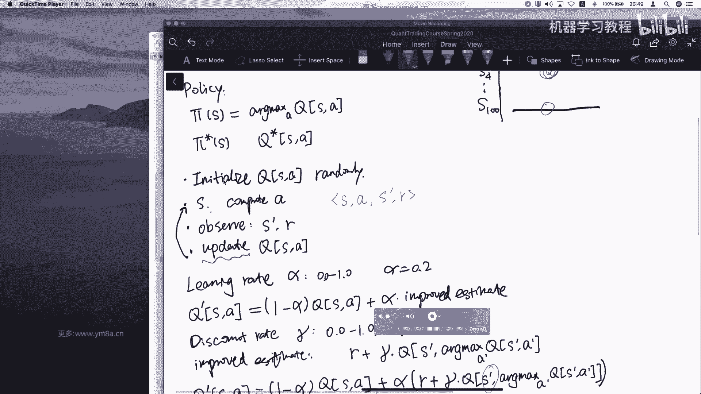

我们现在其他都没有变哈，然后的话，嗯嗯我现在仅仅是把刚开始去编一下啊，对啊呃all right，然后这边有一个对，就是说这个RER是什么意思，也就是说呃我们希望在我们的q learning的过程当中。

需要去引入一定的随机性，我不完全按照我的q table，始终不是说我始终按照我的q table去找我，在一些情况下，就包括你大家在看test的时候，你会发现就是他的action呃。

我忘记哪边是有一个rate来的，OK在这边，就是说啊这边他在move bottom的时候，他已经有一个random randomly，那其实我们这边做的是一个，类似的这样一个举动，比如说我在Q呃。

就是curious set state时，在刚开始第一个action，我也希望是类似于去引入这样一个啊随机性，在里面一部分情况下，说是比如说我用的是我的这样一个呃0~3的。

零到number of state，a number of actions的这样一个random的操作，这是一个记住这个是一个uniform的呃，或者说对他就是说四个概率是一样的对吧。

就说我number of的number of actions不同action的概率是一样的，那这个时候就说一一部分情况下，我希望是这样子，然后呃在另一部分的情况下，是我还希望的是。

我要去选择我的这样一个呃，选择我的这样一个最大化的这样一个呃action，那这个时候大家就要想一下，就说我这个action是怎么来去做的，我我刚刚说过是啊，Uh maximize。

maximize q对吧，然后这个是呃我的state是s max mice，然后我要选取我的这样一个action对吧，还记得我们刚刚说的arg max。

其实本质上是在呃在这边arg max对，就是说嗯，其实在我就是我们第一步，或者说接下来每一步都一样。

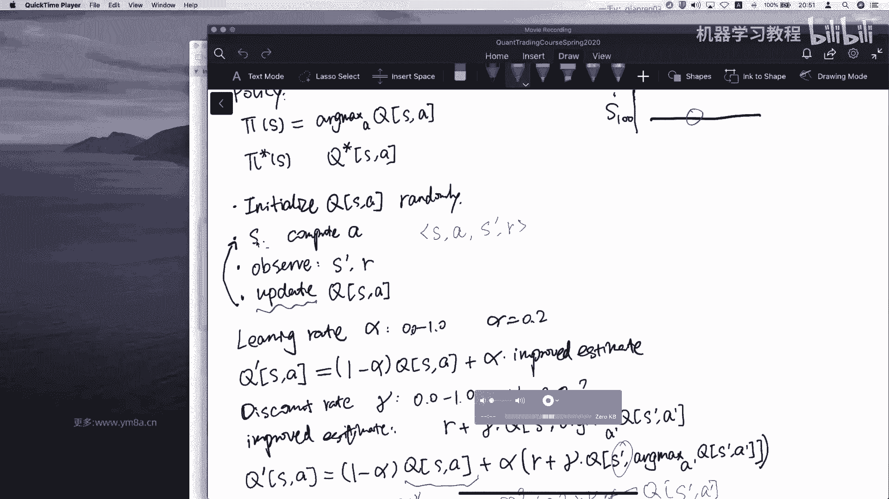

我要根据我的state去compute这样一个A，我们这个A是怎么computer出来的，选择的是对应于我的这一个state的时候，对于这样一个state。

然后我要去maximize的这样一个action，那这个值到底是什么呢，这个值是什么呢，呃大家记住啊，就是说我的action，这边是因为简化是说呃我的行和列。

其实我正好是action number of faction，就是总共是四个，然后是0123，其实正好对应的是我的呃，就是相当于是我的column的这样一个序号。

但事实上我说我完全可以说我把我的number actions，就是说哦我变成我还是四个，但是我的action action的序号，我可以不不是说用0123，我可以用5796，就任意一个。

或者说用数字ABC呃，用字母ABCD来代替都可以，但是这边这边数我们正好是讨巧了，我正好是零，对应的是action0，就是第零列是对应action0，第一列对应的是action1，所以在这边的话。

如果我们要去选择啊，maximize的就是说最大的这样一个column的话，而maximize这样一个Q的话，其实我选择的仅仅是他这index对吧，不然的话其实是我还要去去，相当于是查个表。

去看一下我的index的这样一个值是什么东西对吧，因因因因记住action本质上是0~3的这样一个，现在是因为是零到number of actions对吧，额那么这边是什么呢。

就说我希望的是这个时候就有一个RA2，再过来吧，叫啊reward action rate，然后这个时候我可以在这边初始化，然后下面还会用得到，如果我产生一个，那这个时候怎么办呢。

那就是直接是一个uniform的就好了，呃呃或者，对，我就用南派点random点uniform，那这个时候我跟他去比，如果说是小于小于它的话，我就是说按照这样的，就是说我以这样的概率去呃，随机选取。

如果是另外如果是说然后以另外一部分概率说，我要去选取我的这样一个额最大的这样一个action，这个记录是我们的，这相当于就是我们的q table去查表了，这样一个表格，根据我当前的state对吧。

我相当于说把这一行的所有值都选出来，然后选出其中最大的这样一个序号。

对这就是我的action呃，大家可以再看一下这个表格下来，我把这个对我假设我查的是S3对。

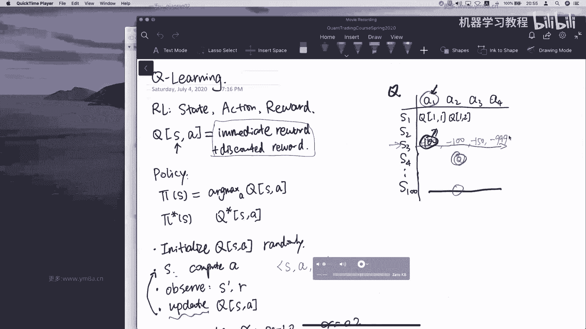

然后我找到了其中最大的这样一个的index，Which is a1。

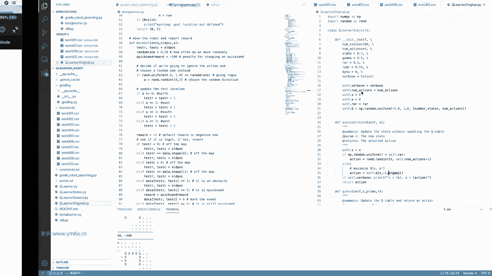

然后我们这边对就返回这样一个action，然后为了方便的话，我会在下面就是把我会把我的action给保存下来，因为我们之后会用到上一步的action，好吧。

就这个时候我只是在变了一个初始的CURISTATE，那相应来说应该不会对他产生特别大的影响，我们这个是要改成我们的original，没问题，Number of states，Okay，Number。

对我希望大家跟上我的思路哈，就是sorry uniform，我这边是不是参数传的太多了呃，q learner的话，如果是，Number of，Non irender，点uniform。

然后两个参数哎没问题啊，为什么呀，Three positional argument，Argument，OK果然1。0，好这应该是没有什么变化，甚至某种程度来说，加上初始这样一个初始化。

它可能还变得更差一点，但whatever没有关系，然后接下来就是说，这是我们涉及到我们这样一个很核心的，就是说我们初始化之后，然后接下来我们要去更新我们的。

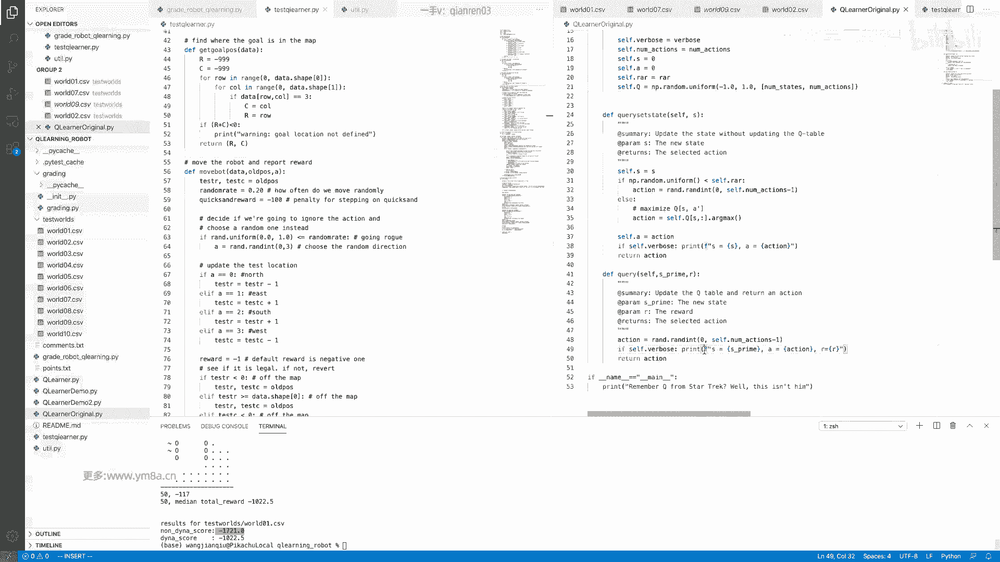

还记得我们整个的流程，我们在这儿computer，然后我可以observe我的s prime。

然后得到我的reward对吧，然后就是说我已经呃，我已经就是说在这边的时候，在move bottom的时候呃，move这个move move的时候，Move but，然后他会在这边，是我们在这边呢。

是有一个我在每次移动的时候哈，我给了这样一个action，他会告诉我新的呃position，然后也会跟告诉我这一步的reward，然后根据我的reward的时候。

然后这个时候我可以根据我新的position，去计算出我的state，对吧啊，这个这个state其实就很简单，因为我们是相当于把坐标去进行离散化了，哎对吧，我们是10×10的坐标。

然后变成了0~99的这样一个状态，所以我们在这一步的时候，我们已经得到了，就是说哪些哪些是确定的哈，我们现在可以确定一下，就是说我上一步的state是有的，然后我查这样一个q table。

得到了新的action对吧，我呃得到了这样一个新的action之后，然后我要去借，这个时候我也能计算出或者叫observe，我观察到我新的state，也就是说有些或者说新的position。

这两个音乐是可以随时转化过来，然后也得到了我这一步的step reward，然后这个时候我要去记得这个时候要做的事情，就是说我要去update我的q table对吧。

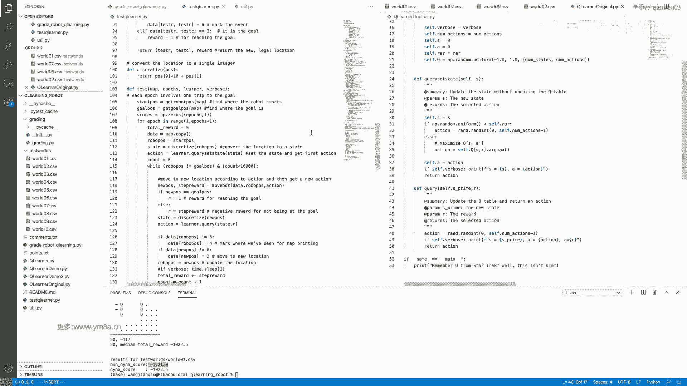

这个过程有了state，然后有了action，然后我得到了我新的state。

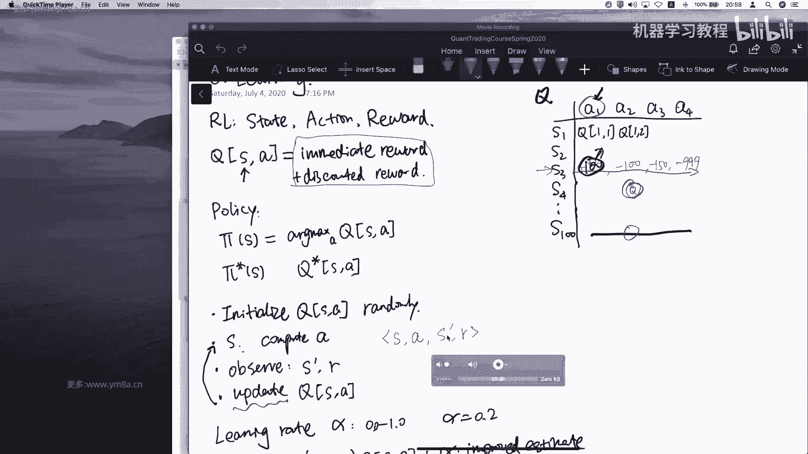

然后得到了reward，我这个是要去update我的q table，那么我们怎么来update我们的q table呢，额为了这样子的话嗯。

这样我们写先写一个方function update cutable呃，这个时候谁可以告诉我说我要我需要update cutable，我需要哪些参数呢，对吧，还记得我们提到的四元组吗。

这样其实我们需要的update我们的q table，仅仅是这个加上我们原本的Q对吧，所以我要去，我相当于说我要就是传入我的，四个状态不是四个状态，这是我的原来的状态，self fs对吧。

我们这边已经保存了curious state，然后what action，然后是我新的state，然后我的reward2对吧，然后我们把它放到这边来，可能会方便我们处理一点嗯。

还记得我们的q table要怎么去update吗，a s prime和我的R呃。

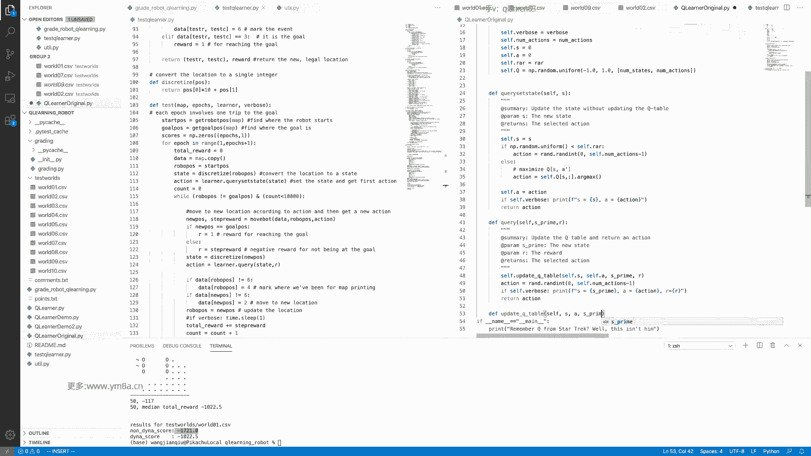

我们回到看这个函数，说我们先拆开，先分两部分。

不用着急啊，先分两部分，我们知道的说是，我记住我们不能我们更新的是什么，更新的是仅仅是QSA，我们注意我们不是一次性更新，全部的这样一个表格，大家需要理解清楚，因为我只在这个状态下去更新了。

那时候我注意的是我在state情况，我在state s在action做出了action a，然后我现在去更新我这样的一个更新，我这样的一个就是说是我的这样一个q q table。

那这样q table怎么去更新呢，我们说是分成两部分对吧，一个是，It it reward，然后另外一个是this content reward嗯，然后我把这两个加起来，对吧，那么。

Discounted reward，然后这个时候我们知道是说discounted reward，是什么类。

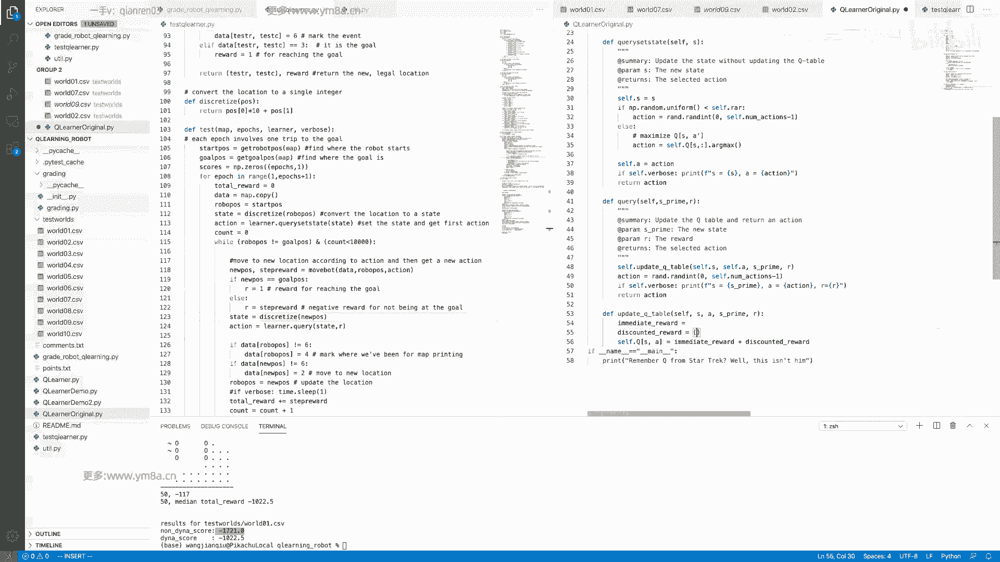

我要把过去我做的这个很好实现，对不对，就是一减阿尔法乘以QSA，我把我上一步的，就是说是之前旧的这样一个q table，我把它按照一定的权重去记住历史的对。

那这边我还需要，Self dot alph，对吧，这个参数我下面需要用到，然后我这边在做的事情，就是说，一减去阿尔法，这个很好做对吧，阿尔法乘以QSA，对了sorry，这个应该用self。

要注意我们这边就是比较方便的，是因为我们用了南派的这样一个ray，所以其实正好就是可以用，就是用QSA这样一种方式来去访问它的index，也就访问到它的这样一个q table的值了对吧。

这部分是比较OK的，这部分现在大家能够follow上吗，能够跟上吗，那记住我们说这分为两部分，我们一步一步步来嘛对吧，一个是immediate，然后一个是discounted对。

但是现在discounted这个很好做。

因为就是说是历史的对吧，我们阿尔法是零点，0。2的话，就是说80%我要记住上一步的。

那接下来要去做的事，就是说我要用阿尔法乘一个improve estimate，对吧，OK呃那这个improved estimate是什么嘞，比如说首先是由我们这一步的及时的step reward。

R对吧，我这一步的拿到的step word是多少，是R对吧，然后那还有什么呢，是我还记得我们有上面一个伽马的参数吗，我希望我去记住一部分啊，你说我需要要去记住我的一部分的用用什么呢。

这个时候这边要比较tricky的一部分，就是说是。

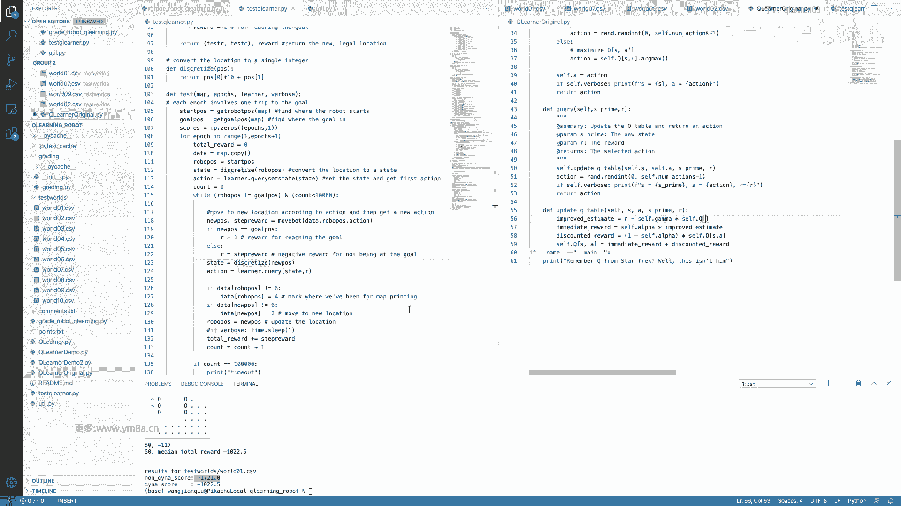

对照这个公式，我们这边记住是哪些呃，是是sorry，这样新的这样一个state as prime，不是S就是如果是S的话就没有意义了，相当于说我们又得去拿前面的就是呃新呃。

拿前面的这样一个旧的，就说上一步的state，我现在拿的是我下一步的这样一个状态，所以是as prime，然后这边还有一个是什么呢。

这边还有一个是arg max，就是说是在s prime，然后以及我新的这样一个action情况下呃，我要去找到在新的s prime，就是说我新的这样一个table s，然后我要去比如说S4吧。

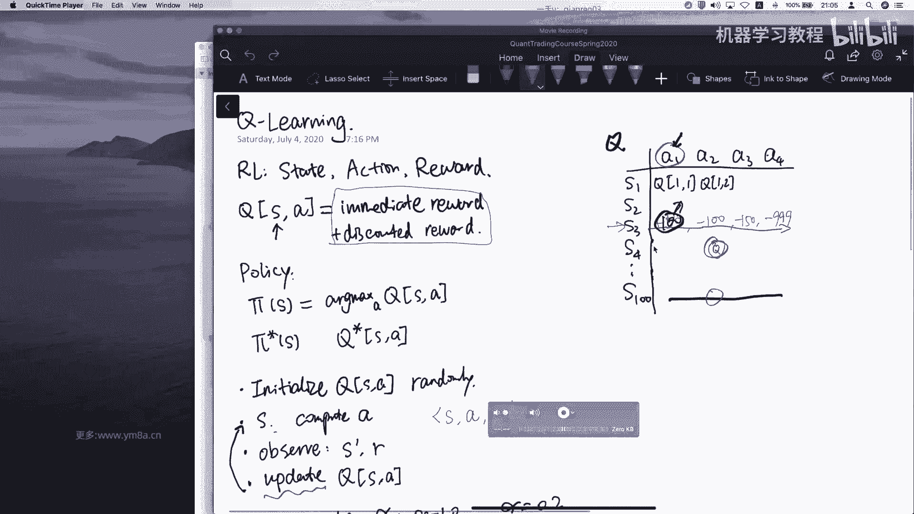

我要去找到让S4最大的这样一个A对吧，那这边就是说一样的，那这个我们之前有在上面有做过类似的操作，是在这边对啊，只不过我这边是把这个换成，记住这边仅仅是换成ASPREME就OK了，对吧，或者我用这个吧。

并且应该没有这个这个冒号是多余的，其实对这一步也就完成了我们的更新，这样一个q table，这样一个一个说我的reward function，到底要怎样的去频率去更新，当然这个时候再去理解一下。

其实最核心的也仅仅就是在这边了，对就是简简单单的，你其实完全可以写到一行去，我把它拆成334小时，为了方便大家去理解，就当它到底是哪两部分，一部分是historical，我呃啊历史上的Q。

然后加上我新的improved这样一个estimate，然后乘以另外一个权重，improve estimate包括什么呢，包括包括一部分我及时的reward，以及以及说我还要加上说是在新的呃。

呃新的state的情况下，我在过在过去的这样一个q table里面，就是说我怎么去找到儿子，然后他的这样一个啊reward到底是多少对吧，注意这边我们不是直接写成qs prime a。

因为我们这边的做到的action a跟我们的qs prime，这就跟npi EG max这个东西做的是不一样，这个是a prime，就是说我要根据新的state。

找到我的这个A跟我过去上一步的state a，那显然是不一样的，对不对，所以这边不可以简单的直接写成q s prime a对，所以为什么要就多这一步，我要是找到我新的state这样的一个action。

然后再去找到新的呃，对应的这个时候他的这样一个Q值，Q值是多少对吧，不然我直接写成qs prime a。

那显然就是说呃，就是就是我们需要就是说apple to apple嘛对吧，一个是S3，一个是S4，我显然不能把S4额，比如S3是对应的是A1，S4对应的是A2，我不能拿S4去直接对应S3的A1对吧。

就这个核心我就在这，如果理解了这个的话，我觉得就是整个的流程就是OK的，比如说我其实要做的事情就是说去update q table对吧，我既然update到q table之后呢。

呃然后然后然后这个时候我们记住哦，我们原先的决策是action对吧，就是那其实是就是说都是随机的呃，几个stay完全是随机，那么我接下来要去做的事情额，其实就不是说是不是随机的了，那同样的我们还是有。

我希望说是，保持一定的随机性，一样的，然后，在这种情况下，我希望来做出我的新的action嗯，那这个时候就说我已经有了新的，这样一个q table了，大家可以告诉我。

应该怎么去得到新的这样一个action吗，就是说我已经更新好我的q table了，就是说我已经进入了整个q learning，这样一个过程当中，我每一次每一次都有新的位置，就像反映在下面这里面。

就是我每次都会走到新的位置，我走到中间的过程的时候，我已经有了最新的这样一个q table，我怎么根据最新的q table来去计算，来指导我当前的这样一个决策呢，大家可以想想这这这部分该写什么。

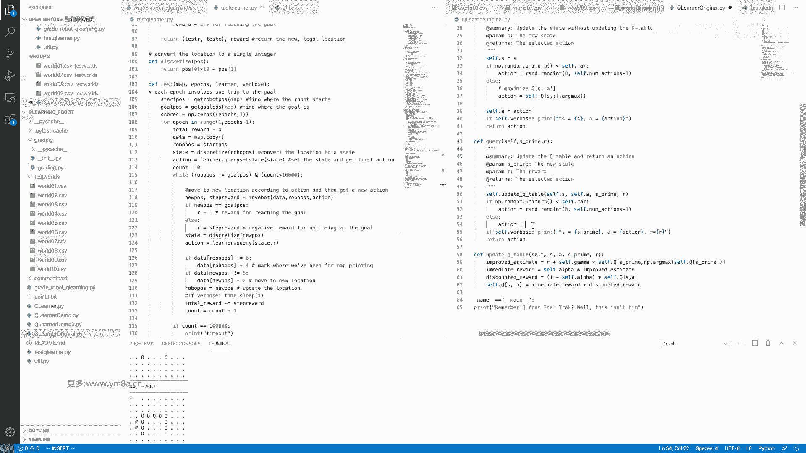

就对就回到我们q learning的这样一个过程，是说就是说我我每一步我已经计算更新完之后，再回到我的S。

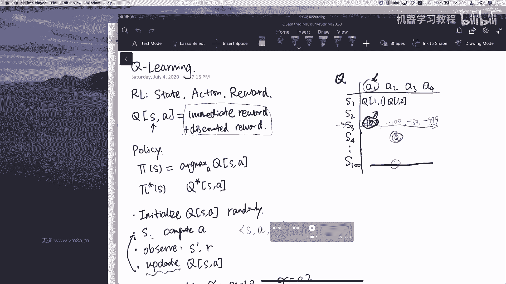

那这个时候应该计算我的新的action了，A那这个这部分该写什么呢，哪位同学可以告诉我吗，对吧，我要我要去计算我新的action，就是大家需要理解这整整个这样一个循环，更新CUTABLE。

然后根据我的CUTABLE去指导指引我的行动，OK呃，哪位同学可以告诉我吗。

呃其其实是他在做做什么事情，就是就是一个查找的过程对吧，我找到我对应的这样一个state，然后找到我自哪哪哪个的Q值最大。

我就选这个action就好了，其实其实这个还是比较简单的对吧，就是说其实麻烦的在update cutable这样一个过程呃，我既然已经知道最新的q table了，那我要去怎么做呢。

那我就其实下面已经写过了哈，number派点arg max对吧，那这部分再写一个Q，这边填什么呢，哪位同学可以告诉我这边是填S还是填s prime，这边应该是填prime，为什么呢。

记住我们已经是进入了新的state，我们的action是说我们在上一步得到了我的呃，唉你其实我们Q瑞传进来是什么，就是说我已经得到了，这边也没有S了，对，因为我说我传进来就是一个我新的这样一个呃。

我的一个state，然后我以及我这一步的state reward，然后我要去计算我新的这样一个action，仅此而已对吧，嗯可以还是回到就是左边的这样一个啊，test test里面。

我们在learner里面要做的事情是什么，我CURY给的是一个，我给了一个当前的state和一个reward，你要告诉我的action是什么对吧，记住我们的curry呃，就curry只做了这样一个事情。

根据state跟reward去计算我的action，只不过说在拿到这个state跟reward的时候，我把我历史上的这样一些的呃，总所有的reword都记在我的q table里面去了。

对我在做这样的决策之前，事实上我先去根据当前，就是根据这一步的reward和state，我算了一下，我的我算了一下，我的就是q table的这样一个值对，所以这所以这边就是说。

为什么我们要去保留上一步的这样一个state，是比较重要的对，因为我们对我如果不保留上一步的话，我只有最新，我就会只有最新，就是传传进来的这样一个s prime。

我只有知道上一步跟这一步的s prime。

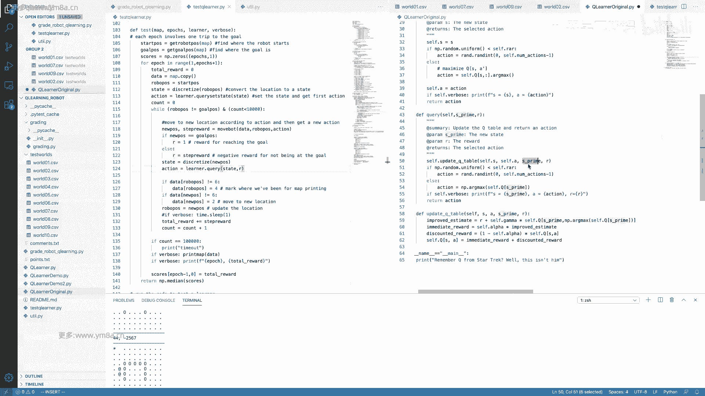

我才能去指导我做出新的这样一个action对吧，还是回到这个记住这样一个流程，呃对嗯，我有了action对吧。

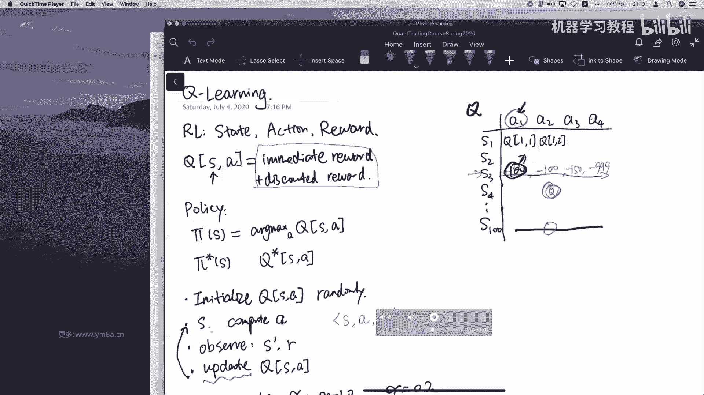

我要计算action，然后才能得到新的s prime和reward，他就是说呃新的state跟reward，都是交给就是呃test klearner来去做的，那其实我们只要把这边就是你要记住。

说我传进来是一个prime，就当前的这样一个s prime，然后我传回去action是什么就好了对吧，呃其实这边然后你同样的，我更新我的historical这样一个S，然后我也更新我的action对吧。

那其实就OK了，但是这边还还有一个地方是在于这一个trek，地方，还有一个参数我没有用到，就在q learning过程当中，随着就是直观的要想啊，随着我掌握的数据越来越多。

那么我是不是每次还是要有一定的，就是R就是50%的概率要去随机的，而不是从我而不是去查我的q table的Q，而不是查我的最新的这样一个q table，那显然是反违反直觉的对吧。

那即使说我学的东西越来越多，然后我掌握的经验也越来越丰富，但是我仍然是跟刚开始一样，以固定的概率去选择，去随机呃，去随机的挑选这样一个action，那显然这样这样这样是非常不负责任。

或者说是效率是比较低的，那我们直观的这样直觉的这样一个行动，是说，我每次我希望我逐步降低，我的随机的这样一个比例或者是概率，那要那我要做的事情是什么，我每一步都会去。

每一步我都会去给他一个discount，记住这个值是0。99，那么随着我的就是说随着我的step不断的向前进，那么我选择任意的概率会越来越小，而我会给我的q table。

是说选择我的q table的概率会越来越大，OK这样的话其实说是理论来说，整个流程才会去比较的完善哦，我们这时候再来试一下啊，就是我们刚刚说是指random，是记住这个值是平均的。

reward是呃medium total reward是-1022。5，-573。0，OK这个还是看到有区别，然后media的变成了-214对吧，这个还是相对效果还是比较明显的。

就是从-1000多变成了-200多，而这个时候路径是已经有了一些区别了，所以整个这一部分的，就是最简单的这样一个q learning，这样一个框架是基本上是这样，大家现在就是还有什么问题吗。

对额其实说还是去理解整个这样一个更新，这样一个QTV的这样一个过程，然后对呃或者对，然后去理解这样一个问题的这样一个setting，对呃问题的其实嗯对，因为这个相对来说还这个问题就是我们换一个。

如果我们换一个零二的话会怎样，应该是从第一列第五行来走，然后看到这个还是最终还是能走出来的哈，对吧，对因为其实这这就是说它整个的过程是这样，就是说呃如果是说他走到嗯，他走他就是说走到。

如果说他不就是在呃第七行这个位置，他不选择向右走，而是选择向下走的话，那可能就是说你会不断的就是陷在这，然后你的reward会越来越富，但是如果你以一定的概率，就是说是选择向向向右去走的话，那你其实会。

然后这个时候你会慢慢的就是不断的迭代，去选择，让它呃接着去走，对那感兴趣的同学其实是呃可以把呃，我觉得能做什么事情呢，一个是你把它每一步的额，每一步的action都给它打印出来对。

然后另外一个事情是嗯去记去看，每一步做完action之后，我怎么去给我的q table是怎么去更新的对，然后我觉得这样子，可能能够帮助大家直观的去理解一下，就是啊整个q learning的这样一个过程。

OK嗯我留点时间给大家消化一下，对，因为除了我们刚刚讲到的，其实还有两个随机的东西在里面对吧，一个是这个对我每次去，相当于说是降低我走这个分支的概率，然后大家可以试一下，就是如果把参数。

调整的话会怎样对吧，嗯那这个时候已经明显变得机智了很多对吧，就可以看不同的参数调整，对它会有什么样的影响，然后对这这是这是我learning learning rate对吧，就是说我选择越大的阿尔法呃。

实际上就是说我选的就是说对历史的数据，我其实就是依赖是越小的，对，就例就是historical这样一个CUTABLE，对，但如果是对极端情形文选九的话，就是说完全按依赖于最新。

基本上可以说是按照最新的这样一个，学到的东西一种，但某某些时候未必是最优的对吧，嗯好我给大家就是留点时间去消化一下，然后有什么问题的话，大家呃课前可以，然后来问我嗯，OK呃同学们刚回来一下对。

然后对待会课后会把程序发给大家，就是其实还是建议大家就是呃快点快点，就只是去直观的先去理解一下，就是说他每一步到底是怎么做的，然后有必要的话是，其实是要把整个的这样一个q table去。

最好是给他打印出来，然后你我觉得这样可能能够直观的去理解一下，他做了什么事情，然后这边他做了一个print的事情，是有如果是障碍的话，他打的是零还是O我也不知道对，然后然后新的话是就是说是。

那二是什么类型来着呃，二二是他就是当前他自己的这样一个位置对，然后三是目的地呃，然后他把它换成用用那个用X来表示，然后点的话就是正常可以走，然后就然后这样是嗯流沙对。

然后他这边有一个这样一个呃state话，就是说如果是嗯如果你踩进去的话，它会变成一个at对我不知道uh，What，这个找不到，有没有这样一个艾特的这样一个状态，可以再跑一遍看看，对就我本来就是慢速了。

0。1秒一次，让他去观察到这样一个过程，对这个没有走到额，然后的话我们这边调的learning rate是多少来着，OK然后试一下，就是啊如果调成0。8，就是比较极端了。

只根据基本上是只根据最新的reward来去调整，对这这样一个问题肯定是说嗯，嗯你会发现他可能就是现限于局部的这样一，个地方会比较多，然后，OK该是显然来说他遇到了，就当他遇到沙子的地方。

是说他一般来说不会跟着上一步直接踩进去对，因为上一步的reward是非常大的对，这个差不多是，但是看到他这一部分的话，是财经选手2805，嘶这个RAR调的，我这边默认的调的是。

2A这个是不是调的有问题啊，0。5嗯，Three do，40。240。99，唱一点麦，啊print可能有点多对，对，然后我我还是建议大家就是课后的时候，可能需要把这个嗯，这最好是我会给他一个空白的。

然后最好大家肯定自己先去实现一遍，然后对额，然后这边有一篇比较好的paper是介绍。

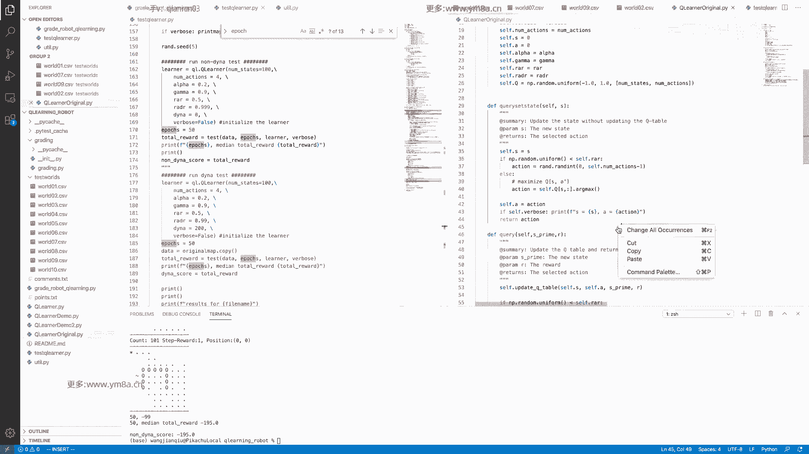

Uh reinforcement learning，上一个survey嗯，然后感兴趣的同学是可以去看一下的，然后我们着重是来看一下那个嗯嗯OK，对是，看一下4。2章节，这是我们的q learning。

OK然后还有一个DINA的q learning对，你说其实看q learning，本质上就是说他还是这样一个人，还是还是这样一个rule对吧，每次我们去更新我们的q table。

然后大家看到就是这边有max，max bs的这样一个呃，但是这边还有哎，我不知道他这个这这这为什么会去减去哦，没有问题，对这个减去呃，QSA的话放到前面就是E减阿尔法嘛对吧，一减阿尔法乘以一个Q。

然后加上我们的阿尔法，跟我们的形式是等价的对。

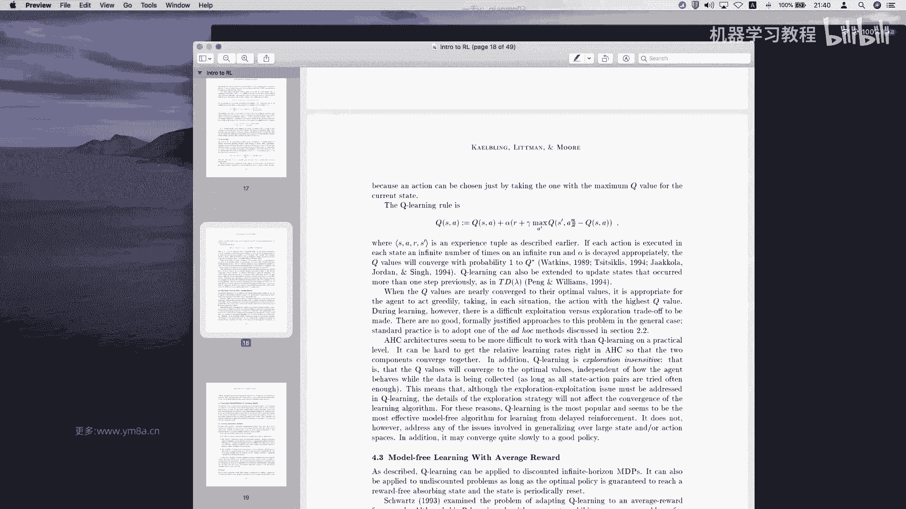

然后注意我们我们需要的是呃，需要关注的是就是experience这样一个突破对吧，嗯然后嗯然后对我其实我们说呃，我我我们在整个这样一个呃学习过程当中，我们没有把它让它去做到。

就是如果是就走到就是converge对吧。

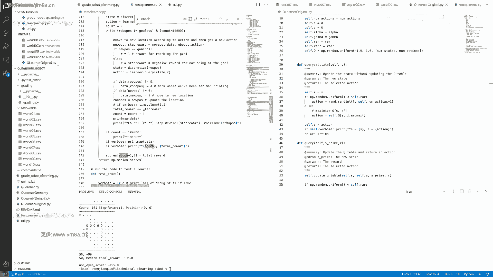

因为我们这边其实是限定步骤哦，或者是说是走到我们的目标位置。

但是你实际上去训练的时候，你是可以去考虑说是要不要要不要去啊，那就是进行convert到什么地步对呃，事实上就是说应该是有这样一个呃，嗯有这样一个曲线对啊。

就是说啊随着我们的q learning的q learning的逐步的呃，逐步的逐步的进行，然后我们的这样的一个呃iteration不断增加，然后我们的return或者说是我们的reward。

也会converge到一个相对比较高的地步，当然他converge的速率肯定是不如刚开始一样，就是是呃不会像刚开始一样非常的快，我们可以看到就说他是在converge，但是它的速率会不断的去减小对嗯。

所以OK嗯然然后对，还有想强调的就是在q learning这个过程中，说，这个模型其实是，我们看到是整个模型是不依赖于，就相当于说是不依赖于说我们的参数，或者说是呃q learning是。

对那这边也提到是说啊，Independent on how the agent behaves，就是说你不就是说你不会说依赖于，就是说你的这样的一个agent怎么去运动，对嗯嗯。

然后然后还想提到的是一个戴安娜的这样一个，这边有一个就是戴拿q learning，就说其实在q learning我们在刚刚的印象过程当中，其实有发现，就是说其实整个过程当中是有非常多的啊。

你整个运算我要不断的得到新的action呃，然后我又又又会有新的就是新的这样一个位置，然后对又有新的state，然后有新的action，其实整个计算过程当中还是比较time consuming的。

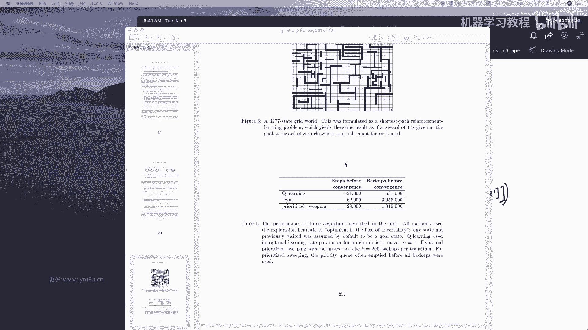

然后其实大部分时间你看到它在整个过程中，也也就是在可能会陷于局部的一些位置。

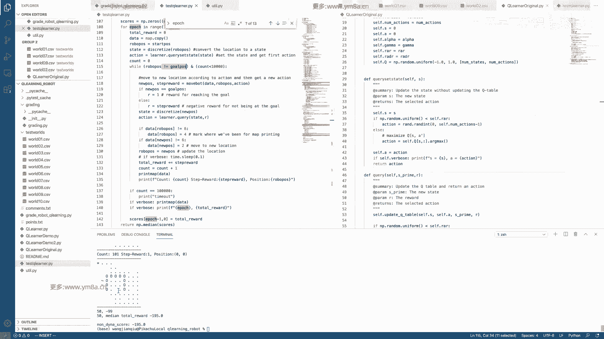

不断的进行随机的，类似于一些随机游走，所以其实他后来提出了一个呃，呃戴安娜的这样一个q learning，本质上他要做什么事情，就是说我能不能说是在我的呃，我不再说是嗯对我的肯，每次我回到我的呃。

这样一个地图当中去进行去训练，更新我的q table，我能不能去生成一些呃随机的这样一些随机的，这样一些就是我的呃state，然后也生成我一些随机的这样一些action。

然后我用这些随机的state跟action来进行我的就，然后然后去进行训练我的q table，然后我拿这样一个新的这样一个q table，再来去啊，再来去把它用到我实际的地图当中呃。

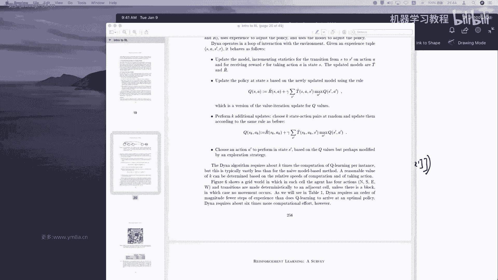

这样我省的时间是什么，我少少在了我少少用了时间在用于跟其他的呃，就是在现实当中进行交互，我是相当于说我是自己去构造了一个呃，SUDO的这样一个呃这样一个状态。

然后让我的q table可以得以得以不断的去学习，对额其实这个实现起来的话也可以嗯，就是也可以去做了，但是呃然后如果有机会了，下节课的话，我们再我来给大家就是implement一下。

就是或者说我直接把这个代码给了大家吧，然后大家可以去理解一下对，然后q learning这个过程，主要是主要是，今天是想给大家先去介绍这样一个过程，然后希望大家是把整个process去理解。

然后下一节课的话，我们再回去把整个的这样一个过程，去应用到股票的交易过程当中去，因为还是想强调，就是说他会更股票是有是会有一些类似的地方，但是可能就是我们需要我们去思考。

就是说我实际去应用到交易过程当中的时候呃，我的reward到底就是就是我的action和reward，到底是什么对吧，然后以及说我怎么这是一个离散化的，我怎么如果说是一个连续化的这样一个空间。

我该怎么去操作，这些，可能就是说等于说包括我们下节课的，就是实际拿股票去，就是拿就交易数据去做的，其实我们可能我也只会去参考嗯，嗯参考就是离散的这样空间我只会设定三个呃。

三个三个的action无非是by sell，还有一个就是说我是hold对吧，但事实上就是说我实际要把整个reinforcement，这样一个q learning应用到交易过程当中。

我觉得其实考虑的地方可能还是比较多的，对，然后这部分的话可能就是说呃，我们课上不会去涉及，说是因为我也不是特别清楚，实际再去交易过程当中，有多少说是应用到强化学习的呃。

有多少就是说真正的实际人去运用到强化学习，去进行实盘交易，对然后尤其是大家有看到，就是说我需要的其实训练的样本是比较多的，我太过低频的交易其实是相对来说是不太适合。

Reinforcement learning，可能更多的是在于说额，更多的是可能偏向于，就是订单流的这样一个建模，都有可能说是能够从实际的order flow当中，能够去得到一些高频的这样一些信息。

然后相对来说啊，我样本比较多，我也可能说是能够呃得到呃，经过一些长长期的训练，我也可以得到一个相对比较稳定的结果，但如果是比较低频率的样本，那么可能有时候应用下来并不会是。

可能不一定能够得到理想的这样一些结果，对呃然后q learning的话，如果对，然后这边还有一个，就是我这边不是有十个地图吗，然后实际上是说这样一个有一个great的，这样一个function的话。

是可以对所有的地图都会去进行去test case对，大家就可以看到就是说不同的reward，best reward一个一级跟你实际上能做到效果。

media reward实际上是还是有挺大的这样一些差别的，对，所以说事实上，就是说我如果把它调的比较好的话，是可以呃，大概率来说应该是对，就可能是呃，就是你可能用很短的这样一个步骤，就能够去得到。

得到最终这样一个比较好的一个结果对，然后这边OK然后这边可能用的都是，这边还用的是默认这样一些参数，Ok，嗯然后对其实今天没有，可能没有太多的这样一些问题，主要是讲q learning。

然后我不知道大家其实今天听懂了没有。

我还挺担心的对，可能或者说是我今天可能讲的，就是可能讲的不是特别清楚。

那其实嗯就是我自己刚开始看的时候，也花了一些时间去理解，但是其实真正把整个他就是update cutable，这样一个表格去理解清楚，我觉得其实理解然后抓其实无非就是抓住呃。

呃一个是q table怎么去更新，然后我去，然后以及对应的理解，state action跟reward这几个东西对吧，一般reward话是我自己去给定的，然后大家也可以提前想一想。

就是说我在这边是这样人为的设置，这样一个环境就是不同的呃，不同的走到不同的位置，然后我给到相应的reward是不一样的，那如果是实际的股票交易类，或者说这些，而实盘交易的时候。

我到底该给什么样的reward呢，对我因为我不同的reword本质上影响到的是对，是会影响到我的q table对，那如果说是嗯理论来说嗯如果直观的来说。

我肯定是尽快的希望我的q learning这样一个系统，尽快的收敛，达到稳定，那么我希望的是我每天得到的交易数据，或者说我每次交易的数据，都能够去及时的得到更新，那最直观来说。

我把我每一期的收益率作为这样一个reward对吧，对然后那如果说是呃，就这样每天的收益率肯定是会比长期来说，我一年我跑完所有的额，一年之后呃，比如说我已经跑了250个交易日，我一年得到这样一个收益率。

作为一个reward会要好一些，因为我的反馈会来的更及时，然后我能够及时的更新我的q table，对对，当然当然就是说实际要去应用的过程当中，还是有挺多的难点的，对。

可能就是需要大家就是如果对这块感兴趣的话，可能还需要额外的花功夫去呃去来研究我，我们这边今天能给到的是，首先是介绍什么是q learning，然后希望就是说借这样一个简单的例子呃，大家可以自己去呃。

我会给大家空白文件，大家自己能够把q learning这个算法给实现起来，因为实现起来之后，其实等到下一个节课，我们再接的基础上去改的话，其实做股票交易会比较，我觉得可能会比较好一些对。

因为如果直接拿股票的话，然后对额，并且这样的test case相对来说数据比较简单，然后每一步的话大家都可以亲自去调试，对这个是我今天主要想讲的内容，那大家还有什么问题吗，除了比较理论外对。

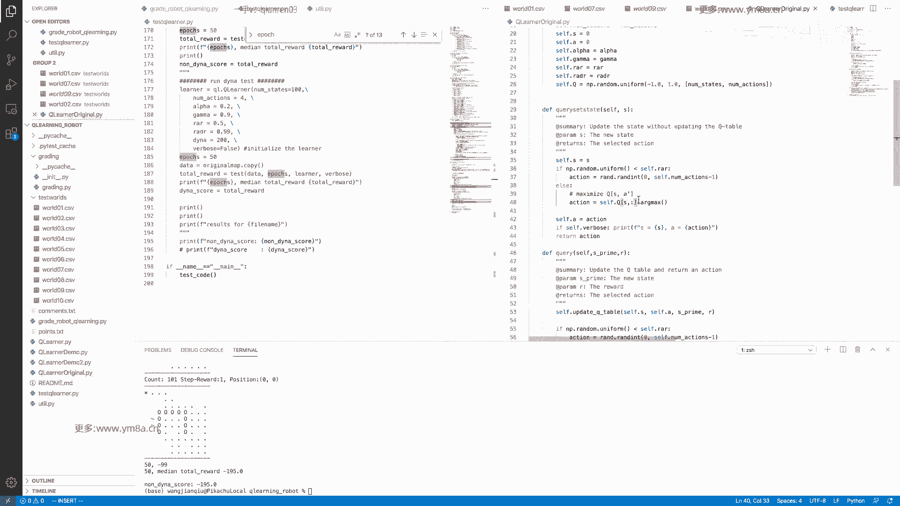

也其实呃就是如如果是notes上面的只，我觉得是这个过程，可能大家理解清楚，就是其实所谓的q table它就是一个二维的数组，然后我觉得你理清理解清楚这个概念，然后它相对来说。

他会有比较大的确定性在里面对，因为我根据我每一次的action，我应该是我这里面其实没有引入随机性对吧，因为我每一次的action，我都会有一个明确的这样一个reward，然后我的reward我更新。

我rewarded更新我的q table，这样公式也是确定的对，唯一的不确定就是说我不确定性的引入，是在于嗯我觉得是不确定，不确定性引入是在于是，由于我比如说我市场是随机的，或者说我每一步的呃。

运动的方向是随机的嗯，这个时候会引入随机性，但是这并不影响我q table的更新，我q table我只要是给定的state跟我给定的呃，给给给给给定的reward，我都能够去及时的去更新对吧。

嗯如果没有什么问题的话，今天可能课要就可能是会提前，那就提前一些结束对，呃然后其实是说呃我还想问问大家，就是之后还有什么特别想要去了解的内容，想要去呃，想要去来，我可以做一些研究，然后给大家去讲一下嘛。

对然后因为之前想到的说是呃衍生品，原来留了呃对，留了三节课，我们差不多就两节课结束讲的比较快，然后可能还多了多了，差不多有两节课的时间对，然后呃实盘交易那部分的话，因为呃我不不想引入太多的C加加。

可能对，就是就是因因为C加加就是CDP那部分，逻辑交易跟回测值，就是跟数据那块是比较类似的，就是对如果如果如果一块搞懂了，其实再做另外一块，应该没有什么特别大的问题对，呃然后如然后呃高频交易的话。

呃如果有兴趣的话，可以给大家简单介绍一下，就是说现在大家所采用的一些技术，然后有一些简单的就是高频交易的算法，也可以也可以跟大家去去呃去分享一下对，然后包括然后呃以及业界现在当中，可能大家最近有发现的。

可能用的比较多的，可能大家有在用NLP的一些知识去啊，去做证券交易额，然后一些所谓的robot adviser，对这些的话可以也可以给大家简单介绍一下对，但是实际据我了解，实际应用的交易可能不是特别多。

但是更多的可能是用来是做一些因子的挖掘，或者是做一些风险的控制对，然后的话，呃然后债券的话其实我不是特别熟，但如果然后包括因为债券其实可能大家也不会，如果不是在机构当中，可能一般不会去涉及到去交易吧。

对额债券的对债券其实还是挺大一块，因为整个市场来说，就是嗯就是股固定收益这一块和和股票这一块，其实都是占比较大的一块，但是散户就是个人其实不太接触的到，就是股固收的交易，对呃。

固收论模型其实也相对来说是比较比较复杂对，因为债券里面可能还有很多的根嗯衍生品，然后跟期权会结合在一块，然后我觉得可能超出了这行，就这门课能够讲述的这样一些范围，然后对呃呃我不知道。

就是说如果有同学感兴趣的话，就是需要去做，就是可以比如说专门拿个一节课或者两节课呃，给大家整理一下，就是我遇到的，或者说我认为是比较经典的一些，就是框的一些面试题，但我不知道就是现在呃大家有没有。

大家就是说要找暑期实习的，或者是找工作的，应该应该现在已经应该已经开始暑期实习了吧，对吧，因为我们最近实习生也基本上都开始工作了，对呃对，但如果如果就是说有兴趣的话，是可以考虑，就是说呃。

拿出一节课时间来给大家集中讲述一下，就是说哪些遇到的一些面试题，以及我们需要怎样的准备对，因为其实我们从回顾到课程最刚开始的呃，这是第11还是第12节课，我们就刚开始的时候。

其实我们是从几个不同的S种类去讲，但是归根结底都是额，就是说是说我们是怎么去从刚开始的数据，然后以及说怎么去找因子，然后回归到就是嗯怎怎么去回测，去验证自己的想法这样一个过程，然后还差一块是投资组合对。

咳然后嗯对，然后大家觉得对这门课程还有什么想法，或者是呃反馈的话，也可以跟我去讲，然后人之前有同学是跟我上一节课，有跟我提到了，就是说觉得就说不要在课上就是写很多的代码，所以这些很多代码记嗯。

就是因为那样的话就是从零开始写代码，他可能可能大家也有时候跟不上，然后我们我们不是跟不上，或者觉得就可能有点无聊。

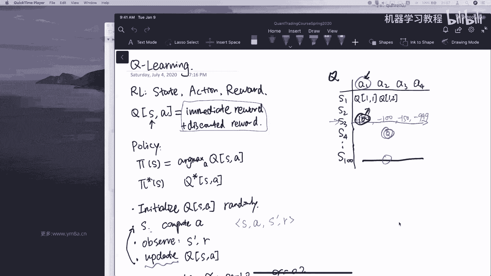

所以这节课也可能有一些代码，直接就先给了大家，然后我们课上只会涉及到少部分的一些，实际的代码的操作，对嗯确实嗯上一门课，如果几百行写下来的话，可能时间都确实不太够对吧。

所以课前能够最后还是可能说尽量的嗯，就是把代码是课前准备给大家，我们课上只是只是只是进行，核心代码的讲解跟写作，对啊嗯好啊，那如果没有什么问题的话，我们今天也提前就就提前结束了。

因为大家可能昨天也上了课，今天也上了课，还比较累，对那大家还有什么问题不，嗯就有代码再整理一下，然后对，然后明天明天发给大家吧，好那没有什么问题的话，那大家可以想一想，然后那我们今天就课程先结束对。

然后q learning的话，我课后再找一找，有没有可简单的跟入门，就是呃我觉得讲的比较好的，好的资料可以找到给大家嗯，那同学们就先拜拜大家。

