# 【比刷剧还爽！】这太完整了！AI量化交易实战课程，全程干货无废话 入门到精通一步到位！（数据挖掘分析／大数据／可视化／投资／金融／机器学习／算法） - P1：第一章： 初识市场微观结构 - 机器学习教程 - BV1Km421G7nH

那我们先开始这门课程吧，那首先就是想问问大家，就是什么是交易，OK这张图里面讲的是什么是交易，这是一个农贸市场，那那本质上交易就是说嗯有卖家，有买家，有一个提供交易的地方，然后如果你出了价格我接受。

OK那我们就我就付钱换得你要的这个商品，这就是后我所认为的交易，那么回到现在的金融市场当中，这就是我们大家希望看到的交易，OK这是纽纽交所的一个现场，然后这是他的trading flow。

然后大家可能也看到，有很多的trader在不断的去报价，哎当然现在事实上说这个交易所，包括现在疫情，实际上很交易所当中，可能很多工作人员已经不再交易了，但事实上即使在平日当中，80%的交易。

也并不是通过这些人来完成的，可能80%的交易都是通过，现在都是计算机，通过计算机程序来进行解来进行交易的，嗯还没有图像的同学嗯，再确认一下，因为其他同学应该我看到都有图像。

是不是嗯呃大家都都能看到图像吗，嗯那那那没有关系，就是如如果之后看不到PPTPPT的话，会之后也会也会上传给大家，然后也会有这门课的录屏嗯，OK所以嗯然后我想知道，就是在嗯这门课的所有学生当中。

有过交易经验的麻烦，在聊天记录框里打个打个一啊，了解一下这个交易经验，包括嗯股票，包括期货，包括数字货币，嗯就是怎样都OK就是只要有过交易经验的对，Oh okay，酷，所以嗯我们在我再等十秒钟。

看看有多少同学给出feedback，就就就呃这门课的成功参与，也是希望就是说也希望每一个听课的人，都能及时给出自己的反馈对，因为因为如果说有人不反馈，或者给出错误的反馈。

那我就不知道大家整体掌握的情况了，对，所以说嗯也是希望大家这门在这门课当中，跟我积极的互动，然后因为别想你说嗯在这个时间，在周六周日的夜晚，大家花三个小时跟我待在一起，我也不想浪费大家时间。

也也也是说也是希望跟大家，就是说能够愉快的度过这三个小时，所以大家也不用太紧张，嗯OK所以所以说那接下来嗯，OK所以说32个小伙伴里面，目前大概说有不到十位的小伙伴，是说有过交易的经验。

OK那我们先来简单的看一看什么是量化投资，嗯就是从量化投资，其实这个历史也没有很长，如果真正的从交易开始，那可能是从嗯17世纪，18世纪从呃从纽约开始，大家也做交易，但事实上从量化交易应该是从呃。

应该是从1972年开始，在量化交易之前，可能大家都是进行主观交易，然后包括大家所熟悉的呃，股票大作手利弗莫尔之类，然后他们用一些的技术指标来进行交易，然后嗯刚开始是在股票市场。

但后来可能是在期货市场在会比较流行一些，在当量化交易进入中国，其实也就是说应该说是这10年的事情，可以说应该是从2012年开始，然后随着应该是随着上期所等一系列股票啊，就是期货交易的API放开的时候。

大家发现OK我现在竟然有工具，也有相应的接口可以去做这样的事情，量化投资在中国才开始慢慢开放起来，对，然后第三个链接是我个人非常喜欢的一个网站，叫investor pedia。

然后希望大家可以去主动的去去这个网站上面，去搜一搜相关的东西，然后这个给出的链接是关，关于什么是做量化交易，然后嗯嗯接下来我要点，我觉得是比较有意思的一个事情，就是讲一讲。

就是说量化交易发展到当今这个时候，已经变成了什么样的一个样子，我们叫modern contrading，当然modern contrading，可能是说不是所有的机构都有能力。

或者说有相应的条件去达到相应的设置，但是我个人的理解来说，相对来说当今一个比较完善，或者说先进的量化基金，它应该有以下几个部门组组成，首先说是data analy，他需要处处理，负责处理所有的数据。

因为在当今的量化交易当中，我们所接触的数据已经不仅仅是市场行情，还有包括所有的基本面数据，还有包括另类数据，那么如果说没有一个专门的人来处，有效高效的处理这些数据的话，那对于后面的工作来说。

是没有办法进一步开展的，呃，呃第二个来说，Feature analy，大家会呃，如果没有接触过量化交易的小伙伴，可能会有些困惑，那其实说呃因为我们拿到原始的数据，比如说原油的库存嗯。

原还原有每天的交易量，然后或者说嗯整个整个海洋上的货运指数，那有了这些有了这些最基本的数据，我们是不可能不可能来直接来做进行做交易的，我们需要把它先把它进一步处理呃。

如果大家有接触过机器学习叫feature engine engineering的话，那么可以说这一步可能跟上一位，这一步可以跟机器学习当中的feature engineering，会有一些类似的地方呃。

Future analyst，需要把这些我们用到的原始数据提取成，可以交易，或或可以不一定是交易，可以是进行策略研究的一些特征，那么这个过程相对来说呃也是会比较重要的，呃那如果说大家。

然后接下来我们看到strategies，中文名叫策略师，如果大家有在看国内量化基金的哎，招聘网站上的时候，可能都会有看到叫量化策略师这样一个岗位，所以显然来说，这个岗位也是在一个量化基金当中。

相对是比较重要的，那么作为一个strategist，他要做的事情，就是说把前面两者提供给我的feature，我要去想办法组合成一个嗯，去想办法去设计，去去构造成一个策略，可能说前呃呃。

那这个他要做的事情，就是说我要去找到阿尔法了，当然也有可能也有一部分阿尔法是在feature，analyst里面，我提供我提供的就是说，我从基本的数据当中已经找到了一些阿尔法。

那么接下来我要交给strategist，让他来去处理，形成一个有效的教育策略，那这一部分也可以，我个人理解为是量化交易当中，最为有意思的一个部分，嗯当然也是需要非常多的创造力跟不懈的努力，那第四个部分。

Back testing，如果在一个小的基金过程中，细小的基金当中可能作为一个策略师，当我形成一个策略之后，可能直接就我就去做完了，这样一个回测，可能根本不会有后面的department。

就是生产的部分，当在一个现代的量化基金当中，如果一个策略拿过来，我们是不是真的说，就如果说就按照他既定的固有参数跑了一遍，OK然后他是挣钱的，我们是不是就可以去交易了呢，那显然是不行的。

所在back testing过程当中，我们需要对于策，对于已经研究出来的策略做进一步做，做非常严格的测试，那么可能就要说，这个这个策略在这样的环境下是work，那么如果换了一组参数，那是不是稳定的。

或者说这个策略在不同的品种当中，是不是是不是也有也有实际的应用价值，所以在back testing过程，我们需要对上一步研究出来的策略，进行非常严格的测试，如果说我们通过了以上严格的测试。

认为这个策略是一个可以去上线去生产的过程，我们就要把它交给DEPLOTMENT，叫开发人员来把它生产上线，因为在现代的量化基金过程当中，作为一个策略研究人员，已经如嗯，我们已经已经不太可能说。

直接说在我本期的电脑当中，就把这个策略一键运行上线，事实上在量化基金过程中，我们都会有所谓的叫call location，我们需要把我们的交对交易去托，放到托管服务器上面去，那么呃可能一部分嗯。

对于大部分策略研究人员而言，我所用的研究工具不一定是C加加，应该我个人理解主流现在是用Python会比较多一些，那么我用Python写出来的策略，肯定是不会具有最高效的执行速度。

那么这个时候肯定是需要开发人员，把这样的策略去转化成相应的C加加代码，然后放到所谓的交易服务器上，当最后一个人员，如果说一个人哎，如果一个策略是经过前面这么多的步骤，这自己的策略也占也逐渐的稳定。

赚了很多的钱，并且达到一定的时间时候，那么我们可以说这个策略是有可能会成为一个，Pfolio manager，他要做的事情是我需要对我一个小小的提，对我这样一个team去负责，对于前面五类人员去进行。

去去去去快去评估他们的表现，保证我整个的策略组合去进行稳定的赚钱，那这个就是portfolio oversight所要做的作用，嗯当然在现代量化基金当中，并不是所有的量化基金，都会采取这样的模式去建立。

因为嗯也有可能说是说我一个量化基金，可能有几十个，几十个，像是比较大了，有比如说像十几个十几个团队吧，每个团队有一个小的小的基金经理，然后这个基金经理可能就是主要是来做策略的，当然这不同的这么多基金。

他这么多基金经理，可能我们可能会设相同的基础设施，比如说我们有要有相同的数据，然后也会有相同的，也会有feature analy，来给大家提供相应的所谓的阿尔法对，所以说当然这个是我个人认为理解。

理解来说是一个比较理想的量化基金的配置，因为嗯现在的从现发量化基金发展到现在，可以说已经基本上过了单打独斗的时候，嗯尤其当然越来越越越来越明显，就是说在非常成熟的交易市场，个人可能完全不存在。

说是一个人去干掉其他团队的可能性，在在发展中市场，比如说在中国，我们认为就是说在呃股票市场，或者说或者说在期货市场还是有一定的可能性，如果呃甚至在数字货币市场，刚开始。

可能有小伙伴甚至就用简单的套利策略，都可以去赚到很多的钱，嗯嗯OK不好意思，我刚刚没有关注聊天啊，聊天记录嗯，如果刚刚有一位呃金伟同学提到说，现在分析是主流是用Python写东西，开发人员转成C加加嗯。

我可以这么说，如果说策略对于，如果我们所运行的策略对于时间并不敏感，呃那么肯定说我可以考虑说用Python去把它上线，事实上在中国现有的很多交易平台当中，也也是有很多Python开发的框架。

如果大家有了解过，应该知道，VN派相对来说相对是现在大家用的比较多的，我我所了解到也有一些基金是直接用VM拍，它就是一个Python的求Python，对于对于交易API进行封装。

然后用Python去做策略，事实上如果对于速度不敏感，那么我可以说也是可行的，但如果说你想要呃java的话，呃我知道有，但不是很多，就是其实其实来说，每个公司都会选择自己的技术站，呃。

我我只为什么说在这，我接下来我会提到在这门课课程当中，我们会用一些什么样的东西，就说你实际上来说，前面的工作你可以用任何一个呃，任何一个你你所熟悉的编程语言去完成，对嗯，那为什么说在后面要用C加加。

因为在中国目前交易所官方提供的API是C加加，对这当然这个交易所我是指我比较熟悉的，上海期货交易所CTP，当然嗯，也有其他的交易所也会去提供类似的一片，但是应应该来说在当前的中国，是以CTP会比较呃。

是是是用C加加连接CTP，相对来说会是主流一点嗯，如果是海外的金融市场，可能大家都直接用fix协议，也不一定要用，就是C加加了，因为可以说在中国，当前的交易EPL是一个处于阉割的状况。

当然我相信随着未来发展，这一点也会逐渐会变好，因为如果大家有了解的话，是前两天是上海呃，上海证券交易所应该是和深圳，深交所逐渐放开了，对于五对于ETF期权的API对呃的管制呃，这个应该说是从股灾到现在。

应该差不多快5年了，这是一个非常大的进步，对所以说嗯对我觉得整个市场还是在变好，所以如果大家这个时候有能力，或者说有兴趣去开始接触到，在中国蓬勃发展的一个领域，我觉得是个人觉得是一个非常好的事情。

OK呃，那接下来的话我会简单谈一谈，我们这门课程的哲学，就是为什么要提这门课程哲学呢，因为呃因为知道就是学生啊，来源也是多种多样，嗯嗯当然我不排除可能有一部分学生会说，老师可不可以直接给我一个。

你们你曾经在公司用的交易策略呃，然后是赚钱的，我直接拿过来用嗯，First of first，就是不合规的，这显然是不可行，然后其次是嗯，即使真的给了这样一个可行的挣钱的策略。

那你能保证三个月后他还挣钱吗，如果不挣钱了，这个策略要进行怎样的调整，那是不是能能够做到的对，即使说给了一个我可以去执行的C加加，或者是Python的程序，那你有相应的呃策略运行的平台吗。

那如果说交易出现了一些呃，出现了一些问题，你有相应的风控措施去弥补吗，所以说嗯，我不觉得说直接给大家一个可行的交易策略，或者说给出一篮子给出，我测试了很多有有有用或者没用的策略，让大家去交易。

我觉得这个是不靠谱的，因为我个人认为还是授人以渔不如授人以渔，我希望大家在这门课程过程当中，是逐渐去学会自己去从事整个量化开，量化开发跟交易的整个全部的过程，理想情况是希望大家从可以从一个人。

从头做到尾，从data到最后的投资组合，当然我相信这个路程是非常非常漫长的，从我个人做这一步，我也不敢说我走到了基金经理的这一步，但是从前面走到后面，我可以说应该是花了很长很长的时间对。

当然我希望就是说嗯另外一个可行性是说，大家在这个过程当中发现了自己的兴趣，然后说如果说一部分学生，未来真的希望从事量化投资的工作，可以去从事对应的岗位，那我觉得这门课程就可能会给大家带带来。

非常大的价值了，对嗯OK所以然后第二个我要强调的是，这门课程是project driven，就是我们这门课程会有四个大的项目，当然就是说在每节课的时候，我也会留给大家相应的编程作业，那么这个编程作业。

你如果呃编程作业，其实是可以理解为是项目当中的一部分，其实整个量化交易是我个人理解说，不存在所谓的神秘的说，一个公式或者一个策略就可以保证永远挣钱，我理解是它是基于人们对于市场，对于策略，对于硬件。

甚至对于你的编程水平全方位的竞争，我们需要把这些不同的因素，作为一个个building blocks，然后慢慢把它组合起来，做成一个非常高效而有用的东西，那这样子来说才能不断的去赢得市场的竞争。

因为市场也是在不断演变的，你的交易竞争对手也是在演变的，如果只拿到一段呃，一直不变的策略，那我可以说过一段时间哎，也会也会自然的就会去，也会自然的就会被市场淘汰对，然后第三个我要强调的是。

这门课程是希望大家叫有self driven，要有自我驱动的意识，就是在这门课可能说课程当中我会提到一些嗯，这边有一块材料，希望大家去阅读一下，或者这这有一个链接，希望大家去浏览一下呃，呃如果提到了。

我希望大家认真的去做这样的事情，叫dual homework，对嗯，OK然后嗯说我们的计划是嗯整门课程计划是OK，我们需要去把整个量化研究跟交易的派派，整个过程给打到16周的话。

嗯当然不一定能够全部完成，但是我至少会给大家说引导呃，量化研究跟交易的整个框架是什么，我们现在做到这一，我们做到这一部分是这个框架的哪一部分，然后我会给大家就是说嗯。

会引导大家去建立最基本的一个个的building blocks，然后当然事实上在公司当中，每一部分都会有很多的人，去不断的去优化和极致，那嗯如果说大家想依靠这样的系统去去，直接去生产上线去赚钱的话。

那我劝大家可能说要稍微慎重一点，因为每一部分可能说踩的坑会比较多，如果真的说经过半年甚至一年的时间，大家觉得整个流程比较完善，那么再考虑就是说去把自己的投入真金额，真金白银的去实践，嗯那我觉得是OK的。

然后第二点是希望大家就是，在依托于我们建立的量化研究跟回，测的平台的时候，希望大家能够去说，多多的去思考，然后去观察市场，去找到你呃，去观察到市场这些pattern，然后去尝试一下自己。

能不能去产生很多的交易策略，然后理想情况下是嗯我不排除我，我觉得我我觉得这么多学生里面，应该是有一部分人能够去把整套系统给跑起来，然后真正的去交易，甚至还是有可能去挣钱的对。

然后当然如果事实情况是接下来这部分，那大家也不用特别担心，就这门这门课程当中，可能是就是并不是说就是大家听完课就OK了，听课说实话只是一部分，更重要的是呃希望大家去真的去课后去动手，去写很多很多的代码。

然后嗯对就是包括数据清洗跟验证部分，对我们今天开始会逐步讲到吧，那其实是非常dirty的一个部分，但是还是希望大家认真的去做，然后包括就是如果想要去从事量化投资，希望去真正实践起来。

那建议大家去先去开一个期货，程序化的期货的账户，呃啊为什么说是期货呢，因为股票API现在应该呃，应该还是有一定门槛吧，就是呃相对来说比较熟悉一点的就是中泰证券，他们用的XTP是主流的量化基金。

在中国都会用的一个交易平台，那么他们对于机构的门槛是300万，对于个人的门槛是少一点，是50万对，然后期货的话是，因为就是说因为没有什么门槛对，只要是网上在线开户。

找一个正规的债券商底下的期货公司就OK呃，我个人用的是中兴跟国泰君源，当然你们也可以选择，就是去期货公司的官网上去查询一下，就是每年的评级哪些比较好的，OK然后嗯然后有课程，随后的课程会不断的提供出。

有很多的radio assignment，就是包括一些书籍参考资料，那么，也希望大家就是认真的去阅读，然后呃然后如果说大家真的不想去靠，拿自己的钱去实践的话，那也是OK的，就是这门课程会呃。

待会这门课我会给大家发一个，去去上汽走楼官网去申请一个CML的模拟账号，然后我们可以用那个账号里面，我我记得应该是有500万吧，那个模拟账号，然后大家可以用那个账号去来，去测试自己的教育策略对。

然后即使说这这个亏钱就不用特别担心了对，然后最后一点是还是跟是因为跟大有看到说，这里面有一部分是在读的学生呃，如果大家就接下来去找工作的话，或者是嗯。

或者是说要去申请海外的master financial engineering的话，那我可以提供一些呃面试题，这个是放在每节课的最后，然后也要看大家的情况对嗯，是不是有必要保留第五部分。

就所以说第五部分是选修，我会呃不一定在课上花时间讲，但是我会把相应的题目放到PPT，然后有兴趣的学生，其实最好建议每节课去做一下，就是去了解一下当今的就是job market上。

是对于人才是有怎样的要求，然后接下来同学问到说，我们课程主要是Python还是C加加，当然是主要是Python，然后C加加，我个人觉得如果你是想要做严肃的QUT，那么C加加is a must。

就是你还是要去掌握C加加对，然后这门课程当中会用到一些C加加，如果说在那一部分大家有困难的话，那我就把C加加处理好的数据直接给大家，就那部分就可能就不用大家来做了，对嗯。

OK所以然后接下来我们看到的是嗯，就是提到skill set证明可以需要哪些东西嗯，嗯在我们分为两部分哈，就是在我们的编程部分，就是说大家有刚刚我们有提到说一部分是研究，一部分是交易。

如果我个人建议的话，就是说研究的话，你可以选择你自己更为熟悉的语言呃，无论是Python或者是R或是MATLAB，当然如果你很厉害，也可以直接用C加加，然后生产环境的话，我个人会带大家用一些C加加。

就是让大家去接触，就是说交易所原生的API是怎样的，然后我们怎么去实现去下单，去交易去的这个过程，我就是在包括在project当中，我们也会以说是用C加加为主，然后如果说觉得这边有困难的话。

那其实是可以用市场上现成的一些，就是下单的框架，就是因为VN pi相对来说，对于CTP的封装也会比较成熟了，那么大家也可以用Python去调用VN派去进行下单，不是嗯对，然后我觉得敬伟同学是比较好啊。

就是因为这门课程希望大家有什么问题，随时在聊天框里跟我去沟通，然后因为这样子来说，就是说你们给我的feedback越多，我也会越知道大家在哪些地方会有疑惑，然后这样你其实个人收获也会去多一点对。

然后这门课程其实是不需要大家有太多的呃，方言史的知识，因为刚开始毕业的时候，其实我也没有很懂，然后嗯应该来说我选，我觉得要做的事情，就是去了解你交易的品种是什么样的东西对，然后因为是量化交易。

当然如果说大家以后想做偏向宏观一些交易，那么可能金融知识还是会需要对，其实自己我这部分也是在不断的学习当中，学的策略在欧美市场适用吗，嗯那还是回到刚开始的问题，我个人不觉得说。

存在一个适用于所有情况的策略，那么这门课程更多的是希望大家去研究，去掌握一种研究的方式，研究的方研究的框架，那么如果说真的可以去呃，因为港美股现在应该也可以去做吧。

然后就是附图应该他们也有提供相应的API，如果真的对于欧美市场感兴趣，那么完全可以去交易对，而事实上我个人也是会也是在交易美股的期权，对啊怎么说呢，就是如果这个策略真的work了。

那你还是就是这个work的，前提是你要去拿详细的历史数据嗯，去验证你的方法，验证你的策略是不是真的可行，如果真的可行的话，那么你可以真的可以小心的去尝试一下对，然后这门课程会涉及到一些工具，包括做优化。

然后机器学习，然后这门课程应该嗯，在课上我不会去讲到这些东西，如果缺乏相应的知识，那么可能要辛苦同学们课后去弥补了，然后这里面提到C加加，如果真的呃不会的话，那建议还是赶快去捡起来。

因为我默认所有的参加这门课的同学，都是具有相应的编程基础的，但是如果发现大家一点都不会编程，那么可以说大家选错了这门课嗯，要么一种方法是赶快去学Python，赶快去学C加加。

要么还有就是可能要稍微缓一缓，因为担心会给大家有太大的压力，OK嗯然后的话，然后接下来我们就会开始讲到这门课程的，很真实的一个东西。

就是我们今天是其实要讲的是就是market microstructure，叫微观结构，那那为什么要讲这样的东西呢，可能很多其他的类似的量化投资的课程，刚开始也就是嗯我不知道有的老师风格是OK。

我们回测框架有了，然后让我们从双金线开始学起吧，然后双均线ya1看是5日均线，大于上穿10日均线，好的，我们就买入10日均线，下穿5日均线，我们再卖出，然后回测了这样一个策略。

然后发现5日和10日均线不行，那我们试试50跟20吧，然后再试试50跟70嗯对嗯，我觉得当然那也是一种方式吧，但可能嗯那样子的话，可能大家会做的事情就会发现，我只会去调用这样东西。

但是不知道说那这个为什么要用均线啊，那为什么5日均线上穿就要买入呢，对然后那均线到底的实际含义是什么，以及呃这个均线是怎么计算，这个分钟数据是怎么来的，那交易所就是我们在接下单的交易所嗯。

接CTP的时候，为什么他不给我提供纷争数据，他只推过来一个个盘口数据对，所以我希望的是从带大家，从最基础的市场的基本知识去开始了解，然后去慢慢去知道说是量化交易的每一部分，到底是怎么样的。

然后希望大家建有了这样的基础知识，加上相应的动手去做，去了解整个量化交易的全貌，我我想告诉大家是，量化交易并不像大家想象的那么神奇，它其实是各种各样的方式的呃，就是多种工具的组合。

它是一个非常综合的学科，就也不要被人说，可能市场上肯定有一些人在忽悠说啊，量化量化投资很神奇，那可能是他们没有去动手去了解，如果真的是大家有有能力去动手，去了解每一个部分，那其实大家会发现这个学科。

其实还真的是一个挺有意思的学科，并且也确实是会有一定的难度对，OK那话不多说，我们来看一下，就是我们先从交易所开始了解啊，那什么是交易所了。

那交易所就是说ua marketplace where securities，Commodities，Derivatives and other financial instruments。

Are traded，就是说啊证券securities证券，那么大家比较了解的股票，上交所，深交所的股票商品commodities，那最近嗯油价应该跌了不少吧，那原油就是一种商品。

那还有比如说大家建筑所用的钢材，螺纹钢，然后螺纹钢的原材料，铁矿石，然后还有包括大家知道的农产品啊，豆粕对，然后豆粕是因为是猪肉的原料，那么如果猪价涨了，那大家可能会对豆粕有更多的需求。

豆粕价格也会上涨，然后棉花对，然后贵金属金银，那所谓衍生品呢是说是指建立在其他，就按其他的asset基础上的一种呃，就看到名字的时候衍生嘛，那比如说期货的期权，那嗯然后我在企，然后有比如说个股的话。

那我有股股，然后把所有的个股综合在一起，有股票指数叫股指，那股指也会对应的有股指的期货，也会有股指的期权对，然后其他的发言说instruments，那可能就是说可能大家作为散户是接触不到的。

那可能在投行里面会有去交易额，比如说包括其实当时我们也交易过场外的期权，就是跟券商嗯去签这样的一个合约，然后然后是在场外进行交易，它就所谓的场外是指就不是在交易所内发生的。

它是所以叫over over the counter对，然后那么作为一个交易所，它的核心功能是什么呢，那肯定是要保证是公平和有序的交易，为什么要强调公平跟有序呢，嗯这个是一个交易所的核心。

那想象这样一个情形，同样去买苹果，这个同样去买苹果了，那那那就是你跟张三跟李四都去买苹果，结果一个要五块钱一，一个要六块钱一斤，在同一家摊位，那显然这是不公平的对并且是在同时了，但有一个前提是同时。

所以说交易所说，你两个人在同时刻去买同一个东西，你们俩看到报价是一样的，不能说对于你报的是100，对于他就是101，那这样显然是不公平的，还有一个叫orderly叫有序的交易，为什么要这样叫有序呢。

叫先到先得对，总不能我们都看上了这个东西，结果嗯结果结果就是说明明他在你后面的，结果他把这个东西拿走了，那那那这样肯定是显然是不公平的对，所以交易所的话就是要做到哼，嗯就是公平跟有序。

那这一点为什么要强调呢，因为大家知道，就是有很多的所谓的数字货币的交易所，那这一点其实是不能保证的啊，当然就是说，因为因为因为里面也存在很多的操作的空间，可能因为因为作为交易所本身。

他们可能就得自己去交易，然后他们可以甚至放出一些并不存在的单子对，那那那事实上大家可以想象一下，如果说上交所的时候，我自己也去交易，那那那其实整个就完全是一个灾难对。

然后嗯第二点就是说要说distribute price information，Efficiently，就是说我要把所有的价格信息，有序的去传播到呃，所有的交易者手上，那事实上在电报发明之前的话。

从纽交，从纽约，然后我记得要传到那个费城的话，那那那这个可能要花上半天时间，但后来他们三建立一个人说，电报竟然可以传递价格信息，那那这样就非常这是一个非常伟大的发明。

那可以说就是从纽约嗯股票价格变动了之后，过了可能过了几秒钟，那么费城就收到了，那到了当今的时候是呃，就是说大家都不断的在为这个事情去做努力，当今我们价格已经说，我们说我们比如说收到了美股行情。

那事实上那中国到美国的延迟是100多，100多毫秒对呃，那这个已经是已经开始，就不断的去趋近于物理上的几千了，因为接近于光速了，对好点，那前面两点也是说我们叫secondary market。

叫二级市场，我们需要考虑的，那么还有就是说大家也知道股公司会IPO，我有融资的需求，那在一级一级市场，可能说有很多公司会去会利用交易所去融资，大家也会看到国内有个两个公司可以选择在呃。

上交所或者是深交所上市，然后也有选择去海外海外的这种去香港上市，然后也有可能去纽交所上市对嗯，那这部分就是说是强调交易所的一个，核心的功能对，OK然后嗯大家到目前有什么问题没，然后没有问题的话。

我们就会接下来去继续了，嗯OK然后OK然后接下来就是说这个，然后我带大家去看几个交易所吧，嗯就刚刚我们提到比较有名的交易所，上海期货呃，上海证券交易所，然后纽交所，然后上海期货交易所。

然后接下来这几个建议大家都会去看一下，因为这门课程当中，我们我们会主要刚开始前一个，前一部分可能会说是从期货开始，因为因为期货的API相对来说是，每个人都可以就不用50万的资金门槛。

大家可能都可以去开户去获取得到对，所以然后我们先从。

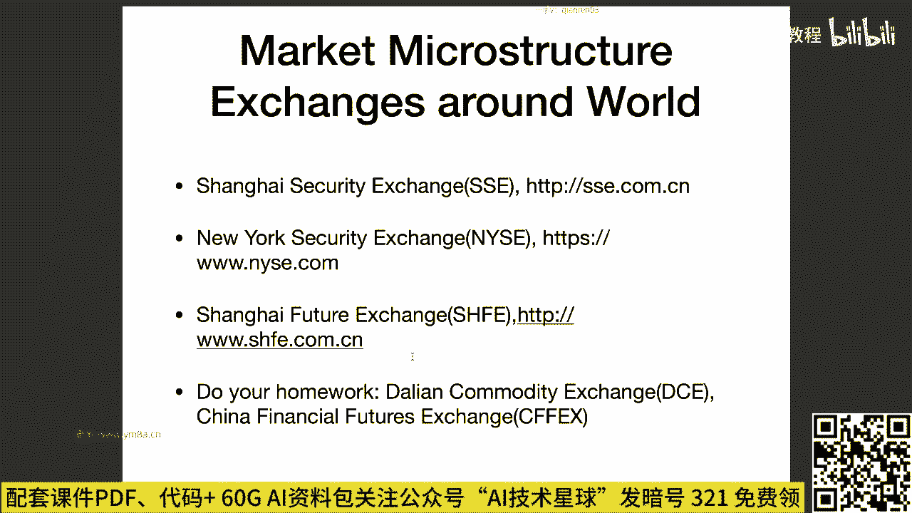

Ok，然后大家看到这是一个上海期货交易所的首页，对嗯，就是为为什么说要带大家去看这样的东西呢，可能很多人都会说，他说我没有接触过期货，然后莫名其妙的就开始去去开了个户，然后开始一买一卖。

哎呀发现哎呀赚钱了或者是亏钱了，那那这样我个人觉得其实还还比较危险的，就是首先我要去交易的时候，那我不得了解一下它是什么东西吗，如果我都不知道他是什么东西，那是梁静茹给你的勇气去交易的吗。

那显然就是我觉得这是对自己的资金，是非常不负责任的一种表现，对OK然后我们先就从黑色金属期货来开始，就是首先是什么是期货啦，就是嗯期货本身就是说呃，应该是叫他英文名叫future。

说他是在未来去进行交割，就是说我现在嗯，大家比如呃举一个简单的例子说嗯，前段时间大家在网上买买口罩，2月份的时候，他说我3月份才能给你寄出来，那事实上这是一个股，这是这就是一个口罩的起火。

因为他要到3月份的时候才会去交割，然后嗯在这个过程当中，狗嗯口罩价价格可能会上涨，也会下跌，大家也可以看到前一段时间朋友圈说卖狗，卖那个卖口罩的人特别多，但为什么在前一段时间我买多了。

然后发现疫情好像已经控制的还不错，所以我现在需要把手上的口罩去清仓，那这个可能就是买货买多了，砸在了自己手上，OK那话不多说，然后我们要看一下，就是说呃，强烈建议大家。

就是如果要自己去主要去交易这样的一个品种，去了解一下这样这是一个什么样的东西，大家看到就是说这个品种是一个螺纹钢，螺纹钢就是一种在建筑当中，就是像纹状的这样一种钢材，然后交易单位叫10吨一首，什么意思。

什么叫一手，就是你下的最小的单位叫一手一个unit，你下的一手就是10吨，所以说你看到它的价格，比如说现在螺纹钢价格是3500块钱一吨，但是你实际上下一手，你就需要3万5000块钱的资金。

那那然后说然后这报价单位说是吨，然后一元一吨，也就是说你价格只可能出现35013502，不可能出现35051。5这种对，那这个是需要大家去注意的，因为不同的交易品种。

它的交易的单位以及最小变动单位都是不一样，所以希望大家特别去注意对，然后还有一个这个涨跌停，大家应该会相对比较熟悉一点，熟悉一点，就是因为这个是类似于嗯类似于股票对，然后就会有涨跌停。

那为什么说商品就看到那个3%，不是10%呢，因为嗯可以说大家都之前可能如果有印象说，或旁边其他人会说股票的就是期就是期货的，它的风险比较大，因为因为他是杠杆交易，那但事实上如果说按照不加杠杆。

就跟股票一样，就是如果就是我有多少钱，我就买多少的话，那么理论来说大家应该可以看到，就是说期货的波动是，也就是说期货的波动它会是比股票是要小的，因为股票一天有上下10%，甚至有20%多，科创板可能更多。

但是期货商品来说，3%的波动市场是非常大的，那接下来你就是我会，接下来会逐步带大家解释说，为什么就是会有这样的涨跌停，然后为什么说有常识中，大家印象中会说期货的风险非常的大，然后嗯这边有一个合约月份。

这个是很有意思的一个事情，就是说我们刚刚说期货嘛，那那那那就说什么，就一到12月，就是每年每个每年，每个月都会有相应的期货去进行交割，那么这个时候就要注意，比如说我现在二，我买的口罩。

有的人说有的有的商家说是4月份发货，有的商家说是5月份发货，那这样简单类比就是说有不同的去交割的呃，就是有交割的月份，那事实上就是说对于同一个呃，同一个交易的品种螺纹钢，那么我比如说今年5月份交割。

跟今年10月份交割，那实际上就是两个合约了，所以要大家要强调一下，对于同一个交易品种，我们有多个合约，那提到这边又要去提嗯，所谓的主力合约了，因为大家知道就是有12个合约。

但是由于在中国有个很神奇的现象，就是说并不是大家都会均匀的，在12月月去进行交割，因为这个里面可能有产能的问题，比如说在年后复工呃，大家都会说在23月份开始逐步的去要开工了，然后房地产要新增了。

那么这时候我对于钢材有更多的需求，那这个时候逐渐的就会形成说大家会统一在呃，我需要的是5月份交割的钢材，我需要的是10月份交割的钢材，那这个时候我们一般会把这样的合约，叫做主力合约。

对那一般事实上在交易的时候，我们也会优先去考虑主力合约，因为主力合约交易点越多，交易的人越多，这个意思也就是说我们可以在嗯，你可以在很快的时间找到对手盘，无论你是想卖还是想卖，对对于这样的人。

对于你的交易的流动性是非常有好处的，然后我们大家要关注的是交易时间，但注意交易时间对于每个品种是不一样的，因为因为从这边可以来说是嗯，大概来说可以说是对于每个交易所是一样的对，然后现在是九点，就是说呃。

螺纹钢交易时间是上午九点到11：30，下午01：30到三点，然后股票的话应该是09：30到11：30，然后是一点到三点，然后嗯最近是一个特殊时间，就是螺纹钢没有在夜盘交易，一般来说就是说是曾应该是嗯。

嗯当然这个是很神奇的，是期货公司给出的理由是，由于疫情大家都在work from home，所以晚上没有人去期期货公司去维护这样的，维护这样的一个交易，所以说大家就去期货公司就和交易所商量得。

我们就把这个夜寒先暂停吧，所以最近的情况就是九点到11：30，以及01：30到三点，当然大家以为这个就是全部吗，显然不是在九点到11点办公，我们还有上午的盘中休息的时间，是10。15到10：30。

所以这个是要大家是要特别注意，不要看到说唉为什么10。15到30分之间，我不能下单，或者说我下单怎么是不是我电脑坏了，行情就停滞在那，就说所以说这期货交易交易里面坑还是比较多，对于一个牛比来说。

还是有很多的事情需要去注意，然后最后交易日对，所以说一般来说我们都不希望自己的合约去嗯，交易的交易到最后的就是等到最后的交易日，因为这样这样相对来说会比较危险，就是因为等到最后交易日的时候。

可能都不太有人去交易了，所以说我们要确定的就是说，在每一个每天不同的时候，你都要去看一下，我最近这个合约是不是是不是还是主力合约了，比如说现在应该3月份的，我呃，主力合约螺纹钢应该是切换到10月份了。

所以这时候我们交易的是螺纹钢，2010 2020年10月的这样一个合约，那前一段时间可能是5月，对大家看到的并不是说是嗯在欧美身上，可能就说5月直接换到6月，6月换到7月。

但是在中国可能就是5月换到10月，对那这个这个大家是要去注意的，对一般来说啊，我相信大家也不会去交割吧，交哥意思是说我去哪了期货的啊，买的期货我要去拿一堆钢材，对应该没有人去想做这样的事情。

我们可能只是想从价格的波动当中去获利，而不是说去真的去拿这样的钢材，那那那什么样什么样的人会去做交割呢，是产业的客户对，因为我我因为本质上来说，期货从最刚开始发明的目的，并不是为了单纯的投机。

而是为了去保证产业客户，去对冲相应产品价格波动的风险，比如说我预期到我公司明年哦，就是房地产公司说明年我买了很多地，然后我明年会用很多的钢材，但是我不知道明年价格就是钢材价格会怎样。

OK那我看现在价格合适得，那我就比如说买了个几10万吨的钢材，就是刚才螺纹钢的期货，那我就把这个价格锁住了，因为我现在买入的价格是3500块一吨，那那我不管未来怎么样去变动，到到期的时候。

我就是我付出的成本就是3500块，我就可以3500块的价格去拿到这样的呃，去拿到这样的螺纹钢的钢材，这也叫交割，那有可能一年之后螺纹钢的价格涨成了4500，那显然我就是赚了。

我拿3500的东西买到了4500，还有一种可能是螺纹钢的价格是从3500，跌到2000，那这个时候你也只能是认亏了，因为因为我因为总不能说一年之后发现价格，就是价格下跌了，才说我一年之前买亏的。

这显然不是扯淡了，就是我们显然就是说不能说你，因为我们不能预测未来，我所能做的事情就是我拿未来的风险，我现在去把它，我我可以接受3500的成本，我就拿这个成本去对冲我未来的风险。

对嗯然后当然也就是说交割品级对，这这个也是什么意思呢，就是说现货他们肯定要注意，就是嗯因为在不成熟的市场，可能会存在来说B仓的事情，当然还没有B仓了，就是说对，如果说我交割的品级这样定义的不是很好的话。

那么可能会就存在投机的空间，也就是说我拿次品的东西去代替好的东西，那显然是不一样的对，然后OK啊，交个地点我们就不care，然后最低交易保证金，Ok，这就让我们提到一个期货在交易当中的。

一个非常重要的特点，叫保证金交易的方式，保证金交易方式，我们刚刚还是提到对螺纹钢，我们假设现在价格是3500块一吨，交易单位是10吨一首，我们假设交易一手，也就是说我们需要付出3500块乘以十，等于三。

大家一看哇，3万5000块钱买一手还是有点贵的，但事实上说我们这边有个交易保证金，那最低交易保证金什么意思呢，说我只要付出这笔钱的5%，我就可以买到这样的期货，那就是3万5000。

3万5000乘以5%对，但实际上这样这样子来说，就是会相对来相相对来说，就说我只有可能只有1750块钱呃，呃1750块钱，但事实上说这个我们要注意，前面叫最低交易保证金，并不是所有人都能拿到这个保证金。

因为1750块钱一手什么意思，就是说1750块钱，我只要螺纹跌了175个点，那你1750块钱就没了，因为175×10就是等于1750，那我就是说我付了1750块钱，只要稍微跌这么一点点，你的钱就没了。

那显然是说这个是比较危险的，那作为一个说我给你开户的，券商或者期货公司来说，我要去考虑一下你这样的客户，是不是能够承担这样的风险，那对于一个新手来说，可能大家给开户就是保证金。

我会去在交易所的比例上去加相应的比例，那我可能说你一定要有10%的保证金，甚至说你要更夸张，你要20%的保证金对，那所以说大家也为什么看到就是说嗯对，之前应该是在18年时候，上海有人投资橡胶期货。

然后爆了苍穹对，然后就很不幸嗯，就轻生了，那那那那显然是因为就是说他他的，可能一方面是说我保证我给了你保证金比较低，唉然后说我看了我账户里有一个亿，然后发现哇塞，那我可以买20个亿。

我可以买20个亿的螺纹钢，但事实上我买了20个亿的螺纹钢，如果螺纹钢真的跌了5%，那我的一个亿就全没了，也就是说很快了对，所以说这个时候保证金嗯，我觉得这个是要从两方面来看待，一方面来说。

他给大家提供了一个免费的杠杆，叫free leverage，为什么叫免费的杠杆呢，呃当然呃你如果要深究它其实也不是免费，因为有期货的升贴水，但是你可以简单理解来说，我只有1万块钱。

但是我可以动用20万的资金，那并且还没有收利息，那这是不是很好的一件事情呢，那显然是这样的，就是说如果你本金比较小，那可以试一试，对那另外一个不好的事情，就是说它会放大你的风险。

如果原来1%的波动加上20倍的杠杆，那就是20%的波动，所以这个时候就解释了，为什么大家常常说，炒期货的人就是风险偏好会比较大一些对，然后OK，然后这时候我们要看到在嗯交割这个事情，我们就暂时不关注了。

交易所的代码，交易代码是RB啊，Roll bar，然后交易场所是上海期货交易所，OK那我们现在就简单的，大家可如果没有做过交易的话，没有接触过期货，那可能是大家接触过的第一个期货品种，现在是20。

48分，我们休息10分钟，OK然后大家有什么反馈的话，可以在那个聊天框里打出来，我看看大家的感，就这个上课的速度是否可以接受对，然后对及然后有什么建议的话，OK现在再休息一下。

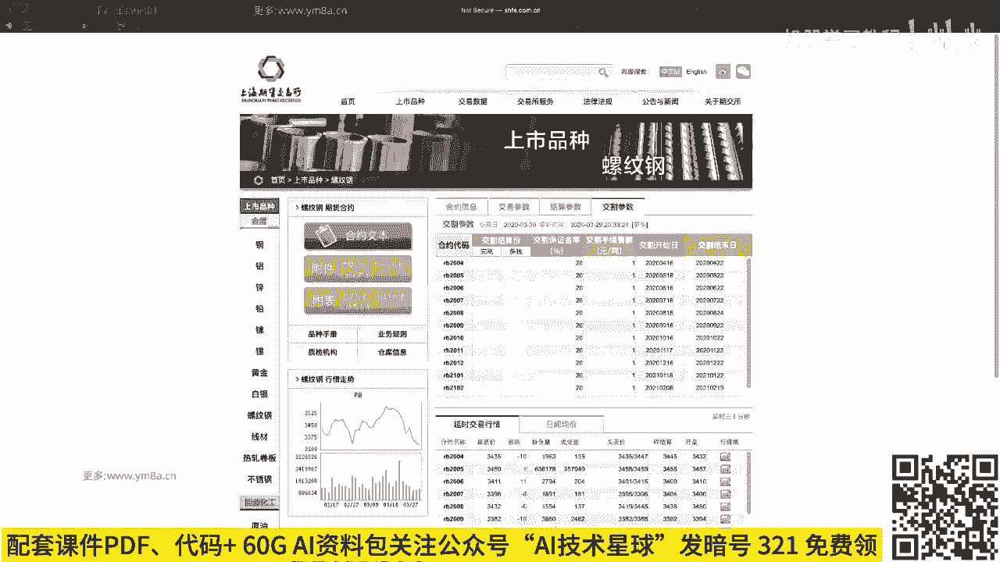

嗯OK同学们，我们回来了，OK然后我再回答一下大家一些问题，然后嗯张伟同学这一点提的还挺好对，因为事实上就是说如果我是做单边的CCTA的话，那那我我我觉得最好最好就是平仓，我就直接开新仓。

但事实上一中长期会比较常见的一些做法，然后如果想要去赚深贴水这个这个的话，那我觉得得得去研究一下，不能我不能单纯的说怎样做是更好，因为我对于期货的这个还套利，其实我也不是特别熟悉，对。

然后呃然后近卫同学提到，就是说交割日期是不是固定的，OK嗯what do you明白固定对，就是对于一个固定的合约，比如说我们看到的这边的RB2010，那它就是20年10月份交割，这个是不固定。

你哎这个是固定的，就是说我不管是4月份买，5月份买，它不为不以人的意志而转移，这是我们看到就是说，对然后是就是我们看到的它是怎样。

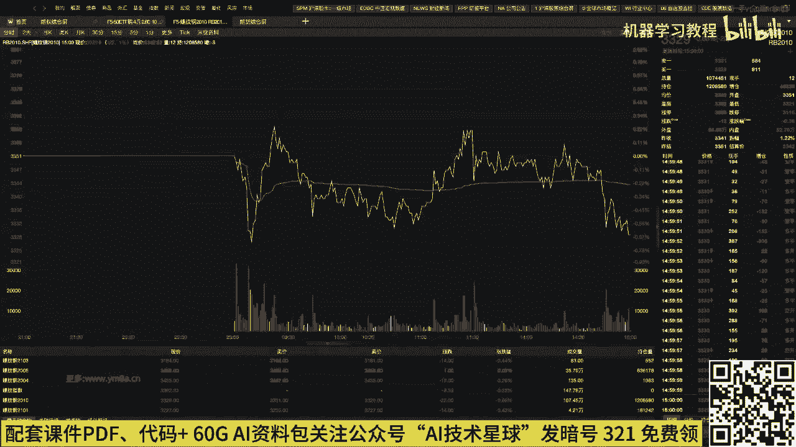

就是嗯就对我们看到的他是什么样，就是什么样，我们刚刚按这张表里应该有写到交割参数，对，那交割开始，交割结束，那事实上我肯定要在我交割之前，我现有的仓位就要平掉了，对所以金伟同学。

我不知道有没有解答你的疑惑，就说我可能在今年1月份，甚至去年10月份的时候，我就在交易呃，20年5月的合约，因为当时他是主力合约，那么哦到了现在的时候，主力合约已经变成10月份。

那可能到了78月份的时候哦，应该是就是有我，我也会去编程啊，就是交易RB22101这样一个合约对，也就是说每个合约的，就是主力合约还就是挺不一样的，所以对，额罗文，我记得是050510杠对杠零一好。

OK啊，我们再回到课上来，对嗯好稍等，我切换一下耳机，这个耳机没有电了。

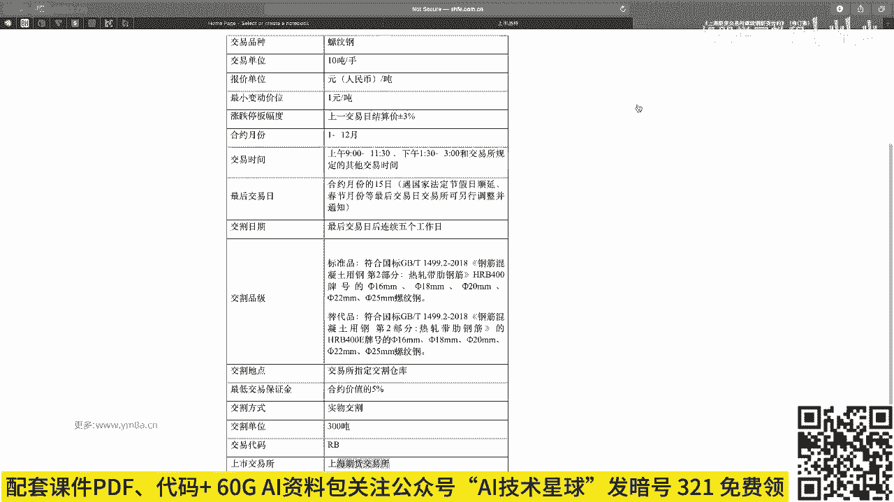

哎呦喂抱歉，不好意思，刚刚刚刚我我的airport没电了，换了另外一副，然后这个这个这个平台还是有点难用哈，然后哦我刚刚不好意思，耽误大家时间，然后我想重述一下，就是说我现在想确认。

大家是不是真的理解了这样一个概念，刚刚提到的说是3351。

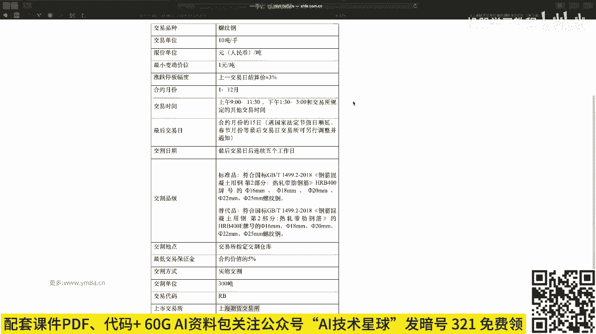

我们看到螺纹钢的价格是先假定哈螺纹钢呃，开盘价格是3351，然后我们以3351的价格买入，一手保证金是10%呃，请问让大家来回答一下，就是说我到底需要付出多少钱，大家在这个聊天里面打一下对。

到底需要付出多少钱，3351的价格，保证金比例10%，快快快，这是一个简单的问题，你说要大家明白，就是保证金的计算比例是怎么回事，对啊，以及合约乘数是怎么回事，对我买入一手到底要花多少钱，Co3351。

Cool，很棒，Nice，OK好好的，我确定大家这个概念明白了，然后呢，大家再就是说收盘的时候再把它唉，这个价格是多少，sorry啊，改这个收盘的价格是3329，我们以3329的价格再把它卖出额。

让大家来计算一下我这笔交易赚了多少钱，还是亏了多少钱，OK有一个说亏了22块钱，还有呢大家都给出自己的答案，OK220一个，两千二二百二到底是多少，嗯所以PNL计算的公式到底是什么样。

就是说首先我们看价格，价格的波动是二，就是说我要以最终的价格减去刚开始的价格，乘以我合约的方向，那就是3329-3351，然后我的合约方向是多，所以我是乘以一，然后还有一个什么叫multiplier。

合约乘数乘以十，所以答案是-200 23329-3351，这个是然后记住我们计算盈亏的时候，始终是嗯等你平仓价格减去开仓的价格，这个千万不要搞错，然后你的方向是一，你是买一手嘛，然后乘以合约数对。

OK然然后我们刚刚也提到，就是说就是说我们是买那期货，期货还有一个就是方向叫叫做空了，大家可能也提到是说啊，某某对冲基金大了要做空做空美国股市，还有raw6不是也做空欧股吗，然后再做空A股，做多美股。

然后亏傻了呃，让大家理解什么叫做空呢，做空意思就是我手上没有这个东西，但是我要卖这个东西，那我只能向你去借这个东西啦，那借完这个之后呢，有借必有还，我借完之后还是要把它买回来的。

OK我们现在假设就是张天，今天做了一个非常机智的交易，他的信号给出了，说在09：22分的时候，有一个这个这个价格会迅速会会下跌，会也就是说我这个冲上去之后，会迅速一个快速下跌，那我就想去尝试去做空做空。

意思是说我在，我们现在假定就是说张三在3359这个价格，3359这个价格OK卖出一手，那那那那那卖出一手啊，呃同学们再给一下，就是说这个时候我的我要的保证金是多少，还是10%的比例。

就是说我这个时候要付出多少钱才能去卖出，这样一手对，那刚刚我记得我刚刚肯定有提到，就是说额保证金它是双向收取啊，不管你是是买还是卖对，只要是你开出新仓，就是你原来没有仓位，我原来手数是零。

我现在如果买的话，手术就变成一，那我是要付出，就是刚开始的时候3351乘以是对对，然后那现在我要卖了，那同样也算收保证金对这不管你是对呃，也就是说它是双向收取，那双向收取其实是什么意思呢。

就是待会我们讲到就是说交易到底是怎么回事，K3359，OK我确定大家可以明白这个概念好的，那如果是3359，然后在收盘的时候，我以呃刚刚我们说了多少亿，三千二九的价格平仓，那这个时候我们是赚多少钱呢。

还是亏多少钱，3329平仓，对让大家来写一下这个时候是赚多少钱，亏多少钱，以及对，Okay，Cool，好的我看到大家基本上理解了，那这个时候呢，其实我们就要引入我们PL的计算一个公式了，就是对嗯。

就是说呃我其实不用去就这个公式，意思是说我不用去，因为我在程序化交易的时候，真的不可能，我去想我现在到底是多还是是还是空啊，那其实我要想的就是说，我这个最终的价格是多少，我开仓的价格是多少。

我合约方向是什么，然后合约首付一成对吧，这样全加了一串好，OK我看大家基本还是理解了这个概念的，好的，然后我们再回到我们的PPT，然后就是现在大家就明白，就是说这个价格是到底是怎么一回事。

然后然后接下来就是要说的是OK会。

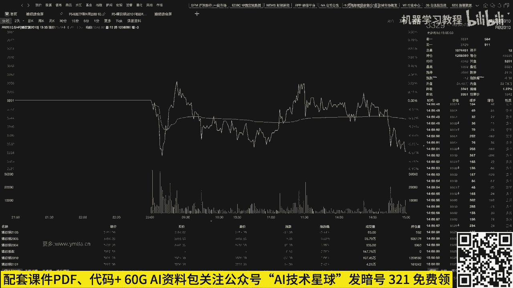

啊我们刚刚就看了一下是呃，这是我们第三个上海期货交易所，那那接下来的其他几个了，其实我还是建议大家去看一下，就是去登到第一个就是其他交易所，大家去看一下到底是交易所有哪些品种。

因为我们这门课程当中会去做量化交易的话，一刚开始会以主要的是去做呃期货，因为期货的相对来说我刚才也说过了，是可以容易上手一些，那么中国有几大期货交易所，然后有上海的，然后有郑州的，有大连的。

然后还有最后最最为厉害的一个中金所，我们常见的就是股指交易，股指期货跟国债期货会在这个交易所交易，所以建议大家就是如果不是很了解的话，去看一下相关的合约，然后因为嗯我们看到了龙纹。

龙纹钢商品等于说五啊十的合约成数会多一点，那股指的话，那可能就是说是按股票的点数，然后他的合约乘数可能是300啊，200啊这种，那相应来说它的合约就会比较大了，那我是建议大家是有空是去看一下，然后OK。

然后接下来我们要涉及到一个非常重要的概念，叫order book，那什么叫order book呢，嗯嗯当然可能在中国，现在不存在真正的所谓的order book，但事实上order book。

我简单来说就是说，我反映了当前整个市场上有买有卖，每一个价位上到底是有多少单子的存在。

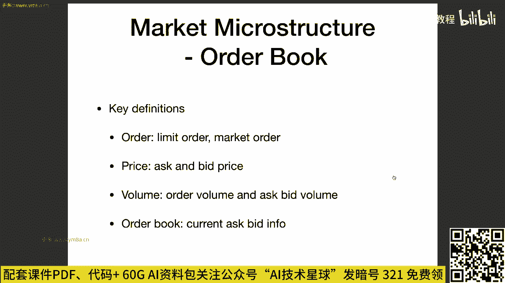

那如果说我们回到这边的来说，那这个时候呢可能这是一个阉割版本的啊，现在只有一档的这样一个行情，就说买一跟卖一这两个分别代表什么意思呢，买一的意思是我当前在市场上交易的人当中，愿意出。

我愿意买出的最高价是3329，那么在这个价位有910一个人，所谓卖艺的意思是，在当前这个我愿意以这样的最，我愿意卖出去的最低的价格，你比如说你摊主我要卖苹果吗，那再低我肯定不卖了。

我其实现在只能卖3331，有584，那其实交易所他所知道的行情，我不仅仅是有买一跟卖一，我还有买二卖三对，让我目前来说上七所啊，前一段时间它是开放了五档行情，就是从买一到买五，卖一到卖五都是给放开的。

然后对应的后面的手术也是有的，然后那真正的order book呢，所以说大家没有想象一下，就是说这个数据到底是以什么样的频率去更，新的，理论来说，真正的order book是只要市场上有成交。

甚至说有挂单，有人愿意去挂这样的价格，我从911到变成912，市场更有效的市场来说，我都应该把这样的信息告诉大家，应该说啊，那边有人愿意3329买一手螺纹钢，但事实上大家也看到我们这边的。

就是我们这样的一个明细，是每隔0。5秒才会去给大家推送一次，那注意那注意是这个时候是什么呢，这个是成交，那这个是成交，成交是怎么来的，大家可以观察到，就说我们有一个严格的一，就是买一小于卖一。

那为什么是要这样呢，因为如一旦有人说我愿意以大于3000，大于等于3331的价格去买入，那么这个时候我们就可以说，那这个时候3331就会去成交一手，那事实上大家看到的这些成交。

每一个每一分每一秒的成交也都是有这样的说，有由于这样的价格发生了，就是说嗯发我愿意买的价格，打到了你这样的价格，等于打到你愿意卖出的价格，这个时候我们将要发生的成交。

那大家在左边所看到的这样一个个序列呢，它并不是反映的买一个卖一，它反映的是每一笔成交的价格，对在事实上嗯如果大家看的更仔细一点，大家看到是每0。5秒一次，它会给出一个价格，每0。5秒给出一个价格。

然后如果没有更新的话，嗯他如果就是说还是保持商品价格，它就保持这样直线，所以大家看到的这样的一个价格的时间序列，其实是由无数笔成无数笔交易的价格所形成的，对你们看到的这样的线是帮助你的人脑去理解。

但事实上我们看到的是什么，只是在这一个时间点以这样的价格去成交了，这样的一个时间点，以另外一个价格去成交了，但我们不知道的是，在中间这个过程里，到底市场发生了什么，这所以说我们说。

我们现在的不是一个真实的order book，因为一个真实的order book，理论上来说，我可以无限的把这个时间点去把它去去细分，只要中间有任何一笔成交，我都应该给出这样的价格。

然后在每每一个中间的任意一个时间点，我都应该知道当前盘口有多少，买多少多少，当前盘口有多少卖，所以我们可以我们甚至可以这么说，一个如果市场提供的order book有更多的深度，有更多的信息。

那这个市场事实上是更为公开和透明的，那么在目前呃，因为这样的市场在中国这样市场，包括股票，甚至有的还会只会提供三秒一个的行情，那一方面来说是由于监管的问题，另外一方面还可以说是技术。

是目前技术还没有达到，或者说即使技术达到，但是没有动力去促成这样的事情，因为对，所以大家现在对于order book应该可能会呃，有没有一些有没有应该是有一些最基本的了解，大家现在有没有疑问的。

就是这样到底是什么事情，就是我我非常强调的是说买一个卖衣这个，然后这个是买一辆跟卖一辆，大家对于这样的基本概念有没有了解，因为这个是我们后面再去做tick级别的回测，非常重要的一个东西。

对我希望确保大家真正的理解了这样一个概念，对我们刚刚所说的order，就是指价格打到了对方的价格，我愿意以3329去卖，或者以愿意以3331去买，我会形成这样的价格，但嗯还有可能市场上发生什么。

因为我们看到的只是这一个点发生的事情，还有可能中间一个人出了3330，另外愿愿意以3330的价格去买，另外一个人也愿意以3330的价格去卖，那么很有可能在这个0。5秒之内，这样的成交就发生了。

事实上我们看到收盘前就是呃，倒数第二个0。5秒的时候，确实是这样发生了对，那那有可能当时的盘口就是这样，就是说你看不到3330的盘口，是因为他们在这0。5秒过程的时候，已经成交了。

对所以说交易所要保证的事情是，我要保证这样的一个成交是动态的，然后我要保证是有序的，谁出的价格高，我一定要让先谁先成交，我们不可能说在这个时候说三千三千，329没有成交，那3300哦。

3000sorry，3330没有成交，但是愿意以3330买的人成交，那显然就是有违背交易所公平的一价原则，对那这样的事情是交给交易所，就是撮合机器布置在应该上海的交上七所。

是在张江机房对有交交一个撮合机器来执行的，他所以他们就是保证这个机器，相当于说我一直在保持，While loop，不断的有单子进来，我不断的去撮合，然后对外广播出有这样的成交信息。

嗯OK然后我们回到PPT，现在OK。

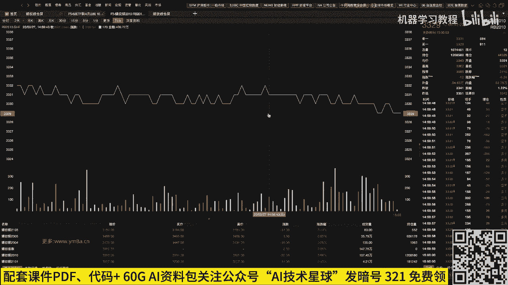

然后我们刚才讲到说是一个要提到一个叫是。

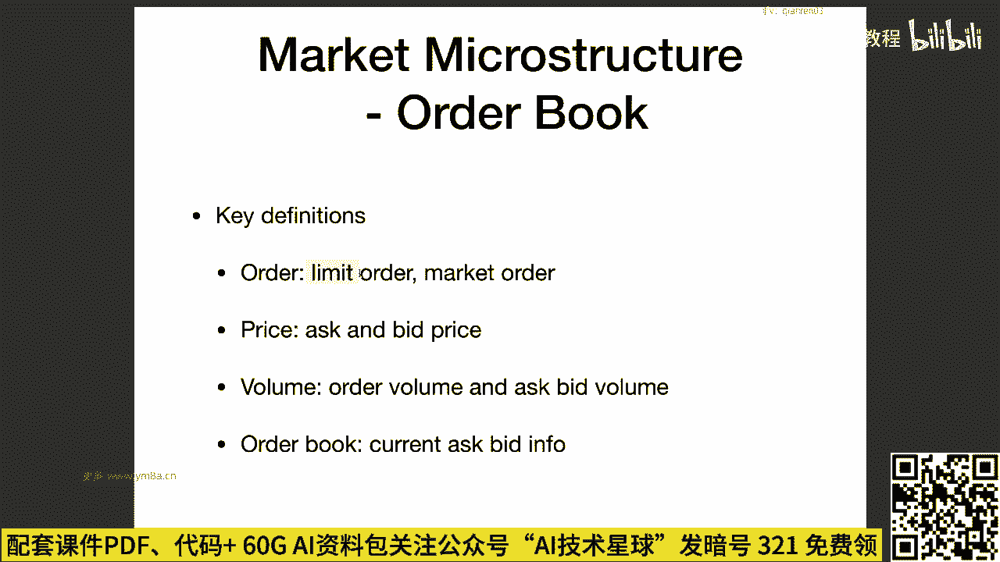

我们刚刚其实提的是ask跟big price，就是说有愿意是呃，愿意的是买价跟卖价对呃，那接下来要看的就是说呃什么叫limit order跟market order，Limit order。

意思是说我这个limit alter，我需要给定的是一个价格，那那给这样一个价格，比如说在这个时候呃，举个例子，比如说在嗯在这个地方，我希望他接着下跌3341，我这个时候只挂了一个3340的价格。

我希望以3340的价格去买入，这个时候我们这就叫limit order，那这个时候他可能就不会去被成交，应该不是可能他是一定不会去成交，因为这个时候市场上最优的，就是说最优提供的价格可能是3341。

但你打不到，我最多只愿意3340价格去买入，所以limit order意思是限价单，我限定我买入的最高价格是3340对，那有没有可能，市场就这样的价格会低于3340，就是说我愿意以3340价格买。

结果以3339成交了，那么显然也是有可能的，比如说有个大货，突然手上有1万手要把它砸出去，那这个时候很有可能就是把他，把他把1万手就往下去卖，他他是以一个很低的价格，比如说他说三千二零的价格去卖。

那会一不小心哎，你发现你正好就把你被你这个单子，就被他这个单子给吃掉了，对，那那么这种情况是有可能就是你排在你前面的，有很多的单子对，OK然后我们要提到的是market order。

market order叫试驾单，试驾单的意思是什么，我希望我以当前就是说呃，如果说我是买的话，我希望以涨停价买入对，那我这个时候如果是如果是按3341，那其实其实昨天如果说是结算价是3300。

然后有3%的涨停，3%，which means差不多是99，那我差不多我大概会管，就是说market order，是可能会以3399的价格去买入，那事实上3399，在这个市场上是非常高的价格。

那么直接就有可能会去被哎，就应该直接就会被对方给吃掉，那么要注意的问题是，试驾单跟限价单，其实是有时候需要去根据你不同的策略类型，去选择我要下什么样的单子的嗯，大家还记得。

就是可能隔一段时间就会有个乌龙指，乌龙指是什么呃，乌龙指什么意思呢，就是可能有人是过来挂钓鱼单了，比如说我刚刚挂3399，正常情况下来说，市场上不会出现这么高价格，因为3331有584个人。

584首单子想要卖，何况3330一上面还是有很多的，很多单子，但是可能出现的情况是在交易嗯，我这个时候可能这个已经快要交割了，这个合约已经没有，很多人在交易上面可能只有几手。

然后又在极端情况下价格波动比较序列，发现上面没有人卖，然后你挂个3399，还真有人在，在那就给你这个价格成交，那你这个时候你可能就会发生非常大的损失，你一下子就会亏掉了差不多100个点，然后你就一手。

你差不多就要亏1000块钱，是非常严重的损失，但事实上股指的话，那呵那就更夸张了，那可能交易员今天可能就要被对，这是所以说非常严肃的问题，就是但是就是说试驾单一般情况下来说。

只有在流动性非常好的时候才会去考虑用，因为这个时候我要考虑的就是，我考的slippery叫华点，那我说我这时候市价单，大概说我这时候买入可能就是3300，31成交，我差两个点不亏。

如果盘口流动性不是很好的话，那我可能四五个点，那其实就是还是挺不少的一个钱对，然后然后就是说刚刚我们也提到了，就是所以说在order book这一块，希望大家了解什么是买单，什么是卖单。

然后买一辆跟卖一辆对，然后这个volume的话就是说嗯对，然后大家有看到就是每一个每就是每一秒的话，就是每每报价一次，他会给一个上一个，就是说从上一个0。5秒到现在，我到底成交了多少。

那事实上没有成交的话，那可能他就不推送这个行情信号了，对嗯那事实上就是CCTP的接口当中，你嗯买不同的等级，你能看到的行情深度不一样，就是你要如果要买level two买买五档的行情的话。

那事实上你是可以花钱去买，你也能够看到五档行情，但在市场上，你说你比别人看到更多的信息，你用更高效的方式去处理信息，你就越有可能去赢得相应的优势，对嗯，OK然后我们看一个。

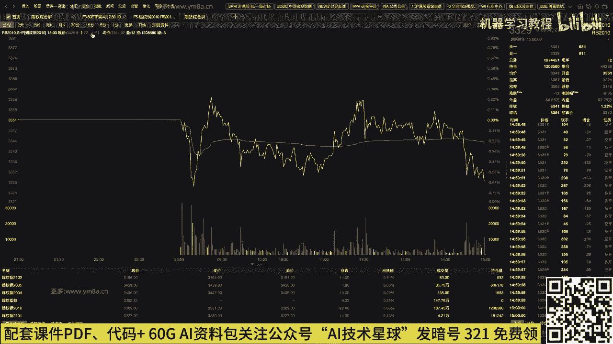

OK所以刚刚这张图大家应该也OK，然后这个是万德，然后嗯大家的反正有其他类似的。

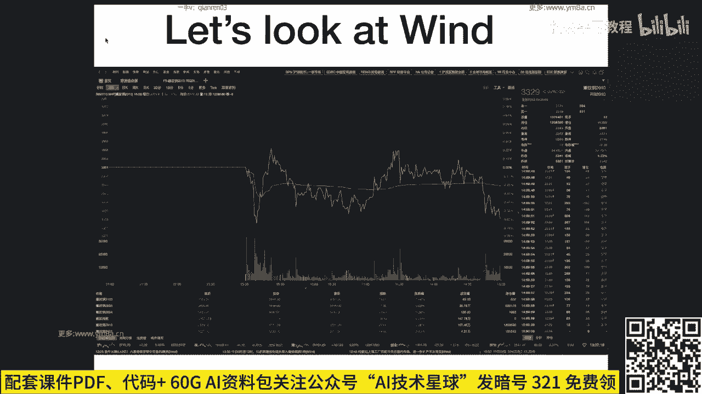

就是看盘的软件，其实应该都会有类似的功能对，然后这个是看到的是一个，就是说嗯相对来说是会多。

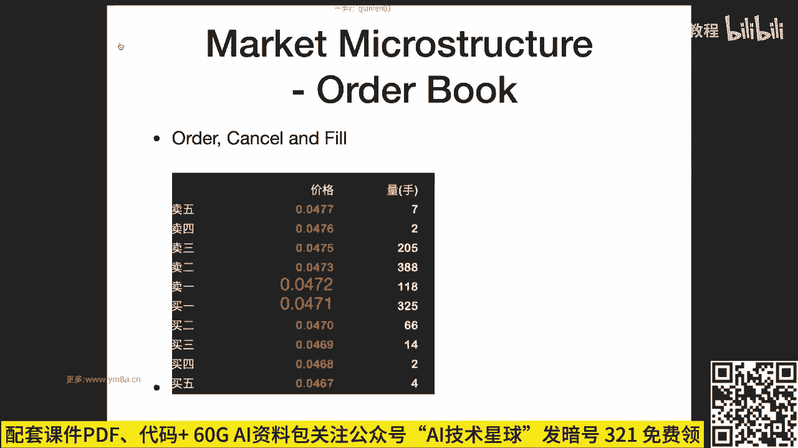

还是行情的深度会多一点，这个是一个期权的价格，我们随便找一个ETF期权对，嗯那就作为气象来说，大家就能看到说你其实看五档的盘口，能看到的信息就更多了对啊，那严格来说就是从买五到卖哎，从卖五到买五。

价格是严格递减，然后对然后大家会看到有相应的手术对，那按照事实上来说，如果我这个时候想要去买个300首，那是没有问题的，你可能买个300首，以需以市价去买入300首，472，迅速成交118嗯。

然后你可能有可能去473再去成交一些，当然你还要考虑就是市场上其他人是不是也去，也在去想买买这样的东西嗯，你不一定能说都按照四四百七十二，或者是473的价格去成交，对，所以说希望大家去了解这样一个东西。

OK然后然后我们刚刚就是说提到了说呃，我们看到的是盘口，然后接下来我们要看的就是，我们刚刚看到叫tick data，那每一个tick data是什么意思呢，就是说那我在交易所，在每一秒的每一秒的时候。

都会去广播这样的行情，然后他会去说嗯，他这一笔的价格成交是多少，然后，成交是多少，买卖盘口是多少，那么话不多说，我们开始真正进入量化的部分，我们要来看一看，一个真实的市场行情是什么样的。

这个我们看到的是图啦，当当当就是交交易员，我不可能看着这个tick去交易，这也太夸张了，一天两三万个tick就是0。5秒动一次呃，这个这个这个我们叫炒单选手，人肉高频。

曾经他们也我不确定是不是现在还有在上海，就是期货交易所那栋楼里，还是有一有一些人就是在进行人肉高频交易，事实上就是如果行情好的话，他们会赚非常非常多的钱，因为一买一卖，一买一卖，加上所谓的杠杆跟杠。

加上再加上很高的杠杆，实际上赚起钱非常可怕的一件事情，对，当然他们现在竞争的对手是，可能是更多的高频做市商对，因为程序跟人在做这个事情，我觉得人年轻的时候可能精力很好的时候，状态很好。

做这样的事情可能还OK，但是机器是如果我调出来的程序，我又画好了策略，那么实际上来说我只需要付一部分电费，他就可以不断的帮我去执行，OK然后我们来看一看嗯，市场上的行情是什么样的。

然后就是嗯这一次的作业就是其实是讲一讲，就是这次作业我们大概要做什么样的事情了。

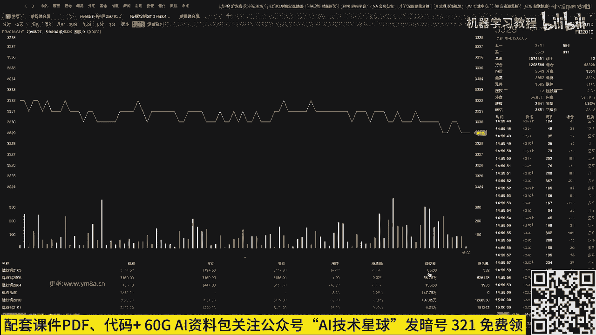

嗯all right che，我们来打开一个lecture notebook，就是我做作业可能说方便用lecture notebook来看，然后嗯，但事实上就是这这这因为这个只是一个玩。

就相当于一个玩具，就方便大家用JUPITER，然后去写一些代码，但事实上去交易的时候，你还是要把它就是把你写的一个一个function，去组合成相应的模块对，然后首先就是嗯嗯我我我了解一下。

就是你现在看得懂这些代码的同学，打个一，我原来我默认是大家都都都知道这些东西对，能看得懂的，打个一，嗯OKOK有延迟，好的好的好的，所以所以很棒很棒，所以大家都明白这是这是什么意思了，对那那这就很好。

那这次作业可能会会就会会大家帮助大家，就是嗯可能会平缓一些对嗯，所以所以说就是我们看到的是，刚刚我们说是我这个拿的是RB2005，就是在因为嗯对应该在2月2月底的时候，2005可能还是。

就是相对来说还是比较活跃的合约，所以我挑选了这样一个合约，我们刚刚再复习一下，这个是螺纹钢RB20年5月份交给的合约，然后他这个日期是2020年2月28日，然后呃为什么要encoding，这是对。

因为我从就是我从数据供应商拿来数据，它前面都是中文，所以对，所以我在下面就是把它换成了英文，这样这样子就会嗯就是可能你大批量处理数据，还可能会好一些，对大家看了一下，就是一天的数据是2万6944行。

然后嗯对对，然后就要看注意的时候，就是说交易所嗯就是在实盘交易的时候，也也会有人因此踩坑了，就是呃我并不是交易所推的一笔行情，都是真实的交易行情，对交易所是我并不能保证我推的每一行。

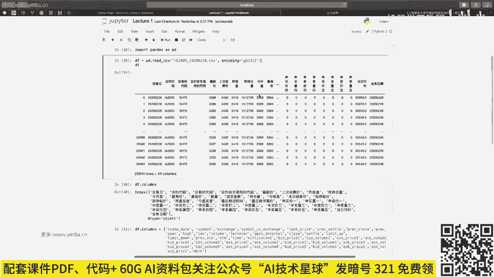

每一次每一个数据都是真实的行情，那第一个数据肯定是我开盘的时候，他我推的是昨天结算价，这个可能他是在sorry，这个能看得到我时间吗，就是他可能是在08：30对，他可能是在08：30给推出来的。

它并不是说他不是在嗯，他不不是在九点钟开盘的时候推出来，这个时候就会就是说，如果你把这个行情当做真实的市场交易行情，并把它算到你的策略里去进行预算，那可能会造成大灾难，事实上我也有朋友是因此是踩坑的对。

所以让大家在实盘交易的时候，是需要注意去过滤一下每一个tick的，这样一个的呃信息，然后我们大家看到，就是说这样一个交易所的行情的，就是交易所的原始的CCTP里收到的行情，有什么东西呢。

嗯交易日合约代码，交易所代码，然后这个里面对，然后我们大家看到合约在交易所代码这里栏，没有没有对，然后最新价最新价就是我们刚刚看到的对，你在每一个盘口你看到成交的价格叫最新价。

所以交易所他不会告诉你说呃。

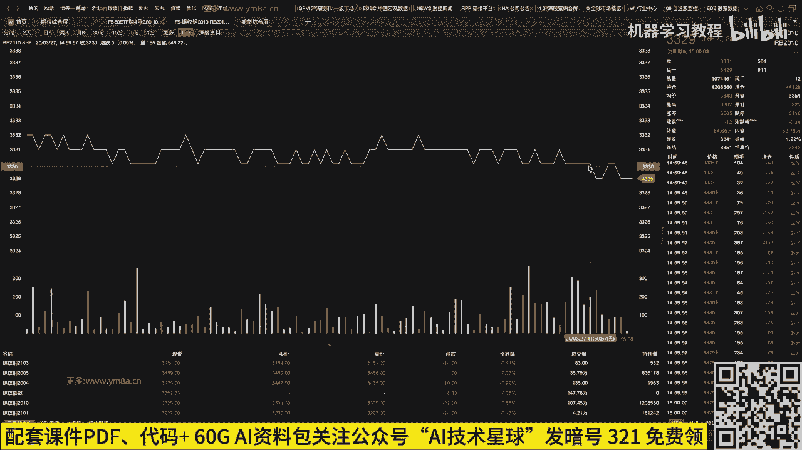

对他不会告诉你说现在就是嗯有多少价格，在多少价位成交，他不会，他只会告诉你，我每我隔了0。5秒咔切一下，这0。5秒成交的价格是多少，那那这个所以我们这个叫伪伪素的稳，这叫sudo order book。

它根本其实不是一个order book，它只是一个order book，在无限时间长流里，在每一个时间节点的这样一个截面，我们是一个SNAPSHOP，我们叫它一个SNAPSHOP，所以说是他这样每0。

5秒我切一次，我看一下哎，0。5秒当前的最新价成交价格是多少，3388，然后然后大家看到就是说最呃上次结算价，上次结算价，其实你呃你可以理解为，就是昨天的结算价和昨天收盘价。

要注意就是昨天的结算价和收盘价是不一样的，对，但结算价是应该哦，我有点忘记了，我不太确定就是他是怎样的average，他应该是把一段时间内我成交的呃，单子进行加权平均算出一个价格。

因为为什么不能把收盘价当成结算价呢，是因为呃结算价，我结算价，它一个很重要的意义是帮助期货公司呃，去计算当前的风险敞口，就帮也会，就是说每个人个人客户也会去计算风险敞口，就是说你这个时候每天你要就是你。

你要去按照跟昨天的情绪价比，你是赚还是亏，那如果说我把收盘价去做结算价，那很有可能就是说大家会进行叫我MANUPLATE操纵，我在尾盘的时候，如果我是做空的对吧，那我不妨就呃。

我联合其他人一起去下一个很大的单子，把收盘的价格打到很低，那这个时候会出现什么情况呢，因为一旦你的保证金出现了亏损，那交易就是说你你你你账户里钱，就是说我如果出现了浮亏很多，那交易所和券商和期货公司。

会要求去追加保证金，那追加保证金，那一旦说真的是空头跟多头，打到非常极端的情况下，支加保证金是一件非常要命的事情，那如果我可以通过这种方式来够能够操纵市场，本质上来说我可以给对手，那岂不是谁资金多。

谁就占有更加绝对的优势吗，那这个时候其实可能也是有违市场公平的，就本来说市场反映出来，今天的行情，差不多就是平均下来3426，但如果最后又往下打了30个点，那三变成了3396，那中间这差了差了30个话。

那这个事情是其实还是挺多的，30个点，每一首就是嗯300块钱，如果是你手术一搭的话，那确实还是非常对，就是非常非常多的钱，所以所以说就是说，交易所一般会用结算价来做计算保证金，而不是收盘价来计算保证金。

然后我们再看到就是说嗯昨天的持仓量，大家看到这个数据是从头到尾都没有变过的，然后今天开盘对也没有变过，然后要注意这个最高价是什么意思啊，就是大家想一下，就是我们在做交易的时候。

你在今天开盘的时候知道今天的最高价吗，嗯那显然不是这样，就是说那那所以这个最高价是一个动态的概念，它指的是从今天开盘交易到现在为止的最高价，所以大家也看到就从338833389，然后到下面是3393。

那显然这个最高价是一个呃，大非严格单调递增的一个序列对，然后OK然后做收盘，做市场经考的最高价呃，那同样的最低价也是这样子，然后数量的话啊，OK我是不是应该帮让大家看一下这个东西，哎呀先全跑一遍吧。

um okay嗯，我刚看到了是对，我们刚刚看到哪了，看到的是我们看一下数量嗯，Previous open high low volume，就是其实我们说的成交量了，对大家看到成交量是呃是一个。

比如说到今天收盘为止是呃今天成交了，哇塞有点多啊，但嗯对嗯要注意，就是说嗯成对之前成交量的话，可能有个规则的变化，可能大家要去注意一下，就是之前可能说呃有一个人买，有一个人卖，我这个算一手还是算两手呢。

有的有的交易所算两手，有交易所算一手，有的交易所曾经算一手，现曾经算两手，现在把它算成一手了，所以大家可能要去注意一下，就是这样的时间点，就是说我们在量化交易过程当中，有非常多小的细节要去注意。

那很有可能说你这个成交量算不对，那导致你因子后面计算方面都不对了，就是你garbage in garbage out，所以我们说我们刚刚强调说数据的呃，处理跟清洗是整个量化交易非常重要非常重要。

非常重要的部分对，所以说我也希望就是说带大家去看看，原始的交易所数据是什么样，我们首先要对数据是有一个最基本的了解，才有可能在在技术上去做出相应的策略了，然后呃turn over就是成交额，成交额。

那显然就是成交量乘以成交的价格咯对吧，所以它会是一个比较大的数，对嗯对，那事实上你通过成交额，也可以推算出一些有用的信息啊，比如说嗯是不是都是以这个在这一个tick内，是不是都是以这样的价格去成交的。

事实上你去算一下，你可以算出就是在这个tick内，所有这个0。5秒之内成交单子的平均价格，因为我有成交额，我也有成交手数，对不对，成交额的差就是这个0。5秒之内成交的东西，成交的总价钱。

然后我也有成交数，有成交的volume的变化对，所以这个是一个相对比较有用的信息，然后还要起到一个open interest，这是一个持仓量的概念，为什么叫持仓量呢。

就是大家还记得就是说我再买入一手期权，如果从额买入一手期货，从零开始的时候，我买入一，那这个时候我只仓它变成了一呃，那有没有想过你这个对手盘是谁呢，就是谁跟你做了这样一个交易呢，那那事实上对手的时候。

对手肯定是卖给你的，那有一种什么样的情况，就说我对手原来有一手期货，我现在卖给你，那可能是这样的情形，那还有一种可能是我对手我没有期货，但对手就是在做空，他也是卖了，所以这个时候要注意持仓量。

那在这个时候，如果说对手是做空，对手做空你做多，你们俩刚开始都没有仓位，那这个时候持双方的多空和多，多仓的持仓量跟持仓的持仓量都会加一，所以这持仓量是我们有一个严格的定义。

就是多仓的持仓量是等于空仓的持仓量对，因为你有买就有卖，因为合约刚开始的时候是不是凭空创造出来，是就是说一定是市场上有人交易，才会有人持仓，不可能说市场只有只有只整个市场，所有交易者统计起来只有空仓。

没有多仓，那显然是不可能的，你找不到交易对手盘对，那那这个时候如果说我们刚刚提到的，说两个人都没有对，那这个时候持仓量就会两个人都没有，一个人开多，一个人开空，这时候持仓会增加。

那那那这个时候还要注意的，就是说我们看到啊，那什么情况持仓会减少呢，大家有没有注意到，刚开始我们开盘的时候，就是昨天池塘是1300呃，150，1万3亿37，然后到时候怎么就149万了。

就是说这个时候是什么意思呢，就是说我原来那很有可能，刚刚这笔成交会发生在什么样的情况呢，我有这样的一个期货的多单，但我想把它卖平，对手有一个期货的空单，想要把它买平，那这个时候市场也是一买一卖。

但一买一卖的时候发生了一个事情，说唉市场上多仓跟空仓持仓都各减小了一，那这个时候就会发现了诶，Open interest，是的，这既然是既然数会变少了对嗯，所以这块实际上是会反映一些东西。

那什么样的情况下大家说愿意去开新仓，什么样的情况下大家都愿意去减少持仓，那其实这个里面就会有一些隐藏的，非常有用的信息，那如果说作为一个discretionary主观交易者，如果不看这些持仓信息的话。

那其实他会错过很多很多有用的信号对，所以刚会讲到就是多仓跟空仓这样的一个概念，大家有没有就是理解，就是包括就持仓量为什么会有时候会增加，有时候会减小，OK如果没有疑问的话，我就默认大家都是OK的了。

然后OK嗯，DF打cos，What uh open，为什么没有啊，我是不是没有把open interest今收盘，whatever这块我还没有搞懂，为什么待会去看一下，可能然后理论来说。

你在今天的刚开始是不知道今天的收盘价的，对，也不知道今天的结算价，然后再看一下limit up涨停价，所以说嗯为什么要用这个价格呢，就是嗯这个价格是帮助大家在下单的时候，你不可以下超过这样的价格。

对你如果下了这样超过价格下到CTP里面，他也会被就是拒单成交，对这个这所以说下单的时候是希望大家就是嗯，所以这里面有很多很多的细节，然后还有一个同样的limit down额跌停价。

你也不可能是低于这样的价格，然后接下来previous嗯，OTM跟OTM就是70度的概念，这个是在期权当中，在之后课程的最后部分，大家会跟大家提到一些人家在期货当中，你可能就不需要这些东西了。

所以我们直接就把这个就是，就忽略到这两个栏目，然后还有个time喂，df columns出现什，OK我知道了，因为我在这边把把它给去掉了，对我只保留了这些，在下面，Columns jump。

我只把它保留这些东西，嗯OK因为刚刚那我就时间还是留在这吧，然后重新跑一遍，OK我们来看一下菜啊，这时间是相对来说会比较重要一些，大家看到就说我没有骗大家啊，就是他在非交易时间。

还是有可能会给出信息的哦，8。59分，OK8。5市场还没有开始交易，事实上是第一个交易是8。2的，是9。00开盘呃，事实上不是9。00，大家还要注意叫millisecond，后面还有一个毫秒，为什么呢。

你九点钟开盘，但是你收不到信号，你只你只有到09：00：00点500ms的时候，你才会收到第一笔成交价格，OK所以这个时候就是说嗯，就是说这个在上海期货交易所，它的价格是以0。5秒的一个频率去推送的。

那这个时候大家要注意了，这个呃这个所以大家要注意时间上，你需要去我们在做作业的时候要去去处理一下，你需要把嗯时间跟毫秒合在一起对，然后嗯然后这个时候对嗯，再去关注一下我们的。

我们看到每一秒的时候能够看到盘口，这就是我们刚刚看到的买衣跟卖衣对，然后我们看到beat是始终小于ask对，然后还有他的volume，然后诶事实上就是这average price啊。

这个可能是我自己去算的，还是他交易所给出来的嗯，这个可这个可能啊，因为我最近换了一家，就是社区的供应商，基本跟原来保持是一致的对，然后大家要注意的一个就是日期的问题。

就是为什么要说前面有一个前面有一个交易日，后面有一个叫业务日期呢，就是嗯因为我们现在是没有夜盘，但事实上就是如果拿之前的数据来看，有夜盘的时候嗯，那时间不是从2020年2月二月28，日的早上九点开始。

而是从27日的晚上20一点开始，因为交易所规定从20一点开始，从前一天的20一点的夜盘作为这个假日，所以你们会看到他的trade date，是2020年2月28日，但是他的业务日期是。

2020年2月27日对，所以大家在做回测的时候，就是把所有的时间去组合成这样一个时间序列，需要去注意呃，就要去注意它的业务日期跟交易的区别，因为你只有把时间序列按照正确的顺序，去把它投入进去才。

你才能保证你的回测的结果，会相对来说就是你数据会比较准确一点，从而才有可能做出回测的结果嗯，所以现在对于这样一份tick数据，大家有没有疑问，有有还有什么问题吗，其实今天讲的内容。

第一课也不会想给大家讲太多内容，然后待会再留一点时间，其实讲给大家讲一下，今天作业其实就差不多可以提前结束了，对啊，OK现在大家对于这部分有疑问吗，对然后我还想强调一点呃，这上面的时间是交易所的时间。

交易所的时间不等于本机的时间，对，那呃，因为那那这个时候就是说，大家想要去优化的目标，就是说我尽可能的把我本机的本地运行时间，去靠近交易所时间，那这个时候有两种方法，你用更好的硬件，但事实上最有用的是。

你把机器托管到交易所旁边就好了，但事实上嗯，现在我知道的稍微靠谱一点的量化对冲基金，都会把自己的交易机器托管在机房里对，但事实上就是说上交所附近有机房，而且上七所也有，然后深交所也有，然后然后大连也有。

郑州也有对，所以就是说理论上来说，可能说交易所的机器撮合机器就算连上一层，然后它下面一层就是你的教育机房，那确实信号可能如果你再用内网传播的话，那可能就是非常快的速度，可能是微秒的级别。

那你就已经收到了信号，那可能大家散户如果通过互联网的专线来传播，到互联网来传播，那无论如何延迟都是在毫秒级别，毫秒跟微秒，那显然不是一个事件，对，那这个时候大家就是说大家也可以理解。

为什么有时候抢单都是抢不过机构的，对，OK所以现在就是对，其实今天课上要讲的东西就先这么多，然后我现在想休息一下，然后课后待会再来，我再讲一讲，今天我们做点什么，对，现在开始进入我们休息15分钟。

然后大家有什么问题的话，可以在聊天室里给大家给我反馈出来，因为我不知道呃，就是这这部分数据有没有理解清楚，那千万要完全完全保证对这个数据是理解透彻，每一到底是什么样的事情对。

然后我们才会在一步一步的去构建，我们的数据库，然后去做交易策略对，因为因为这个事情是非常的critical，可能很多人刚开始嗯，就我我知道有一些量化的提供商，就优矿之类的。

可能最刚开始他们做一个所谓的K线，可能用的时间都会有一些问题呃，对买二是指出价第二高的价格呃，是第二高点，你可以看一下啦。

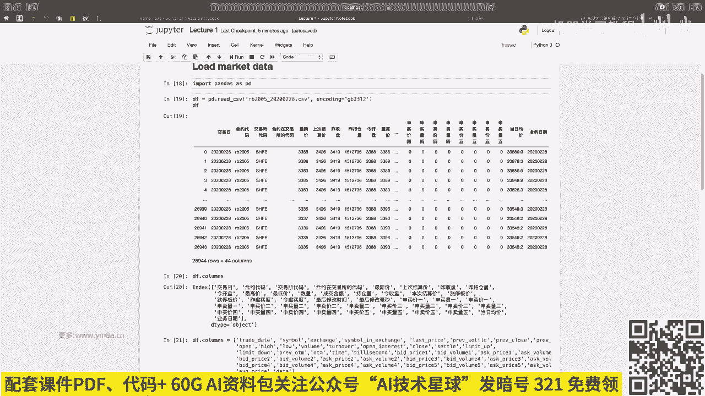

给我们我们刚刚不是说了吗，从迈五到嗯，从卖五到买五对吧，价格是严格递减，那么买二是愿意出的第二高的价格呀，所以是对的对，然后下一课其实就是讲一讲，我们因为我们看到的是一个个的tick。

但是对这一分钟线是怎么来的嗯，5分钟线又是怎么来的，日K又是怎么来的，对以及我们为为什么要做这样的事情，对，但是均价的话对，为什么大了十倍，其实这个就是其实就无所谓了，如果他大了十倍，你除以十就好了。

当日的均价肯定就是嗯今天我交易了多少手，那么成交金额是多少，我们简单验证一下他是不是这样的，对吧嗯。

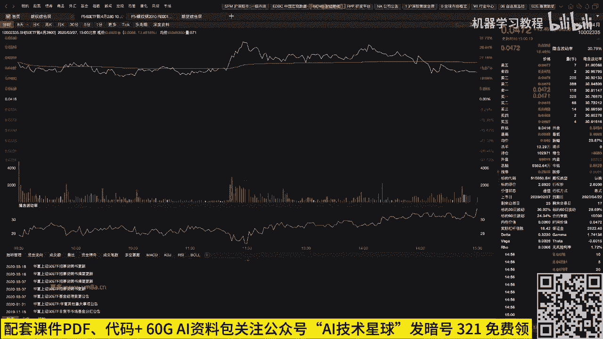

当日金价，我们自己来测一下吧，就验证一下当日均价是不是，我们算一下啊，当日的均价，那无非就是当天的成交金额对吧，除以当日的成交量咯，那我们不就是肯定价格嘛对吧，然后这个时候我再看一看DF，为什么那个。

这时候大家可以看到了average price，跟我们算出来average price是不是一样，是的，那这模式run到小数点，后果我们是把它全部算了出来，这样应该说如果想要更高的进度。

自己算下来没问题，那刚刚同学们提到说为什么是乘以十呢，那这个为什么大了十倍，大家没想一想，为什么呢，成交额到底是怎么算的，他是按保证金算的吗，我们刚刚会提到，就说每个客户的保证金水平不一样。

所以呃average price成交额包括它的成交额，虽然真实的合约或3500，需要乘以合约损失，Yeah，所以是十对，OK现在是休息时间，大家不要紧，不要那么紧张，就是回来跟大家闲聊对，好了。

我喝口水，稍微休息一下。

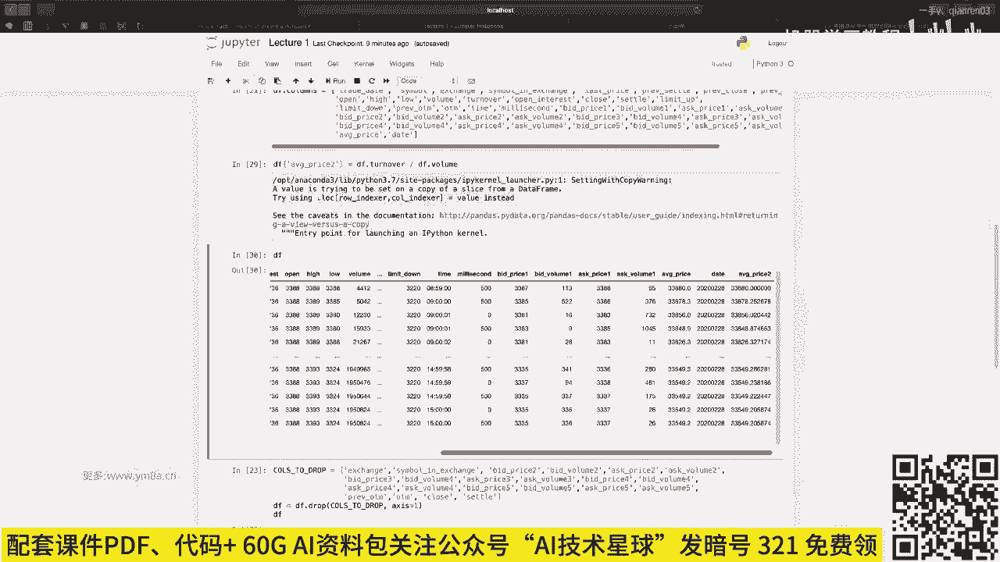

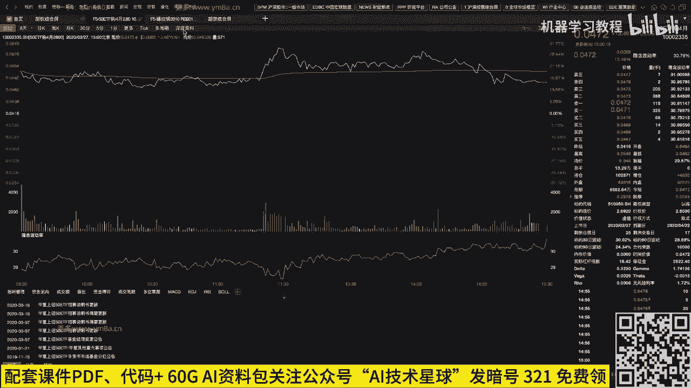

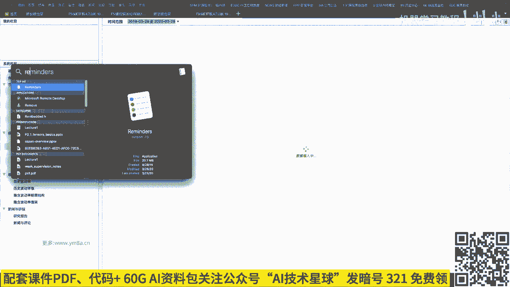

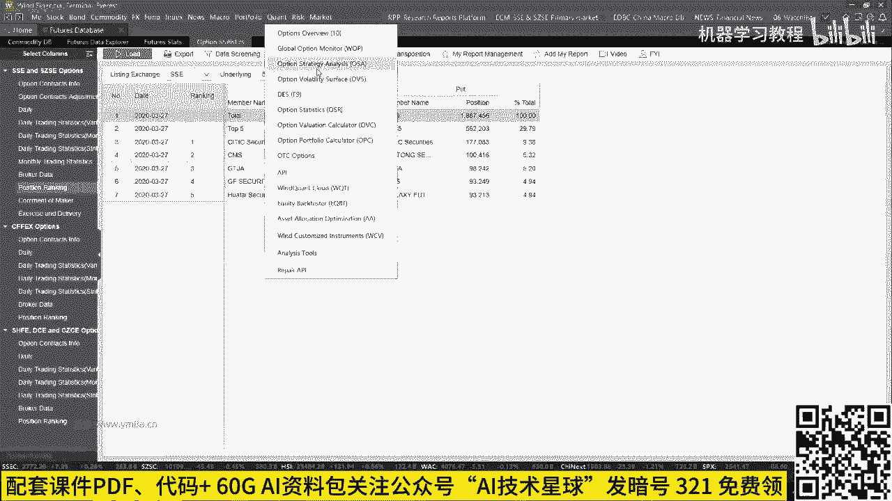

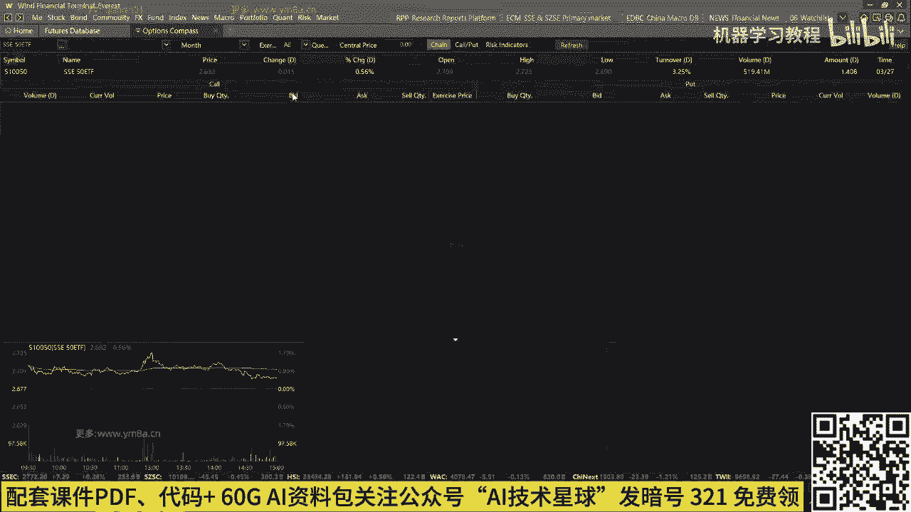

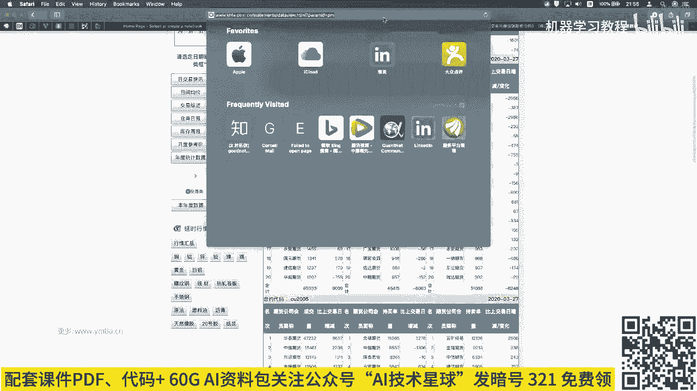

好的嗯，我们开始今天的最后一个section啊，讲到现在也是可能我需要练习一下发声技巧，嗯现在大家能听到声音吗，当时休息时间不是不是不是说麦坏掉了，好刚刚刚刚有同学提到，就是说呃我发现很可。

很多同学还真的是对市场有很敏锐的直觉，就是刚刚提到一个内盘跟外盘的概念，其实是反映市场中当中是主动成交，还是说还还是说是这是是增仓还是去减仓的，这样一个概念，然后包括说提到的持仓，其实嗯对。

也是也是大家在就是做日级别交易的时候，或者说是在做宏观交易的时候，要去考虑的一个因素，因为经常有人吐槽说啊，只要是中信股指期货有加空仓，那第二天股市就要大跌，我不得不说这个里面OK可能是有一些相关性对。

然后就是至于说想要把持仓这样的因子去，能不能用到你的交易策略当中，但事实上就是说大家也能看到，就是说每一个每一个数据，其实都需要多种多样的信息，也多种多样的动呃人员去参与了。

因为如果单纯的就包括这样一个同届池塘，如果是作为机构，OK我们有万德，我们可以每天去爬掉的数，就是直接用API去取这样的数据，但是如果说你是个人的话，那可能得对你的嗯。

对你的教育要对你的编程功底要求多一点，那可能你得每天去主动的去交易所的官网上，自己去查这样的数据，或者说是其他的一些地方去拿来这样的数据对，反正就是既然数据都是拿来，这都可显然就是爬下来是相对来说。

只要不要太过分还是可以的，对，当然有，所以说机构的优势说是嗯，有就是数据供应商会好一些对，因为之前因因，因为万德实际上还是我在上一家基金的时候，就是嗯就是老板还给了我这个账号，还算比较好对。

就是即使我现在不在那边工作了，我还是在帮他养着这个账号，我自己还在用对啊，如果说想要就是说海外市场的话，那可能就是买彭博或者是那个REUTERS路透的，你可能就就可能都是必须的，那这样的价格还是挺贵的。

万德相对来说还是可以接受，大家说比如如果这真的资金比较大，就是说想要搞个万德，那很简单，就自己注册一个公司，然后再以公司的名义去买万德，一年应该几万块钱，10万块钱可能就差不多了。

对然后然后如果想买彭博的话，对不起，这个暂时超出了我个人还了解一下吧，因为国内我了解到，就是国内的话可能用万德，其实本土化做的还蛮不错的，因为那万德也是一年一年以来，我感觉就是它的功能。

包括性能也是越来越强大，对他应该我记得可能是2000多刀一个月，就他是按他是按就是按人头来收费嘛，就是一个那BOOMBERG的那个终端，对是其实好像看起来也还行，但是相对于万德这样的性价比。

我觉得大部分机构还是要去考虑万得，毕竟买回来了几10万的东西，结果发现赚的钱还没有几10万，那不是很尴尬，对OK嗯，好的，现在那其实就是，那那我们接下来就是第三个课程，我就稍微快一点，第三课快一点。

就是我们先简单go over一下，我们这节课要做什么样的事情，就是这节课作业我希望大家去把它完成，去做什么样的事情，然后还有一些包括我看到有一些同学提到了，想要去，如果在准备呃求职跟面试的话。

就是如果嗯就讲完作业这部分，然后会讲一些，就是可能讲一讲求职跟面试的一些准备，然后包括后面也留了几道题，然后之后之后每节课都会在PPT，后面留几道题题目，然后有兴趣的同学可以找我私聊。

就是说就这些题目如果想要解答，或者说之后给出相应的解答，然后嗯嗯没有兴趣的同学，其实在讲完就是讲完课程的作业这部分，那其实就可以结束了，对那我们采取这样的机制，也不用浪浪费大家的时间。

当然你感兴趣的话可以听一听，就是现在的面试是什么样的感觉也是OK的，那现在我们刚刚就是建议的基础上，是说，我们把整个的tick数据都已经嗯load进来了。

然后那homework homework是什么呢，我们要写一个function take to me，然后把take数据整理成分钟数据，那大家要思考一下，我们为什么要用这样的分钟数据啊。

就是就是为什么要用分钟数据嗯，PPT里留了有用，或我或者不用打开PP的，就告诉大家，其实嗯那因为大家也知道在交易的时候，我一天2万多笔，那我怎么知道每一笔其实都是是有用的信息呢。

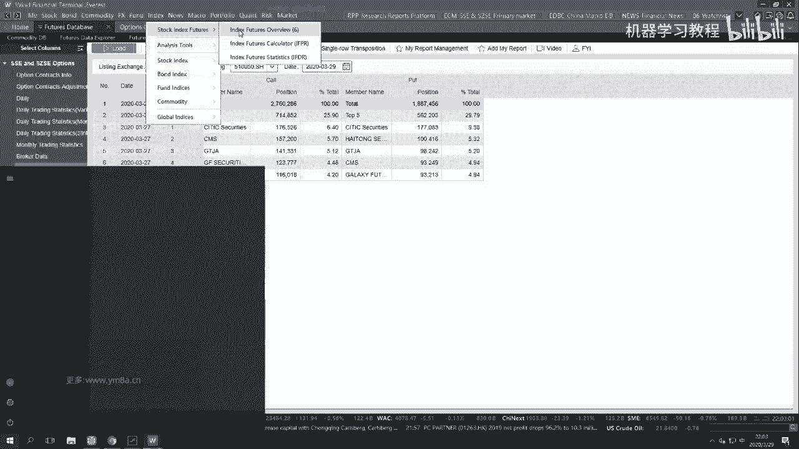

那可以哦，事实上可以大概大概率的说很多的信息，很多交易的时候价格其实都是是杂音，对，那我要做的事情，本质上是说合成这样一个分钟吧，本质上是叫叫做采样，因为我希望过滤掉这样无效的信息，我只希望保留。

就是说像这种毛刺，其实我我根本不care，但是我care的是这种趋势对，那那如果毛刺也有人care，那就是做市商在care，他需要靠毛刺这种来挣钱，但我们现在做的不是这样的事情。

就是说我们今天可能作业要做的事情，先要合成一个分钟坝，大家要去理解一下，这个分钟坝到底是怎么出现的，大家注意说市场上本没有纷争吧，它本质上是一个个tick合成出来对，就我们看到这一个个tick。

它是一个离散的点对，因为因为事实上tick只是分钟的采样嘛，对那我们要做的事情，其实就是把这样的一个个tick，在一个个分钟当中把它给切出来，其实我们刚刚也提到这样的tick，中国的在期货市场。

tick本质上是对于order book，在一个时间单位内的采样，你也可以把它理解为它是一个0。5秒的bar，0。5秒的K线，那我们现在要做的是，把这个0。5秒的K线去合成，我们现在想要做的K线。

那这样的一个K线的关键因素是什么，是高开低收，就OHLC数据，那么那那其实大家要做的事情，就是说我要把每一分钟的最高价，最低价，开盘价，收盘价都给找出来，那这人可能会有一些坑了。

就是这看起来是一个还挺简单的任务，但是事实上大家可以感觉就是试一下，就是这个作业大概一个星期之后，有多少人把它完整的给都给了，给做对出来对嗯就是要考虑什么，考虑几个因素哈。

就是首先就是说嗯我有很多的交易品种，因为我们现在说我只是写一个函数，是写的是是螺纹钢，对不对，那人是写的是RB，但是要注意我们后期要测的是多品种，所以刚开始的时候你可能还是接口需要，就要去留好了。

我我股指期货是09：30开始交易，然后商品期货有的是呃，商品期货一般是九点开始交易，然后有的有夜盘，有的没有夜盘，然后夜盘收盘时间有的是11点，有的是11：30，有的是黄金白银时间，第二天的凌晨两点。

那这个时候你就要去处理一下，就是对你需要知道整个整个这个交易时间，你要把它切出来，因为我们也要看到就是刚刚的bar，我们刚刚的bar里面呃，他应该是没有10。15到10。30，他应该是没有数据的对。

所以你自己要留好，留好相应的接口，把这样的时间点给切出来，对十三十五，然后直接跳到30对，然后当因为个人每个人的习惯是不一样，有的人会单独会在10。15到30之间留一个。

但我的习惯就是说我还是按照时间点的单位，就10。10500去切对，但事实上就是说大家要去去define一个function，然后那它的input是什么，是是你不同的，就是你的ticker。

我这个ticker是新是ZN2005对，那有的是IH，有的是古典期货，你要把这样的是就是接口给留好，你要去输出是什么，是我要输出六个时间段，为什么是六个，我们要从嗯夜盘的开盘，夜盘的收盘，早上的开盘。

早上休市的时间，早上休市恢复的时间，下午的开盘，下午的收盘，所以总共是六个，对你只要把这个六个时间点都给切出来对，然后接下来要做的事情就要去去，所谓的就是说是比较核心的一个部分，就是说我要去嗯嗯嗯。

我要去把，就是说整个这个这个这部分代码给写出来，就是我需要我输入的是一个raw data frame of marketing data，然后我输出来的时候，我需要有高开低收，然后还要有我的成交量。

我也要有这分钟的成交均价等等这样的信息，那大家可以去想一想，就是说这这这样的东西是用什么，然后我提示一下啊，它是呃，我如果对pas比较熟的话，我觉得应该写起来还比较快，但是要保证写对。

可能还是要花一点时间，就是，直接用RESAMPLE这个命令就行了，对这这这样可能大家会快一点，对用这个用用这个命令对写一点，然后用pandas resample，然后要注意就是有一个trick。

就是说嗯你不能说是去看交易所的这个时间了，9。009。01，然后我知道9。00到了，OK如果他是零零，我们算一分钟开始，然后如果是15。00是一分钟，然后这个是一分钟结束。

但是如果是因为那就是就是流动性不好的，会合约呢，如果在9。0000这个时间他没有交易，那那是不是如果你按照这个时间来切的话，岂不是就丢掉了吗，对吧，所以说所以说就是说在流的时候。

就是说在每一分钟刚开始跟结束的时候，如果没有交易，你需要去留心一下，你不能去按照，你不能按照这个呃，就是这个CSV的文件，你一行行的去循环下去，然后到了零按一分钟，到了零又是一分钟，不可以。

这样你需要去自己把时间给切出来，对然后要注意这个毫秒的问题，对嗯你看这个是0。0500，就是如果你要看到，就是如果是09：01分005百毫秒，要注意它是在哪一分钟的，对，一般来说我们会把它归到9。

01到9。02，这个分钟对这这时间的处理是非常的trey，所以希望大家就是把这个function给写出来，然后嗯应该之后会就是写一个，帮大家写一个测试吧，就是你跑一下结果跟我跑的结果看一下，高开低收。

对不对，其实其实其实你可以拿多种多样的数据啦，就如果说嗯就是你不一定要拿期货，然后你熟悉的股票，其实你可以看一下，就是把股票的原始数据给导出导出来看一看，然后合成的K线图是不是这样。

然后做完一分钟之后呢，那显然就是当然5分钟，15分钟，30分钟都要去做了，对，因为因为就是你交易的时候，我刚也没看到，我一分钟的时候其实有很多毛刺的，对这种毛刺，但是你可能看到5分钟，15分钟。

那肯定有些东西就会好很多，这也是说我们为什么要做sample的问题，那这节课可能说我简单的只是用这样的tick，来去做sample，那之后那其实大家有没有想一想，我为什么要按照分，要按照时间去来切分呢。

嗯设置为九点左右，有没有看到对，当sample其实是需要很好，但为什么是预留lag的时间，其实也不是这样的，就是呃没没有说是设置为9。0002，就是我没有没有强调这个意思，我们还是要按照整的时间。

整的时间分钟去切对，那只是说只是有可能说是呃，我们要注意说，这里面的时间是交易所给的时间戳，不是你本机的时间戳，在真实交易的时候嗯，当然一般来说你会在自己的机器上，你要去做时间的。

就是你要跟交易所去做时间校正，用UD运用这种方式去把时间给确认，跟交易所尽可能保持一致，然后你要考虑本机时间跟交易的时间，对一般来说我们两者都会去用，但是这里面的两个两个栏，给的都是交易所的时间。

除非本机的时间对，所以说我们是要先按照交易所的时间出去切，因为因为如果你按照本机的时间去切的话，呃，事实上来说在高频交易领域的人来说，去记录自己本机的时间，是非常有意义的一件事情。

但是我觉得我们这门课程，应该不太可能去涉及到这个部分，就是在高频交易的时候，因为由于网络抖动，他们可能会就是事实上记录带有本地时间戳的，时间和行情数据是非常有价值的一个部分，对。

因为我可以根据这个网络的抖动，根据这个时间的延迟去判断，我这个我策略是不是可以优化到什么样的地步，对那当然说我们在这个时候要做的，可能只需要把，只需要根据交易所的时间出来做就好了，对。

然后我们刚刚再回到说，我们这个说大家有没有想过，K线为什么会是这样子的，为什么是要按照时间来去分对对，但如果我们假设一个极端情形，这一天前239分钟都没有交易，那最后一分钟只有最后一分钟交易。

那这样的K线还有意义吗，对吧，那可能就是前面都是平的，后面都是一个K线，但大部分来说就是大家也要注意，就是说成交量它实际上是不均匀的对，但是事实上还有一种有可能的方式，那我们下节课会不会提到。

就是说我们会用用成交量，按照等成交量去采样去生成新的K线，那这部分就是说当然在实际交易的过程当中，我了解到大部分公司可能是只用K线，但为什么，为什么说是说，因为这门课程。

有时我们可能会尝试一些说用machine learning的方式，那么可以说是这种采样方式，可能在在用经济学来讲，可能说是更为均匀一点对，因为我包含的信息在成交额就在交易过程当中，可能是按成交量来说。

可能是会更好一些对，嗯当然还有还有其他一些采样的方式，下节课我们会是逐渐去涉及到对，所以大家大家明白了，就是我们这节课的课后作用什么，就是对于大家最基本的要求，是自己把一分钟的K线写出来。

那实际上一分钟K线写出来，就是5分钟K线也都写出来了，对然后然后我希望大家尽早去做这个事情，因为这个事情不是说是合成这个数据很无聊，因为因为接下来我们回车就要用这样的数据啊。

然后如果真的是大家把这是给我，我只给出了一个RB2005的合约，一天的数据啊，那如果真的给出来之后，希望大家把把写写写好，无论你说C加加还是Python，希望写成一个文件。

然后你要写成一个pipeline对，因为接下来会给到大家，就是我这边可能有个20个G的行情数据吧，然后其实理论来说你数据越多，然后有因为这里面涉及到各种各样的合约种类，然后涉及到嗯对。

然后我大概我这边是有四到5年的这样的一个，tick数据，然后我希望大家就是说尽可能的去把这个东西，就是把它做好，然后去写成，然后自己去处理好自己相应一份数据，然后如果有机器的话，去建立相应的呃。

有可能是建立数据库，但这节课可能我们不会涉及到，可能直接就用cs软件，就方方便大家对，嗯sorry我呃呃时间划分，嗯哦我没没有没有提到，我刚刚一直说不是说不能按照交易时间，是交易时间，还是我。

我提到的说是是要按照交易的时间去划分，对对也就是说这就是就是大家去注意注意一下，就是对注意一下，就是说这个时间里面它是带有毫秒的，所以大家要把两个时间合在一起去看对，就千万要注意这个是带毫秒的时间戳对。

然后刚刚提到说要日级别的K线，肯定不会啊对啊，那那那显然就是说我们自己就是包括，其实我可以跟大家闲聊一下，就是啊我朋友就是他最近就股票交易，就是因为他是做日内人，就是不是做日内啊，就是做股票的指数增强。

应该是现在现在比较流行的一个策略嘛，然后嗯对他还提到一个说，我可能挖掘到了很多因子，但是日内的数据可能就是日级别的K线，其实是比较少的，但事实上就是说我总共5年，也就是说1500个，1560年。

1500个点，那1500个点，然后3000只股票，然后对那其实能做machine ine，或者是用嗯用遗传算法，各种各样的方式去挖，因子的空间其实是比较小的，那这个时候嗯可能确实是没有什么更好的办法。

所以说为什么大家看到，就是说最近说股票的日内增强策略，大家会就是一线的对冲基金会做的比较好对，然后因为日呃说实话就说在同样的情况下，样本数更多，那么我们可能能够拿到的特征也是更更，也是会更多的对。

那因为一个日内，大家也看到一天就有2万多条数据，跟一天一条数据，那显然不是两个不是有可比性的，那为什么说建议大家用这从期货开始搞呢，因为我也觉得就是相对来说，第一数据获取的成本会比较低，嗯对。

因为你可以之后我们还会就讲到，就是说拿C加加去架，去自己去写一个收集行情数据，理论上来说，如果程序足够稳定，你应该每天是一个tick都不丢，就跟市场跟供应商买到的数据是一模一样的。

对你就应该去能够收到收集到这样数据，这个数据不是说供应商有加工，他只是进行转发，就交易所会提供这样的数据对，所以希望大家好好学C加加，然后如果不懂这怎么写字叠加，那至少也可以能看得懂。

那至少能把我们代码给跑起来，或者说对对，所以说就是怎么说呢，量化交易，看起来就说大家看到的都是比较，山西的一个部分，就是嗯OK就是感觉是黑科技程序跑起来了，然后印钞机开起来了。

但事实上背后是有很多很dirty的部分嗯，那再次强调一下，这个时间是交易所的时间抽，没有说不难，到交易所时间抽，我刚刚只是提到说，如果是高频交易的话，你录入本地时间，那实际上是非常有意义的一件事情。

但是大部分人其实都没有必要做网游阶段，因为大如果说你就用一个所谓的云服务器，然后然后也没有用collocation，也没有托管机房，也没有买过的网卡，那其实可能高频交易，嘿嘿求，那那不叫高频了。

就是那可能就没有特别大的意义，对嗯，C就要获取数据的源代码，我强烈建议还是大家去学一下吧，就是因为不会特别特别多，其实因为我自己是有在机构写的，但是涉及到合规的问题，我可能不能直接给到大家源代码。

这是基本的框架，OK给大家提示，就是大概有哪个部分，我会带大家去看原神的API吧，其实真的没有那么难，就是大概就是一个新手写下来，我估计也就是一两天就能把这个行情，既要跑起来了。

对你那之后要再做什么样的事情，那其实就很简单，你只要把这个程序挂上去，订阅一下数据，让它每天的收行进行数据，但是如果大家呃完不成这个部分，我觉得也OK啊，因为因为我我有数据供应厂。

我会每个月给大家提供就是新的数据，对，当然但是说嗯因为因为C加加收集行情，涉及到一个问题，就是就是你策略触发的方式，因为策略出发你可能如果你在C加加里面，就是你OMBAR，你收到一个tick。

然后你就会把你的策略去发出去的话，对，那我，那那可能就是你即使看不懂C加加的，这个收行情API，可能在其他你用嗯。

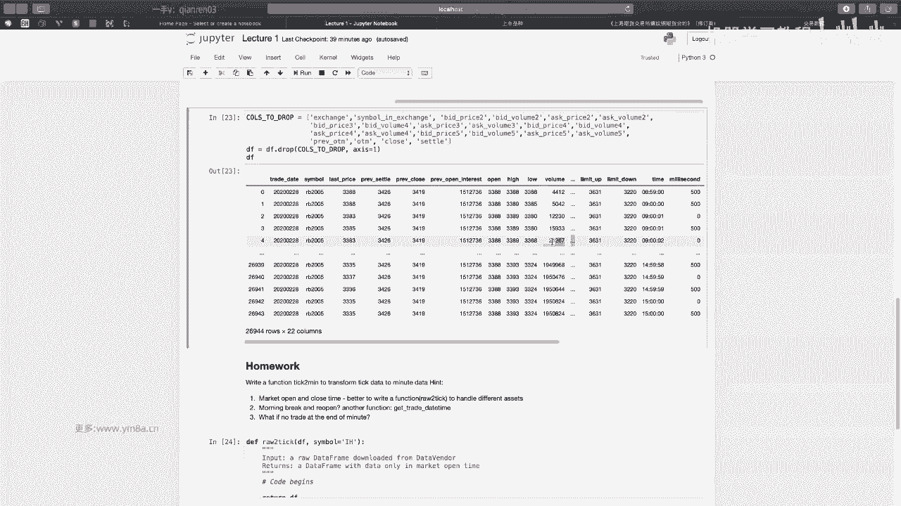

就是这个这个网站编排。

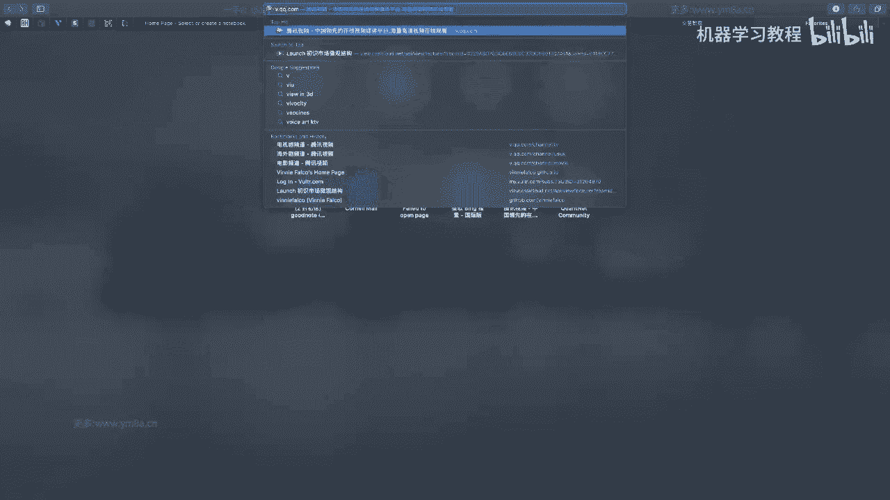

对这个可能大家还是会去了解一下，但这这这个，因为我觉得他框架相对来说会比较成熟一些，对然后我把这个复制到聊天框里，大家有兴趣自己看一下，对我是我是在16年的时候，我16年的时候我还在上学。

那个暑假的时候在折腾这个事情，然后当时他一团糟，我在我在我的LINUX上装装了半天，然后后来发现OK，回国之后发现他一下子就嗯可以说慢慢迭代，做的很好了，嗯对所以嗯嗯嗯这VN泰我觉得他比较好一点。

是它的创始人曾经是一个期权交易员，所以相对来说他会从交易者的角度去出发，去考虑这样是一个什么样的东西，对，然后其他功能还挺多的，就是那为什么我这门课没有说。

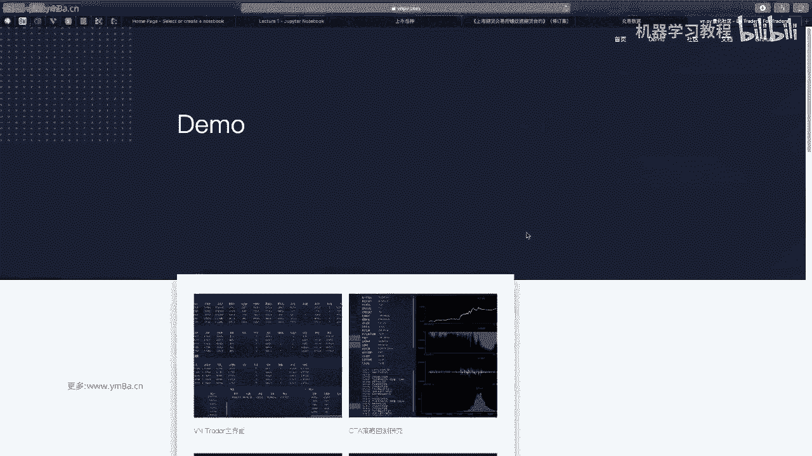

直接带大家用这个框架呢，因为我觉得这里面坑太多等等，我们把这个坑一个个都踩过去，可能你自己写的也差不多了，比如说因为这门课程并定位，并不是说让大家说快速的去拿一个策略去挣钱，而是希望大家去从零到手。

自己去打造一个呃，呃就是量化投资的这样一个体系，因为嗯我可以说这些东西可以说是类似于，我在刚开始工作的时候要做的事情就是你要去，因为刚开始工作，不可能说直接就很让你想上网写策略，那肯定要清洗出去。

然后去了解数据的分布，然后去对，然后可能还有各种各样的坑，那其实你看它像这个里面，VN派是一个相对比较庞大的系统，如果说有呃，相对来说大家对于这个东西已经有一定基础了，那可以其实我觉得可以试一试啦。

当然对，因为我觉得现在其实他做的功能还比较，那比较全，但这这也是说这是一个双双刃剑嘛，因为他做的会全，但我个人会觉得会臃肿，然后其实我之前在机构里，我们用的是他的开源版本。

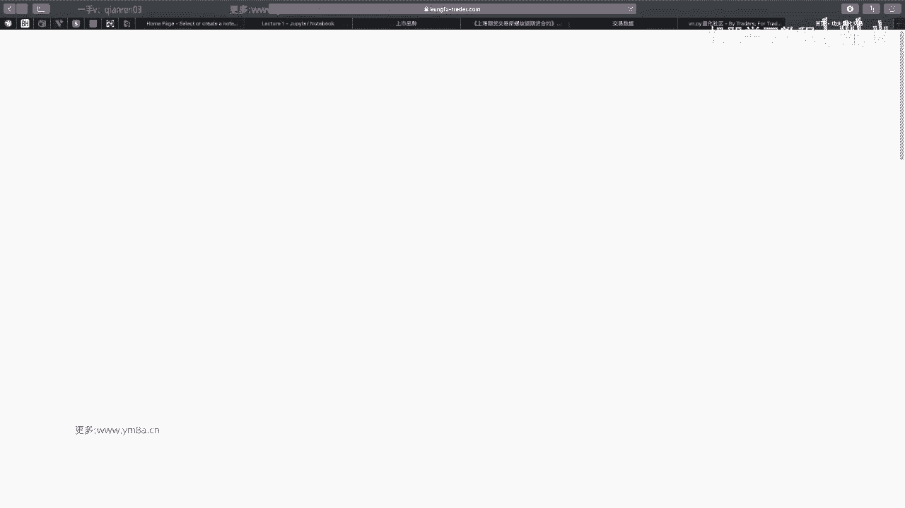

然后我们还自己去对接他的柜台去写了一个呃，另一家就是另一券商提供给我们的，一个期权程序化的接口，我们还专门去写这个还是挺有意思的事情，他嗯刚开始我记得第一版本它所强调的就是对，那也看到低延迟。

他是专专门为，就是想要偏高频一点的小伙伴而准备的，现在看呢我觉得商业化做的还是挺不错的，然后如果大家想要去拿它去做股票的话。

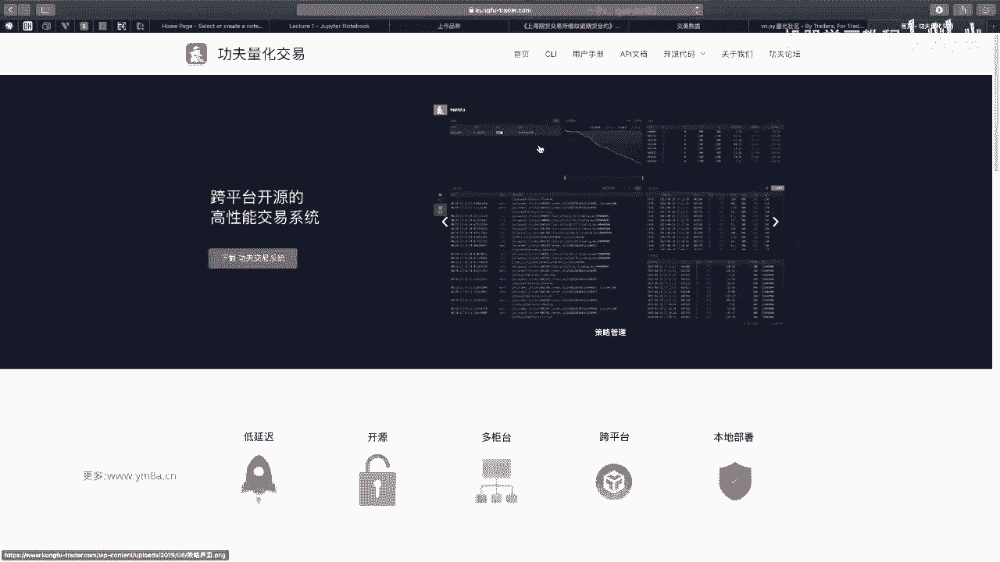

OK可以去找呃，中泰证券XTT嗯。

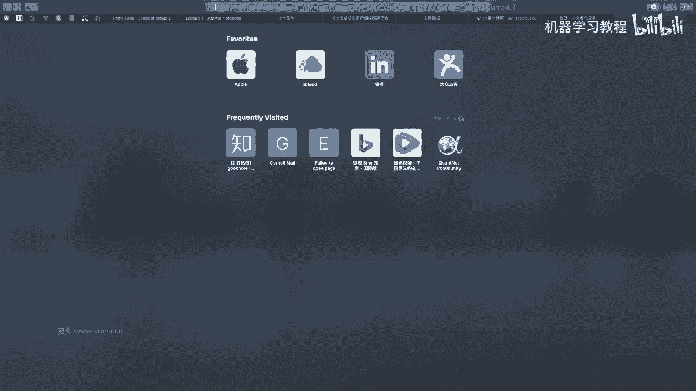

就是他XTP是行业内，我们目前所知道的股票交易最好的柜台。

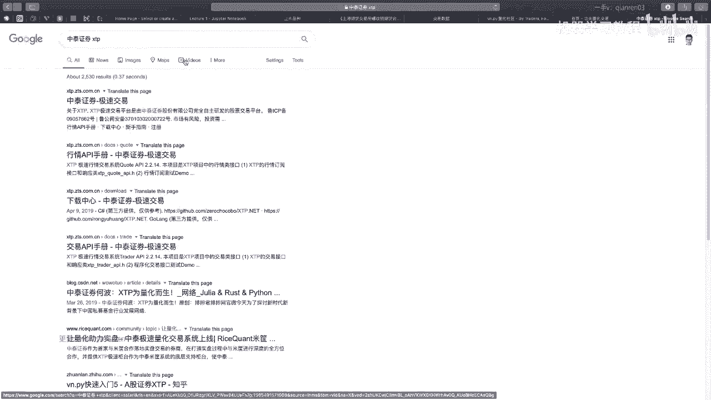

没有之一，在中国市场对嗯就是功夫是跟他一进行了合作，然后刚刚提到就是如果资金量足够多，是可以考虑个人开户门槛是50万对，然后我我这不是带货。

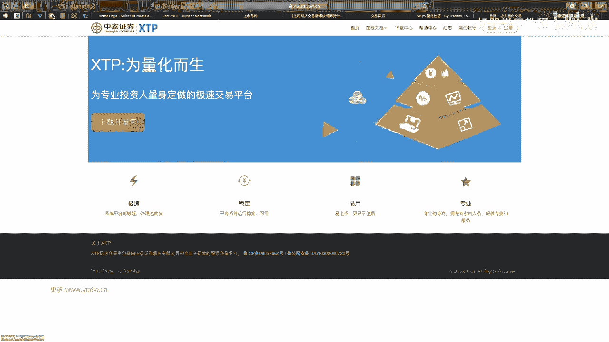

我跟他没有任何利益关系，我只是提到，就是说XTP是我们知道的股票交易的最好的，然后因为CCTV是什么嘞，我们正好给大家看一下吧，对，嗯还要加一个上七所喂，大家看到是说啊。

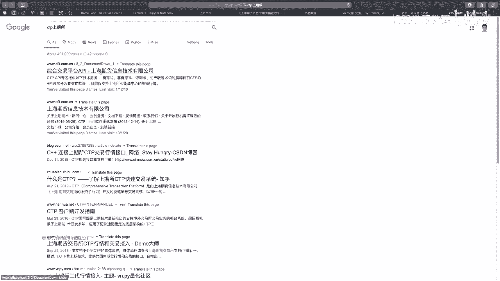

这是国企，上海期货信息技术有限公司，是对what，这样都不靠谱吗，嗯我可以待会可以看一下为什么，就是。

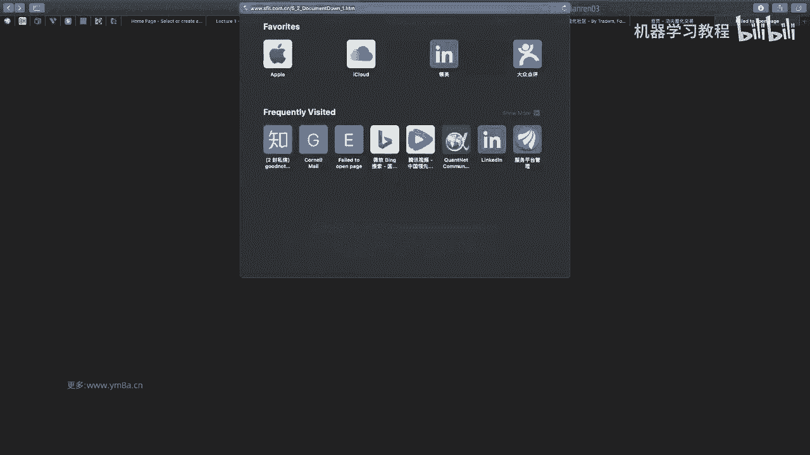

对，我刚刚看到评论区里大家说VN派懂的比较多，每个人其实看到就是哎其实也没有很麻烦，对不对，你看都有在这个CSDN上，都有很多人来教大家怎么来做这个事情，嗯对吧，然后然后我们刚刚说呃。

希望大家去注册一下，嗯希望大家就是去注册一下snow的东西，然后，好吧，可能网站就是挂了对，因为sim now本质上就是上期所提供的CTP，提供的一个仿真的行情接口，它应该是交易。

是是跟真实的交易是行情是一致的，但是对，但是你也可以里面，在它里面就相当于提供一个模拟成交的平台，对OK这嗯可能好的，所以我们再回顾一下整个课程。

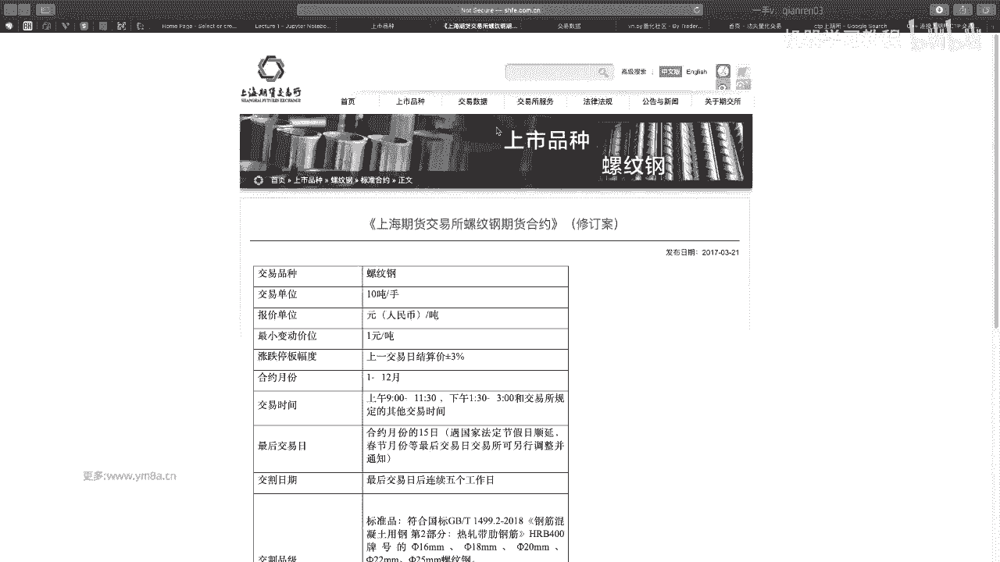

就是到现在大家带大家做的事情吧，order book刚刚都讲到YKLINE，OK好的，再次强调一下homework，就如果说觉得有困难，大家赶快在群里去组队，然后对对，我觉我觉得其实还挺好。

因为就是事实上我在工作，刚开始也不可能一个人做完所有的事情，然后就是希望大家就是去组队，然后然后然后有可能的话，用一些稍微现代的管理工具，比如GITHUB之类，就是这个希望大家去学一下对。

然后cost style也是就是写代码，是为了以后自己看得懂，因为我们从现在开始，课程的代码都会去融合到，我们之后的课程项目当中，然后如果你自己写的不好，就是在这给自己挖坑，然后注意量化给自己挖坑。

它跟其他互联网还不一样，互联网顶多就是推荐了一个你不想要的东西，比如说你老点开什么什么有奇怪的新闻跳出来，对不对，那可能是推荐算法做的不好，但是现在这话如果做的不对，那可能就是就是回测猛如虎。

实盘二百五对，然后就是就是说，我希望把大家自己现在写的代码慢慢整理起来，然后组成自己的library，那事实上我自己的library现在也是越来越多了，然后如果你把这个assignment就完成了。

然后可以私信在群里找，我，会把那个更多的市场数据分给大家，然后大家可以去把历史上就是这些数据都合成，你想要的K线，对你当然可以考虑就是合成一个品种，然后大家可以甚至思考一下，就是主力合约的问题对。

怎么来，你从这么多历史数据当中，每天就是每天去，你怎么知道今天主力合约什么，其实也很简单的，就是成交量最大，你简单来说成交量最大对呃，成长最大就是主力合约，当然有一个问题，可能这两个合约都有点。

今天成交量他大，明天他大，但是你所以你还要业界常常用的一个规则，就是我新加了一个，如果主力合约切换了之后，我就不会再回到之前对，所以所以就是说，希望大家对这门课的作业就到这儿。

然后如果嗯OK所以就是然后我先跳过interview，然后这门课就是今天要讲的东西就这么多，然后如果接下来呃，然后如果有任何的建议或者是呃评论的话，就嗯就留到这边，然后OK我没有自我介绍。

OK这是我本科嗯，好的哦，我我的英文名叫定，然后大也看到这个，我在微信群里，其实也也就是我的本人的微信，我叫王建秋，然后我本科是在南京大学读，然后研究生是去了corn。

然后回国之后是在一家对冲基金做了呃，做了差不多两年的时间对，然后现在是在一家互联网公司，做量化相关的东西，因为涉及到合规要求还是要保密的，然后所以这门课到现在就是这么多了，有什么任何的疑问嗯。

大家可以在微信群，然后可以在这边的评论里面，就是实时的沟通，我我觉得今天大家表现都很好，就是有什么问题及时去问，因为这样我也知道，就是大家呃掌握到什么地步对啊，然后然后的话。

因为这也是我第一次尝试去上这样的课程，就是因为其实研究生期间我是有当TA嘛，然后然后其实我后来发现，我还蛮乐于跟大家去分享这样的事情，甚至我还尝试过给差不多最小的。

只有九岁的小朋友去教Python编程这样的事情，当时那帮小朋友还是挺聪明，基本上都是教授小朋友，他们在CORNEL暑假上那个summer camp，然后所以我觉得我还是就是正好有这样。

跟后创理工学院有这样一个合作的机会，希望能够把我过去从业的经验，以及我对我我的一些个人的思考，然后包括跟大家其实也是跟大家说去交流，然后也希望大家能够给我反馈到有更多的idea。

因为其实这样可以促使双方共同的进步，对然后最重要的是嗯大家要去主动的去做作业，刚刚提到的那些链接PPT之后下载下来之后，然后大家去多去学一学日语，尤其是说如果之前没有接触过商品机构。

没有接触过程序化交易的，多去了解一下对，所以今天就是说呃，如果不想了解相关的有关面试相关的东西，就那那其实这个课程就到这就OK了，然后剩下的小伙伴们我们可以来简单讲一讲。

就是现在的就是嗯我不知道大家是什么情况，就是嗯嗯嗯好，下一次课还真是两周之课之后，因为我记得是那个那个就是没有上课，然后嗯对，然后就是然后这道题啊，是我，我其实面试的时候还挺喜欢问这个，问问这个题目的。

就是大家都知道，就是也可以，大家可以了解一下什么叫最大回撤呢，就是股票价格不是新高之后，然后就是股票价格是有波动吗，也就是说我们能理解的，最大回车是指就是从高到低这样一个过程。

当然说嗯就是说高的一定要在低的前面，然后这部分是相对来说是最大，那那这部分呢如果从高点到低点，没有这部分大的话，那这个就不叫最大回撤对吧，那最大那嗯如果我们看日线可能会更多一点嘛，对吧。

但是像这个情况下，最大回撤可能就是说从1519540，一直到14245，这是一个最大回撤，那那那其实就是要让大家去用，我个人觉得这个应该算little code呃，easy到medium级别的话。

应该很快的话，熟悉dynamic programming的同学，应该很快就会A死掉，就是嗯当然我也见过不少，会有人就卡在这个题目，可能现我看他写了写了十几20分钟，我看了都费劲，也就是说我给书这个题目。

希望大家自己动手试一下，就是我给出一个价格序列，然后你要计算出它的最大回撤是多少，对对然后这个题目嗯大家可以想一想啊，然后对，然后第二道题就是还这还挺经典的，就是probability的问题。

这个是真实的面试题，就是我玩个游戏，如果我选一个，我从1~100选一个数字，然后你猜对了，我就给你这个对应的数字，然后猜不对就给多少钱，哎我就不给钱，然后你愿意花多少钱跟我玩这个游戏，对对当，没看到。

就是说因为因为现在矿的就是有几种，就是如果是就是对于刚毕业的fresh graduate，可能刚开始招聘的时候，可能都免不了要做这些题目，就是呃考察，其实刚刚也是我们也提到了，就说这门课要重要什么东西。

首先要要能够写代码对，然后知道一些金融人员，OK不知道也不行，那所以接下来更重要的是mathematical tools，然后要考数学的话，可能不是所有候候选人都学过凸优化。

也不是学过machine learning，也没有学过deep learning，然后对可能但但是大家都学过微积分，学过线性代数，对学过概率论，然后学过统计，所以那这个时候就考察面试题。

就会会倾向于这些东西，然后将当然也不是说完全是书上的题，那可能会结合一些呃实际应用的背景去改变，那这个题是就是我觉得是我我挺喜欢，每次就既会考察面试人的，就是候选候选人的，就是CODY的水平。

然后又能考察到他嗯，我觉得就是对于当代的program，或者说这个概念还挺能不能理解吧，反正我也建议大家可以动手试一下，然后下节课再看看有多少同学写出来的，对嗯嗯这不当然这个东西是一定要写的的。

之后因为你回测之后，到到我们课课程，你回测出来出了一个PL，你怎么知道你最大回撤是多少呢，所以这这个这个是避免不了的，所以说这道题是必修，大家还是要自己自己做一下，对我只不过是把它放到前面来一道面试题。

所以说这个面试题是有实际应用背景的，就我之后回测了一个策略，我从10万赚到100万，又亏到90万，又亏到50万，然后问一下我最大回撤就是从这个高点到低点，我到底亏了多少钱，对这个方面工作。

对CDR没有硬性要求，嗯我的理解是工作可能未必，但是我知道现在的MF稍微top tier的，就是排在前面那几个项目，就是嗯BERKELEYBROOKE嗯，然后PRINCETON不是很了解。

但是那个呃CMU他们应该来说C加加是必须吧，就大家都希望至少要等C加加，然后如果现在还在读书的小伙伴，还有兴趣去申请MF1的话，建议大家去上这个课程，我我个人其实也是上过这个课程，我觉得还是挺好的。

宽带C加加是跟blue college，就是巴鲁克学院，这个非常非常神奇的一个MF1的学校，对他的F1还是挺好的，就是但是STANF卡是一个很神奇的对，很神奇的教授，对他他们的项目的。

就是简单来说就是可以保证，就是这100%吧，这个没说保证，你可以在wall street得到一份decent的工作，不管是不一定是量化研究，但也有可能是量化开发，但反正至少是相对来说还还挺靠谱的工作。

对，所以这是他们项目比较牛逼的地方，然后他们项目跟cornet合作，推出了这样一个C加加for financial engineering，对，就是它全名叫这个课不便宜，但是我觉得算下来还可以。

就是之前就是我很多课，就是我在机构当中做的东西，有比如说写的期权的交易，一堆library库都是用Python写的，然后之后上完这门课之后，我好像开始逐渐把这个东西去改成发言时engineering。

然后呃就改成C加加了，然后这门课是仅限于那些想去接着读，MF1的小伙伴对，然后嗯对，然后如果说没有学过编程，会议学Python没问题啊，我觉得就慢慢来啊，就是如果如果想严肃的做量化投资。

或者说即使说不想严严肃做量化投资，我能够用量化去辅助我的投资决策，那我觉得也是很好的，那就是说大家在这门课当中，是获取自己想要的东西就可以了，对然后对，然后如果是如果您是做数据挖掘data mini的。

其实Python应该我觉得就是包括机器学习的库，我估计你用的也挺多，所以应该也不用特别担心对，OK然后我们再看就是，然后这是一道典型的概率题，那个那个课是需要付费，所以所以所以就是还不如大家去跟看看。

后场理工学院有没有对应的课程C加加，然后如果哦想一想感兴趣的话，这门课程理论来说我是不能分发那个材料的，对嗯，但其实就是我我个人理解为它对应的难度，应该呃应该是在呃是同一门，它就是它就是在你是人。

你搜任何一个关键词应该都能定位到这个课程，嗯对但这个课程不便宜，1450美金，然后对，但是但是我觉得就是那其实不一定啊，就是你COSER上面找一个C加加课程，去熟悉一下也OK。

甚至我个人觉得就是嗯就是嗯嗯see。

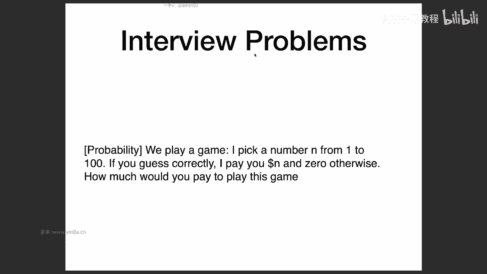

来看看这个tutorial，然后开始动手写一写程序也是极好的，就是你不一定不一定说，我们要把所有的C加加的东西，就是上面那个那个那个来说，就是你严肃的以后想去做个框，然后想要去读MFE。

想要去拿顶级的项目，甚至来说如果觉得呃不一定要去top那几个学校，就是实名的，20名的学校也OK，那其实这个课上不上，我觉得无所谓，因为说实话GPGPA足够考，然后数学课上的足够个足够多的话。

应该我觉得都OK啦，然后就是嗯对，然后这边有个tutorial，其实我觉得这个是入门系列挺好的一个材料，然后大家能够，我不知道之前老师有没有跟大家讲，就是嗯嗯嗯就是嗯。

如果就是在课前能够花一天到两天的时间，把所有东西都go over一下，我觉得基本上就开始能写C加加程序了，对于这门课我个人觉得要求是够的对，然后如果没有学过编程这些概念，可能会觉得有一些麻烦对。

但是大家有时候个人其实随便点开一看，就是不是很难啊，对然后就是如果没有接触过，就是O面向OP object orial programming，那可能在理解class的时候会有些问题。

那那其实这门课还是希望，就是说大家就是说我刚刚提到的，不管你是写Python还是写C加加，都写好，做好封装，写好自己的库，然后因为有一些是大家是做，是程序员去做程序员的。

所以那这部分编程可能不是他们的问题，那对于学生或者是嗯，从主观投资转行的同学们来说，那么呃这部分肯定是需要加强的，因为呃因为我在国内也上过C语言，我记得大一上的吧，上完好像就懵了，感觉还是不会写。

不会写很多代码，然后直到大四，因为我自己是本科做计算化学相关的东西，大四大三大四开始写很多很多的C，C加加跟Python那个时候才慢慢建起来了，就是所以说学完编程还是要去动手去做。

对嗯其实C加加跟C我从C转换到C加加，应该不会特别麻烦对，所以其实只是有一些新的特性，因为我个人只能说我C加加现在用的还行，我我不敢说精通C加加对嗯对。

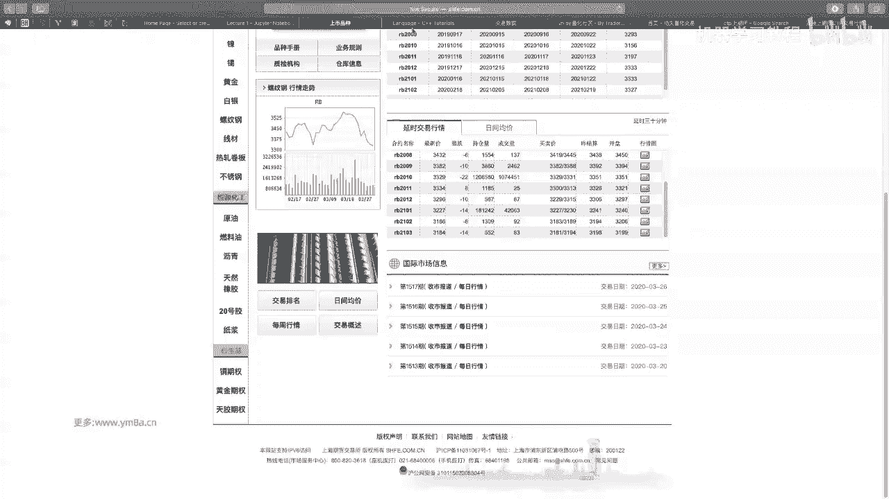

所以就是所以大家也能看到，就是我们在框interview的时候，这种是brand teer，然后啊对还有这种典型的问题，那大家现在可能都不一定问了，然后就三点下午03：15的时候。

时针跟分针到底分分针到底夹角是多少度，对嗯就是大家可以看到就是嗯嗯就是做空，其实大家看到就是说可能我我我我个人了解到，就是现在在国内的起薪未必说是有bat高，当然你要说如果都是说对标行业top。

我觉得是一致的，甚至但但做框的，可能一方面来说就是成熟了之后嗯，怎么说呢，就是可能发展上限会比BAT会多一些，就是我们不谈，就是说做管理层，就是从自己做做，从从做tech的角度来讲。

因为本质上是一个投资，投资是有leverage，是能够给你去加杠杆的对，然后所以然后包括就是说嗯看个人兴趣，如果对金融更感兴趣，那显然是做框架，我觉得是会比去bat做L狗会好一些对，所以嗯对吧。

然后就关于职业选择的问题，然后现在还有多少人在听啊，举个手，我看一看是不是大家都已经跑了，唉好像还是有这么多人，OK嗯对，所以所以就是还是希望，就是如果说大家嗯想要接着去找这样一份工作。

那么可以说是不大大扎实自己的基础，然后是通过课程或者时间项目，去慢慢的把自己的策略去跑起来，那我觉得嗯可能这样来说会好一些对，因为现在其实嗯QUT有一个很好的问题，就是招聘的时候嗯看起来说要求很高对。

那确实是要求高，然后筛人标准很高，可能嗯不是985的同学们可能都未必有机会，就刚毕业的学生对，所以说也要劝大家就是要考虑考虑说这个事情，当然说可能刚开始你做不了矿的，那可以考虑说嗯去做。

无论是去做其他的工作，然后慢慢的去提升自己的技能，那么之后还是有可能去从事这个行业，或者说即使之后不同于任何行业，那么用量化投资方式去辅助自己的投资决策，那我觉得也是很好的，只是说我只是想说这个市场嗯。

在美国可能说嗯应该说还是有需求，但是肉眼可见的需求是在不断的减少，然后可能说最近是由于就是机器学习，这套方式的兴起，所以大家就会偏重会数据挖掘，会机器学习的人员会有一些偏好。

就是说因为我们现在数据越来越多，可以去挖掘出有用的信号，然后在中国的话呃这个事情是是刚刚起步，然后也不是刚刚起步，13年，12年，但市场已经涌现出一批非常优秀的对冲基金。

然后当然这个市场未来还是很广大的，如果我们相信中国的市场会进一步的放开呃，并且进一步就是促进资本的流动，那么我会觉得呃，全球化投资在未来还是有非常大的发展空间的，对然后然后上这门课程。

也希望大家就是说嗯嗯为什么要用英语，因为很多这个东西我们都是跟国外学的啦，那很多的课程也是要也是参考资料，也是从国外的教科书上，包括对，其实我之前有一个老师还自己写了个书，还挺好的。

之后会把那个书再发给大家去慢慢参考，那本书，当然可能会深会深一点了，对，然后嗯这终极目标是赚钱，但事实上是说我，我可以说我差不多是到去年才开始慢慢赚钱，前面刚开始都是一直在亏钱，或者说不亏不赚对。

然后怎么说呢，就是赚钱这个事情财不及门，然后我觉得一方面是，就是说因为对矿的是非常目标导向的，你可能就是说你研究了几年不挣钱，那可能这个市场就生存不下去了，但另外一方面就是说。

你需要在这个过程当中不断去提升自己，各方面能力，无论你是是对于市场，对于市场的了解还是编程角度，你能够用更高效的方式让你的程序更优化，去更高效地处理市场的信息。

还是说是说嗯你在引入新的me赛DOLOGY，你原来之之前只用传统的因子模型，你现在引入了非线性的模型对，所以嗯对就是写，反正今天跟大家讲了这么多吧，然后今天其实内容也差不多了。

然后其实就是让大家回去好好上上课嗯，好好复习，然后最重要的是动手去做，真的是如果讲这么多，然后那个代码，然后下节课发过来，然后大家都没做，然后我直接给大家一个能跑的代码，那其实意义不大。

因为你永远不知道市场会发生什么，可能这个代码现在是能跑的，过了两个月市场新规则啊，我们现在把交易时间夜盘又恢复了得，那你看这个程序是不是就挂掉了，对不对，所以OK所以今天的课程到现在就正式结束了啊。

这位同学说ALAN说什么学费安知识点是这，这是什么意思，那是不是还可以考虑说学费安嗯，策略的跑下来的效果来说呵对，但是我觉得这个是这个是不不不不能保证的，因为就是说可能说他学的很好。

但是他策略思考方向不对，那可能不正确，或者说即时策略是对的，但是市场对待你这个策略，就是不是不符合现在市场的行情，那也是有可能的，就是嗯总总的来说我们做我们能控制的事情，然后其他的一切留给市场，我们。

然后我们再去根据市场的反馈，去迭代我们的模型，然后我觉得这样一步一步的螺旋式上升，是有可能去实现嗯，就是会获得一定的阿尔法，对我不保证大家能够获得阿尔法对好的，那今天的课程就到这里了，那谢谢大家。

然后课后有什么问题有什么建议的话，可以发在微信群里。

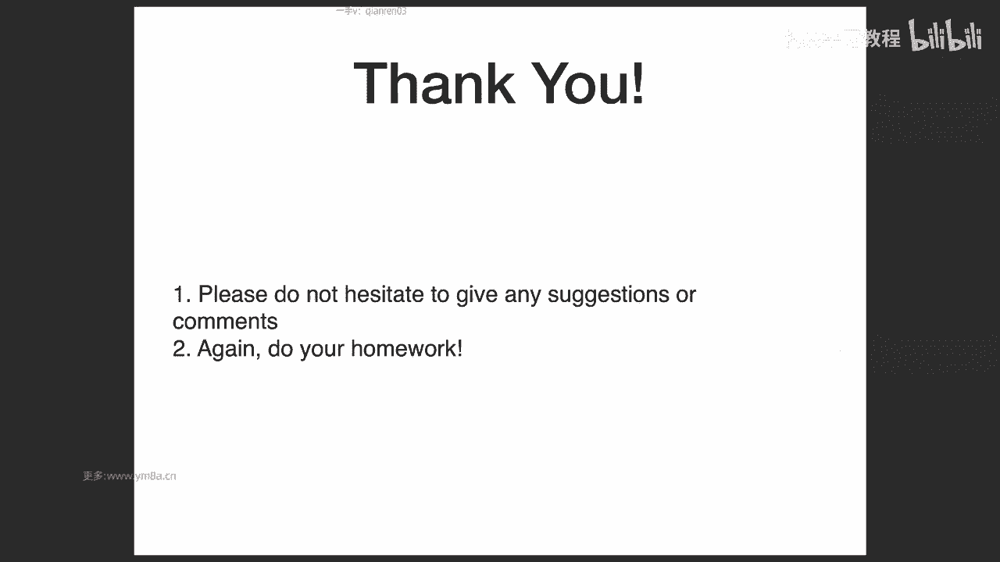