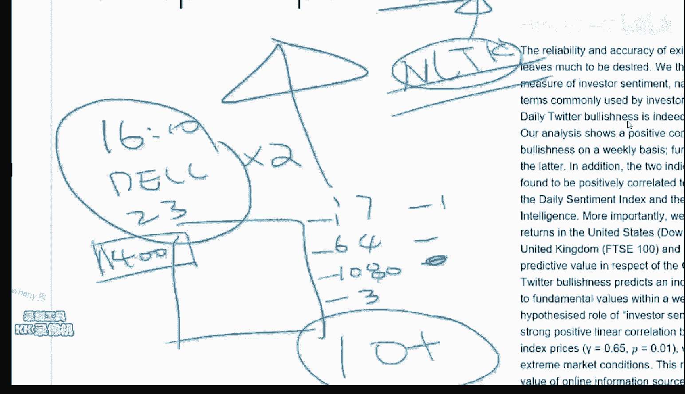
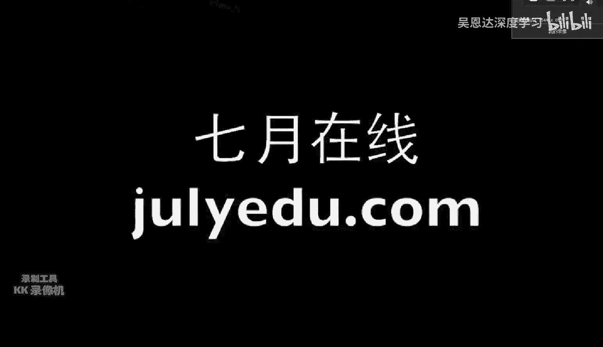

# 【比刷剧还爽！】这太完整了！python金融分析与量化交易实战课程，全程干货无废话 入门到精通一步到位！（数据挖掘分析_大数据_可视化_投资_金融_股票_算法） - P9：第9课_机器学习与量化交易项目班 - 人工智能找迪哥 - BV1oBb6egEiT

好，那我们呃今天开始最后一周的这个上课。首先呃呃今天上午这个事件向大家嗯。郑重的道歉。最后。心里非常的这这个沮丧，因为给大家实实在在的添了不少的麻烦，在此向大家再次郑重郑重道歉。嗯。然后上午那。

心情也一直没没缓过来，但是有一个稍微好一点的事情是今年的这个。今年这个AA吹风AI。这个2017就是个这个是国际这个就american association of artificial intelligence。

这个就是人工智能界的国际顶会之一。然后说我其中的一篇论文给。给给给录了，然后就就心情能稍微好一点啊。啊，这个就是现在这个机器学习大概顶会大概有这么几个，一个是这个。一个是这个SML。

然后一个是这个EJK啊。还有一个这个呃全经网络的这个。变会这个就lipps啊。然后跟数据挖掘有关的，叫KDD。差不多就是这么几个会是目前大家比较认的。

相当于因为基器这计算机跟这个跟其他跟其他的自然学科不一样的地方，就是啊计算机它比较重视会议，而不是特别重视这个期刊。因为因为原因就是嗯会议是当年发当年当年头当年啊就能够发表。

这样的话有一个好处就是啊因为这个东西更新换的太快，你要是投一个投一个期刊的话。他这个呃这这个评审的过程肯定会超过一年，那么这个事情就就不是很实时。所以大家现在国内是花了很长时间才。

就是说才啊才重视这个会议的。会议的这个啊这个这个这个就是啊会议论文的这个东西。因为以前因为你要申一个什么这个。一些国家基金的话，你作为计算机是跟数学物理，他们一块比。或者其他的一些工科一块比，其他工科。

他们那个会议是很嗯就是。不需要干什么就能去的一个事情。所以说呃中国是花了很多年才把这个计算机这个会议的地位提到了，跟呃期刊一样。所以。就是大家以后如果关注一些论文的话。

如果看到是这么几个呃呃会议上发出来的啊，你就会知道这个应该就就达到了目前的国际的顶尖的水平的论文。一个是Nps，然后KDD这个是跟数据挖掘有关的。

pleVI是人工智能的ICML是跟机器学习有关的international conference on machine learning。然后一对K它是什么都有啊，就是呃这个机器学习人工智能都会有一些。

啊，triI是美国人工智能学会的年度会议，一直开始就是这个in international joint conference on artificial intelligence。

然后今年的那s是在巴塞罗那开。像今年的这个。啊。呃，这个呃SML也是在巴塞罗那，他们都是在呃今年的这个12月。所以地方还不错啊。OK那我们今天正式的啊正式的来来讲我们的这个这个事情。对。

这两节课的干货会非常的多。嗯，所以大家啊做好准备。对，另外就是说啊因为今天上午的这个QQ我怎么备上不去的时候，呃，很多事情是跟这个微信群里头发的。所以说如果没有进微信群的同学呢啊可以啊选择加入加入之后。

这个课就算结束了之后呢，我也会啊有跟这个方面相关的东西，我就撂到撂到那个微信群里了。就是大家保持就是我不会走啊，大家这个不用担心啊，我会这个。这个一个多月来跟大家产生了蛮深厚的感情。

所以说这个微信群到时候大家如果加入的话，应该不会有什么太大的坏处啊。对，O。OK对，就是主来发的这个。发的这个这个地址，大家。大家可以看一下。然后嗯。对，微信群是一个事。

然后另外一个事就是我们这两节课我的安排大概是这样。今天这节课把这个关于嗯资产组合理论的这个呃内容讲完，讲完之后呢。今天的后半节课跟明天的上半节课，主要跟大家review一些做的蛮有意思的一些论文。

让大家看看这个呃如果做机器学习跟量化相关的这个东西，别人是怎么做的和怎么样的展现你自己的这么一个方式。啊，最后呢还是呃确是第二件事儿。O第三件事情呢是主要是要跟大家。说一下怎么样的。

如果你想进入这个框这个行业啊，怎么样的求职啊，面试的问题有什么啊，怎么样准备面试啊学完这个事情之后，你还应该学什么？还有就是学完这个事情之后嗯，我没有讲到的事情有哪些你从哪去看啊。

等等的相关的这方面的事呃事情啊，都会有。啊，其实这个是我非常呃重视的一个事情。就是说嗯。一个课是不可能把所有课程呃所有东西学完的啊，根据我教给你这门课的这个骨架。

你怎么样的在这个骨架上建立你自己的这个体系结构，建立你自己的这个。这个就是相当于知识储备，我帮你把书架打好了，告诉你这这一层放什么，那层放什么。然后每一层都给你放了一两本书。那么你要干的事情呢。

是把你自己的书架呃把书填满，就是像滚雪球一样的知识呃就会越来越大。那么所以说呃我也会跟大家说一下我呃。量化作为这个行业啊，作为一个职业来说，你们的这个职业规划和你们以后如果要求职呃，需要注意什么啊。

这个是一件事情。然后嗯我想想。呃，差不多对，差不多我争取用。啊。今天跟明天上午明天上午是。呃，上课啊，这个大家别忘了，我是忘不了。明天上午的这个时间就是用4个小时时间。

我来争取的把这些事情给大家咔cover掉。OK这个高级班是这样，高级班我是非常呃愿意上，但是我。开高级班有这么几个要求，就是呃听完这个课之后，我希望大家用几个月的时间消呃消化一下这方面的知识。

同时我会明年给大家一些呃我个人认为很有帮助的读书列表，大家先把自己先提升一下再来上。这样的话，因为我。强调的是你上上这个课不能跟看美剧院看完就就撂了。我是真心希望大家有一些比较好的进展的。

所以希望大家需要再再再消化一下再来上。要不然的话，我在这讲完了，你们要是没听明白的话，啊，我心里是过意不去的。这个职业道德不允许我这么做。所以说大家听完这个课之后。

今天你们就看看我给你发的这个这个群里的这些论文啊，你就会发现操，原来就是这东西嘛，看来上课都讲了，如果你有这种感觉的话，我会很开心。然后同时呢还有一些没有cover掉的，包括一些金融方面的知识。

我明天会告诉你从哪看。因为这门课毕竟是给大部分是4S出身的人学的。所以说有很多金融的知识，我没有讲。比如说关于期权的定价，很重要啊，但是这个呢知是一个纯金融的一个知识。我如果讲了的话。

会对这个初级班的其他同学不是很。呃，就是说这个课的内容不是很平衡，但是并并并不说明这个事情不重要。那么就希望大家如果要上这个高级班的话呢。在初级班跟高级班的中间这一块，你们自己需要看一些东西。

把这些事情看明白。然后这样的话，我高级班就能再给你说一些呃目前。啊，顶级私募是怎么做的？要不然现在给大家讲。他大家也就是听过去就听过去了，这样是不好的。所以说嗯。对。

大概我的这个授课的这个计划就是这么做的啊。还有什么问题没？啊，对啊，其实我还想干的，就是说呃给大家说一下嗯。这个再多说几句求职吧。呃，如果有感兴趣的同学的话呢呃。嗯。现在这边有一个做的蛮不错的。睡觉啊。

一个是公募，一个是私募啊。都是呃我都是可以推荐人的。所以大家如果感兴趣的话，你可以跟我微信私聊。我呃而这两个负责人跟我关系都很好，而且他们做的也蛮靠谱。所以说呃我也可以给大家。如果有合适的机会的话呃。

我可以。就说关于就是这个岗位的话，我这边是永远是。缺人的啊，会给大家推荐到比较不错的地方，相相当于内推吧，给大家一个福利啊。然后第二个事情呢。

就是说我明天第二个事情就是说我明天呢呃看看有没有时间会给大家，因为我也面试过不少这个。这方面的这个这个岗位的人。所以我会给大家说一下，如果我来面试的话，我会问什么问题，大家需要做一下这个准备啊。

有有时间的话，我跟会跟大家说一下。如果更有时间的话呢，呃我可以做一个模拟的面试，如果群里头哪个同学说啊我想当一个被面试的。哦。那么咱们可以在群里头公开的，我帮你念一遍。啊。

这个如果感兴趣的同学在今天11点半之前跟我报名，但是你要做的事情就是你需要跟我一块儿在群里头说话啊。看时间吧，如果有时间的话，咱们做这件事情，如果没有就算了OK。啊。O。

看看有什么有价值的问题值得我回答的，跟课程有关的啊，看来是没有。好嗯，那我们今天开始讲课哈嗯。蒋哥是这样啊，呃嗯今天是呃先会跟大家讲一个是关于这个矩阵的这个。呃，特征值啊。

因为我不讲特就是说讲完特征值的一点，初步的一些基础，从这个特征值的定义到SVD啊，给大家稍微复复习一下它的本质。然后呢再跟大家说一下怎么样的利用呃就是特征值最神奇的地方呢？宇宙的秘密。

就是说怎么样利用特征值来对呃你的资产进行一个呃这个profiial呃这个这个allocation，就是说你的这个资产组合的这个权重，就是大家记不记得比如说。啊，卡不卡有呃，有有不卡了没有？好。

就是说我们之前不是说过，我们要要minimise我我们的一个风险嘛？这个风险就是说比如说我们有1110只股票要进行操作，我们怎么样呢啊确定这每只股票的这个这个比例啊。

这个东西其实它的本质是跟特征值是有关系的。ok。就是他这个事情，它其实本质跟特征值是有关系的。啊，所以今天我会跟大家说怎么样利用特征值来做这件事情。

第三个呢就是说我会再用剩下50%的时间跟大家过大概5篇这个paper啊。看看别别别人就是你的呃就是别人他们是怎怎么来做这些事情的。大概我争取用这啊两个小时来把它做了啊。好好，那么我们现在现在开始。好。

O详细解析一下思路啊。对，是就是说是跟大家说一下怎么看这些论文。因为现在的有一个就是说论文啊你是看不完的。呃，每年像鼎会的论文都会有这个上千篇啊，你全部看是肯定。啊，其实是可以全部看的。

就是说你主要是要把这些论文，一个是它的这个这个introduction，就是说他提出了一个什么样的问题，问题是最重要的，跟他的解决的大致框架是什么？技术细节啊，不需要看。

当你需要研究某一个特定问题的时候啊，你再看啊，这个代码代码要讲代码，我明天跟大家再说一下。这个还有咱们作业的事情啊，所以说呃还有一个问题就是说这个呃看论文的过程，我先跟大家提个醒。论文它不是书。

论文是有大量的瑕疵的啊，尽尽信书则不如无书，是最最适合形容你看论文的这个事情。看了问看什么，看的是。啊。别人是怎么解决这个问题，跟别人是怎么提出这个问题的，而他在解决过程中其实会出现大量的错误。

一定要有批判的一个角度来看，不要不要迷信任何一篇论文。你看完论文之后，你就说啊，他这个点还挺好，那我就记住啊，他这个点挺傻逼的，你就你就一定不不要去用。就是说呃在这种情况下，你自己才有可能进步。

如果你把每科论文当做金科利率的话，那你就完了，你就不可能有任何的。😊，嗯，真正收获的地方啊，对，这个是我跟大家需要提醒的一个一个事情。OK啊，那咱们一件事儿一件事儿来吧，好吧。😊。

先先先说这个这个矩阵的特征值啊。甚值大家还有印象没有？好。那我就给大家以极简单的呃极简短几分钟的时间跟大家啊大致把定义说一下。特征值是这样，为什么要要特征值呢？特征值从名字来看，它就极其重要。A跟。对。

是什么意思呢？就是说我们嗯。我们要干的事情就是说对于一个矩阵啊，一个方阵啊。一个比如说是100乘以100的一个矩矩阵啊，这个矩阵呢如果我们把这个矩阵看作一个线性变换，对不对？

我们怎么样的刻画这个线性变化？那么这个线性变化是什么意思呢？这100乘100的一个矩阵乘以1个100乘以1的一个向量。它应该是一个几维的一个东西呢。他应该还你看啊矩阵惩反吧啊。它俩是一样的。

那么就变成了100这两头的这个大小，100乘以1的这么一个向量。他干的其实你可以把你可以把这个矩阵看作一个函数。这个函数干的什么事呢？它是把这个函数是一个映射。

这个映射是把1个100维的向量变成了另外1个100维的一个向量。而这个函数是怎么实现的呢？它是用矩阵来实现。所以说这是一个线性变换。就是矩阵跟线性变换，就是说你们要是数学系的话呢，呃你们学的是高等数学。

对吧？高等数学其实学的是这个线性变换。而这个呃这个线性代数呢，它主要学的是这个矩阵论啊，就是这两个其实是本质上是一样的。为什么就是说线性变换的角度来看，任何矩阵是一个函数。

这个函数能把一个100维的一个。一个向量变到了一个另外1个100维的一个向量。那么如果这个矩阵不是方阵，比如说这个矩阵是50乘以100的话，那么就把1个100维的一个向量变成了1个50位的。

那么如果是2乘以100呢，就是把100维的向量变成2维的。哎，这不就是分类问题吗？零或者一了。所以说呃这个矩阵其实就是任何一切线性模型的这个参数的一个一个选择。那么呃我们在刻画描述一个矩阵的时候。

我们是把他的所有的这个矩阵的元素给别人，这当然是一种方法。但是这个并不是本质。就是说你形容一个人的时候，你是应该说他的这个你就把这个人给他呢，还是说O我给他几个维度的一些一些一些一些特征。

那么这样的话呢，更能够呃深刻的刻画出来这个矩阵的本质。那么数学家。对对于每一个数学对象，数学家都发明了一系列的方法来刻画一个数学的对象，一个一个一个一个。You object。

一个 mathematical object。m。Mical。一个数学的对象，矩阵就是一个数学的对象啊，那么怎么样刻画这个数学对象呢？一个非常好的方法。

就是用特征值跟特征向量这两件事情就相当于能够完完全全的把这个矩阵就能够形容了。就比如说别人说你给我矩阵，你不要给我矩阵，你把你把这个矩阵的所有特征值跟所有特征向量给我。我就知道了这个矩阵的一切信息啊。

这这个大家是不是听的很很耳熟，是因为你们要再学这个机器学习的时候啊，你不需要给我任何东西。你只要把它的这个联合分布给我，我就能回答关于这个联合分布下的一切的啊推理问题，它是一样的。OK啊呃那么。

这还没到特征值跟特征相样这。目前是光到这个矩阵的这个，就是从呃变换的角度来看矩阵OK啊，这个是一个呃比较正统的一个角度。那么特征值他想干的是什么事呢？特征值他想干的事情是一个非常特殊的。

当我们给定一个矩阵100，比如说是100乘100位的这个矩阵是给定的啊。这个是不变的嗯。这个这个是不变的。那么我们。我我们想要什么呢？我们想要的是，请你当给定一个矩阵之后，请你找出来很多的这个X。

使得AX等于拉百X。比如说这个是100乘100的。这个是100乘以1的，拉姆达是一个呃常数啊，它可以是实数，也可以是负数。负数的一负数就是是那个是是那个A。A加嗯错。AA加上IB这个负这个这个负啊。

这个拉姆达它可以是实数，也可以是负数。而这个X就是这个X本身啊100乘以1的。我们是要找到什么？我我们是给另一个矩阵，我们要找到所有满足这个等式的X跟兰姆达。而这个事情是一个非常不显然的一个事情。

它的本质是什么呢？比如说X在这个方向上，他们要求的是这个矩阵A作用在这个X上之后，还在这个X的这个方向上。😊，这个是特征值跟特征向量的一个本质。也就是说。请你给我一组X，使得AX之后，它跟X是平行的啊。

并不是所有的X都能满足这个等式，对不对？其实大部分的X都不满足这个等式，因为你没有任何理由相信一个线性变换之后，这个X还在这个轴向上。就是在这个100轴的这根线上啊，有问题没有？好好。好。

那么那么这个事情我们怎么办呢？啊？其实非常简单啊，如果就是比如说大家这个嗯。数学比较好啊，就是你你你只要记住这个特征值的定义。你就能你就能把这个特征值求出来，怎么求其实非常简单。

你看你不就想求你不就想求AX等于兰姆达X吗？那么我们先求兰姆达，对吧？我们先求兰姆达我们怎么办呢？要要求兰姆达就把它就就你就给它挪过来，那么就是AX减去兰姆达XX是向量。

兰姆达是常数AAA是个矩阵等于0，然后再怎么办呢？提取公因式，那么就是A啊，减去啊，兰姆达，那么这一个矩阵减一个实数怎么减，那不能减，你只能兰姆达乘以一个。一一个一个单位阵乘以X啊，它等于0啊。

那么到了这一步了，你也就是说我们要求的是A啊，减去兰姆达I啊乘以这个X啊等于0，然后怎么办？然后你会发现，其实这件事情它说明了一个什么呢？说明了一个矩阵乘以一个矩阵乘以一个非零的啊。

一个非零的一个一个向量，它为零，说明了这个矩阵是不可逆的。说明这个矩阵不很逆逆的那就说明了这个矩阵的这个行列是为0啊，也就是说determinant ofA减。兰姆达I啊等于0啊，我操到了这一步了。

那你就爽了，你把行列式的这个公式带进去。你把A比A，比如说是个123567999，那么它减一个拉姆达A就是一减拉姆达6减拉姆达，就是它对对角线元素上分别减了一个拉姆达，它的行列式啊等于0。

那么这个就是一个关于拉姆达的N元N次方程组，你解这个方程组就完了。那么一个N元N次的方程肯定有N个根，这个根有可能是十根，有可能是虚根。也就是说我一个矩阵的这些拉姆达。它有可能是实数，也有可能是负数。

但它一定是有几个呢，一定是有N个。这个N就是矩阵的这个接数N乘以N，这是第一。第二呢，我们每解出来一个兰姆达，我们就会有对应的这么一个一个X，这个X而每解出一个兰姆达，比如说这个兰姆达。

我算出来兰姆达一等于6，那么就是A减6I。X等于0，那么我就反过来要求对应6对应对应特征值为6的这些X什么？这些X其实是有补充多个，那么你只需要找出来一个就行。当我们的这个拉姆da有这个重复的时候。

比如说这个拉姆da如如果这个A是3乘以3的，那么这个拉姆da比如说等于662的话，那么肯定它这个。你看这有两个6了，那么肯定就是说我其中一个特征空间是一个二维的。

就是说我这个对应这个兰姆da为6的这个特征值，它它有一对，这个空间是两维的。另外一个兰姆da等于二的时候，它这个特征值肯定都在这条直线上，这就是线性代数的本质。有问题没有？好，再来一遍。

就是说是任何一个矩阵，任何一个矩阵你都会有N个特征值，对不对？你N个特征值。如果当你的特征值有重复的时候，就说明这个特征值所对应的特殊向特征向量所在的那个空间是大于一维的。那么就会有。

比如说你啊先看正常的情况，正常情况，比如说对于一个3乘以3的矩阵，它的特征值分别是12跟6，那么就说明一对应一个X2对应一个X6对应一个X，对不对？因为你一个AX等于兰姆达X，对不对？

你现在已经求出来一个兰姆达等于一了，那么就是AX等于1X，那么这个X其实是有无程多阻的，对不对？那么但是这些无穷多组其实它都是一个，为什么呢？是因为这些X它都在一条直线上。如果这是这个情况。

是当你的这些特征值不重复的时候，如果你的特征值一重复啊，那就麻烦了。如果你的特征值一重复的话，比如说是122，那么就说明什么呢？就说明你这个特征值，这个二所对应的这个特征值的这个X，它是限定的。

就是你你你解A的时候，它是限定的，也就是说你能解出一组这个X来，它都能满足它品。也就是说AX等于2X的时候。你就能解解出两个垂直的X，它都能满足，就一个X在这个方向上，一个X在这个方向上。这个没关系。

这个这个知识你不需要懂，你需要懂的是下一个知识。啊，然后好。好。好，那么我们最关注的是什么呢？我们最关注的其实是这件事情，就是你现在先先记住，就是任何一个呃N乘以N的一个矩阵。

能给能求得一组拉姆达值跟X值。这些拉姆达跟X分别叫做它的对呃对应叫做特征值跟特征向量。每一个特征值有一组对对应的特征向量。啊，可以是一个，也可以是N个啊，就是说嗯。你这是你需要知道的第一件事。

因为什么呢？因为这个A是一个任意的方阵，所以这个特征值跟特征向量。在很多情况下，它有可能是虚数啊，叫虚数。对虚数。好，那么我们其实更关心的一组矩阵它是什么呢？它是一个比较特殊的矩阵，叫就叫什么矩阵呢？

叫做ssymmetric，就是说叫做对称啊。嗯。第一第一，我要求它对对称。第二呢，我要要求他的这个。嗯，对阵就行啊，咱们就先考虑对对称。

就是说A等于A的transposetranspose就是说我所有的这个列，我让它站起来等于行。就比如说啊123啊，1224它的这个转制就是什么呢？就是1224。所以说那么你明明显的。它是不等于它的。

所以说并不是所有的矩阵都是都有这么好的一个性质。那么对称阵呢是啊非常啊非常非常好的啊一系啊一系列的一个矩阵。而在具体应用中，对称阵的应用是极其广泛的。G2也是极其美妙的啊，它在这个。就不说了啊。

就是说它它它是非常重要的一个一个东西。那么那么呢那么那么我们现在看看关于如果一个矩阵，如果一个矩阵它是对称的。它有两个非常重要的结论。第一，对于对称阵，它所有的特征值lamda都是实数啊。

这是一个非常非常重要的一个一个结论。第二。第二，所有的拉姆达所对应的这些。所有的兰mb巴所对应的特征呃呃叫做呃呃特呃叫做特征跟A跟vector，它们是互相垂直的。就是说所有拉姆达I所对应的XI是互相。

垂直的。这个是一个极其重要的一个。一个结论啊。嗯。那么那么我们如果我们如果要呃就是说是嗯嗯好，那么呃先说哈嗯。好，那么就是先说对于对于非对于这个非对称的。的这个矩的这个矩阵A啊。

对于非非对称的这个矩阵A，我们是如果就是说嗯。有声音吗？有是吧？好，那么对于非对称的这个A呢呃。😊，我们有这么一个结论，A等于什么呢？A等于S啊，那这个啊西格玛SZE啊，当然它是有一个前提的。

就是说对于非对称的N乘以N的一个。一个矩阵啊，那么它有一个它有一个这么一个结论叫做对角化原理。就是说我任何一个呃嗯这个方阵它都可以写成啊一个方阵，乘以一个对角矩阵，再乘以这个方阵的逆。

而这些方阵是什么呢？这个S就是说我所有的这些特征A跟 vectorctor。X1X2所有的特征向量，你把它按列给它塞成一个一个N乘以N的一个矩阵，再乘以什么呢？

再乘以这些特征向量所对应的特征值lam姆da一兰姆da2一直到兰姆daN，然后它非对角线元素全是零，再乘以这个S的inverse前提是什么？前提是如果我的这个矩阵的呃特征啊。

A跟 vectorctor的逆存在的话啊，这个是一个非常大的一个一个假设啊，如果它存在的话，我们是可以写成这个这个屌样子的啊，有问题没有？啊。好，对，这个是一个非常简单的一个结论啊。

那么这个结论它的用处是什么呢？啊，它其实呃其实这个结论极其好称。为什么呢？其实这个结论是呃就是说是是呃你可以呃就是说是显然的显然呢它显示在哪呢？因为我们不是有我们不是已经有了AX等于兰姆达X嘛？

就根据定义就能把这个就能把这个A等于X sigmaX的逆推出来，那咱们先推一下，对不对？那么比如说这个呃我们先看看AX等于什么吗？AX不就等于A乘以S的定义就是说我们把所有的这些特征向量X1X2。

按照列，我们给它写出来了嘛？到X这个N对吧？那么我们给它我们把这个A乘进去嘛，我们乘进去AX等于什么呢？AX等于兰姆达X，那所以这一步啊A乘以X它就等于。😊，啊，AX1就等于兰姆daEX1。

那么它就变成了这个兰姆da1X1。然后兰姆da2X2，然后兰姆daNXN对不对？那么我们把这个矩阵我们再给大家拆开的看，拆开的看它其实它就等于什么？就等于X一的这个向量。

X2的这个向量组成的这个矩阵乘以一个对角阵兰姆da一到兰姆达N。上面。都是零，就就是说因为你根据矩阵乘法的定义，这个就是矩阵乘法的定义。去。Zhen。乘法的定义啊。定义。就能从这一步退到这一步。

那么这个东西是什么？这个东西我操，这不就是S吗？这个东西什么？这不是sigma，那么就是说明什么？我们就推出来了AS等于S sigma，这个是对于任何方阵都成立的恒等式，谁都能成立。

那么如果S能能求逆的时候，A就等于S西格maS逆这就叫对角化矩阵的对角化分分解。其实根据其实根据这个矩阵的呃这个特征值的定义一下就能推出来。就是你根本不用记住呃，根本不用记住这些玩意儿啊。

你自己就能推的啊，有问题没有？没有问题没有问题。那其实好，那么我们再看今天的主角，主角是什么呢？主角是A等于什么？AA等于A的transpose，对不对？主角是A等于A的transport。

然后我们现在已经有了一个A啊A等于S西格马S的E，对不对？那么那么我们看看如果任何你讲啊任。任何一个矩阵你都能写成呃S西格马S，对不对？那么当A等于A的逆的时候，我求一个矩阵的逆是很费时的，对不对？

那么当我们一个矩阵具有这么美好的一个对称的性质的时候，我能不能不用求这个逆啊，答案是啊你是可以的。为什么呢？就是当这个矩阵是对称的时候，它的所有的特征值都怎么了？都互相垂直了，都互相垂直了。

说明什么说明这个S说明这个S的每一列是互相垂直的。那么说明这个S如果当一个S的每一列都是正交呃互相垂直的话，那么这个S就叫做正交阵啊。那么当这个S为正交阵的时候，S的逆是等于S的转质的。

那么那么这样的话呢，我们的A就能写成了当它是正交阵的时候，呃，一般来说呃，有一个特殊的句号叫Q啊，那么A就等于Q啊sigmaQ的转制啊，这个是线性代数值线性代数中最萌的一个最猛就是长得最萌的一个公式。

就是A等于Q sigmaQ的trans。这个Q是它的所有的特征值，这个拉姆da是它的所有的这个呃Q是所有的特征向量。拉姆达所有的特征值，Q的转制呢是这个Q的转制啊。好。

待会儿我来跟大家说这个现现代术怎么学啊，非常重要啊。这就是传说中的普定理。在泛函中。你看哈A其实是一个线性变换，对不对？那么它是一个离散的。在呃在泛函分析中有一个连续的，就对于一个连续的线性变换。

同样能够分解成呃这么一个乘积。那么这个是泛函中的呃一个公式。那么呃普丁里的离散的表现形式就找这个B样啊。有问题没有？好。我们今天我为什么要讲这个东西呢？就是因为今天这个玩意儿要派上大用场。OK好好。

那么当然我们呃讲一个题外话，题外化是什么呢？题外话就是说当我们对于比如说如果我们知道任何一个矩阵，它如果能写成S啊西格马S的E这个同学既然提到它有什么用？OK假如说你不是干量化的，你如果有这么一个分解。

就是说你能求出来任何一个矩阵的特征值跟特征向量的话，你就能求矩阵的高斯密在极快的这个呃时间复杂度里头，怎么求，请看。比如说我们要求A的平方，你怎么求？既然A影它已经等于它了A的平方是不是等于A乘以A。

😊，那么A乘以A是不是就等是不是就等于S西格马S的逆，再乘以S西格马S的逆。那么S的逆跟SS1乘A错消了，那么A的平方就等于S西格马的西格马的平方S的逆。A的平方，那么A的是。A的1万次方。

你怎么求一个矩阵的1万次方，它就等于因为你已经别人已经给你了这个这个这个矩阵的。😡，串成向量了，你核糖终值了，你就1万次方乘以S的逆啊，一下就。就跳路来了。

啊啊啊啊啊这个是目前m labb里头求矩阵的N次方的一个方式啊。当然如果你要参加这个百度的面试的话，他们是嗯这帮人的数学很差啊。矩阵矩阵的快速密，你其实是能用分制的方法。

就是能在logN总log N部来求出来，但是也没这个款。因为你想这个东西你已经有了这个东西，你只是它是一个对角线与元素，567点点点，你就直接把这个对角线元素中的每一个元素直接给它干到100就行啊。

这个比矩阵的快速幂不知道要强到哪去了，是因为矩阵的快速幂，它并不知道这个矩阵的这两个东西啊。好，那么这个是一个小知识，既然你要用的，问到怎么用，这个是最直接的用法。好。有问题没有？说实话哈。

矩阵的特征值跟特征向量是一个极其美妙的事情，它值得用一门课来讲。那么今天我是啊把所有的跟今天你要学到的这些知识我给。我给你摘出来，摘出来之后呢，就是嗯。你将将能够听懂今天的金融那一块的东西。

所以说啊啊是这么个路子啊啊。接下来大家一一一定要去听，要听什么呢？要听这个。啊，这个MIT。这个公开课啊。他这个这个讲这个线性代数的啊，这个leaing algebrabra这个课呢。

我刚才的每一页差不多是他用了一个小时，所以刚才是这个东西它是一个小时啊，这个东西是一个小时啊，这个东西是一个小时啊，就是啊差不多是啊3个小时的这个事情啊，那么呃你。

但是我我是建议他大家是要要要听的OK这个S不可逆怎么办？你没辙啊。如果XS不可逆你是不能那么干的。那么如果S不可逆，你就你就只你就只能问他，你说哎，这个矩阵是不是对称的。如果他告诉你是对称的，哎。

这就可逆了。哎，你就挺开心。好，那么我们再看哈再接着走啊。😊，再接着走，就是说那么那么传说中的这个SVD啊，它是什么呢？就是矩阵的这个啊终极啊大杀器啊，这个是对于任意矩阵的啊，这个是对于任意矩阵的啊。

うう。SVD应该跟SVM1样，是每1个2活在21世纪的理科人所必备的一个知识。因为这个目这个玩意儿目前在广泛应用中应用在你生活中的方方面面。

你现在应用到的每1个APP里头背后在哪一块不定的就去在求这1个SVD我们来看看SVD到底是个什么鬼。SAD听明白了，你PCA就非常明白了。因为SAD跟PCA其实是两个完全等，不能说等价的。

就是两个完全啊不同的角度来看待同样一件事情。好好好。好，那么我们要干的SVD要干的什么事情呢？我们SVD想干的事情是对于任意一个矩阵注意任意啊，我们要对于一个任意矩阵，我们要分解。

我们我们之前不是对于如果当A等于Atrans的时候，我A能够分解为什么萌萌的，对不对？我A能分分分分解为这个萌萌的这么一个矩阵，但是这是一个极极其特殊的情况，就是说呃当这个矩阵是对称阵的时候。

而而而而你你你你你运用你在实际生活中见到的矩阵有可能操它不是对称的，你怎么办？那么就说明SVD它能干的事情是它能我不能分解为这个这两个Q是不一样的，那么我就给它分解为这个这个这个鬼东西啊。

这是什么东西呢？就是说对于任意一个矩阵，我要。😊，把它分解为它他要正交啊，这是个正交镇啊。正交阵就是说它的这个这个矩阵中的每一列是互相垂直的，成一个对角阵啊对角阵啊。就是说它的对角线元素是有的。

其他非对角线元素全是零，再乘以一个正交振啊。这个这个玩意儿是对于任何的SVD干的事情就是说比如说你用python就是SVD啊。这个M它就会给你返回这个U啊sigma。就是说你给我一个A，我给你三个矩阵。

这三个矩阵分别是有两个是正交的，有一个是对角线的啊，那么它其实是脱胎于这个玩意儿的，因为这个玩意儿这个东西是相当于上等公民啊，对于上等，对于一等公民来说，你给我一个A，我能给你一个Q一个sigma。

他们能写成这三个的成绩。那对于草民来说，我草民也想干这件美妙的事情。那么啊对不起，你不能干这么美妙，你只能干到啊这种美妙程度，就是说我这两个Q是不一样的，但是他们是正交的啊，这个是我能做到最好的事情。

那么它的本质是什么呢啊。😊，那那么它的本质是什么呢？啊，它的本质是是是这样。其实啊我今天为什么要讲到特征性呢？是因为今天的所有推导，你只需要知道，就是说你只需要知道AX等于拉姆达X。

这是你只需要知道的事情。我今天讲的，你看我讲到的每一个定理，你全都是根据这个推出来的，你没有用到任何额外的知识，对不对？拉格朗日橙子法，你没用到吧啊，求导你也没用到吧。虽然它是非常常见的一些东西啊。

那么我们看看我们怎么样的运用，根据这个啊矩阵的特征值的定义。我操纯粹的定义来把这个玩意推出来，3分钟就推出来了。好，我们准备好啊，有问题没有啊。😊，好，没有问题。其实呃就是说他要干的事情其实是什么呢？

你看你不是想要A等于什么呢？A等于U啊，西格马V啊。那么其实你啊要是稍微还记着点这个四性代数的话，那么它其实干的事情呢，就是说从一个矩阵的这个航空间啊，它取出来这么一组正交基，这些玩意是U。

就是都是这个大U里头的啊，这个是V啊，一个是U一个是V啊，虽然看上去找们听。😊，我没写好，其实这两个是不一样的。他干的事情是什么呢？其实我要干的事情是啊，就是说我从他的航空间里头。

就是一你就想成一个空间里头有一组正交基。正交机的意思就是说呃这些U它们都互相垂直的，就是U一啊跟U2是垂直了啊，跟这个U3也是垂直的。那么一共有一共有几个呢取决于你这个这个这个矩矩矩阵的rank。

就是说这个这个矩阵航空间的这个维度。那么他干的一个事情是什么呢？我要干的事情是我把这些U，我通过矩阵这个线变换。变到了这个AU对不对？变到了AU。那么。变到了AU它在哪了。

他就跑到矩阵的这个裂空间里头去了，对不对？这个是RRN的，这个是RM的，对不对？这个列空间里头，我要求我把矩阵中航空间里的这组正交机，通过这个线性变换所变换购的这些这些个玩意儿，他们仍然是正交的。

就是说仍然我要求它这个V也是正交的，我再说一遍啊，这个是非常重要的。就是说我要求这些U是正交的这些UI是正交的，我经过了一个线性变换，AUI让这个。😊，让这些AUI仍然是正交的。也就是说。

这个我给它定义为VVI的话，让这些VI，他们也是正交的UI是正交的，对不对？我要求一个一个呃一个线性变换，使得在航空间中的这组正交机，在线性变换之后，仍然是正交的。同样它跟AX等于拉姆达X一样。

它并不是很显然的一件事情。你并不能满足胡乱找那么一组什么鸡巴玩意儿的这个正交机。你让它线性变换之后，它仍然是正交的。这个事情可不是对于每一组正交机都能满足的事情。那么我们要干的就是说求出来去。

你就要在要在这个空间中，请你给我找出来一组呃，非常性质良好的正交机，使得它被变换之后，它仍然是正交的，这个是我们的目的，我们给定的是什么？给定的是A，我们要求的是么。

我我们要求的是U跟V使得AAAU等于V同时这些V跟U都是正交的，有问题没有？😊，没有问题。好，那么我们我们会什么，我们什么也不会，我们只知道定义。那么定义是什么呢？定义是这样，你看我们不是有好。

我们再来一页新的吗。我们不是我们不是有这个A，我们要算AAU，对不对？AU是什么呢？就是说我们把这些正交基都都写到一个都写到一个这个这个这个矩阵里头，就是U一啊，U一是一列啊，U一是一列，U2是一列。

对不对？然后UN是一列。它等于什么呢？那么我们要求他我们要求他是就是说。我们要要的是我们要的不是AU等于这个啊UC格马嘛，对不对？因为我们要的是AU1等于西igma1V1AU2等于西格ma2V2。

就说我们之前的这个东西。你可以就是说。因为因为他们正交的这个事情并不影响我们往前面乘一个系数。因为这个系数只不过是让它变大了或者变小了，并没有改变它的方向。好，那么这个是我们。我们要求的这个东西。

我们要要求的这些优跟V满足的这个这个性质。那么我们用矩阵的这个写法，就是说我们把它写成矩阵的话，就是就是什么呢？就是说AU等于什么？我们把这些U啊。也UU1啊U2啊。一直到尤恩啊。他乘以。

乘以西格马一西格马2一直到西格马N。这步没有问题吧，就是说我们要求要A。我再写一遍。1一。UR一直到UN。等于。啊，这个应该是V啊，抱歉啊。VEVR一直到VN。乘以一个对角阵一。这个是我们要的。😡。

我们这是我们要干的事情，就是说我们当我们知道一个A的时候，请你给我求出来这组U，使得这个玩意儿成立。我们现在要干的事情就是求U跟V跟西格ma，对不对？有问题没有？没有问题没有问题。好。

那么我们看看我们怎么求。我半天了。大家这个问题挪一下哈，我们怎么求？那么我们用矩阵的写法就是AU啊等于啊啊AU。AU等于V啊，西格玛对吧？这是我们要干的事情。那么嗯因为既然这些U都正交了，对不对？

那么我们就两边同时啊，我们把这个U挪过去。因为这些U都正交了，说明这个U是可逆的，那么A就等于V啊西格玛。有啊。的逆，而我们又知道正交正交矩阵的逆等于什么？正交矩阵的逆等于这个正交矩阵的转质。

那么它就等于V西格maU的transpose。没有问题吧。没有问题。那么接下来就是今天你所需要记住的唯一的一个数学的一个小trick。这个trick是什么呢？看好了。

等式两边同时乘以A的transpose。等同时乘以A的trans是个什么东西呢？就是Atrans啊呃就是啊。正交能表达这个特。正交能表达这个特征有什么好处，什么意思？不懂。那么我们先先看一下。先看一下。

我们A等于它了，A的transpose等于什么呢？A的transpose就等于。😡，两边你给它transpose，那么就是U啊，乘以西格maV的transpose，你把这个等式两边同时给它进行一个转制。

对不对？那么现在的今天的这个trick就是说我A啊transpose乘以A。你看看就是它跟它左成等于什么。

就等于U s格maV的transpose乘以V sigmaU的transpose这俩哎又他妈抵消了，就等于什么呢？就跟那个求快速幂是一样的。

就等于U西格ma的平方Utrans这个这个就是SVD就推出来了，什么意思呢？来，我们看一下。任何一个矩阵，首先哈任何一个矩阵的转置乘以这个矩阵本身这个矩阵是不是我们它也是个矩阵吧，它是个B。

这个B它是对称的。怎么证明呢？因为B的transpose等于A的transpose A还等于B，对不对？你把你你就是说。X的平方还等于X平方自的自己。那么这个B它是一个对称的。对于一个对称阵。

我们就有蒙萌的一个分解Q sigmaQtranspose对不对？那么我们看我们把这个等式两边同时成了一个A的transpose了。那么它是一个对称阵，它的对称阵应该满存在一个这个萌萌的分解，对不对？

它存在一个萌萌的分解同时一看，我操这个东西不就是我们要的这个萌萌的分解嘛？所以说矩阵的SVD分解怎么算就这么算，非常简单，任何一个矩阵，我让它的转质跟自己相乘，相乘之后，我们对它进行萌萌的分解。

萌萌的分解的这个特征值的呃求完根号就是我们的SVD的这个对角阵，它的。😊，这个盲蒙的分解的这个U就是我们的SVD中的这个U那个V怎么办呢？我们给A乘以A的，就是我们刚才是A的transpo乘以A。

那么我们的A乘以A的transpo，就把U就就把V就求出来，就它就等于V啊，西格玛平方V有问题没有？现在可以问了。今天的数学已经全讲完了。接下来就就是金融了啊，我差不多就是用了半个小时时间吧。

就是那个老头的课，差不多4个小时啊。😊，啊。把这些内容讲完了啊，那么就是说我嗯。今天希望希望大家要记住的事情就是什么呢？我们给你一个矩阵。你这个矩阵一定要干的事，尤其是对阵阵。

你一定要干的事情是把它的特征制跟特征向量求出来。而在正交的这些方向上。能够体现出来这个矩阵的统计学的信息跟物理学的信息。因为这个SVD它有它的物理意义跟它的统计学的意义，相当于它在这个这个方向上呢。

它的这个方差是最小的那。好呃，给大家两分钟的时间啊，进行消化跟提问。那么我把重要的结论写在这儿，就是对于任何的任何的一个矩阵，A等于U。Sigma way transport。啊，2分钟的时间。好，对。

就是这个首先SVD没有前提SVD是你给我个实际阵就行。它的统计的意义就是PCSVD的统计学的意义就是PCA。因为SVD它其实就相当于一把刀，你这个刀你怎么玩，这个就嗯另说了。呃，你PC它是怎么玩的呢？

PPC它是这么玩的，你你们看一下啊。首先我们这个我们这不是他妈的求出来的这么一组这个这个这这个这个这这个这个叫什么一组好的这个正交机，这个UU1U2一直到UN。任何一个正交机。

你能够重新的把一个向量在这组正交基上把坐标进行重新表示。而而我们要干的事情，什么叫做PCA呢？我们PCA要干的事情就是我们求出来了这个这些不是特征值嘛，特征值我可以从大到小排个序。比如说963111啊。

0。36呃，0。1，对不对？我从大到小排序之后，PCA干的事情就是九对应的这个特征值的这个特征向量的这个方向，这个是U1，这个6对应的就是U23对应的呢就是U3。

那么我们任何呃任任何情况下来了一个新的这个X。这个这个信号啊这这个信号我们能够。用用。用一个用这些U的线性组合进行表示，就相当于以前的X，比如说是36925，那么它的基是什么？它的基是这个欧基里德基。

就10000。010000011就是说它这个机是这个这个。你的这个坐标轴的这个集，那么我们不要用这组机，我们用这些特征向量所构成的积的这个系数给它重新进行一个坐标变化。

我们取最大的那几个就能够让这个X有一个非常棒的一个一个一个表示PC要干的事情，就是说我们只取前两个的特征值所对应呃特特征值所对应特征向量的这个系数。这个就是二维PC。这个SVD跟呃RBM其实是两回事情。

其实是完全是两回事情。是这样，SVD干的是啊SVD干的是一个降维的事情。就是说我SVD是最简单的进行特征重表示的方法。😊，而RBM或者autoencoder或者任何其他的这种降维方式呢。

是一种非线性的呃降维方式。这两个它的目的不是太太一样。因为SVD它这个降维只是它的其中的一个部分。在呃物理学中呃的这个嗯这个就讲多了啊，我回头我其实一直想写一个这方面的一个介绍。

是因为我目前没有看到任何人呃。😊，弹簧弹簧的这个系统，它有它有非常漂亮的一个啊这个弹簧系统的稳定态的求解跟SAD是一样。就相当于他把这个呃这个这个就是说呃呃在在每一个方向上。

它进行了一个解耦和解耦合之后呢，在每一个方向上的这个这个平衡是整个系统的一个平衡啊，我只能说这么多了。这个回头我可以给大家写一下啊，这个我看哈啊这个UVsigma的值直接从Q得到啊。

是呃是是呃你说的非常对，是的，而Q怎么来的呢？Q是你通过。😊，A transportA跟。AAtrans求的。U等于Q。对你说的非常正确。啊，不对，RBM不是基于物理的动量原理来的。

RBM是它基于了这么几个事情。它第一个基基于了统计物理的能量函数啊，这个是那个呃波尔斯曼那个词来的。因为它的那个能量函数是叫做呃这个呃这个这个呃波尔斯曼分布啊啊，第二个事情呢，它是基于图模型。

它是一个概率图模型，它不是神经网络，这个是大家很容易搞混搞混淆的一个一个事情啊。对Ey model。对对对。动量的话是在深度学习里头用到的是在训练这个神经网络的时候的一个一个方法啊。

momentue对好。啊，是唯一的，它是唯一解，是因为嗯。他是为意解，你可以想一下。你可以你可以选成啊，就是你因为因为嗯这个唯一的意思是你的这一组的这个机它都在一个方向上，那么它就唯一了。

就是你因为因为AX等于拉姆达X，这个X你可以选的这是一个X，这也是一个X，这是一个X。但是当你要求都在这个方向上，同时你要求对当同时你要求这个U，它每一个X，它它是呃它的长度为单位一的时候，它就唯一了。

好，那么我们赶紧往下讲，这还一堆事儿啊啊，那么那么刚才这个这些东西分别就对应了这个啊那个MIT那个公开课的五啊五讲的时间，大家回去可以看一下。如果觉得自己有必要啊补充一下自己的新应概述的知识的话。

那个那个。那门课是。讲的最好的一门课。我跟我跟那个老头还谈笑风生了差不多几周啊。嗯，好，就是这个啊。IT嗯线行战术。网易公开课里头有。对。好。那个老头人很好啊。那个老头人非常好。好。

那么我们现在看这个看这个呃看金融，看量化。好。今天给大家说一个量化里头非常著名的一个定理啊和一个呃。两个非常著名的定呃，三个非常著名的定律。好。那么那么其实就是说比如说当我们知道了知道了一个。

比如说知道了一个stock，比如说嗯嗯。嗯，怎么说，我想想啊。嗯，对，比如说我们知道了这么一个，比如说这个一个一个stock啊。知道了一个stock，它在每一个时刻T的这个这个pri，那么就是。嗯。

stock I吧，那么stockI的这个PI啊T如果我们知道了这这么一个就是说啊其其实就是。随时间它的这个价格的这个变化，对不对？那么如果我们。我们现在不是要有一个资产组合嘛？就是一个portfi。

我们要有一个资源组合。假如说我们现在有N个资产组合的话，就是我们现在要决定你就100万啊，你需要买这么嗯你自己挑了，你通过你继续学习算法，你挑出来哎，这几个我预测的特别准，其他的我都预测不明白。

比如说我一共有20只股票吧，对吧？我有20只股票，我就觉得我对这20只啊，我玩的还不错，呃，100万，我怎么把这100万花出去，我是每一个股票我都都用1万呢，肯定比较少，还是呃怎么弄。

对吧那么今天咱们就要解决这个问题，这个是。在风控里头很常用的也是很常见的一个问题。啊，那么那么我们其实就相当于对在每一个时刻T，在每一个时刻T，其实我们有的是一个相当于一个多变量的这么一个priice。

就是price of呃这个一啊，pri of2啊pri of3，一直到price of嗯，这个这个是每一只股票，比如说这个是招商银行啊，这个是这个格力啊。这个是啊。对吧就是你就有很多的这个股票。

对于每一个时刻啊。这个是不是一个啊N个变量的一个。一个随11个随机变量。也就是说对于每一个时刻T，我们都会有一个这个N维的这么一个一个统计出来，没有问题吧。那么嗯。当然我们不仅有pri。

我们还能算一下它的这个return，对吧？就是说我呃我求这个RRR，那么就是说P啊呃T减去P啊T减1啊，除以这个P啊，T减1，就是说我的这个啊这个这个return。

我们同同时呢就会有这么一个呃R啊ETR2T一直到RNT啊，那么我们每一时刻都会有这么一个数，那么我们是不是积累了。比如说我们往往往前看十年，我们就会有N个呃呃就不用N了，这个N已经用过了。

我们有M个呃这么多的这些个高维中的点，对不对？我们有M个这个高危中的点，我们能干的第一件事就是第一，我们能能求出它的平均值来。第二，我们能能求出来它的covariance出来。

什么叫什么叫covariance，这个就是斜方差。鞋。方差。什么意思呢？比如说在一维情况下，比如说我给你组数26798101520。你如这个比如说是T1时刻，T2时刻，我给我给你个它，T3时刻。

我给你个它。我给了你这么一坨数，你能干的第一个事情是求出它的命出来，对不对？求出他的这个均值出来。第二件事是能求出它的这个varience能求出它的方差出来，这是对于一维的情况。对于高维的情况呢。

对应的就是对于高维的情况，对应的东西是我能求出来它的平均向量啊，这个是一个N维的。同时能求出一个斜方差，这个是一个N乘以N的一个矩阵。有问题没有？前方他矩阵大家回去看一看啊。好，那么。那么。😡，啊，好。

等一下啊，看来我已经。用完了我的那个什么了，我再给大家再加一点，加一点这个白的哈。好。好好，那么我们现在对于我们不是对于每一个时刻，我们都有了这么一个N个投资组合的这个return嘛？

R1R2一直到RN。那么我们有了大量的这个数据之后，我们就能求出这个sigma，就是说我的斜方差矩阵啊。举证。我们想。我们想求的是什么呢？我们想求的是W1W2一直到WN。在每一时刻的。这个W。

有问题没有？啊，那我我能把这个东西，这是一个实数嘛，我能给它直接写成一个向量，这个向量就是N乘以一的一个向量。那么那么这个金融学中的一个非常重要的一个一个结论是什么呢？是你的风险。啊。

W是就是说我给这个股票投百分之多少的钱进去，给这个股票投百分之多少的钱进去，给这个股票投百分之多少的钱进去，投资组合的这个权重。好，那么那么金融学这个是纯金融的一个结论。金融学里头的一个结论是什么呢？

我的这个大家一定要记住。我的风险等于什么呢？看好了。啊，这个结论很重要，这个我就不跟大家争了，这个一挣一学期就又又过去了啊，就是说就是说我的这个风险。

我的这个投资组合的风险等于我的这个投资组合的这个allocation的这个权重，乘以这他们的这个return的这个悬风差矩阵，再乘以这个。这个W那么你看这。一个向量一个列。那一个一个航向量啊。

这是啊1乘以啊。N的乘以一个N乘以N的，再乘以一个。N乘以一的它是一个实数，算出来之后它是一个数，对不对？啊，有有一个呃。有一个定理就是说呃呃斜方差矩阵呃，事半正定的。

其实你都不需要考虑它是不是半证病的这件事情。你只需要知道呃呃一件事一件事来啊，先咱先不说这个这个这这个前方商矩阵。那么一个最重要的一个结论是什么呢？最重要的一个结论就是说。特征。这个斜方差矩阵。

的特征向量。所对应的就是这个这个这个rissk，这个risk就等于这个拉姆da最小的这个你你不是想让risk最小吗？瑞k最小的时候呢，它等于这个斜方差矩阵的最小的那个特征值。

而这个W呢就是这个最小的这个特征值所对应的这个特征相征，这个是金融学里最美妙的一个结论。我再说一遍啊我再说一遍。你有了这个斜方差矩阵了，你是不是能求出来它的所有的特征值跟特征向量？

而神奇的地方就在于你求出来的所有的特征值的最小的那个。就是你的这个ris。就是就是你。😡，就是你你所追求的那个ris。而所你所追求最小的这个rissk的这个W，就是它的这个een vector。

就是它的这个斜差向量。有问题没有？好好，我们不是要把这个risk最小吗？那么瑞最小能够数学，能够推给你看的是。我ra克最小的时候呢。啊，当然你要满足这个W在呃呃W在在这个L two上是个球。

那么这这个先不说，就是说我们我们要求出这个最小的这个rissk，它其实就是。这个最小的rissk。跟这个W的关系就是这个斜方差矩阵的SVD分解之后。

它的这个拉姆达最小的这个拉姆达跟这个最小的拉姆达所对应的这个X就分别就是你的rissk，你的风险跟你的这个风险组合同时就求出来了。一个斜方方矩阵是个矩阵嘛。

这个矩阵你能求出来它的它的特征值分别是98765，你把最小这个摘出来，最小这个摘出来之后，它所对应的这个特征特征向量。这个这个特征向量呃，你这个X，你要求它这个X，因为这个X它是一个权重。

你要求这个权就是说它的这个每一项的和加起来之后唯一之后呢。这个rissk跟他就。有这么一个关系。啊，对，好好。啊，这个大家明白了啊啊，前方张矩阵就是这么来，你看我们哎对嗯很好。

看来大家正在思考这个问题好。😊，斜方扎矩阵是什么？斜方扎矩阵就是我们时T一时刻的时候。历史数据，这是2015年1月1号的所有的股票的returnreturn你是能算的。T2是什么？1月2号的。😡。

我们有N个啊，我们有M个这个高危空间中的这个这个观测之后，我们就能求出来星往这举得。因为比如说我没有。这个这个这个就是简单的统计学的计算了。比如说我们有刚才我说过了，我们观测到了55679。

我们立马就能求出来它的平均，它的平平平。他的这个平均跟他的这个varience。在高维空间中，我们观测到了N个数之后，我们立马就能求出来它的这个斜方差跟它的平均向量。

这个矩阵斜方扎矩阵有这么一个极其美妙的性质。第一，斜方扎矩阵肯定是方阵啊，这个是根据定义来的。第二，斜方扎矩阵等于它的逆呃等于它的转质啊。方正前方向矩阵必必。必然是个方针。那大家去你们去。去。

维基百科吧，还是维基百科现通商矩这，你们看一下。对称的说明什么？宝宝们对称的说明什么。😡，对称呢是不是说明了我前面说到的一个对称阵的特征值是实数，它的特征向量是。一个对称一个对称阵，它的特征值。

它的特征值是实数，它的特征向量互相垂直。特征值实数说明什么？说明我们的这些资产组合的这个W。啊，不呃，我我们资源组合的这个风险，它是一个实数啊。那那么他们这个这些W呢，对啊，这个W就没什么。

就是说我们至少能保证这个risk，你不可能是个你的风险是个5，加上3I啊，这种risk是没有的，是因为这个这个前方差矩阵它是一个对称的。但是要注意的一个是你们具体在在搞在玩的时候啊。

一定不要选最小的这个最小的这个。因为最小的这个它是什么方向呢？它是市场的一个方向，一般来说不选择，你要选择的是第二小的就第二小这个栏目，有图啊，来终于有图了。就是说比如说我们对这个这是苹果。

这雅虎的谷歌啊，这就是说我们对于我们这个所有的这个嗯。IT板块的这个。这个股票我们分别算出来了它的这个呃斜方差矩阵啊，算出来这个斜方差矩阵之后，我们跟算出来了最小这个拉姆达，我们算出来最小拉姆达。

我们就能不能就能算出来这个拉姆达所对应的这个这个特这个特征值。这个特征呃这个特征向量。这个特征向量就是我们这个W。那就是我们这个答WW，那么最小的这个所对应的W呢，它是它它是这个样子的。

就是苹果占10%几啊，它呃这个WDC占25%。不要不要这么干，这个方向呢呃可可以证明这个方向是整个市场的这个方向。你你如果这么玩的话，就跟你直接按照这股指一篮子买是没有区别的。你要买的是第二个。

第二个这个啊。这个这个这个这个aen vectorctor的这个Aenportfi，这个portfi是自然组合，这个叫做特征自然组合。有了这个知识之后，你们就能玩了啊，你们你们你你们就能就能你们就能。

😡，进行判断啊。那么这是第一种方法。来，咱们来再看第二种方法。第一种方法都没问题了吧。啊，看来今天要拖堂啊，今天大概预计拖堂啊。好啊，负的是sure。如果你当你比如说在做A股的时候，你不能受的时候。

你就自动的自动的把它变为零就行。就是嗯。不支仓啊。就是你如果你你所你你所干的事情没有办法进行s selling的话，你就。一个小的trick就是说当你求出来一个负的W的时候，你就自动的就你就就。

就不吃仓就行。算出来不会应用，可以讲讲吗啊。就是说你算出来之后，你算出来之后，你不是有个0。20。3嘛，0。4嘛。那么你在做回测的时候，你就在这个时刻嗯，我买要买买多少。

你就按照你算出来这个东西你来买就行。是的。Elipse同学说的是对的。因为咱们这个是个实战的课，我就不拽词，光给大家说。怎求啊。选第二项。选第二小，你求出来这个W就是你要你看啊你一个矩阵。

一个矩阵这个矩阵是比如说330。9。0。5啊，你就就就你比如你比如说一个矩阵3366吧呃，66。5这个矩阵你用1个SVD这个这个函数，你是能求出来它的这些拉姆达值的。这个拉姆达值分别是比如说0。2、1。

1和5呃，这是两维的，就是两个0。2跟1。1，它所对应的特征向量是0。2所对应的特征向量是1。2跟啊，不不敢1。2，0。2跟0。8，这个1。1所对应的特征向量，比如说是0。1跟0。9。那么这个0。

2就代表着我第一只股票，我持仓的比例是20%。第二只股票持仓的比例是80%。这个取决于你的交易频率啊。你更新的越频越好。好，那么。第二种方法第二种方法是。

刚才那个同学说这提提到的这个最小variance的这个方法。我们换一种角度来看这个问题哈。换一个角度来看这个问题，我们不是这个既然这个rissk。它等于什么？它等于Wtranspose，它W对不对？

假如说我操我。不会这个这个这个。特征值特征向的怎么办？那不会这个特征是特征向量，那我们就这不就是个最优化问题吗？我们不就是想minimize。想想找到一组W，使得Wtrans sigmaW它最小。

然后我们有一个什么要求呢？我们的constrain是W的，就是就是W1加上。WN。体等于一。对不对？比是说subject to。这是一个典型的一个最优化的一个问题。对不对？那么这个最优化的问题很好求啊。

任何找一本图优化的书，他就能告诉你W等于什么，W就等于这个。西格马的逆乘以这个啊。Yi。一哎，这个就是呃我把它就写成一吧，因为这样好写一点。是个嘛的你。创意。transpose创意非常简单。

就是你稍微有一点。呃，大家学过SVM没有呃，用这个拉格朗日橙词法，你就能一下就把它求出来了啊，那么这个是另外一种。啊。还用不到KTT啊，那么这个是另外一种最优的这个Wstar的算法。啊。

突优化问题最好的部分。突化问题其实很难。啊，很难入门，很痛苦。你不知道你们听没听过我讲的SCM嗯。那个是一个比较好的，如果没有听过的话，你们。目前只有一个讲的极好的图优化的课，叫做在叫做斯坦福公开课啊。

图优化啊初步啊，但是那个课很深啊，大概你听到第三节的时候就晕了。哦。哦。如果大家要看的话，就这样吧，就是斯坦福的这个。网易公开课上好像有，就是网易公开课好，就是说好像网易公开课收录的是加了中文字幕的啊。

大家如果不需要中文字幕的话，你就随便脑都有。就是网易公开课上好像是我不知道有人翻翻翻译没翻译啊。哦。好，还有什么问题没有？😡，那么很明显，这个是这个是我们的另外一种求最优的一个方法，对不对？

那么这个结果的话。这个是那个我们刚才那个优化的这个方法啊。varience这个方法，这个是我们的这个。特征值的方法。所求出来这个W，你看你哎这是很明显是不一样的啊。这个人告诉你要干这个事儿。

这个人要告诉你要干这个事儿啊啊，那么他这个性能呢呃性能我没有放上来，性能是呃在美股上是一般来说你用这个特征值都会好一点。但不一定你都得试一下。这我们讲的今天讲的第二件事情。然后再给大家讲第三种。

就真正的我们用的一个方法，有问题没有？这前前两个都是呃很常见的一个方法。接下来我要跟大家讲一个基于这两种方法的一个较高档的一个方法啊。呃，但是要理解这第三种方法，你这前两种最好知道我在干什么。

所以给大家啊一分钟的时间啊进行啊提问。Okay。啊，这个多少天的数据，这取决于你的交易频次，一般来说不要超过3年嘛，3呃3到5年之前的那个数据一般来说是效果不是很好的。而且同时你最好百分之。

80用历史数据，20%，用你的这个模型所预测出来的这个数据来做，这个会更好一点。然后天天更新。这个事例嗯。啊， risk就是。经融学定理推到正出来的。就是啊风控理论他们有一个。金融学一个非常重要的一个。

资产组合理论，他们搞这么多年就搞的这么为数不多几个拿得出手的定理。今天我讲的是一个，其中一个。也不是娱乐用的，你这么用，其实是讲道理是就已经很好了嗯。有很多年很多人都在用这个方法。

因为这个风控这个事情这个不好说了。有有这个我们明天慢慢说，不着急，一件事儿一件事来。好，那么第三种方法是要做一个相当于做一个filter的这这么一个操作。

把他们之之间的这个就是把你的这个covariance matrix里头的一些随机因素拿掉。那这个背后就。就深了，我就跟大家说算法吧。什么意思呢？这个是叫做呃这个是基于随机矩阵理论。

叫rdom matrix。W。R整品 randomdom。Matrix。Matrix。So。好像。拼的是一塌糊涂。matrix随机矩阵理论它讲的什么呢？就是说我们随机矩阵理研研究的是随机矩阵。

就是说我这个矩阵中的每一个元素是一个正态分布中随机采样出来的。就是啊比如说这个矩阵0。1。呃，0。25就是说我是一个完全随机的这么一个矩阵。那么不是股票，它不是有一个方向是随机游走的吗？就是嗯。呃。

那么我们想把这个比较随机游走的这个这个分量给它滤掉，这个是这个算法所。一个核心的一个目的。那么随机矩阵它有一个非常能证明出来。因为。就是说毕竟你假设的每一个矩阵的元素是从高斯分布中采用出来的。

那么我们随机矩论是能证明的呢，它是有一个专门的这么一个diiststribution啊。就如果你对一个随机矩阵算它的这个特征值啊，这个特征值的分布一般是一般涨的就是。长的是这个样子的那大概是啊。0到0。

5啊，0到这儿应该是0。5。这是一啊0到1之间啊，大于一就非常小，这个是它的这个概率分布图。这个PDF啊pro density function式啊，这个是一个数学的一个早就有的一个结论。没有问题吧。

这个是早得走的这这这个这个分布叫什么呢？这个分布叫。冇。写写清楚点。换个颜色。叫叫这个分布啊，我专门做了个小抄，今天做的唯一的小抄啊，这名字啊。好，就这个分布啊，大家可以去查一下。那么就是这个分布。

它恰好这个也是非常漂亮的一个数学证明啊。就是说这个分布它恰好就是一个随机矩阵的特征值的分布。很牛逼哈嗯。😊，很牛逼。对，那么我们要干的事情是什么呢？我们要干的事情是这样，哎，你那你就这么玩就行了啊。

既然有你这个分布有了，那就好办了啊。😊，怎怎么玩啊，来，我们看下一页。第一步，我们不是有这个sigma嘛，我们sigma，我计算这个这个这个这个这个这个SVD的这个sigma。

就是说我们能求出这个拉姆达一一直到拉姆达N，对不对？第二步。我们把这个这些个拉姆da属于就是属于这个分布里头的。属于这个分布里头，属于这个分布的这个呃呃呃这个呃均值跟标准呃一个标准差之内的这些个数。

比如说呃其中有呃10个兰姆达，在这个在这个范围里头。我给他改走。没有问题吧。我给它摘走之后呢，我们就只剩下了。比如说以前是呃以前是比如说我们这是呃10只股票，以前是是呃比比如说比比如说100只股票吧。

100只股票，那么我们这个兰姆达大概是呃是10是是100个，我们摘出来在这个区间里头肯定大概只剩下60到70个了。我们就有兰姆da一兰姆da2兰姆da5一直到兰姆达，比如说80啊。

我们把这些剩下的这些laveow。跟他，然后把在这个区间里的所有拉姆达我都给它设为零了啊，拉姆达我就为零了for拉姆达哎在这个区间里头。然后我们再用刚才我说过的这个矩阵的SVD分解。

就是说这个啊啊呃不是不是萌萌萌萌的分解。因为因为这个这个s格ma它等于sigma的这个transpose，所以说我这个西igma不是以能写成Q，它Qtranspose嘛，我们把。我们把这些个。

这些个特征值都都给它设为0，我们求求出一个新的sigma出来，获得一个新的sigma。然后呢，我们再找再做下一步，有问题没有？就是说。就就设灵就是说把这个方向不要了啊。😡，嗯。因为这个是一个分布的意思。

就是说我们在它的均值周围一个标准差之外的这个区间上，它是有可能取到的。而且尤尤其是我这个sigma，它又不是个随机矩阵，它一个随机矩阵才会都在大部分都在这个区间里头。我这不是随机矩阵。

我把不是随机矩阵的随机因素就是给它去掉。你可以想成取到了选股的作用，但是它其实取到的是把这些投资组合中基于时间的波动的随机因素给它去掉，只剩下它的真正的那个呃在在就是呃非随机因素。

相当于把它的这两一个信号给它拆开，拆成一个随机因素和非随机因素。啊，不是把呃。嗯。啊，把应该是在0。5，在0。2到0。8之间的去掉了。大于一的都留着，大于一的好啊那。少见啊啊。

原始矩认是你的这个西ig玛。这个西格玛不是对应了一系列的拉姆达值吗？我们把这些拉姆达值，如果掉在这个区间里的拉姆达值都给它干掉。干掉之后呢，我们再用这个西格ma等于Q。呃。

呃他Qtrans啊Qtranspo。就是把这个在这个区间里的sigma都为0，我们重新算一个新的。先方大矩阵，然后再对他再做这个。这个什么西格玛就是呃特征值的意思。然后对他在做这个呃这个这个。

这个东西对他在做。这个东西我算出来这的权重。对啊，这个大写的这个呃是斜方差矩的。啊，不用不用一次就行，这个不需要循环，这个不是一个要循环的事情。这个是我我们真正玩的东西。约了没事儿，约了。

你回去再听一遍，然后我再总结一遍哈，最后总结一遍。晕了没关系晕了没关系。我再说一遍哈，我们要干的事情不是要求斜方差矩阵吗？斜方差矩阵怎么求大家现在晕不晕？裤子。好，我们现在能求出来一个斜方差矩阵。

我们就能任何一个矩阵，我们都能求出来它的特征值跟特征向量。那么我们要看的第一步就是把这个前方差矩阵求出它的特征值。然后把这些特征值掉在某一个特殊区间的特征值都设为0。再对这个矩阵进行一个恢复。

恢复出来一个新的一个矩阵。然后对于这个新的矩阵，我们在做刚才我说的第一种方法或者第二种方法的任意一个方法求出我们的W。对，说的很对。好。看结果啊，结果就。结果就很显然的好了。

为绕设为零设为零的意思就是说我不要这个方向上的东西了。因为今天我。处心积虑啊，讲了这个SVD就是想跟大家说一下，任何一个矩阵他能写成一个。他的他的意义其实就相当于是什么？他就相当于呃一1。

这个矩阵能够分解为它在不同的方向上的另外一种基的这个表达，而每一个基的这个方向就是它的这个特征。特征向量的这个方向。而我们要干的这个这个过滤的意思就是说有一些方向它是不好的，它是随机的给它干掉。

你就不要有这些维度了。我们再重建这个。因为我能分解就能能合成。我们有了特征值跟特征向量，我们就你只要给我一组特征值跟特征向量，我们就能构建出来一1一个一个矩阵。那我们把这些方向上干掉。

我们重新构造出来这个矩阵，它就。理论上来讲。他的实疑性就会小一些。不是我有了这个A一瞟了之后，我再求这个W，我要求这个W和为0，这个这个WW还没求呢，当我们把这些呃呃。特征值给它干为0之后。

我们有一个新的矩阵，这个新的矩阵你就假设啊。我不知道之前的所有事情，我光突然拿到了一个更新过的AA瓶。那么我再用刚才我说的这个第一种方法或者第二种方法，你再保就行了。

重构A的话就是用这个用这个萌萌的这个这个东西重构，对不对？这个。这中间这个矩阵是所有的特征值。Q是所有的特征向量，你所有特征值是知道的，所有特征向量你也是知道的。那么你把这三个东西乘起来。

你就你就能冲功了。对，所以我今天处心积虑讲的东西是完美的一个一个整体啊。这不是降维，这是升位了。呃，还。嗯，还不完全是它是倒着做，就是相当于意恋这个PC啊。这样你们回去消化一下，明天早上我再。哦。

怎么去掉垃圾信号啊？是这样。好吧，咱再来一次啊。再再说一个这个事情。所以说我们现在我们对，其实大家现在大概现在不懂的是这个事情。我们有了一个，我告诉你我告诉你它的这个特征值。

德ta一等于比如说对于二位的了，德ta一等于2。都塔2等于2。5。这个特征值所对应的特征向量是比如说是。呃，X1它如果是11这个向量。X2。他如果是。呃，负1。呃，一这个向量如果你知道了。

一个矩阵的特征值跟一个矩阵的特征向量。我就知道这个矩阵长什么样了，这个矩阵长什么样呢？长Q它。Q穿Q是什么呢？Q就是把它写成列，就是11-1-1就是把这是。这个就是X1。这个就是X2。

然后我们再把它的所有特征值写成一个对角阵22。500。然后我们再把它再转制一下。啊，这是负一，这是一。这个是负的。这个是正的正义。然后我们把它一转制就是一负一。哦。Yiyi。就是说。

只要你告诉我了一个矩阵所有特征值跟特征向量。而我又知道这个矩阵它是一个对称的那这个矩阵我就能立马我就能我就能重构出来。这个是大家。没想到的一件事情吧。那么我们。刚才我不是说了吗？

刚才就先记住第一件事是可如果知道sigma跟这个X，我们能够重构出来一个矩阵。好。那么我们现在不是有一个sigma吗？这个西格马就是斜方差矩阵啊，斜方差。我们把这个先方拉矩阵。

我们先求出来它的所有西格ma一西格ma2。星马N或者叫拉都行，就是它的所有的特征值跟它所有对应的特征向量X一一直到XN。然后我们要干这这这这这这是第零步啊，第一步第一步第零步是算啊。

这你任何一个呃python的包呃，他都能给你算n派就能算。第一步，这是第零步啊。第一步呢就是说我们把这些西igma，我们我们把其中的一些西igma值给它设为0。怎么选呢？谁为0，谁不为0呢。

就用我刚才说到那个随机矩阵的那个分布。这个分布中最常见的就是这个分布的命值，加上一个standard的 deviation，就是加上一个标准差，就0。2到0。8。0。2到0。8这个区间的。

所有的特征值全部给它干为0。那么就会变成了兰姆da1000兰姆da，比如说1234。5啊，对对对对。然后它对应的有X，对不对？都是X。那其实如果它为零的时候，这个X不管为谁都都没有用。对。这是第一步。

第二步呢，我们有了一组新的这个sigma跟这个X，我们能构建出来一个斜方差一撇，它等于什么？它等于这个萌萌的，对不对？只不过这个时候的这个对角阵里头，它的对角线元素有几个为零了。

因为我们人为的给它干为零了。我们有了这个新的斜方差矩阵之后，我们就说这个新的斜方差矩阵把随机因素去掉了。第三步，我们根据这个新的斜方差矩阵，我们来算出来我的这个rissk。等于W。

transpose它W，然后我们再算这个W是什么。用为我刚才说到的第一种方法或者第二种方法求个最优化也行。好。这个流程我刚才说的这三分钟是大家回去复复习的时候着重听的这这几分钟啊。应该没问题了。啊。

我不呃。啊，PC是不make sense的。PCA是不make sense的。PCA他他选的是最大的那几个。嗯，而这个选的是在这个区间里的那几个啊。呃。特别小的人也留下了。而PC他只选最大的这几个。对。

0。20。8是我举个例子，你需要查查需要计算那个distribution的命值跟varience。这个是这个是你需要算的一个常数啊。第一种方法跟第二种方法不等价，他们都是。常见的方法。等价的话。

它的结论会完全一样。但是明显刚才这个性能来看，这两个是不等价的。得到了新的斜方差矩阵的用处，就是我归根结底是要求这个W的。我要求W，你得给我一个比较好的这个斜方差矩阵，我才能求出一个比较好的W。

而你这么原始的这个斜方差矩阵，它有比较大的随机性因素。我这么绿波过后的血帮差矩阵，我的随意运度小了，我的W就会小就就就会好一点。所以归根结底，其实今天我们的主题不是要求W嘛？就是说我们有10只股票。

我们有100万，我这10只股票一1人投多少钱，这个归根结底的终极人生问题。对吧。risk的值就这么算吧，rissk的值很就等于它。如果你有了斜方程矩阵，跟你的这个这个这个这个W之后，rissk就等于它。

对，今晚上干货是挺多。嗯，好，那么我们看效果效果还是蛮不错的嗯。看请看。这个就是我们的minimal variance的这个这个这个这个这个这个port的这个表现啊呃就是说我们的第二种方法。

第二种方法其实是蛮常见的。就是说我们要min minimizeize一个Wtransse sigmaW，然后 subjectubject to这个W的。平方和呃大W的和为一啊。那么用用这种方法呢。

就是最小方差的这个方法呢，我们的表现这个是这个是训练级上的，这个是测呃红色的是测测试集上的。然后那么我们如果用了这个滤滤波之后的这个表表表表现呢，它长得是这个样子。你明显能看到蓝色的是绿波的啊。

它的它会明显的会比这个黑色的要好。哦。你就是求W啊，你你要求W，你先得知道这个斜方差矩阵。😡，不同的前方程区上会给你不同的W，对不对？😡，嗯。好，今天的呃。非论文的部分已经讲完了，肯那么看来肯定是这。

哦，脱堂的那么拖堂这样这样给大家。因为明天的话，明天其实是对，那么给大家这个两分钟时间，先把今天问的提问问完。然后我今天给大家讲一篇论文，然后明天呢再。再再见 ok k。呃，就是嗯是一个嗯。

subject to它是一个缩写，叫做就是约束sub。jack。对就说我我们要让这个东西最小的同时，你请请保证。所有的这个W的所有和都得为一。哦。啊，OK横坐标的时间，纵坐标是你的这个这个收益啊。

再两分钟啊，今今天这个是啊很不积极学习的，但是很数学跟很金融。但是大家一定要会用啊，就就因为这个这个问题很严肃，就是你有这么多钱怎怎么样的管理你的。配置你的资产。对对。因为蓝色的比它高啊。啊，呃。

不仅有一篇论文，还有十几篇，我今天都没发，这个是今天大家要看的。啊，红色的是测试呃呃测测试机，黑色的是训练级。在这个上面就是对应的点是一样的。从第200。从第230个点以后是测试机，前面是训练机。

这个这个就是一个仓位控制的一个方法。嗯，这个就避免了就是。对，这个评论是。是这个意思。好。呃，说几个。说几个论文说几个论文。现在你们就可以看这个。就可以看这几个这几个论文了。我看看这边是什么啊。

这边是一个呃对，这边是做高频的，他们用5分钟啊，5分钟的5分钟的频率啊。就是你们看这个。看这个我给你发的这个这个论文，你你们其实不用这个很多论文，你只需要直接你看前面讲的都是这个模型是什么。

你不用管你这模模型是什么，我不都说过了吗？一个神经网络呀什么，它其实就是用那个简单的这个非卷机的多层神经网络montilayper。然后呢呃。呃呃他是用了5分钟，就是每5分钟一个点。

就是呃用了非常多的点，他他他他在CPU上训练了10个小时，但是他用用到了一个神器啊。叫做这个志强呃范企处理器，就是说长得有点像个GPU，但是它里头啊好像是60个核啊，60个扩啊。呃。

每一个块是四四个县程，所以就是200。4六240个线程就是一个现在英特尔能做到是660个核，但是它长的是一个很像GPU的一个玩意儿。它在那个上面训练10个小时啊，那么那么他这个干的事情模型啊。

其实是呃我再强调一遍，看论文一定不要。觉得这个论文就肯定对呀，最牛逼，你就一定要看对你有帮助的地方是什么。那么这个东西对对咱们有帮助的，我看没有什么太多的地方。第一个就是说对于高频交易来说就是。

他这个是5分钟。5分钟一个点，然后他每每个点的feature是可以看到是9895维。那么这么大的一个体量的一个数据，那么他就用了一个叫做mini batchch，就是说呃批处理的这么一个权重更新的方式。

因为你不可能一次性的把你的所有训练机载载入进去，只能这么呃mini batchch呃呃。SCD然后他得出的结论是在这些期货上，这些这些期货上的shahar ratio还是可以的啊，在3。29左右啊。嗯。

这个次高品吧就是呃。跟我们用的这个EOD相比来说。这个东西啊不贵啊，因为这个东西他用的还他用的还还挺还挺烂的。他他用的论文中是上一代。

现在这一代叫KNLKNL呢它有个牛逼的地方是它能它其实就能当个CPU了。之前的呃只能当个斜处理器，就你必须得有1个I5或者1个I7当做呃呃你你的这个bo啊，就是说你你的操操作系统bo运运行的这个。

这个CPU，那么它当做一个斜处理器，它们之间通过PCIE啊来进行访问。那么现在这个KNL它自己就相当于一个超级牛逼的1个CPU那么你的这些程序能够无缝的链接，你以前写的。各种的在爱奇艺上能跑的程序。

在这个20002000个呃，不是200个县程上的。这个这个设备上就不用改动，任何代码都能么跑。啊。我觉得是可以的。他这个我他这个做的最恶心的地方就是他既然用到了一个神经网络。

然后但是他在用1个CPU进行训练，这个是一个非常笨的一个方法，不知道他为什么，大概他不知道有GPU并行这个事情吧。他在CPU上240个线程训练了10个小时。你用一块钛坦插肯定是3条，肯定是能搞定的事情。

价钱都差差不太多。其实。因为我刚好最近在做这个。两个东西。设备的性能比较，所以我非常清楚这件事情。OK嗯，这个论文就过去了，这个论文很简单啊，这个论文是一个呃相近的一个论文，这个论文更大意义。O。

这个论文一看是这个论文一看啊，就是我刚才说这篇论文一看，他是他是金融那边的人过来的做的。而我们说的下篇论文一看呢是机器学习这边的人过来的。他做的最哪义务的地方在什么呢？在于他的这个特征提的很恶心。

他这个特征提的就是说是一个一个leg的这个return，就是说我就是每日的return跟这个每个月的这个return他给拼起来了，其他的东西都没用。都没用之后呢，我们就组成了这这么一个向量。

然后他先用了1个DBN，再用了1个LRP，然后做做分类。然后在这个在这个validation set上比，它跟这个这个这个这个loggistic regressiongress啊什么比了比啊。

别人的错误率是50%，他错误率是46%，只高了差不多4个点还行。但是其实如果你特征提的好一点，我这个MRP肯定能也在。就就在一个比较好的一个范围内。那么这篇文章其实大家就看一下它这个过程。

那么那么他傻的地方就是它这个特征其实是很一般的。就是说在在在在这个市面上有大量的这种。论文我我们看的时候一定不要逐行的当圣经一样的去看你看的时候你就就就呵呵几下，你就你就过去。啊，这个东西我明天要细讲。

这个是呃或者说明天我稍微多讲几句吧，就这个是呃这个大家回去要看一下。嗯，这个呃是欧盟的中央银行，他们出的这个框的这么一个一个报告，是关于。呃，情感分析的。一般是就是这个深的这个限制波尔磁曼机。

你可以你嗯就是一个一个一个深度神经网络，你可以把它看做一个auto encod。现在有一个方向就是说什么呢？就是说如果我们之前的这些东西，你再搞，它的东西也都是基于历史的价格搞的。

那么它的这个额外的信息并不是很多。那么纯粹根据历史价格，你再搞，现在也有人就觉得是不是不够啊？因为有专门的一些呃经济学的论文，他认为市场的非理性。呃，还是蛮重要的。

尤其是市场的情绪这个事情就是说你有很多的投资者还是存在大量的投资者。如果你算出来一个数是买，但是当你看到大家都在卖的时候，你心里也慌，你也就卖了。那么这个东西呢，其实就相当于一个群体的。

一种非理性的一个行为。而怎么样的把这个非理性的这个行为放到你的这个量化建模中呢去呢？嗯一个很显而易见的一个方式就是通过这个搜索。搜索频质牛还是熊，就是看大家讨论的这个这个热度。那么它就是这篇这篇论文呢。

就是根据twitter跟这个谷歌搜索熊市跟牛树的这个词频的就纯就是看这两个词的出现的频率。他想研究一下，就这就这一个指标能不能呃对这个市场未来的走向有一个预测啊，那么他的结论是第一能。

第二是twitter比google要准。啊，第三是呃推witter。能够决定google的这个搜索。第四是啊twitter的结果不适用于中国股市，这不废话吗。中国。对。

但是他他他他的这个研究方法是一个很样本样板间的一个一个一个方法，对大家的求职啊蛮有帮助啊。呃，打不开吗？嗯。哦。打不开再是不是没解压好，还是什么，打的太好。呃，后面这。

后面这个我们明天说后面这个啊说说一下吧。后面这个它其实就是说你唯一一个能可取的地方就是它的feature提的是这个样子的。然后他又做了一些奇奇怪怪的各种各样的分类器，然后搞出他来的一个模型。只要看一下。

就是说我们看这个，尤其是看这个。这个稿它其实有一个专门的岗叫research框。就是说这个矿材呀在一个比较。严肃一点的。嗯。这个这个这个这个地方他每个矿子干的事儿是不大一样的。

有一些矿他干的事情就是就是自做research，自己发明一些model，也就是说他的这个东西不会直接的进行实盘交易，所以他就每天天马行空的搞一些东西，然后呃比较自由呃，干的事情是比较好玩啊。

但是离钱会远一点。那么这这个这种的这个这个风格就是一看就是呃是。适合做这种岗的一些一些一一些东西，就是说自己提一点小feature，然后跑一跑各种各样的模型，然后进行一下这个validation。

然后来做啊，框的工作比这些论文的不一样的地方是在于他们啊会更短一些。差不多4页啊，你你给老板他们交4页纸就够了。长得比较像这个东西。当然你的缝呢如果比较小的话，比如说就。10个人左右的话，你企也不用写。

他写个PPT就行。把你的代码。交一下就行了。好，那么明天开始呢，我会大量的跟大家再介绍一些比较更多的高质量的严肃的一些论文。同时跟求职有关的一些问题，以及最后啊最重要的结课之后怎么办啊呃。的问题啊。

今天最后给大家留两分钟的呃提问时间。啊，我我我最希望大家的感觉就是看完这些论文，会觉得这个论文中提到的每一件事，冯老师都告诉我给你，而且你会给这些论文提出2到3个呃建议，就是觉得他们傻逼的地方啊。

这个如果你能做到这一点的话，我会非常开心。因为我给你们的这些论文。都是有一些傻逼的地方的，因为目前没有什么比较靠谱的。啊，看不懂英文怎么办嗯。这个你可以直接跳到这个experiment。

就是实验那那一节。然后我会把我给你的这些论文的大致的脉络，明天3分钟一篇给你过一遍，让你最大效率的好快速的看这些，不要一个字儿一个字看这这看不过来的啊。啊，会提到啊会提到。啊。

大家这个作业我看只有一个人交了，好像交的人呃两个人交了啊。大家啊关于作业有有什么问题没有跑通了没？这样啊呃调通的有没有啊，请告请告诉我，先不说跟你的那个结合啊，调通的好啊，一个啊。啊，要啊。好好。啊。

行，好，没关系。好，那么我明天会争取给大家说啊，老师不在了之后，你们怎么自自自学的一个一一个事情，同时再给大家一些这个资料啊。讲了啊。啊，这个我得看一下。我得看一下内容，因为呃每天早上我早起之后。

大概会以3分钟的时间看很多的东西，就如3分钟一篇的时间我。我已经没有办法了。记住每一篇论文具体说的是什么。你可以发给我。啊，你说的这个是不是一个书啊啊，那个书是不是还带一代码啊。😮，这个这这个数还可以。

我觉得啊。啊呀，都会啊，只要那个但是前提是要入入那个群啊。啊。数据是史上模型太慢怎么办？嗯，换一个好电脑，或者在一个云上跑，或者找一个有好电脑的朋友，求求他，让他帮帮你。一两天很正常啊。

做deep learning个训练一个模型，一两周都是有可能的。啊，如果你要这取决于你的任务。如果你的任务你的算法能够并行的话，GPU肯定是不错的一个选择。我现在的所有事情都离不开GPU。啊。

大家可以学学tensorflow这个吗。这个这个框架蛮好的。哦，那是我发错了啊，我明天再给大家发一个正常版的。呃，tflow用的都不就跟深度学习有关的，都会比较依赖啊。可费不用可费主要是做。呃。

至少我没用啊，可贝主要是做这个什么的，他主要是做图像的。啊，signal比较偏底层，写代码显得太累。呃，QQflow一行先了得1行，这道怎么办？做音乐方面的做音乐方面呢，其实它有专门的库。

都是基于这个你可以基于ts flow或者sin6再往上搭很多风光，已经有人做了，你不用直接做啊啊，没有人用可费来做音乐，至少按照我做的。按照我所了解的情况。可以在大型机上干建环境训练模型吗？可以啊。

大型机是什么？就是你们学校的这个。啊，服务气是吧？可以啊，你偷偷搭就行了。那个叫cars，那个也很好。co的一个呃一个小小的缺点，就是它封装的比较多。你想做一点，你想你的自己的事情的话就不是太灵活。呃。

泰坦刹还是有必要的呃，量力而行啊。毕竟是钱啊。哎，对。啊，微信群是。啊，是。嗯。大家待会儿帮他发一个维宝吧。稍微说一下硬件啊，可以配一个小型工作站吧。然后呢I7啊64G内存啊，1个1080。

G p u 啊。差不多吧，我觉得主要的就这几个，然后来一个。三瓶的显示器。1个HHKB的键盘。哦。一个水冷。哦。差不多万把块钱吧嗯。啊。系统无斑图吧，这个因为你要你要搭这个ten flow的话。

无斑图比较用户友好啊。LP以前大家用的是这个NLTK，但是现在。如果要做深度学习的话，一般是这两个都会用。然后还有一个你做wordingbeing用inson。军事。就是。一个jaom。

1个LTK1个carros，这个都离不开啊。1万左右1万左右。对，1万左呃，1万150015000以内肯定能拿下啊。屏幕的话呃戴尔的1个23寸的16比10的，它只有那么一款16比10的一个戴尔。

23寸这个是比较好的。一般你这个成2，这个大概一个是1400块钱啊。嗯，比较好的那个专业片，而且他这个比例比较稀少，而且他。

可以旋转啊，这个是我个人很喜欢的。啊，U2415对，不是25，我记得是24。哦。这个非常适合我们做编程啊，一个转过来，一个横着就行了。然后这个I7的话就是I7了，I76700K，然后664G的内存嗯。

不用买多好，那差不多的就行。64或者一保什么，不行，你就64G吧，因为你一般是比较小的一个主板。然后1080就是。那个GPU啊。这三个就差不多。哎，这个。这个同学配的这个电脑。我很喜欢。啊。

我个人是非常喜欢的。啊，椅子也蛮好啊。哦。上面它应该是有三个电脑，其中一个这个电脑它是有三个电脑嗯。CPU呃都行，其实无所谓啊，根据你的预算来。这个是单GPU的。如果是如果你要上四个泰坦的话。

就是你要买一个准系统，买一个超威的准系统。因为这样的话，你主板比较大，然后就是嗯四个泰坦叉，然后128G的内存，然后2个22个E5啊，2690V3。啊，这个是我的一个配置。就是我现在有两个。

一个是我平时自己用的，这个是我做计算的。这个大概花了7万7。8万，这个大概花了1万多啊。行行，那么如果。啊，AMD的深度学习。啊，主要是。别人写的库不是很多。如果你基于open CL好好写的话。呃。

就是说你需要干的事事情太多了。啊，我认为是的，一般来说，我强烈建议大家如果没有双屏的话，最好呃咬咬牙买一个双屏。你当你有双屏的时候，你的办公效率会提升好几个点。然后扩扩扩展来用。嗯。放。不适合做实验。

因为你的效率会很低。行，那如果没有什么其他问题的话，我们明天大家早点起，我们10点见，今天就先到这里啊，谢谢大家。啊，晚安。

