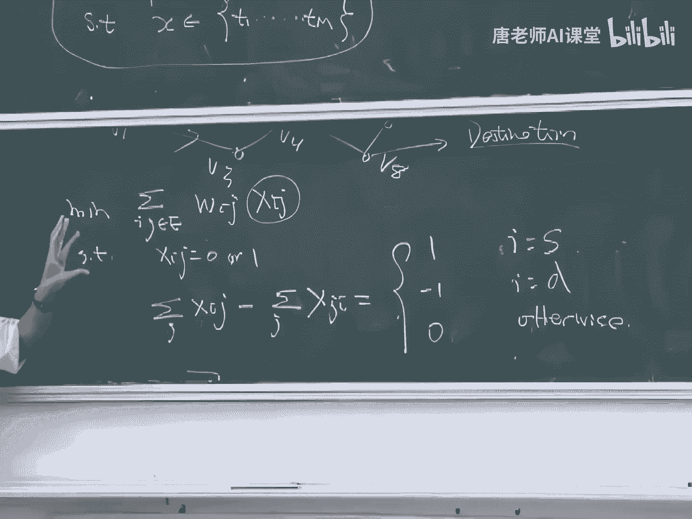
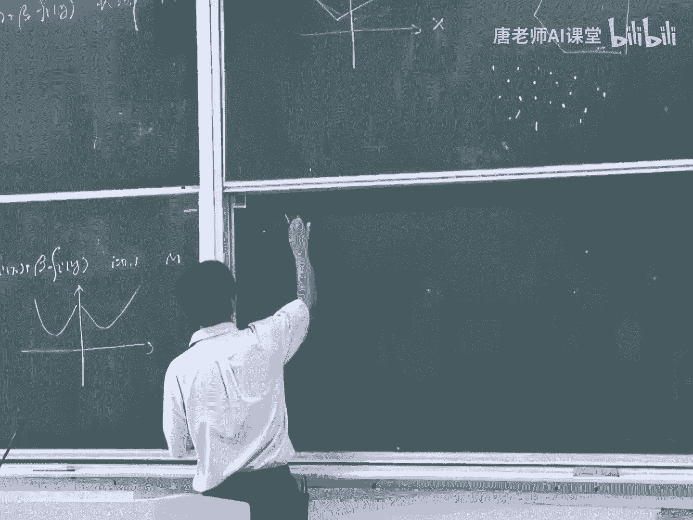
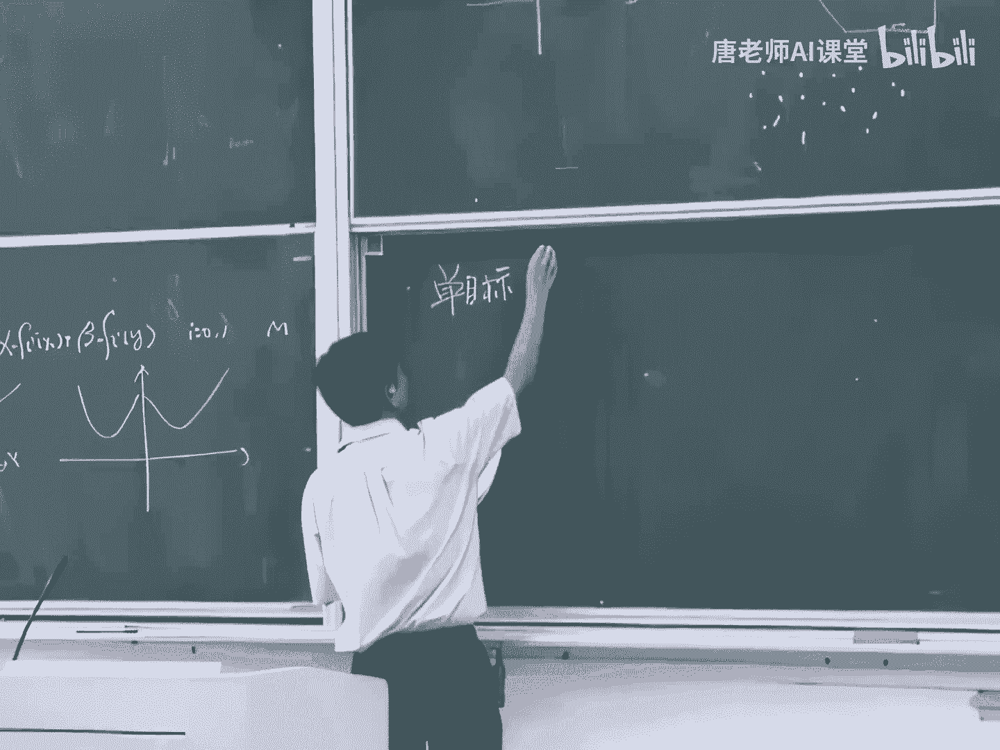
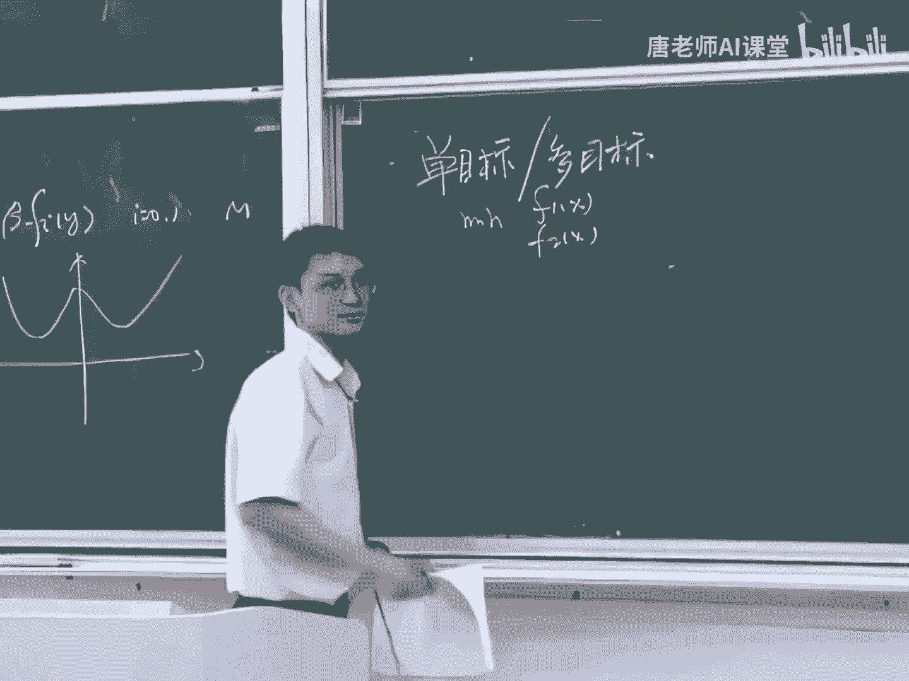
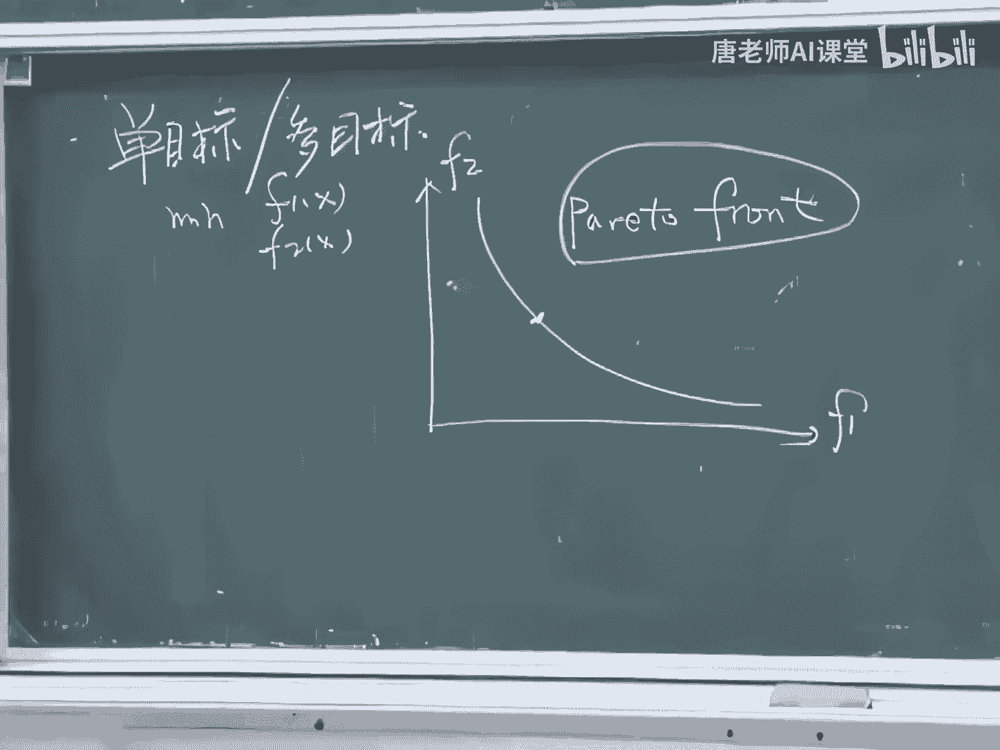
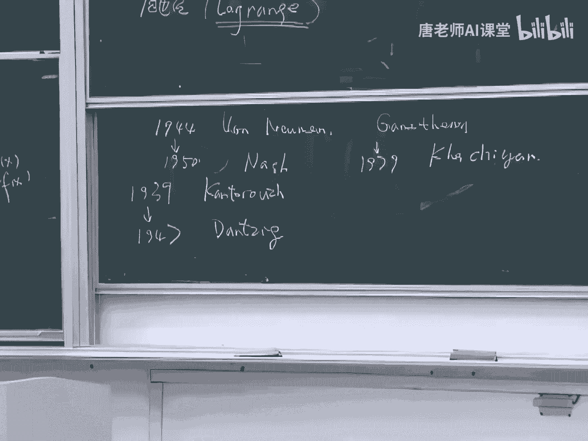
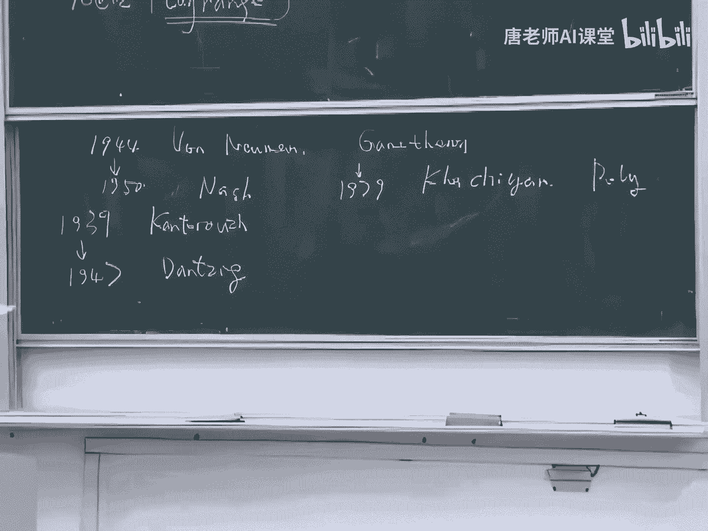
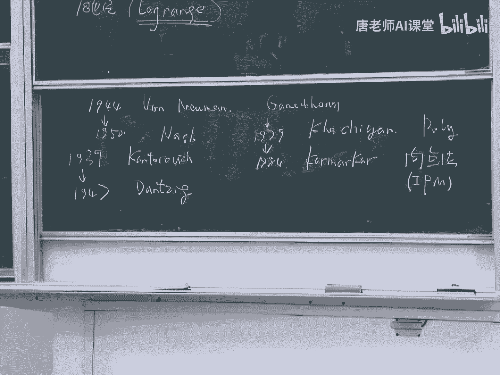
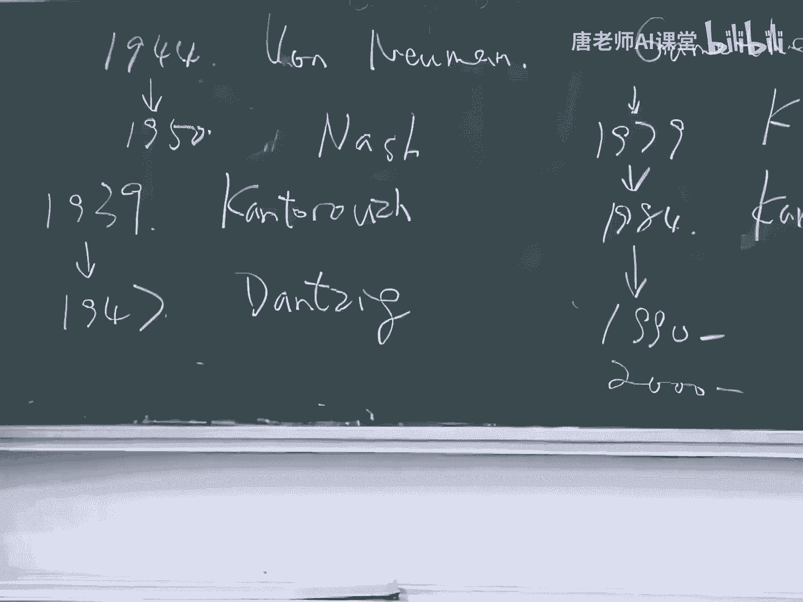
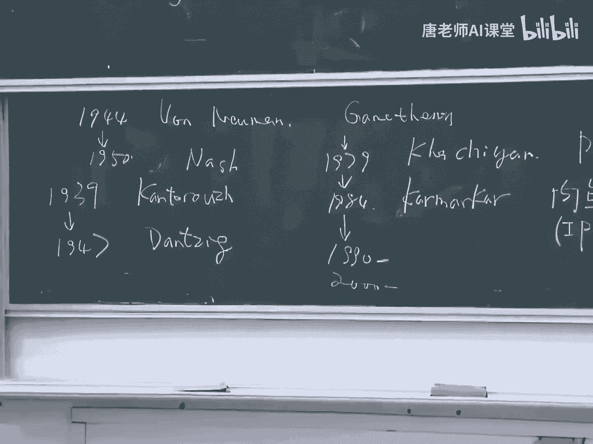

# 【比刷剧还爽！】这太完整了！量化交易和python金融分析实战课程，全程干货无废话 入门到精通一步到位！（数据挖掘分析／大数据／可视化／投资／金融／股票／算法） - P61：65. 2.2.引言（2）(Av526664194,P2) - AI算法-溜溜 - BV1iC411n7XN

哎我们接着上课啊，好现在我们假设有这样一个无向图，这个图中间的每个圆圈呢，是表示这样一个顶点好，那么这个两个顶点之间呢，这下连线是一个是一个边，是这样一个边，那么对于每个边都有个权重。

比如这个边的权重可能是二，这个边权重是三等等等等，好这个权重表示什么意思呢，就是表示呃，比如说吧，可以表示这个从我从第一个点到第二个点，可能要花的时间是多长，比如说2ms我就把它给记成二。

如果是3ms的话，我就把它给记成三，那么实际上就表示从这个顶点走到这个顶点，所花的代价好，那么我们讲这个这样一个所谓的最短路径问题，是一个什么样的一个问题呢，就是我有这样一个我这样一个起点。

或者说叫做圆好，另外呢我有个终点，那么我呢我希望从这个起点出发，到终点能够找到一个最短的路径，所谓四维的路径呢，就是他们中间这样一个所有的这边的，相加的之和啊，是要最小的。

这个就是一个所谓的最短路径的问题，这个描述你们应该很清楚吧对吧，比如说你要访问什么网站的话，你肯定希望你你的你的这个访问的这个时间，要进行的快的对吧好，那么对于这样一个问题，实际上是有很多很经典的算法。

比如说这个有这个所谓的叫迪杰斯特拉算法，对吧，是非常经典的算法，还有所谓的叫贝尔曼福德的方法等等等等，当然这个东西呢，不是我们这门课会会介绍的东西呃，我们要讲的是对于这样一个问题啊。

实际上你也是可以写成一个优化问题的，好我们讲这个问题应该怎么去写啊，那么给力这样一个给您这样一个无向图，无向图的顶点是V这样一个集合，另外呢我还定一个集合叫E所所得，占个边的集合好。

那么V和E呢放在一起就表示这样一个无向图，那么我要我给再给你这样一个这样一个圆，再给你这样一个目标，那么我希望能够找到一个最短路径，那么这个问题可以怎么去写呢，好。

那么这里面这个WIG就表示的是IJ这条边，AJAJ是某一条边，就表示的是IJ这条边的它的这样一个权重好，那么这个平台就是要使得，就是要你选择这样一些xi j，你你你通过这个这个选的这个id这条边，来。

使得你的这样一个所有的这样这样一些，权重之和要尽可能的小，那么我们知道这里这个XIJ呢，肯定是可是XIJ或者是等于零，或者是等于一的对吧，对不对，就说我如果要选择了IJ这条边的话。

那么我就我要设这个xi j是等于等于一的，普通话，我就设它等于零，那么我把我把他们这个和给加在一起，就这不就要使得这样一个，使得这样一个最后的这个路径是最短嘛，对吧好，但是光这样是不是还不够啊对吧。

因为我如果这么去做的话，我没法保证我最后得到的是一条路径，对不对，所以为了要满足这样一个路径的，这样一个要求呢，所以我还要再引进一个约束，好我们来看看底下这个约束是表示什么意思啊。

就是说如果这个如果这个I这个这个点呢。

如果I这个顶点是这个圆这点，那么我就要求呢，这个初旭的编是出去出去的边的数目是一对吧，好所以呢我就会有这样一个要求，就是要使得这样一个，你看你看这个我们这个每个这个xi j是表示。

我选择了从I出去到街的这样一条边，好，那么文章呢，我就要求使得这个它出去的边的数目呢，减去它进来的边的数目，这是他进来的边的数目对吧好，这个差是要等于一的，可以理解吧对吧，这是我对这个这个圆这一点。

这个起点这一点要有这样一个要求好，那么对于这个终点这一点呢，对于这一点呢，我的要求是，我进来的编的数目是要比我出去的，编的数目是要多一个的，所以呢这个地方呢我们要要求它之差，是等于一的。

那么对于其他中间所有的点，对于所有别的点，我的要求，这个进来的数目和出来数目是一样的对吧，比如说你要选择一个最短路径的话，你肯定是比如说从这一点出发的话，你肯定选择到这一点，或者是选择这一点。

或者选择这一点，你不可能两条都选，对不对对吧，两个都选这个路径肯定都不是一个最短路径了，好我们看这个问题啊，实际上就描述了这个，实际上就是这个关于最短的路径问题的，这样一个优化的描述。

你可以把它拖成这样一个形式，可以写成这样一个形式的，好，这个问题啊，实际上呢这个这个问题，实际上是个很容易的问题，但是呢这个中间有一点呢你们要注意一下，就是这地方有这样一条约束。

这条约束啊是要使得这个xi j是或者是等于零，或者等于一的，我们讲这个问题呢，实际上跟这个集成电路的设计问题，中间有一点相似的地方，就是这个问题呢可能是一个，可能是需要你通过选择对吧。

你看你你中间有很多的选，有很多可能的选择，你需要从从中间去选择出来一些，那么这个选择的问题呢，一般来说都是很难的问题，一般来说都是非常非常难的问题，但是呢对于这样一个比较特别的例子，我们我们我们讲啊。

我们可以把它改成一个比较简单的问题，好怎么去改呢，实际上我可以把这条约约束啊，把它写成一个很简单的一个约束，就把xi j等于零或者一这个约束，简单的写成一个xi j大于等于零，这个约束。

那如果对这个优化有一定了解的同学，应该就会知道，这个问题实际上是一个所谓的线性规划的问题，对不对，这个目标函数是一个关于xi j的一个线性函数，这个约束是一个关于xi j的线性约束，底下。

这个约束呢也是一个关于XIJ的这样一个，线性约束，所以这个问题呢实际上是一个很标准的，一个容易的优化问题，所以我们讲啊，这个原来一个原来看起来很难的问题，实际上它可以变成一个容易的问题。

至于为什么可以这么变呢，如果你们有同学感兴趣的话，你可以自己去研究一下，这是一个非常经典的问题，好，那么在我们这门课当中啊，我们要讲的实际上就是这一类比较容易的问题，对吧，我们会我们会讲到这个。

我如果你有一个难的问题的话，你能不能给他变成容易的，这两者之间是不是等价的，这都是我们要讲的内容，好那么现在呢我们的这个例子就讲完了，我们不再讲例子了，好我们现在来简单的介绍一下优化问题的分类。

关于简单关于这个优化问题的话，我们可以把它分成哪些类，好优化的问题，这个第一种分类就是所谓的分支，叫线性规划和非线性规划，好，什么问题叫做线性规划问题呢，我们讲了这个好，我们现在考虑上面这样一个。

上面这样一个比较一般的这样一个描述形式，我们讲这个中间有些函数从F0到F到F1，一到FM对吧好，那么如果所有的这样一些函数，都是线性的函数的话，我们就把这个问题叫做线性规划的问题，那么什么东西叫线性呢。

线性的定义你们都知道吧，这个关于这个线性代数，这些东西你们全都学过吧，所谓线性的实际上就是表示的是，对于这样一个函数FI，你如果去求这个，他在阿尔法X加上贝塔YG的取值的话。

那么这个值一定是等于等于什么，对于阿尔法FIX加上B的FIY对吧，对于所有的这个I是从从0~1，但一定都要满足这样的要求，那么如果对于一个优化问题，它的中间这样一些函数可以都是线性函数化。

那么这个问题就是一个，就是所谓的叫线性规划问题，好，比如说呢，这个我们刚刚讲的这样一个最短路径问题，它实际上它是可以把它转化成一个一个，线性规划的形式的，好如果你们学过这个优化。

就知道一点这个优化知识的话，你们可能就会知道一个很著名的方法，叫做单纯单纯形法，对不对，一个单纯性法是一个，解决一个线性规划问题的一个很标准的方法，那么对于一个线性规划问题呢。

我们可以可以给他画个图来表示一下，好以后你们可能会经常见到这样的图啊，这图表示什么意思呢，这个这就表示这个表示我的这样一些约束，从F一一直到FM所构成的这样一个空间。

其实就是我刚刚讲的这样一个可行解集了，对不对，我的所有的这样这样约束所构成的可行解集，好，因为我们我们讲这个，因为约束中间的每一个函数都是线性函数，所以呢我的可以解一定是这个样子的。

一定是这种有很多条直线所圈出来的，这样一个形状，对不对不对对吧，这个可以理解吧，好那么我的这个目标函数也是个线性函数，那么现在呢我我就可以，我我我来想象一下，这个这个线性函数。

怎么在这个空间里面描述出来啊，那么你可以在这个空间里面去画一些等高线，好，这每条线都是表示表示一个对于F0的取值好，你可以想象一下，这个黑板呢就是一个X这样的空间，那么我用这个方框框出来这一块呢。

就是我的可行解集了，好那么这些点你选的这些X，那么它的这个F0的值是相等的好，那么这个方向是一个它的这样一个F0，所下降的方向，这个可以理解吧，你们肯定都看过地图，对不对，这个等高线应该知道怎么回事吧。

好我们讲啊，这个任何的线性规划问题，它都有这样一个特点，就是它的最优解一定是在顶点上，或者是在一些边上对吧，我们看这个问题，它的最优解就在这一点上，对不对，它不可能出现在这个中间的。

这就是线性规划问题的特点，也就是说，我们为什么可以用这个所谓的单纯分析法，来解决这个问题呢，我们就是在利用这样一个性质的，好，那么相应的呢如果一个如果对于一个优化问题，中间这个这个这个FI中间这些函数。

如果中间有一个或者有几个不是线性函数的话，那么这个问题优化问题就变成了一个所谓的叫，非线性的优化问题，或者或者叫非线性规划问题啊，那么另外一种方法呢，是所谓叫凸规划和非凸规划，好这个突变化呢。

就是我们这门课所要讲的主要内容了，那么对于凸规划而言呢，我们也有一个跟线性规划相关的，这样一个这样一个定义，也就是说对于所有的这样一些，所有的这样一些函数FI我都要有这样的性质。

就是所有的FI都应该是凸函数，凸函数你们知道是什么东西吗，不知道是吧，好这就是我们这门课要讲的内容，好你们先现在先记住这个式子就可以了，那么如果一个函数啊，满足这样一个满足这样一个要求的话。

那么这个函数就是个就是个凸函数了，好，对于一个凸尾号而言的话呢，我们要求中间所有的这样一些函数，从F0到F1到FM都是都是凸的函数，或者换句话说，换句话说就是它的这个可行解集啊，是个突击。

而且它的目标函数是个凸函数，我刚刚讲的讲的这句话，好像你们应该不大容易理解对吧啊，就是所有的如果一个问题，如果如果一个问题是个凸优化的问题，那么也就是说，这个问题的目标函数是一个凸函数。

而且它的可行解集是一个凸起，能不能理解这句话不能理解，对吧好，那就对了，那就是我们我们这堂课，我们我们这门课所要讲的事情就是什么叫突击，什么叫凸函数，什么叫图规划啊，好我们这里还是简单的来举些例子。

就是什么东西叫凸函数，什么东西叫非凸函数，好，还是我们刚刚讲刚刚讲的那个例子啊，就是如果给你这样一个函数FX，那么如果这个函数长成这个样子的话，那么这个函数就叫做凸函数，那如果它长成这个样子。

那么这个函数就叫做非凸的函数，好吧，简单而言的话就是对于凸函数的话呢，你没法找到，没法找到一些不相邻的最低的点，这个就是所谓的凸函数的定义，这个对于非凸函数呢，你可以找到一些不相邻的比较低的点。

就这样一个就这样一个很直观的描述啊，这个以后我们会讲到的啊，那我们讲的这个，为什么我们要分这个图规划和非凸规划，为什么我们要上这门关于凸规划的课呢，就是因为这个图规划问题啊。

如果简单来讲就是容易解决的优化问题，你你们一定要记住这句话，就是一般来说出规划问题都是比较容易解决的，而且呢这个这个非度规化这个问题呢，就是一般来说都是比较难解决的问题，这个就是一个很简单的一个区分。

那我们再看呢，实际上这个任何一个任何一个线性规划问题啊，实际上它都一定是一个脱轨化，对不对对吧，因为只要你满足上面这个式子，只要你满足上面这个等式，那么你必然满足下面这样一个不等式对吧好。

那么在几在几十年之前，可能可能说大概20年之前吧，大家还认为这个这个这个优化这个问题，中间呢最基本的分类是线性规划和非线性规划，有线性问题就是容易的问题，非线性问题就是难的问题。

但是现在呢我们发现是不对的，就是真正的意义上来说呢，这个难的问题是什么问题呢，是非凸的问题，那么容易的问题呢是凸的问题，这个分类才是一个才是一个正确的分类。

还有一种分类啊。

叫做叫光滑的优化问题和非光滑的优化问题，这个光环和非光滑呢，一般来说是针对于我们的目标函数，F0X而言的，我们讲如果一个如果一个函数F0X，他一个光滑的话，所谓的光滑是什么意思啊。

你们学过高等数学应该都知道对吧，也就是我的这个函数在每个点上都是可微的，这样一个函数叫做光滑的函数好，一般来说这个光好光滑的问题啊，是稍微简单一点的问题，我们不讲它是简单的问题，它是稍微简单一点。

那么如果一个如果一个函数呢，如果一个目标函数呢是一个非光滑的，比如说是这样一条折线的话，那么这样一个优化问题啊，一般来说会稍微难一点的，但这个分类分类呢不是一个最本质的分类，就是所谓的光合。

光合和非刚好啊，它所带来的难度的差别，不是不是一个本质上的差别，不像这个凸和非凸，这是个本质上的差别，那么另外还有一个分类呢，就是连续的优化问题和离散的优化问题，那么这个连续和离散的。

是针对于我们的可行域而言的，就我们的可行域可能是一个连续的一个域，也可能是离散的一个域，比如说我刚刚画的这样一个这个线性规划的，这样一个可行域，这是个连续的对吧，这个集合是一个连续的集合吧，对吧好。

那么如果是一个离散的这样一个优化问题，可能是你的可行性就是这样一个问题了，就可惜，于是空间中间一些离散的点，这个呢，就像我们刚刚讲的那个，大规模集成电路的优化问题一样的，就是一般来说啊。

如果你碰到这类问题，你的这个可行域是离散点的话，那么那么你很不幸你碰到一个比较难的问题了，一般来说这个离散的问题都是难的问题，为什么它难呢，这个以后我们会讲到的，因为这类问题一般来说都是非凸的问题。

所以它是难的问题对吧，但如果你是个这样一个连续的话，你是不是容易的问题呢，不一定容易，因为你如果是一个连续，你的问题是一个连续的问题的话，但是你的这个问题也有可能不是一个凸问题，好吧。

好我们刚刚讲的这样一些优化问题呢，实际上就是一个所谓的单目标的优化问题，也就是说我们我们的目标函数只有一个，就是个F0X好，但是实际当中啊，我们在我们在实际当中碰到很多问题，本质上都是多目标优化问题。

就比如说举个例子，这个这个调控房价的这个问题，它实际上是个多目标的问题对吧，所以我们的房价都降不下来啊，那我们可以可以这么来，描述一个一个多目标优化问题，就是我要去minimize两个模块函数。

F1X和F2X好。

那么我可以画出这样一幅图，注意一下我的这个坐标轴啊，这个坐标轴横轴是F1这样一个函数的取值，纵轴是F2这个函数的取值，那么一般来说对于多目标的优化问题呢，我们总可以得到这样一条线。

好我会讲一讲这条线叫什么意思呢，这条线叫做帕累托曲面，这条面有个什么样的性质呢，就是对于这条面中间的所有的点，比如说我我取这么一点，你没法找到任意一个X，使得它记在F1这个上面更小，又在F2上面更小。

理解吧，也就是说这一点呢不一定是最好的，因为实际上这个时候，我没有一个所谓的最好的指标了，对不对，我这地方也有两个指标了，你没法区分到底哪个是更重要的好，那么但是呢我知道呢。

就是我如果使得它在F1这个上面更小的话，那么我必须要增大F2的取值对吧，所以这一点呢就叫做一个这样一个帕托点，这个帕托化实际上是什么意思，就是一个所谓折中的意思，你在F1和F2中间。

你必须要必须要选择一个，或者是或者说是一个折中的选择，这个概念呢实际上是经济学里面一个概念，所谓所谓的叫帕尔托最优，就是这样一个含义啊，我们讲这对于这样一个多目标的优化问题呢，一般来说呢我们在很多时候。

我们可以通过一个加权的方式，比如说我把这两个目标函数做个加权，把它加权成一个单目标的，这样一个这样一个优化问题，但是呢这个加权也并不总是管用的，因为对于很多的问题而言的话，如果你这样一个加。

你通过这样一个加权呢，你改变你的权重，实际上你是不一定能够得到整个的这样一个，派出曲面的，这是不一定能够得到的好，关于这个东标优化问题啊，我们我们这门课就不会，我们这门课不会讲到东标优化问题。

我们会简单的提到一些一些基本的概念，但是他不会去重点的去讲，你们知道一些基本概念就可以了，好好，那么我们接下来再来讲一下，我们这个这门课的目标，我们这个课程的目标，我们刚刚一直在强调。

我们这门课是要讲最容易的问题，对吧好，那么中间我们看看哪些问题是最容易的呢，这个这个图锐化是个容易问题，我们要讲一下图锐化啊，我们要讲一下这个当目标单，目标是相对于东北而言的话，是个比较容易的问题，好。

另外呢，我们通常呢还要求这个我们的目标函数啊，是个光滑的啊，好那么我们这门课呢主要要讲的事情啊，就是就是怎么怎么根据你的这样一个，实际的需要，比如说你现在有些任务要要去完成。

你怎么来构造这样一些容易的问题对吧，因为我们讲这个容易的问题，实际上是很简单的对吧，但是你如果你碰到一个实际的这样一个，这个困难的话，你怎么去把它变成一个比较容易的问题呢。

这个是一个这个就是我们这门课的目标之一，好有个人呢叫做这个叫希尔伯特，知道希尔伯特吗，知道是吧，对非常著名的数学家呃，在1900年的时候，提出来了23个著名的数学问题，那基本上就是引领了二。

我们整个20世纪数学的发展好，他讲过这么一句话，就是对于任何对于任何一个数学问题，任何一个数学问题，只要你能够清晰地把它描述出来，那么这个问题，你也就相当于解决了80%了，这是他的原话啊。

那么对于优化问题的话呢，我们也可以讲啊，就是任何一个优化问题，如果你能够把它变成一个一个，凸优化的问题的话，那么你相当于就完成了90%了好吧，那后面这句话是我讲的不一定对是吧。

那希尔伯特的话一定是对的啊，啊，那么所以呢，这我们这门课的一个一个很重要的目标，就是要告诉你们怎么去结合这样一些实，你的这样一些实际的要求，结合你实际的任务去构造这样一些容易的问题，那么构造完之后呢。

我们就来分析问题了对吧，我们要分析一下，就是即如果它是一个容易的问题，那么它有些什么样的性质，我们能不能利用利用这些性质，那么这就是所谓的分析，分析完之后呢，我们就可以来解决问题了。

我们还会简单来介绍一些算法，简单地介绍一些优化的算法好，好那么关于这门课的主要内容呢，我们主要讲下面这一项内容，首先呢我们会介绍一下什么东西叫做突击，什么东西叫做凸函数，什么东西叫做凸优化。

我们要介绍一些关于这样一些凸优化的，这样一些最基本的知识，另外呢我们会简单的介绍一下图优化的理论，它有哪些理论知识，最后呢我们也还会简单介绍一下这个这个算法，以及若干图优化的算法。

好我们刚刚一直在强调啊，就是出优化问题呢，实际上就是容易的优化问题，但是呢这这这句话实际上可能会引起，可能会引起误解的，为什么呢，就是所谓容易和难呢，实际上是有很多个标准的，对吧。

嗯比如说呢这个我们刚刚讲的这个希尔伯特啊，他就提出来过这样一个命题，就是在我们这样的教室里面，我总能找到一个同学，他的头发是最少的啊，但这个问题不是23个问题中间之一，证明是个容易的问题。

还是难的问题呢，我如果让你们来解决这个问题，你们觉得这个问题是容易还是难难是吧，这问题难在什么地方啊，哎这个问题的难度呢实际上有两点，第一点呢是第一点呢，就是对于这个问题，实际上是一个离散的优化问题。

对不对对吧，这个这个我们可以把这个问题写成这样一个，优化的形式，就是比如说我们可以去去mini这个FX，这个X是表示一个人的，F呢是表示你的你的头发的数目的好，我的约束呢就是要使得这个X是。

比如说等于一呀，一直到比如说我们里面有N个同学，从一到N的好，那么这个问题它是一个离散的优化问题，它它不是一个容易的问题，这是难度之一好第二个难度在什么地方呢，第二个问题就是你对于任意的一个人呢。

你去求这个FX，你去属性里的一个头花的数目，这是很难很难的问题，对吧，我我可以，我自然可以让你去说出来，但是问题是这个花的时间太长了，所以呢所以说呢这个容易和难的分类啊，实际上并不是那么简单的。

那么我们在这门课中间呢，我们主要讲的这个难呢，只是这个问题的这个这个本身的求解比较难，而不是讲这个目标函数的取值比较难，也就是说我们在这门课当中啊，我们一般假设这个FX是比较容易求的。

甚至呢我们可以比较容易的去求一下，它的这样一个一阶偏导啊，我们是比较容易求的，而且他的这个一二，甚至有的时候，我们假设这个二阶偏导也是很容易求的，所以呢这个所谓的容易和难呢。

实际上是一个这样一个相对的概念，你们一定一定要记住这一点，我们一般不讨论这种目标函数，很难去求取的这样一个问题，这类问题是有些专门的算法去研究的，下面呢我们再简单的讲一下。

这个优化发展的历史，这个我们对这个历史去做个回顾，看看优化这门学科是怎么发展起来的，实际上这个优化这个学科的发展的时间并不长，但是呢我们为了让这个历史更久远一点呢，所以我们通常会讲到一个人叫做牛顿。

有两个人，一个人叫牛顿，一个人叫拉普森，两个英国人，他们解决的是哪一类问题呢，这个好，那么解的是哪些问题呢，就是这样一个问题，假设我有一个有一个非线性的方程，这个方程呢这个FX是个非线性的函数。

我这个这个FX等于零，这样一个非线性方程我应该怎么去求解它，这个我们都知道有个很有名的方法，叫做牛顿拉普森的方法对吧，这个应该都知道吧，求解非线性方程的根的这样一个标准的方法好，那么我们讲啊。

这个问题看起来不像有油耗问题，对不对，但是呢我们可以把它转化成一个优化问题，如果一个X是FX等于零的解，那么它一定是这个问题的最优解，对不对，没错吧，所以我们看啊，实际上在这个这个求解这个分析方程。

这个问题中间呢，实际上就隐含着优化的概念了，好那么有这个有这个非线性方程呢，那么自然就有这个所谓叫线性方程组，那么到了这个19世纪的时候啊，有有有三个德国人，第一个人呢你们应该知道叫高斯。

很有名的数学王子，还有一个人叫叫叫赛德尔，这个人知道的人可能不是特别多吧，但是这个高斯赛德尔连在一起，叫高斯赛德尔的方法，可能你们应该听说过啊，还有另外一个人呢叫，这叫KY应该知道吧。

啊他们解决的是哪一类问题呢，就是我有一个一个线性方程组，比如说F1X等于零到FNX等于零，我要把他们的这样一个解给求出，那么我们看啊，实际上这样一个问题，我也可以转化成一个优化问题，对不对对吧。

我就要使得它的这样一个目标函数之和，要等于零吗，哎抱歉，不要使得它的这样一个使得这样一些函数之和，是要需要它的平方和要最小对吧，那么如果一个X满足这样一个方程的话，那么它一定是是这个问题这个最优解对吧。

嗯啊，那实际上呢这个关于优化，我们最早可以追溯到他们这样，这样这样一些人的工作，就是啊，就是两个这个两个英国人和三个德国人好，那么下面呢我们再提一个人呢，我们不知道他的这个，这个到底是属于哪个国家的啊。

但是呢他的优化理论呢，做出了一个一个非常非常重要的贡献，这个人的名字叫做拉格朗日啊，你们一定一定要记住这个名字，如果你上完这门课，知道之后，还不还不知道这个人的话，那么那么你这门课算是白学了。

就是我们这门课的主要的一些概念呢，都是跟拉岗日相关的，这个人他做过什么事情呢，就是我们讲这个一般的优化问题啊，是都是带约束的问题对吧，我们有一个目标函数，有一个有个约束，那么实际上这个约束呢。

实际上是一个非常难的一个东西，是个非常难处的一个东西，那么拉岗日这个人呢，他就他就他就讲的，就是我可以通过一个东西叫做拉岗日，陈子把这个约束啊给变成目标，这个是一个非常非常重要的概念。

这个极其重要的概念，我们通化这门课，实际上就实际上我们主要讲的，就是这样一件事情，就是怎么去把这个目标和约束之间的关系，把它给找出来好，那我们为什么说这个拉杆人，这个人不知道他是哪个国家的呢。

是因为他的父母是父母都是意大利人呃，他生在法国，死在法国，但是他出名是在德国嗯，所以这个人呢实际上他的国家国际，我们我们不是搞得很清楚的，一般来说我们认为他是个法国人好，那么这样一些工作呢是优化的。

这样一些早期的工作，优化这个领域，真正的发展呢实际上是跟战争相关的，实际上我们这个领域是发了战争财，但在二战的时候呢，我们我们就发现了很多问题，很多打仗的问题，实际上是需要这个优化来解决的，好。

所谓的这个动态规划，这个东西你们应该都知道对吧，好动态规划呢，实际上就是一个就是一个解决优化问题的，这样一个算法，它是由贝尔曼在40年的时候发明的，那么这样一个问题是什么意思呢。

就是比如说我有一个这样一个，比如我有一个这样一个这样一个时间的序列，在这个序列当中呢，我需要去优化中间每个点的值，来达到我的这样一个总体的目标，那么我应该怎么来做到这一点呢，一般来说呢我们会想。

这个我们我们从从前往后去优化嘛对吧，这是一个一般的想法，但是呢这个贝尔曼告诉我们呢，你可以反过来，你可以从后往前去优化，这个呢就是动态优化的，最近动态规划的最基本的思想。

这实际上是这个在这个优化这个领域里面呢，非常有影响力的一个算法，好，好那么在1944年的时候，1944年的时候，有另外一个人叫做冯诺依曼，好这个应该这个人应该都知道吧，非常有名的人物。

他讲了一个什么东西呢，叫做博弈论，哎这个你们应该都清楚吧，因为大家都会打牌打麻将对吧，这个就是这个就是所谓的博弈的问题，所谓的博弈呢，就是每个人都要优化自己的这样一个目标，这个就是一个所谓的叫博弈问题。

我们要注意一下这个这个问题，实际上跟我们刚刚讲的这样一个，多目标优化问题，实际上是不一样的对吧，虽然我们都存在多个目标函数，但是呢在博弈论当中呢，是每个人去优化自己的目标函数。

但是呢在多目标当中呢是多标优化当中，是有一个人来优化所有的目标函数，这是一个非常本质的不同好，那么这个关于博弈论这一块呢，后面也有一些新的一些发展了，比如说呢到了这个1950年，1950年的时候。

有另外一个人叫叫纳什的，他讲了一个东西叫纳什均衡，这个是博弈论里面一个一个最核心的，这样一个概念了啊，这个就是这个是关于在博弈论这个方面，当然这个领域呢实际上是跟跟我们讲的，这个优化。

实际上是相对来说比较独立的这个领域，但是中间有很多的工具都是相通的，所以一般我们也认为它是优化中间的一块，好那么除了这这些人之外啊，还有另外一些人去解决一些，看起来比较简单的问题。

我们现在看起来比较简单的问题，但实际上这个东西在当时，发挥了非常非常大的影响力，比如说在这个39年的时候，有一个有个俄国人，或者说当时应该叫苏联嘛，叫坎德尔这样一个人，他做的是一件什么事情呢。

就是当时的苏联呢，都是这种集体农庄的这样一些生产，那么这样一些生产资料，你应该怎么去调配，这个资料应该怎么去调配呢，那么cat rocity，它的主要贡献就是把这样一些问题啊。

把它归结成一类比较简单的一些一些优化问题，这个问题呢这就叫做线性规划，最早讲线性规划的实际上就是就这样一个人，他是从这个实际问题当中出发来讲，这来提出这样一个模型的好，那么我们都知道这个单纯形法对不对。

就解线性规划问题的单纯形法，这个方法是1947年的时候，有个人叫单齐格，做出来的一个算法，所以叫单纯性的方法，这是一个求解，求解这个线性规划问题的，这样一个非常非常巧妙，非常简单的方法，呃。

但是呢我们讲这个这样一个方法，其实并不能保证你能够在多项式时间内，能够把一个线性规划求解出来的，这个这个这个有人知道相关的知识吗，不知道是吧，我们我们刚刚讲过，这个所谓的这样一个线性规划问题。

实际上是个凸规划问题，图图规化问题，我们一定能够在多项式时间内把它给求出来的，但是你如果用单纯形法去做它的话，你是不能保证在多项式时间内把它给求出来的，所以实际上这这这就说明了，这个多项式这个单纯因法。

实际上本质上是有一定问题的，对吧好，那么后面就有很多人去改进他的工作，就想出来，想出很多不同的方法，去求解这样一个线性规划的问题，那么比较有名的工作是，这个是1979年的时候，一个人那叫。

这卡希尔的这样一个人，他做了一个他做了一个要内敛法。

或者说这时候啊，实际上还是一个所谓的多项式时间的算法了，可以来解决这样一个线性规划的问题啊，但是呢很不幸的是，这个虽然在理论上来说。

它的方法是更好的，它是一个多项式时间的算法，这个这个呃这个单词语法呢，并不一定是个多项式时间的算法，但是但是很不幸的是，对于很多的实际问题啊，反倒是这个单纯性法会算得更快更好啊，这样的话就很有问题了。

所以呢后面就不少人呢，进一步的去改进他的工作，最有名的就是在1984年，这么一个人呢他发明了一个方法叫内点法，实际上是在这个卡片的方法上面，基础上面来发展出来这样一个方法。

这个内点法呢是现在已经被证明了。

是解决线性规划问题，尤其是大规模的线性规划问题最有效的方法了，它是一个多，它是可以保证你能够在多项式时间内，给解决这个问题的啊，那么再往后到了1990年之后呢，就有很多人把这样一些方法。

把这个内点法给拓展到非线性，非线性的优化问题上面去，这类问题呢可可可能是凸的问题，也有可能是非凸的问题，但是它是非线性的问题好，所以说实际上呢这个目前来说，这个优化这个鱼的主流实际上还是内点法。

关于内点法这一块，但是呢我们毕竟不是做优化人，对不对，我们都是比如说我们可能是来自这个信息源的，或者来自一些这样一些相关学院的，我们都是来做一些应用的人，呃，我们是非主流的嗯。

所以呢我们不会讲这个这样一些内点法的，一些算法对吧，因为这个算法这东西太难了，不是我们能讲的事情，我们所关心的是，怎么去把这样一些优化的知识啊，在我们的实际问题当中给用上去好，那么我相信这个可能也就是。

为什么同学们想来学我这门课的原因了，实际上这个优化的应用啊，呃最早来说这个这个优化就是从应用当中来的，但是呢这个怎么去把这个优化领域的成果，给应用上去，这个并不是一件简单的事情。

所以呢实际上到了这个呃我个人的观点吧，到了2000年之后啊。

就有很多人开始想这个问题了，比如说在这个通信领域，在这个在在这个计算机领域，就很多人想这个怎么去把这样一些，怎么去把这样一些优化的这样一些方法。

这样一些思路去用来解决自己的问题，好那么我们今天就讲到这里了。