# 【比刷剧还爽！】这太完整了！量化交易和python金融分析实战课程，全程干货无废话 入门到精通一步到位！（数据挖掘分析／大数据／可视化／投资／金融／股票／算法） - P68：72. 9.10.凸函数的定义和扩展(Av526664194,P9) - AI算法-溜溜 - BV1iC411n7XN

好我们接着上课，我们讲对于任意的一个凸函数FX啊，我们都可以去做个这样的扩展，怎么去扩展呢，就是如果X是在这个F的定义域里面的话，那么我们的取值是保持不变的，那么如果X在这个XD外面的话。

那我就把它取值给设成正在无穷大，我做一个这样的扩展，好那么我们来看一看经过这样一个扩展之后，任何一个凸函数经过了这样一个扩展之后，它是不是仍然还是一个，是不是仍然还是一个凸函数。

首先呢我们就根据这个定义来验证好吧，我们看看它的这个定义域是不是一个突击啊，它的定义是不是一个突击，肯定是个图集嘛对吧，我这边都已经写了，它的定义是个N维的空间，所以它的定义域自然是个突击好。

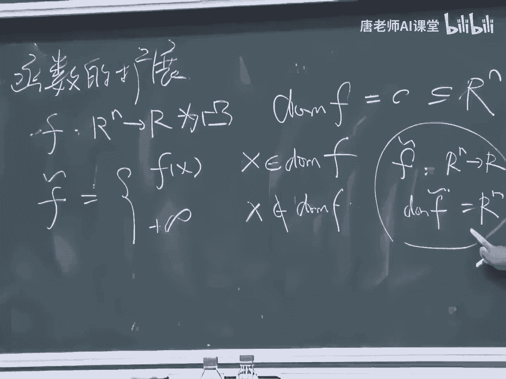

那么第二呢我们来看看这样一个不等式，这个不等式是不是满足的，我们来看看这个不等式是不是一定是满足的好，那么我想就是首先呢我们请大家来想象一下，这样的扩展大概是个什么样的样子，就是我做了做完这个扩展之后。

这个FX会变成一个什么样子，就比如说我这个FS是个铁锅，那么我这个铁锅的定义只是这个锅的投影，这样一个很小的这样一个圆对吧，在这个圆里面的，那么我要使得这个函数啊，我要生成一个能够。

将能够在这样一个整个二维空间里面，能够全都有有取值的这样一个新的铁锅，这个虚拟的铁锅我怎么去生成呢，就是铁锅还是铁锅，铁锅还在这里，如果你不在铁锅的这样一个范围里面的话，那么你就是你就是到了天的高度了。

对不对，政府重大嘛，很高了，那么这个函数是不是一个凸函数呢，想象一下这样一个虚拟的超级大铁锅，是不是图画书好，我们来看一下啊。

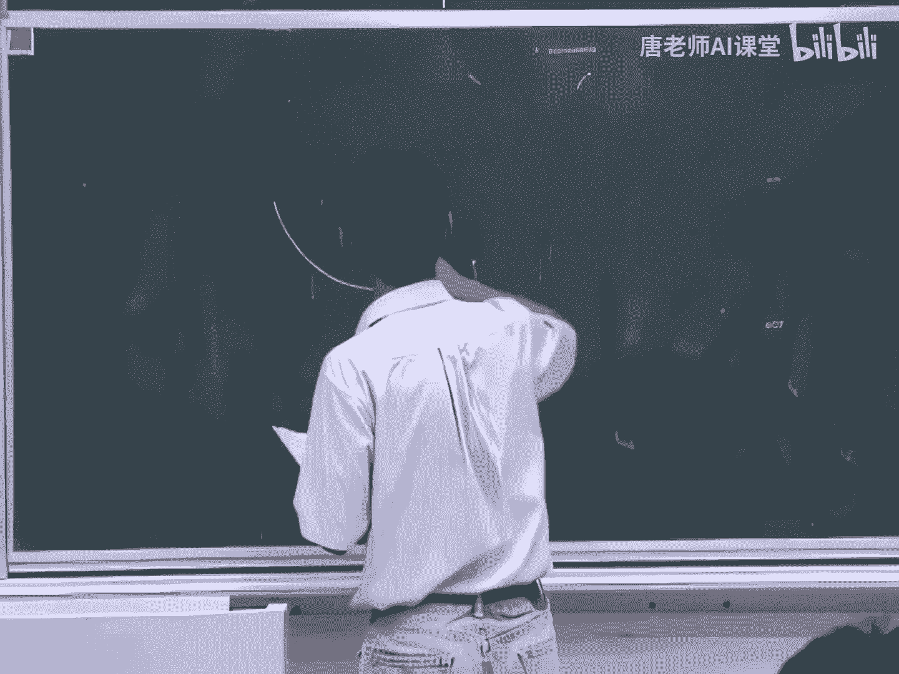

对吧我可以我可以画出来这样一个图形吗，比如说这个图形可能是这样的啊。

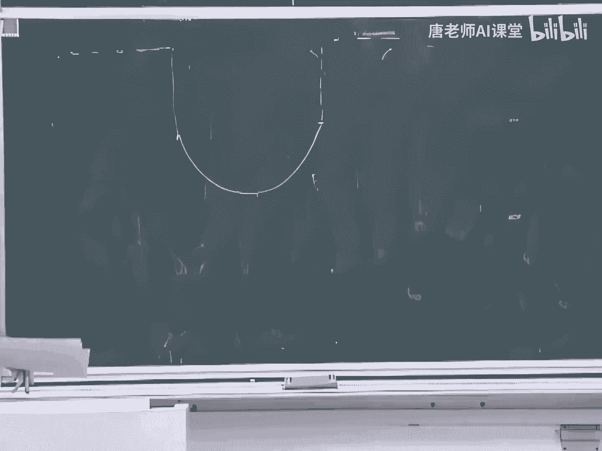

好那么我来取上这个X和Y两点。

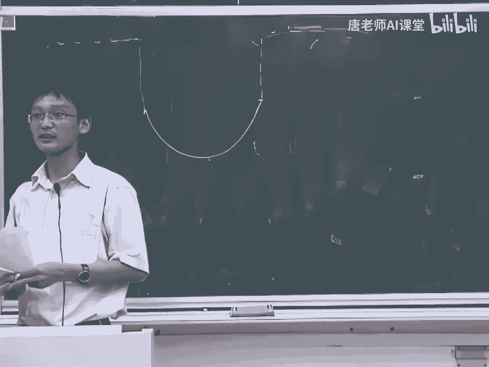

我我可以来取X和Y两点吧，那么现在我有几种情况，第一种情况就是，如果我的X和Y都取代，原来这个FX的地域里面的话，那么我的这个不等式是不是满足的，一定满足吧对吧，因为他还是个铁锅嘛，所以他自然是满足的。

没问题吧，好那么另外一种情况是。

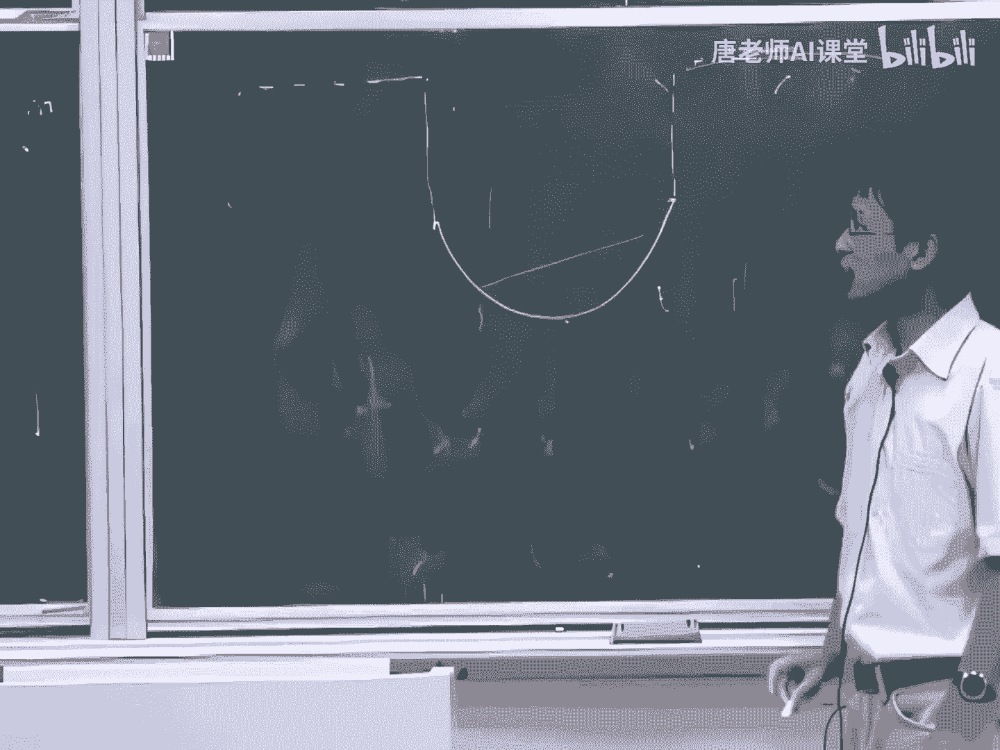

如果X和Y都取在这个地域外面的话，X和Y都取在地域外面的话，那么这个不等式满足吗，也一定满足吧，对不对。

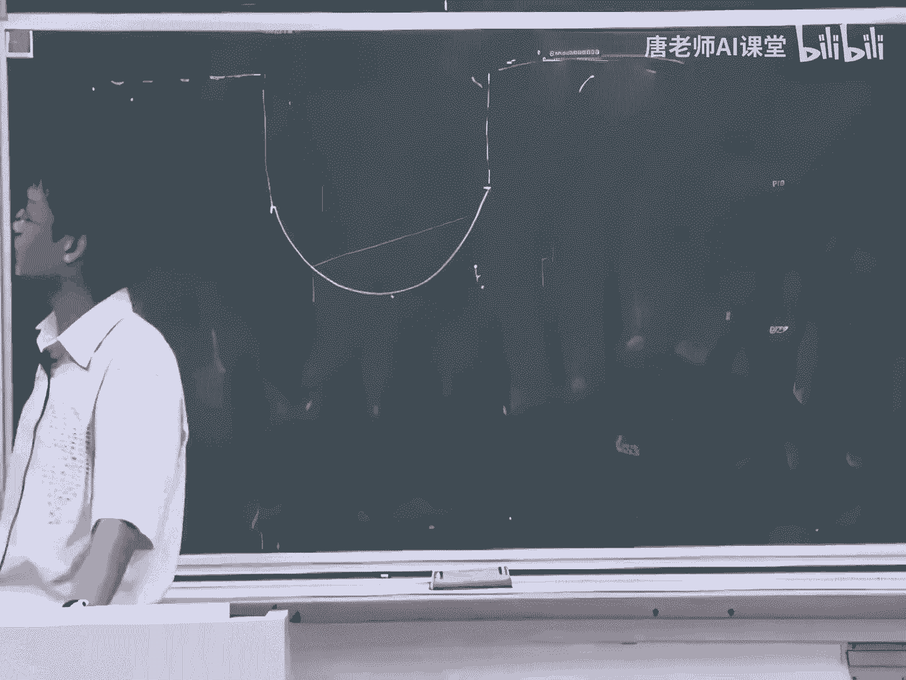

为什么呢，因为不等式的左边和右边都是什么呢。

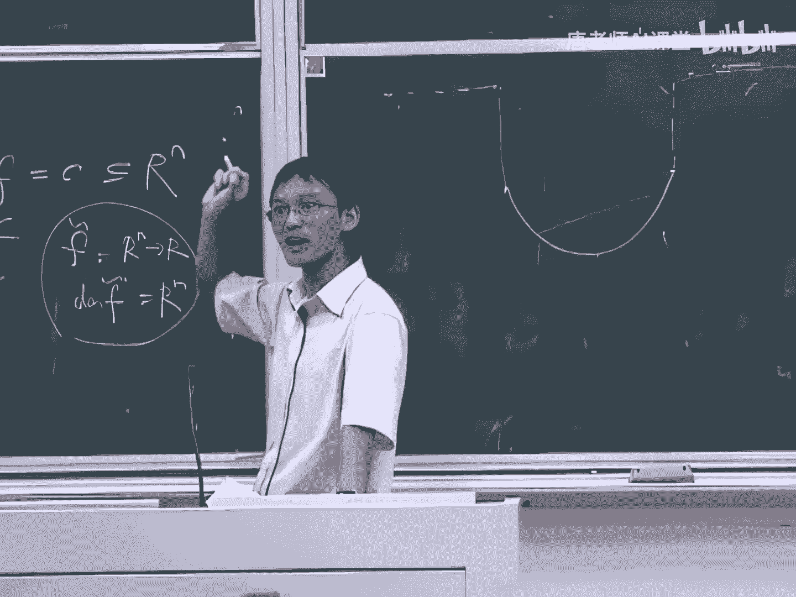

都是无穷大，无穷大肯定是等于无穷大的对吧，这是没有问题吧。

如果如果这样的话，也是可以成立的，那么如果一个X取代这个取在里面。

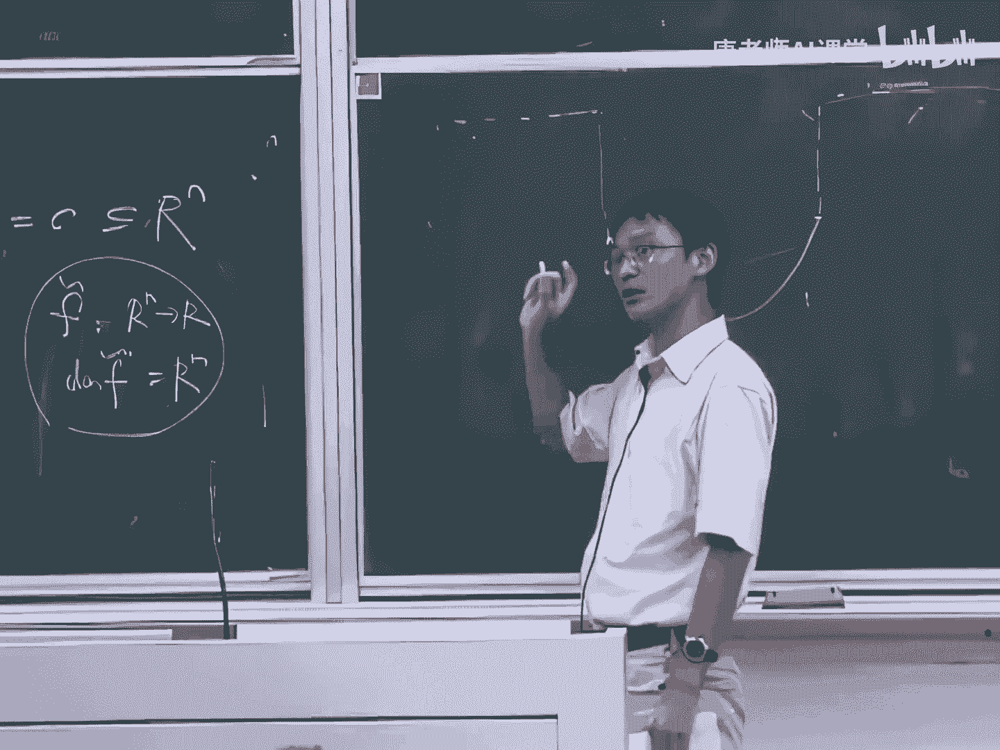

另外一个Y取到外面的话，那么这个不只是满足吗，也一定是满足的对吧，因为这个右边的话一定是等于正无穷大的。

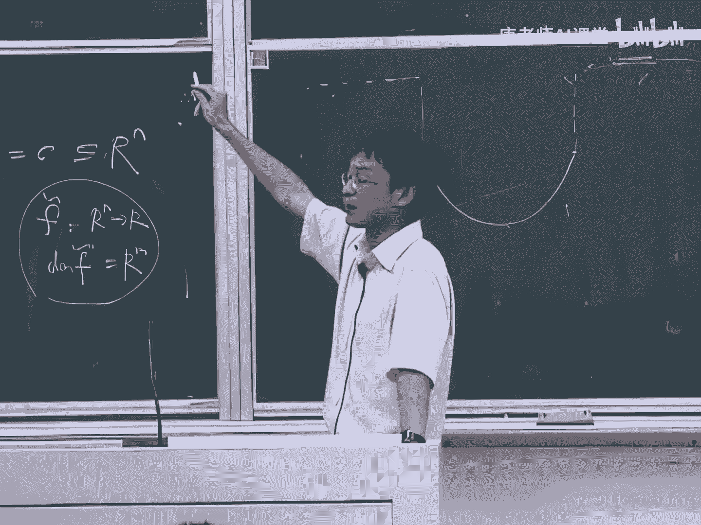

左边的话或者是等于正无穷大，或者是等于或者等于某个某个数，对不对，或者等于某个小的无穷大的数，所以这个式子仍然是满足的，也就是说这样一个函数啊，仍然是一个凸函数好，那么在下面呢。

我们我们讨论讨论很多函数的时候，我们一般都会讨论这种经过扩展的图函数，因为它讨论起来比较简单一点，好那么下面我们举个例子。

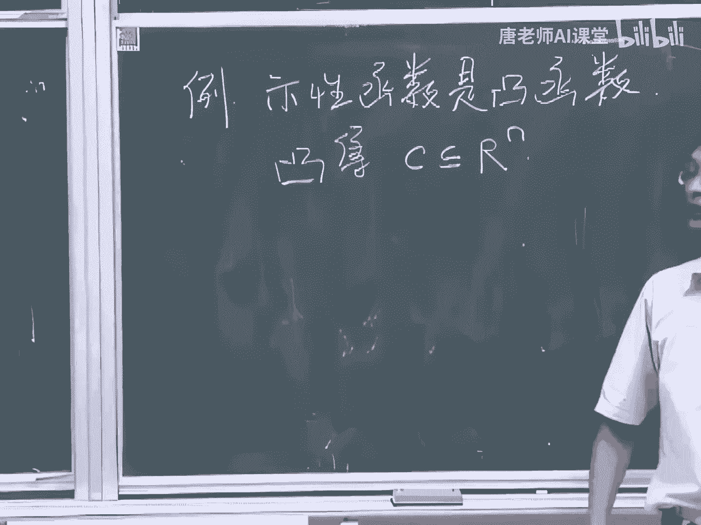

我们讲啊，就是任何一个集合的，它的适性函数叫做都是凸函数，这个什么叫集合的一个适应函数呢，任何一个凸起的适应函数都是凸函数，那我们来首先来第一个凸起，这个凸GC它是N维N维空间的这样一个子集。

那么什么叫它的这个这个集合的适应函数呢，好那么我可以这样去定义一个数学函数，就是如果这个X是属于C的话，那么这个FCX就是等于零的，就是如果是S在这在这个集合里面，那么它取值就是零。

否则的话它就是没有定义的，那么这个函数是不是一个凸函数，这个函数是不是一个凸函数，是吧，对不对，他是不是一个凸函数啊，很显然是的嘛，因为它的定义就是C，对不对，如果他不在C里面的话，它就没有定义了。

它的定义是CC是个凸集，那么在它的地域里面，上面这个不等式很显然是成立的，因为始终会有这个等式成立的，没错吧，好那这种适应函数啊，是我们不常用的一种适应函数，因为它的定义域太小了，我们就把它给扩展一下。

把它扩展到整个的N维空间里面去，好我可以定义一个新的函数，叫叫ICX这个这个东西，那实际上我们有了之前那个关于函数扩展的，这个定义的话，我们可以很容易的知道，它实际上就是之前那个FC这个函数的。

它的扩展了对吧，他把他从这样一个C这样一个集合里面，给扩展到整个的N维N维空间里面去了，很显然这个函数也是一个凸函数，这个我们已经解释过了，好那么下面呢我们来看一看这个函数，我们来看看这样的函数。

它是不是一个是不是一个凸函数，我也可以定义这样一个事情，函数就如果当这个X是属是属于C的时候，它是等于零的，当X不属于C的时候呢，它是等于一的，这个函数是凸函数吗，是不是这个函数呢，好好像有同学说是。

有同学说不是吧，好我们来看一下这个函数是不是一个凸函数啊，我们来举个例子好吧，我们假设这个C是在-1~1之间的，这么这可以吧，假如我考虑一个一维的情况，这个N等于一，这个C呢是在-1~1之间的。

C是这样的，即可是这个B级，好很显然就是当你的这个X是属于C的时候，它的取值是等于零的，否则的话呢它的取值是等于一的，是这样的一个东西，其实就是一个倒放的一个帽子对吧，那么这个函数是凸函数，是凹函数呢。

他是既不凸又不凹，对不对对吧。

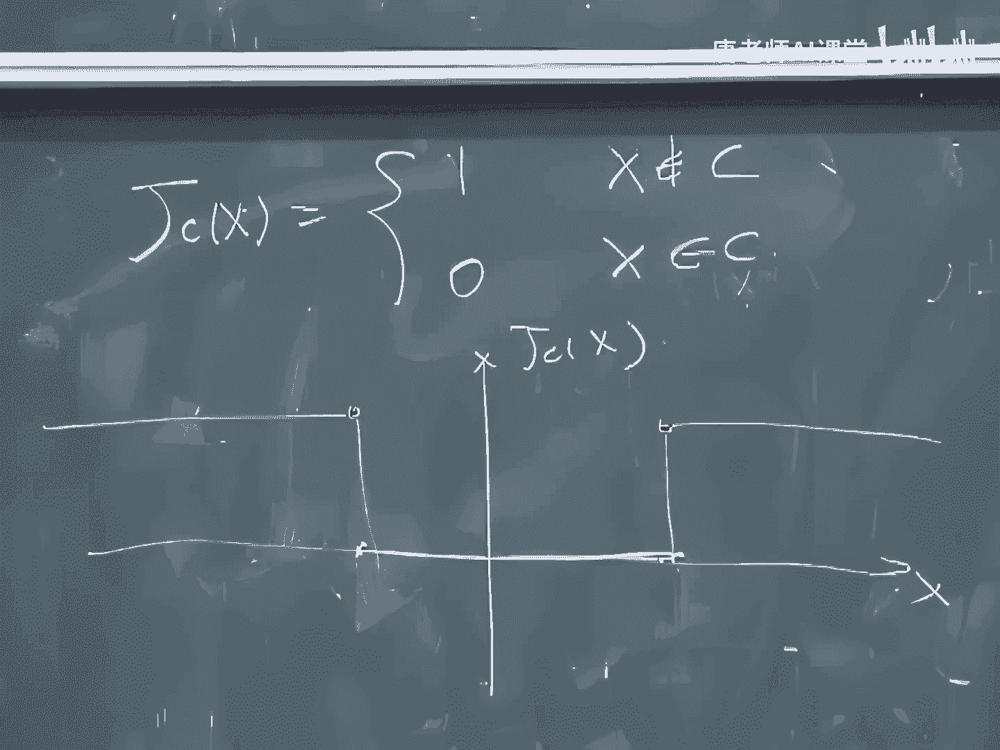

因为我可以找出这两个点，那我可以找到这这两个点，使得之前这样一个不等式是不满足的，没错吧，好我也可以找出来另外一些点，使得这个使你也可以认为它，它不是一个凹函数了，你也可以认为它不是个凸函数了。

就是我总是可以取到反例的，就这样的函数啊，这个函数它不是凸的，又不是凹的，所以这就，这就是为什么我们在定义这个扩展的时候啊，我们一定要把它给扩展到这个正无穷，我们一定不能扩展到一个比较小的一个数。

或者到一个比较小的数的时候呢，你总会有一些例子能够让你不成立的，好，那么下面呢我们要讲到这个凸函数的，第三个定义，这个定义呢有个名字叫做一阶条件，也就是说所谓的一阶条件。

就是如果你这个函数的一阶导数是存在的话，那么它有一个这样一个等价的定义，好我们看这样一个一个小店，这个定义它中间不再有这个C大，C不再有这个C大人这样一个数出现了，它只有这个X和Y了。

我们比较一下这个定义和和下面这个定义啊，这两个D它的一个很明显的一个区别，就是没有这个C带了，说的一阶条件是怎么讲呢，就是如果一个函数F它是可微的，也就是说它的梯度啊是他的梯度，我把它叫做叫德尔塔。

F是他的一阶梯度，如果它的一阶梯度，在这个在F的定义上都是存在的，那么这里我需要说明一下，就是其实这句话也隐含了一个意思，就是F的定义域呢一定要是一个开解，1F的定义域一定不能是个B级。

比如说像刚刚这样一个集合，这个就叫B级了对吧，他一定不能是个B级，为什么呢，因为他在这点上不可微嘛，对吧好，那么如果这样占一个条件，如果如果这个F啊，有这样一个可悲的这个条件的话。

那么如果这个F是个凸函数，我们说这个F是个凸函数的话，等价于下面两个条件，满足第一个条件呢还是一样的，就是F的定义域是个凸起，要满足这个条件，第二个条件就是有这样一个不等式成立。

同样的我还是去选择任意的X和Y，我在这个地狱里面去选择任意的X和Y，但是这个结论是什么样的呢，就不再是上面这个式子了，而是说我这个FY呀一定是大于等于FX，再加上他的一阶偏导。

这一阶偏导是在X这点去取值的，再乘以Y减去X好，那么如果满足这样的条件，那么它就是个图函数，这个好像更不好理解吧对吧，这个定义比上面这个定义好像更不好理解了啊，那我们来看一看啊，我们画个图来看一看。

我们来考虑一个最简单的一个N等于一的情况，我们来考虑一个一维的情况，同样的我们还是用刚刚那个函数，我们选了两点，一点是X，一点是Y，我们要找到这个FX和FY了啊，我这点取得不好，我来换一点好了。

换这么一点好，那么我们来看一看啊，这个这个德尔塔FX是什么东西呢，这个一阶偏导，实际上表明的是一个是一种切线的方向对吧，这是个切线的方向好，那么后面这个式子，后面这个式子是什么呢。

我们首先把Y减去X给画出来，Y减去X是这样一段对吧，这是Y减去X那么这个地方是个切线，有切线的方向好，那么他们的内心是什么东西呢，你们那几何都学的很好吧，好如果你们几个学的不好的话呢。

那么你这个这个也是很有理解的，这个结论很简单，就是这个值啊，这段那个值啊，实际上就是我们这讲的，就是它的切线方向和Y减去X的内积对吧，这个这个实际上就是一个，关于这个这样一个三角形的两个式子。

非常简单的，这就是长度了好那么这一点它的高度是什么，这一点它的这个纵坐标是什么，是FX再加上后面这段吗，对吧好，我们来看看这个是不是就这个不等式的右边了，对不对，这个就不等式右边了吗。

那么不等式左边是什么呢，左边就是它的纵坐标叫FY，也就是说呢这个不等式表达什么意思啊，也就是你不管怎么去做这个切线，你不管怎么去做这个切线，这个切线永远是要低于这样一个函数的。

嗯也就是说你在这个铁锅底下，你不管怎么样去拿根棍子，你在任意点去放上那根棍子，你把这根棍子把它给靠在铁锅上面，那么这个棍子的高度一定都会低于这个铁锅的，他的任意一点都是低于这个铁锅的，没错吧。

好那么实际上这个我们讲啊，这个理解就跟我们之前这个理解这个定义，就跟这个定义是不一样的，不一样的概念了，一个呢是从这个从这个上面去理解这个事情，另外一个是从这个下面去理解这个事情。

但它们本质上意义是一样的，不过这里一定要有个条件，就是这个FS它必须要是可微的，如果没有可微的话，它就不存在这样一个条件嘶好，那么这个性质呢，可以说是凸函数的最为重要的一个性质。

这是凸函数最重要的一个性质，也就是说一定要记住这么一句话，一定要记住，记住这样一句话，如果一个函数是凸函数化，而且它是可微的话，那么一定会有这样一个性质满足的，为什么说这个性质重要呢。

就是因为实际上这个这个不等式啊，是跟我们这个优化这个问题是密切相关的，如果你不理解这个不等式的话，那么你就很难理解我们这样一个优化问题了，好我们来举个例子啊，假设对于一个函数FX我可以找到一点。

我可以找到一点X0，假设存在这么一点吧，使得这个它的一阶偏导是是等于零的，好也就是比如说这么一点吧对吧，对于有些函数的话，我是可以找到这样一个一阶偏导等于零的，这么一点的，有些函数呢我可能是找不到的。

但假设我可以找到的好，那么如果这个这个这个FX0，它的一阶偏导等于零的话，我们来把这样一个一个数啊，把它给占一个值啊，把它给带到这里面来，给带到这样一个不等式里面来啊，我们来看一看，我就选了个Z的。

X就等于X0，可以吧，这没问题吧，那么我在任意的去选择一个Y，那么如果他是个凸函数的话，那么这个式子是满足的，也就是说FY是大于等于FX0，加上它的一阶偏导，乘以Y减去X0对吧。

那么如果这个X0它的一阶偏导数等于零的话，也就是说ZYZ的Y它它都会满足一个条件，就是FY是要大于等于FX0的，这是什么意思呢，如果一个凸函数它是可悲的话，而且我能够找到一个使得它的一阶偏导等于零。

的这么一点的话，那么这个点就是这个函数的最小点对吧，实际上这个就表达这个意思吧，你从这个你这个图上也很容易能够看得出来，如果这一点它的一阶偏导数等于零的话，那么这一点就是这样一个函数它的最小值点了。

当然这个点呢其实不一定只有一个的，这个最小值点呢可能有很多个，比如说我举个例子，我举一个这样的例子，好但这个函数我可能画的不是很好了啊，你们理解就可以了，就是首先要保证这个函数是可微的函数。

其实呢我要保证它的底部是平的，这样函数我是可以构造的好，那么如果我构造出来这样一个函数之后啊，我来看看是哪些点是满足这些条件的呢，就底下这些点全都是满足这些条件的吧，好但是因为它是平的。

所以呢他们都是都是这个这个最小值点，也就是说啊它实际上是一个最优解集，就满足这样一些满足这个性质的这一点，就构成了一个最优的解集了，好那么我们之前讲过这个严格凸，这个严格凹还有凸凹啊这些概念。

那么你把这个符号给稍微改一下，比如说把把这个这个大于等于，改成这个大于号的话，那么这个定义就变成了关于这个，严格凸的定义了，那么你如果你把这个东西改成小于等于的话，那么这个定义就会变成一个关于这个啊。

关于凹函数定义了，好这个都很简单了，谢谢好，那么问题是这样的啊，我们要我们要讲啊，就是我们之前有两个定义，定义一和定义二，现在我们又有了一个定义三，那么这个第三是怎么来的呢，我们前面两个定义。

可以说是我们我们想象出来的，或者是别人，反正别人已经给了给了你了，但这个第三个定义，我们能不能想办法去证明一下呢，那么下面我们要做的事情，就是要去证明一下这样一个一阶条件，就是运用前两个定义去证明一下。

这样一个一阶条件好，因为今天这个时间比较有限的，所以我只能证明这个证明的第一部分了，这个证明非常非常长，我们我们会证明一下他的第一部分。

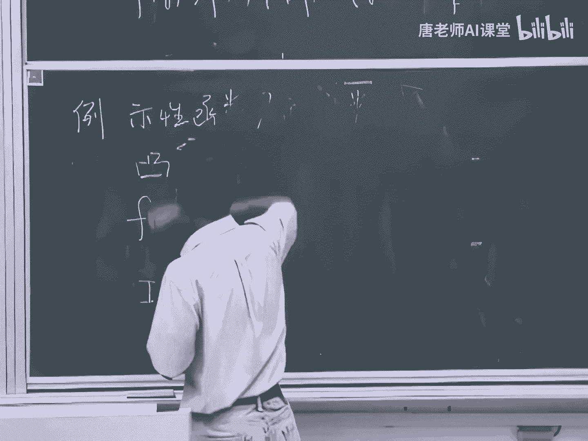

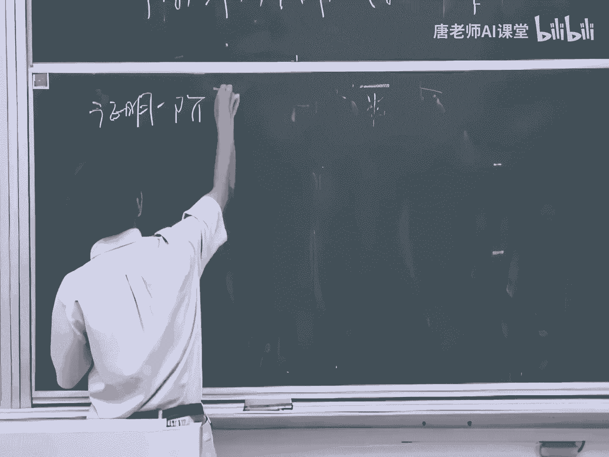

好我们讲这个。

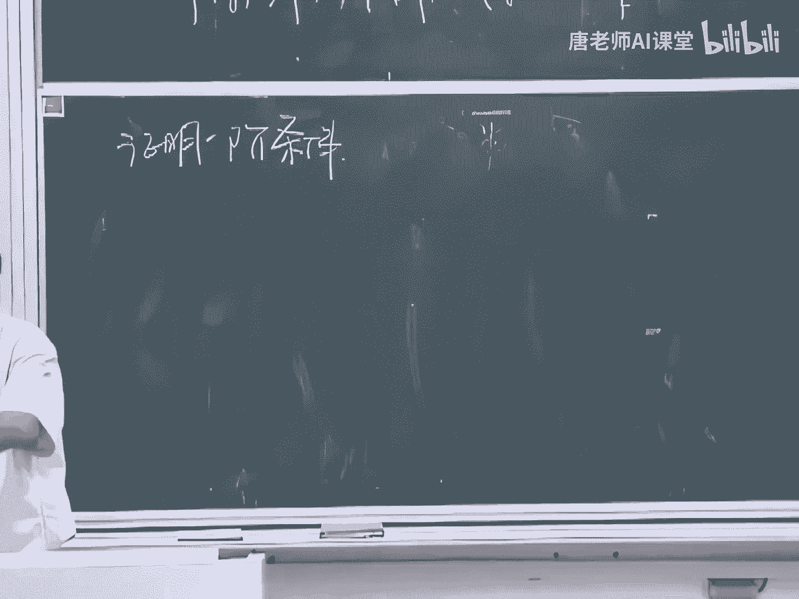

我们讲这证明，那不是为了去为难领或者是什么样的，我们我们讲这电影呢，实际上是有助于我们来理解这些问题，我们来理解这些定义，另外呢我觉得这也是个很好的一个训练，因为同学们每天都吃的很多，都睡了很多。

这个你你需要去去训练一下自己的大脑，因为要给自己大脑去做个体操对吧好，那我们的思路是这样的啊，就是我们今天呢首先证明一个情况，就是证明一个一维的情况，我们下节课呢我们会证明一下一个高位的情况。

就是如果当你的N取一的时候，我们怎么去证明这个事情，当N大于一的时候，我们又怎么去证明这个事情，好那么我们把这个一维情况，这个事情呢把它重新在，我们把这个之前那个表述啊，重新再写一遍。

好假设我那有个一维的这样一个可微函数，可微这个我就给忽略不写了，那么如果他是个凸函数的话，说明就等价于这个它的地域是个凸函数，同时呢要满足这样的条件，我就把刚刚那个不等式啊重新写了一遍。

但是呢他的这个梯度这一块，我可以可以简单的去写，我不用去写这个这个德尔塔F了，我可以直接去写一个F1撇就可以了，这是在一位情况下，我可以这么写的好，那么这个证明呢，因为是是一个是。

当且仅当这个它是这样一个表述，所以呢我们要证明两个方向的，就首先呢你从左边可以证明到右边，其次呢你从右边可以证明到左边，这也就是我们为什么这证明很长的原因，我们要把几种不同的情况都要说明一下。

好首先呢我们来证明一下这样一个正的方向，就是如果这个F是个凸函数的话，那么后面两个式子都一定要成立的，首先这个这条是非常容易满足的吧，啊就如果F是凸函数的话，那么它的定义域一定是个凸函数。

这个我们已经不用证明了，对吧好，但是我一定要说明一下，如果考试的时候啊，你一定要说明一下这件事情，为什么呢，因为如果你不说明的话，就证明你对于这个定义你没有真正去了解，好在这里我就不说了好。

那么下面呢我们就要用这个定义来证明一下，这个一阶条件，为了用这样一个定义一啊，我就必须要找两个点，在这个地域里面去找到两个点X和Y对吧，我愿意去找上两个点，那么既然他在地域是个突击的话。

那么我肯定可以找，肯定可以满足这个性质，我找一点这个点T呢是在0~1之间的，但是我让这个T不等于零，这个我说这个X加上T乘以Y减去X，也是在这个也是在这个地域里面的，这个满足不满足这一定满足吧对吧。

因为它实际上它就是个凸组合嘛，但这个凸组合是一个比较，是一个比较特别的一点凸组合，为什么呢，因为我不允许它在T等于零这点出现，我不让他组合到这个，不让他到这个X这点上来好，那么既然有了这样一个性质。

我们来看一下啊，我们又知道F是一个凸函数，所以我们来用这个定义，我们利用一下上面这个定义，很显然这个不等式是成立的，好这个没有问题吧，我只是把这个上面的定义重新再用了一遍吧，把这个C大给改成T了。

应该说把这个非大改成一点T了，好我把这个上面这个式子我们再稍微整理一下，我把这个式子稍微整理一下，我把它写成这样的形式，好我这么去做有没有问题没问题吧对吧，这个TFY我把它放在这个不等式的这个大的。

这边来这边来，然后这个这个TFX我给挪到这边来，然后再把这个给挪到这，这个保持不变了，这个很长的这一块，给把它仍然放到这个不等式的比较小的这边来，然后再把这个FX给挪到这了。

这个是一个只是把这个式子整理了一下，好那么这样一个直女有什么好处呢，你们想象一下我们可以怎么去做啊，好同学们应该知道这里，为什么我们要让这个T不等于零了对吧，因为既然这个T不等于零的话。

我就可以在这式子两边都除以T吗，好所以这个不等式人还是满足的，好，我们来看看这个式子和我们最终要证明的，这一块，它有哪些相似之处呢，还有一些不同之处呢，这个FY和FX都是在这里的。

那么这里呢这个Y减去X呢。

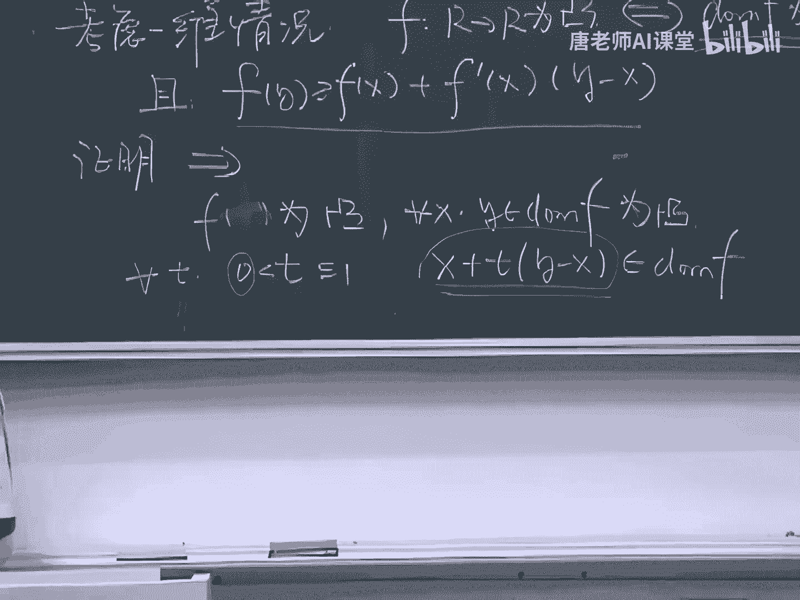

我好像在这里面见到了对吧，然后这个FFX的一阶导数呢，我这里暂时也还没见到，那么我怎么去把这两项把它给搞出来啊，怎么去把这两项给搞出来，很显然，这个这个式子是对于任意的T都是成立的，没错吧。

只要只要这个T是大于零的，都是成立的，那么我做这么一件事情，我在两边取个极限，T趋势趋近于零的，但是呢是T趋近于零的，真的这边的，也就是说啊，我在这边耍一个无赖，我取了一个极小极小极小的一个T。

但是呢我使得这个T还是要大于零，这是我可以做吧，好我把这两边都取极限，这因为这两项呢，这个FY和FX它是跟T没关系的，所以我不用去管它，那么这一块我取完极限之后，得到一个什么结果啊。

这块我等于T去取个极限的话，我可以得到什么结果啊，如果这个FX是口味的话，很显然我就会出现这个了吧，取完极限之后就这样的东西了，对不对，为什么这样呢，你做一个泰勒展开就完了对吧，你你把这一点。

因为这一点后面是一个官员，后面是个是个小量，是很小的一个量，所以呢你就把把中间这一点，相当于这个X去做一个它的展开，那么这样吧，你展开之后的结果把它移除之后，这个一阶一阶的地方出现了一个出现了一个T。

出了一个Y减X，另外还出现了这个这个关于这个X的一阶导数，所以就是这样一个式子了，所以我们在这个方向的证明就成立了对吧，这个思路理解吧，实际上很简单的，就是我们我们首先呢就用了一下，这个这个凸函数。

它的这样一个定义，就用了这个原始的定义，然后呢我们又用了一个小的技巧，这个技巧呢就是一个取极限，这技巧在很多时候都是非常有用的，就是如果啊，如果你的这个问题当中，出现了这样一个偏导的形式的话。

出现了这样一个导数的话，那么这样这样一种证明的技巧是非常有用的，好下面呢我们要证明另外一边证明，就是如果后面这两个条件满足，如果他的地域是突击，而且有这样一个不得不满足的话，那么这样一个F就是个凸起。

我们还是要用原来这个定义来证明，那我怎么去做呢，我就认真的去找上两点，在这个定义里面去找上两点，X和Y他们俩是不相等的，另外呢我再找一个C的，这个是取代零和一之间的，这次他可以取零了。

我把这两个点呢去做个凸组合，去构造一个新的点，叫做Z好，那么这个新的点呢，肯定也是属于这样一个定义域的，我们来看一看啊。

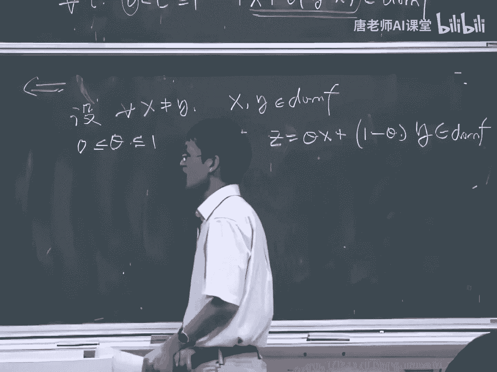

XYZ这三点都是在这个F的地域里面的，而且F是一个凸函数，那么我就可以去对他们这三个点来用一下，上面这样一个不等式了吧对吧，因为我现在哦不对不对啊，我现在还不能做这个事情，因为我不知道他这个图画书啊。

好那我怎么办呢，我就我就来看一看吧，应该说上面这个这个式子是满足的对吧。

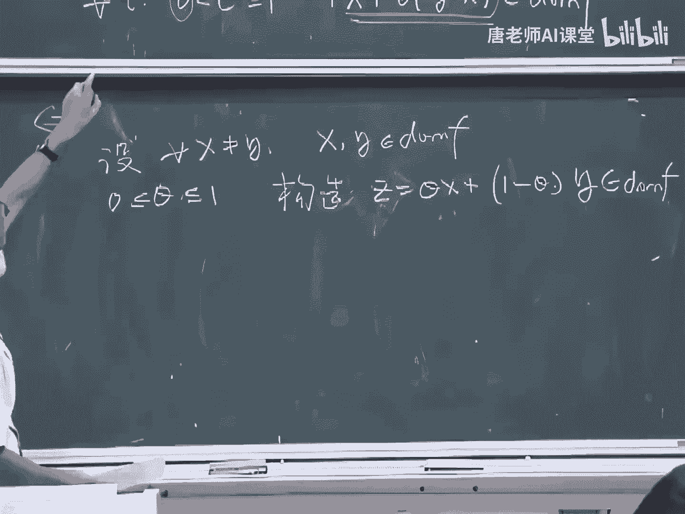

我们现在现在已经有的东西是，这个式子是满足的，那么我们就把这个三点用到这个式子上面来，这个没问题吧对吧，我实际上是把把里面那个X给换成，把里面那个Y换成X了，把这个X给换成Z了就可以了。

另外呢我把这个Y保持不变，再把里面的X换成Z，我也可以有同样的式子，好这两个式子都肯定都是成立的，好吧，那么现在呢我们要做一件事情，就是我们要尽量构造一个跟它相关的，一个一个东西。

跟着跟着上面这个不等式啊，相关的东西，那么怎么去做呢，我可以将它们去做一个图组合对吧，我将它去做完凸组合之后啊，我不就可以得到这个不等式的右边了吗，那我来试一试，看看会有什么样的东西啊。

我把这个乘以一个C的，把这个乘以一个一减去C的，然后我再把它们给加到一起去，看看会出现一个什么样的式子，好因为他们是加在一起的，所以呢这边这个不等式还是还是满足了对吧好，然后这上面的我乘以一个C的。

下面乘以一个一减去C的，那么这个地方是一个出现一个FC吧，然后后面这一块呢就要稍微复杂一点了，我们把后面这一块写成这样的形式，就是C大乘以，好后面这一块我可以写成这样的吧，那么这个结果是什么东西啊。

中间这项是什么东西啊，我们来看一看，我们把它稍微稍微展开一下啊，就是，就是C的X加上一减C的Y再减去Z，对不对，没错吧，因为我把这个C大C大Z和这个一减C大Z，把它给提出来了嘛。

好我们再来回顾一下这个什么叫Z啊，Z是他们的一个凸组合，所以这一点是等于零的对吧，这一项是等于零的，所以我就知道就是他们的凸组合，FX和FY的凸组合，它的值是要大于等于FZ的，XZ是什么呢，XZ是FC。

是它是X和Y的兔子和它的它的取值对吧，它的函数取值，我们看看实际上是不是，就是证明了上面这一点了对吧，没问题吧，也就是说只要你这个右边的地方是成立的，那么左边那个地方也是成立的，这个思路明白了好。

那么因为这一点呢，实际上是对于所有的X和Y都是成立的，这个等于所有的X和Y都是成立的，实际上你还可以去验证一下，如果当X等于Y的时候，当X等于Y的时候，会出现一个什么样的情况，好吧好。

那么今天呢我们就讲到这个这个一阶，这样一个一阶条件，它的这个在一位情况底下的证明，我们用的是这个定义一，那么下节课我们会讲到他的一个高危情况底下，怎么去证明呃，你们应该都会知道。

这个这个是用到这个定义二是吧，同学们，我们我们还没下课啊，啊那就是首先呢我们证明这个低位的情况，低位的情况呢就是我们要用的这个定义一，高维的情况呢，我们就会用到这个定义二了。

因为D2是把这个是把这个高危情况转换成，比较简单的低位情况的好。