# 【比刷剧还爽！】这太完整了！量化交易和python金融分析实战课程，全程干货无废话 入门到精通一步到位！（数据挖掘分析／大数据／可视化／投资／金融／股票／算法） - P70：74. 11.12.凸函数定义2，常见例函数的凸性（2）(Av526664194,P11) - AI算法-溜溜 - BV1iC411n7XN

好我们接着讲啊，好那么对于这个FX这个函数啊，其实我这里我写错一个东西，为什么就是这个函数呢，它不只是对于这个E负X，它是个凸函数，它对于这个E正X它也是个凸函数，或者讲的更明确一点。

就是我选择任意的一个A，这个A是一个任意的一个实数，那么这个函数都一定是个凸函数，好那么对于这样一个任意的A的话，你就没法就以每个去画图去验证了吧，好所以呢我们就可以可以来看看。

就是能不能用这个二阶条件去算一下，好首先呢我们来算一下它的一阶导数，是这样的东西，然后呢我们再来算一下它的二阶导数，我们来看一看啊，对于Z的X，对于Z的A这个数一定是，是不是都是要大于等于零呢对吧。

一定是要大于等于零呢，为什么呢，因为这边是一个指数嘛，这里我是在求个指数嘛，那么前面这块这个A平方呢又一定是一个，又一定是个大于等于等于零的数，所以呢这个指数函数的二阶偏导，一定是大于等于零的。

所以这个函数一定是一个凸函数，好那么讲完这个指数函数之后呢，我们要看一个跟指数函数长得很像的一个函数，叫做幂函数，也就是说对于任意一个实数A，我第一个幂函数就是XA次方，但这时候这个这个S就有讲究了。

这个S就不再是任意的实数了，这S1定要是个正数，这个你们都知道为什么吧对吧，因为如果它不是正数的时候啊，可能说你在你在计算的时候，可能会发生一些问题的，比如说如果当这个A等于12。

那么如果当X是个负数的话，这会出现什么结果呢，那么你会出来一个出来一个负数出来，对不对对吧，我们现在考虑问题啊，我们一般都在这个实数域里面去考虑问题，我们不希望把这个问题搞得很复杂。

搞到这个复数域里面去啊，所以呢我们要求这个X1定要是大于零的好，那么这样一个函数它是一个，它是不是一个凸函数呢，我们来算算看，对于这个幂函数的求导，你们应该都还记得很清楚吧，好这是对于他去求个一阶偏导。

那么求完一阶偏导之后呢，我们再去求个二阶偏导，好，那么他的二阶偏导在什么情况下，是大于等于零的呢，我们可以分成两种情况去讨论，对不对，好在有些情况底下呢，它是大于等于零的，在有些情况下它是小于等于零的。

那如果A在如果A是小于等于零，或者是A大于等于一的话，那么它的二阶偏导一定是一定是大于等于零的，对吧，一定是这样的吧，好那反之呢，就是如果这个A在0~1之间，如果A在0~1之间呢。

那么这个函数就它的二阶偏导，就是小于等于零的，也就是说啊，当A满足一定条件的时候，它是凸函数，在另外在A满足另外一些条件的时候，它又是凹函数了，所以这个函数既可以是凸的，又可以是凹的，那么我们来看看啊。

有两点是比较特殊的，就是它同时是凸和凹的，如果当A等于一，或者当A等于零的时候，他即使出了也是凹的，这是什么情况呢，当A等于一的时候，它是什么函数啊，A等于一的时候，它就是一个仿射函数了对吧。

这是我们之前讲过的这个仿射函数，它既是出的，又是凹的，那么如果当A等于零的时候呢，它就是个常数了，常数实际上也是个线性，或者说也是个法式的函数，所以它既是图的，又是凹的好，那么讲完了这样一个幂函数之后。

我们再把这个问题搞得稍微复杂一点，我们来讨论一下这个绝对值的幂函数，就是在求这个幂函数的时候，因为我们现在考虑的是这个。

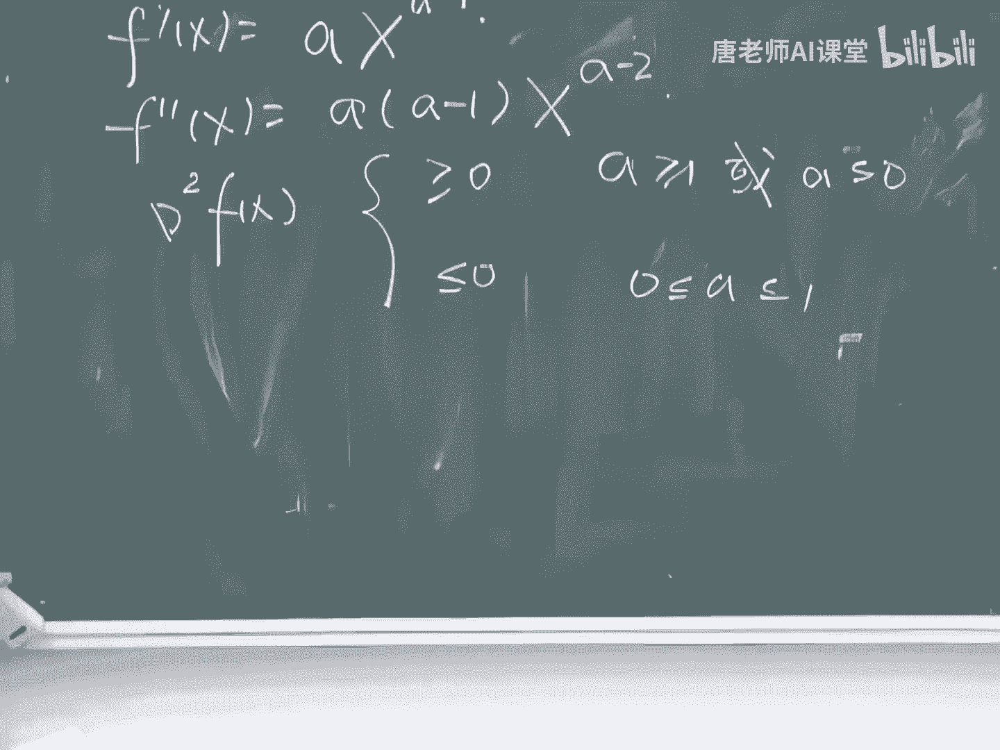

这个X是一定要是正的实数对吧，那我们就觉得这个，你如果只讨论这个正的实数啊，有时候就很麻烦，那么你就我们还是讨论一下，就是扩展到整个的实数空间吧，那么你既然要扩展到整个实数空间。

你又不希望他求得的函数值是个负数，那么你就必须要去对这个S去求下绝对值好，所以我们现在来讨论一下这个绝对值的幂函数，好它的定义呢是我任意的去找个P，对这个P呢实际上也是有一些限制的，比如说呢。

这个如果当这个S是属于整个实数域的时候，这个P实际上是不是就不能等于一了对吧，为什么呢，就是零的这个一次方，你还是自己需要去去，你需要自己去定义一下才行，所以这时候呢我对这个P实际上是有些讲究的。

但是呢我们这里就先不详细详细的去讨论了，好那么对于这个函数的话，我们能不能去用这样一个二阶条件去做啊，能不能去用二阶条件去做，我们一定要记住，就是这个二阶条件呢它在什么情况下是有用的。

一定要是二阶可微的对吧，但是这个函数到底是不是二接口的呢，他是不是二阶可微的呢，对有同学讲的对，就是对于这种情况的话，你可以回答是可能是也可能不是对吧，好那么既然它可能是也可能不是的话。

那么我怎么去做呢，我不妨就去求他一下吧，好不好，如果我能求出来的话，那么它就是了，求不出来，求不出来的话，那么它就不是了，好现在我就来应求一下，先不管37215，先求一下，看看行不行好吧。

这个X它的一阶偏导啊，实际上我要分两种情况的，就是分成当这个X大于零和X小于零，的两种不同的情况，那么如果当X大于等于零的时候，而且当你的这个P取值又是比较合适的时候，就比如说这个这个P啊。

你不能取成这个一啊，你也不能取成这个零对吧，在这种情况之下呢，它的这个它的一阶分导师可以求出来了，这个很简单吧，好，那么如果当这个如果当这个X是小于零的情况，底下也很简单，好这个没有问题吧。

好大家一定要记住，这时候我们实际上是对于这个P和X，是有一定的要求的，确切说我们是对P有要求的对吧，有些P是不能取的，那么求完一阶偏导之后呢，我们再去求一下这个二阶偏导。

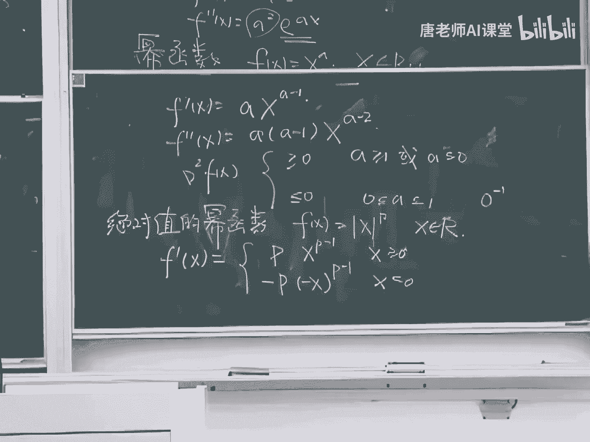

好那么求完一阶偏导之后啊，这个二阶偏导实际上就是比较好求了，很简单了，因为这中间已经没有，这个已经没有这个X的绝对值出现了，好那么现在我们来看看这个式子，它有它有些什么样的性质，我们来看一看啊。

在哪些情况下，这样一个函数，它的二阶偏导师一定是大于等于零的呢，在哪些情况底下，在什么样的情况下，它的二级分数一定是大于等于零的，可以想清楚，这个P1定要大于等于一，对不对，这个P1定要大于等于一。

或者确切的说当这个P大于等于一的时候啊，这个东西一定是要大于等于零，但是啊我们要一定要记住一点，就是这个P是不能等于一的，P1定是不能等于一的，这看着好像P是看起来好像这个P是等于一，是没问题的对吧。

但实际上是有问题的，为什么呢，因为当P等于一的时候啊，这个X绝对值它并不是一个可导的函数，对不对对吧，它不光是二阶不可导，它一阶都不可导，对不对，所以也就是说，实际上也就是在这个P大于一的时候。

它的这样一个值一定要是，他这样一个值一定是大于等于零的，但是呢我们也还是要把一些起点给去掉，比如说这个P是不能等于P，P能不能等于二呢，P能不能等于二，P可以等于二对吧，三三也没问题，对不对，为什么呢。

就是因为如果当你等于二的时候啊，这个函数就已经变成一个光滑的函数了对吧，当它等于三的时候呢，这个函数仍然也是光光滑的函数，所以也就是说在P大于一的时候，它实际上已经没有起点了。

这个你上面这个所有的求导全是正确的，好那么我们再换个角度去考虑，就是当这个P等于一的时候，虽然我们不能用这个二阶条件，但是这个函数是不是一个凸函数呢，当P等于一的时候，这个X绝对值这个函数。

实际上是这个函数，这个这个这个尖角的这个函数，这函数它一定是个凸函数对吧，为什么呢，因为你在上面任意的去找上两点，它的连线一定是比这个函数要高的，所以呢实际上这个式子是在P等于一的时候，它也是成立的。

它也是没有问题的，所以在说明这样一件简单的问题的时候，在说明这样一个简单的事情的时候，实际上我们用了两个不同的定义，当P大于一的时候呢，我用的是这个二级条件，这个D当P等于一的时候呢。

我用的是这样一个最原始的D，所以也就是说我们我们就可以有个结论，就是这样一个绝对值的幂函数，在P大于等于一的时候，它一定是一个凸函数，那么在P小于一的时候，它是什么样的函数呢，在P小于的时候。

那么它是不是一个凹函数呢，我们想想在P小于一的时候，它是不是一个凹函数，是还是不是，我们来举一个比较特别的情况，就是当P等于零的时候，P等于零的时候，它是什么样的函数，在P等于零的时候。

如果你D0的零次方是等于零的话，呃呃抱歉是等于一的话，那么这个函数实际上就是既是图的，又是凹的，对吧好，那么我再来看看一个另外一个比较特别的情况，就是当P等于12的时候。

如果这个这个P啊是等于12的时候，他是什么样的一个情况，首先呢我把这个上面这一块把它给画一下，就是这个X大于等于零，这块给画一下，你对于X去开根号的话，它的函数应该是这样形状对吧，好。

这一块呢你只是只看这一块的话，它是一个凹函数对吧，没问题吧，另外一部分呢它是对称的一段这个函数，如果你只看这个左边这一块的话，它也是高函数好，但是呢它们合在一起，它是凸的还是凹的呢，它既不是凸的。

又不是凹的，这个函数既不是凸的，又不是凹的对吧，它既不是一个正方的铁锅，又不是一个倒着放的铁锅，他这个铁锅被人给打断了，给放成这样的形状了，好，也就是说对于对于这样一个绝对值的幂函数呢。

它在P小于一的情况下，我们是没有这样一个统一的结论的，我们是需要对于不同的P分别的去讨论的，但是他在这个P大于等于一的情况下，一定是一个凸函数，好那么下面我们来讨论一个函数叫做对数函数，就是对很简单。

就是对于这个S去取个log，但是X呢是一定要是一个正的实数好，这个函数大家马上就能想象出来了，这个函数一定是一个一定是个什么函数，一定是个凹函数好，那么下面呢我们还是用这个二阶条件去算一下。

首先呢我去对它去求个一阶偏导，它是等于X分之一的，下面呢我再去求个二阶偏导，它等于X平方分之一的，那么这个值一定是，一定是小于零的吧对吧，所以呢它不光是一个凹函数，它还是一个严格凹的函数。

这个函数实际上是一个严格凹的函数，好这个对数函数这个函数是个比较简单的函数，但是呢呃实际上在很多问题里面都能用，都能用得上，那么下面我们来讨论一个，跟对数函数长得很像的一个函数，就是它有一定关系的函数。

这个函数呢我相信这个六级的同学啊，可能见得比较多，这个函数叫做叫做富商，好商这个函数你们都知道吧，对吧好，那么富商呢就是对这个商去求求个反了，这个富商这个函数是这么定义的。

这函数实际上就是定义称FX等于X乘以log x，是X和log x相乘，这个函数就定义为负商好，那么这个函数它是凸的还是凹的呢，我们来算一下好吧，如果你要直接对它画个图的话，这个并不是非常好画的。

首先呢我对他去求个一阶偏导，我求的结果是是log x加一对吧，好那我得再带他去求个二阶偏导，等于什么呢，很简单吧，就等于X分之一了，那么它一定是一个大于零的数，所以呢这个函数它不光是一个凸函数。

它还是个严格凸的函数，富商这个函数它是个严格凸的函数，我们来看一看啊，就是这个对数函数是凹函数，凹函数的凹函数的，实际上你可以想象成这个样子的对吧，他这样这样过来的。

但是呢我现在呢在他的左边乘上一个身上，一个很强的一个数，就是X的一次方X这样的东西，那么他就硬把这个硬把这个曲线呢给掰过来了，就把这个曲线从一个从一个凹的两个函数，给掰成一个凸的函数了。

所以这就是乘上X之后就会有这么大的不同，好那么关于这个富商这个函数呢，我们还会讲一讲，就是呃有的同学可能听过一个词，听过一个词叫做极大伤对吧，吉大商这个词你们听说过吧。

在很多的这个在很多信息论的问题里面呢，我们都会要把某个商去极大化，去极大化某个商，那么极大化一个商的话，相当于是极小化一个富商，对不对对吧好，那么为什么那那帮做心虚的人要极大化一个伤。

他为什么不去极小化一个伤呢，他为什么要极小化一个商，为什么要极大化一个伤，那就是因为富商这个函数它是个凸函数，富商这个函数是个凸函数，这是我们刚刚证明那个东西对吧好，如果你极小化一个凸函数的话。

这个问题是个容易的问题，也就是说你极大化易伤这个问题，是个容易的问题，所以我们看这个做信息的能量，他们是非常会偷工减料的，他们绝对不会讲去什么极小化商这样一个事情，他们绝对不会做的。

他们只会做这个极大化商这个事情好，所以我所以我们来看看，就是实际上在学很多问题的时候啊，你可以你可以去想象一下，就是你们看这个教科书上这样一些，比如说他们给出这样一些定理呀。

给出这样一个这样这样一些式子，看起来好像显得很神乎其神的样子，你可能想不通他为什么要这么去做，但是呢你通过去学习这样一些课程啊，你会发现他们为什么要这么去做，的一部分原因呢。

就是因为这些这些问题真的应该这么去做，的确应该这么去做对吧，但是第二部分原因呢，是因为只有这么去做才是容易的，你换个方法呢，你你就做不了了，所以我们看这个这个吉他商呢，这个就是个很典型的一个例子。

我们通过学习这个图优化，你就会知道为什么我们要吉大化一个商，好好我们上面讲的一些呢都是可以显示的，写出表达式的这样一些函数，一般呢我们都是用这个二阶条件去解决的，在下面呢我们讲的是一类函数。

是某一类函数，这种函数叫做范数。

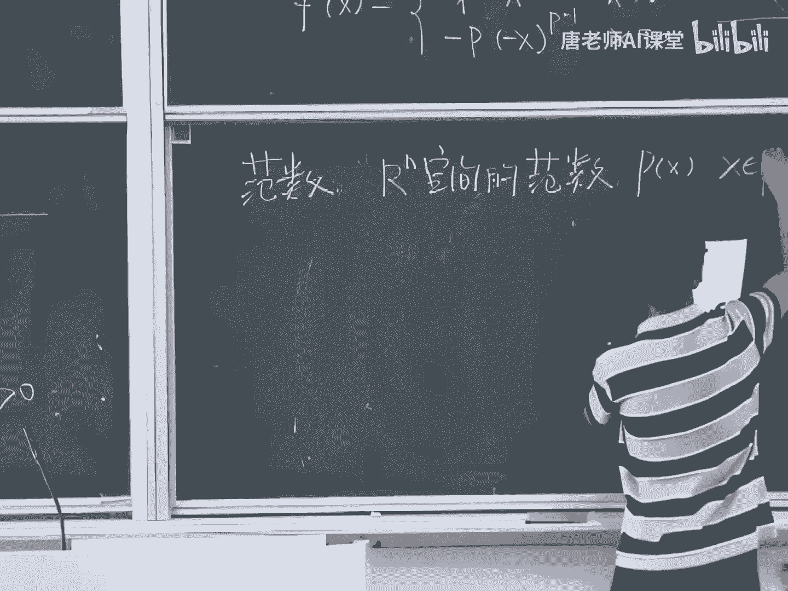

我定义这样一个范数叫做PX好。

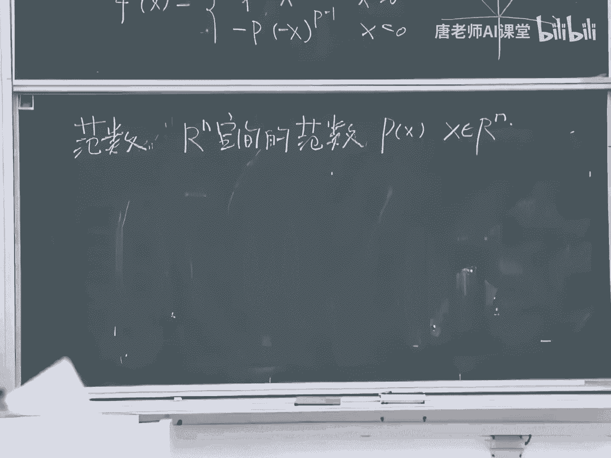

那么什么东西叫数呢，什么东西叫做数，你们以前的这个线性代数有没有学过。

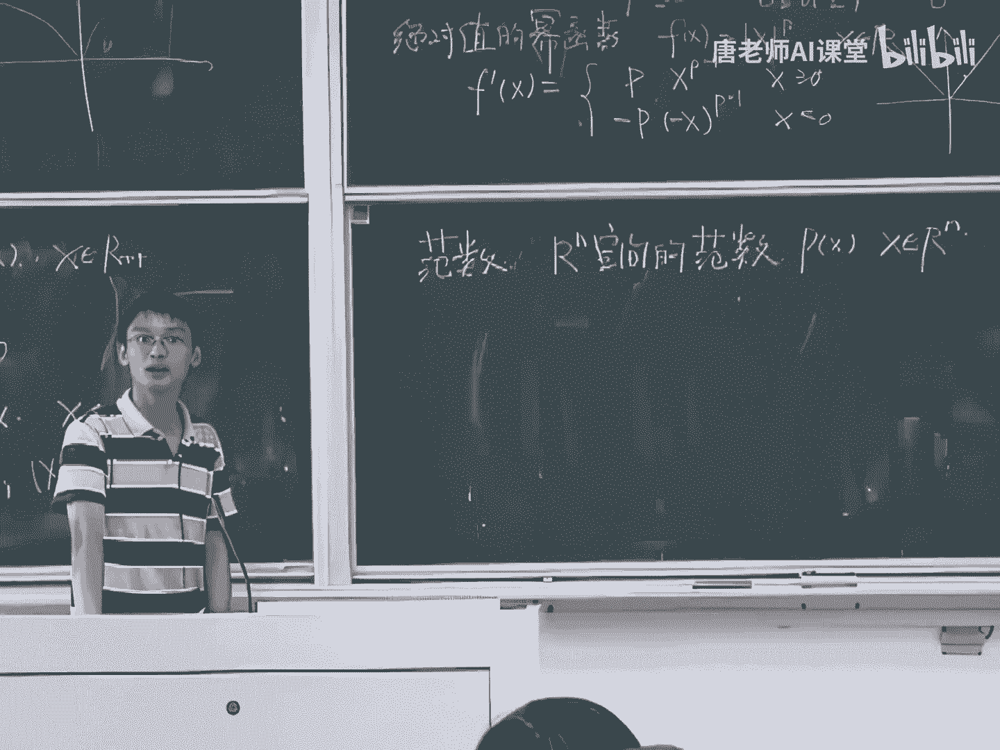

学过吧，范数一定要满足三个性质，如果你满，如果你满足三个性质的话，如果你这样一个函数满足三个性质的话，那么这个函数就叫做范数了，什么样的三个性质呢，好第一个性质就是对于任意的一个A。

对于人的这样一个实数A啊，然后对于任意的XPAX是等于A的，绝对值乘以PX，这是一个这种缩放的性质对吧，这个范畴具有这个缩放的性质，那么第二个呢很简单，就是一个三角不等式了。

这个PX加Y呢是一定要小于等于PX，加上PY的，这个实际上就是个三角不等式，第三个是什么意思呢，就是如果这个PS是等于零的话，那么它等价于这个X就等于零，也就是说如果如果你是个负数的话。

那么这个范数什么时候是取值为零呢，只有在一个点是取值为零的，就在原点好，那么满足这三个性质性质的，这个函数就叫做范数，那么我们来看看这个函数到底是凸的还是凹的，我们能不能用二级条件来做，不能了吧对吧。

因为这时候你连个函数都没有吗，你怎么去对他去求二阶偏导呢，所以我们来看看，就是我们还是会回归到比较原始的定义，我们来用一下这个第一，我们用第一个定义来来证明一下，那第一就很简单了。

就是我首先呢在这个N维空间里面，去任意的选择两点X和Y，因为它的定义域范数，定义域一定要是整个空间的，我在找一个C的这个C大是在0~1之间的，我来看一看这个我来求一下这个范数。

它的我对于这个XY这两点去做个凸组合，我来看看这个凸组合它的范数是什么样子的，好，这个实际上就是，我首先对XY两点去做了一个凸组合，然后再去求它的范数，那么我们看到这个式子。

自然就会想到我们得去用下三角不等式对吧。

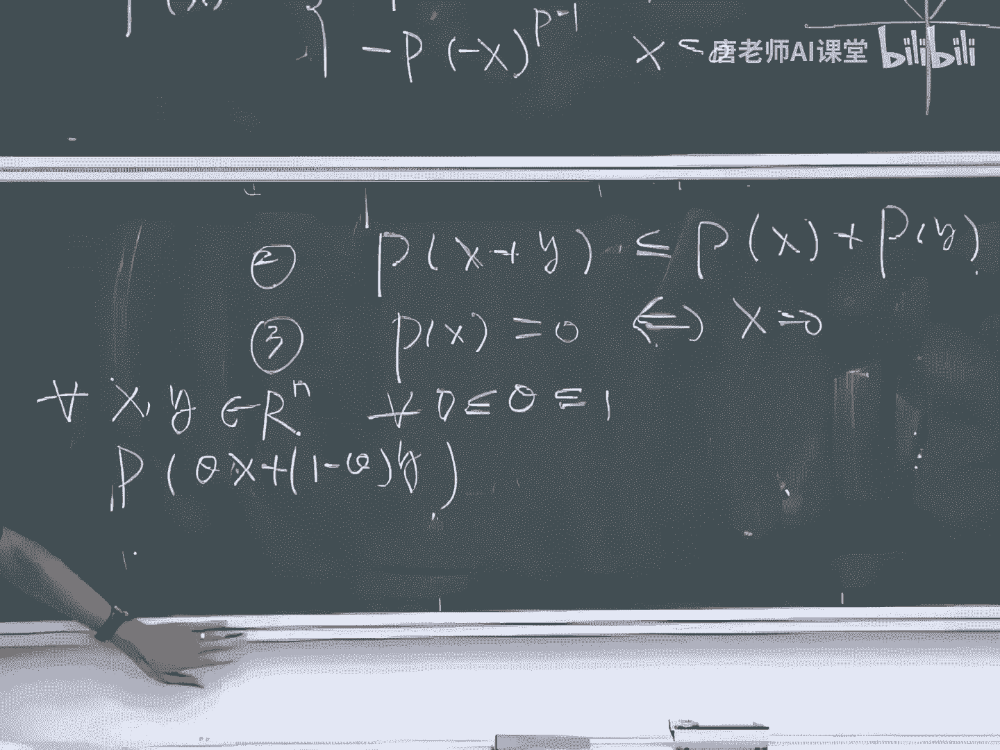

对不对，很现成的嘛，这个没有问题吧，对吧好，那么有用完这个三角不等式之后呢，我们把眼睛再朝上面看一看，我们还可以去用一下这个这个定义，对吧好，那么这时候这个C大和一点C大，一定是大于等于零的。

好所以呢我一定是有这样一个不等式存在的，所以我一定是有这样一个不等式存在的好，那么我们看，那么我们证明了什么事情啊，我们是不是就已经证明了，这个范数一定是一个凸函数啊，对吧没问题吧。

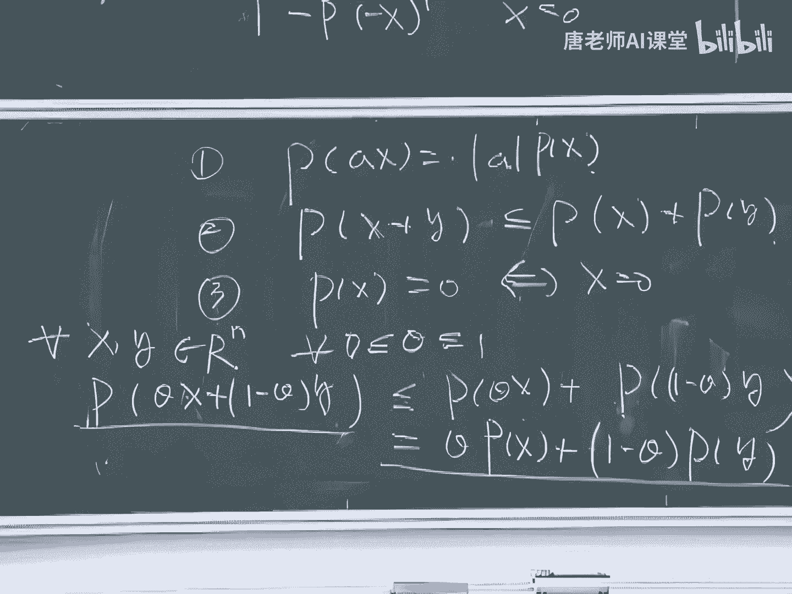

好那么讲完这个范畴之后呢，呃我们再来补充一点，就是现在比较流行的一个东西叫零范数，你们有没有人听说过这个词跟什么压缩传感啊，这些概念有关系的，我求一个向量的零范数，听说过这个概念吗，没有听说过吧，好。

那么我们来简单介绍一下什么东西叫做零范数。

好我们讲了一个向量X它是个N维的这个向量，它的零分数是什么东西呢，就是我把它中间的这个非零元素的个数，给统计一下，就是它的非零元素的数目的总和，好那么这个函数是不是一个凸函数。

这样的函数是不是一个凸函数，好有同学讲，就是我们已经讲过这个范数是凸函数了，那么零分数呢就也一定是凸函数好，那么这就好比一个一个那种，我们讲了一个很老的一个命题，就是白马非马这个命题对吧。

就是白马实际上真的有可能是飞马的，为什么呢，就是因为零番数它真的不是一个番数，零分数不是一个凸函数啊，如果对这个压缩传感这个方向比较熟悉的同学，就会知道，这是为什么，我们不去做这个零番数的优化问题啊。

就是因为零番数约合力太难了，它不是极小化一个零番数，它并不是去极小化一个凸函数，它是个很难的问题，所以我们要用这个一范数，这样一个这样一个优化问题来代替，这个可能有些同学不是很了解。

但是你们听听就可以了，那么现在我们来讲一讲，就是为什么这个这个零范数它不是一个图，它不是一个范数，它也不是一个凸函数，我们来看一看，我们我们还是来举个最简单的例子啊，我们来考虑这个X是一个实数。

我们来看看这个零分数。

我们按照这个零范数定义，我们把这个函数的曲线给画出来。

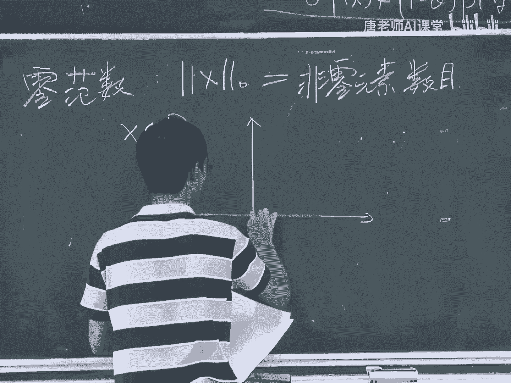

很显然就是在X等于零的时候啊，它是它的取值是零对吧，在X不等于零的时候，它的取值都是它的取值都是一，我们都还记得上节课我们讲过这个函数的扩展，凸函数的扩展了对吧，所以这个函数它一定不是个图函数嘛。

对不对对吧，为什么呢，就是你比如说你从中间去找上这样两点，做一条连线，那么这个连线一定是比这个，一定是比这个函数值要低的，所以这个函数肯定不是个凸函数了，好那么我们看啊，就是有个问题。

就是为什么这个零函数我们讲它叫范数，但是它为什么又不是一个凸函数呢，那一定是某个地方出了问题对吧，也就是说他一定是不会满足这个范数的定义的。

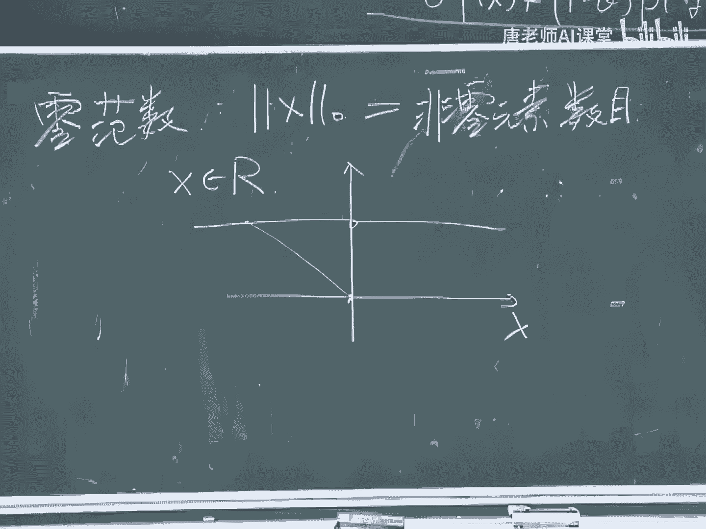

如果他要满足范数的三个定义的话，那么这个函数一定是个凸函数对吧好，但是他现在他既然不是一个图画式的话，那么就说明他一定是不满足发出某一个定义的，我们来看看是哪里出了问题啊，我们来对比一下。

看看到底是什么地方出了问题，第一个第二个还是第三个，第三个没有问题对吧，至少对于一位情况是没有问题，第二个有没有问题呢，好第二个好像也没有什么问题对吧，那第一个就有问题了，那第一个什么地方出了问题啊。

嗯我把这个比如说我举个例子吧，我把这个X我给取值一，可以吧，好X取值一的话，那么一的零分数是等于一的，好那么我把A给取成二好，那么这个我们看看这个2×1，它里面是什么东西的，也是等于一的。

所以也就是说上面第一个等式啊是不成立的，这个零范数是不满足这样一个缩放的性质，它是完全不满足这样一个缩放的性质，所以本质上它不是一个范数，我们虽然看起来，它好像这个里面带了番薯这个词对吧，就这个意思。

好，下面我们再来考虑一个，它不一定可以求导的一个函数，这个函数叫做极大值的函数，好这样的极大值函数是什么样的呢，就是这个X是一个N维的向量，那么它的取值是什么东西啊，也就是FX是等于这个向量的N维中间。

这些元素的最大值，我在这个N维中间我去找一下，把它最大的一个值给找到，那么它就是我的函数值了，好那么这个函数啊它是不是一个凸函数呢，我们来算一下，那么既然他是一个，它是一个没法求导的这样一个函数。

那么我们就得想办法去用别的定义了，对吧好，我们来看看啊，最简单的定义呢还是用这个定义一，首先呢我还是来取上两点X和Y，然后再取上一个THEA，是在0~1之间的，我们来求一求，我们首先对这两点。

对于XY这两点去做个凸组合，去求它的函数值，看看是什么样子的，那么很简单就是，我对于他的这样一个图组合，我可以把它的每个分量给写出来，就他的第I位的分量给写出来，那么div的分量是什么东西呢。

就等于C的XI加上一减C的YI，我要在这在这N个中间去选择一个最大的值，作为我的函数值，这是我完全按照这个极大值函数定义来的好，那么这个式子我可以稍微改一下，它等于什么东西呢。

抱歉对方应该是小于等于这个数，小于等于什么东西呢，因为这里有个极大的吧，我们看它是小于等于什么东西呢，那很简单，就是我把这个东西啊把它给分成两半，把这个C的XI加上一减C的YI，我把它分成两半。

你讲这是什么意思呢，就是我我这边求积大呢，我是把把它们求完和之后再来求积大，那么它一定是一定是什么，一定是小于等于，我把它给分拆开，分拆开来求积大，然后再来求和对吧，这个可以理解吧，很简单的一个思路啊。

好，那么又因为这个C大和这个一点C大，都是大于等于零的数，所以呢我可以写出来这样的不等式好，那么这个不等式是实际上是什么东西啊，对吧，这证明很简单，就用一下它的这样一个定义，再用一下这个不等式就结束了。

好，所以这样一个极大值函数它一定是一个凸函数，这个函数一定是一个一定是个凸函数，因为有这样一个小于等于这个式子存在吗，好那么有些同学呢可能也听说过一个一个问题，叫做叫做叫做极大极小问题。

或者叫极小极大问题对吧，这个是这个在比如说在这个在计算，计算机这个领域里面经常出现这个问题，那我们为什么要求这个极小极大问题呢，所谓极小极大问题啊，就是要极小化某个极大值函数。

它的函数值这个问题叫做极小极大问题，就是首先求个求个极大值，再对这个极大值去求个极小值，那么这个函数我们为什么喜欢用，喜欢做这样一个问题呢，就是因为这个问题实际上也是一个凸问题，那这个问题啊。

一个问题如果可以形成这种形式的话，我们把通常叫做这个叫做极大极小问题，或者叫极小极大问题，那么这个问题呢，如果这个F的形式是比较好的话，那么它就是一个凸问题，所以我们就可以想象一下。

就是为什么我们会做这样一些问题呢，就是因为这些问题它有一些很好的性质，它是可以解的，它是可以保证这个在多项式多项式的时间之内，我们是可以求出来的，好那么其他值这个函数啊虽然是个凸函数。

但是呢它有一个很不好的性质，就是它是它是不可导的，它是不可求不可以求导的，对吧好，那么这种函数呢虽然是个凸函数，但是他最后做的时候，你去优化的时候很不好优化，那么怎么办呢，就是很多时候我们就会想办法。

对这样一些不可导的函数，去做它的这种可导的近似，去做个逼近，这个B呢叫做解析分析，好那么对于这个极大值函数呢，我可以去对它去做一个这样的一个解析。

逼近它的解析笔记呢有一个名字叫做log some map，就是首先呢我给首先我给求下和求下，求下和之后呢，我再给求个log这个函数，这个我不知道怎么翻译啊，所以我就直接这么给写出来了。

好我们来看看这个函数是什么样子的，这个函数实际上是这样的，就是首先呢我对这个X的每个分量呢，我去我去求一个这种指数，求它的指数函数，然后我再把这个每个分量，这样一个指数函数给加到一块去，加完之后呢。

我再去求个log，这个看起来很复杂对吧，我总共做了三步好，但是呢这个函数呢，首先我们讲这个函数它是个可微的函数，这函数一定是个二阶可导的函数吧对吧，因为你可以任意的大家求导嘛。

好那么其次呢它有一个很好的性质，就是它是这个函数，它的解析毕竟怎么说呢，这个函数一定满足这个性质，这个FX一定满足这个性质，它一定是大于等于X1到SN中间的最大值，首先要满足这样一个性质。

其实呢他一定是要小于等于这个最大值，再加上log n，这很生气对吧，也就是说呢我如果有了这样一个函数的话，我就可以用它来近似这样一个这个，极大值函数了，那么近似误差是多大呢。

近似的误差最大可能是log n这么大，它的下界就是这个极大值函数，它的上界呢就是极大值函数，加上老板，你的N的倍数越高的话，那么我的计算误差有可能就越大，那么为什么是这样的，你们自己下去算好吧。

这个非常简单的好，那么现在我们关心的问题是，这个函数到底是不是一个凸函数好，很显然这个函数应该也是个凸函数，对不对对吧，为什么呢，因为如果它不是一个凸函数的话，我干嘛要费那劲去做一个这种解析的。

必经啊对吧，所以肯定是个凸的嘛，但是这是这是一个逻辑上的解释，但是我们不能这么去想对吧，既然它是一个解析函数的话，所以呢我们就可以用这个二阶条件了，好，现在我们是对于这样一个。

对于对于这样一个高阶的这样一个函数，对于这种高维的函数去去求它的二阶。

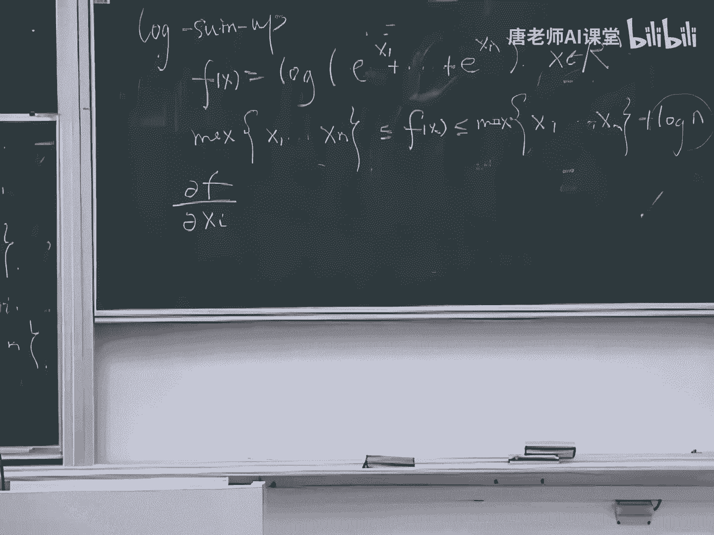

二阶的这个还算矩阵，那么首先呢我去对它去求一个一阶的偏导，我对于每个元素去求个一阶偏导，好这个很简单吧，没问题对吧，那么下面我们来求一下它的二阶偏导，这个二阶偏导求出来啊，实际上要稍微复杂一点。

为什么呢，就是因为如果当这个我现在求二阶偏导的时候，实际上要满足这样的要求，就是手段，二次偏导是什么东西呢，我呢是要求这样一个HS矩阵，这个HS矩阵，这海森矩阵呢它是它是一个这个矩阵，它的第I行。

第J列的元素呢叫做叫做HII，J是这样一个是这样一个标量，它是怎么是什么意思，就是这个HIJ是怎么算的呢，就是首先呢对于这个I呀去求个一阶偏导，那么对I求完一阶偏导之后啊，他要等于J再去求个一阶偏导。

就是对于上面这个一阶偏导，我再去求个一阶偏导，但是但是对于J的好，那么中间就有个问题啊，就是当I等于J的时候，和I不等于J的时候，我求一阶偏导的结果是不一样的，对不对。

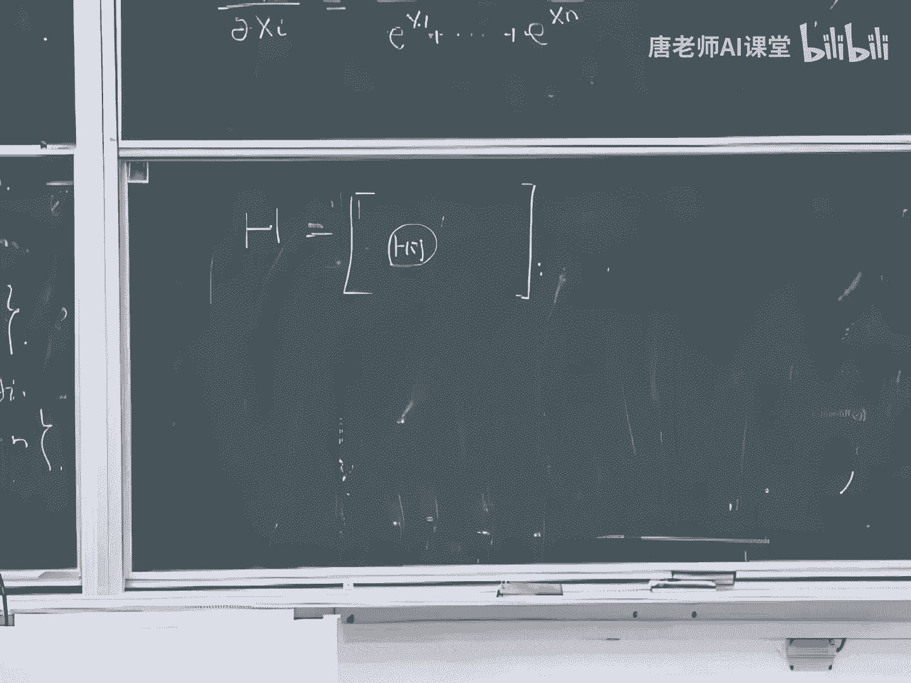

为什么呢，当J等于I的时候，和J不等于I的时候有什么区别，就是上面可能也会有这个这个X，也也会有这个SI对象，对这个就是唯一的区别，所以我们要分成两种形式去求，就分成分成两种不同情况去求。

好那么当I不等于J的时候呢，那么这个分母就跟基因没有关系了，所以我这个分子就跟基因没有关系了，所以我只用对于这个分母去考虑就完了，好这样一个求导没有问题吧。

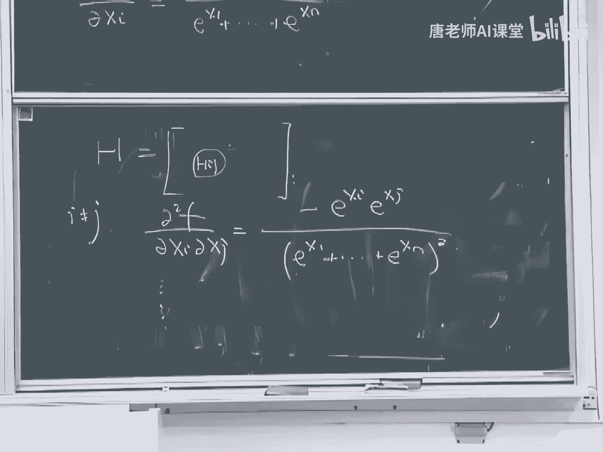

对吧好，那么另外如果当I等于J的时候，我会有什么结果，这个式子写的就麻烦多了，因为我对于分子和分母我都要去求一下，但没关系，我来替你们写出来好吧，好那么我会得到这样一个式子，我们看这个携带很麻烦对吧。

这事写得非常麻烦，所以呢我干脆就定义一个向量好了，我定一个向量能够让我写出来，这个结果比较简单一点，我怎么去定义呢，我定义这样一个向量。

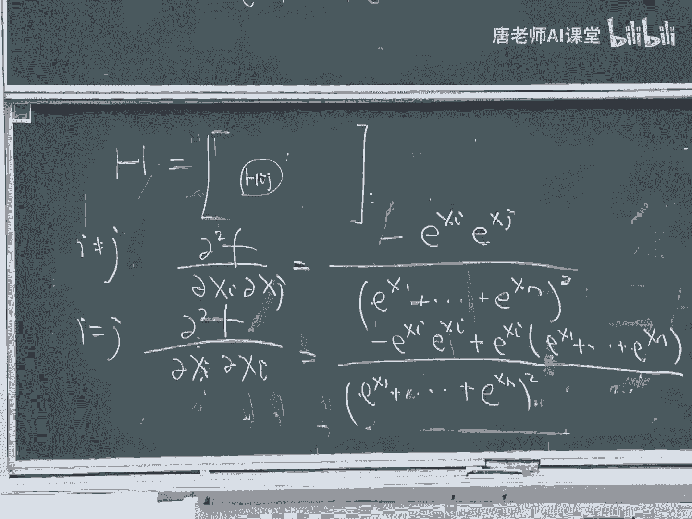

我定义这个列向量，我对于这样一个列向量，它是对于这个X中间的镁元素啊，我去对它求个指数，好也就是对于每个元素我就求个指数好，那么定义完这个厉害了之后啊，我们看这个表达式实际上就会比较简单了。

这个表达式实际上现在是非常简单的，为什么呢，因为这个这个分母是什么呢，这分母是这个列向量，它的二模对吧，它二模的平方对不对，没问题吧，好那么这个分母呢也是这样的，那么这边呢这块是什么东西呢，这是个求和。

所以不是无穷范数啊，这个求和你可以把它写成这样一个这个行向量，这个行向量中的每个元素全是一，这个E和Z的内积是这样一个求和，任何一个求和你都可以写成这样的形式好，那么定义完这个向量之后。

我就可以把这个黑森矩阵给写出来了，我可以把矩阵给写出来，好那个海森矩阵中间呢它有一个共同的一个项，在这个海森矩阵中间呢，它这个分母这一项一定是共同的。

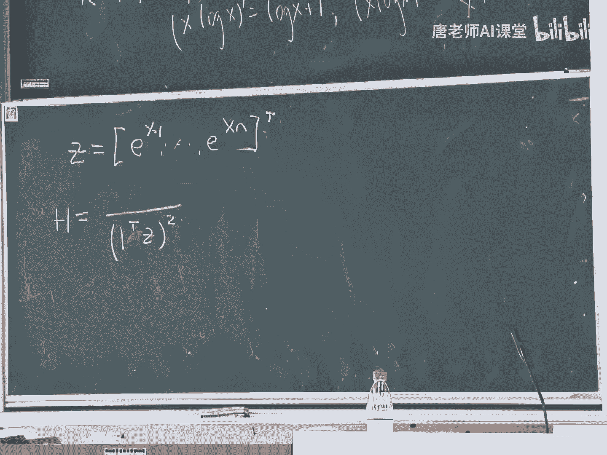

所以呢我就干脆把这个分母给取出来，这分母取出来之后呢，实际上就是就是这样的东西，对吧哟，我这里讲错了一个东西啊，这个实际上不是他的耳膜啊对吧，这个不是他的二模对吧。

实际上应该就是这个这个这个标量它的平方嘛，对吧，好。