# 【比刷剧还爽！】这太完整了！量化交易和python金融分析实战课程，全程干货无废话 入门到精通一步到位！（数据挖掘分析／大数据／可视化／投资／金融／股票／算法） - P75：78. 15.16.复合函数保凸的条件，函数的透视（2）(Av526664194,P15) - AI算法-溜溜 - BV1iC411n7XN

我们来看一下这个Z分之一，这个函数在Z大于零的时候，它是一个在Z大于零的时候，它是一个单调下降的这样一个函数，同时它也是一个它也是个凸函数，那么我对他去做一个扩展的话，那么它是一个单调单调不增的对吧。

它是个单调不增的函数，那么我现在知道这个这个H本身呢，它是它是个凸函数，而且呢它是H扩展的，是单调不增的，同时呢这个G呢又是个凹函数，所以呢我们就可以去用一下这个第二条性质，我们看一下这个第二条性质。

也就是说这个这个GXGX分之一，这样一个函数，它是一个凸函数，这是一个凸函数，第四个例子呢，就是如果一个函数G它是一个凸函数，而且呢这个G呢它是大于等于零的，它的取值是大于等于零的。

另外呢我再找一个大于等于零的一个常数P，这个PP是一个是一个是一个常数，那我可以说这个GX的P次幂啊，这样一个幂函数它是一个凸函数，好这个也是个很重要的性质，因为很多时候。

我们在分析这个这个幂函数的时候，实际上是很麻烦的事情，那么我们有了这条性质之后呢，实际上就很简单了，只要这个GX它是个图函数的话，那么这个函数就一定是个凸函数，好HZ呢是等于Z的P次幂。

比如说这个这个P啊，可以是一对吧，我们来举个最简单的例子。

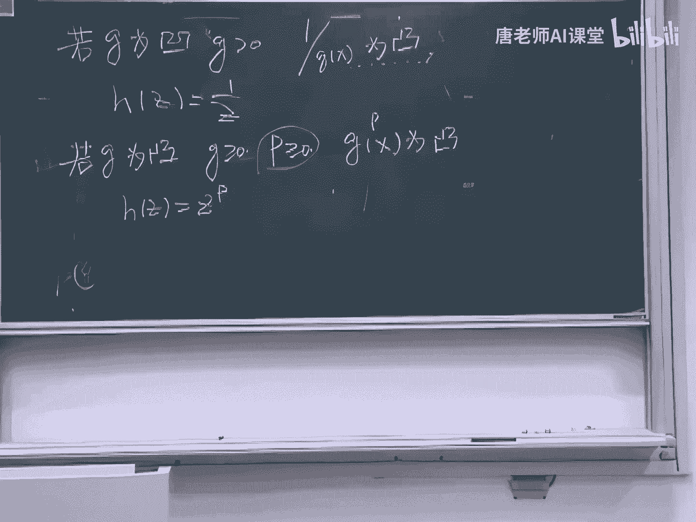

就是这个P是等于一的，那么这个函数呢，它是它在这个，它在这个Z是Z大于等于零的时候，它是这样一个它是这样一条直线，它是一个它是个单调递增的这样一条直线，而且呢它既是凸的，又是凹的。

那么我们到底应该把它看成一个凸函数，还是要看成一个凹函数呢，我们应该看成什么样的函数啊，它既是凸的又是凹了，那我们应该怎么办，我们应该把它看成一个凹函数对吧，呃我应该把它看成一个凸函数对吧，为什么。

因为我们要保持单调性，如果我们认为他哦抱歉，它应该是个应该是个凹函数对吧，那如果我们要把它当成一个凸函数的话，那么我对它扩展之后就应该是这样的了，那么这个函数就不再有单调性了。

所以我一定要把它当成一个当成一个凹函数，对不对好，那么既然这个这个H呢它是一个凹函数，而且这个函数是一个单调单调不降的这个函数，同时呢这个G呢又是一个凸函数的话，那么这个函数应该是什么样的函数呢。

这函数就应该是个凸函数，是不是哪里出了问题啊，好，首先呢这个这个G这个函数一定是一个凸函数，所以呢我就我来看看啊，首先我把这两个给圈出来。

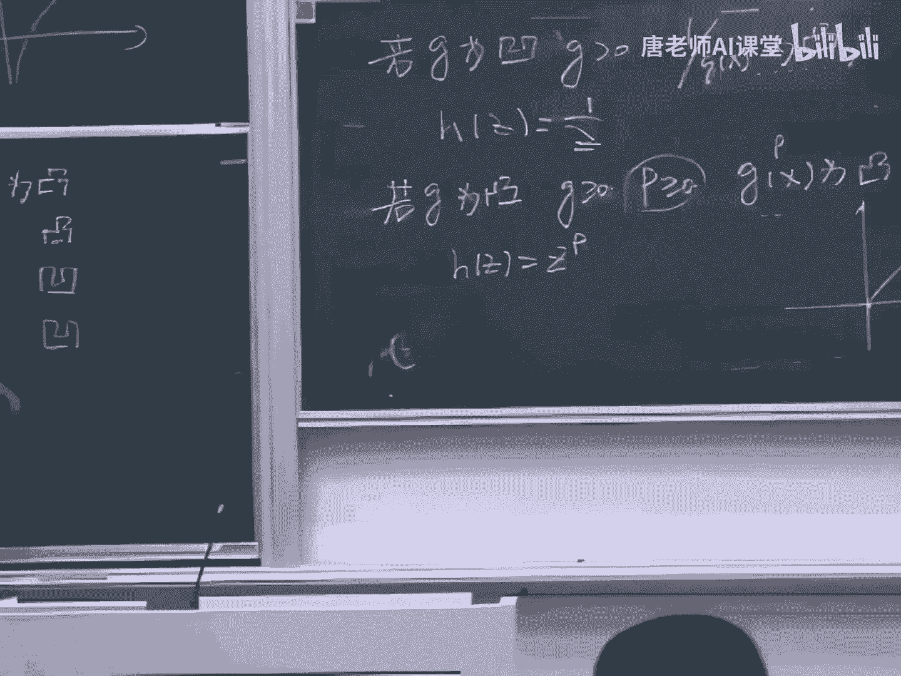

好，那么另外呢我要保证一下这个这个这个H啊。

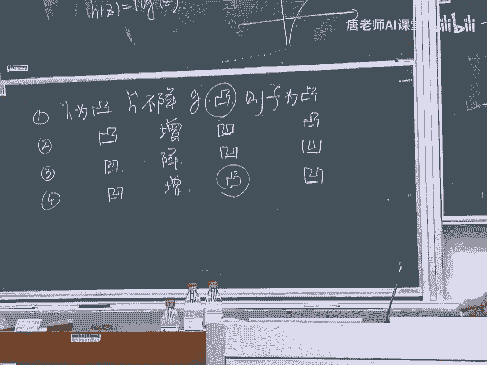

它是一个，P是大于等于零的，对吧好，如果P等于一的话，那么HZ就应该等于Z嘛，对吧好，那么我至少我这条线画的不错了，对吧好，那么下面我到底什么什么地方出错了呢，我们来看一看，那。

么如果在P小于一的情况下，好，看来这个地方，我似乎应该什么地方出了点问题对吧，这地方应该是要P等于一对吧，好那么如果P是大于等于一的话，假设对我们来考虑一下，这个如果P是等于一的情况底下。

那么那么我怎么保证这个函数还是个凸函数呢，我们哪条性质可以去用啊，第一条还是第四条，第一条是吧好啊，那么那么我怎么来保证，这个这个它是个单调不降的一个函数呢，如果他这个如果他是个to的函数的话啊。

因为它是这样一个凸的函数的话，那我如果去对它去做个扩展的话，我这是没有办法保证单调性的，对吧好，所以这地方有点问题好吧，我们我们下节课再来讲这个问题好不好。

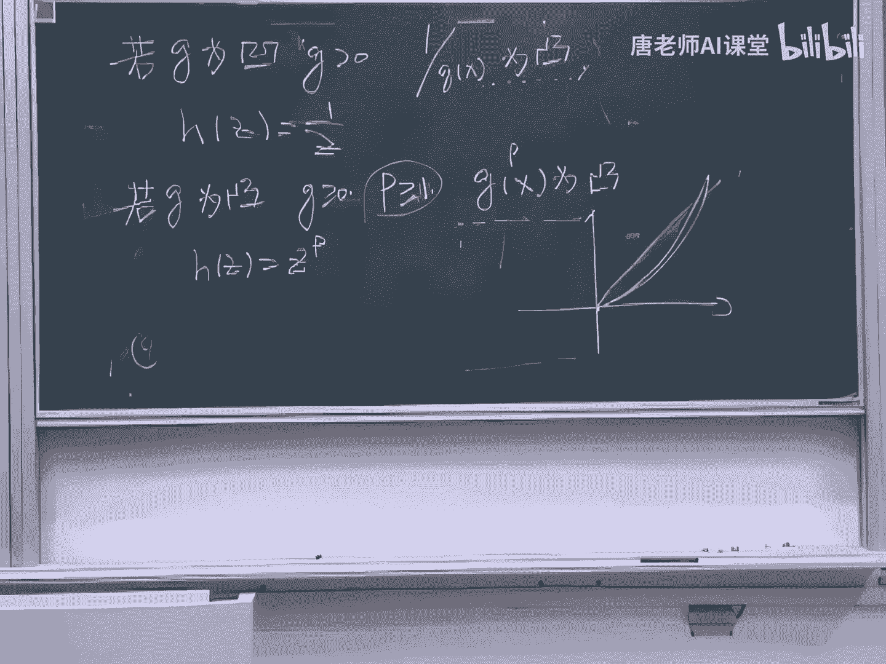

好那个那个讲到这个假如这个出错啊，我我觉得我要我要需要需要来批评一下自己了，因为我发现我每次上课的时候，总会出现出现出现一点小错误啊，那么这个东西呢，让我想起这个最近去世了一个名人。

这个名人你们应该都知道对吧，叫做叫做乔布斯，乔布斯这个人呢，他他其实有很多让我很佩服的地方，虽然我基本上不用这个苹果的产品，但我非常佩服这个人，因为他他有很多，他讲过一些一些很很很有意义的话。

就是对我们人生很有指导意义的话，呃，他在05年在斯坦福大学作为一个演讲，我建议你们去听一下，听仔细的去听一下这个演讲，去看一下这个演讲，演讲的内容，当时我听到之后，对我的这个。

我觉得是对我的人生有重要的影响了，好但是呢今天讲到这里啊，我觉得呃我这就是他讲另外一句话，倒是应该是比较应景的，他讲过这样一句话，当时啊你们知道有个公司叫叫皮克斯对吧，叫皮克斯动画公司。

当时呢这个这个乔布斯就经常对着皮特的公司，人家讲这么一句话，叫make it great，就是把它做到做得很伟大，一定要把你的东西做的很伟大，你们看这个我就没有把我的这个课讲的很伟大，对吧好。

所以啊其实这句话是非常非常有价值的一句话，就是就是要告诉我们，就是在做任何事情的时候，一定要把这个事情给做到最好，一定要做到最好的，那么有有很多人就讲的就是，这个这个中国为什么没有乔布斯啊。

这个这个问话是错的，这个这个疑问呢是错的，就跟问中国为什么没有诺贝尔奖一样的，这这完全是一个错误的话，为什么呢，这个中国其实不缺乔布斯的，我们其实会有很多的乔布斯存在的，但是我们缺什么样的人呢。

我们就缺能够把乔布斯的创意，把它给做到最好的人，能够实现他的创业的人对吧，为什么乔布斯能够做到great，因为他手下有一群great的人，那些人能够把这些事情给做到great。

这个才是才是他的这个公司能够成功的原因，所以你们要记住，一定要记住这句话。

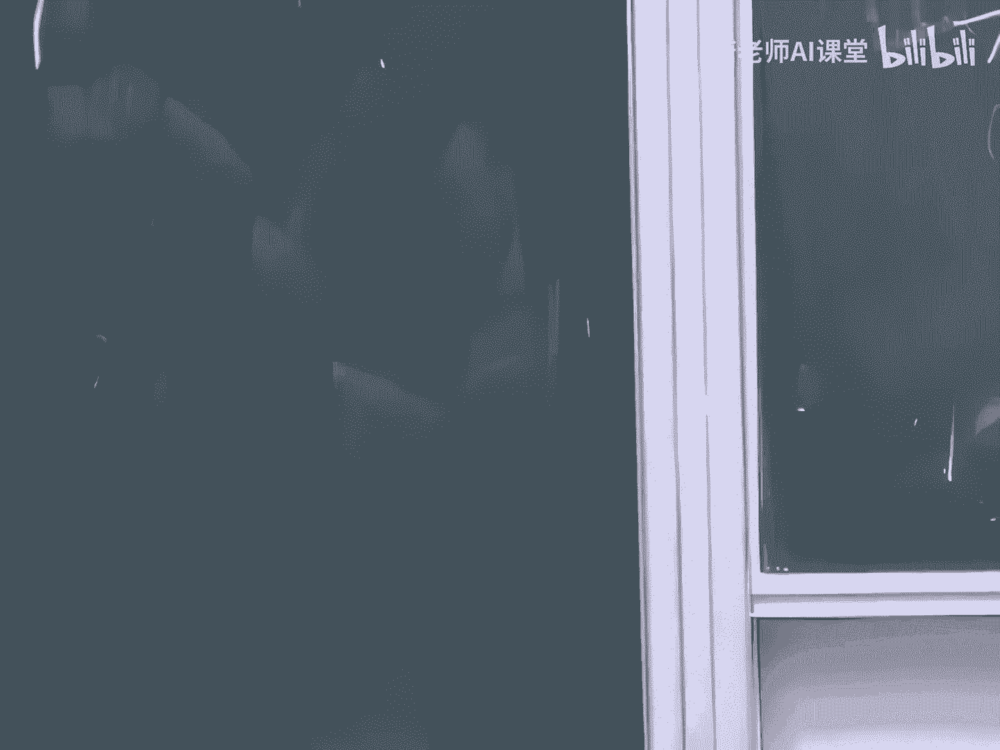

做什么事情的时候，一定要做到最好，不要像我这样犯错误好不好，这个这个重任是在你们肩上，不在我们，这不在我们这代人肩上，好那个我们就接着讲吧。

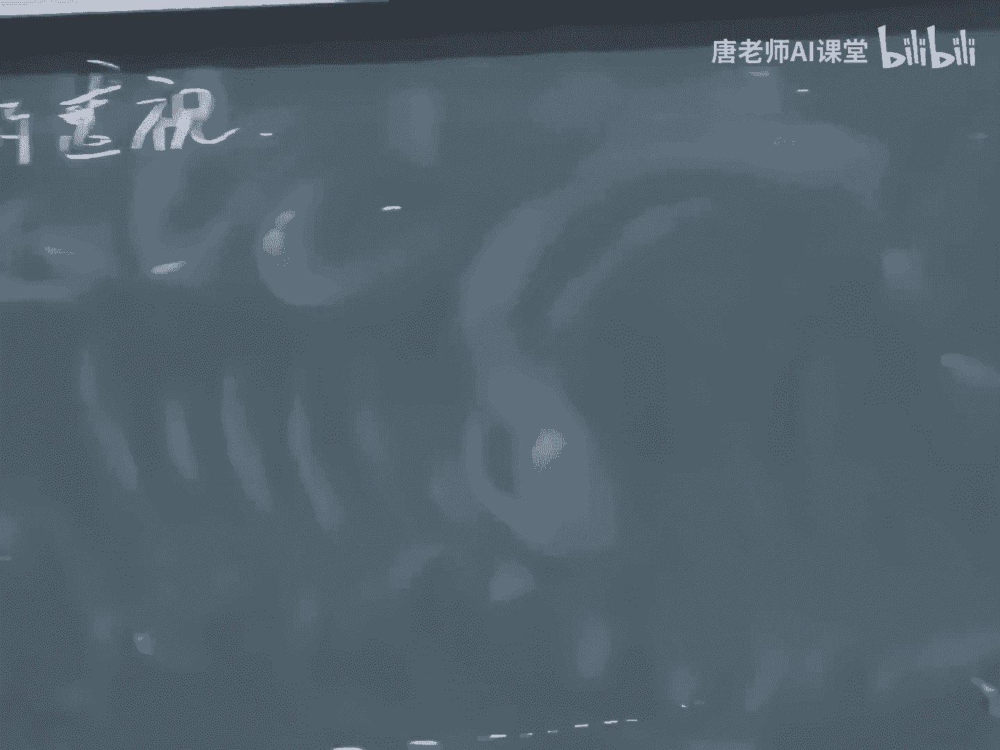

好吧嗯，呃我们下面要讲的东西啊，就是叫做函数的透视，一个函数的透视，那如果记忆力比较好的同学，可能还记得我们之前讲过的一个东西，叫做透视函数，对不对，这两个东西啊实际上是不一样的。

这两个概念实际上是完全不一样的，好是什么，意到一个透视函数呢，就是有一个映射，P它是从N加一维空间到N维空间的映射，那么它的定义是是N维空间，以及一个这样一个正的空间，正的实数空间这样一个组合。

那么PZT这个函数它的取值就是Z除以T，就是这个透视函数，它的定义是这样的，那么什么东西叫做一个函数的透视呢，好既然是一个函数的透视的话，我们首先就要来定义一个函数了，首先我们一定要定义一个函数。

假设这个函数函数叫做F，它是从N维空间，一维空间这样一个映射，那么它的透视啊，我把它称为叫GG这个函数，G这个函数的定义域是G这个函数，它的它是一个从从N加一维空间，确切说那是一个N维空间。

以及一个正的实数空间，这个组合到一维的这样一个映射，是这样一个映射，我们看这个G和P它是不一样的对吧，这个P是一个从N加一维到N维的映射，那么G呢，实际上最后是一个从N加一维到一维的，这样一个映射了。

好那么这个G是怎么去定义的呢，这个G啊他的这个取值也是包括两部分的，一部分是X，一部分是T，这个X是N维的这个向量，这个T呢是一个是一个正的实数好，那么我们来看一看，这个这个G和这上面这个P啊。

它它的这个形式实际上是不一样的，哪里不一样呢，首先呢这个这个P呢它是Z除以T，那么这里这个GXT啊，它的定义是T乘以FX除以T这样的东西，所以这个G这个函数叫做F这个函数，它的透视，好另外呢我还可以。

我还需要对这个对G这个函数啊，去他的这个定义去去稍微定义一下，好，它的定义呢实际上是中间要包含两个两个变量，一个变量是X，一个变量是T，首先呢我这个T啊一定是要大于零的对吧，这是第一个要求。

那么第二个要求是什么东西呢，是我要使得这个X除以T要在F的定义里面，对不对，我一定要满足这个要求，否则的话这个定义就不成立了，好那么对于这样一个函数透视，这样一个这样一个东西啊，函数透视还是个函数。

对不对好，那么我们有这样的结论，就是如果FX这个函数，如果FX这个函数它是个凸函数化，那么gt这个函数它也是个凸函数，好如果F是个凸函数的话，那么G就是个凸函数，但是这里这个事情没有这么简单。

就是因为这个这个F呢，它实际上它的它的定义域是N维的，这样一个空间的，那现在呢实际上我是把这个东西给扩展了一位，对吧，这个是一个非常有意思的一个事情，就是以前的这个我有。

我知道一个N维的N维到一维的一个映射，它是个凸的映射，那么下面呢我有这样一个结论，那我就可以知道一个N加一维到一维的，这样一个映射，它也是个凸的映射，这个是个很有意思的一件事情。

那么具体的证明呢我这里就不再证了，我希望你们课下去证一下好吧，不要忘了这件事情，那么这个证明中间呢实际上一定要注意两点，就是我们要证明这个函数啊，比如说如果我要证明这个基这个函数，它是个凸函数的话。

首先我一定要证明它的定义域是一个凸起，这个千万别忘了，那么在证明它的定义域是个突击之外呢，我还要去证明一下它的这这个这个通信，就是证明一下他这个这个存在这个不等式，但是一定要记住这个证明GXT这个函数。

你一定要对XT这一点，XT这个时候是一个NN加一维的空间，里面的一个点啊，你要对这一点去做一个凸组合，或者确切说是对你早上两点去做个凸组合，你不要分别对X和和分别对T去做个凸组合，这样是不对的好。

那么这样一种图形啊，就这个G对于这个XT这个，这这一点是是一个凸函数，我们很多时候我们会有这样的描述，就是G这个函数呢对于，就是G等于X和T这两点，记住我们把XT给放在一起的话，它就是一点对吧。

我也可以把它分开来看，看成S这一点和T这一点，那么另外一种等价的描述，就是它对于这个XT这两点，它是联合的凸的，它是联合图的，一定要明白这个中间的一个一个一个，一个一个一个不同。

就是如果这个gsc gt这个函数等于X是凸的话，那么很简单，就是你对于Z的T，你去改变一下这个X它都是个凸函数对吧，这是这是对于X是凸的，那么如果对于T视图的话，那么我就对于任意的X这个gt站的函数。

它它也是个凸函数，但是呢即使它分别对于X和T都是凸的话，也这也是没有办法保证，它对于X和T是联合图的，那一定要记住这一点，好下面我们来举个例子，我们来看一下这个欧几里得范数平方。

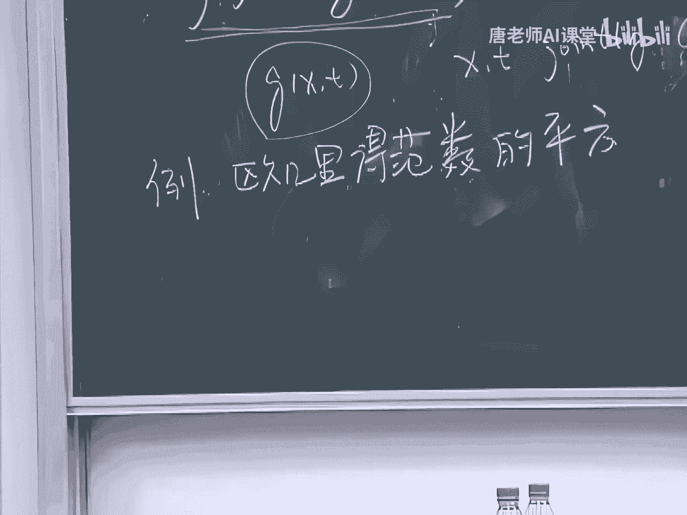

这样一个函数，它的它的透视是什么样子的，好我们来考虑一个N维的空间，那么在N维空间里面，O几的范数的平方是什么东西呢，所谓O系列函数就是这个二函数对吧，也就是说这个FX就是X的转置乘以乘以X。

那么现在我们来看一看这个函数，它的透视是什么东西，这个函数它的透视是什么东西呢，我们来看一下上面这个定义，首先我要先把这个T给写到前面来好，然后呢是我后面这个东西是FX除以T，好是这样的东西。

那么现在我知道X是一个标量对吧，X是一个标量，所以呢我是完全可以把这个，把里面那个T把它给约掉一个对吧，这个T跟这个T区给约掉，那么我可以得到一个什么结果呢，对于这样的东西，也就是说呢。

我将这个欧几里得范数的平方除以一个T，出一个新增加这样一个T，但是我要求的这个T呢是要大于零的，那么这个函数对于X和T，它是它是叫gently convex，它是联合突的，这个就是非常有意思的一个结论。

就是欧几里得范数本身它是一个convex，对于X而言，它是一个凸的这样一个这样一个函数，那么它的这个透视呢，也就是说将这个将它除以一个一个正的实数，那么它也是一个凸的这样一个函数。

而且它不光是对于X是凸的，它对于X和T联合在一起也是凸的，好下面我们来考虑一个函数，是就是这个负的对数，这个函数本身它是个凸函数对吧，所以我们知道它经过这样一个函数透视之后，它仍然还是个凸的。

啊这这个函数透视写得很简单，那么这里呢我我用了一下这个log函数的性质，就是把这个前面加个负号啊，就相当于把这个X和T给颠倒了一下，那么这个是个很显然的一个结论，对吧好，那么这时候呢。

因为我要求这个T必须要是一个是一个，正的实数，同时呢我要求这个X呢，也必须要是一个正的实数，所以呢它的它的这个定义域啊，应该是这个正的实数的平方，这个东西这个应该是二维空间里面占一，占占一个1/4对吧。

二维空间里面的1/4好，那么这个函数啊实际上就很有意思了，如果我要告诉你直接去证明这个这个东西，它是一个它是一个凸函数，你们也应该可以证明得出来吧对吧，怎么去证呢，可以去用一下这个二阶条件。

然后去算一下他的这个还算矩阵就可以了，好但是呢从这样一个结论里面呢，实际上我们可以推出来一些很有意思的东西，我们来看一个他的一个简单的一个扩展，刚刚我们考虑这个X和，这个和这个T都是一维的，都是个标量。

那么现在呢我把这个X和T把它给扩展到N维，也就是说呢我在考虑两个两个向量U和V，那么现在我们来考虑一下这样一个函数，这样一个新的函数，我们来看一下这个函数啊，这个函数跟我们之前讲的这个GXT。

这个函数长得很像对吧，长得是不是很像，实际上是什么意思呢，就是我将这个这个U和V它的每一个分量，我把它给拨开，这个U1和这个V我把它结合起来，或替换成这个S和T对不对。

就每对于每个分量我都做一个简单的替换，然后呢，我再把这个每个分量，这些东西全都给加到一块去，那么这时候我就可以得到这样一个函数了，那么这个函数是凸的还是凹的呢，这个函数是不是一个凸函数。

之前我考虑的是两个两个标量，这个这里面，这个这个它的这个自变量是两个标量，现在我考虑两个向量的，但是我无非就是把这两个向量给拆开了，那么这个函数是凸的还是凹的呢，应该也是凸的对吧好，为什么是凸的。

啊有同学讲是非负加权和，但是这个结论是不对的。

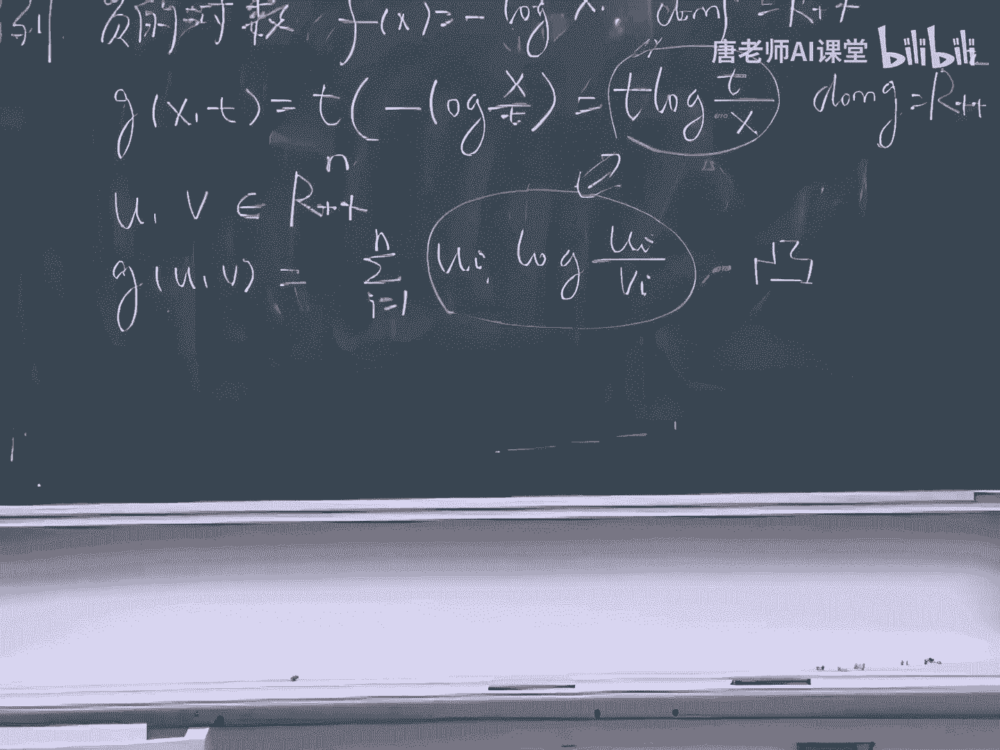

不能用非负加权和这个这个角度去考虑啊，为什么不能用非负加权和呢，我们要想想想想看啊，就是对方的确是个非负的加减和对吧好，我可以把它，我可以把中间这个每个分量啊，我写成这样的东西。

我可以把这个UI乘以log，UI除以VI写成g i ui vi的，对不对，这是可以的吧，好那么实际上它是这样一个函数，它在非负加权和，但是我们一定要记得什么样的东西，在非负加权和是是保持通信的。

应该是这样的，不是说你对于这个ui vi，你去你去取一个这样一个函数值就可以了，你需要对于对于这个U和V去取个函数值，那么我们现在已经知道这个函数是凸函数，这里面这个这个函数是个凸函数对吧。

这个我们已经知道了，为什么呢，因为我们刚刚已经讲过了，但是我们并不知道这个函数是不是凸的，这时候我们是不知道的，所以中间需要转转下这样一个弯，这是这个这个细节一定要注意了，就是千万要搞清楚。

就是这个恢复加成和这个概念，在什么情况下是可以去用的，你不能只是单独的对于这，对于每个UI和vi去做就可以了，那么直观的解释是这样的，直观的解释就是，你是把这个U和V这个这个变量啊。

把它给剖成剖成N份对吧，你把这个U和V给剖成N份，而且每份呢是不相关的，那不相关的每一份呢都是凸函数，所以你把它给结合在一起，它就是个凸的，这个这个概念跟非负加权和是不一样的，你们自己仔仔细去思考一下。

好那么现在我们结论就是这样的函数，这个函数就是就是若干个，这个这个UI乘以乘以log u i除以VI，这个函数它的求和是个凸的函数，那么这个函数呢，实际上是有一个非常重要的一个性质的。

我们再把这个函数啊稍微再扩展一下，我们把这个函数再做一个变形。

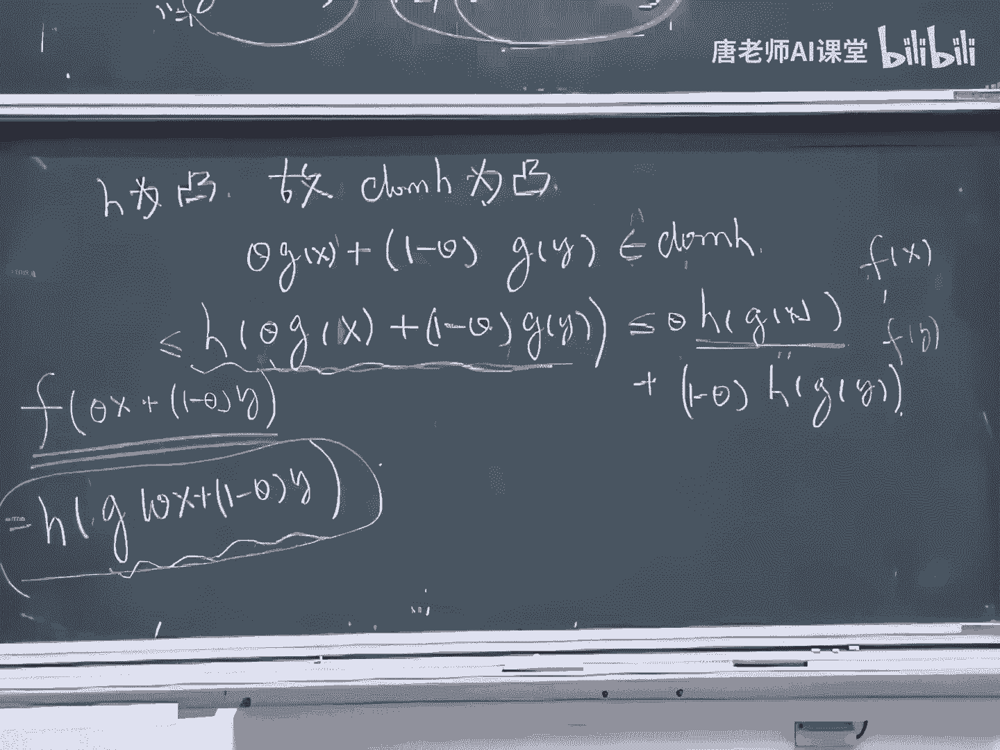

好我第一个函数叫做这个函数的名字很长，这个函数叫D但是有个下标叫KL，有同学可能已经知道这个care是什么意思了吧，有没有同学知道的，没有啊，好这个函数实际上很简单，就是把我们这个之前这个函数呢。

减去这个U的所有项的和，再加上这个V的所有项的和，就这样一个东西，那么这个函数是凸的还是凹的呢，这函数是凸的还是凹的，或者不凸也不凹，前面这部分是凸的对吧好，那么后面这个是什么，这凸的还是凹的。

后面这部分又凸又凹，对不对，很简单，它是仿射的嘛对吧，那么一个凸函数再加上一个仿射函数，再减去一个仿射函数，它是凸的还是凹的，对你们应该果断回答，就是一定是个凸函数嗯。

好因为它实际上就是一个非负的加权和嘛，这时候你就可以用到，非负加权和这样一个性质了，好那么这个是什么东西呢，如果学过信息论的同学，现在已经知道了，这东西叫做叫kl divergence。

这个KL是两个人对吧，这个D就表示一个divergence的意思，这里面有没有学过信息论的同学，好啊没有啊，好，那我们讲啊，为什么这个信息论里面会有这个kl divergence，原因很简单。

就是因为这个函数是凸函数，这是个非常非常容易去处理的这样一个函数，我们看这个函数看起来好像不是很自然对吧，这这函数看起来好像非常不自然的样子，但实际上呢，这个这个这个这个想法实际上是非常简单的。

就是我要构造一个凸函数出来，那么实际上呢这个这个kl divergence，我把这一点稍微再扩展讲一讲，就是kl divergence呢，实际上是另外一个divergence的一个一个一个特例。

叫做bragman divergence，好那所谓的bug是这个意思，就是首先要定义一个函数，首先呢我要定一个一维到一维的映射，F这个函数。

那么跟这个函数F相关的这个bregman divergence，是怎么定义的呢，就这样的，这个BGM单位就算是这么定义的好，那么实际上呢我们对于某一个特殊的，如果我们取一类比较特殊的F。

比如说如果我把这个F取成这样的函数，如果我把这个F取成这样的函数的话，那么这个时候这个bgm divergence，就退化成这个k l divergence了，这个这个很简单，这个变化非常简单。

你们可以自己去验证一下好，但是呢我需要告诉你一点，就是说如果当我去别的F的时候，我这个F可以任意的去取对吧，只要你有一个函数，而且这个函数是凸函数，那么我就可以去定义这样一个相关的一个。

Bragman divergence，但是呢这个divergence它并不一定是凸的，它并不一定是凸的，好，这也就是为什么我们要讨论这个kl divers的原因，就是因为这个函数是凸函数，它比较容易。

所以呢我们就会去讨论这样一个东西，那么为什么我们不用这样一个比较一般的这个，bregman divergence呢，因为它没有办法保证通信的，所以你们一定要记住，就是碰到什么问题的时候啊。

如果你们能够找到一个凸函数的话，那么就尽量用一个凸函数，千万不要用非凸的，飞度的话，只会给你带来无穷的烦恼。

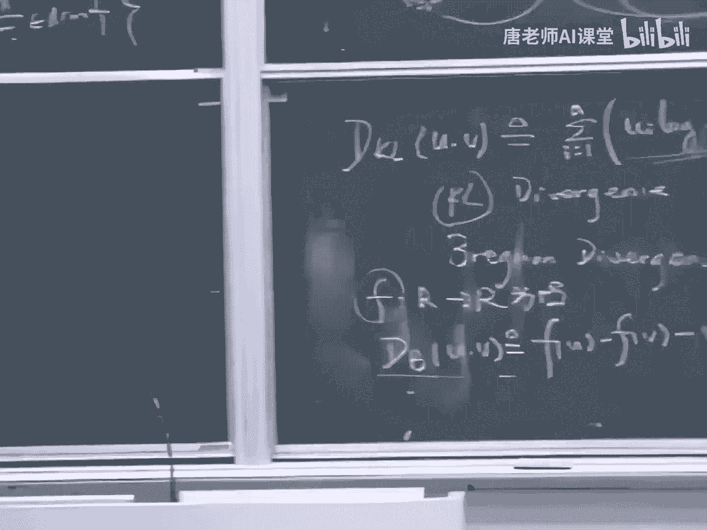

好下面呢我们要讲一个函数叫做函数的共轭，我们都知道共轭对吧。

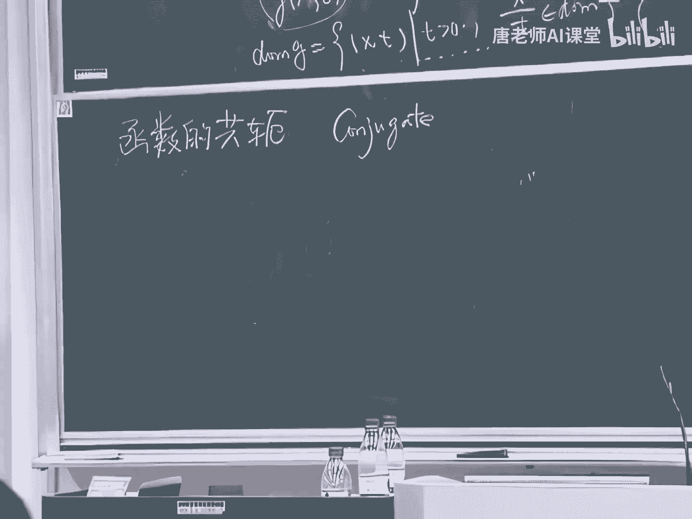

就是对于一个数的话，对于一个对于一个负数的话，我们可以去求一下它的共轭，那么函数的共轭是什么意思呢，共轭的话英文叫做空就给了，那么函数共轭是什么意思呢，我们给他占个地。

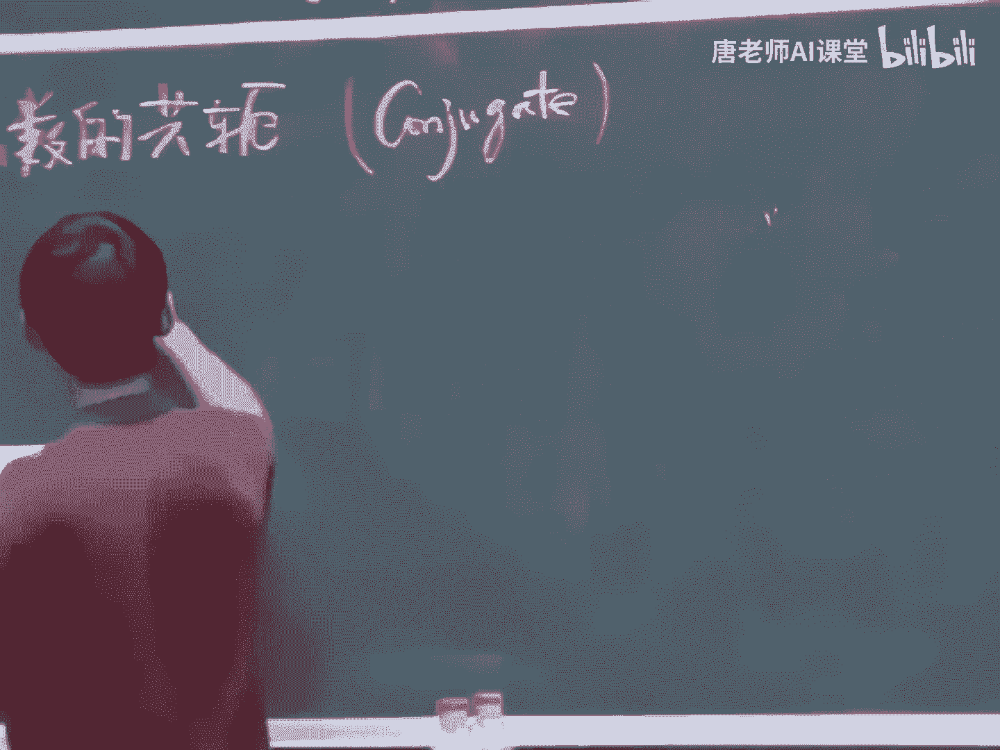

假设呢我来定义一个函数，F这个函数，它的它是一个从N维空间到一维空间这个映射，那么相应的它的共轭呢，也是一个从N维空间到一维空间的映射，我把这个公式也记成F星继承这个函数好，这个函数是这么定义的。

一个函数的共轭是这么去定义的，我少一个X，这个是是什么样的东西呢，我们来分开来看一看，那首先呢这个里面呢这个括号里面呢，它是它是Y和X的内积，这是Y占的向量和X这个向量的内积，再减去XFX的取值。

然后呢我怎么让我怎么去得到这个F型Y呢，我是对于所有的X我去求个极大值好，也就是说呢就是你怎么去求这个F型Y啊，首先呢你选定好一个Y，你选定好一个Y，确定好一个Y之后呢，你再去便利一下这个X。

你对于这个任意的X啊，你你就去算一下，然后呢你再去找出来一个一个最大的值，对于这样一个Y，这个对于这样一个Y你就会有很多个值对吧，那么你在这个很多个值里面去找个最大的值，那么这个值就是F型Y的取值了。

就这样的东西，那么这个讲起来可能还是比较抽象，我们来画个图。

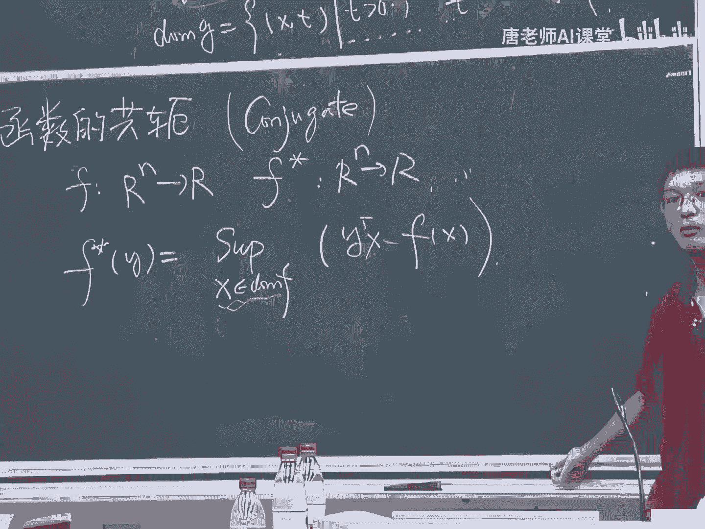

这样很容易就能明白了。

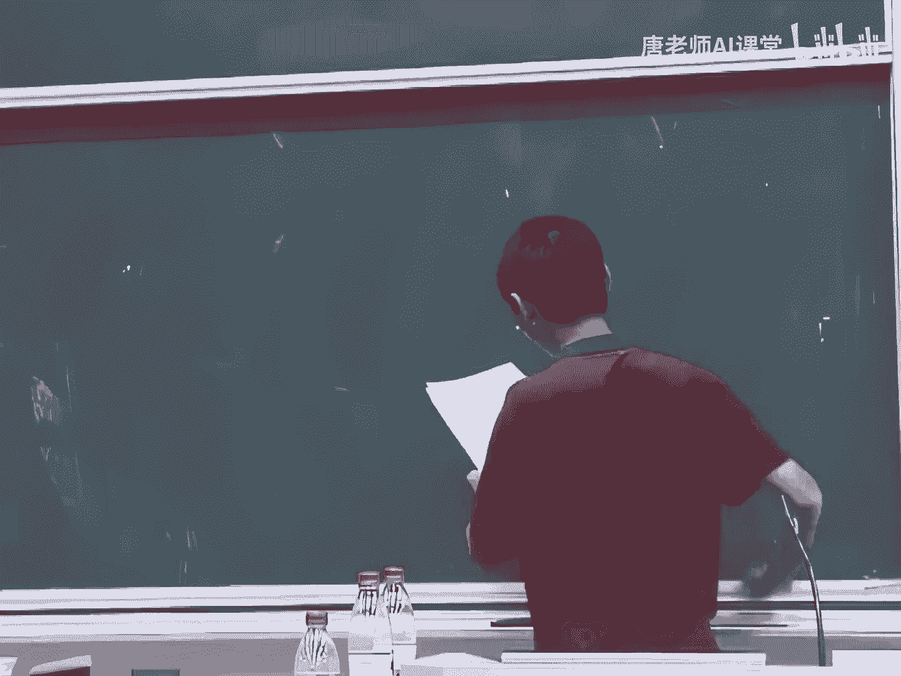

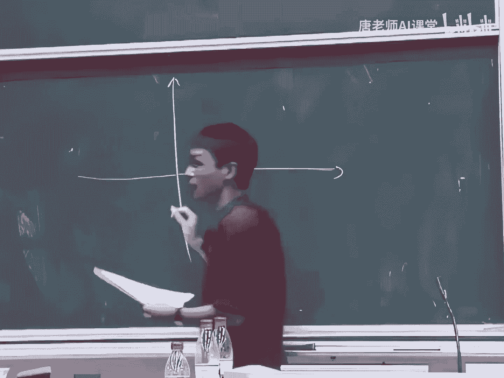

简单体验呢我们还是来考虑一个一维的情况。

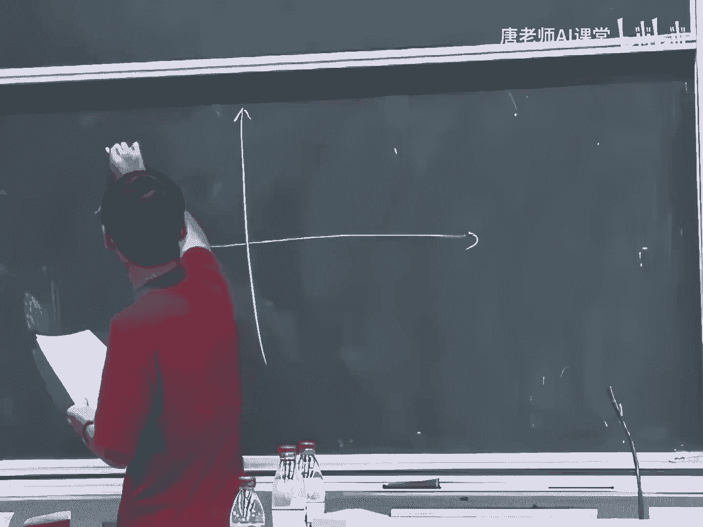

好假设为呢有这样一个函数。

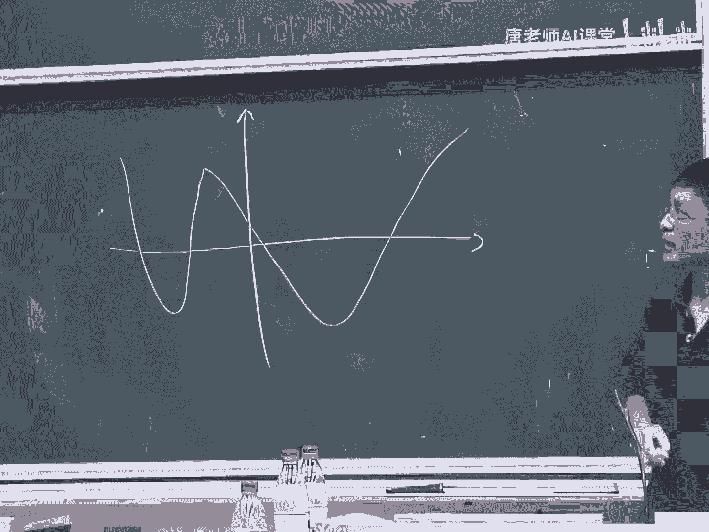

这个函数是FX这个函数，好这个函数不一定是个凸函数啊，它可以是一个非凸的函数，可以是个凹函数，也可以是任意的函数都可以的，那么这个YY和X的内积是什么东西呢，就是Y和X内积，我在这个图上怎么画出来呢。

就是假设我已经有了一个Y了。

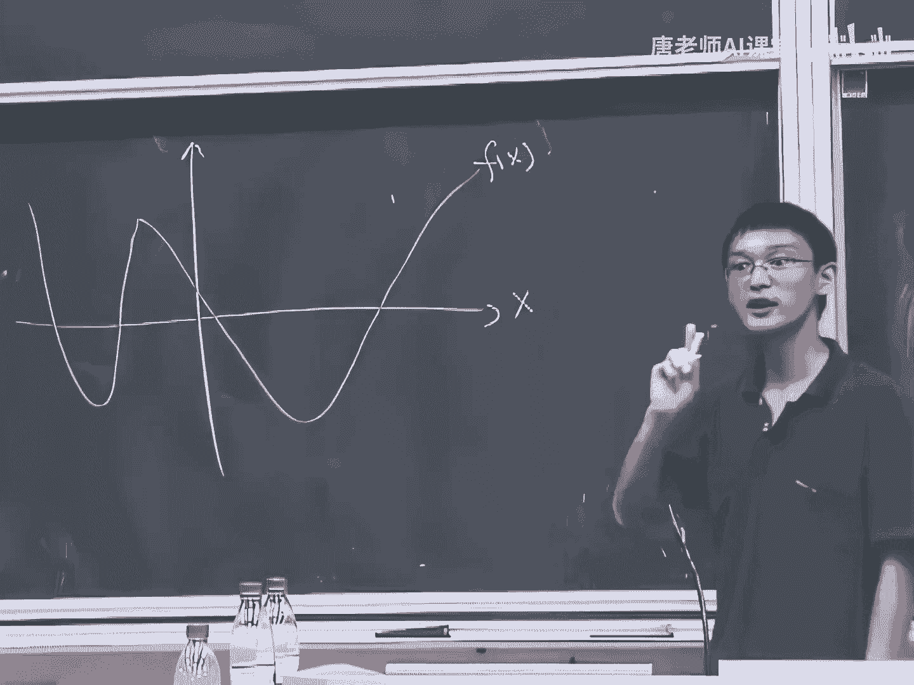

假如这个Y是个是个，比如说这个Y是个大于零的数，就是这样一条直线了，对吧对不对，这是个斜率为Y的这样一条直线吗，好那么这个YY和X内积减去FX是什么东西呢，这个在图上怎么表示呢。

我可以对这个对于这个这个YX这条线呢，去做个平行线对吧，我可以去做个平行线，这个平行线呢我要去找一个，找一个离这离他最远的这样一个这样一个焦点，离它最远的一个交点，那么这个点的取值就是FPY这个距离啊。

这个距离啊就是F型Y能不能理解这个概念，可以吧，实际上这一点呢它的坐标就是，就这个东西好，为什么是这样的呢，就是这个现在我要求的，这就是这条直线和这两条曲线之间的，这个距离嘛。

我实际上是要求一个最大的距离，什么东西叫做最大距离啊，就你将它去就尽量往那边去移，找到一个你不能在移的这个地方，找到这样一个焦点，那么这个这个焦点你从这一点到，你从这条线到这条线，它的它所移动的距离。

实际上就是这个FPY了，就这样一个东西，所以从几何上我们可以很容易的这么去理解。

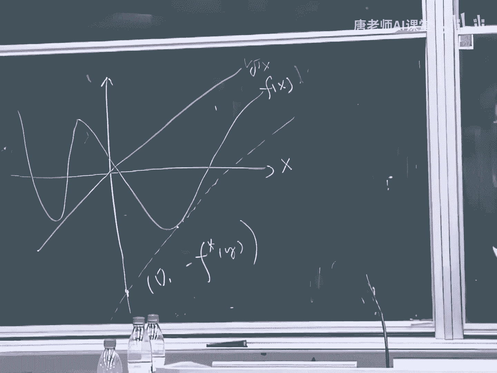

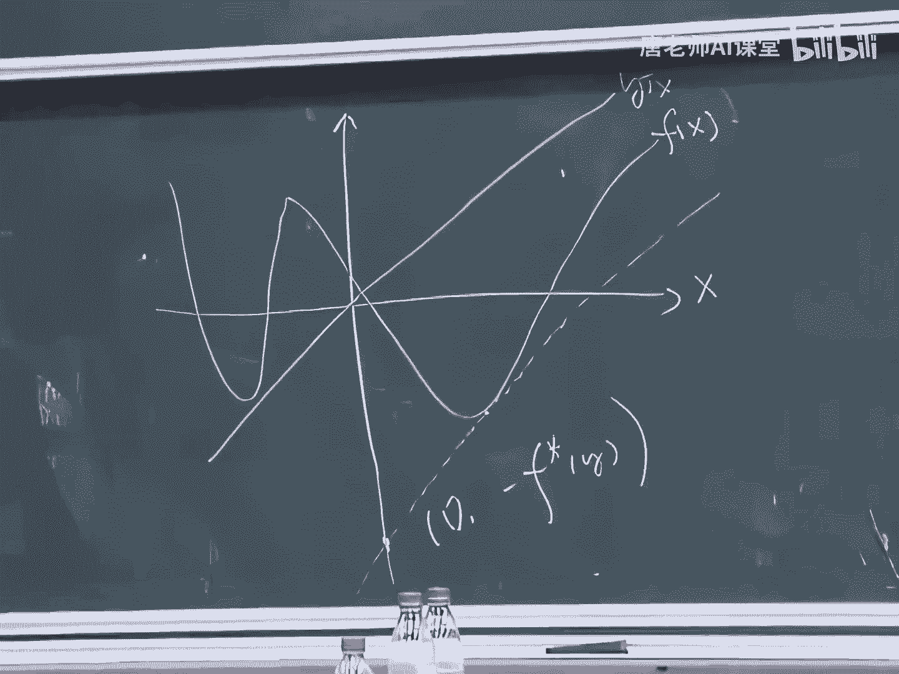

我们为什么要讲这个函数的共轭呢。

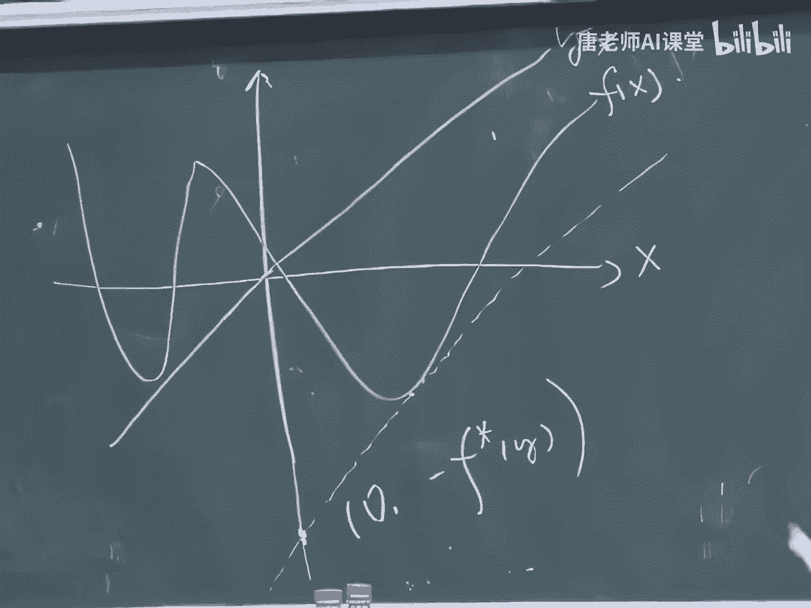

因为这个东西在我们以后讲这个凸函数呃，讲这个图优化问题的时候，我们会用得上的，比如说在讲这个对偶性分析的时候，你肯定会用得上的，那么函数公式啊，它有一些很好的性质，第一条性质是这样的，第一条性质就是。

如果这个FX这个函数是一个可微的函数的话，那么这个F型Y所对应的X，什么叫做F型Y所对应的X，就是你再去求这个极大的时候啊，对于Z的Y，对于任意的Y你自然会找到一个对应的X对吧，找到一个或者多个找。

找到这样一个X使得这个东西其实是最大的，那么在什么情况底下，这个会使得这个取值最大呢，一定要使得这个这个FX它的它的它的一阶偏导，等于Y的，这个实际上也是很容易理解的，我们从这幅图上很容易就能理解了。

就是这一点是什么原理呢，就是这个斜率这个斜率必须要等于Y的，确切说应该是这个FX这个函数的切线对吧，我们所画的这一条这一条线的这一条平行线呢，所对应的这样一个X，这一点所对应的这个X它的斜率。

所对应的这个曲线的FX，这样一个斜率一定是等于Y的，否则的话我们就不会找到这样一个最远的点了，这个从几何上也是很多人理解的，那么不同情况理解也是可以的，我们可以稍微的来说明一下。

因为现在我们要使得这个这个这个YX减去，这个FX也要必须要是最大值，对于这个X必须要是最大值，那么在什么情况下他能取到最大值呢，就是它对于X的偏导要是等于零的，对吧，就这样的东西啊。

我给你一个Y在什么情况下他会取到最大值呢，就是我要对于我将这个式子对于X去求个偏导，那么它的偏导要等于零，它才会去求得到一个最大值，对不对好，那么既然它的这个偏导数等于零的话，我们来算一下它的偏导。

第一个这个Y乘以X的偏导应该是等于Y对吧，第二个它的偏导呢就是，就是就F1撇X了，所以这个等式一定是要满足的，这也就是为什么这个FTP必须要等于Y，就这个原因，好这是第一条性质。

第二条性质呢是跟我们讲的这个凸函数，是有关系的，这性质就是你们一定要记住啊，就是如果这个FX这个函数是个凸函数的话，那么F1F型XFCY也是个凸函数，好这是第一条，第二条，即使这个FFX不是个图函数。

那么FY也一定是个图函数，也就是说对于任意的情况，我们所构造的这样一个函数公式，一定都是凸函数，不管你原来这个函数是什么样的东西，我只要经过这样一个变化，我总是可以变成一个函数。

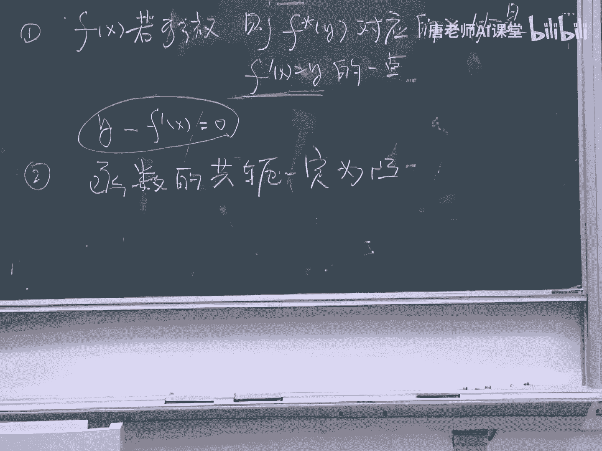

这个性质是非常神奇的一个性质，对吧好，就是比如说我随便给你一个凸函数的话，你怎么把它给变成呃，我随便给你一个非凸函数，你怎么给变成凸的呢，你就可以这么去做了，那么这个性质以后。

我们在分析这个凸函数的这个理论的时候，还是可以去用得上的，那为什么会这样，为什么这个函数是个凸函数呢，我们来看看这个函数为什么是个凸函数，好我们看到这个式子里面啊。

首先这个函数它是一个关于Y的这样一个函数，对吧，它是关于Y的这个函数，那么里面的这个第一项呢，它是一个关于Y的这样一个线性项，它是个关于Y的这样一个线性下，第二项呢是跟Y没有关系的，对不对对吧。

所以呢我给定X给定，如果我给定这样一个给定这样一个X化，那么实际上它是一个关于Y的这样一个，线性函数对吧，这个你们不能否认吧，好那么我给你很多很多个X。

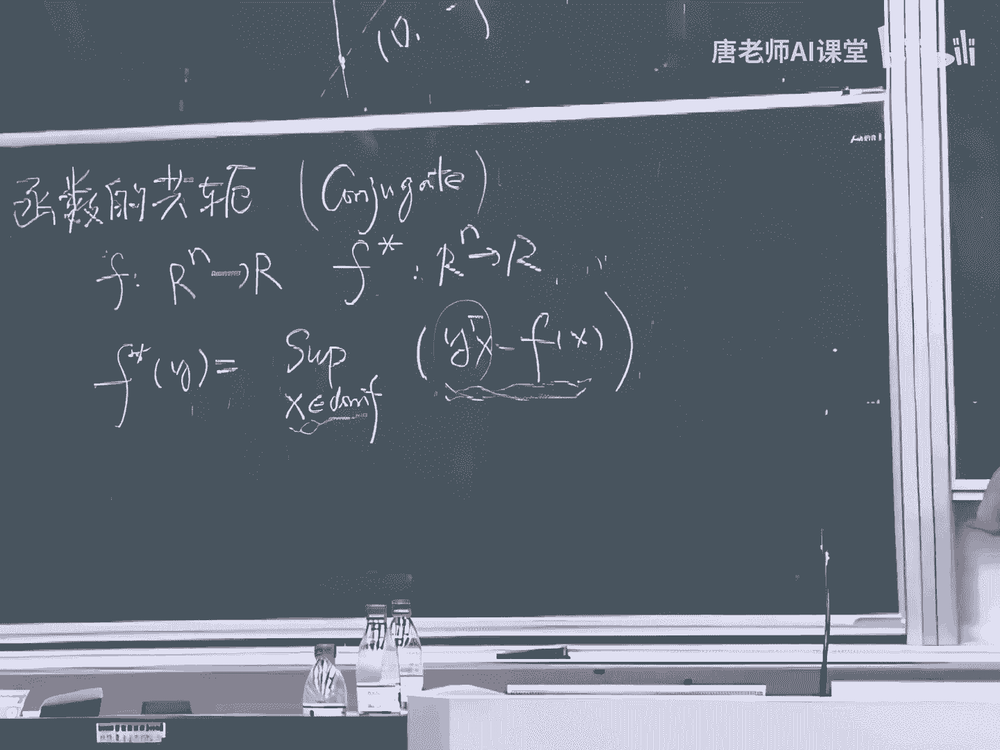

比如我给你一些X一X2SN等等等等，那么它都是都是Y的线性函数，对不对，好，那么我现在有很多个关于Y的线性函数，我需要对它去求个极大值，我有很多个关于Y的线性函数，我需要去对它求过其他值。

那么这个函数是不是关于Y的，这样一个叫分段线性的函数，对不对，对这种极大值的分段线性函数，所以这个函数一定还是个关于Y的凸函数，理解不理解不理解吧，好不理解的原因很简单。

就是因为上节课你们没有认真去听好，一定要记住啊，就是一定要记住，就是现在我们讨论的事情是这个Y啊，现在这个Y是个变量，现在这个Y是个变量，然后呢我对于很多个X，对于很多个X我都可以去画。

我都可以去画出来，相应的这样这样一条，关于关于Y的这样一条曲线，这个曲线实际上就已经变成了直线了，现在呢我要求这个若干个直线，它它的最大值对吧，我家有若干条关于这个Y的直线，那么这个横坐标是Y，现在呢。

我需要把这个若干条直线上的最大值给找出来，那么它的最大值是什么东西呢，是这样的东西，这个函数一定是个凸函数，我现在这边画的是三条线，那么你再多画一点，比如说画上N条线，甚至画上无穷条线。

这样一个函数圆也还是个凸函数，也就是说呢，就是只要只要你是一个这种函数的共轭的话，不管你的FX是凸的还是凹的，那么这个FPY这个函数的工作，一定是一个关于Y的一个凸函数。

这个就是函数的工作一个很重要的性质。