# 【比刷剧还爽！】这太完整了！量化交易和python金融分析实战课程，全程干货无废话 入门到精通一步到位！（数据挖掘分析／大数据／可视化／投资／金融／股票／算法） - P78：82. 19.20.课堂小测1），向量零范数的松弛形式，可微拟凸函数的一阶条件和二阶条件(Av526664194,P19) - AI算法-溜溜 - BV1iC411n7XN

之前呢我们讲到这个凸函数的时候，我们讲到它有四个定义，那么你图函数呢我们已经讲过两个定义了，但其实呢你度函数也有四个定义，那么我们就把后面这两个定义再讲一下，就是我们讲这个这个凸函数呢有四个力对吧。

这个后面两个例呢分别是一阶，一阶条件和二阶条件，那么你图函数呢，实际上也有它自己的一阶条件和二阶条件，就如果它是可微或者是二阶可微的话。

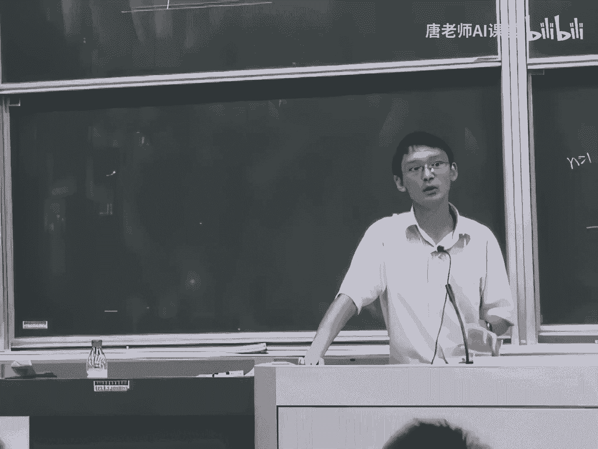

那么你就可以去有用一些新的定义了。

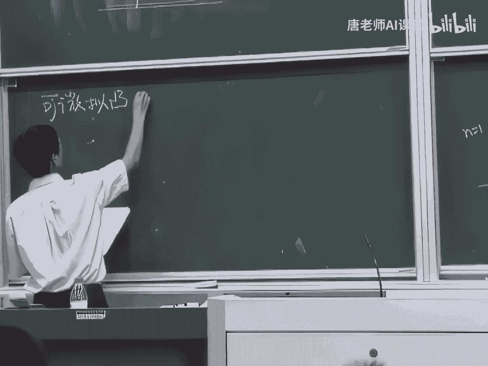

好首先呢我们来回顾一下这个凸函数，它的它的一阶条件是什么样子的。

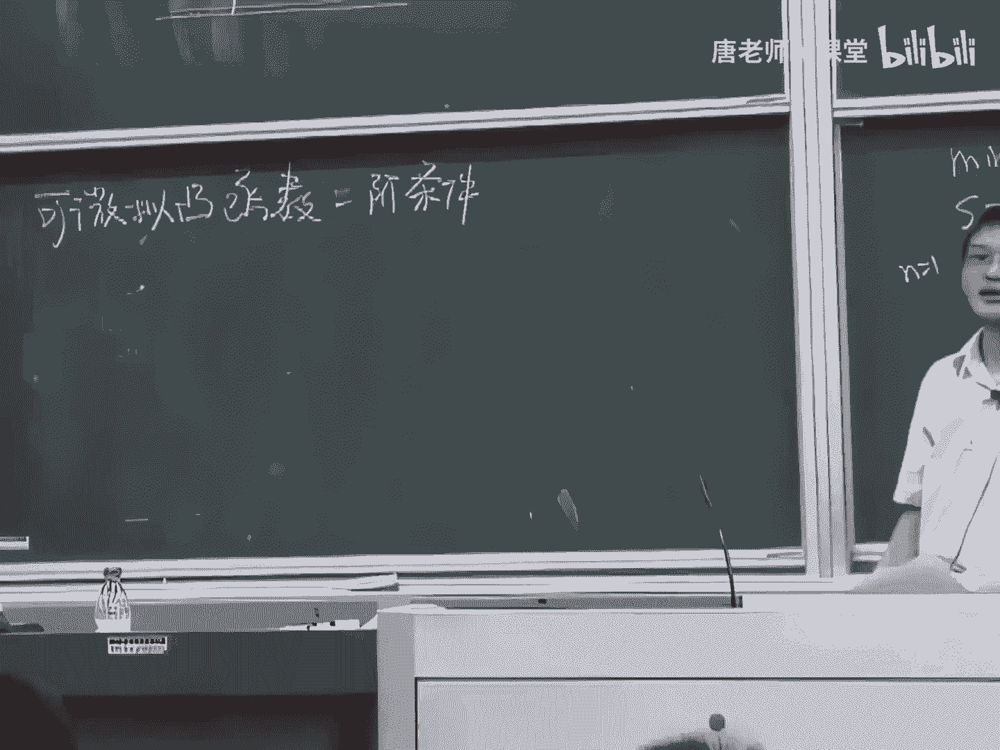

如果一个凸函数，它它是一个一阶可微的话，那么它等价于什么东西呢。

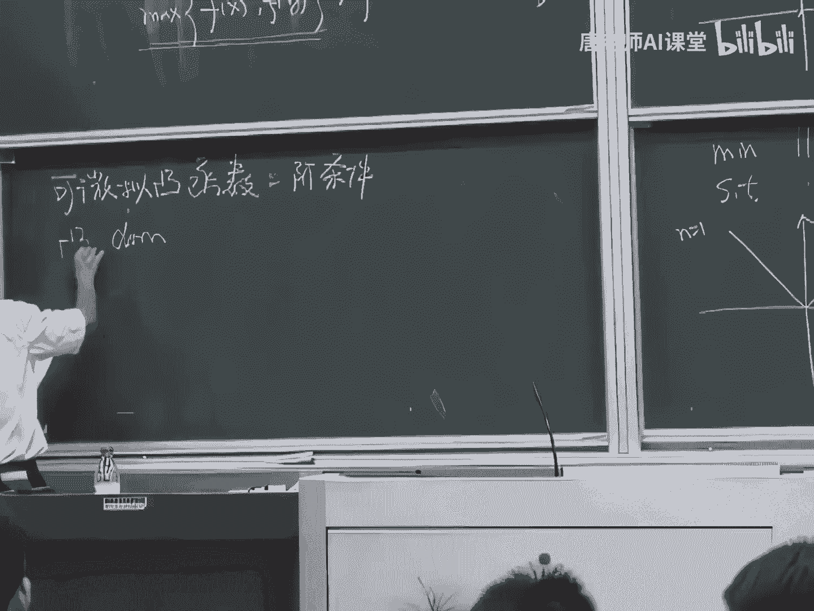

它等待于这个函数，它的定义是一个突击，而且呢我任意的在这个定义里面去选择两点，X和Y它都一定有这样一个不等式满足，也就是说这个FY是要大于等于FX，再加上一个这个FX的一阶偏导。

乘以这个Y减去X占一个内积，那么这个的E我们其实也已经解释过了，就是你要在这样一个锅底下去放一根棍子，就这个含义，这个棍子一定是需要比这个锅要低的，那么对于你图函数的话。

它也有一个类似的这样一个一阶条件，但是这个样子变了很多。

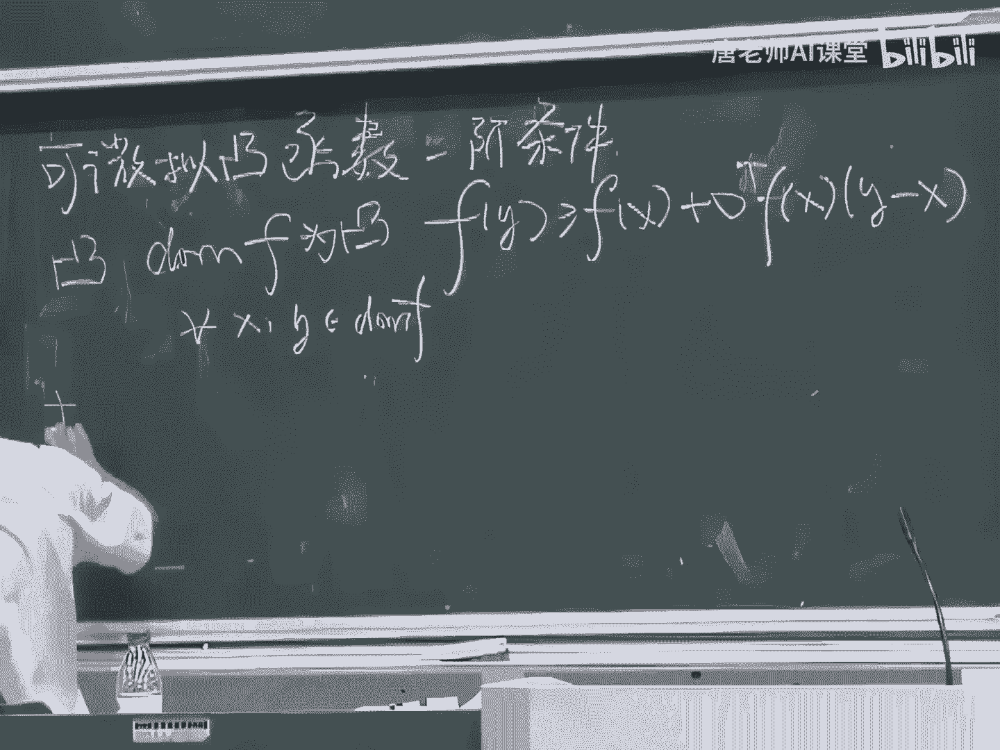

好这个定义呢是一个很奇怪的一个定义，就是首先呢我们还是要在这个它的定义里面，这个to的定义里面去选择两点X和Y，那么如果一个函数拟凸的话，它等价于什么东西呢，等价于有这样一个有这样一个关系存在。

有这样一个推导关系存在，就是如果我有，如果我有这个FY大于等于FX的话，那么我就可以推出来这样的东西，我就可以推出来这样的结果，我们来想一下这是什么意思啊，就是如果一个函数啊，它是个拟图函数。

那么呢我如果任意的找上来，当然这个X和Y两点，那么我肯定可以去比较一下它的它的FX和FY，对吧啊，我肯定可以比出来一个大小的，那么如果比出来大小之后，我就可以推出来这样一个结果，就如果他是跟你退换说法。

我一定可以推出来这样的结果，那么反过来呢也是一样的意思，就是我如果任意的去找上，任意的找上X和Y这两点，如果我将它比较一下之后，发现有这样一个结论存在的话，那么我一定能推出来这样一个东西。

那么满足这样一个性质的话，那这个函数就是一个底图函数，这个是一个很特别的一个定义对吧，因为我们看以前所有的定义啊，都是比如说有个等式或者有个不等式存在，那么就说明这个东西是它是一个什么样的。

一个一个就什么样一个名字，那么现在呢我们讲如果他是个女图函数的话，我一定有这样一个逻辑关系存在，那么这个这个事情很有意思，所以我呢我们要来证明一下，看看为什么是这样的，那为了简单起见。

我们还是只考虑最简单的情况，就是一维的情况，当这个当当那个F它的定义是一个一维的，这样一个这样一个集合的话，这个这个定义啊实际上是一个等价的定义，所以呢我们要证明两个方向，就首先如果他是个女土的话。

那么你一定会有这样一个逻辑关系存在，所以呢我们首先来证明这样一个正的方向。

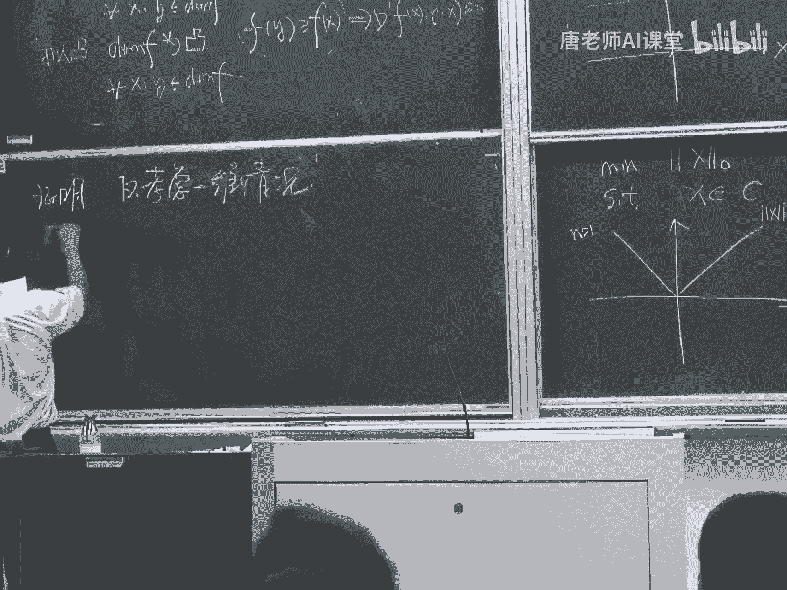

好，那么我们知道，我们已经知道这个FX是一个理图函数了，所以呢我们就可以用下以前的定义对吧，那么我愿意的去选择两点X和Y嗯。

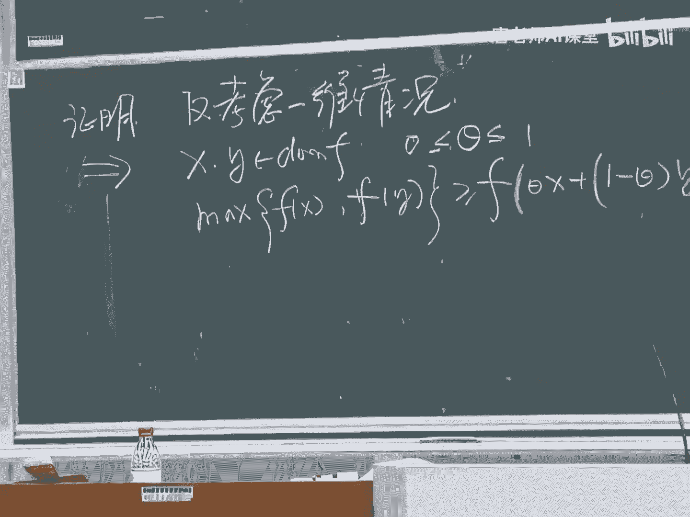

然后呢我再选择一个C大，在0~1之间，我一定有这样一个不等式存在，这个就是关于理图函数的这样一个，第二个定义嘛，我直接把这个定义用一下好，那么现在呢我们就要证明，一定有这样一个逻辑关系存在。

就是如果FY大于等于FX的话，那么一定一定可以推出来后面这样一个不等式，那么怎么来做呢，我们就已经选择好了，这样这样这样一个X和一个Y了，那么我假设啊，这个我的FY就真的是大于等于五的FX。

当然反过来也是没有也是没有问题的，你只要把X和Y换一下就可以了，如果有这样的东西满足的话，那么现在我们要证明，一定有这样一个不等式存在，对吧好。

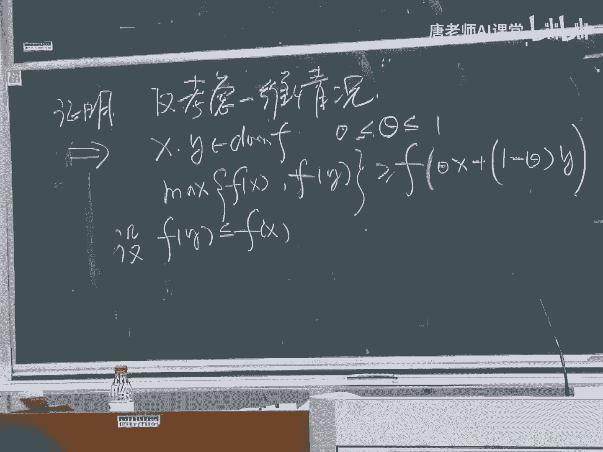

那么如果这样一个东西满足的话，那么我们上面的不等式会变成什么样子的呢，就是我只要把这个地方给换成FX就可以了对吧，我左边那个是FX。

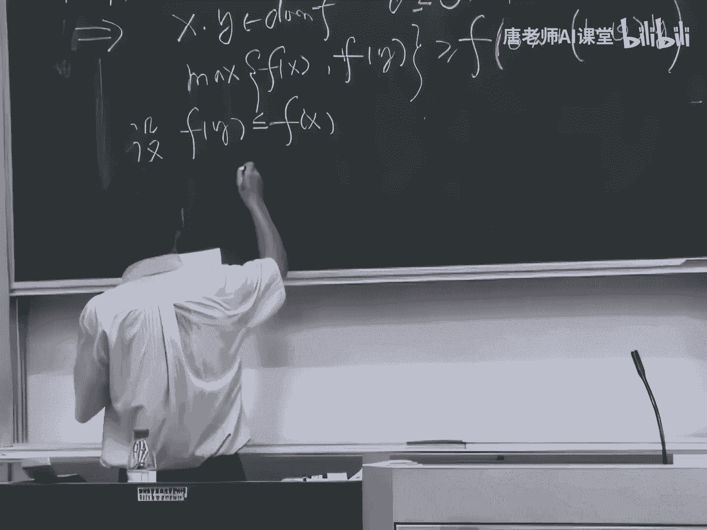

我一定会有这样一个不等式存在的，那么我怎么从这个不等式。

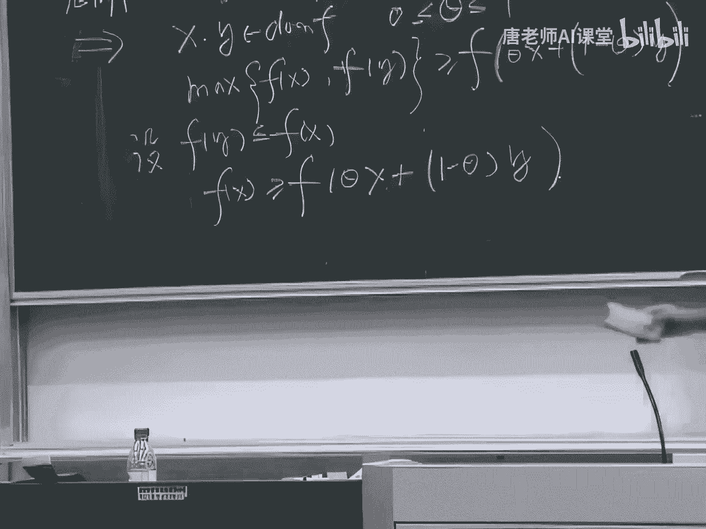

来得到上面这个不等式啊，上面这个不等式实际上是一个跟FX这样一个，一阶偏导有关系的这样一个东西对吧，所以呢我的思路就是，我一定要从这样一个不等式里面去凑出来，一个关于X的这样一个一阶偏导出来。

我一定要凑个东西出来，那么怎么来凑呢，这个技巧其实我们之前也已经用过很多次了，我们再来试一次，首先呢我把这个式子稍微改写一下，我把这个把这东西给挪到，给挪到左边来好，那么这个式子等级还是什么东西呢。

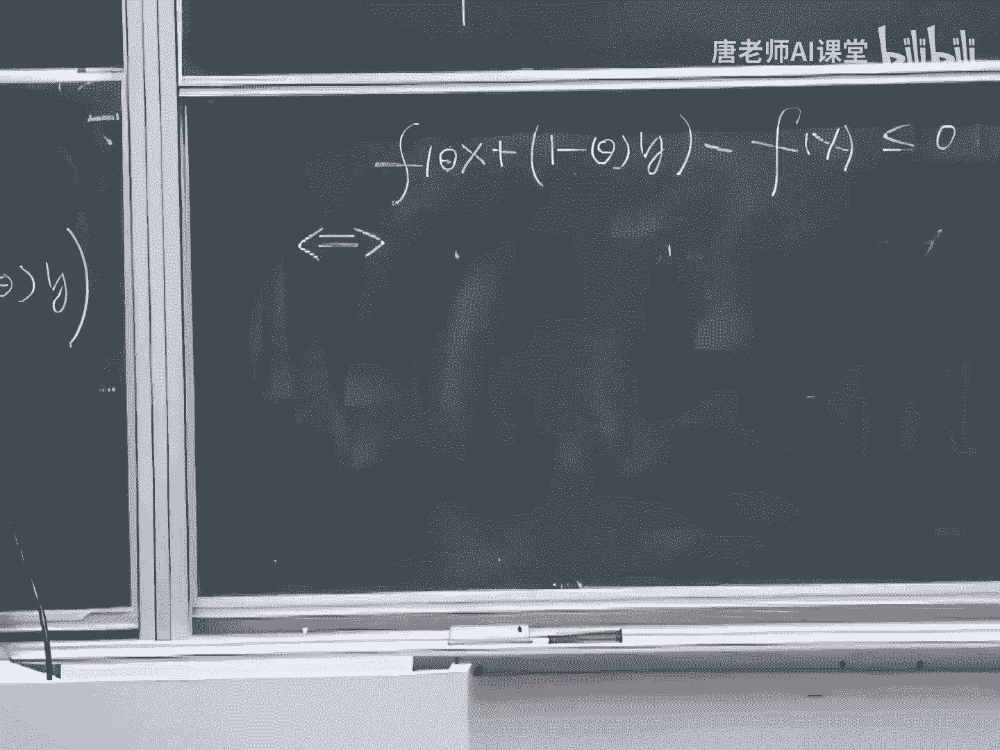

我们来看看我们怎么从这个东西里面去，得到一个关于X的一阶偏导啊，那么我就可以把这个X这东西给拆开对吧，这里面是C的X加上一减C的Y，我很显然我可以把这边拆成C的X和，一减C的X可以。

好好我一定有这样一个式子满足了。

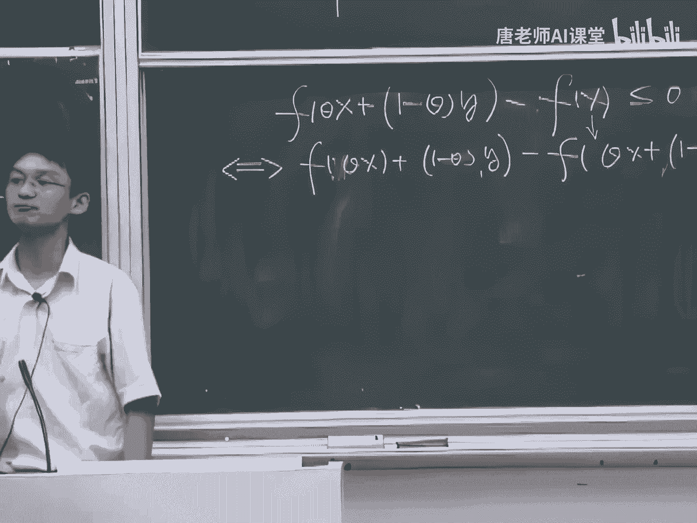

那么既然这样一个式子满足的话，我可以把这个式子的这个这个这个式子，是一个是一个没有分母的这样一个式子，我可以在这个式子里面加上一个分母，加上一个什么分母呢，我们来看一下。

这个加上一个什么样的分母比较合适呢，我们的目标是要凑出来这样一个一阶偏导对吧，所以我们要搞一个跟这个一阶偏导，会导致一个一阶偏导的这样一个分布。

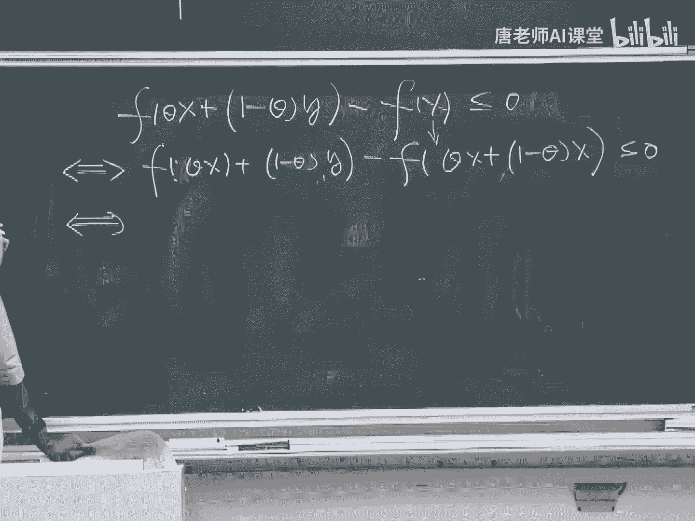

我们来看看怎么做，我一定可以这么去做的，那么有同学可能就会问了，如果我Y等于X怎么办，或者如果我的这个C塔等于一的话怎么办，这没有关系，因为这个东西还是一定是成立的，你可以去对它去求极限嘛。

它一定是成立的，对吧好，那么有这样式的话，我们就好办了，我们来看看，实际上，这个我为什么会有一个这个一减，C大乘以Y减X呢，实际上它就是这两项的差，对不对对吧好。

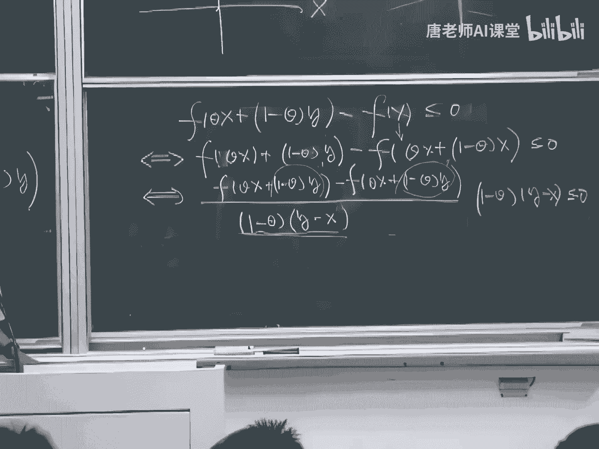

我就是我就有这样我就能找到这两项的差，这里是X啊，好，那么现在呢我再来考虑一下，什么情况下我能得到一个X1阶一阶偏导，我要让这个C的能够趋近于一对吧，如果当这个C大趋近于一的时候。

那么这个东西是不是就已经刚好变成了X1FX，一阶偏导啊，在X这点的一阶偏导没问题吧，哦抱歉，应该是CA等于零对吧好，我讲错了，应该是CA等于零的时候，他就是哦这等于一的时候啊啊那么后面这一项。

那么后面这一项怎么办，我就可以把同样写进去对吧，但是呢我这里一定要记住，这里CA是趋近于一的，所以呢实际上这一项我可以把它给抹掉了，这样我暂时不用管了，一定是小于零的对吧，没问题吧，有没有问题。

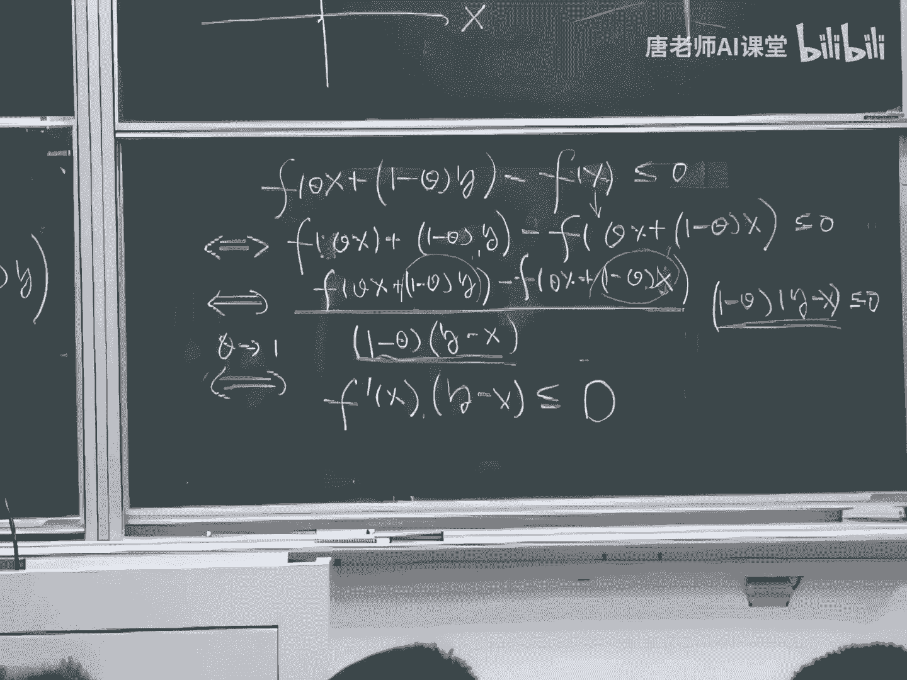

问题在哪里，是不是在于这个有同学会有疑问，这一减C大会等于零，我们这里取的是一个极限的东西，它是趋近于这样一个东西，你总是可以找到一个无穷小的，这样这样一个这样一个量啊。

就是你能够找到一个无穷小的E减肥的，你总能找到一个无穷小的一点C的，使得这样一个式子满足的，如果你能找到这样一个无穷小的，这样一减C的话，那么就没有问题了，那么无穷小东西存在不存在呢。

无穷小这东西存在不存在存在的啊，这个问题在几百年之前牛顿就已经讨论过了，所以我们现在不用再讨论了，就一定是有这样一个无穷小存在的，所以你不要担心，这个地方这个一减最大变成零了。

我总是可以找到一个很小很小很小的这样，这样一个这样一个一减C大，使得这样一个式子成立，那么对于这样一个很小很小的一减C大呢，我就可以知道这个这一项，这项实际上就是等于FX1阶偏导。

这中间实际上实际上有一个，这个有个很小的问题，就是这个一点最大能不能等于零的，这样一个问题，实际上我们这里假设的是，它应该是不等于零的，它是趋近于零，但它不等于零的好，那么这个不等式成立的话。

是不是我们就已经证明了上面那个，这个这个这个推导的后面一部分，我们已经证明了这个逻辑关系的后面，一部分了吧，好还有没有疑惑，对于这个问题，啊我感觉好像还是还是人有疑惑吧，哦我的定义写错了，对不对啊。

对方是FY小于等于X吗，小于等于，这地方是对的还是错的，这也是对的是吧，这里写错了对吧，那好非常抱歉啊，好那整个的这样一个推导有没有问题，整个推导没有问题吧，好，就只要你们能够知道这个无穷小这个概念。

就可以了，它它是实际上就是向着这个，向着什么方向去取个极限呢，它向着这个这个一减的这个方向去取个极限的，它是要从左边无限趋近于一，但是它不等于一这个东西，好下面呢我们要证明的是这个这个推导的站。

另外一个方向，我们要证明一下另外一个方向，就是如果能够有这样一个逻辑关系存在的话，如果对于任意的X和Y，我都有这样的逻辑关系存在的话，那么这个函数就是个女图函数，这个证明的思路呢。

跟上面这个证明的思路实际上是差不多的，比较类似的，好我们现在已知的东西是这样的，就是如果我对于Z的X和Y，在这个F的地域里面，我都有这个FY小于等于FX的话，这里这个X和Y。

我们肯定是可以把它互相颠倒了，这是没有问题的，那么我们一定有这样一个不等式存在，就是它的一阶偏导和Y减X的，它的内积啊一定是要小于等于零的，好。

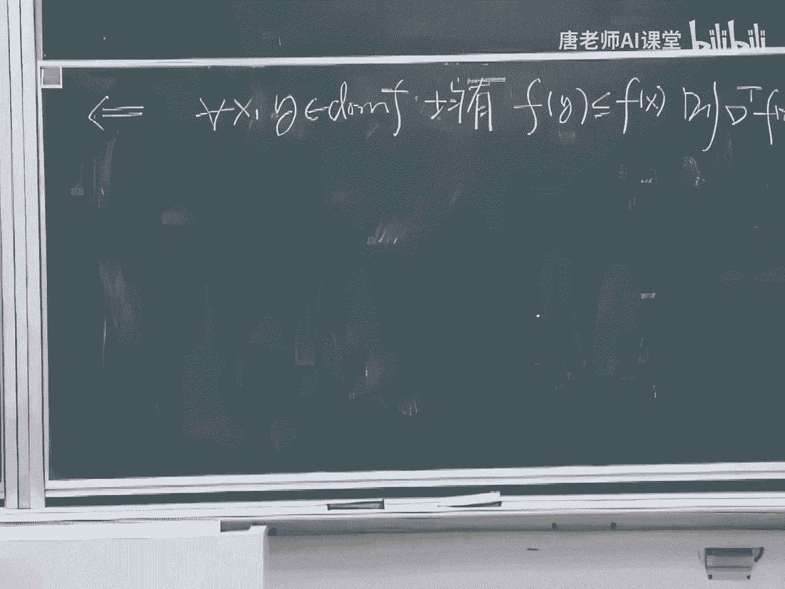

那么有这样的东西呢，我们要来证明他是个理突的，所以实际上我们就要证明，它是满足这个里突函数的，以前的这样一些定义对吧，那么我们看看怎么来做，好首先呢我们来考虑这样一个量。

我们来考虑一下这个FY和FX中间，最大的一个减去这个X和Y的，他的这个凸组合，在F这在这个F这个函数的取值，我们看如果我们能够证明它是大于等于零的话，如果我们能够证明它是大于等于零的话。

那么这个函我们就知道，这个函数一定是个女图函数吧对吧。

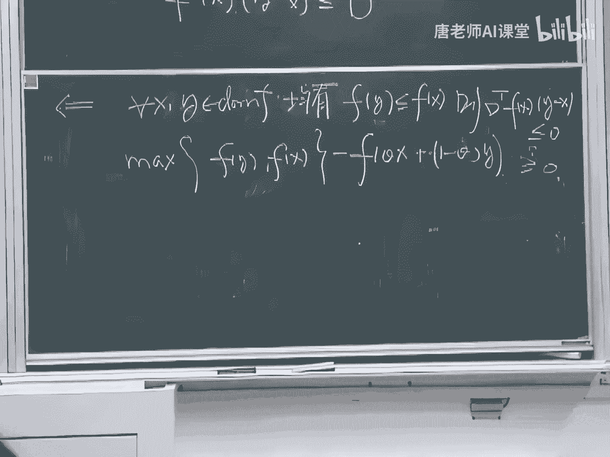

这个就是你图函数定义嘛，那么我们能不能从上面这个逻辑关系，来得到这个东西呢，我们可以来看一下，好，那么现在我们就假设，这个FX的确是大于等于FY的，所以这个式子就等于这个东西，那么很简单。

我们还是可以去照上面这个样子去变一下对吧，好一定有这样的东西，那么同样的我还是将这个theta去取个极限，我让这个theta去进一，好，那么这里就变成了F1撇X再乘以X减去Y了。

那么现在我们已经知道了啊，这个F1撇X乘以Y减去X是小于等于零的，那么很显然这一项就应该是大于等于零的吧，好这项肯定是大于等于零的，既然它大于等于零的话，那么我们的这样一个假设。

之前这样一个假设就成立了，所以这个函数肯定就是一个拟凸函数了，这个我们就用了一下你的函数之前的定义，证明了这样一个东西。

我们以前在讲这个凸函数的时候呢，我们讲过这个一阶一阶条件呢。

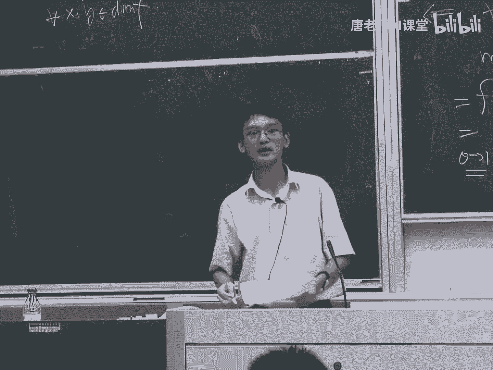

实际上有一个实际上是个很有意义的一个东西，是个什么意义呢，就是如果一个函如果一个凸函数啊，如果他的某一点的一阶偏导数等于零的话，那么这一点一定是使得这个函数的取值最小的，一个点之一对吧。

我们可能有很多个点，一阶偏导等于零，那么所有的点都是能够，使得它的函数值是最小的，这个就是一阶，从这个凸函数的一阶条件里面可以得出来的，那为什么是这样的呢，我们来看一下。

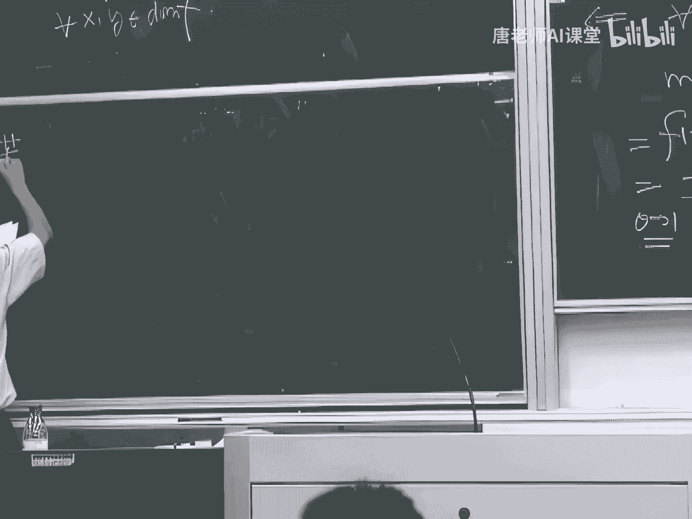

我们来假设一下，如果这个函数中间能够找到一个点或者某些点，X能够使得他的一阶偏导数等于零的，那么在这种情况下，我的既然是一个图函数的话，那么这个一定条件一定是满足的，所以呢我就把这个SD点给带进去。

我就能发现对于所有的Y对所有的Y，不管这个Y是等于X还是不等于X，只要它在这个定义里面，我一定都是有这个不等式存在的，这个FY一定是大于FX的，对不对，因为我们可以把这个一阶偏导等于零，把它带进去嘛。

带进上面这个不等式，这一定是成立的，也就是说呢对于一个凸函数的话，它的一阶偏导等于零，实际上是一个非常有意义的这样一个点，非常有意义的一个点，也就是实际上如果这个问题没有约束的话。

如果这个问题没有约束的话，那么实际上我们就已经找到了，这样一个这样一个最优值点了，或者说我们已经在这个定义域里面，能够找到这样一个最优值的点了，这个这个就是这个一阶偏导的，它的意义就是这样的。

但是如果一个函数呢是一个拟凸函数的话，这个性质就不再存在了，我们来看一下对于一个底图函数，这个情况是是个什么样子的，好我们再把这样一个点呢，再把这个一阶偏导等于零的这一点，把它给带到上面这样一个。

这样一个逻辑关系里面去，我们来看一下啊，也就是说对于任意的，对于任意的Y，我如果有这个FY小于等于FX的话，那么我一定能够推出来什么呢，我一定能够推出来，他说零小于等于零。

这个事情这个事情不需要我们来推对吧，零一定是小于等于零的，我我不需要知道这个FX和FI和，这个FY之间有什么样的关系，所以也就说了，在这对于这样一个领突函数的话啊，如果你找这么一点的话。

那么这一点是没有意义的对吧，因为它因为它的结论就是一句，完全完全没有意义的话了，这是个完全没有意义的东西，这个就是凸函数和理数函数一个非常大的区别，对于凸函数的话，一阶偏导等于零，那么恭喜你。

你就找到了一个自由的一个点了，但是对于女图函数一阶偏导等于零，你你找到一个完全没有意义的点，我们来看一下为什么会发生这样的情况，我们来举个例子看一下，好这里呢我来画一个这样的函数，占个占个一维的函数。

那么这个函数是不是一个凸函数，不是凸吧对吧，因为这个地方它的形状就是凹的形状吗，它不是凸的好，所以呢那么这个函数是不是一个你图函数呢，是不是你偷函数是你说吧对吧，为什么。

因为它在每一每一边它都其实都是单调的，所以呢我们就会发现他的这个阿尔法SLC，实际上是在不断不断的增增大的，所以这个而且他时时刻刻保持，这样一个阿帕萨set一定是个突击的。

所以呢这个函数就是个女图函数好，那我们来看一下这个力度函数，中间呢它有哪些点，它的一阶偏导数等于零的，首先这一点它的一元导数等于零吧，好这一点呢实际上它的最小值点，这个点实际上是有意义的。

但是呢我们总能在中间找到一些点，中间一定会有会有另外两个点，它的一阶偏导数等于零的，你能不能想象这个事情再再这样，比如说吧可能会在这两个点，它的一阶偏导一定是等于零的对吧，为什么呢。

因为这个函数它是一个这样一个连续的，二阶可微的函数，我们当然我们我画的可能不好啊，它是一个我们就假设它是个连续的二阶可微的，这样的函数，那么既然它是连续二阶可微的，也就是说它的这个一阶偏导啊。

一定是连续变化的，一阶偏导一定是连续变化的，我们看这个地方这个一阶偏导啊，这个一阶偏导它应该是一个它的一阶偏导，应该是正的吧对吧，那么到这个地方之后呢，哦还是真的好，我的假设错了，我们不能不能这么讲啊。

总之我们可以找到这么导导到这么一个，能够让它的一阶偏导等于零的这么一点对吧，就是左边的这个一阶偏导是正的，但是慢慢的降低降低降到零了，然后慢慢的还要往上升，高，又变成正的了对吧。

我们肯定可以找到这么两点嘛，好那么也就是说呢，实际上呢如果对于一个理图函数的话，我们的确也还是可以找到很多，他的一阶偏导等于零的点的，但这一点到底有没有意义，我们还需要仔细的去看一下。

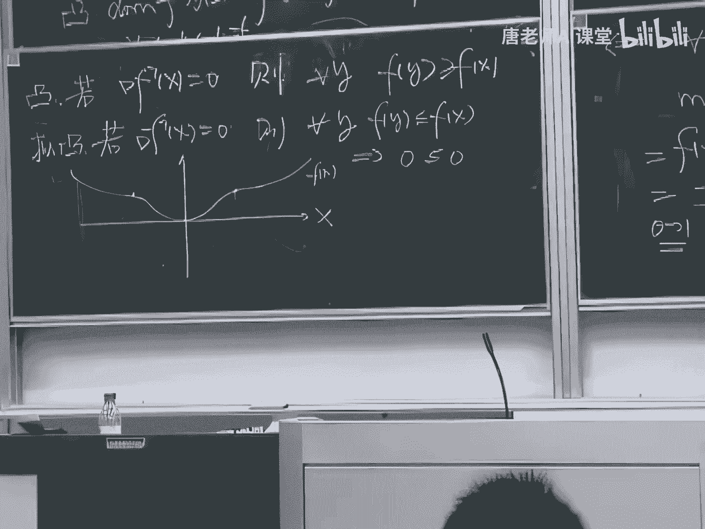

同样的这个凸函数呢它是有个二级条件的，如果它是一个二级口碑的话，那么对于这个泥土还说呢，它也是有个二阶条件的，我们看看这这个二阶条件是个什么样子的，对于凸函数的话，我们要求对于这个地域里面的任意一个X。

他的这个FX的二阶偏导啊，一定一定都要是是这样一个半正定的矩阵，一定都是半径的矩阵，那么这里我为了简单起见，我我就把它写成大于等于零了，它它的含义应该是一个半正定矩阵，如果这个函数是个女图的话呢。

这个结论是什么样子的呢，我们同样的会有一个逻辑关系存在，这个逻辑关系就有点意思啊，我们来看如果这个函数是个女凸函数的话，那么它的定义是个凸起，那么对于任意的X和Y属于这样一个这样一个，它的定义的话。

那么我都有这是一个这是个标量对吧，这个Y和FX的一阶偏导，他应该是个它的这个内积应该是个标量嘛对吧，他说这个标量大于等于零，可以推出来这样的结论，这个结论是啊，我这里漏了一个东西啊。

好我们看这里面是个什么量呢，这是我是将这个Y的转置乘以这个HAN矩阵，乘以FXFX在F在X这一点，它的还算矩阵，再乘以Y这样一个向量，那么这是一个行向量，这是一个矩阵，这里又是个列向量。

它的乘积是什么呢，它乘积是个标量吗，对吧，也就是说呢如果有这样一个不等式存在的话，那么一定也有这样一个不等式存在，所以这里两个大于等于零，是真的大于等于零，不是这个半径，不是半径的意思。

好这个又是什么概念呢，我们直观上来看可能不是特别好理解，但是我们还是把它考虑一个简单的情况，我们来考虑一个一维的例子，我们来看看在一维的情况底下，转一个这个概念是意味着什么东西。

这样安全条件到底意味着什么东西，在一维的情况下，这地方就很简单了，我就变成这个Y和FX的一阶偏导的乘积了对吧，我知道它是大于等于零的，那么我就可以推出来什么呢，既然它是一维的话。

那么我可以把这个把这个Y的转置，和这个Y都改成Y，对不对对吧，它是一维的嘛，而且我可以把它合并到一起去，一元的话就有这个好处，中间没有矩阵存在了，所以你就可以把它给合并到一块去。

就变成了Y平方乘以FX的二阶偏导，是要大于等于零的，我会有这样一个逻辑关系存在好，那么这个逻辑关系存在，它又说明什么事情呢，我们来看一下，如果我选择了某一点，Y是等于零的话。

那么那么这个式子一定是成立的吧，对吧好，那么右边这个东西呢又变成零大于等于零了，这又是没有意义，完全没有意义的事情，那么我们另外再来考虑一种情况，就是如果当这个F1撇X啊。

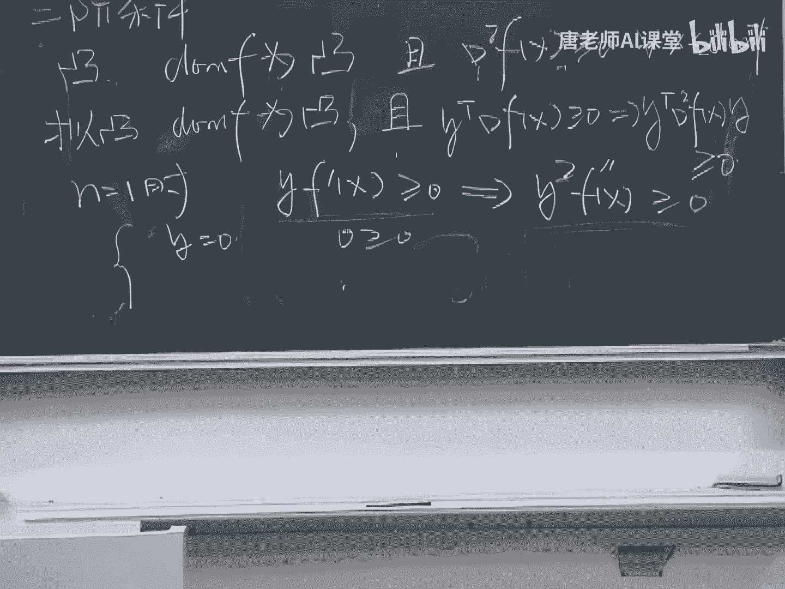

是等于零的，我们来考虑F1撇X等于零，那么这时候这个Y不管等于什么值，这个不等式也是一定成立的吧，好那我就来考虑一个Y不等于零的情况，这个式子是一定成立的，那么我们再来看一下啊，这个不等式也一定成立。

对吧好，这里我既然我现在知道这个Y呢是不等于零的，所以我就可以把这个Y平方把它给去掉了，也就是说，这个FX的二阶偏导一定也是大于等于零的，也就是说对于对于这样一个情况，如果他的这个一阶偏导。

如果他的这个一阶偏导，这个X1阶偏导它是等于零的话，那么我对于Z的一个Y不等于零，我都有这样一个东西，我都有一个他的这个二阶偏导是大于等于零的，那么我们来对比一下啊，这样一个东西。

这个结论跟上面这个结论，跟凸函数这个结论有什么样的联系，在这个凸函数的时候，我们要求是对于任意的X对于Z的X，只要这个S属于这个定义的话，那么我都一定有它的二阶偏导，是一个是个半正定矩阵，对不对对吧好。

那么现在呢，我如果如果我是这个F1撇X是等于零的话，如果F1撇X等于零，实际上也就是这个函数中间这么一点，对于这一点的话，我要实际上这个地方，如果我把它扩展到高维的话，应该就是这样一个海森矩阵。

一定是半正定的，发现没有，这个就是区别，就是实际上呢对于这个凸函数的话，凸函数二阶条件是要求我的每一点的哈森矩阵，全都是要办证地的，但是呢对于理图还是什么呢，我只要求这么一些关键的点。

你在这么一些关键的点上，你给我把这个HIC矩阵呢给变成半正经的，就可以了，实际上这个就是二阶条件所隐含的意思，就这样一个意思。

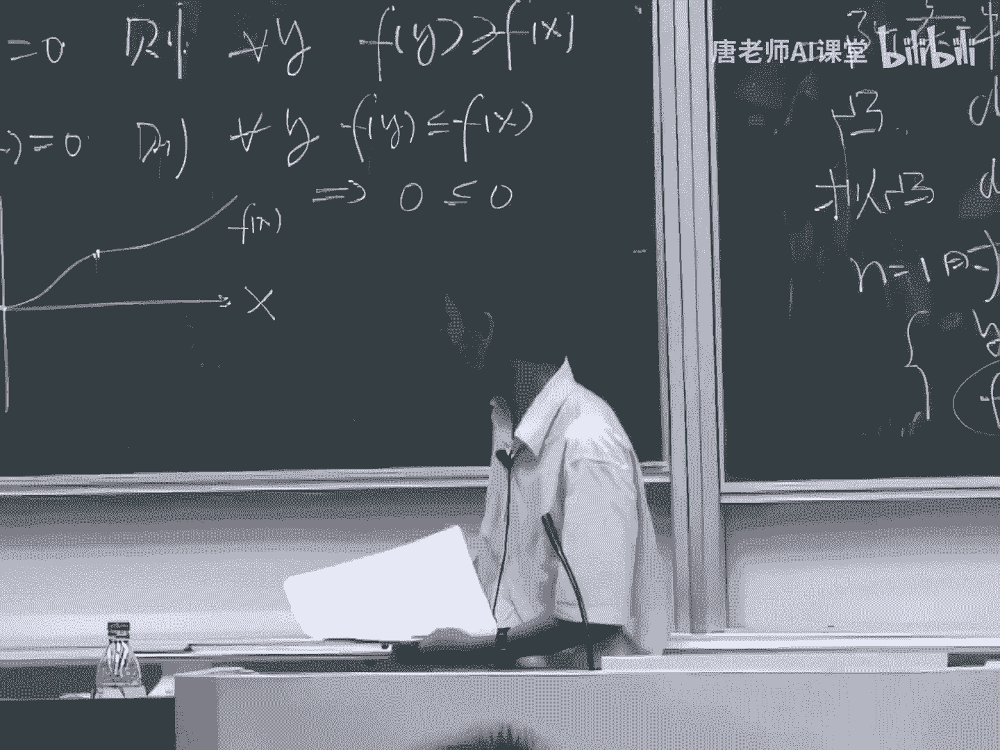

我们还是举一下两个简单的例子。

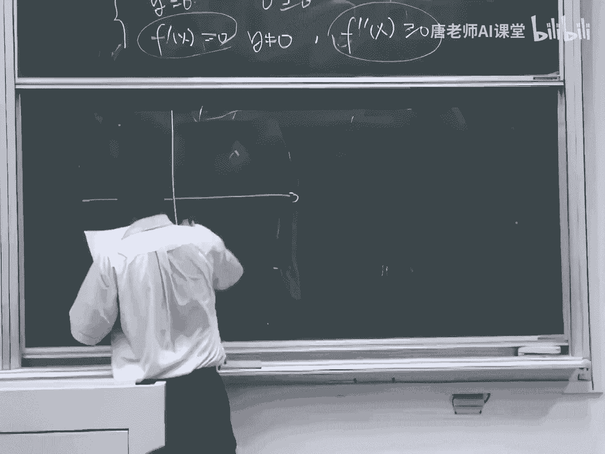

首先让我们来考虑这样一个函数，X平方这个函数，它的这个函数呢既是凸的，又是你凸的，那么我们来看看啊，它在X等于零这一点上，它的一阶偏导应该是等于零的吧，那么在这一点上，他的这个二阶偏导数等于什么呢。

二阶偏导应该等于，如果这是X平方这个函数对吧，这地方就应该等于二了，对不对，那么如果我再给我在看这个函数，看负的X平方这个函数，那么很显然，这个它的一阶偏导还是在X等于零这一点。

它的一阶偏导应该还是等于零吧，但是我们看他的二阶偏导数等于什么东西，等于二了，好我们来看实际上占一点，对于这样一个函数，对于负X平方这样一个函数的话，那么实际上我们就会发现。

这个二阶条件实际上是不是不满足的对吧，因为我对于FX1撇等于零，这一点实际上我没法推出来，他的这个二阶偏导是要大于等于零的吗，至少对于这一点他是不满足的，既然它对于这一点不满足。

那么这个函数一定不是跟你读函数，因为这个阶条件是充分必要条件好，这个没问题吧，就实际上我们可以利用一些条件来判断一下，这个函数不是一个理论函数，那么另外呢我们再来看一个函数。

我们来看一下这个X的三次方这个函数，这个函数是不是你图函数是你出的吧，为什么，因为他的这个阿尔法萨巴拉set全部都是凸起好，那么我们来看看这个函数，中间有一个点是比较特殊的，就是它的一阶偏导数等于零的。

这一点就是X等于零，这一点，那么我们看这一点，它的二级分导式等于什么呢，他的二阶偏导等于什么，还是等于零吧对吧，好，实际上呢，这样一个结论跟上面这个结论实际上是一致的，这是中间是没有矛盾的。

这也就说明为什么这个函数它是一个里头函数，你也可以从这个角度去说明一下这个东西，这一节我们先讲了这个这个凸函数和凹函数，然后又讲了这个凸函数和凹和凹函数，的一种扩展，叫做你突和拟凹函数。

现在呢我们还要再讲另外一种扩展，就叫就这样一个函数，这个所谓的叫叫log concave函数，或者叫log convex函数，这个翻译起来不好翻译，应该就是要对数凹或者叫对数凸吧，这样一个函数。

那么这个函数是一个是凸函数和凹，函数的一种变种，是一个变种，但是这个函数是这两种函数都是非常有意义的，我们来简要的说明一下，好第一个呢是关于这个log concave。

这个函数的定义就是这个对数凹函数定义，我们讲如果一个这样一个函数F它是一个，它是一个对数O的话，那么首先呢我要要求这个FX是大于零的，为什么要大于大于零呢，因为我后面要取个对数好。

那么这个呢是对于任意的X都是，都有这样的要求，另外呢我还有一个要求，就是这个log f这个函数，log f肯定是个函数对吧好，那么这个函数呢我要求是个凹函数，那么这个实际上意义很明显了吧。

所有的log所谓的这个对数凹的话，实际上就是指的是这个函数的对数是个凹函数，对吧，这个意义实际上是非常明显的，同样的我也可以对这个log convex，对于这样一个对数凸去做个定义。

好那么我们为什么要引进这样这两个定义呢，这个实际上是有实际意义的，因为对于很多的问题啊，在实际的这个计算当中，我们会碰到很多的问题，它的这个它会有会有会是某些，含某些这个变量的乘积。

或者是某些函数的乘积，我们知道，就是如果是碰到一些很多的乘积的话啊，我们把这个问题变成一个对数的问题，我们去给两边取个对数的话，这个问题就会变得比较简单了对吧，那么选完对数之后呢。

你就自然会碰到这个所谓的这个，这个到底他是不是这个是不是对数凸，或者是对数凹的这样一些问题，所以呢这这也就是我们介绍这两个概念，它的背景好，但是呢这个东西实际上这个不难了。

我们只要能够说明一下这个log f是凸的，或者是log f是凹的就可以了，实际上是非常简单的事情，那么这里我们只是简单的介绍一下，就是这两个定义啊，跟这个凸和凹之间它有什么样的关系。

好首先呢我想问大家一点，就是如果我告诉你一个函数，它是一个大于零的这样一个函数，它一定是一个他一定是个正的这样一个取值，那么我要告诉你这个函数它是一个凸函数，那么这个函数它是不是一定是。

一定是是是log图的，一定是对对数出的呢，全对数不一定了对吧，比如说比如说FX等于X这样一条直线对吧，我取完log之后，它就变成凹的了，对不对好，那么我反过来，如果一个函数它是一个对数凸的话。

那么它是不是一个凸函数，是还是不是是的吧对吧，为什么，因为我我有我有log，这么一个强大的这样一个东西，在这样一个这么强大的一个算子作用底下，它还能保持一个凸形，那么这个函数肯定还是凸的嘛，好。

好我们来看一下，其实这个事情啊，我们上节课在讲这个函数组合的时候，实际上我们已经碰到过这个问题，对不对，好就是如果F是一个log cvs的话。

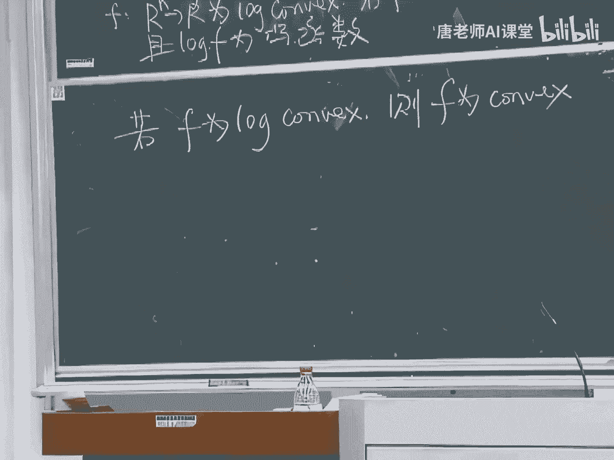

那么那么F1定是convex的，一定有这样一个关系存在的，为什么呢，我们来看一下，F1定是等于等于对于，对这个log f去取个对数吧，呃去取个指数吧，没错吧。

好所以我们看我们现在认为这个log f是个函数，这是一个函数，这是个关于X的一个函数了，那么这个E呢又是一个函数，这是不是一个函数的组合，是不是两个函数的组合对吧，好我们我们要知道这个指数函数呢。

它是一个它是个凸函数，而且呢它又是它是单调不降的一个凸函数对吧，他是个单调不降的一个凸函数，那么我又知道这个log f是一个凸函数对吧，所以很显然他们的组合肯定还是凸的，一定是凸函数。

你们回过头去翻一翻这个这个这个词条规则，就是关于函数组合的四条规则，那么反过来就是，如果一个函数是一个是一个对数凹的函数，那么这个函数是不是一定是个凹函数呢，如果一个函数是对数凹的话。

那么它是不是一定是个凹函数，不一定吧对吧，为什么，因为我们有log这样一个东西了，但是呢但是呢如果一个函数是一个凹函数的话，那么它是不是对数，凹的一定是对数二的，对不对对吧。

当然我们前条件是这个函数一定要大于零的，一定要大于零才行啊，为什么呢，因为我们是用这个log这个函数，把它给把它给掰下去了，啊这个的说明实际上也是非常简单的，我们要说明一下这个这个F是个是个对数图。

是个对数R的函数的话，实际上我们只要说明一下，这个log f是一个凹函数就可以了，那么我们怎么来说明这个log f是个凹函数呢，这里实际上是不是又是一个函数的组合对吧，首先呢我们有一个F了。

然后呢我们又有一个算子，log有个log这样一个算子，我们知道F这个函数是一个凹函数，那么log这个函数呢它是一个它是个凹函数，它这个它这个单调不降的这样一个凹函数，那么我又用一下这个函数的组合。

我就会发现这样一个log和这个函数啊，他肯定是一个凹函数，所以我们就知道F是一个是一个对数凹函数好，也就是说这个这个对数凸呢是是比凸要更强的，图要更强，然后这个这个凹呢是比这个这个这个对数凹啊。

应该要更更强一点对吧，这个就是这个这几种几种函数，几种定义之间的关系好那么讲到这里呢，实际上我就把这一章给讲完了，好我们下一章啊，我们我们现在已经讲了，这个突袭和凸函数的概念了对吧。

下一章呢我们就会把这两者结合在一起，我们来讲一下，如果一个问题的，它的这个目标函数是一个凸函数，他的这个约束的集合是一个突击的话，那么这个问题就是个凸问题，您好。

