# 【比刷剧还爽！】这太完整了！量化交易和python金融分析实战课程，全程干货无废话 入门到精通一步到位！（数据挖掘分析／大数据／可视化／投资／金融／股票／算法） - P81：85. 23.24.凸优化问题，凸优化约束的降维和升维（松弛变量），拟凸优化问题，凸问题(Av526664194,P23) - AI算法-溜溜 - BV1iC411n7XN

好我们来看一看这个函数是个什么样的函数，假设这个每个圈都是等间距的话，这是个什么样的一个函数呢，是一个这是个追函数对吧，这是不是个追函数啊，就是有点像我们喜欢吃这种冰激凌，这样一个形状的，好。

比如说你可以去自己试着给一个冰激凌，去画个等高线，肯定就是肯定就是这样一个形状的，那么如果我假设啊，我考虑一个没有约束的一个问题，你知道这个问题是个凸的问题，这个问题一定是个凸的问题。

那么呢如果他是一个，如果他的这个可如果它的这样一个可行解，解压是整个的这样一个时空间的话，那么它的最优解是哪一点呢，它自由解释哪一点很简单嘛，就这么一点对吧好，我们来看看啊。

这一点是不是满足这样一个性质，在在这个可行解析里面。

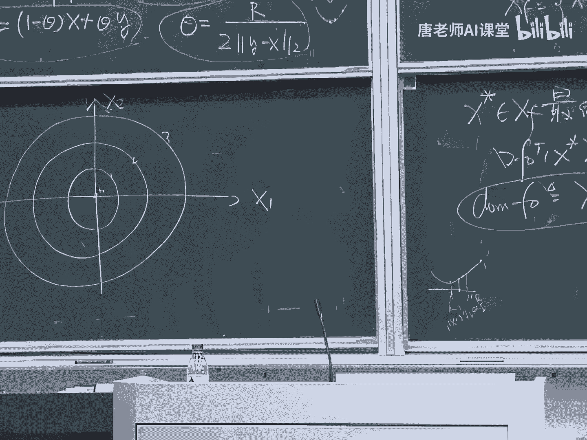

任意一点任意任意的一点Y，那么我是不是一定都是能满足这样一个性质呢，是不是一定可以满足这样一个性质，对于任意的Y我这个不等式是不是都是满足的，当然我们假设一下这个问题是可悲的对吧。

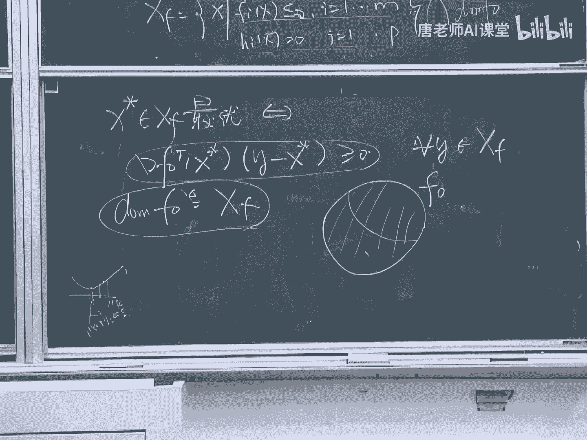

也就是说你的这个冰激凌的这个尾巴，这个东西不是尖的，是圆圆的这样一个东西，必须要做一个这样的假设，那么这一点他的一阶偏导数等于多少，等于零吧对吧，他一阶偏导等于零，既然它的一阶偏导等于零的话。

那么这个不等式是不是一定满足的，这个不等式就变成等式了吗，它一定是满足的，对于任意的Y都是满足的好，那也就是说如果我的目标函数是可微的。

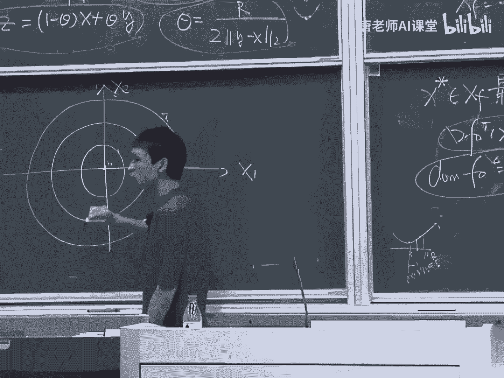

而且呢我能够使得我的这样一个一阶，我能够找到一个一阶偏导等于零的这样，这一点，我能够找到一个一阶偏导等于零的这样一点，而且我保证这一点是在我的这样一个，可行域里面的话。

那么这一点一定就是我的这样一个全局，最优解了，没错吧，好，这个实际上也就是一阶条件给我们讲的。

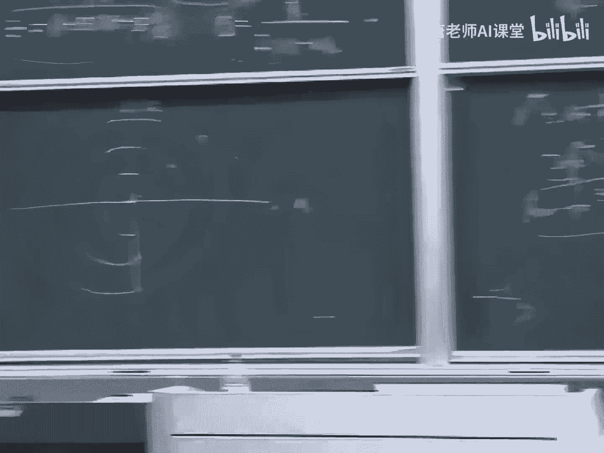

第一件事情，就是比如说吧，假设我是一个无约束问题的话，那么我就可以很容易地去找到这样一个最优解，那么下面我们把这个问题再稍微搞复杂一点，好假设我的可行解集呢是一个这样的集合，这个集合仍然还是个突击。

那么我的最优解是哪一点呢，不变嘛，对吧好，因为我对他去求一个一阶偏导，我发现这一点的一阶偏导数等于零的，而且我发现我的运气非常好，就是他这一点呢，仍然是在我的这样一个可行解集里面，那么这一点。

自然就是我们的这样一个全职自由解了，这也是没有问题的，那么下面呢我们把这个问题再搞复杂一点，啊我的可行剪辑还是个突击，那么我的自由解在哪一点，就在这一点吧，好那么我们来验证一下啊。

这一点是不是满足这样一个性质的，这点是不是满足这样一个性质，首先我们来看一下这个，假设我们的X型是在这一点，那么我要给他去找一个这样一个切线的方向吧，那么这个切线的方向是哪个方向呢，呃不是切线方向。

应该是叫这样一个这样一个梯度方向啊，那梯度方向应该是一个什么方向呢，就首先呢我要去画一个这样一个，以这点经过这一点这样一个切线对吧，这是一个切线，那么跟这个切线垂直的一个方向，这就是它的基度方向了吧。

好有同学会问，为什么不是朝里面呢，为什么不是朝里面，因为它是个梯度方向对吧，要往上去嘛，这个梯度方向，所以呢这个方向就是我们这样一个德尔塔F，得到FXF0X七这个方向，那么啊这样我们来验证一下。

这样一个不等式是不是一定是满足的，也就是说呢，我要对于任意的YY在这样一个集合里面，我都要去验证一下，它们的内积是不是一定是大于零的，那么我们的Y是个什么东西呢，比如说吧我可以任意的去选择这样一个Y。

这一点，这个向量就是我们的Y减去X星这个向量吧，那么它的内积是不是是不是大于等于零呢，一定吧，也就是说它的这样一个角度啊，它们之间的这个夹角啊，一一定是小于等于90度的吧，那一定是小于小于等于90度的。

那么是不是对于这样一个初级的话，它的这样一个夹角，一定都是小于等于90度的呢，一定的，否则的话我就不能做出来这样一个缺陷了对吧，不然的话我就不能做出来一个，首先呢是要跟这样一个。

首先首先是要跟这样一个集合去，它的一个边缘区是相交的，跟这个图集是相交的，其次呢，我要跟这样一个跟这样一个等高线呢，就相切的这样一条线，就是如果啊如果假设我这地方有一个Y的话。

假如假如我有我有某个Y出现在这里的话，那么很显然我的集合应该变成什么样子呢，我的集合就不可能是这个样子，我集合应该是这样，像这个样子了对吧，我这集合必须要延展到这个地方来，我才能有这样一个Y。

那么既然我的集合延展到这边来之后，那么很显然我的切线应该就是要往这边去切了，我我的切线的一点就不能切在这一点上了啊，没有问题吧，这个都是一些非常简单的几何上的概念。

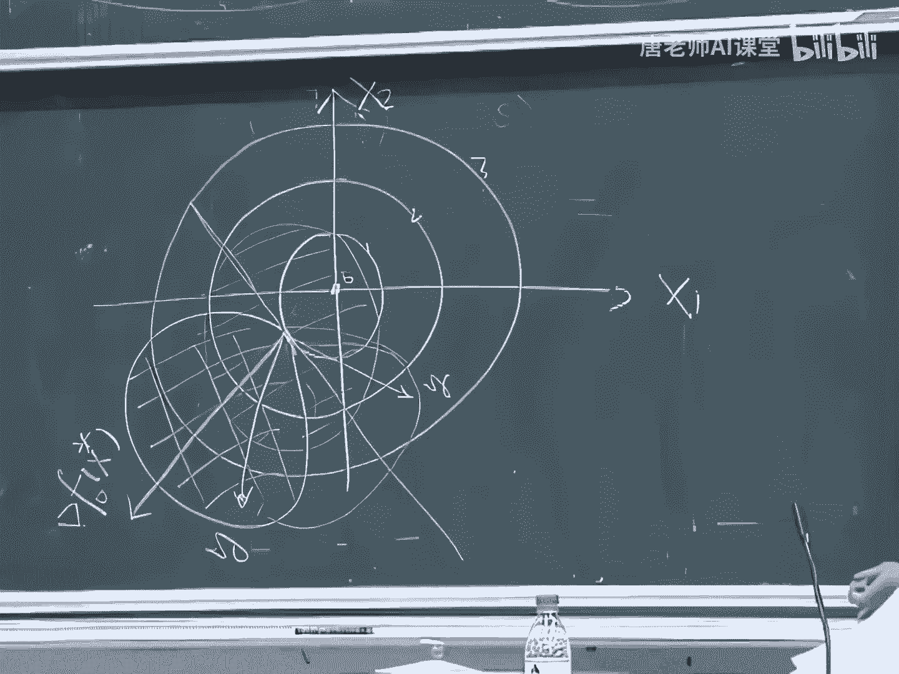

下面呢我们再来举个例子，就是我们的这样一个凸问题呢，它的目标函数是可微的，而且呢它只有等式的约束，只有这个等式的这样一些反射的约束，为了简单起见呢，我们就我们就令这样一个F0。

那它的定义就是整个的这样一个N维的时空间，这样这样分析起来更简单一点好，那么我们来看一看呢，就是在这种情况下，我们的这样一个自由性条件，会变成一个什么样子的。

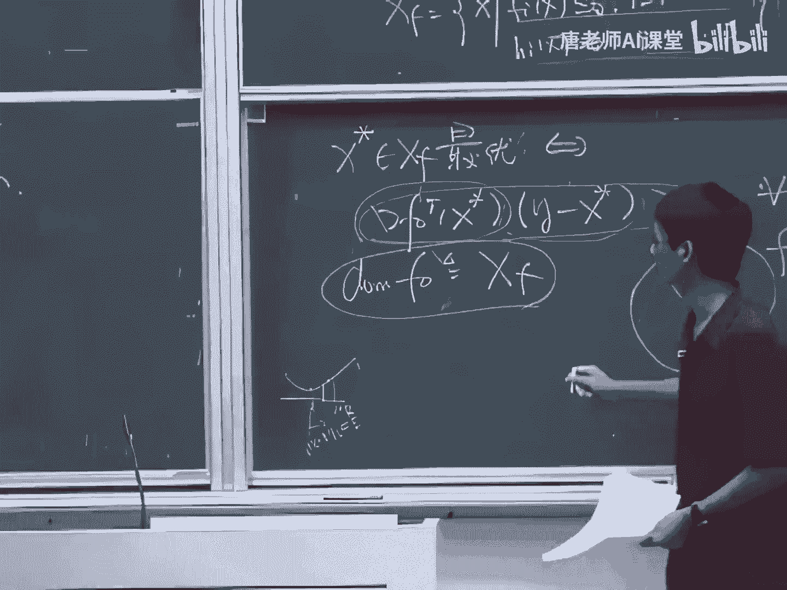

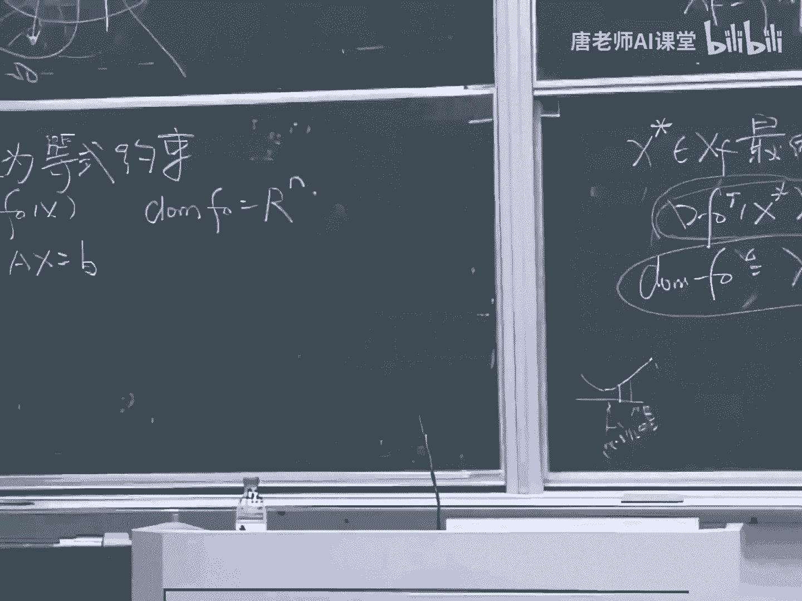

我们来考虑一下，假设有个X这个X是一个可行的，也就是说它满足这个ax等于B，这样这样一个约束，那么这样一个X它如果是最优的话，他一定要一定要满足这样的条件嘛对吧，也就是说呢我对于这个Z的Y。

这个Y呢是能够使得AI等于B的，他一定是满足这个条件的，就是对于任意的Y呀，这个AY等于B他一定满足这样的条件好，那么我们看看从这个条件可以推出来什么结论，从这个条件呢它可以推出一个结论的。

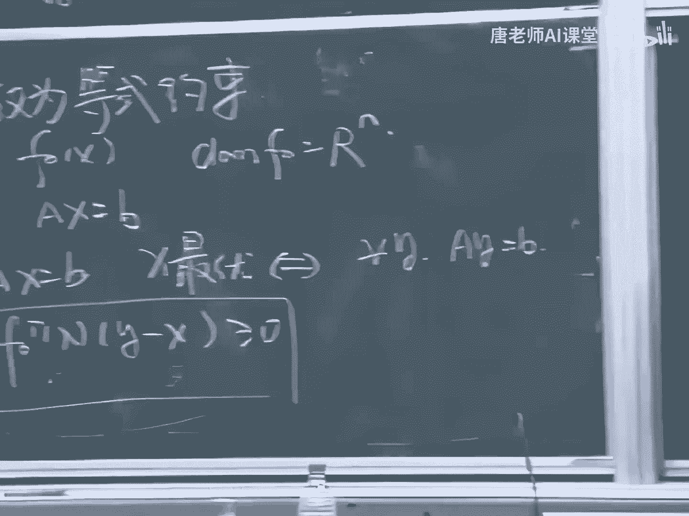

那么我们来看一看啊。

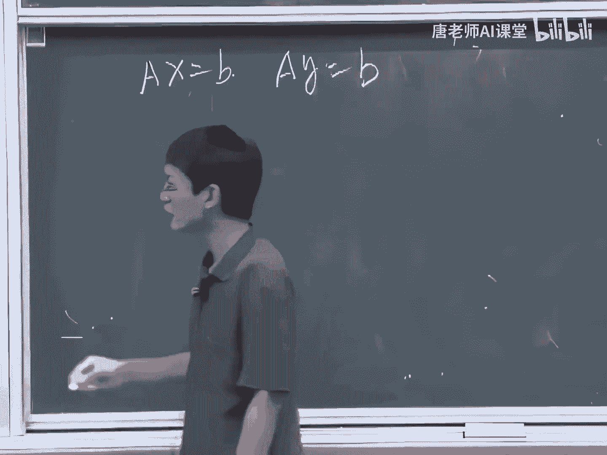

既然这个ax是等于B的，AY呢也是等于B的，那么X和Y之间，是不是存在一个一个简单的一个关系，一定是一定会存在某种关系吧对吧。

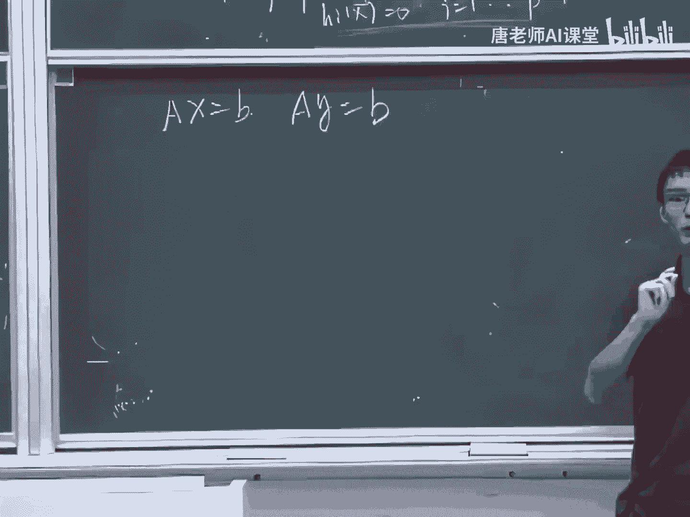

这是我这个关系，我可以这么去写。

也就是说我的Y1定是等于X来加上一个。

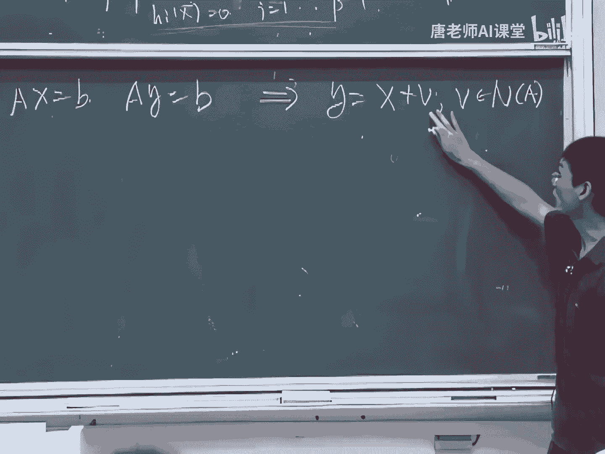

来加上一个向量的，这个向量呢，是这样一个空间里面的任意的一个值，这个空间就是A的叫化零空间，就是A的零空间，这个没有问题吧，为什么呢，就是所谓的A的零空间，意思就是你对于Z的这样一个V的话。

你左边乘上一个A这个值一定都是等于零的，那我们来看一看啊，如果把这个两边都乘上一个A的话，我们来看看这个AI是不是就等于ax等于B了，对吧，所以对于这个Z的Y啊，只要它满足这样一个性质。

那么它一定就可以有这个Y等于ax加上V。

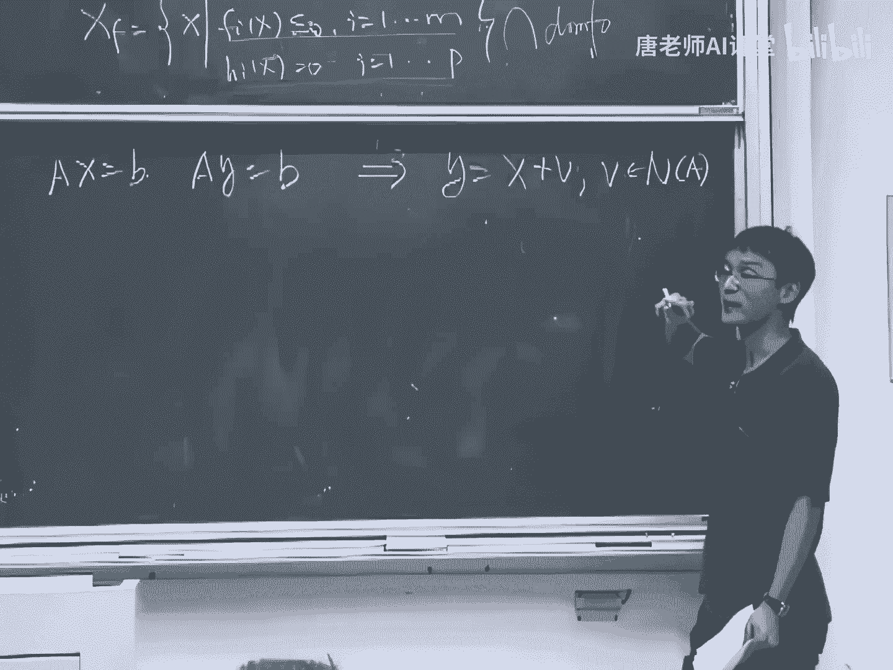

一定是一定是有这样一个性质的，那么反过来呢，就是我既然这个Y是任意的，满足这个AI等于B的这样一个Y，那么实际上这样一个V啊，也就是在整个空间里面变化的，在整个的这个化灵空间里面变化的，它实际上是。

实际上这个实际上我如果遍历这样一个V的话，我就可以得到所有的单就歪了好，那么有了这一点之后呢，我们就可以来进一步的分析，那么既然这个性质是满足的话，那么我们再把这个Y等于X加V把它给带进去。

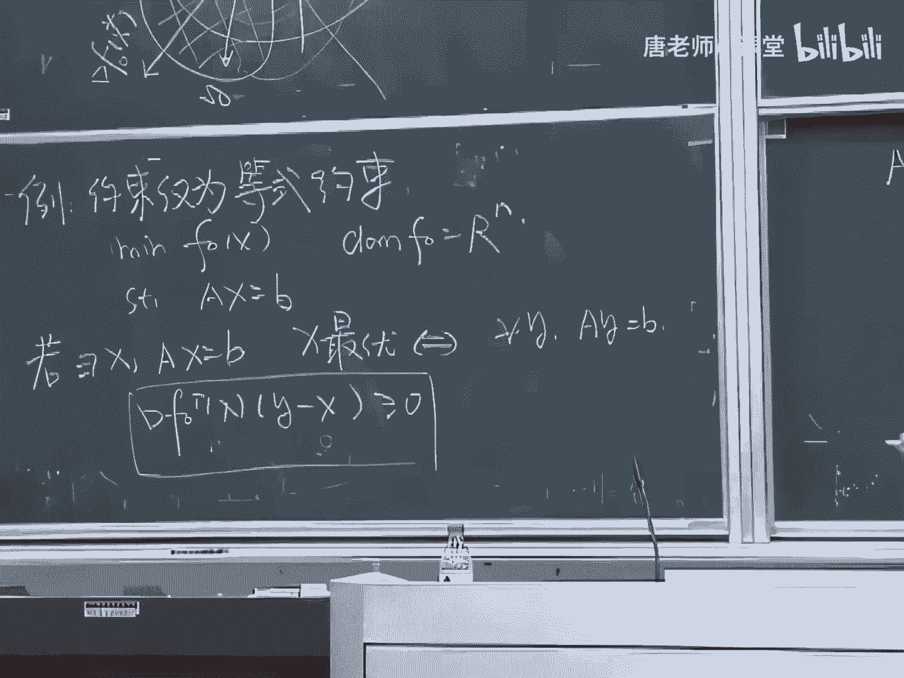

我们看看可以得到什么结果呢，好也就是说对于Z的V，这个V呢是在这个空间里面的这样一个个，在这个化零空间里面一个点。

我都能够使得这个F1X的一阶偏导，和这个V的内积是大于等于零的，这个性质，好像这个结果好像看起来也不奇怪对吧，但是呢这个实际上是对于这个德尔塔F0X啊，实际上是一个非常非常强的一个要求，你想啊。

就是这个V呢是这个空间里面的任意一个向量。

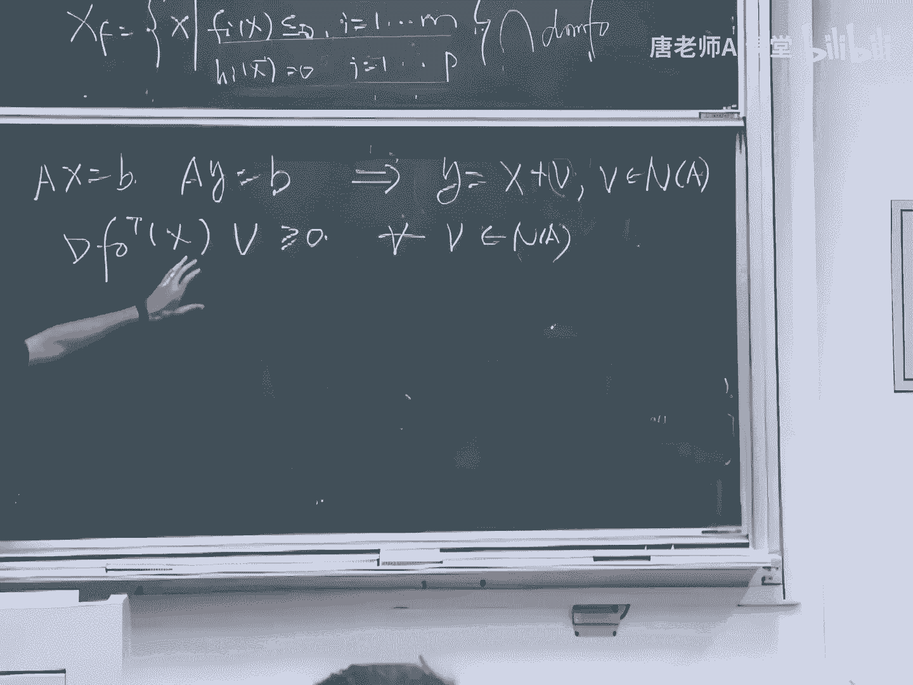

是这个空间里面的任意一个向量好，那么现在我要使得啊。

我要使得我的这样一个德尔塔，这样一个DF0X要能够跟这个空间里面，任意的一个向量，它的这个内积都要大于等于零的，这个事情容易不容易达到呢，这事情容易不容易达到呢，比如说我来我来举个例子啊。

假设我来考虑一个这种比较简单的，我来考虑一下这个V呢，就是装满了一个一维的空间，好，这个呢就是我的这样一个V所在的这样一个，一维的空间，那么我假设了我的这个整个空间，是个二维的情况了。

那么在什么样的一个情况底下，我才能找到一个这样一个DF0，X使得它对于Z的V这个V可以是正的，可以是负的，也可以是零，都能够使得这样一个式子满足呢，很显然我应该使得什么东西呢。

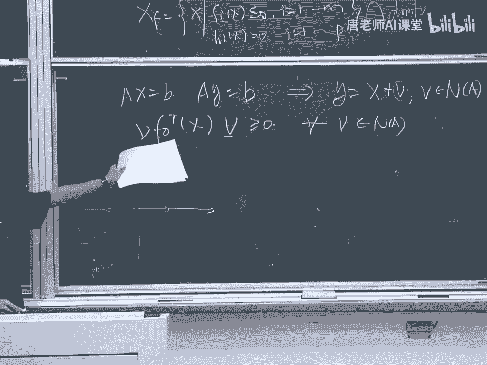

比如说啊比如说我的这样一个DF1X，如果是一个如果是这样的方向的话，那么满满不满足不满足吧，因为它们之间的交角，它是它是大于90度的嘛对吧，那么最后我我只会有一个什么样的结果呢，就是就是这个东西等于零。

或者这个东西等于零对吧，为什么，原因，就是，因为这个V实际上是装满了整个的子空间的，这个V是装满了整个子空间的，那么这个内积大于等于零的条件，只有在两种情况下，它是满足的，第一个呢。

就是你的这个子空间退化成一个零点了，你的子空间退化成为一个零点了，那么你任何的这样一个方向都是可以的，这都没有问题的，第二个呢就是你的这个子空间呢，的确是个子空间。

但是呢这样一个梯度啊变成一个零点了对吧，只有这两种情况，底下这样一个不等式才是满足的，可以理解吧，啊抱歉，我讲错了一件，讲错了一件事情，讲错了一件很重要的事情，不应该是不应该是这样的。

应该是讲这个这个德尔塔FX啊，不是说一定要变成零，它实际上是要跟这个空间是正交的，对吧对吧，只要正交的话，那么这个这个等式一定是成立的吧，好所以也就是说呢我的这个德尔塔F0X呢，一定是要跟这个空间。

是跟这样一个子空间是正交的，跟这个化零空间是正交的好，那么我们把这两种情况都给分析一下，第一种情况就是这个如果是V等于零的话，那么V等于零意味着什么东西呢，V等于零意味着就是我的。

我的我的Y1定是等于我的X，我的Y1定是等于X，那也就是说呢，我的这个ax等于B1定是只有一个解吧对吧，这也就是说这个A是可逆的，那么既然是A是可逆的话，那么我的可行解空间，实际上也就退化成了一点了。

对吧好，也就是X等于A的逆乘以B这样一点了，所以很显然这样一个解，就是个就是个全局最优解，这是没有问题的，因为你这个这个集合里面只有这样一个解嘛，所以它自然是最优的了。

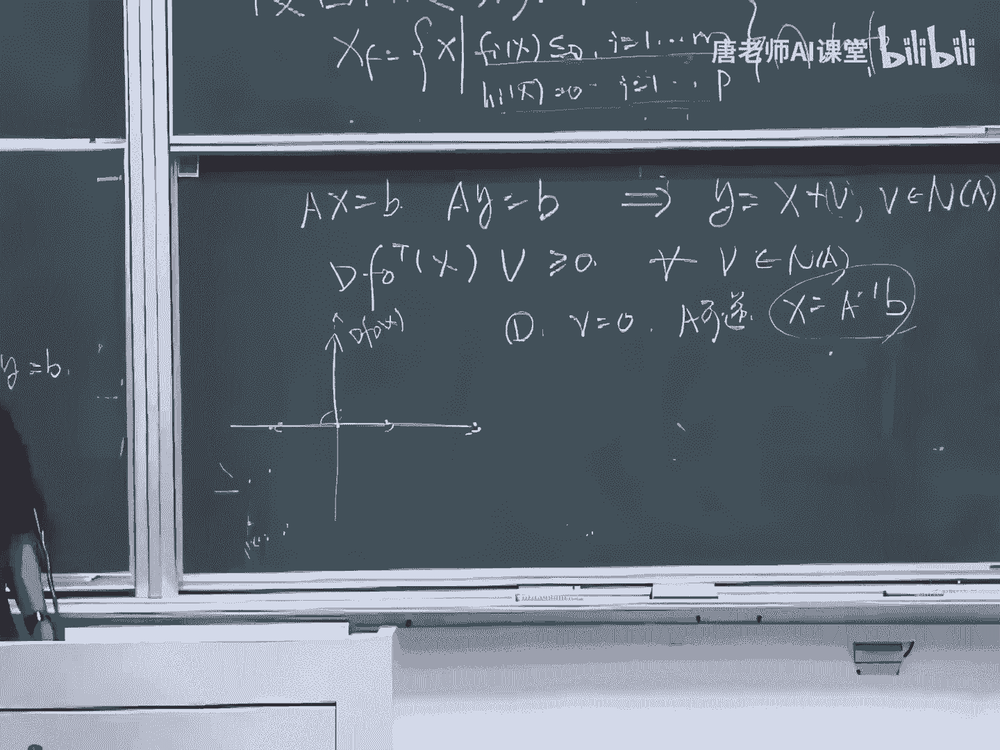

好，第二个就是我要使得这样一个使得这样的方向，要跟这样一个跟这个空间是正交的，那么既然它是正交的话，那么这个不等式一定是成立的，因为这样一个等式一定是成立的，好我们还是来画个图来说明一下。

同样的我们还是用这样一个函数，但是呢我们这个约束啊，是有这样一个是有这样一个等式约束的，是有一个这样一个线性的约束的好。

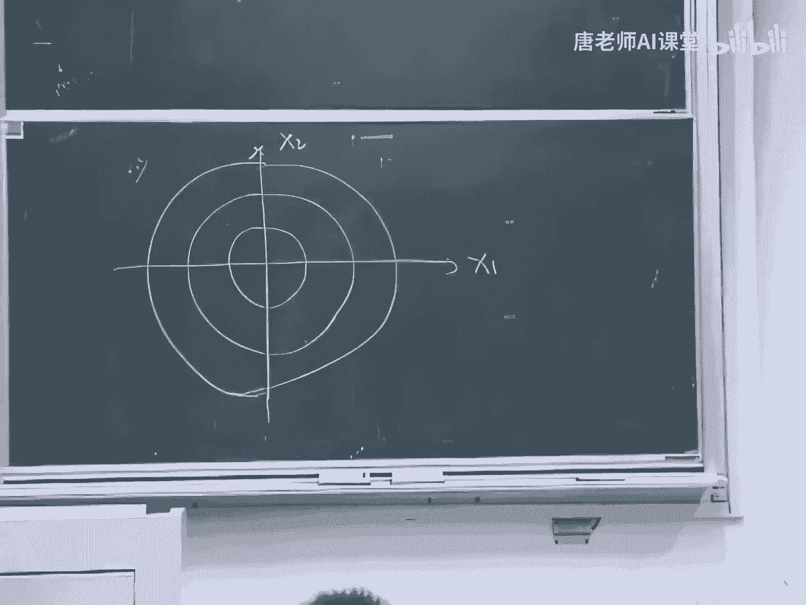

那么既然它是线性约束的话，我可以把它给画成这个样子吧，这个是这个线画的不好啊，好我这样来画一条线，可以吧，在这个二维空间里面，我就假设这个ax等于B，我假设就是这样一条直线的话，这没问题吧。

这是一个仿射的这样一个这样一个集合吧，好那么在这样一个约束底下，我的这个函数，能够使得我的函数值达到最小的一个点，是哪一点呢，就这一点吧对吧，因为我来比比比看嘛，就是我从这条线从这一端来搜索到这一端。

我发现这个从这儿到这儿呢，这个值是慢慢降的，好降到这一点之后呢，它的值就不能再降了，然后到点之后呢，它的值就继续上升了，所以这一点呢应该就是它的这样一个，这样一个极小值点，对吧好。

那么我们来看看这一点呢，它是不是满足上面的一个性质，那么首先呢我们知道，既然这个ax等于B，它是它是一条直线，那么很显然这个A就是不可逆的，因为如果它是可逆的话，那么这个约束就退化成一点了嘛。

好所以呢这个ax等于B呢，他肯定这个肯定是不不是只有一个唯一解的，它是有无穷多解的，那么我们来看一看啊，这个ax ax等于B，它所对应的这个A的化零空间，是一个什么样的空间。

这个A的化零空间是个什么样的空间，肯定还是条直线，对不对好，而且这条直线我可以写成一个什么样的方程呢，就是ax等于零，对不对对吧，什么叫划定空间呢，就是对于这个任意的X对，这个空间里面任意的一个X。

我都可以使得这个A乘以X等于零的对吧，这个就是我的化零空间，很显然它就是一条跟这个ax等于B平行的，这样这样一条直线了，这就是我们的我们的空间了，好我们来看一看这个最优解，我从这个最优解出发。

他的这样一个梯度的方向是什么方向呢，它的梯度方向是一个这样的方向吧，是一个跟这样一条切线垂直的一个方向吧，对吧，这个就是我们的德尔塔X0X吗，这样一个方向，那么这个方向是不是跟这个子空间是垂直的。

是的吧，因为它是跟这两条线是垂直的，所以呢这两条线就是平行线，所以它自然也是跟它是垂直的，这是我们小学的时候就学过的概念，对不对，非常简单。

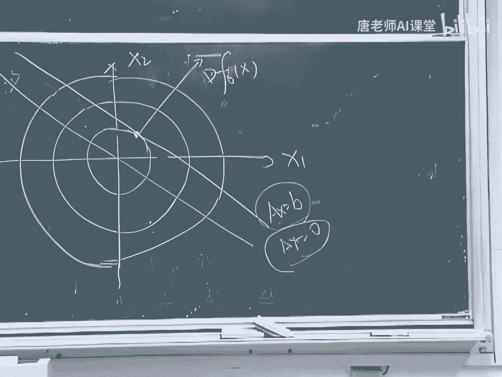

下面我们再讨论一个例子，就是这个约束只有这样一些非负的约束。

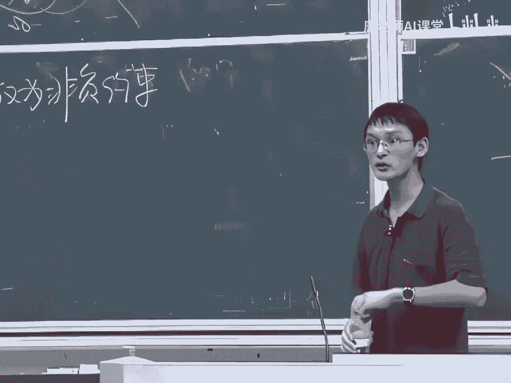

也就是说呢我要极小化这样一个FX。

同时呢我要使得这个X的每个分量啊，这个X的每个分量都要大于等于零的，是要在这样一个正的空间里面，在这样一个正的，这样一个这样一个子空间里面的啊。

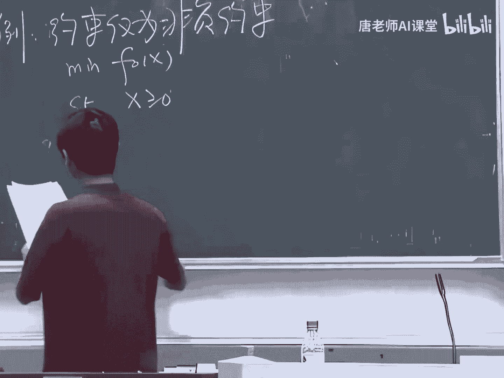

好，那么如果我有一个这样一个X是大于等于零的，而且我知道他是最优的，那么它的等价条件是什么东西呢。

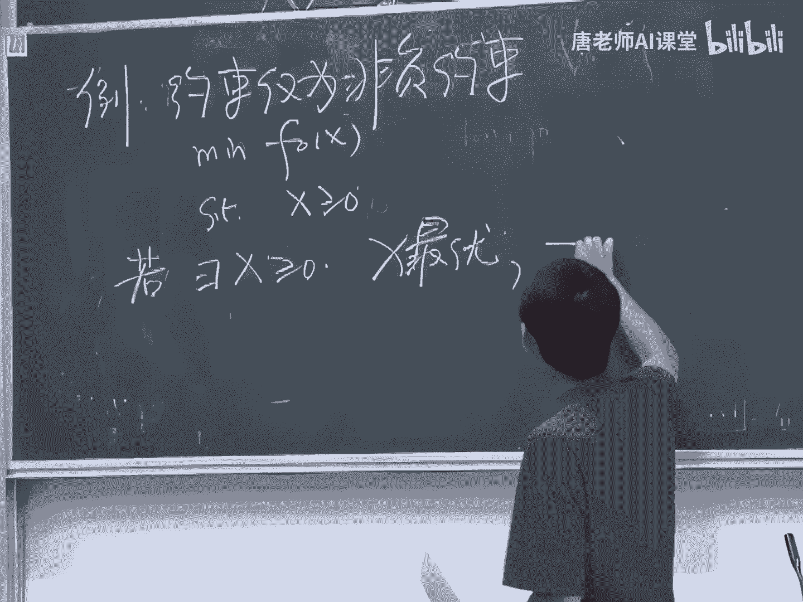

我就可以同样的把之前的这样一个这样一个，一阶条件呢，把它给用进去。

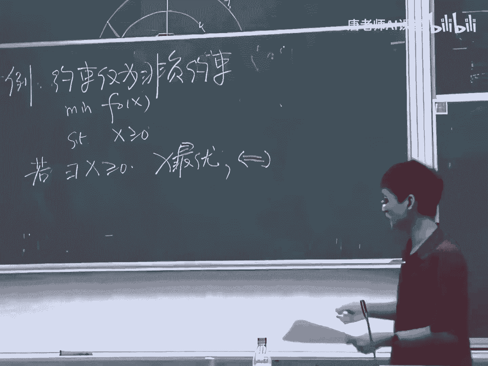

也就是我对于Z的Y这个Y是大于等于零的，我一定都有这样一个F0X的这样一个梯度，和这个Y减去X内积一定要大于零，我把这个概念重新重复了一遍，但这里呢我把这个式子我把它给解开。

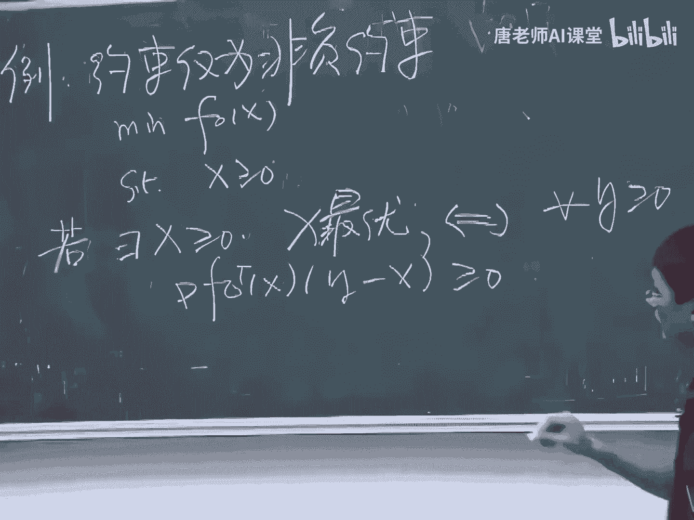

我把这个式子给拆开了一些，我把它写成这个德尔塔F0X和Y的内积，减去这个DF0X和X内积，它两者之差一定一定是要大于等于零的，这个也没有问题吧，首先呢我们来分几种情况来讨论一下啊。

就是如果这样一个德尔塔F，0X是小于等于零的话，就说我存在两个X这个X是个最优的。

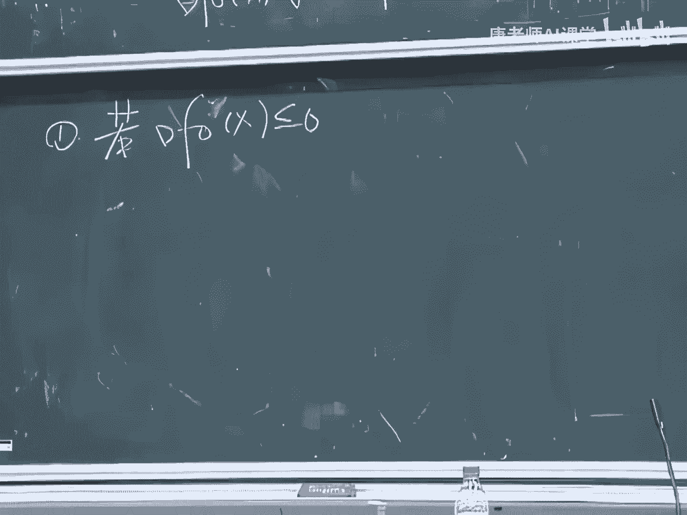

同时呢，又能使得我的这样一个德尔塔X，0X是小于等于零，也就是它的每个分量全都要小于等于零，那么会发生什么事情呢，你们看看会发生什么事情呢啊，对于任意的Y这个X是给定的，X已经给定了。

对于任意的Y上面这个式子都要满足的，那么那么会有什么，会有什么样的后果，那么很显然我的Y应该要满足一个条件，也就是我的这样一个FXFX的这样一个梯度啊，和这个Y的内积，和这个Y的内积必然可以取到无穷小。

是必然可以起到无穷小的对吧，因为我的我的Y是任意的，Y是任意的，大于等于零的，对不对，没错吧，因为应该这么讲，就是这地方如果是应该是小于零对吧，如果它小于零的话，那么这样一个值一定是可以取。

是取到无穷小的，没有问题吧，啊，既然这样的话呢，那必然有这样一个DF0X是要大于等于零的，没错吧，就是我的这个X啊，一定是要满足这个条件的，一定要满足这个条件的，否则的话，我的上面这个式子就不可能。

对于rain的Y全都要成立了吗，我我至少要满足这个条件对吧，有没有问题有问题，有没有问题没有问题吧，好那我们来看一看啊，我们把这个思路重新整理一下，就首先呢我们现在已经有了一个。

现在我已经有了一个X了吧，我已经告诉你一个X这个X是个确定的值，而且我知道它是它它是大于等于零的对吧，那么现在我要验证一下，就是就是对于任意的Y，对于Z的Y这个式子是不是成立的。

这个Y是大于等于零的对吧好，那么我们来看啊，这样一个式子大于等于零，它的在我给定X的情况下，这样一个式子大于等于零，它的这样一个必要条件是前面这个式子，前面那个式子应该要大于等于零吧。

否则的话后面那个式子一定是不成立的吧，对吧好，就是前面的式子一定要大于等于零，那么前面这个式子大于等于零的话，那么我们来看啊，我现在已经有了一个X，国内已经有了这样一个X，也就是说也就是说呢。

我的这样一个这样一个一阶梯度啊，我已经给定了我的一阶梯都已经改好了对吧，假设就是这么一个方向好，那么现在呢，我要对于这个里面的任意的这样一个Y啊，对于这个任意的Y大于等于零，我都要使得它大于等于零。

我们讲这是一个关于Y的一个方式的函数，这是一个关于Y的仿射函数，对不对对吧，那么一个仿射函数，如果当这个如果当前面那个系数中间，如果当这个前面那个系数中间呢，如果有，那有那么一项是是小于零的话。

如果有那么一项是小于零的话，那么我自然就可以使得它取取向无穷小吧，对不对，所以有没有问题，这个方程函数我可以把它展开成这样的形式，假设我把这个向量给写成A好吧，我写成一个A这样一个向量。

那么这个这个函数是什么东西呢，就是这个我也写成这个AY乘以Y，YI的一个求和了对吧，我知道这个所有的这样一些YI全部都要是大于，全都要大于等于零的吧，没错吧，好而且这个Y是可以任取的。

是在这个大于等于零这样一个空间里面，是可以任取的，那么为了使得这个式子大于等于零，对于任意的这样一些Y都要满足，那么我必然所有的A全部都要大于等于零，没错吧，否则的话我一定是可以取到一个反例的嘛对吧。

比如说我可以假设啊，假设中间某一个分量是小，假设某一个分量是小于零的话，那么我可以把这个Y中间的这个对应的分量呢，给制成一把，它其他的分量呢给全都给制成零对吧，这这是可以的吧。

因为这个Y1定是大于等于零的吗，那么这个量一定是小于等于零的，一定是小于零的对吧，所以这个式子就一定不成立，也就是说呢我必然要满足，我必然要满足这样一个式子，也就是这个德尔塔F0X啊。

一定是要大于等于零的，否则话上面那个式子是一定不成立的，没错吧，也就是说上面这个式子是对于任意的Y，对于任意的Y呀，它它都是不能保证成立的，啊还有没有疑问，这个这个同学们可以自己回去再想想看啊。

但我想我这边这个逻辑可能写的，可能写的不对的吧，应该这么讲啊，就是，应该讲就是存在某一个I，如果存在某个I，使得这样一个它的梯度的，这个分量是小于零的话，那么我一定可以使得它取到无穷小对吧。

这样一个这这个逻辑就没错了，因为这样一个形式，这样的情况一定是不成立的，所以我必然有它所有的分量，全部都是大于等于零的，这个逻辑就没问题了，好我们接着再看下去好不好，我们来看啊。

就是上面呢既然有了这样一个有这样的条件，就是对于Z的Y这个不等式都是成立的，那么我来取一个特殊的一个Y，就是我把这个Y啊给取成零，这个没问题吧，我把这个Y取零，那么就有一个什么条件呢，就有个什么结论呢。

也就是说我必然有边有这样的结论，我必然是有这样的结论，就是这样一个这个F0X它的这个一阶梯度啊，和这个S它的内积是小于等于零，是小于等于零的，没错吧，这个结论我相信都没有问题吧。

我任意的去去上取上某个Y，我就把这个Y给取成零就完了吗，那么现在呢我把之前的两个结论，把它给放到一起去，就是这个结论是这个FX它的这样一个梯度啊，一定是要大于等于零的，另外呢我还有一个要求。

就是X1定是要大于等于零的对吧，因为我要求这个X必须要是一个可行的嘛，我要加X必须可行，所以它肯定是大于等于零的，这两个条件呢，这分别是我们这个第一个条件，和我们这样一个最原始的这样一个。

对于可行的要求条件好，那么既然这样一个式子一定是，既然这个式子一定是成立的，那么我们来看看啊，我把这两个东西给做一下内积，这个内积应该是什么东西呢，两个两个非负的向量的内积，一定是大于等于零的吧。

诶那么我们来看一看啊，我们来看一看一个东西既是小于等于零，又是大于等于零了，所以我们就知道它一定是一定是等于零的吧，它是不是一定是等于零呢，他一定是等于零的，那么这样一个东西的内积啊。

我们看它的每一个分量全部都是大于等于零的，而且我又知道它的内积是等于零的，那么这个前提条件是什么东西呢，这个分量我把假设我这个向量我把它叫做A，这个向量叫做XA和X的内积等于零。

而且我又知道这个A和X的每个分量，全部都是大于等于零的，那么它的条件是什么东西呢，就是对于每个对应的分量，我的A和X中间必然至少有一项是等于零的吧，然后另外一项是大于等于零的，没错吧。

这一定要满足这样的条件，才能使得它成立的好，所以呢我们把这个所有的这样一些条件呢，把它放到一起，我们可以得到这样一个结论，也就是说我的这样一个，如果我的X是一个最优解的话，那么它一定满足这这样三个条件。

一定满足这三个条件，这个呢是一个这个是一个必要条件，但是实际上我们也可以证明这是一个充分条件，就是说如果你满足这三个条件的话，那么它一定是之前这个问题的最优解，这个实际上是等价的，这个条件呢有个名字。

有个有个名字叫做叫做松弛，叫做互补条件，这叫互补条件，为什么叫互补呢，就是说呢你的你的这个X啊，和这个F0X的梯度之间呢，每个分量必然有一个至少有一个是要等于零的，也有，当然你也可以两个都等于零了。

所以这个东西叫做互补，就是或者你等于零或者五等于零，反正咱们两个之间至少有一个要等于零，所以一定要这样互相补充起来，这个实际上是一类很很重要的问题，呃，在这个在70年代到80年代。

有有很多人呢都在研究这一类的问题，就是这种这种很简单的形式，但是呢你如果把上面这个问题呢，我们的目标不是要求在上面，那个问题的最优解嘛对吧，如果你能够把这样一个问题的形式，给写成这样的形式的话。

实际上你在求解的时候，你会变得有的时候你就会非常变得非常简单的，因为你看上面这个式子，看起来好像感觉怪怪的对吧，你要找到一个极好的这样一个东西，然后要使得这个X大于等于零，这个条件感觉好像好像很奇怪的。

但底下那个不就是一些什么等式不等式吗，你不就是在解一些那种这种，类似于方程的这样一个东西吗，解方程总是比这个要容易吧，这个就是为什么说研究这样一个互补条件，是一个很重要的一件事情，实际上这个互补条件。

就是从从我们这一阶条件里面过来的，直接衍生出来的，好这么讲可能还是太抽象了，我们还是来画个图来看一下好吧，好假设呢我们这个目标函数是这样的形状，就是我把之前的这个函数啊把它做了一下位移。

把它的这个最小值点给挪到这个位置上来了，好所以我们我们来看的就是，如果我们有一个正约束的话，如果有正约束的话，也就是说我的这样一个我的解空间，应该是在我的可行解空间呢，应该是在这个上面那个半空间对吧。

这样占1/4的空间里面好，那么我的最优解在哪里呢，我的最优解在哪里，这一点上吧，这就是我们的最优解吧，因为它能够使得我的这个等高线是到达最低的，好，那我们来看一看啊，这个点他满足一个什么样的性质。

首先呢我们看这一点啊，它是它的X1这个这个方向上面，他应该是大于零的吧，X2呢等于零啊，好，然后我们再来看一下，它的这个切线的方向是哪个方向，这个方向吧往上去了吗，好那么在这样一个切线方向。

我们来考虑一下它的这样一个切线方向，他的第一个方向上面它的值是多少呢，在X1这个方向上面，他的这个值是多少零吧对吧，因为它是跟它是垂直的吗，那么在这样一个X2这个方向上面呢，它的取值是大于零的对吧。

这个值是大于零的，所以我们来看一看它们两者之间是不是互补啊，如果他是大于零的话，那么它必然是等于零的，如果它是等于零的话，那么它是它就不等于零了对吧，这个就是我们讲的这样一个互补的条件。

这两者之间是互补的，你如果同时满足这些条件的话，那么你的这个解就是最优解，你们自己可以去验证一下，你在这样一个空间里面找，找不到其他的解，满足这样一个条件的。

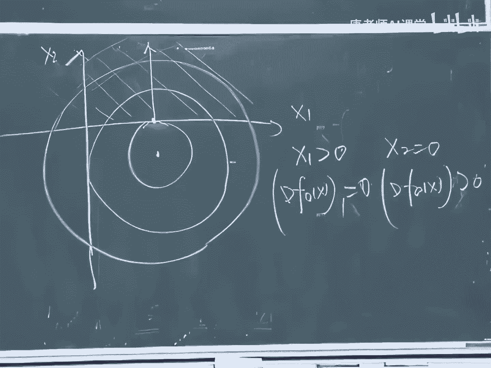

好我们再来看一看，就是有一类典型的凸问题，凸优化呢实际上实际上中间有很多类的问题，那么我们比较熟悉的，可能有的人就比如说这个线性规划的问题啊，二次规划的问题啊等等等等，对线性规划这个词都听说过吧。

线性规划实际上就是这个图规划的一种，那么这里呢我们来给一个这样一个，线性规划的一个定义。

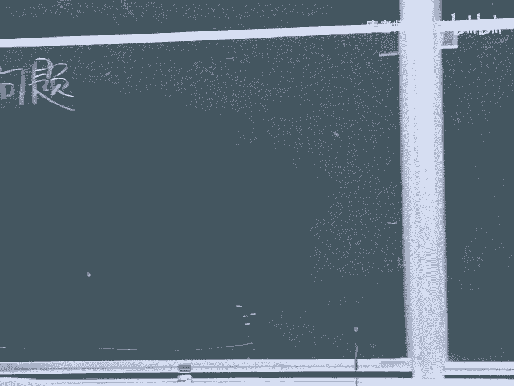

好一个线性规划问题，总是可以写成这样一个形式，就是我的目标函数啊，我之前我的目标函数是一个F0X吧，我的这个F0X可以写成一个一个，C和X的内积，再加上D这样的形式。

其实呢这个C呢是一个N维的这样一个向量，D呢是一个常数，好这是我的目标函数，然后呢我的不等式约束是变成什么样呢，我的不等式约束这个FIX小于等于零，变成什么样呢，变成这个GX小于等于H。

或者是说这个GX减H小于等于零，那么这里这个G啊，是一个M乘N维的这样一个矩阵，H呢是一个，H呢是一个是一个是一个MV的这样一个向量，好，然后这个我的这个等式约束是这个ax等于B。

A呢是一个K乘N维的一个向量，而且呃AK乘N维的这样一个矩阵，这个B呢是一个K为的一个向量，也就是说呢我有M个不等式约束，有K个等式约束，好，我们来看看这个问题是不是一个凸问题，视图问题吧。

为什么反射反射反射，所以它必然是凸的，必然是凸的，必然是仿射的对吧，非常简单，这个呢就是一类，这是一类非常特殊的图问题，所以出问题呢，就是我们所谓的这个线性规划问题呢，就是我的目标和约束均为线性的。

这样的问题叫做叫做线性规划的问题，线性规划这个词这个英文名叫linear program，这个词表示的是一个叫线性规划的问题，就是这样一个问题，我把它叫做叫做LINUPROGRAM这样一个问题。

那么什么东西叫做线性规划呢，就是如果我要做线性规划这个事情，我应该怎么写呢，叫做linear programming，我上面呢是表示一个线性规划的问题，底下呢是表示我在做这样一个，线性规划的问题啊。

这两者的区别一定要搞清楚，就是你在用词的时候啊，比如说你自己要写文章的时候，你要写这个英文文章的时候，一定要区分清楚这两个词它不同的含义，好那今天我讲这么多呢，这个大家可能听的也都比较累了。

那么下面呢我就关于这个新规划，我来简单的讲一些小故事好吧，线性规划，实际上这个东西呢，它是这个我们之前也稍微提到过一些，实际上呢这样的东西呢，它的发展呢实际上是到现在的时间，实际上是非常短的。

也就是在在这个30，上个世纪30年代和40年代发展起来的，它实际上是有一类的战役，战役类所在的调度问题中间出现的，这个线性规划问题呢，关于这个线性规划问题啊，一定要记住三个人。

就是如果你们要讲起这个线性规划的话。

一定要想起三个人的名字，第一个人呢叫做丹齐格，一般来说提到线性规划，一般人的第一个反应就是单机格，但是同时我们也不能忘了另外两个人，有个人叫做冯诺依曼，这个名字很名气非常大了，另外一个人呢叫。

因为这个人的名气可能稍微小一点，可能很多很多人都不认识他，但其实他的贡献是非常大的，呃为什么不知道他呢，不像他们两个人都是跟美国有关系的，是这个叫肯德尔维奇这样三个人，呃，我们来讲一些这种小的故事吧。

好吧，就是首先我们来讲一下这个关于单体格的故事，张继科这个人呢，他他这个祖先上面呢，他也是跟这个也是跟俄国是有关系的，确切的说是他的这个老爸是个是个德国的，这样一个德国移民，还是一个俄国的移民。

因为我们知道当时俄国不是有革命吗，对吧，所以呢他的老爸就跑到法国去了，他的老爸呢是一个数学的爱好者，他的导师呢叫叫这样一个人，是，知道这个人吗，不知道庞加莱，根据庞加莱，你不知道这个庞加莱猜想吗，对吧。

这个可是这个以前的这个法国数学界里面，非常有名的一个人物，好，那么这个单吉格这个人呢就是这个单机哥爸爸，虽然跟这个跟了一个很有名的老师，但是我们知道这个名师不一定出高徒对吧。

所以他老爸的水平实际上是一般的呃，但是呢他为了纪念这一段经历呢，所以就给他的这个大的儿子起个名字，叫叫亨利庞加莱，但齐格，起了这个名字吧，这个名字非常酷的，他希望他的儿子以后呢。

将来以后能成为一个数学家啊，最后呢这个儿子的确也成了一个数学家，但是不是非常出名，因为我们要讲的这个氮气格名字要小，这个单词格是他的弟弟，他的名字是这样的，他为什么为什么叫这个名字，叫焦尼巴纳的单曲。

为什么叫这样一个名字呢，因为这个单吉格他是一个，我们讲他是个俄国人嘛对吧，俄国人都是很浪漫的，他非常喜欢文学，他又很喜欢一个英国的一个文学家，叫做叫这样的名字，叫GEORGEBA的社，这是谁。

萧伯纳对吧对，也就是说他希望他的大儿子去当数学家，他的儿子当个文学家，但是没想到他的二儿子呢，变成一个非常有名的一个数学家，就是我们的这样一个线性规划的一个一个，奠基人之一，叫丹齐格。

这是个非常有名的一个人物，我们看这个呃，就是你的这个你的假设，将来以后你们做了这个父母啊，你们一定不要对你的儿子，对你们的孩子去去乱加期望，一定要不要不要去替他过早做规划对吧。

这个人呢在这个线性规划这个领域里面，实际上是一个相当有名的一个人物，我们在这个在这个优化学界里面，最高的一个奖项就叫做丹齐格讲，这是优化这个领域里面最高的一个奖项，是是3年发一次好。

那么这个冯诺依曼这个人就不用讲了吧，冯诺依曼可以说是我们这个时代，应该说我们过去这个时代吧，最伟大的天才之一，我相信他的智力不在爱因斯坦之下，我我觉得甚至可能比爱斯坦还要高，他是个非常聪明的一个人。

而且是非常非常努力的一个人，但是呢虽然他的天分比这个单词都要高，但是我们讲这个天分高的人，总是会有一些不幸发生的，所以他比较早就死掉了，呃但也没关系，我们讲这个在这个优化领域里面呢，最高奖叫做单体课讲。

那么在这个跟优化相关的一个领域叫做运筹学，你们知道运筹学这个概念吧，这个优化是有关系，但是并不完全一样的，这个领域里面最高奖就就叫做冯诺依曼理论奖，这是两个非常有名的奖项。

几乎是囊括了这个这个这两个领域里面，最优秀的人物，就是只要你拿过这个奖，就说明你在这个领域里面是很有名的人物了，那么底下这个人呢这个稍微再讲两句，就这个坎德尔维奇这个人他的名气稍微少一点。

就是它实际上它是，它主要是在这个以前的这个前苏联的时代啊，他是做这种集体农庄的这样一些，资源分配的工作的，但是他想了想到就是这个资源分配问题，最后总是可以变成一个线性规划的问题。

所以他最后就搞出这样一套东西了，好我简单来讲一下这三个人的贡献啊，对于这个线性规划问题，这三个人的贡献是不一样的，这个坎德拉维奇呢，实际上是最早去搞出来这个线性规划，这个形式的同时呢。

他去他又最早给出来一些一些有效的解，这个解法不一定是最好的，这个单体格，这个人呢他就开发了一个很有名的一个算法，叫做单纯形法，这个是单体格的主要贡献，然后冯诺依曼呢是主要是在这个理论上的贡献。

他在理论上把这个把这个线性规划，它的自由性条件呢，给做出一个非常完美的一个证明，这个呢也是我们以后会提到的内容，好吧。

