# 【比刷剧还爽！】这太完整了！量化交易和python金融分析实战课程，全程干货无废话 入门到精通一步到位！（数据挖掘分析／大数据／可视化／投资／金融／股票／算法） - P85：90. 28.29.对偶性，Lagrange函数，Lagrange函数的凹性，对偶函数与(Av526664194,P28) - AI算法-溜溜 - BV1iC411n7XN

上节课呢我们主要讲了两件事情，第一件事情呢就是我们讲了这个半径规划，这个问题的它的含义，第二个呢，我们又讲了一下这个这个所谓的东目标，的一个花问题。

所谓的判定规划问题呢，实际上就是我的我的这样一个问题，在约束里面呢有这样一个判定约束的问题。

严格意义上来说呢，半径化问题应该是个线性的问题，是一个在矩阵的意义底下是个线性的问题，嗯那么然后我们讲到这个东标优化问题呢，我们的目的主要不是为了讲这个东标优化，我们主要想阐明的一个思想。

就是这个目标和约束是可以互相转化的，这个是我们讲这个东标优化的这样一个，主要的一个要要讲的这样一个思想，那么我们回到我们的主要的研究问题啊，就是一个多一个单目标的优化问题，我们讲的就是一个问题。

如果是有约束的话，那么优化起来一定是比较困难的对吧，我们比如说我们同学们都希望自己，是是没有任何约束的，这样的话你做任何事情都是很方便的，那么对于这样一个单独优化问题而言的话。

我怎么去把这样一个很讨厌的约束，把它给把它给变得简单一点呢，比如说我可以把它变成这样一个优化的目标呢，对吧，这个就是一个非常重要的一个问题了，所以呢今天的这一章呢，我们就要开始讲这样一个重要的问题。

这个呢也是我们这样一个凸优化。

这门课最核心的内容就是所谓的叫对偶性，所谓对偶性这个概念啊。

实际上是这个突分析的一个核心，是这个凸优化，凸分析下这个问题里面的核心的思想，我们以前在讲这个，比如说同学们有人可能上过这个线性代数啊。

或者一些数值计算的课，中间的都是不会讲的，这个都有性的，这个呢是这个图优化的最核心的内容，所以请大家一定要一定要认真的学一下，认真看一下，否则的话你有这门课就白学了啊，这个窦有心这个东西啊。

实际上他的研究呢呃要跟跟这样一个人有关系，就跟我们之前讲过，一个叫拉格朗日的这样一个人是有关系的，这个拉港人，这个人呢是数学史上的一个一个，非常重要的人物，他是一个很有名的一个数学家。

同时呢他也是一个很有名的一个天文学家，我们都知道那个时代的人基本上都是通才对吧，他你如果你会一个东西，那么你只要学好数理化，走遍天下都不怕，那真的是这样一个年代的这个人，他做了很多非常重要的工作。

我们之前也讲过的，就是他的他的父母是意大利人，他生在法国，长在法国，最后呢陈明是在德国这样一个经历啊，就跟就跟有一个很有名的一个德国的一个将军，叫做欧根亲王，喜欢历史的同学。

可能知道这样一个人叫欧根亲王，他们的这个经历几乎是一模一样的，而且呢比较凑巧的事呢，就是拉格朗日是浪人，是他的这个他他是死在他生在191736年。

他生在1736年，我们这个欧根亲王，那就死在1736年，差不多就是个转世投胎的意思对吧好，而且呢就是按照我个人的评价，就是他们两个人，在这个分别在在这个数学史上，和军事史上的地位是非常接近的。

都是很有名的人物，做出来非常非常重要的贡献的好，那我们就不讲闲话了，我们就切入正题，好吧啊，首先呢我们还是来考虑这样一个优化问题，这这样一个我们已经很熟悉的，这样一个优化的形式了。

那么这个问题呢不一定是个凸问题，首先呢我们研究一个比较一般的问题，好那么对于这样一个问题呢，对于这样一个比较原始的一个问题呢，我们可以从这样一个对偶性的角度去理解，在这中间呢我要首先来第几个概念。

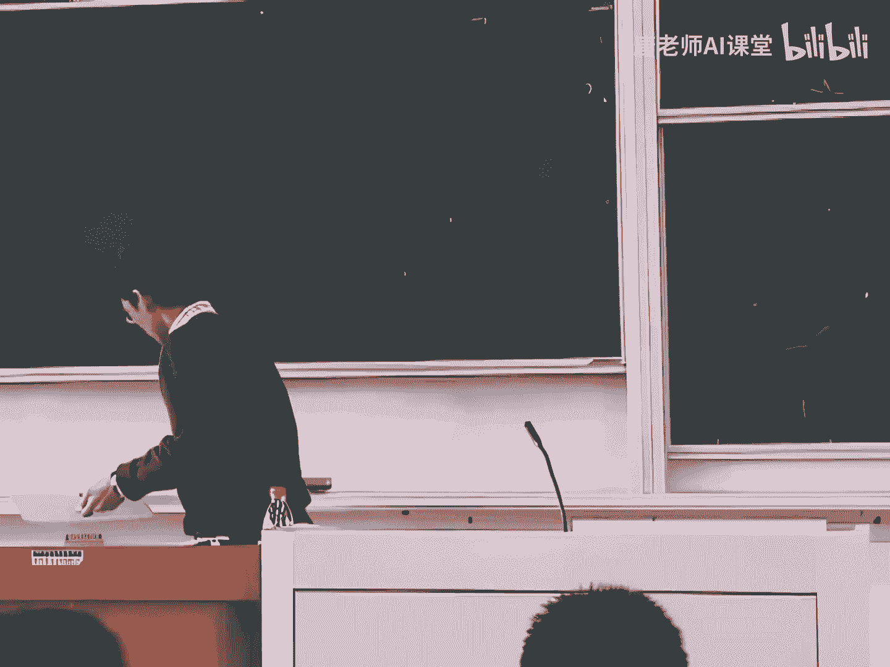

首先呢我假设这个X是一个N维的一个变量，另外呢我可以把这个原来这个问题的意，把它给写出来对吧，这个我们在讲这个优化问题的时候，实际上讲过这个事情的，它的域呢实际上就是所有的函数呢。

它的这个定义的并集是这样一个集合啊，应该说是这样一个交集了，好，那么我们来假设一下这个原来这个问题呢，它的这个最优值，所谓的最优值就是这个目标函数，它的最优的函数值，最小的函数值。

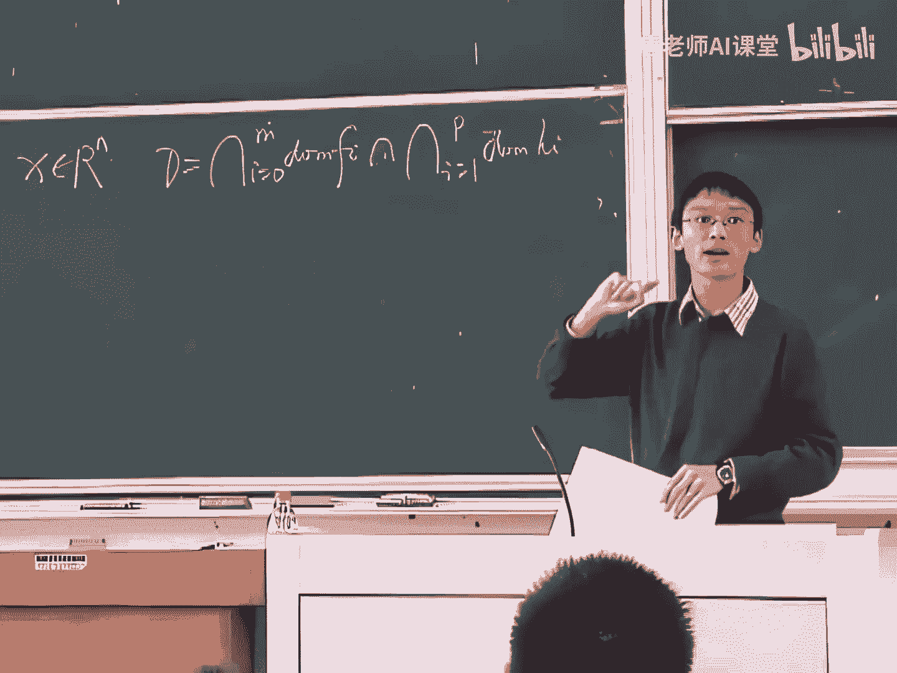

我们把它称为叫P星，好那么有了这些定义之后，我们再来定义一个新的概念，一个全新的概念叫做拉杆式函数，我们来定义一下这样一个函数，它的名字叫做拉格函数，或者有时候我们就把它简写成拉格朗日。

拉格RG这样一个东西，这个的意思指的是上面这个问题啊，跟上面这个优化问题相关的一个函数，我们把它称为叫拉斐尔函数，这个函数的形式是这样的，写法实际上非常简单，好我们来看一下，我们来对比一下。

上面这个优化问题和底下这个函数，我们来看看他们中间有些什么样的联系啊，上面这个优化问题呢，它是首先呢它是有一个优化变量X的，这是一个N维的这样一个向量，然后呢我有我有M个不等式的约束。

然后有P个等式的约束，好那么有这样的问题之后呢，我怎么来构造这样一个所谓的叫拉岗日函数呢，这个函数啊实际上是一个三个变量的函数，下面我们我们会介绍一下这三个变量的，第一个变量X很简单。

就是原来这个问题里面的这个这个原始的变量，这很简单好，那么这个拉姆达拉姆达是一个向量，拉姆达是个向量，这个向量的维，这个它的尾数啊，是跟我们的不等式约束的尾数是一样的，也就是它是个P。

是个M尾的这样一个这样一个向量，然后呢这个V这个V呢是一个P尾的这个向量，也就是跟我们这个等式约束的尾数是一样的好，那么也就是说原来是一个只是一个，是一个这样一个MV的这样一个呃。

是一个MV的这样一个问题，那么现在这个函数呢是一个这样一个三变量的，这样一个函数，这个函数构造是这么去构造的啊，首先呢我首先把这个原始的这个问题啊，它的目标函数把它给写上去，就是我的F0X给照样抄上去。

然后呢，我在后面呢把这个把这个不等式约束力，这一项呢把它变成这样一项，把它变成这样的东西，就是将这个拉达里兰姆达I乘以FX，再去做个求和，实际上就是我是将每一个不等式约束，左边的这样一个函数。

F0FAX给乘上这样一个标量，那么I就是拉姆达中间的第第I个量，然后我再去做个求和，这项很简单对吧，然后同样的呢我对于我的这样一个等式约束呢，我也做过同样的事情，就是我将我的等式约束。

这边这个函数HX我就乘上一个vi，就是我的这样一个向量V中间的第I个元素，我构成这样一个构成这样一个函数，好，我们来看一下这个函数，关于X，关于X，实际上我们找不到什么特别好的性质对吧。

因为我们讲原来这个问题不一定是个凸问题，它是一个非常一般的问题，所以呢中间这个F0FI，还有这个hi可能都是一些很一般的函数吧，可能是一些比较一般的函数，那么实际上呢，我是将这样一些比较一般的函数呢。

去做了一个线性的加权，对不对，低价的加权系数是一，这一项的加权系数呢，是这个兰姆达I这一项的加权系数是V，I是做了一个线性的加权好，那么相对于拉姆达而言的话，这个函数是个什么样的函数呢。

如果这个我的X和V都定下来的话，那么我的这个函数相当于拉姆达，是个什么样的函数呢，是个线性的吧对吧，这是个关于lambda是个线性的函数，那么同样的关于V它也是个线性的函数吧，好。

这个呢就是怎么从上面这样一个问题去，构造出来这样一个函数，一个是一个是问题，一个是函数，这两个要分清楚好，那么这个概念叫做拉格尔函数，下面呢我们还要再引进一个概念啊，我们这节课的概念比较多。

而且都比较重要，下面这个概念叫做叫做对偶函数，或者叫拉格朗日对偶函数。

这几个名字啊，请大家一定要记住，而且不能用错了，这些名字一定不能不能不能写错了，但是呢很不好意思，我这里就写错了，这里应该叫拉格朗日，这最后一个是E就不是那个rang了，这个区别一定要搞清楚啊。

啊这个叫LAGRANGING，这个叫LOGRANGING，这个叫lag range，这两个是不一样的，一定不要写错了，好那么这样一个对偶函数啊，这样的对偶函数是怎么构造的呢，我是这么去构造的。

首先我现在已经有了这样一个拉斐尔函数了。

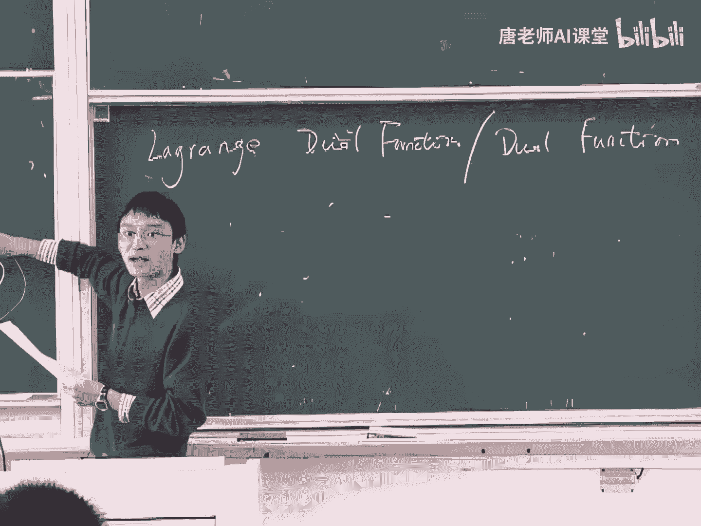

对吧，假如我已经知道这样一个拉杆式函数了，那么这个拉斐尔函数呢，我就可以从它出发来构造一个东西，叫做对偶函数，它是这样去定义的。

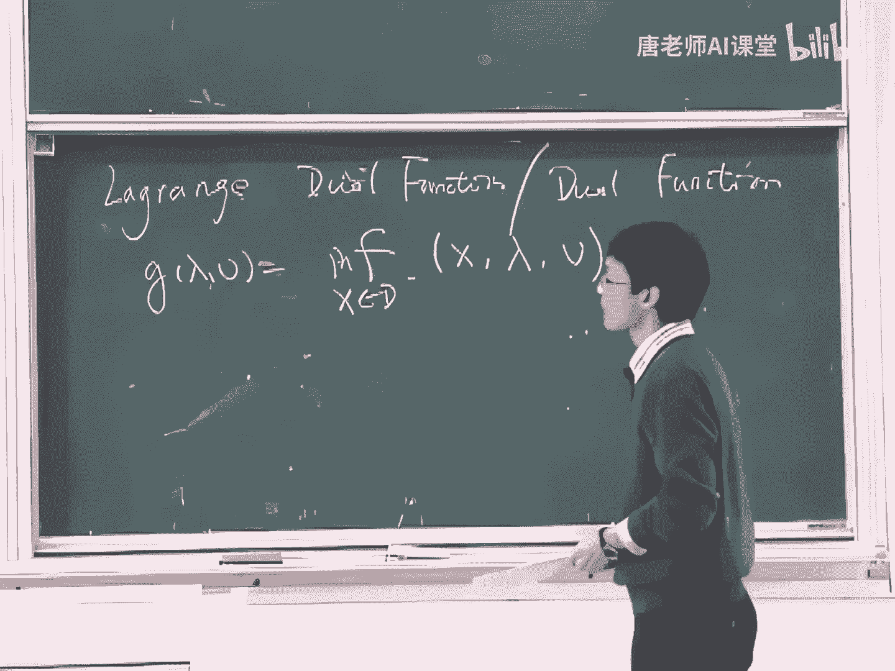

这个就是我们的这样一个，我们这样一个对偶函数的定义好，我们看这个对偶函数是什么意思啊，就是原来这样一个L这个东西啊，这个拉杆式函数啊，它是X拉姆达和V它的函数，那么现在呢我我要构造一个函数呢。

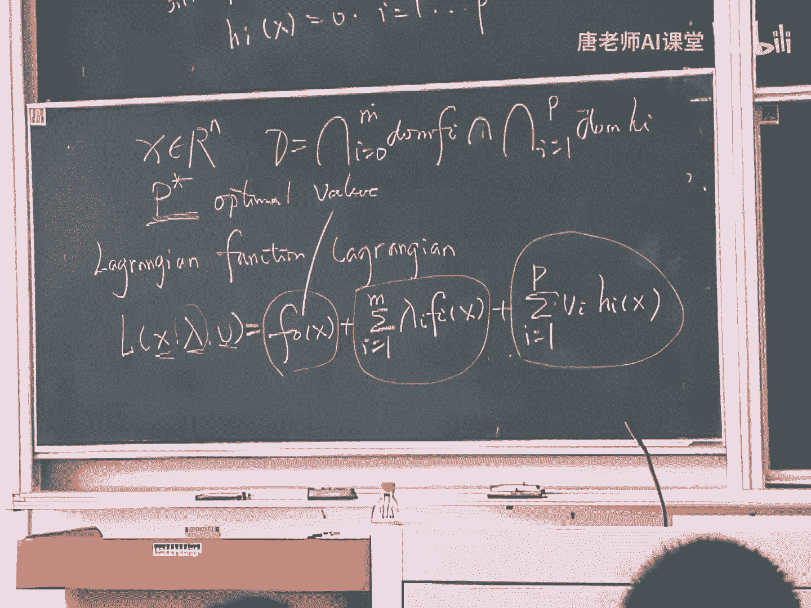

是只是关于这个拉姆达和V的函数了。

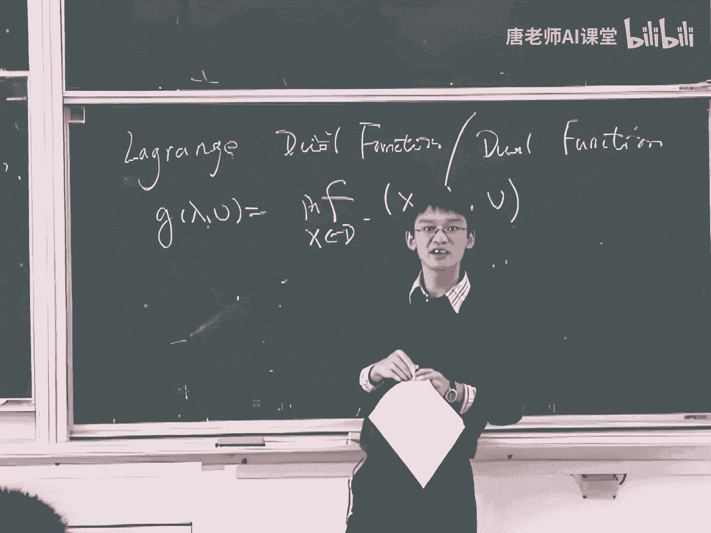

那么怎么去做呢，我就要在这样一个X它的这个域里面，在XE里面我就求个使得抱歉啊，这边是个L对吧，好，就要找找到一个使得这个L最小的，这样一个东西，也就是我比如说我可以任意的去选择X，固定好这个拉满和V。

那么固定好之后呢，我就可以去求出相应的拉姆达和V的值了，这个问题我们先假设它是可求的好吧，我们先假设这个问题是可以给求出来的好。

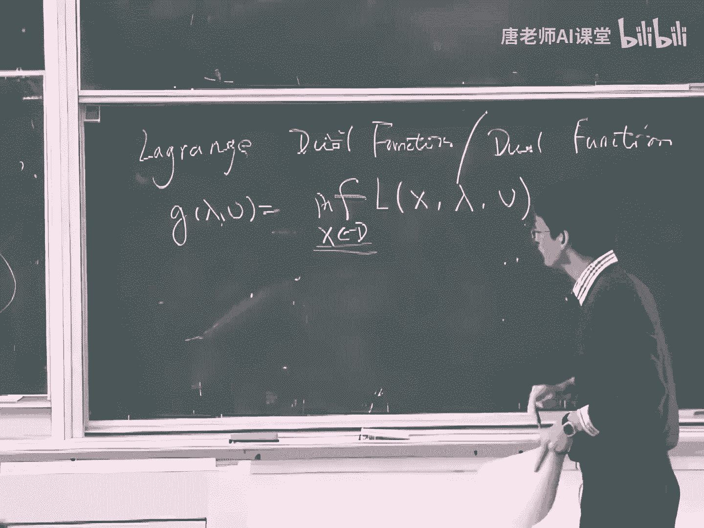

那么这样一个函数，它实际上就是只是关于这个拉姆达和V的函数，所以这两个之间的联系实际上是很清楚的，我这个呢，这个呢只是我从上面直接去构造出来一个函数，这里面呢实际上我还要去经过一个这样一个。

极小花的这样一个过程，那么中间的这几个变量呢，它都是有它的名字的，比如说这个这个拉姆达这个东西啊，拉达这东西就称为拉岗日臣子。

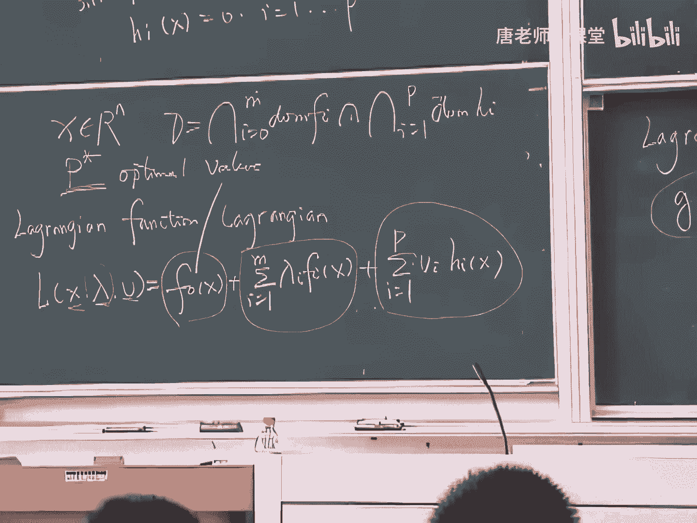

或者叫maple，或者就叫橙子，就是我们的la和V，其中的这个拉姆达呢是称为和这个不等式。

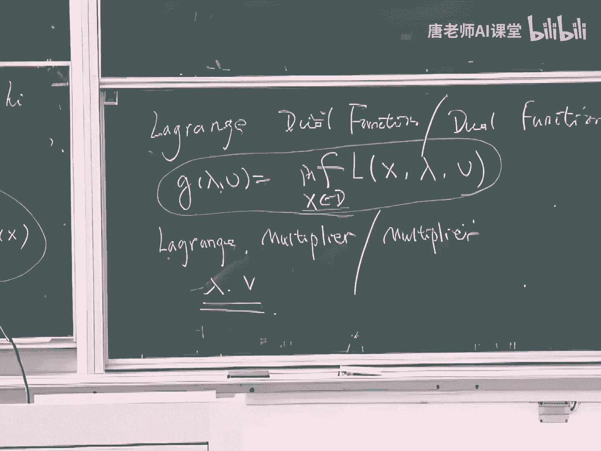

拉姆达，称为是和这个不等式约束相关的，这样一个拉斐尔村子，那么这个V呢就成为和这个等式约束相关的，拉杆分子，所以中间我们引进了好几个概念，好我们再来看一下啊，这个G这个函数啊。

首先他能不能给求出来这样一个值，就能不能能不能求出这样一个这个函数值，我们看这个这个X，只要这个X是在它的域里面的话，那么原来这个L的这个函数，是不是一定是有定义的，如果这个X是在D里面的话。

那R这个函数有没有定义，有吧对吧，因为D是他们的交集嘛，所以呢我是一定可以求得出来的，那么求出来之后呢，我们就发现这个函数啊，实际上是关于这个这样两个，拉斐尔橙子的函数吧，对吧好。

那么这个函数就跟之前的我们的这样一个，这个F0啊，这个FI呀，hi呀，这个函数之间是存在一定关系的，但是呢具体是什么关系呢，这很复杂，因为这中间有牵涉到这样一个求极要化的，这样的东西。

好这个呢就是我们讲的这个这几个概念，从拉格尔函数，拉格尔陈子到对偶函数这样几个概念好，那么这里呢我们要来讲一件事情，就是这样一个对偶函数啊，它有一个非常重要的一个性质，它有一个第一条。

它有它有好几条重要的性质，那么第一条重要的性质是什么东西呢，就是它一定是一个凹函数，这个函数一定是个凹函数，能不能理解，不管你原来这个问题里面，不管你原来这个问题是一个凸问题。

还是个非凸问题还是什么问题，它一它必然是个凹函数，能不能解释一下这个事情，好同学们一定要回顾一下，一定要把之前的这个知识活学活用，就是我们在讲这个凸函数的时候啊，我们在讲凸函数的时候，我们讲过一个概念。

就是一个一个东西的一个superman，就是求去求个极大一个，比如说吧假设啊假设我有一个这样的一个函数。

是一个关于这个拉姆达啊，关于这个X拉姆达和V的这样一个函数，我如果去我如果去对他去去求过极大的话，我如果对他去求过极大的话，那么它应该是一个什么东西呢，它应该是一个，如果我对于X啊，我去求个极大的话。

他应该关于这个拉姆达和V是个，什么样的函数呢，关于拉姆达和V是凸的还是凹的，是凸的对吧，我如果去这边，如果假设我来，但是实际上是没有这样一个函数存在的，我如果去求这样一个函数的话，如果我去求这样的函数。

这个函数是个关于la和V的函数，那么这个函数必然是一个凸函数吧，对不对，为什么，因为他们关于这个拉姆达和V是线性的吧对吧，所以呢它实际上是一个分分段，线性的这样一个函数，这个分段线性的凸函数。

这是我们讲凸函数的时候，讲过的这样一个概念好，那么我们把这样一个还记得，不记得这个概念还记得吧对啊，那么呢我们再把这个东西稍微变一下，就是如果我去求个这样一个这个INFM的话，去求个极小的话啊。

那么实际上这个东西是不是也是关于他们一人，仍然也是个线性的对吧，仍然也还是个线性的嘛，所以我去对它去求个极小的话，那这个函数是不是必然就是一个，必然就是个凹函数了对吧，我就把它反过来了吗。

好所以呢这个对偶函数一定是个凹函数，对偶函数一定是个凹函数，这个是对偶函数这个东西，第一个比较重要的性质，非常重要的一个性质，这个这个对于我们的后面这个图问题的分析，还是非常有用的，这样一个性质好。

如果不理解的同学自己再去翻翻书好不好。

好另外呢这样一个对偶对偶函数啊。

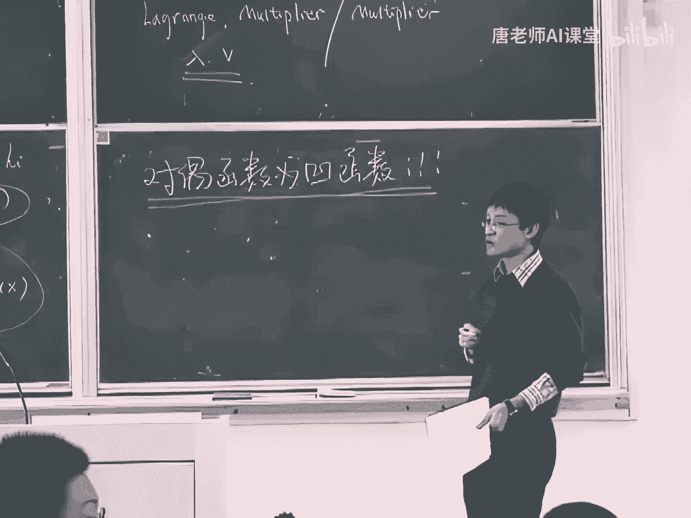

它还有一个很重要的性质，还有第二个重要的性质。

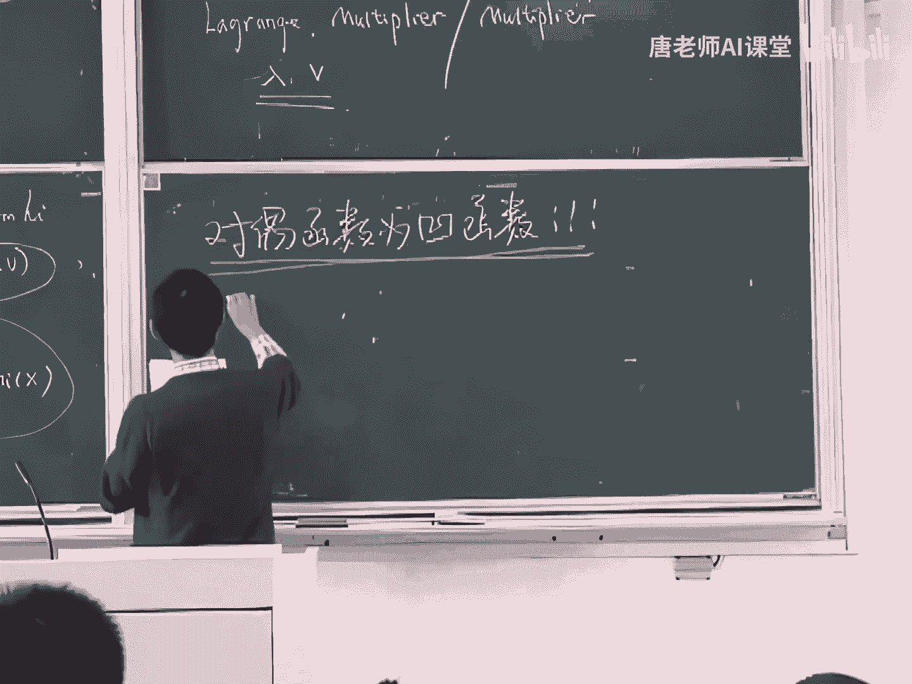

第二个非常重要的性质，我们讲这个对偶函数，它是一个关于拉姆达和V的这样一个函数，那么现在呢我们有这样一个命题，就是如果我的我任意的去选择一个拉姆达，这个拉姆达是非负的，这个拉姆达是一个非负的向量。

然后呢我在任意的去选择V这个向量，这个V呢是任意的，不管你是正还是负的，还是那个有有的人有的负都是可以的，那么我的这个函数值啊，我的对偶函数的函数值一定是小于等于，这个原来这个问题它的最优值的。

他的他的这个最优值替星，这个PC是原来这个问题的一个最优值，好这句话好像不是特别容易理解对吧，这句话中间呢它的含义是什么东西呢。

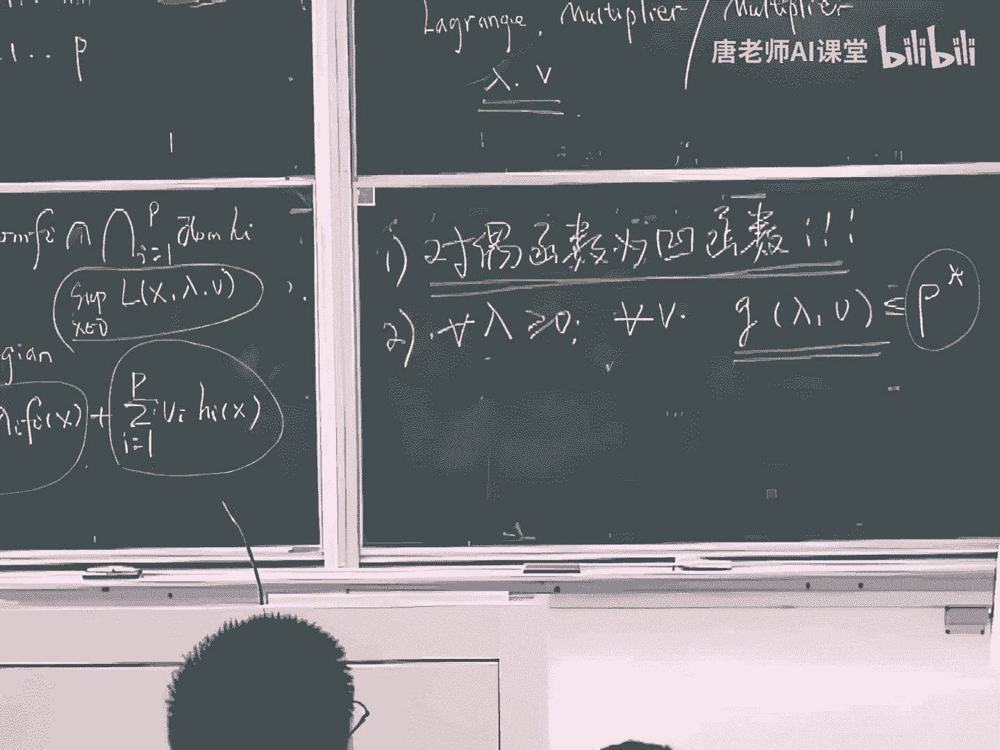

就是我愿意的，我只要能够根据原来这个问题，这是我们原来的问题，我首先构造出来这样一个函数，然后呢再构造构造出来这个G兰姆达V整函数，这样一个对偶函数的话，那么我愿意的就选择这样一个恢复的la。

和这样一个任意的一个V，我求得的函数值，以这样一个函数值，一定是原问题的最优值的一个下界对吧，他一定不会小于它的，一定不会小于它的，它一定是个下界，实际上是实际上我们要讲的是这个意思。

那么这中间我们一定要注意了啊，这东西啊是个函数值，这个东西是个函数值，这个东西是这个原来这个问题啊，我们原始的这样一个问题啊，它的它的这样一个最优值，它实际上是这个问题的一个最优值对吧。

这实际上就是把这个函数，它的任意的一个取值和这样一个东西的，一个和这个问题的一个最优值，把它给结合起来了，好，那么我们来证明一下这个事情实际上非常简单，好我们假设这个有X型这样一个东西啊。

它是原来这个问题的一个最优解，我们我们讲这个最优解可能是个集合了。

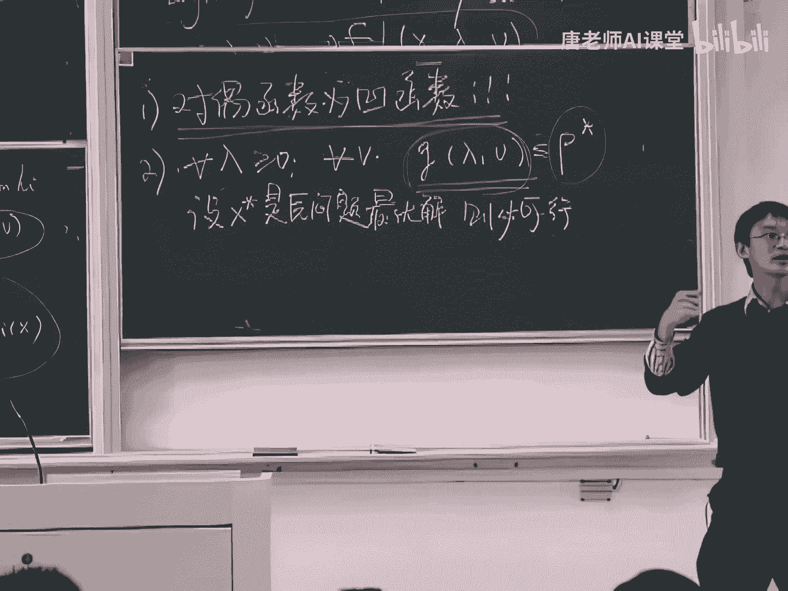

它是一个最优解，那么这个解必然是个可行解了，好那么如果他是个可行可行解的话，他一定是满足上面这些约束的，所以呢我就把这些这些约束啊，把给写上来，这样一些不等式约束和这个等式约束，必然都是满足的。

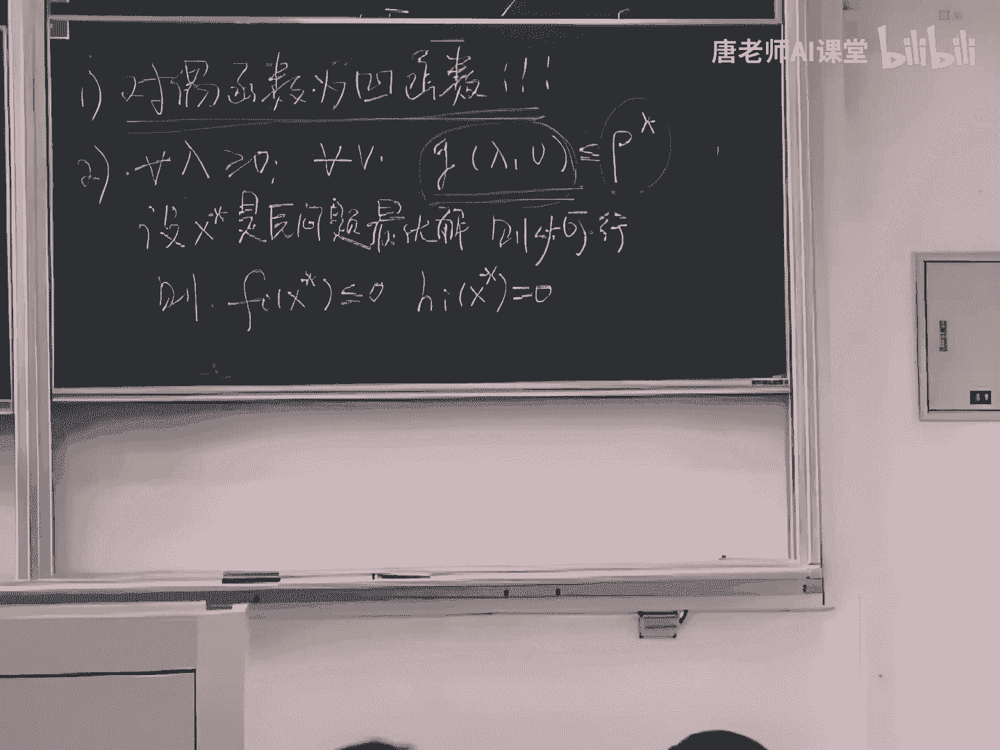

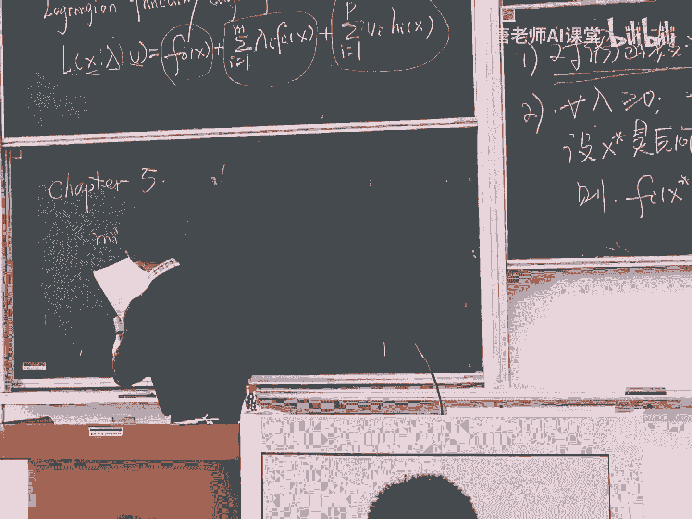

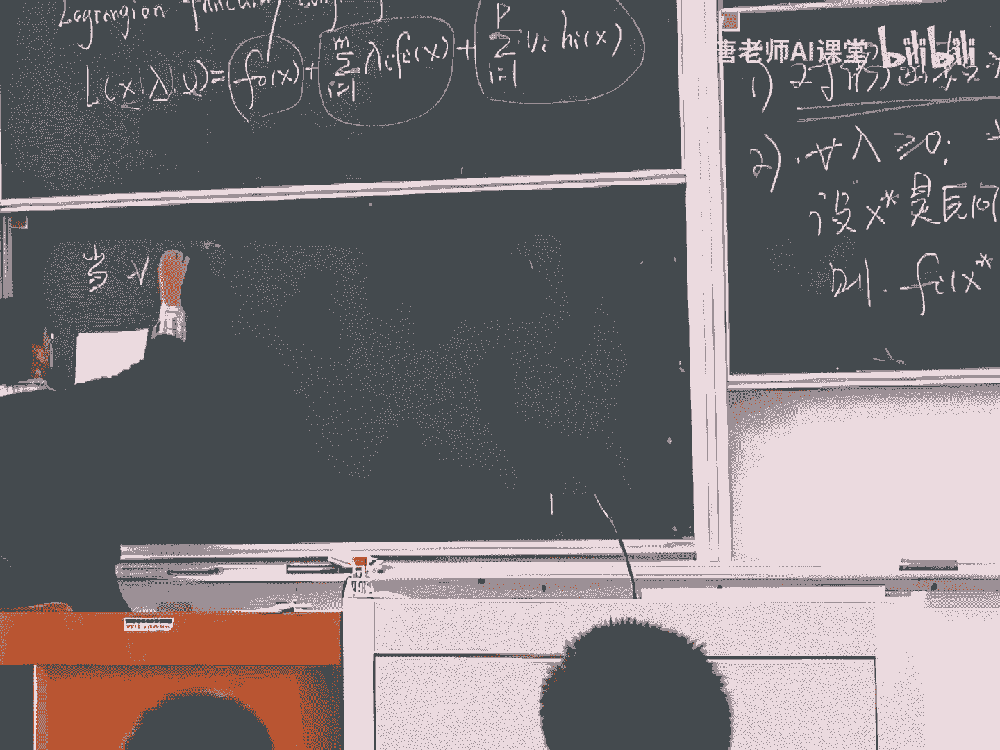

好我们来考虑一下这个任意的la大于等于零，这个任意的V那么我们都必然有这样一个性质。

对不对对吧，很简单嘛。

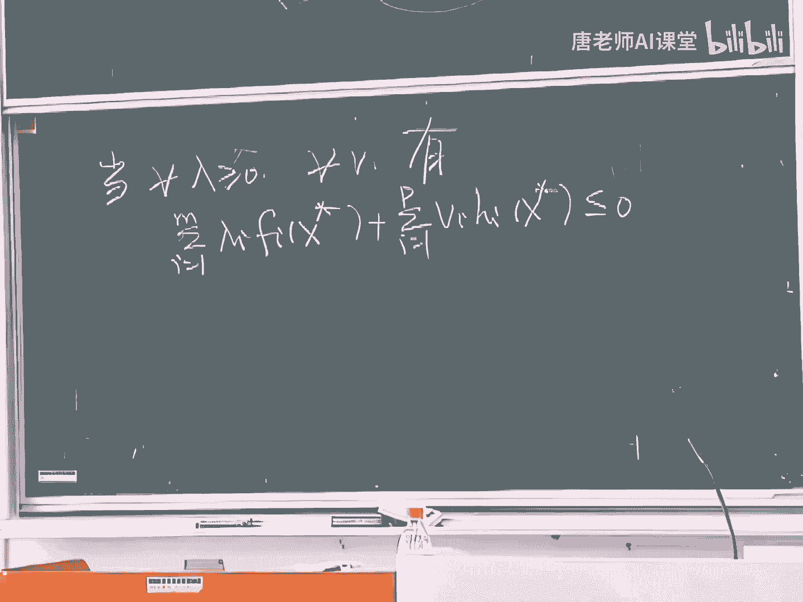

因为这个我们的我们的这样一些不等式约束，肯定是满足的，就是FIX星呢一定是小于等于零了。

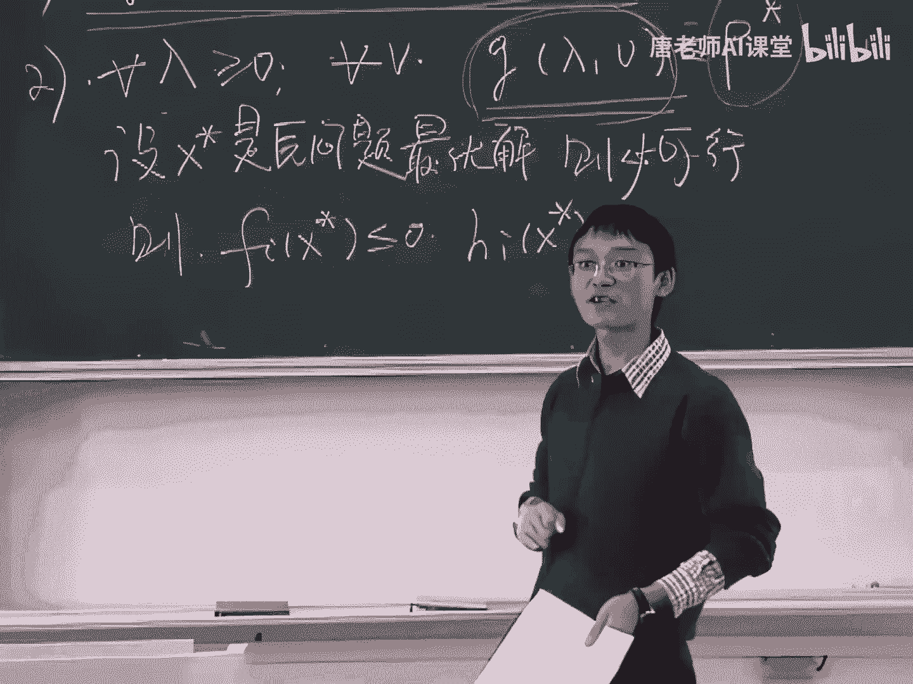

这个hi x x星呢一定是等于零的，所以呢我将这个FX7呢去乘上这样一个非负的。

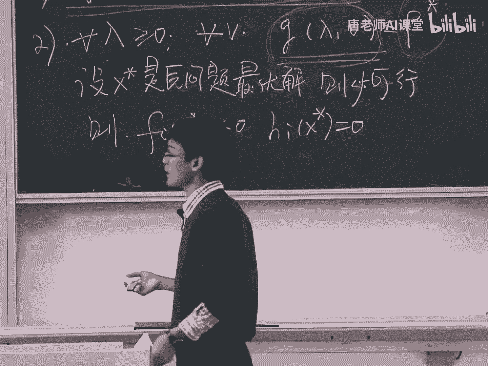

这样一个这样一个量的话，我去做个内机的话，我已经将这个这个H呢和这个V呢，去做个内积的话，那么这边的值一定是小于等于零的，这边值一定是等于零的，所以它肯定是小于等于零的嘛，这个不等式一定满足吧。

好那么既然这样不等式满足的话，那么我来考虑这样一个东西啊，我我来考虑一下啊，上面这样一个拉杆式函数。

这个拉杆式函数啊，我可以去在这个，我可以在X星这一点去取个值吧对吧，我们看在X星这点取值是什么东西呢。

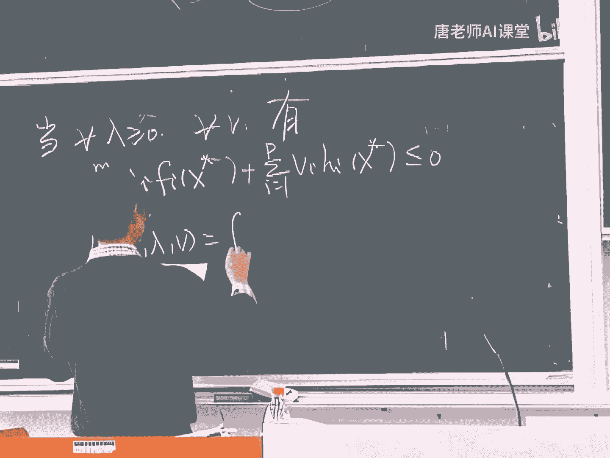

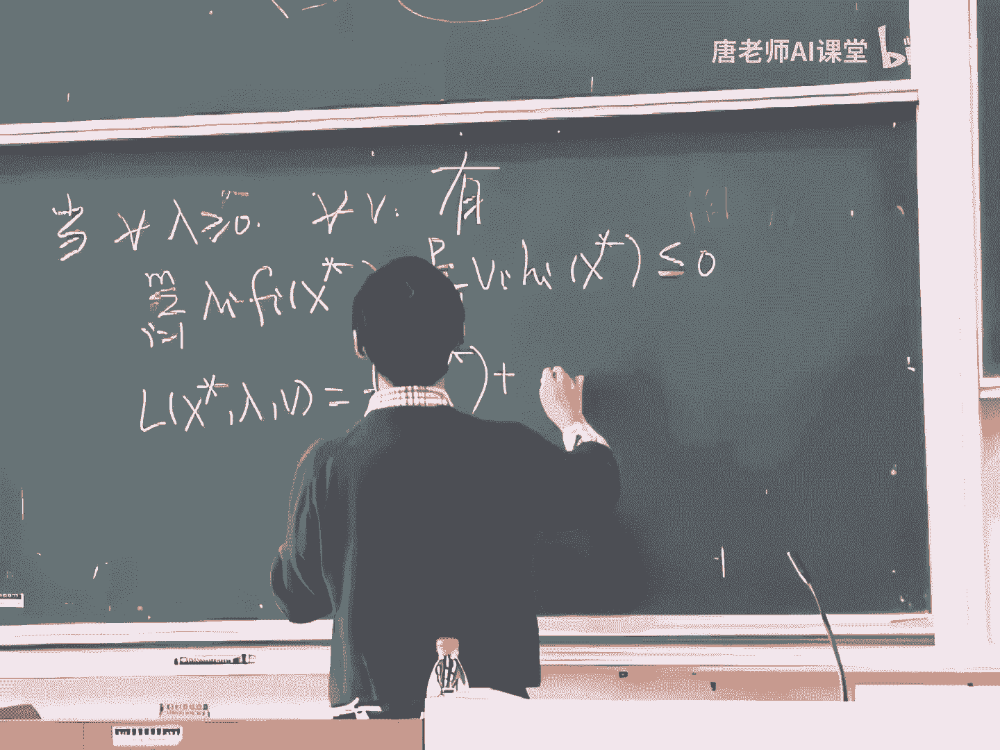

实际上就是这样的东西，那么我们看左边这个值是什么东西，左边这个F0X是什么东西呢，是P型对吧好，右边这东西是小于等于零的吧，好所以呢他肯定是小于等于P型的对吧好，它一定是小于等于P型的，那么我们来看啊。

有了这样一个东西之后，实际上我们是不是就可以证明这一点了。

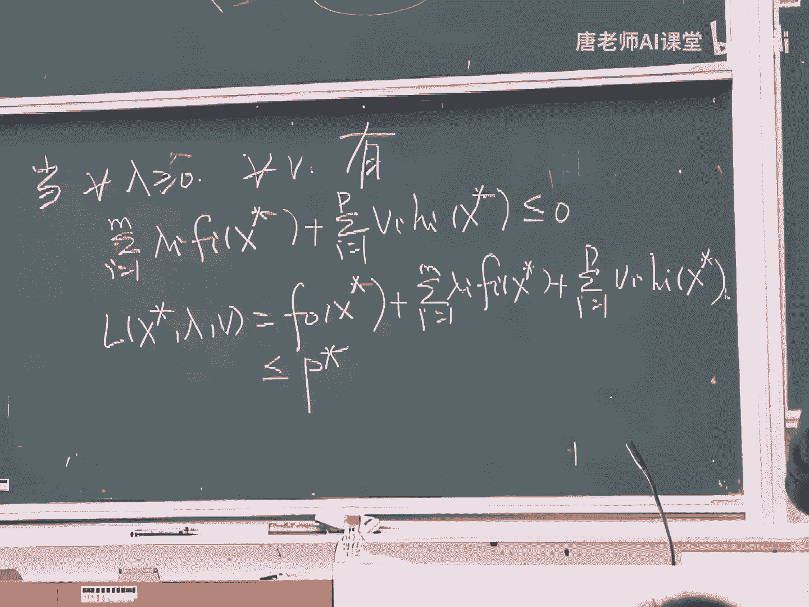

从这一点我能不能来证明这一点，可以吧，原因很简单对吧，我上面写了嘛，这个G兰姆达V是什么东西，是对于所有的X属于D，我们这个X型一定是D中间一个吧，这毫无疑问的，因为它这个它是最优解吗。

它必然是在这个域里面的嘛，那么我要在这个LX拉姆达V中间，去选择最小的一个，对于所有的X就选择最小的一个，那么我的这样一个我任意的去选择一个，比如说我随便就选了一个，刚好我运气很好。

我就碰到这样一个最优解了。

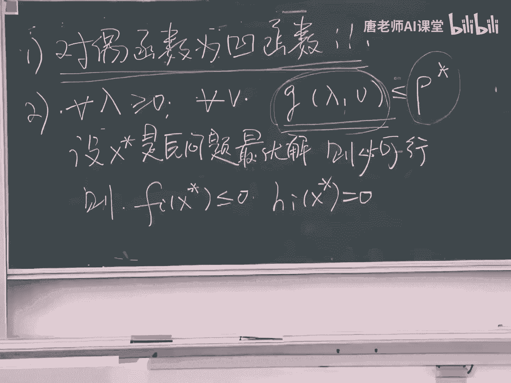

那么它都是小于等于P型的，那么很显然，这个G兰姆达V是不是一定是小于等于，这个兰姆达X星拉LX新兰姆达V的，一定是小于这个的吧，那么它一定是小于等于P型的吗，对吧，这个值一定是比这个值要小的。

这个值又是比这个值要小的，所以它一定是小于它的，这个证明就结束了，这是非常简单的一个思路吧，没有任何问题啊。

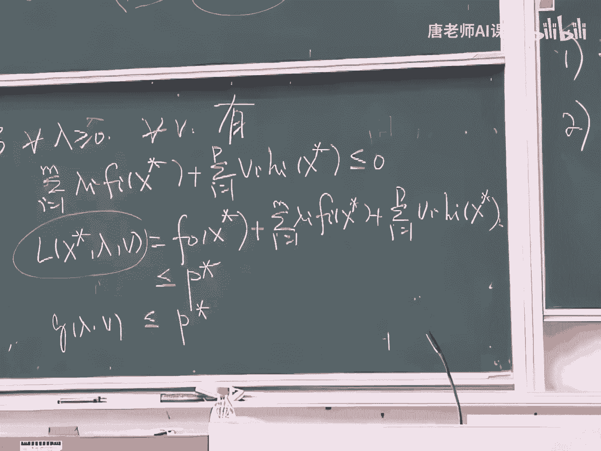

好那么这个东西啊，这个东西啊，实际上它是隐含了一个非常重要的一个意义的，它里面隐含了一个非常重要的意义啊，我们来讲就是对于任意的拉姆达大于等于零，对于任意的V这个G兰姆达V呢。

它的值呢一定都是它的一个下界吧，对吧好，那么在什么情况下，我可以对于这个la和V，我可以得到一个最好的一个下界呢，就是最逼近于PC的一个下界呢，一个最大的对吧，我可以去我可以去对他去求个极大。

我去极大化这样一个G，同时我的约束是拉姆达大于等于零，我去解这样一个问题，那么这个问题一定是它的，它的最优值也一定是小于等于它的吧，好而且呢是我的，这对于这样一个G而言的话，它应该是个最好的下界。

对不对，就是对于这个P星来说是个最好的一个下界，我能找到最好的一个下界好，那么我们再来看这个问题啊，吉大号这样的G同时加上这个约束，G这个函数是对于拉姆达V它是个凹函数，对不对，它是个凹函数。

我极大化一个凹函数，同时加上这样一个线性约束，我是个凸问题吧，也就是说理解一下，就是我解一下这样一个出问题，我就可以得到这个P型的一个一个尽量好的，尽可能好的一个下界，对不对对吧，好。

这里这里我们先不展开讲，我们下面会详细的去讲了，那为了帮助理解呢，我们先来举几个例子。

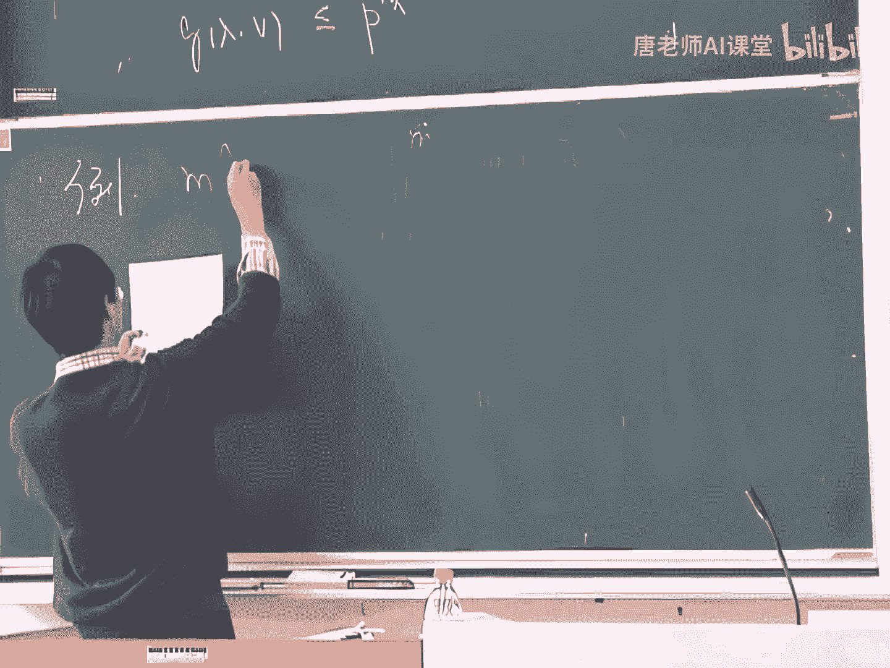

首先呢我们考虑一个有线性约束的一个，简单的二次规划问题，这个目标函数是一个很简单的这样一个，二次目标函数，然后呢我有个二次约束，ax等于B非常简单的问题。

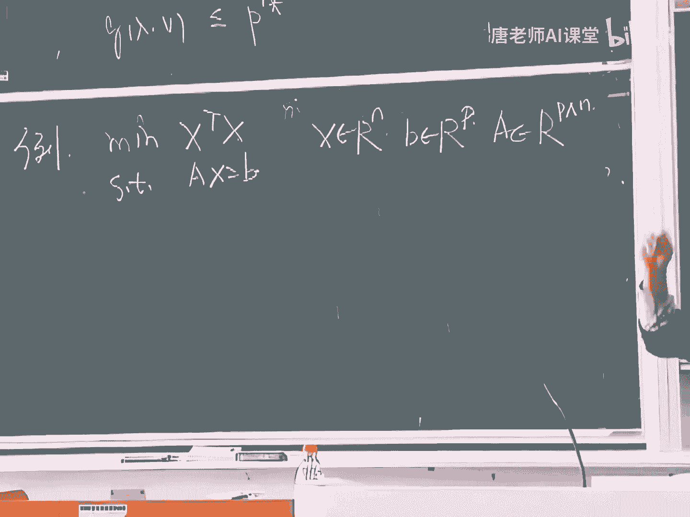

那么我们来写一写这个问题，它的这个我们首先呢写下它的这个拉杆函数，然后呢再写下它的对偶函数，然后再去写，然后再去看一下这个计量的V啊。

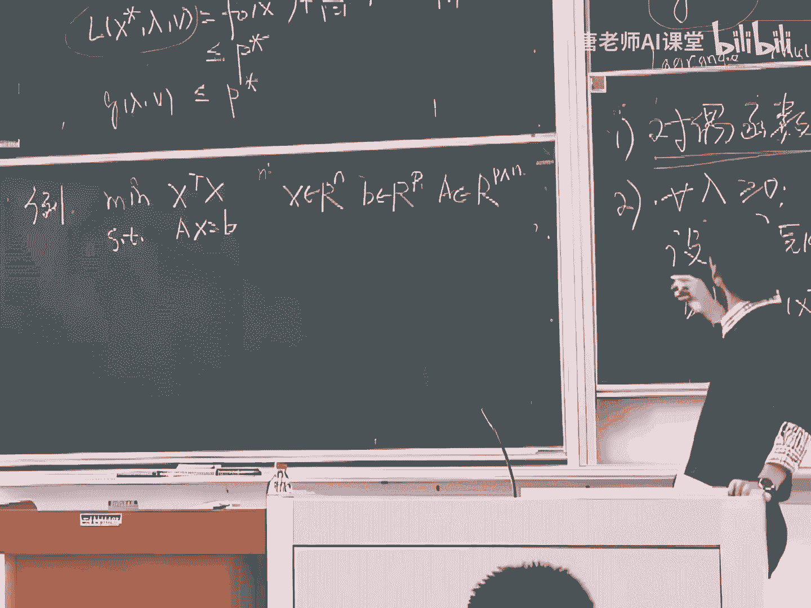

它到底是不是凹的，我们来看一下这个东西，首先呢这个问题里面呢，它是只有这个等式约束的吧，哦所以呢我的这个拉姆达是不是就不需要了，没有拉姆达了嘛对吧，所以这个我的这个拉格尔函数啊。

它是只有V只有X和V这样的变量，好那么这个拉杆函数大家都会写吧，这个学完这门课之后啊，怎么去写这个拉杆函数，一定要搞得特别熟，一定要知道到底怎么去写，一定不能忘，但写的很简单对吧。

这个是如果你是个机器人的话，你马上就能做，为什么呢，先把这个函数给写出来，然后呢，这个地方是个等式约束对吧，那我去将这个V和他去做个内积不就完了吗，好这样一个函数啊，就是我们所讲的这样一个拉杆式函数。

第一项呢是一个第一项，这一项呢是这个原始的目标函数项，第二项呢是个拉杆日辰子项，乘上这样一个线性的等式约束，这一下拉格朗日乘子和这样一个合法的约束的，一个乘积，好，这是怎么去写这样一个拉杆函数。

然后呢我再去求一下它的这样一个对偶函数，我们求下对偶函数是什么东西，这个实际上就是我们完全就是我们定义了，我们就完全按照定义来，那么X呢我这里面这个X属于D啊，这个D是整个的全空间，它是整个全空间。

所以我们可以忽略这个东西了，那么我们再把这个LXV呢，我们把它给写出来，那中间呢为了简便起见，我就我就把所有的跟X相关的东西，我把它给并到一块了。

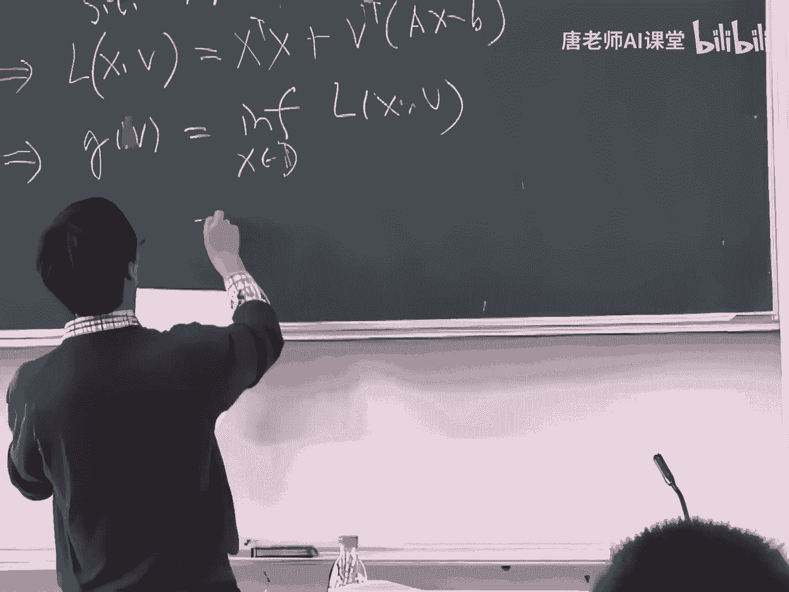

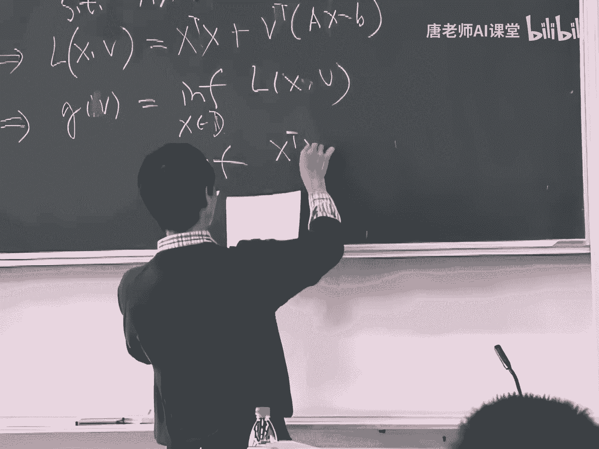

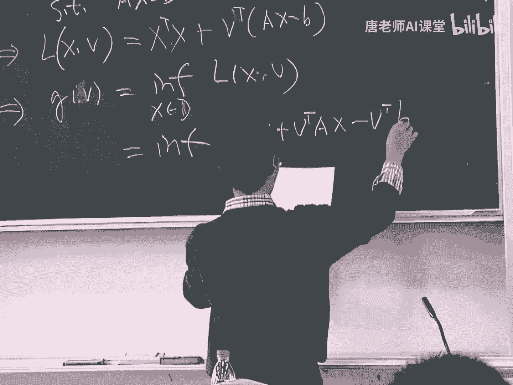

好实际上它是等于这样一个东西吧，那么这样的东西我对于X去求个去求个极小值。

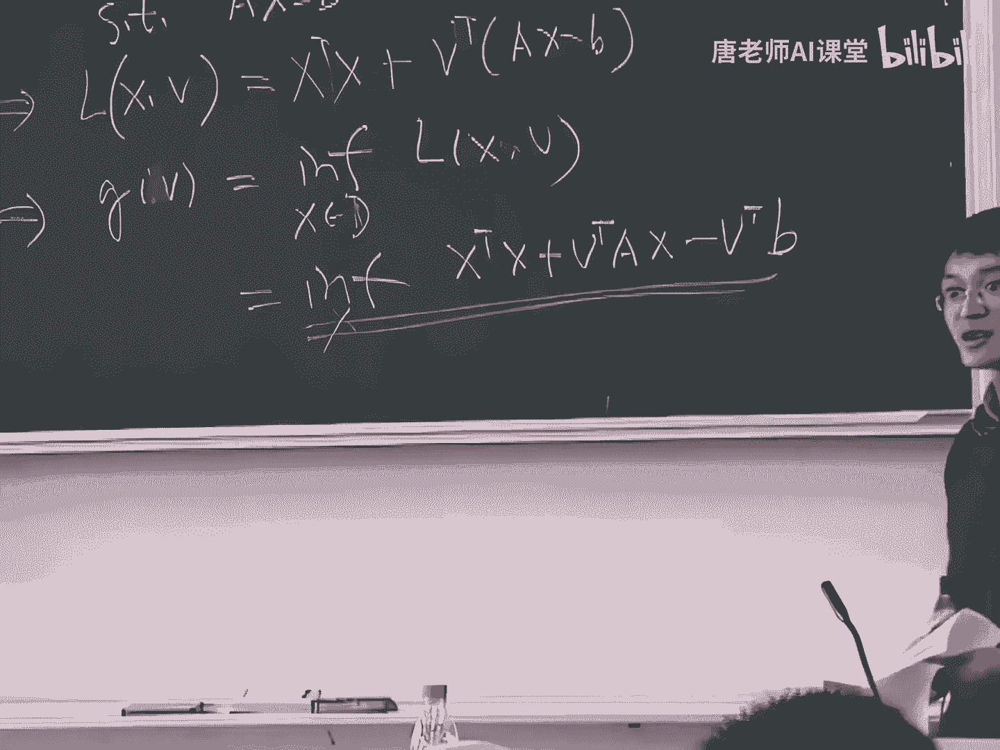

怎么去求，大家大家应该都会吧，很简单嘛，我去求个一阶偏导就完了对吧，那么它的一阶偏导呢，这边的一阶偏导呢，实际上就是2X这边，一阶偏导是2X这边的，这个一阶偏导的是什么东西呢。

a transverse v对不对，一定要把它给一定一定要把它给写出来对吧，这一项是什么东西啊，这一项是V啊，a transpose v的转置乘以一个X，所以呢这个求一阶偏导是怎么去求呢。

就是你把这个X擦掉，再把这个trans擦掉，就剩下这样就完了，那最后这一项呢它是等于等于零的吧，好那么这个东西啊，实际上就是我们的这样一个，就是我们的这样一个X的最优最优解，对于这样的问题。

X的最优解就是就这么一点，所以呢我们就可以推出来这个X是等于这样的，好，这就是我们的我们的这样一个，使得它最小的这个X，但是呢我们要求的时候，我们求这个GV呢，我们实际上是要求一个这个这个最优值。

对不对，所以我们要把这个所有的X给带回去，让它变成一个完全关于V的这样一个函数，我们把它带回去看一看。

好首先第一项这个ATRANSIX。

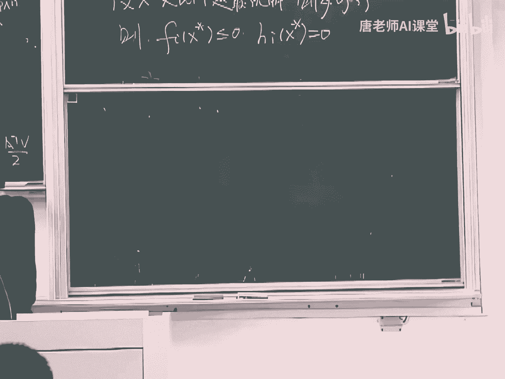

Transports x，这个东西就会出来一个1/4的，是不是d a a transports v对吧，这是第一项，第二项，第二下会出现什么东西呢。

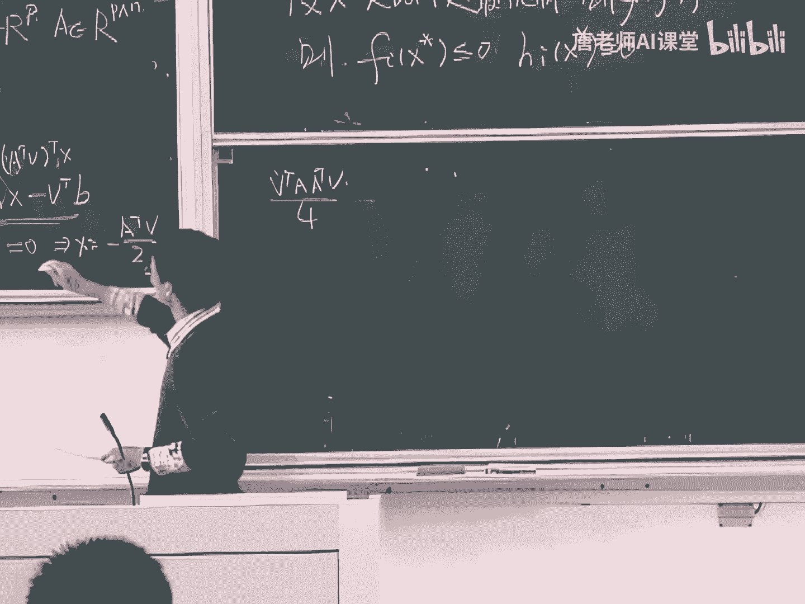

就是我的这个V的transpose乘以A，再和这个X1个内积是什么东西啊，跟他就是减去了这个二分之，是这样的吧，好然后最后一项我是完全不用编了，所以我把这几项给集合一下，就变成这样的东西。

这项啊我把这个V和B的那一积呢，我稍微改一下，我写成这个B的转置乘以V，这是完全等价的好，所以这样一个东西这样一个东西啊，实际上就是我们的这样一个所谓叫对偶函数啊，对吧。

这个是不是就是就是我们的对偶函数好，那么我们来看看，这个函数是一个什么样的一个函数啊。

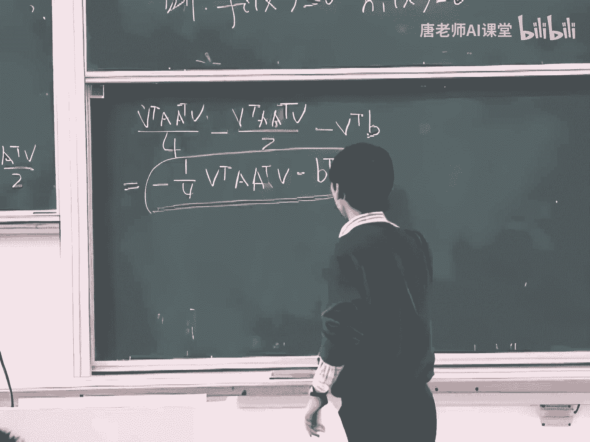

它是一个关于V的一个二次函数对吧，原来这个问题啊，是一个关于X的这样一个二次规划的问题，这是关于X的二次规划问题，而且是有等式约束的，那么现在呢这样一个函数是个什么函数呢，这不是个问题，这是个函数。

这个函数呢它是一个它让函数就是它的这个，首先呢它是它第一项是个二次项，第二项呢是一个是个一次项对吧。

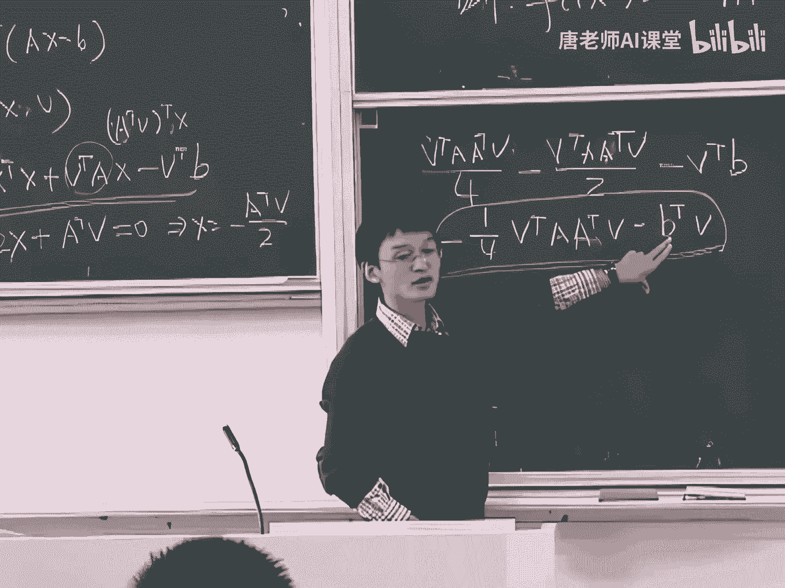

然后这个二次项的系数是负的1/4，再乘以AA的transpose这东西，那么这个函数是凸函数，然后呢，很明显是奥特曼对吧，中间这个中间这样一个矩阵肯定是一个，肯定是一个半正定的矩阵嘛。

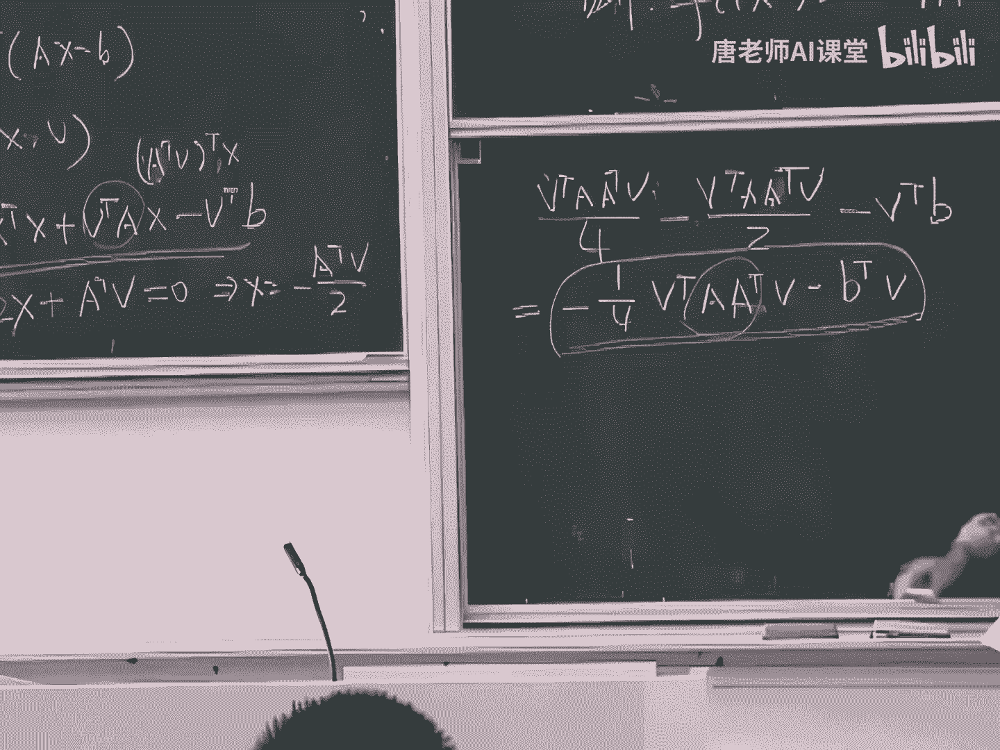

所以我前面有个负的，肯定是一个肯定是一个半附近的矩阵对吧，所以这样一个问题，这个函数啊肯定是个凹函数，好我们来看原来这个问题是个凸问题，我变了半天之后，我就变出来一个凹函数出来了对吧。

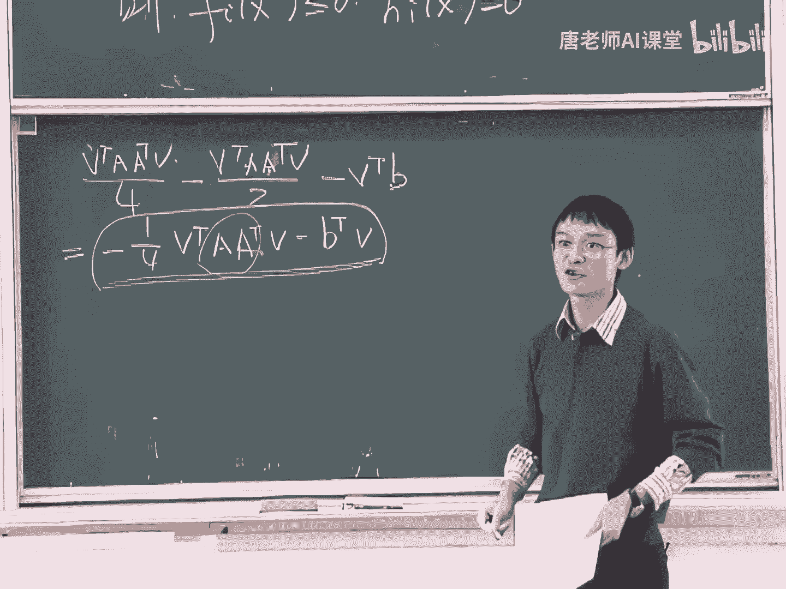

这是我们要讲的第一个例子，下面我们再讲一个例子。

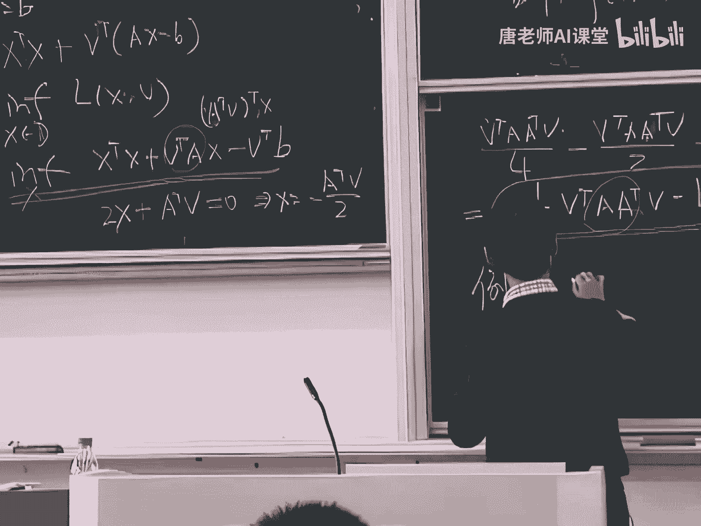

干杯好，这个例子是一个标准的线性规划的问题。

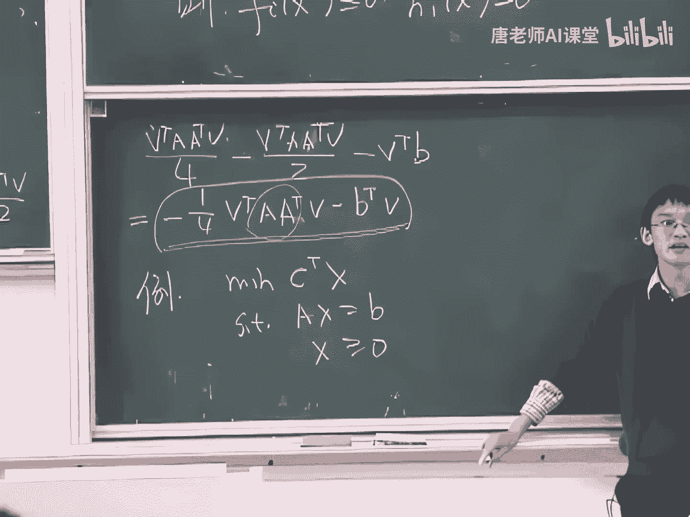

就是我去mini max这样一个线性目标函数，我有一个线性的等式约束，同时呢还有X这样一个非负的约束在这里，那么这里啊一定要注意一下啊，我们之前写这个拉杆式函数的时候啊，我们从这样一个优化问题。

就写出来一个拉杆函数的时候啊。

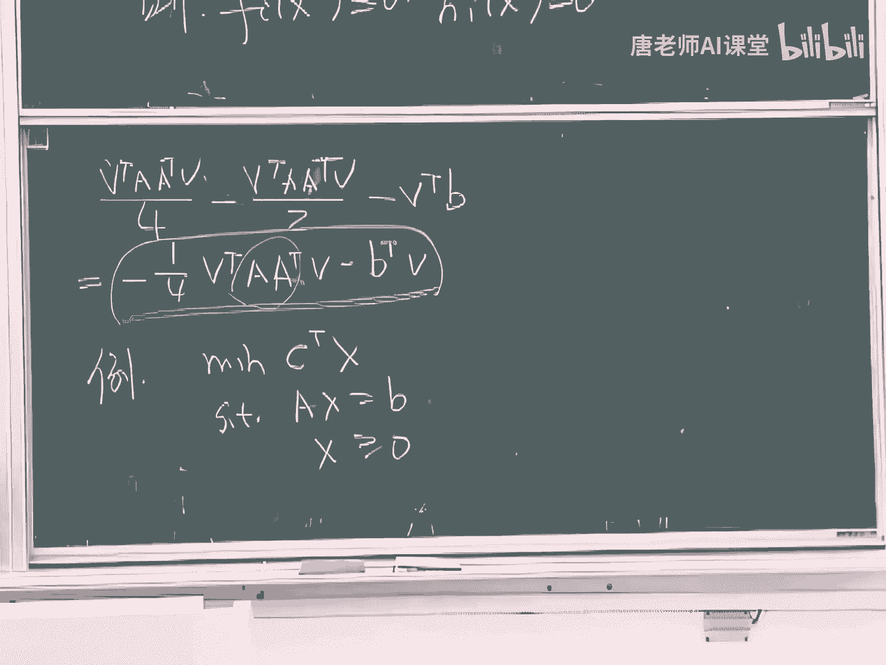

我们这个等式约束呢是某个函数等于零对吧。

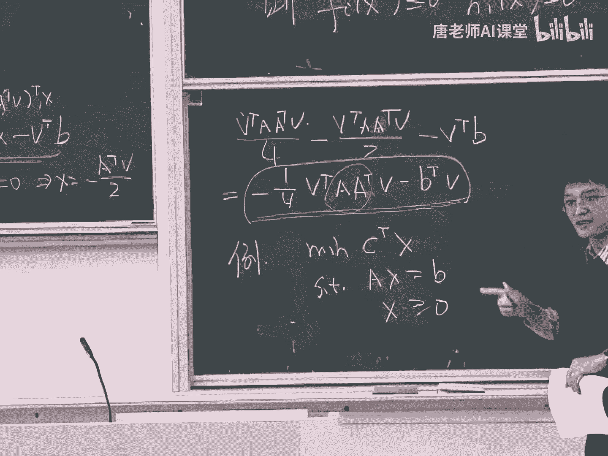

所以这里呢我一定要把它给写写成这样的形式，就是ax等于零减去B等于零这样的形式，下面这个地方啊，你们一定要注意了，这是很多人容易犯的一个错误，就是这X应该是负X小于等于零，对不对对吧。

因为我们要求这个不这样一个不等式约束，是一个小于等于零这样一个约束吧，好，否则的话，你的这个最后得出来这个函数的符号，可能就会错了，所以一定要写对，好，那么我们照样还是去写一下。

他的这个拉格尔函数是什么样子的，那么这里面呢既然它是又有等式约束，又有不等式约束，所以我的这样一个我的这个拉格函数，中间就有三个变量了，X拉姆达和V，那我把这个每一项全都给写进去。

好实际上是这样的东西对吧，第一项我们都很都很明白，就是把原来这个函数给写进去，第二项呢，我是将这个拉姆达和这个上面这个约束，负X去做个内记，一定要记住是跟这个负X去做内积，这里面我是将这个V啊。

和这个AX减B去做个内积，这个就是我们的整个的这样一个，这个函数的形式，那么我们都知道呢，我们这个下面马上就要求一下这个对偶函数了，这个对偶函数呢实际上是要相对于X去求。

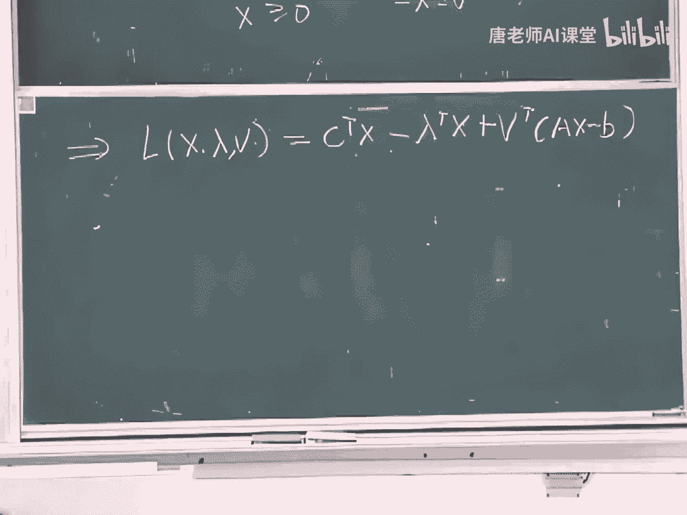

去求个最小值的这个这个这个最优值，那么我为了下面的方便呢，我就把这个东西啊把它给组合一下，给组合成一个，我把所有的关于X相关的项啊，我全都给提出来，把跟X相关的全都给提出来。

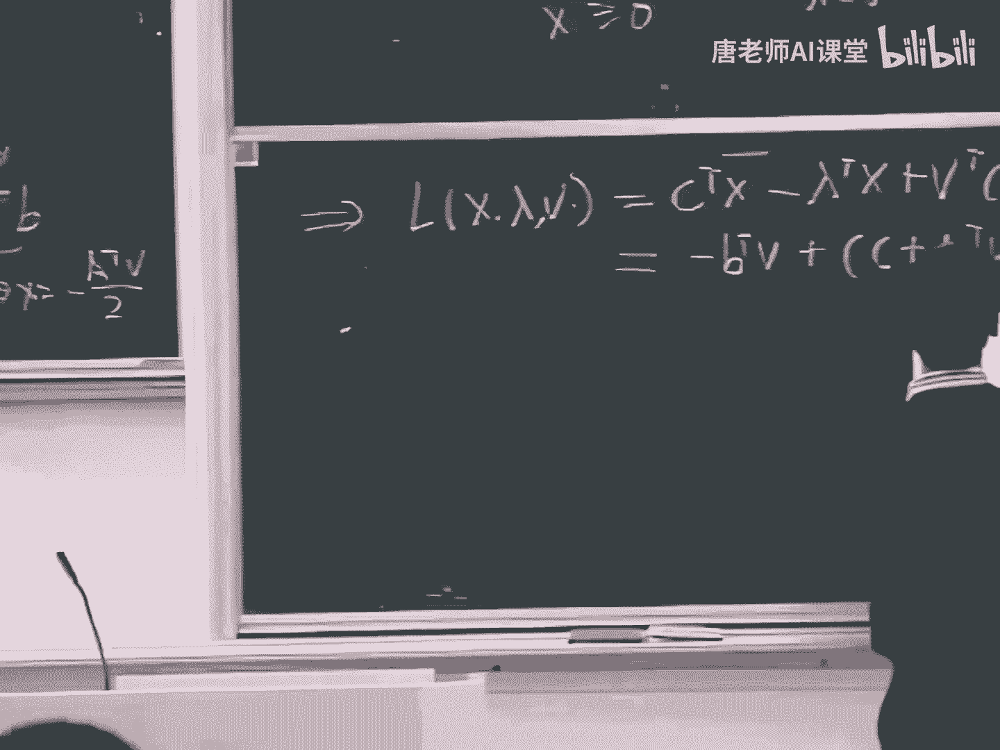

好实际上应该是这样的函数对吧啊，那没什么问题，那么有了这样一个函数之后呢，我就可以去求一下我们这个G兰姆达V了，好这个函数，那么我们来看看啊，这个函数它的最小值是什么东西，我我现在是变换X。

我的X是在这个全空间里面可以任意的去变的，那么我可以得到什么值呢，这个函数实际上是一个关于X的一个线性函数，好这个事情我们以前讲过吧，就是如果它的这个系数是等于零的话，如果关于关于关于X这个现象。

它的系数是等于零的话，那么它的这个最小值肯定就等于这个了吧对吧，那肯定就这个了嘛，那么如果这项是不等于零，不管你是大于零还是小于零也好，你总是可以把X取正，无穷或者或者取成负无穷。

最后使得这一下能够变成负无穷吗，好所以呢我们就分成两种情况来讨论，好我们就得到两种情况了，就是这个函数啊，实际上是一个比较奇怪的一个函数，我们讲它是一个关于V的函数啊，关于这个拉姆达和V的函数。

那么它在这个la和V的某一个，这样一个线性的子空间里面，我们讲这个等于零，一个超平面对吧，这是个超关于拉姆达和V的一个超平面吧，它在这个超平面上的取值呢，就是这个就是跟这个拉姆没关系。

但是跟V有关系这样一个东西，那么在这个超平面之外，在这个超平面之外呢，它的取值就是负无穷，是这样一个函数好，首先我们来看看这个函数是凸的还是凹的，这函数是凸的还是凹的，首先你们应该毫不毫不犹豫的回答。

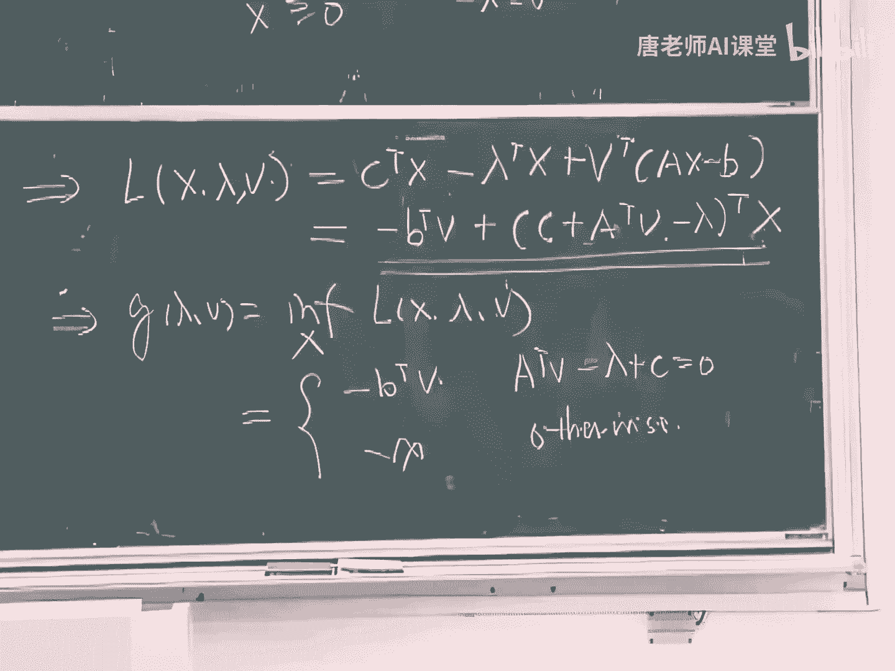

是个凹函数对吧，因为我们已经讲过，他肯定是个凹函数嘛，好，那么下面我们来解释一下它为什么是个凹函数，这个容易不容易理解容易吧。

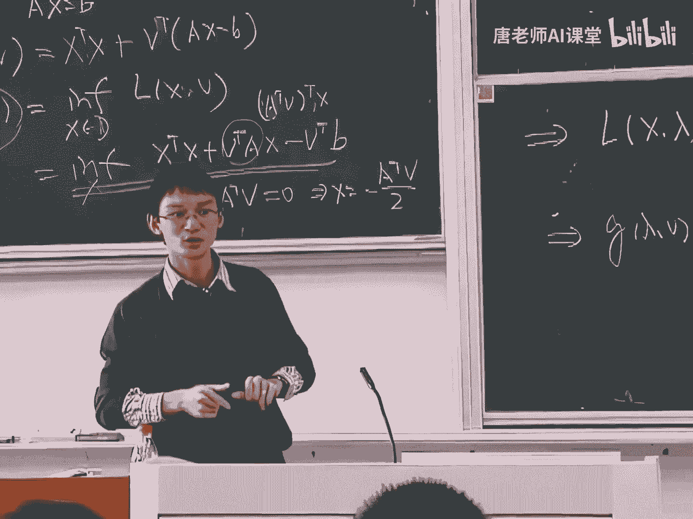

好为什么我们如果能够说明这样一件事情，如果我们能够说明啊，他在这样一个集合里面是一个凹函数化。

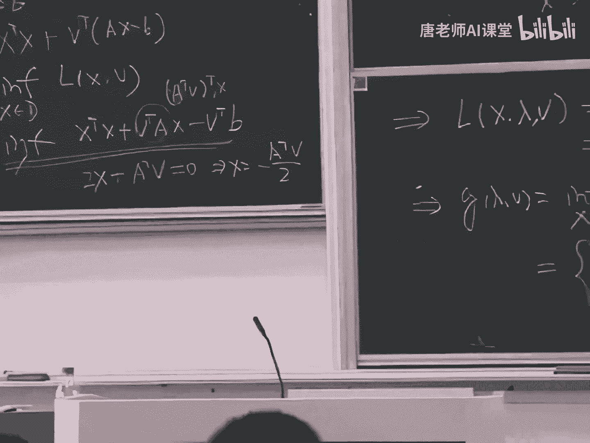

那么我们是不是就可以证明说明一下，它在全空间全空间里面是个凹函数，因为它是个扩展嘛，对不对，就是这个这个原来这个这个函数啊，它在这个这个集合里面，它是一个它是有值的，在别的集合里面呢。

我首先先不给它定义，那么然后呢定义完之后呢，然后我就我就让他在这个其他的值里面呢，我就给去正负无穷，这是我们讲的扩展，经过这样一个扩展之后，原来是凹的，那么你继续还是凹的好。

那么这个函数是不是关于拉姆达，合肥是个凹函数，它既是图的就是凹的对吧，所以这个函数肯定是一个关于拉姆达和V，是个凹函数了。

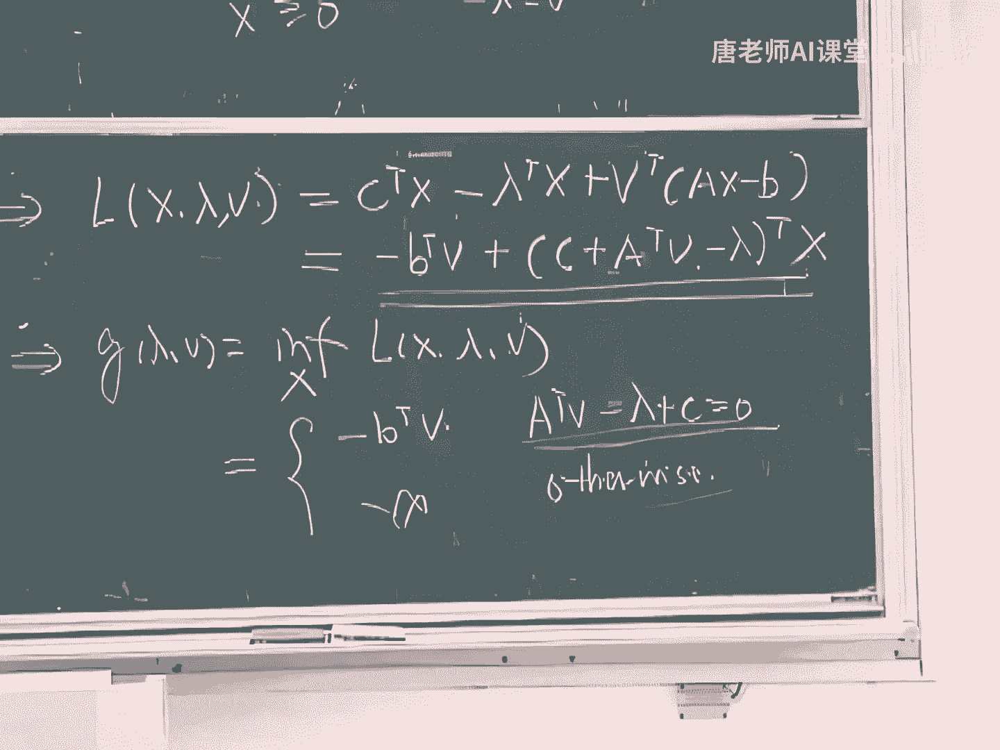

我们之前讲的两个问题，第一个问题是一个二次规划的问题，第二个问题是线性规划问题，其实他们本质上都是凸问题，那么现在呢我们再来看一下啊，因为我们之前讲过，就是不管你原来这个问题是凸的还是凹的。

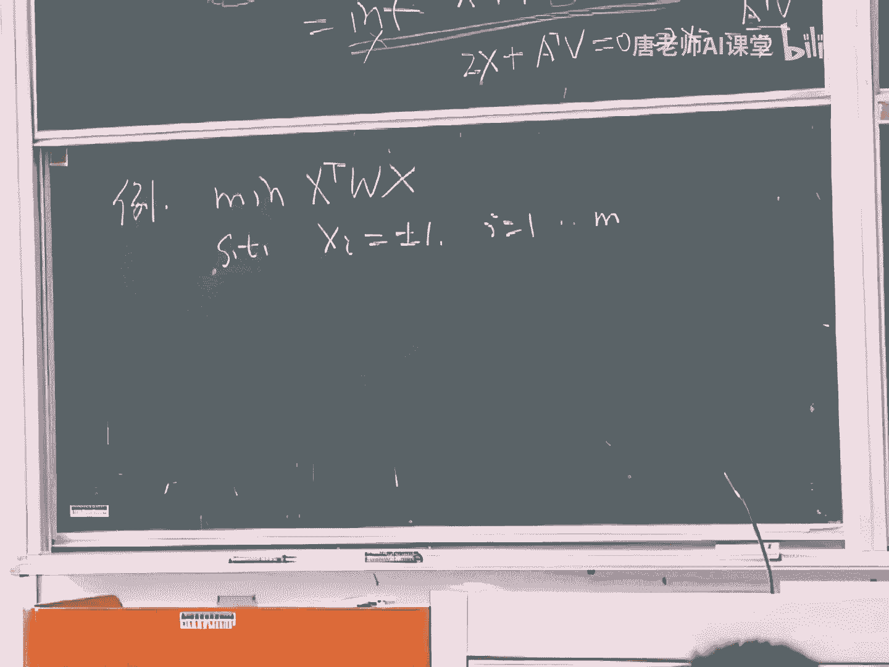

还是什么问题，就不管你是凸问题还是飞度问题，那么它的这个对偶函数都一定是一个凹函数，那么这里呢我们就来举个比较极端的一个例子，我们来考虑这样一个函数，这个函数呢首先呢它的目标它的目标函数啊。

我对于这个W我没有任意任意的要求，我对于W这个矩阵没有任意的要求，它可以是正定，也可以非正定的都可以的，所以这项它这个函数不一定是个凸函数吧，这是我没法保证的事件好，而且最要命的是呢。

我这边有个非凸的约束，就是我的这个X的每个分量啊，它不是等于正一，就是等于一，是一个所谓的叫做binary的这样一个约束，就是就是这种二进制的约束，你或者等于正一，或者等于一，你不能等于其他值。

我们讲这个问题实际上是一个这个函数，这个约束啊，实际上是个非凸的约束吧对吧，为什么是个非图约束，这集合不是个凸起，对不对对吧，它是个离散的样集合嘛，而且或者呢我们写的更简单一点的。

就是我们把这样一个等式的形式呢，我们把它给变一个样子，变成一个一个完全等价的一个样子，就是xi的平方减去一是等于零的对吧，这两个约束是等价的好，那么我们讲的就是如果你是个凸问题的话。

那么你要求这个等式约束是一个线性的约束，但这里明显是个二次的约束吗，所以呢这个东西肯定就不是个线性的这个问题，这个问题完全不是一个这样一个图问题好，但是没关系，我们还是可以照样的去写一下。

他的这个拉格尔函数和对偶函数，这个对我函数写出来也是很简单的，首先呢先把这个这个值给写上去，然后呢我再把这个这样一个等式约束的，每一个每个约束啊，都把它给乘上这样一个VI，都乘上一个VI。

然后再给加起来好，这个形式很简单，就是按照我们这个套路来就可以了，那么下面呢同样呢，我还是为了去求证一个对偶函数的方便呢，我还是把这个所有的X的项跟X相关的项目，把它给结合在一起。

那么跟X相关的项是哪一项呢，实际上是这样一项吧，好第一项是关于X1个二次项对吧，第二项呢也是一个关于X与一个二次项，那么我可以把这个二次项呢给写成这样的形式，我把二次元给写成这个形式。

其中这个dialog v呢是什么东西呢，我们讲这个V是个向量，V是个向量，它的向量的维数呢实际上就是M尾，就跟这个S为数是一样的，那么我就把这个向量给变成一个对角的矩阵。

我将这个原来这个向量给变成一个对角矩阵，这个可以理解吧，我将这个向量原来是个长的对吧，我要给扯成一个方的就可以了，那么再给它加上一个W，那么我说这两个东西啊，是等于这项加上这一项的，没问题吧。

很简单对吧，这个是个对角吧，你将这个乘上去之后，这个对角之后就是XY平方的求和了，这当然还要乘以一个VI好，那么剩下的还有一个这个关于vi的，这样一个线性向，这个实际上是减去一个vi的求和。

所以呢我可以写成这样的形式，就是全一的这样一个向量和V的内积，写成这样的形式。

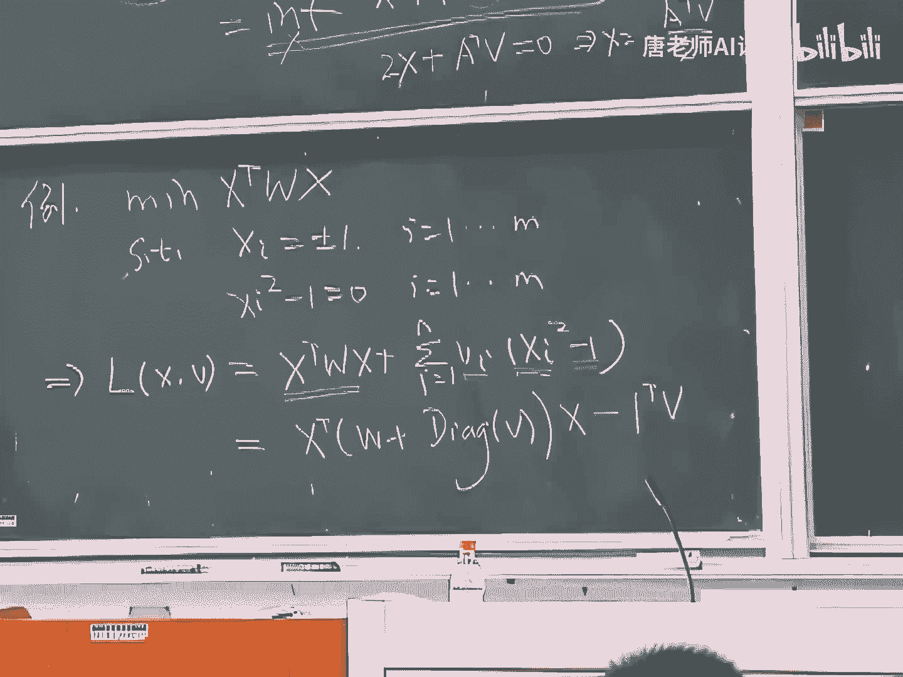

好我们再来看一下它的对偶函数是什么东西，这个对偶函数是一个关于X的，这样一个二次函数，那么它的最小值可以取成什么样子的呢，一个占一个二次函数，我们还是想一想，就是对这样一个高维的问题啊。

我们首先把它变成一个低位的情况去想一想啊，假如这个S是一维的东西，那么这个二次函数呢，它的形状就可能有只能有三种，第一种呢就是它是一个这个开口朝上的吧。

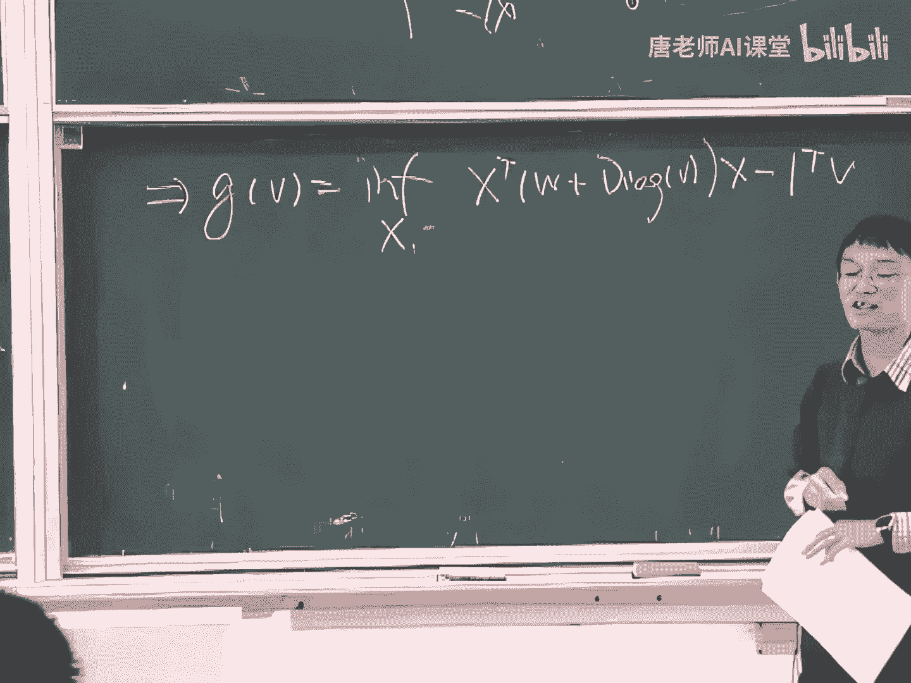

他这个开口朝上的，第二种情况呢，就是这个完全是平的，是要是要直线了。

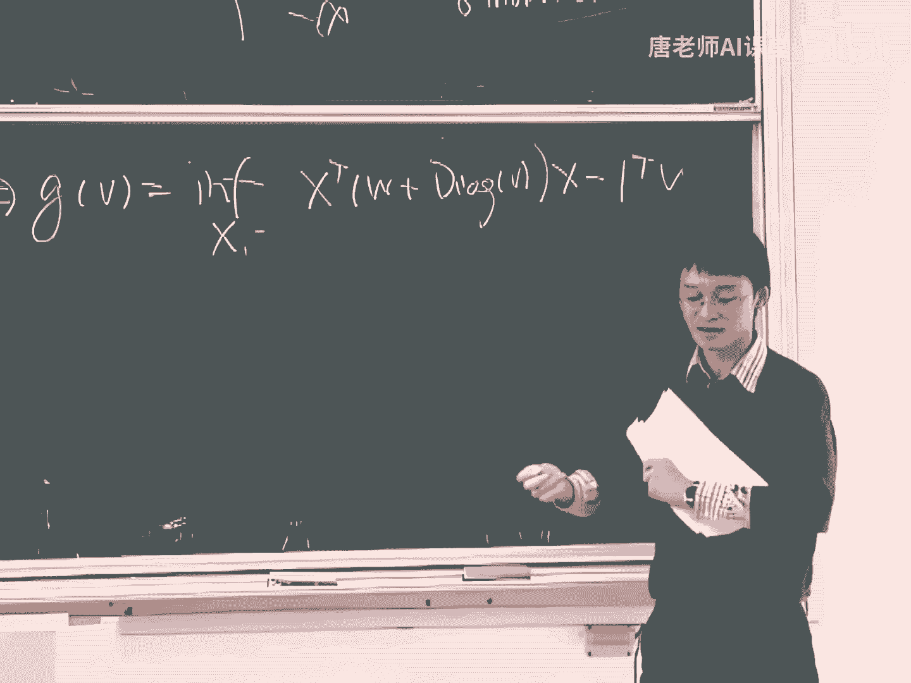