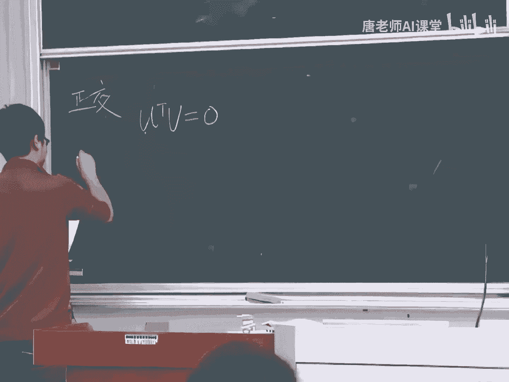
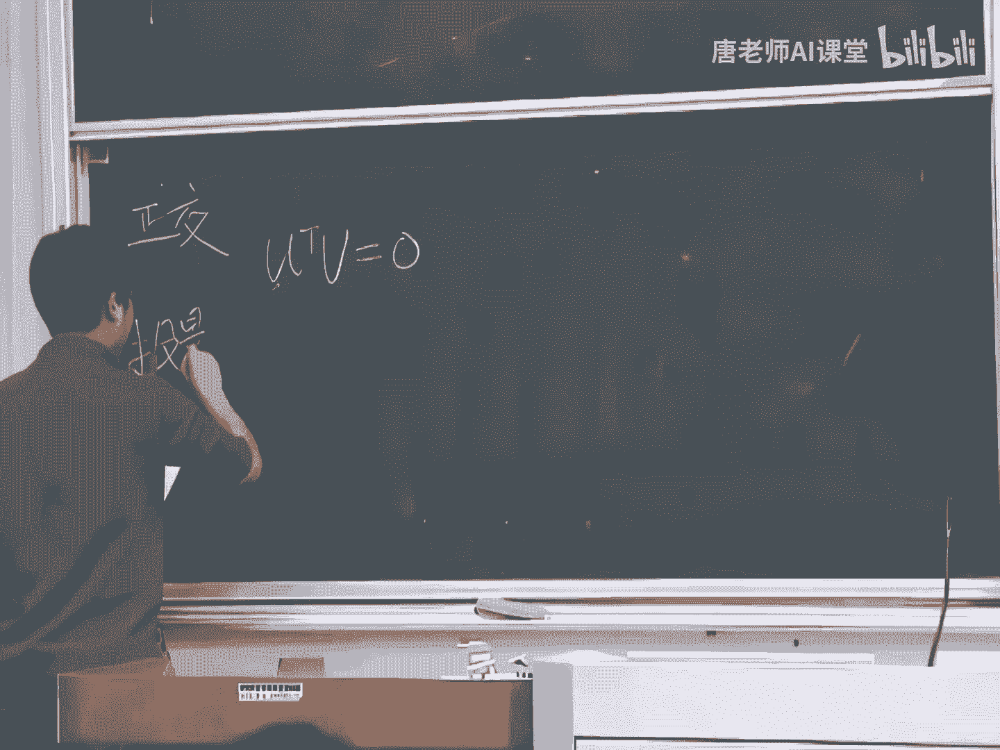
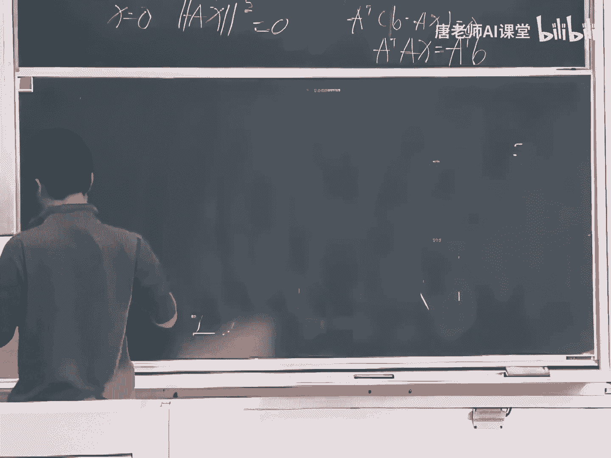
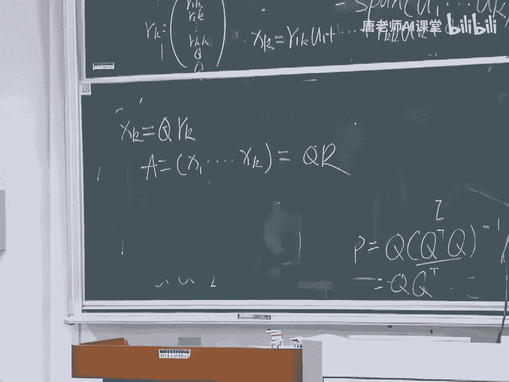
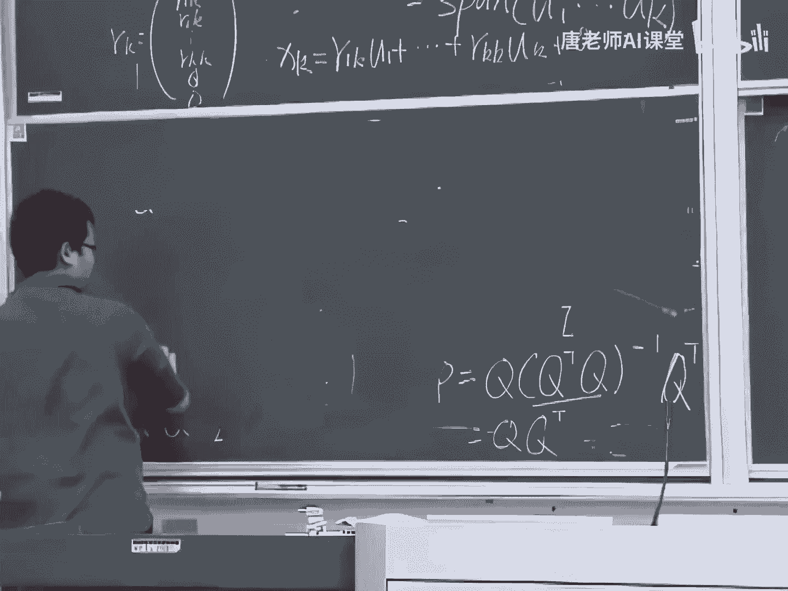
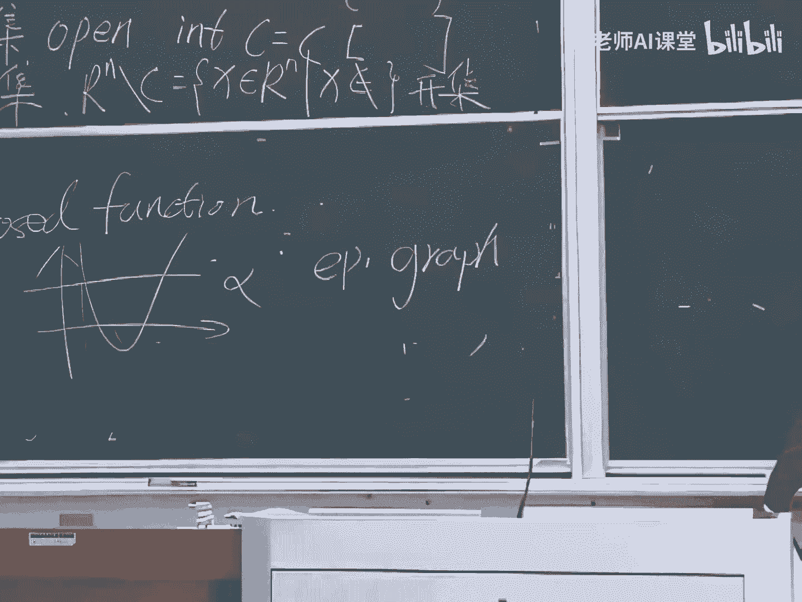

# 【比刷剧还爽！】这太完整了！量化交易和python金融分析实战课程，全程干货无废话 入门到精通一步到位！（数据挖掘分析／大数据／可视化／投资／金融／股票／算法） - P90：95. 33.34.线性代数知识：Byod的《Convex Optimization》附(Av526664194,P33) - AI算法-溜溜 - BV1iC411n7XN

分解还有什么正交化程序，那些东西先是先是正经，这个就两个两个列向量，如果它正交的话，他就满足这个性质，然后就这一句话就行了。

火影。

我们现在只看那个一个一个比较低维的，这个B在A上的投影就是P，然后这个是他们的的差，就是就是E就是E等于B减P，然后然后我们很明显发现A和E是正交的，我们就有，然后分解开就是，所以等于X等。

那个充电还有啊，对不好意思，这个P这个等于X等于A，这个是个方向，然后这是一个标量，让它们乘积等于P，然后我们就得到A和他这个是是那个正交的，然后再到这个东西，这就是个系数，然后他的投影就是。

这就是我们在低位的情况下投的那个投影，就是这个，然后现在我们到高位，呃在此之前先先写一个定理是，如果A的A的各个列向量是线性无关的，那么A的转置乘以A1定可逆，这个其实就等于。

我们让A的转置乘以A乘以X等于零，其中其中那个X1定等于一定是零，这个很容易就证明一下，我们这边乘一个X的转置乘以T等于零，这个就等于A的X的转置乘以A的X等于零。

这个很明显就是AAX的长度的平方等于零，那么肯定等于，那ax肯定肯定等于零，那么A又A又线性无关的，那么X等于零，这就得到了，然后然后我们在高位的时候会用到这个节奏，嗯这个同样的。

然后A1和A2是这个空间的的机，我们先把它当它是一个平面，然后还是E等于E减P，那么这个P呢它是它是它的两个G，那么就是X1乘以A1加上X2，乘以二，等于AX，同样的这个和这个E和。

分别和A1和A2是正交的，那么，选个B减AXAX等于零，然后A2乘以B减AX也就等于零，我们写的再整齐一点，就是B减AX等于零，然后把它分拆开之后，就是A的转置乘以AX等于A的转置乘以B。

这个公式非常重要，然后我们知道这个通过这个结论，我们知道这个东西一定是可逆的，因为那个是可逆的，所以X就等于，然后他的投影他在那个P投影那个P，这是带等于ax等于A乘以，然后我们就就等于一个大P乘以B。

这个B这个P就是投影证，传说中的投影阵，然后有人可能会说，那你这个投影证吗，那你不是可以拆开一下，就等于一，不就等于单位向量吗，其实这是不对的，因为这个A不一定是方阵，但如果A是个方阵，而且可逆的话。

那么A肯定表示他A的列向量，列空间表示的是一个RN，就是那你你是RN，那个时候它的它的特征症P他就是他他就是I，那个时候他就是I，然后你在一个你任何一个向量在N维N维，N维空间的向量。

你在N维空间里面投影，它肯定还是它本身吗，所以这个也是没有冲突的，然后再稍微提一下通用阵的性质，首先P的转置等于P，这个是肯定可以从这个特镇的可以可以算出来，然后然后P乘以P，然后还还等于P。

这个这个我们可以从另外一个解释一下，就是你你你你你有一个向量，然后给一个空间，然后投影之后，然后你再怎么投影之后得到结果，你再给他再给这个这个空间投影，他得到的结果还是一样的，还是投影一次的效果一样。

所以说我们说如果P的是N的话，那还是P，然后对于我，然后我们可能经常会听到一个那个最高城，最高城的时候呃，我们就会用到一个在投影，他就用了一些知识投影的概念，就用到这个式子。

然后这个式子得到得到的是一个近似的，因为他在摇绳子的时候，是那个他是他是他可能没有解的，比如说，这样的一个肯定是肯定是这样的，一个三三个他肯定是没有解的，就比如说C这是D他肯定是没有解的。

然后我们通过呃这个他肯定就往上就往上投影，投影到一个线上，然后走到这个东西，然后这就是他的投影，然后我们还可以说他的投影证好，这个就是头头，这是第一，第一部分就是投影，然后接下来是呃就是调用正胶机。

然后奔着正胶机是个什么样子呢，就是QA转置乘以，如果两个是两个向量，是标准标准正交，正交的向量就是这样的一个，然后对于一个标准正交的，它的列空间向量是标准正交的矩阵，Q就是Q1Q2，一直得到QN。

这都是一个列向量，然后这个它的它它的转置乘以自身，就是标准标准向量单位向量，好标准重要机，它有什么好说的呀，它它对我们比如刚才说的那个投影镇，它是一个稍微稍微复杂一点的，稍微复杂一点的一个举人运算。

我是专职，乘以Q7，那如果他是标准正交的话，那这个肯定就等于A，然后他就等于Q乘以Q的转置，如果如果他是，如果他这个还是一个方阵的话，那肯定还是就等于I呃，这个是如如如果的，如果它等于双证的话，等于按。

然后他就没有能看出来，那个你要求求求出来标准正交基之后，然后你有好多复杂的那个矩阵运算，就会变得非常容易好，那下一指导怎么怎么样得到一个标准的标记，最关键的施密特正交化程序，然后我们利用，X 1x2。

一直到XN，子空间子空间W的一手机，然后他然后我们要求的是一个标准正交基，U1到UN，呃这个其实我们要怎样求出一个标准要切，其实这个还是稍微画一个图嗯，就是这是一个A。

我们再来一个B怎么得到他转正交接了，那我如果我们把他这个当成一个，就是那个我们要求的那个，比如说U1，然后这个是是B那我们B减去B在它上的投影，是不是就得到了，得到了这部分就是这部分就是我们求的U2。

然后把它那个单位化之后，就是标准标题，这个就是我跟那个呃，高安的施密特正交化程序的一个，最难应付的一个呃呃一个思路，然后具体的就是P1等于X1。

然后我们要我们跳的U1，就把它当单位，会，然后pk呢等于XK减去，我先把这个先写上，我不知道这个底下肯定是等于一的，根据那个银他正交，然后UK就等于pk，然后再把它，这个就是那个证券化程序。

然后这块可能大家可能可能乍一看，不知道怎么回事，其实就是刚才，好像那个擦掉了，就是刚才我们在一维的时候，他那个给条线的投影，这个就是就是就这个式子，我们把他的投影每次每次都剪掉。

其他的那个我们已知的这个是第K个，然后把钱的一到K减一全部投影全部剪掉，然后得到的就是一个肯定是一个正交的，然后把它在保上保上单位单位单位单位向量，然后就到呃这个施密特，关注施密特正交化程序完了之后。

然后我们就可以进行调，可以我们现在不就到那个qr分解，刷分解，然后其中这个，这个A等于qr，然后A是个M乘以N的一个矩阵，这个是M乘以N，它是一个呃A的，他这个QQ是A的，列它的列空间的一组标准重要机。

我我我我我我我用我用这样表示，我这个表示裂空间啊，他的A的列空间，A的列空间的一个标准正交基认证要求怎么求，就是我们为什么要说这个正化程序的原因，得到之后，然后R呢是一个分别是N乘N。

然后他是一个上三角，可逆的，一个矩阵，这个就是qr qr分解，然后我们稍微稍微说明一下这个，然后我们就先，构造一下哈德，裂空间的一个标准成交机，U一一直到UN，这就是刚才由正交化程序得到的。

然后我们表示为哎我有多小U一一直得到UN，然后X，对于我们之前的那个，之前提到的那个X，哎对于，K等于一，一直到N，XK他，属于，原来的那个那个那个他们一组机，原始的那一组机的。

一个战场这个区别就是他的标准成交接的，第一个当场，我们就可以守为XK就等于R1K11加上，RKKUK加上下都是零乘以什么什么什么，然后这个RK就是R1K，R2K遇到2KK后面前面是零。

然后XK我们就可以减减小VQ乘以2K，那么A等于X一一直到XK就等于QR，这就是基本上的一个qr的一个分解的一个证明，然后他qr分解一般可以应用到一呃，我如果刚才那个说那个碎二乘。

它是一个解决的是一个超定的问题，因为超定的，因为他没有解，我们会有近似解决，往往那条线上投影，然后QRQR这个东西呢它就可以，我们主要用来解决一个限定了一个方程。

比如说ax等于B然后A属于一个P乘以N，最终P是小于N的，这样他肯定是限定的，然后A就是一个它就是一个P长以N的，然后我们的我们假设它的它的质，就等于P啊，这个这个可以，这个也不是一般一般性。

然后我们可以对A的转置求qr分解，要得到Q1Q2乘以个R和NRR和零，这个应该没有问题，然后得到的X就等于转至逆的转置，等于乘以乘以乘以B，然后我们就然后这个时候呢，我们就诶这个是Q1Q1。

这是Q1Q200空间了，然后我们要得到X就等于我们这个求导的，求得的X加上Q2的Z，N减P这个这个如果对那个解，那个对空间，还有对那个了解的算是比较清楚的话，应该可以看出。

这个这个其实就是A的零空间的的记忆的，一个，就是自由变量的那个的那个这个特解这个解，然后我们就用qr分解，就把这个限定就解决了，然后下载的重点问题就没有多少了，下来就是一些一堆概念。

下面的讲的内容就是那个全部是AA2，A 3a4，然后有书的可以看书，我就少抄一点，A2，首先那个叫什么那个什么是内敛，那点就是，如果存在一个衣服大一零，这是C1个C的C的内点。

它仍然属于C就是他在一个领域内，它仍然属于C，这表示他是内敛，然后内点提，用这个表示这个符号表示就是所有的，就是这个C中它所有内点的集合，就是那两集，然后下面就是开机，开局，open这是。

如果他满足这个条件，表示他是开机，其实我们可以不理解，就是开机是我们想就是这个里面数组里面，他一个这这这就是我们那个什么开区间嘛，然后我们还有个B级啊，我们可以用类似那样的概念去去去理解就行了。

我们可以理解为它是一个必须经，它的定义是，是这个集合是，开机，然后其实理解理解的时候，其实可以用他那个什么我们熟知的那些什么，开区间闭区间去理解就行了，然后，看来就是什么是边界帮助，这就是边界派等于。

我可以用我们用一个不用不用一个形式化定义，就是用一个它满足什么条件呢，对所有的，这所有的一部分大于零，肯定存在一个Y属于C，存在一个Z不属于C嗯，满足Y减X，这个就是什么是帮助，然后下一句是什么。

然后就是什么是上学记，上学记就是我我已经不写了，就是最小上界下界最最大下界，然后到A3，A3就是函数怎么表示，这个函数就这样表示，然后他函数的连续，哦这是没事，得去吧，他是连续的，如果他是连续的。

满足对所有的上大于零，然后存在一个德尔塔，慢速Y减X，可以退出，减去FX，还是小于等于硬送，我靠，现在是什么，是，Close the function，什么是cos风神A3里面也有，就是他的我举个例子。

就是他的一个行一个推切线，它的阿尔法subset，它仍然是一个B级，它就是cost function，然后还有一个等价的定义，就是它的epigraph，是一个必品，然后现在就到A4，什么是导数。

对于对于F在X处可微，如果F在X处可微，那么他一定要满足一个一个它有一个，然后这个这个东西就是它的导数，然后我们可以通过一些一阶的近似，它是在X轴FFZ在X轴的一个一阶的近似。

我们可以通过对FC进行求导，就得到了就得到这东西，这就是导数，然后再来一道，然后一到梯度梯度就是我书上都有，它的它的它的转置，所以FZ呢我们就可以表示为，A减X，然后书上就有一个例子，例子例子就不说了。

大家好好看一下吧，然后他有个链式链式法则，这个，对F还有GH他的他有些条件，那个我我我我就不列了，反正HZ等于，F，然后链式法则就是，乘乘以一个D的FX，然后栗子我也就不学了，然后就就就这样吧。

二二阶的自己看一下，没有时间了，不好意思。