# 【爆肝整理！】python量化交易，从入门到项目实战保姆级量化金融教程！（数据挖掘分析／大数据／可视化／算法） - P16：- 17.17.18.2-量化交易所需技能分析P18(P17)(P17) - 周志华机器学习- - BV1ZS411c79U

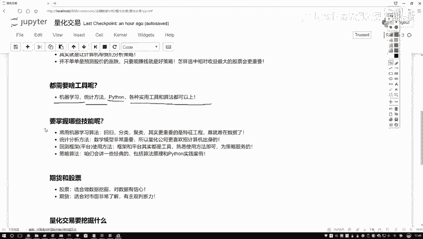

那都需要哪些技能呢，你看刚才我是不是写了机器学算法当中啊，几大项回归分类聚类，这都不用说了吧，最常规了，而且更重要的是什么，你看我这里写了叫做一个特征工程，做过数据挖掘的同学啊，肯定都有个印象。

哎你说现在我要去呃做一件事，那做一件事我是算法更重要呢，还是数据更重要呢，我在讲机器学习课程当中啊，经常会提到一点啊，就是数据决定了你模型的一个上限，算法呢，只是决定咱们怎么样去逼近于这样一个上限吧。

所以这一块有一个词叫特征工程，说白了就是怎么样处理数据，怎么样在海量数据当中找出来，最有价值的信息吧，因为我们现在在做量化交易过程当中，拿到一些金融数据啊，我可以这么说吧，金融数据那简直太庞大了。

比如说你想分析股票，那你不光有什么，大家可能觉得就是一个收盘价，开盘价啊，就是这两个指标吧，其实不光这两个吧，股票对应什么对应的公司吧，公司当中财务数据啊，各种各样指标数据是不是都来了。

那所以说呀我们要面对的可能是更为复杂，更为庞大的数据了，你想把这么多层面数据都融入到一起啊，比如说有一个市场的数据，有各个公司数据，有各种财务报表的数据，还有股市走势里的数据。

这些可能都会对你最终结果产生影响吧，那你怎么样设计算法啊，怎么样把这些算法融入到我们的数据当中啊，这就是特征工程了，怎么样选择最有价值的数据呃，怎么说呢，就是机器学习当中最难的一点啊。

其实并不是算法是怎么处理数据啊，难就难在数据了，这里我写了一下，还需要什么统计学方法啊，像我们说的，大家可能可以看一些关于这个量化交易啊，他一些招聘的岗位都会写什么啊，要不然希望你是数学专业。

统计学专业，计算机专业啊，或者金融专业，是不是哎为什么说需要这么多跟数学相关的呀，其实在我们计算当中啊，你说无论是算法还是你的一个策略都是什么，把数学公式应用到了数据当中吧。

所以说啊数学这个东西已经不用强调了，我讲机器学习的当中啊，大家可能觉着讲机器学习里边数学讲太多了，因为数学就是一个本质了，这里啊，需要大家掌握的数学知识点还是蛮多的啊，然后第三点就是一些框架的使用。

咱们课程当中啊会选择一款啊，我先不说，等后续啊，咱们会介绍选择一款我们的一个平台，来给大家去讲讲怎么样去一个平台诶，做一些回测，做一些我们策略的实践，以及呢看一看我们策略结果好坏。

其实大家咱们现在哎去一搜，你搜这个量化交易啊，能搜到好多好多平台，是不是，那你说具体选哪个平台啊，其实这里也没有具体选哪一片一说，那就是看哪个方便吧，我会给大家找一个，就是相对来说用起来是比较方便的。

相当于就是API我尽量使得简单一些，可视化展示的清晰一些的啊，会给大家选择一个框架啊，相当于一个平台，在API当中啊，你可以把写Python代码，写Python代码之后，你可以直接编译。

然后得到一个运行结果，运行结果就是呃一个持续时间，比如说你观察这个10年到20年期间，你设计个策略，然后它的一个策略，然后在每一天实施的一个情况，然后你的一个收益怎么样，你最终的一个结果啊。

这是一些平台使用，但这里啊你看我写的平台和框架这些东西啊，都是什么，都是我们的一个工具吧，工具就是熟记就行，没必要去背，也没必要去记啊，简单了解或者说会用就行了，还有就是策略算法，算法当中啊。

呃其实蛮多的，你要想看最新的，那建议大家去看一些诶，经常非常经典的一些论文吧，论文当中讲的都是些新的，但是我们课程当中呢会给大家讲啊，最常用的最经典的一些算法啊，比如说呃怎么样继续算法去做呀。

怎么样会去用一些常用的策略算法啊，啊这些全是会给大家去讲原理，以及呢在Python当中啊，咱们该怎么样去用啊，注意一下我们课程的一个名字，跟Python是直接挂钩的吧。

所以说啊咱们的重点不会给大家去讲啊，怎么样教你炒股票挣钱，怎么样教你去做这个，做那个我们重点是怎么样在Python当中给它做出来，我们重点是要落在一个案例啊。

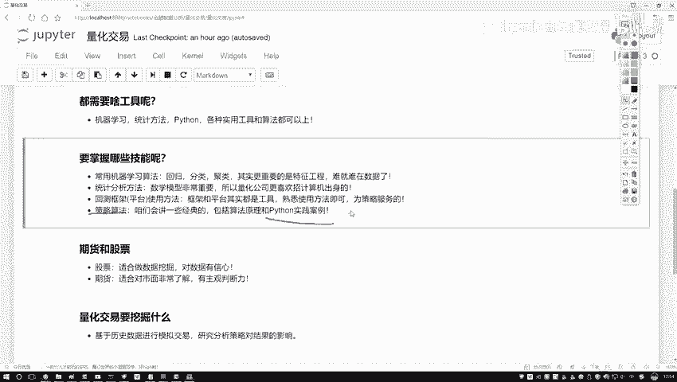

实践当中，这个是我们的一个重点，然后呢今有同学问我啊，就是咱们现在这个期货和这个股票。

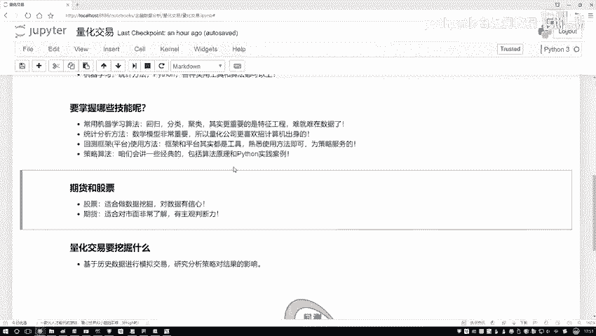

哎你说咱们在量化交易当中都能去做。

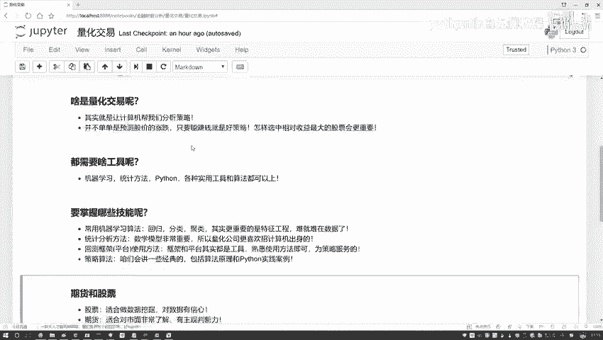

那我们可能更重点的是做哪一个呀，我觉得可能是跟股票是相关的，因为对于一个股票数据来说啊，咱们可以看到什么，你自然而然股票数据，各种各样的数据指标是不是都有啊，它适合做这个数据挖掘啊。

所以说我们接下来课程的一个重点，可能是跟这个股票更相关一些，因为在股票当中做数据挖掘相对会更容易一些，那期货为什么不适合，其实大家估计有一点感觉啊，就是那些期货玩的厉害的，玩的牛的人，他都什么样。

他都是专门去研究这个东西的吧，他不是一个学it出身的吧，也不是一个学数学出身的吧，他可能就是专门哎这个行业的一个从业人员，因为他对这个市场啊非常非常了解，因为期货这个东西跟股票可能稍微有点区别啊。

期货跟市场关系更大一些，但是你看一旦它跟市场关系更大一些，相当于主观判断力是不是更强一些啊，你判断这个东西什么时候，那可能是一个高价，什么时候可能是个低价，主观的因素会更重要一点吧。

所以说啊咱们课程当中啊，关于期货哎，会举几个小例子，不当做一个重点，我们重点会给大家讲什么，讲股票，因为股票更适合做数据挖掘。

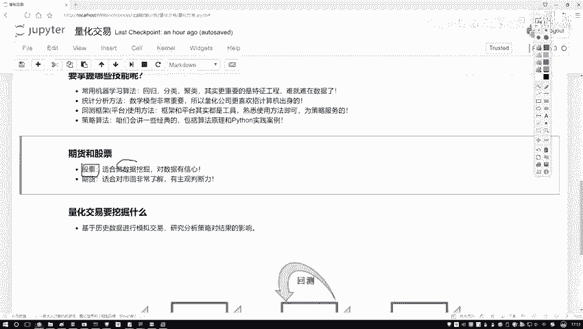

更适合咱们拿Python做案例，要做一些实际的任务，既然提到了这个数据挖掘，那咱们不得不说啊，数据挖掘要干什么呀，其实说白了数据挖掘就是给我们拿到了这些，咱们简单点就行不，大家都不用去记啊。

拿到了一份数据之后，怎么样对数据做处理啊，怎么样你去设计一个交易策略啊，好了有数据有策略之后，怎么样融入到一起啊，融入到一起之后，其实说白了就是一个回测，回测，意思就是说呃你现在我拿到历史的一个数据。

然后你告诉我你要用什么样的方法去做，然后我测试一下当前你这个策略怎么样，是不是那测测试好，这些策略都是对历史数据来去做的吧，在对历史数据做了完之后，我们是不是要对实际的决策产生什么一些指导。

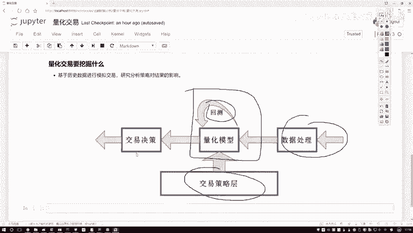

一些依据啊，这个就是我们量化交易啊，大家要去做一件事，其实呢你可以把这个东西啊，你叫做数据挖掘，也我觉着也没什么问题啊，因为我是专门做机器学习的，我觉得这个东西它其实说白了就是数据挖掘吧。

把数据挖掘算法应用到金融数据当中了，起了个名字叫做一个量化交易啊，但是其实还以前有同学问我，就是这个量化交易哎，是不是就是去预测一下我这个股票哎，明天是涨还是跌啊，然后你继续它的涨跌做一些事啊。

其实不仅是要做这样一件事，预测涨跌啊，其实可能不是那么特别容易啊，我们刚才说的什么，我们量化交易目的是什么，是要做收益吧，所以说啊就是当我们啊在做的过程当中，可能并不是非要关注于一个涨和一个跌。

而可能更关注于什么，怎么样让收益最大吧，那比如说现在啊300只股票摆在一个池子里边，我说这池子里的指股票你都可以去玩，那比如说你本金是一定的，怎么样能让你的收益最大呀，怎么样去选股，选择最好的一个股票。

选择单位风险收益最高的一个股票，那这是不是也是数据挖掘啊，所以说啊量化交易，而不是像大家想的就是预测一个走势，那就是一个经济学一问题了吗，这里它是一个综合学科啊，但是目的是一样的。

就是要咱们怎么样收益最大化吧行了。

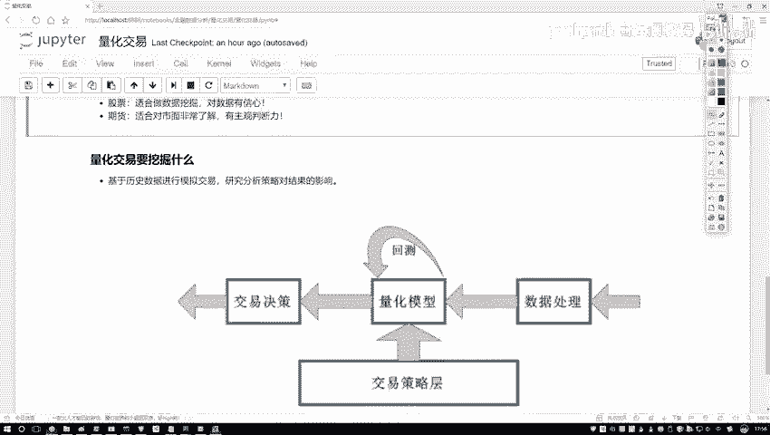

关于量化交易不需要大家掌握太多，你对它的一个基本概念有一个了解就行了。

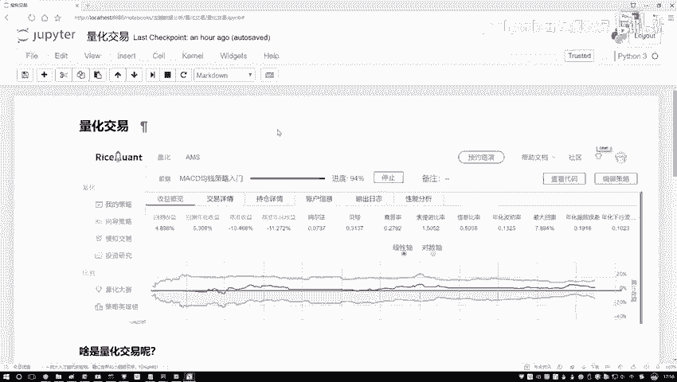

没必要看一些长篇大论。

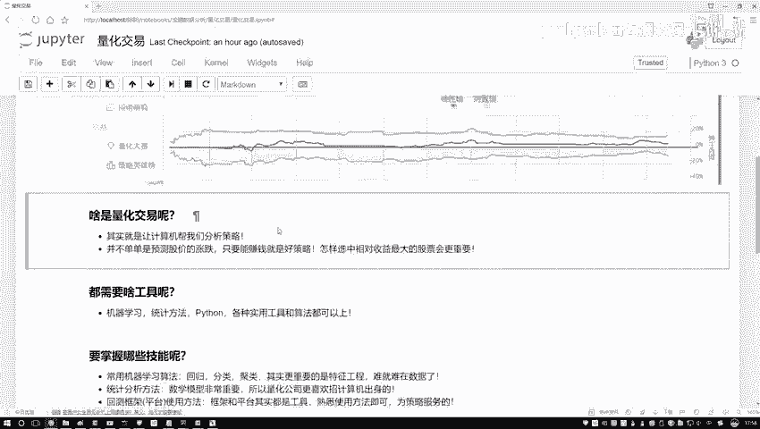

也没必要看一些历史啊，你看历史都是国外的历史，因为中国这个第一点股市开放的比较晚，是不是，而且这些常用算法，也大部分都是从国外流行进来的吧，人家研究这个东西，研究了几十年，中国的路，其实怎么说呢。

发展的已经比人家晚了三四十年了哦。

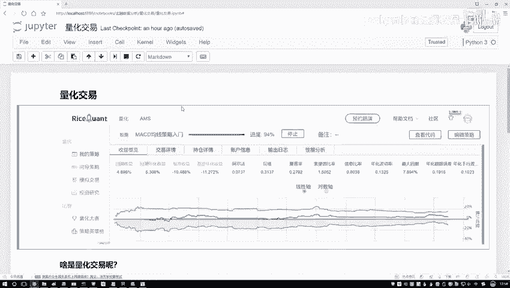

所以这个历史咱都不用去看了，国外爱咋做咋做呗，这些咱们都不用关心，你只需要去知道电话交易要干什么的。

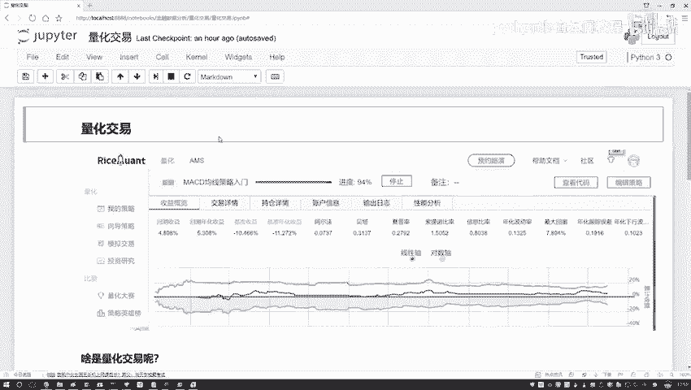

数据挖掘什么意思，用什么工具哎。

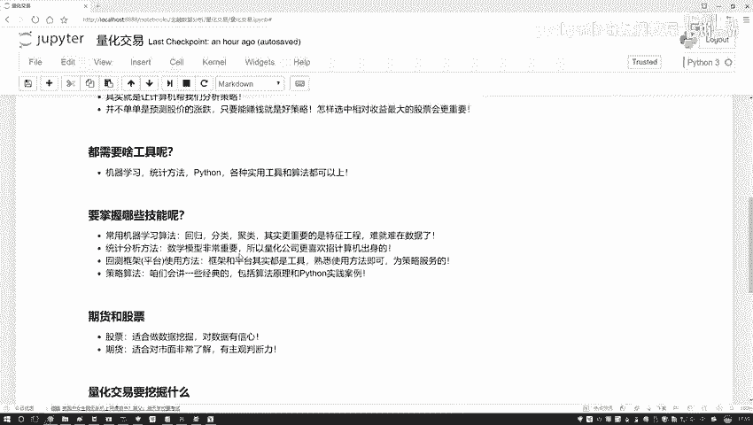

大概我们后续要讲什么，这就可以了，这时先给大家概述了一下我们的量化交易哎。

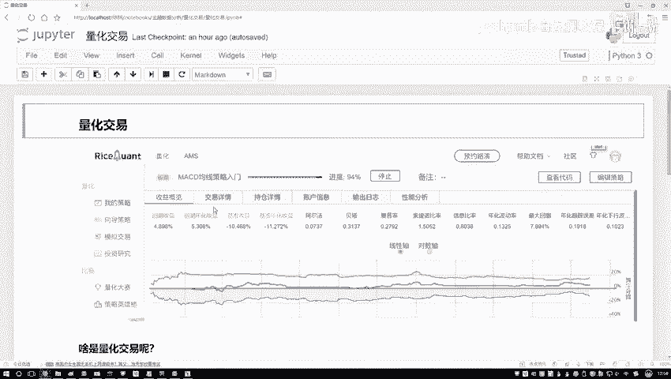