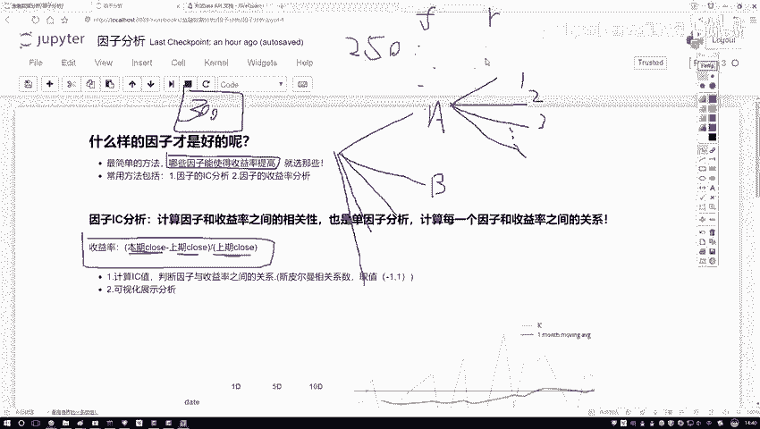
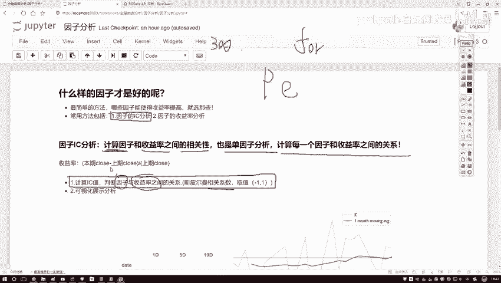
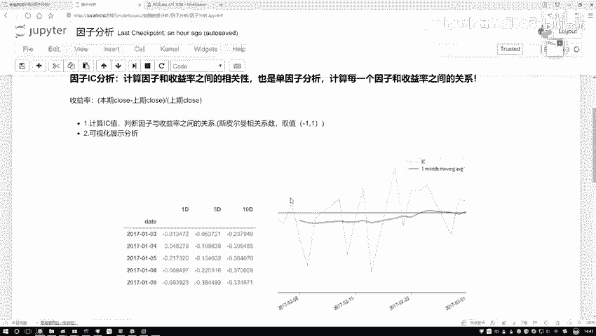
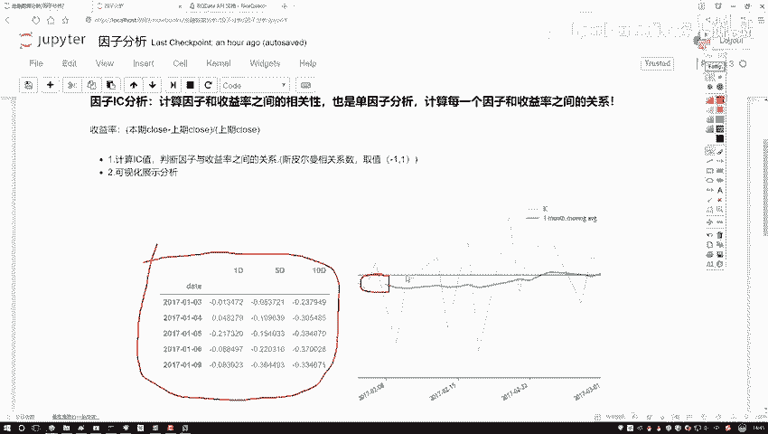
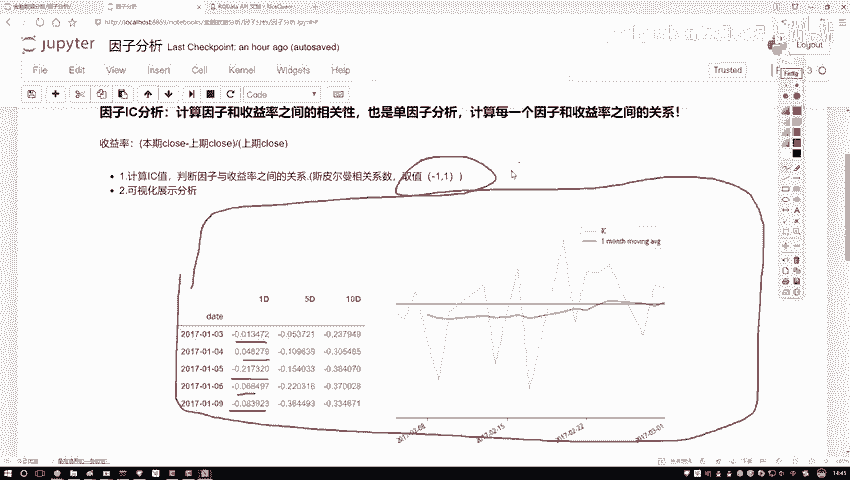

# 【爆肝整理！】python量化交易，从入门到项目实战保姆级量化金融教程！（数据挖掘分析／大数据／可视化／算法） - P34：- 35.35.36.1-因子分析概述P36(P35)(P35) - 周志华机器学习- - BV1ZS411c79U

这节课啊咱们来说一下因子分析啊，先给大家解释一下我们要分析的一个目标，好比说现在这样啊，我们拿到了哎股票当中啊很多的一些因子数据，那比如说啊咱们现在啊，就是每个股票我都能取出各种各样的指标吧。

那指标随便列两个，比如大家常见的一些基本面信息，我写个A还有一些技术指标的是也可以啊，那这块如果说咱再往下去画，那我们的因子能分成好多大类吧，有很多大类的因子，然后呢每度每个大类因子。

比如说基本面当中的，那你还能再细分吧，再细分个123点点点点，一直好多好多个吧，各种各样的指标，那问题来了，那比如现在你手里啊，你能拿到有这么300个指标，或者说你手里现在有300个因子。

那你说这300因子啊，一会儿当我要做一些回测的时候，或者说我要设计策略的时候，咱们是都用呢，还是用部分几个呀，我们是不是得做这样一件事，判断一下什么样的一个因子诶，是我想要的，什么因子是我不想要的。

换句话来说哎现在300因子我们给它放到这啊，要干什么，我说给他们做一个排序吧，按照他们的一个成绩，什么叫做一个成绩呢，哎比如因此我说按他呀，对我最终的一个收益的影响，我说给打个分吧，有打98分的。

意味着这因子挺好的，有打97，90 6951照零分是吧，把这些因子从上到下，我能不能排一个序啊，好像来说能，因为每个因子对最终结果影响是不一样的吧，那现在我们就要做这样一件事啊。

看一看什么样的因子啊才是好的，那怎么看才是好的呢，其实最简单有几种方法，在这里给大家介绍两种呃，最基本的方法是什么，看我们的一个收益率，哎既然咱提到收益率啊，咱来解释解释什么叫收益率。

你看我这样写了收益率，它是这样一件事啊，就是这个这些知识点大家简单点就行啊，都不用去记，我觉得都很简单，也没有列公式啊，设置率这样，那比如咱们现在呃当你去统计的时候，你说你按月统计也行。

按五天按一天也行，咱拿一天举例子，那比如你现在你想看每天的收益率，那等于什么，当天的一个哎收盘价减去啊，上一期就是上一个交易日吧，它的一个收盘价再比上上一个交易日，它的一个收盘价叫做什么。

我们当前这一天啊，我们的一个收益率，那其实呢是要这样一件事，那你说我股票也挣钱，哎是不是说我要积少成多呀，每一天都想去挣吧，那好了，我说看一下哎呦，我这个因子啊它也在变，我的收益率呢它也在变。

我想看一看因子和收益率，我们现在不是有好多天然指标吗，比如这样，现在呢我说我连续啊取了这么一年，一年可能有取到了250天吧，250天当中啊，你有这个，因此我写一个F，还有一个收益率，你写一个二。

是不是它俩之间会有很多对应的一个值啊，每天都在变化吧，我们需要看什么，哎呦这个因子它的一个走势跟我收益率，它的一个走势怎么样，有什么样的一个关系呢，你是一个线性的呀，还是一个就是相关的，还是个不相关啊。

如果相关的时候哎，你跟我这个相关宠物怎么样，是正的还是个负的呀，咱要把这些指标拿出来吧。

其实说白了我们要对因子哎，就是做这样一个分析分析当中啊，咱们要做两件事，第一件事就是一个因子的IIC分析，什么叫IC啊，呃呃先给大家解释吧，什么叫CC这样一件事啊，其实很简单。

他算的是一个相关性的指标啊，你看这块我也写了一会，我们要也要去做的计算什么来计算一个IIC值，IC值是这样，他说啊计算一下因子啊，我们的因子就是你选择，比如咱们一会儿会选一个P指标是吧，你拿某个指标哎。

跟这个收益率我直接算一个相关性，虽然这个相关性是一个斯皮尔曼相关系数啊，而这个大家减下来就行，然后它的取值范围是一到正一，越近于正一的，那越正相关越近于一的，越负相关越近于零的表示没什么关系啊。

这样一件事要算因子和我们收益率之间啊，这样一个相关相关性，然后呢，我们也可以把这件事叫做一个单因子分析，哎，为什么要单因子分析啊，比如现在我这个选指标当中有300个，那收益率哎。

收益率相对来说是固定的吧，那每天什么样就是这个收益率吧，好了，那收益率啊，在相对固定的前提下，我是不是得看一下每一个因子哎，跟我收益率关系，第一个因子跟收益率的关系，第二个因子。

第三个一直到第300个吧，所以给我们的感觉啊，一会儿哎我们可能会做一个for循环，是不是在这个for循环当中啊，要去便利啊啊，每一个因子跟收益率啊之间的一个关系，计算它们之间的一个。

A4平面交换系数就行了啊，然后呢这个是不是要去计算诶，那计算结果叫什么，因此和收益率之间的这个斯皮尔曼相关系数，我们计算出来的结果，就把它呀叫做一个IC值了啊，这就是他的个缩写叫IC值。

然后呢咱们来想吧，那你说你计算出了这个S1值之后，我是不是得看一看它的C值的一个大小啊。

那下面我们还要做一个分析的操作，在这里呢，比如说啊。

左边这个就是我们一会儿要去做的一个结果，那这里是统计了每一天，然后他的一个IIC值，然后它的一个变化情况，然后右边这张图呢就是呃蓝色这条线他画的，你看这块写的比较少，就是画了几个月的时间。

蓝色这个就是它的IC值，然后它的一个折就是它的一个那个折线图啊，统计出来了，然后绿色的就是它的一个均线图啊，均线图当相当于就是呃你不是一天一天的，你可以是十天的统计一个值，十天统计一个值。

因为你看前面它有个空值吧，相当于这个是个窗口统计均值。

这个再一个窗口再一个窗口统一均值，哎这是一个均线啊，这里给大家看了一下，就是一会儿啊我们要做的几个指标，大家先不用去管啊，这些数值这些东西我们一会怎么去做，一会儿代码当中，咱为大家慢慢去说啊。

怎么样画这个图，以及怎么样把这个结果给它呈现出来，然后呢你看这个基础当中啊，它是什么，是不是有一些正负值啊，哎像我刚才说的，我们有一个取值范围吧，一到正一之间，我们要找啊。

看一看哪些因子跟收益率之间关系越大，关系越大的，我来挖掘一下他跟我什么关系，是不是说这件事做的越值得呀，那跟我的没什么关系的，或者说你这个这个东西反而会影响我的。

是不是干脆咱不管就行了啊。