# 【爆肝整理！】python量化交易，从入门到项目实战保姆级量化金融教程！（数据挖掘分析／大数据／可视化／算法） - P57：- 58.58.59.1-回归任务概述P59(P58)(P58) - 周志华机器学习- - BV1ZS411c79U

好这节课咱们来一起做一下回归策略分析啊，先跟大家说一下什么叫做一个回归策略，比如说我们之前啊在说买股票的时候，是不是说我现在想去预测一下哎，明天它是一个涨呢还是一个跌呢，如果涨了啊，那我说我现在买一点。

明天我再卖是不是就发了，那如果跌了呢，那我提前卖出去，然后等它跌到底了，我再买回来，那是不是相当于也是我赚了呀，在这里咱们来想一想，我最终目标，其实不就是想知道明天到底咋地嘛啊，是一个涨还是一个跌是吧。

那所谓的回归啊，就是这样，我们要借助于啊，我们现在手里有的哎一些历史数据，那比如说我想预测一个明天指标，那我可以看一下，就是今天的一些指标诶，前一天的前两天指标是不是都行啊。

啊这里我说前一天前两天啊不是一个选择题，不是说让你只能选前一天或者前两天，咱们可以选什么多一点的数据吧，比如说历史数据当中我能利用信息挺多，哎这有前一天的数据，还有前两天的前三天，前四天。

前五天的我是不是都能给它利用上去啊，那相对来说你用的数据的一个特征越多，咱的效果可能怎么样，会越好吧啊这个就是我们要去做的一件事啊，在历史数据当中啊，找一下哎之前我们的一个走势去预测一下。

接下来它的走势会长什么样子啊，这个东西啊叫做一个回归策略分析行了。

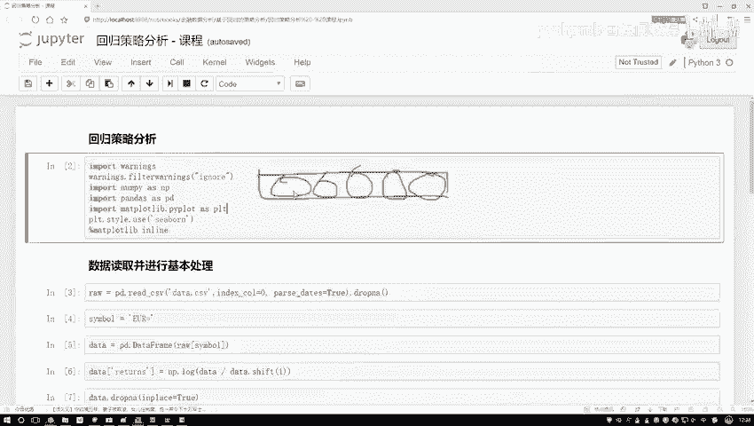

来看一下我们的一个做法吧，啊第一步啊不用说了，先把咱该导进来的工具包跟之前一样。

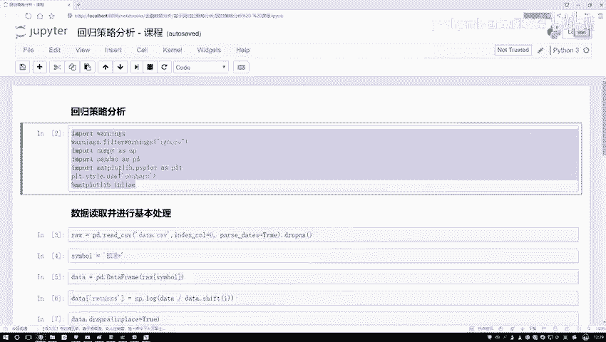

全复制粘贴过来就可以了，然后呢读数据数据啊，没变啊，还是我们那个data点CSV文件在这份数据当中啊，咱们之前用的是那个股价数据是吧，哎我们来换一换口味啊，这回啊我们指定这个UR啊，就是一个U啊。

不是指定的是那个欧元对那个美元啊。

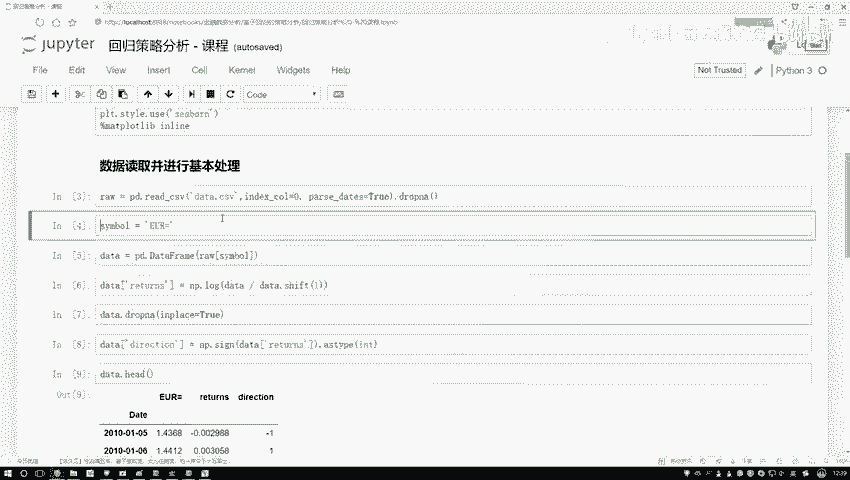

它的一个汇率的变化，当然这个汇率的变化啊，可能就是一个从一点几之前，可能一点几，现在可能跟一些历史数据啊不太一样了。

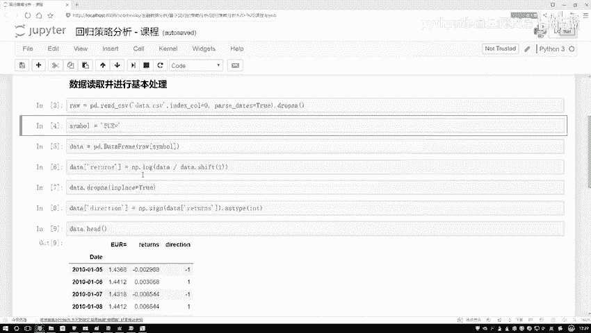

咱们就把这个当做是以前的一个指标就行了啊，现在可能变了，我们对我们来说没有什么影响，只要是数值的数据，咱都能玩起来的好了。

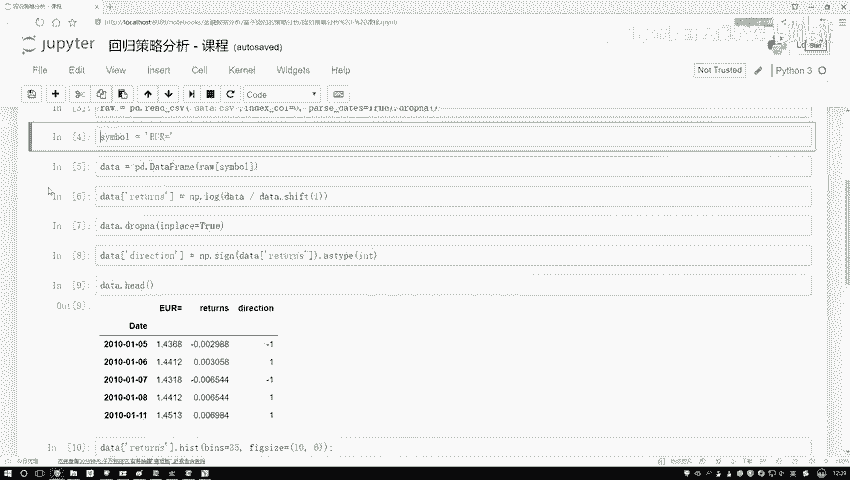

第一步把数据当中啊，我需要的列给它拿出来，然后之前啊，咱们是不是说要要要要要做一个指标叫什么啊，叫做一回报率是吧，合律当中啊，咱们之前说了，为了使得我这个结果哎，有一个累加性，所以说咱们之前啊做了什么。

做了一个对数吧，啊接下来咱们还是用这种方法，先对我们的数据啊，做一个基本的哎预处理的操作。

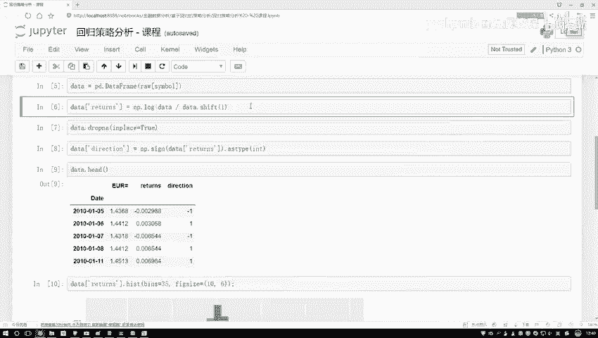

然后呢这一块去确实值，这都不用我说了吧，跟之前我们的操作方法都是一模一样的。

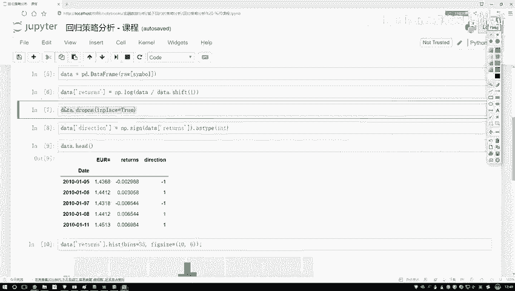

然后这里哎你看我在数据当中啊。

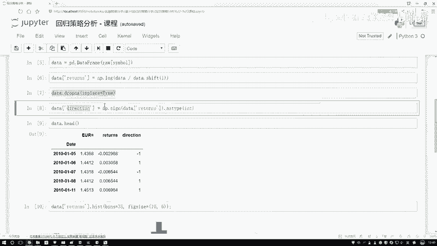

我加了一个新的列叫什么呢，哎叫做一个就是呃具体的一个指标的，一个就是分析吧，它交于这样一件事，你看这个回报率来说啊，有的时候啊它是一个负的，有的时候是一个正的是吧。

那其实这样我其实现在我对于它的一个正多少，负多少，那我都不管了，我只关心什么它的一个方向吧，你只需要告诉我它是一个涨还是一个跌啊，就得了，所以说我现在这里啊做了非常简单的一件事。

哎指定一个direction啊，相当于我的一个走势吧，啊它是往上走还是往下走，那这个指标怎么做出来呢，非常简单，看在咱们当前的这个returns数据当中啊，之前给大家解释过怎么去做的。

在这一块我直接取了什么，直接取了一个正负号，是不就行了，看他是一个负的啊，如果是个负的，我就用一正的，我就用个正一数就完事了，再给他s type一下啊，这是一个整形。

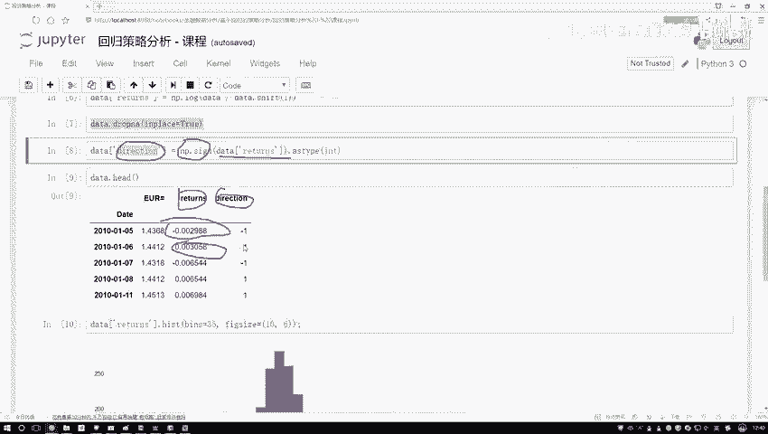

是不是得了啊，这我们当前啊在数据当中啊，引入了呃一个新的列，表示的是我的一个走势啊。

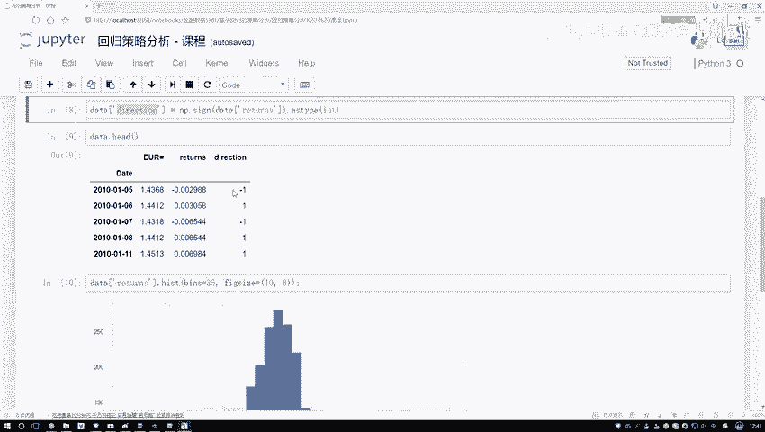

是一个往上还是一个往下的好了，对数据来说啊。

画了一个直方图啊，给我们第一个感觉，哼其实这个东西你看啊，它是以谁为基本上是以谁为底为这个均值了，可能不是那么标准啊，但是差不多的是不是基本上以零为均值了，然后左右来进行浮动啊。

啊这是它基本的一个走势行了。

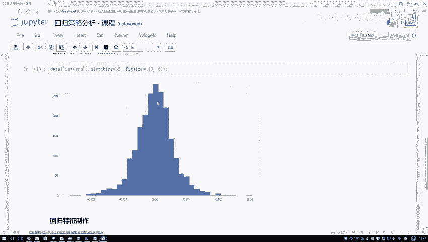

然后咱们来看一下吧，就是下面就是我们的重点了，怎么样啊。

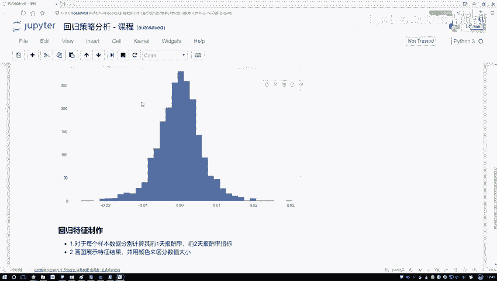

去做这个回归分析，其实这样先来看一下吧，今天我们要做几个任务啊。

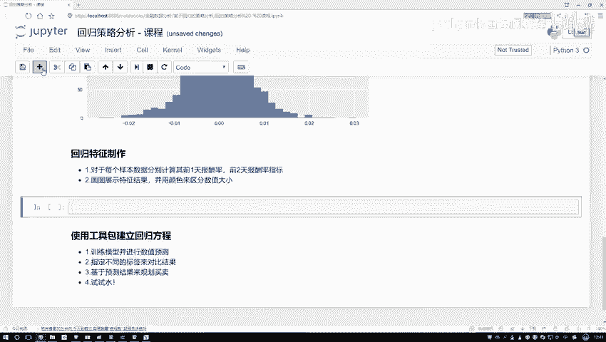

第一个任务之前咱们说的要做这个回归，我们手里得先有什么，那我们要做的这个东西，它是一个机器学习任务吧，基于一以前的一些指标去预测未来的一个值啊，咱们这管这个任务叫什么，是不是一个有监督任务啊。

所谓有监督任务，就是说手里你得有X还得有Y吧，X是你的指标，Y是你的一个答案啊，咱们得都有，这叫做一个回归任务，那在咱们当前的这个回归任务当中啊，哎你说我都需要做什么呢，是不是说我得把X找到。

Y也找到啊，那Y对于我们来说其实挺简单的。

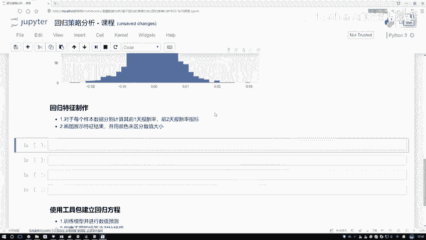

Y就是谁啊，我就想预测一下哎，明天它是一个涨还还是一个跌，是不是你可以把这个returns啊，这个当做by可以吧，或者说你换一下哎，或者说我说我现在啊，不想去预测它具体的一个涨跌的值。

我只想预测一下它到底是涨还是跌，你把这个direction这个东西当做Y是不是也行啊，啊一会儿相对来说我们有可以做两条分支吧，啊做两个对比实验，一个呢我写个Y1，一个写Y2。

就是呃第一次咱拿这个returns啊，当做我的一个目标值，第二次呢我拿这个by2啊，当做我的一个目标值是不是都行啊，反正都是预测一个结果吧。

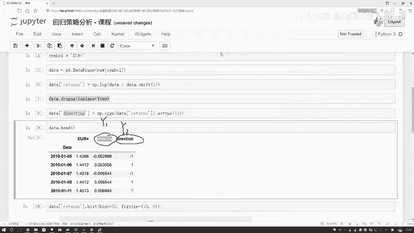