# 【爆肝整理！】python量化交易，从入门到项目实战保姆级量化金融教程！（数据挖掘分析／大数据／可视化／算法） - P58：- 59.59.60.2-特征可视化展示P60(P59)(P59) - 周志华机器学习- - BV1ZS411c79U

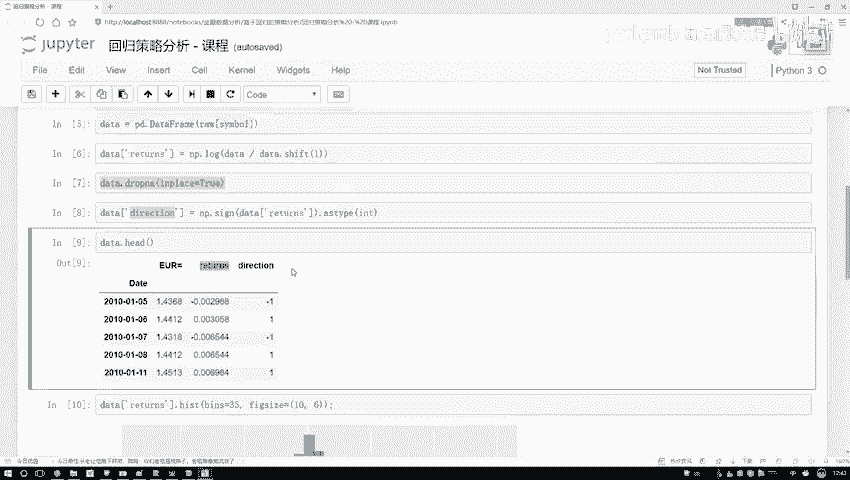

好了说完YY非常简单啊，数据当中咱直接有的哎，就是这些实际它怎么样了。

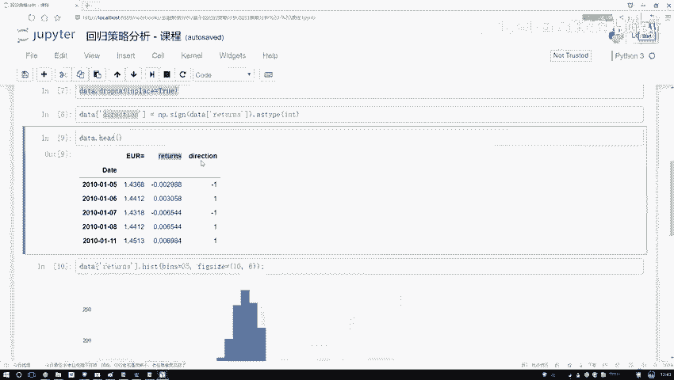

是不是那X呢，X当中啊，咱刚才是给大家说了，哎呦我们得选一选之前的一个数据来计算一下，来预测一下未来的一个走势吧，那比如说这样，我说我想预测一下今天啊它的一个回报率。

或者是今天对咱们的一个报酬率等于多少，那是不是说我得用一个前一天的也行是吧，或者是前一天的加前两天的啊，或者说再加前三天的是不是都行啊，在这里咱特征最好要多一点吧，行了，我们来看一下吧，怎么样去做。

首先呢我来定义一下，比如说哎，这里我说我想用前一天的和前两天的两个指标，行吧，你看这个要求他也说了，哎对于每个样本数据，我要分别计算一下他前一天的和这个前两天的，那那其实怎么去做，直接做什么操作。

点shift一下是不是就完事了好了，我们来写一下吧，啊第一步我在这里指定变量啊，这个变量就是嘶这里一会我们要创建两个，就是两个指标，一个是前一天的，一个是这个呃，前两天的哎，这是他俩名字。

我们把这个returns给shift一下啊，这就行了，这个就是我们的一个做法好了，在这个类似当中啊，我们来定义一个函数吧，来去帮我完成这样一个操作，呃函数就是我们去创建啊。

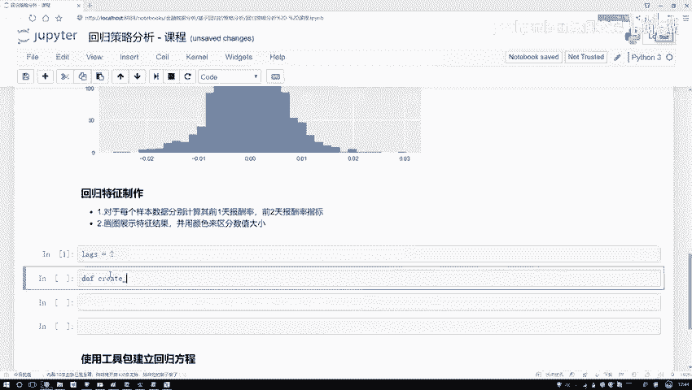

当前我们的一个指标，然后呢穿越鼠标当中，我们是不是得需要一些历史数据啊。

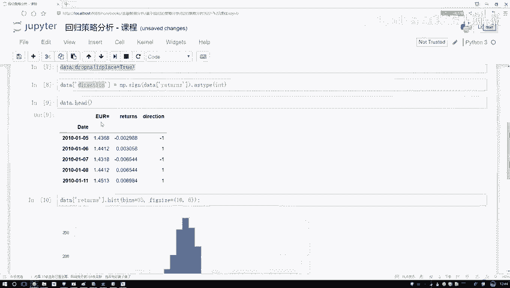

那你就直接把这个表格传去得了，把这个历史数据给传进去啊，传进来一个data。

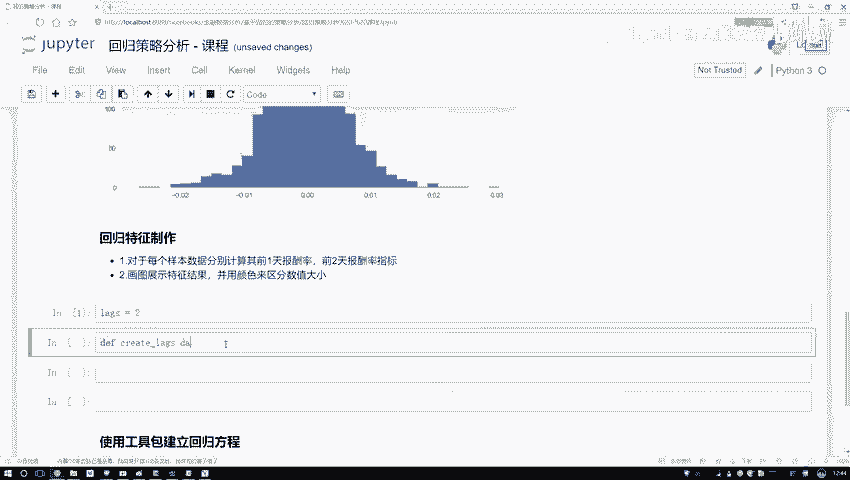

然后呢在这个函数当中啊，呃这样我说我现在去写一下吧，啊就是一会儿啊我会创出一些列是吧，好了一会儿在这里我们会创建出一些列。

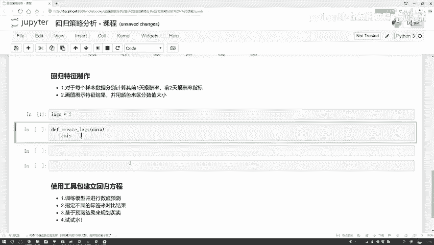

咱先把这个列啊写成个list，一会往里去填啊，然后呢我写一下吧，for什么呢，咱们得定义一下啊，你要去创建多少个特征，是不是这里哎你看我就写两个，那这里就是我们有第零个特征啊，不是就第一个特征。

还有第二特征数就行啦，好啦一然后到谁到这个它加一吧，它加一它为二，那你说这个这里写个一，这里写个三，什么意思啊，取左不取右，只能取到什么一二能取到三吗，不能取到吧，一个一个往上跳。

但是取不到右边右最右边这个，所以说这里要加上一个一啊，就是一会有第一个特征，还有第二特征，前一天还有前两天行了。

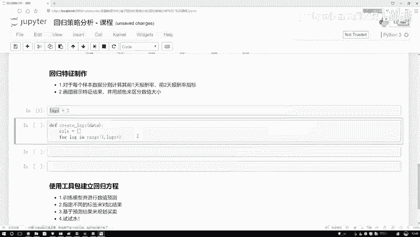

写完这个循环啊，在这循环当中，我说第一步啊，我先得去做一下，做什么我们特征的一个名字吧，好啦，我说我先指定啊，当前这一列这电影名呢咱刚也说了，叫做一个类一，还有一个类二来写一下吧，呃一和二。

那这个一和二是由谁来指定的，是不是由我当前就是遍历当中啊，每一个元素第一次是一，第二次是二，由它来去指定出来的，好了点，format一下，for you当中，我把当前这个指标传进去就行了吧。

哎第一次它就是一个E，就这里这个杠几啊，这块写了个写了一个括号，这个括号里边就是你封面里边是几啊，咱当前这个我一列当中名字就是杠几啊，这个意思好了。

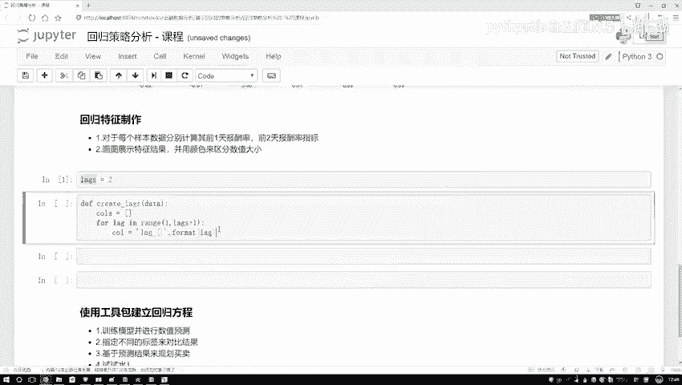

接下来有了列名之后，那我是不是说我得把这个列名啊，然后传入到我们当前的这个数据当中啊，好了指定好啊，传入到我们的data当中，那等于什么呢，是不是说等于啊咱当前data当中哎。

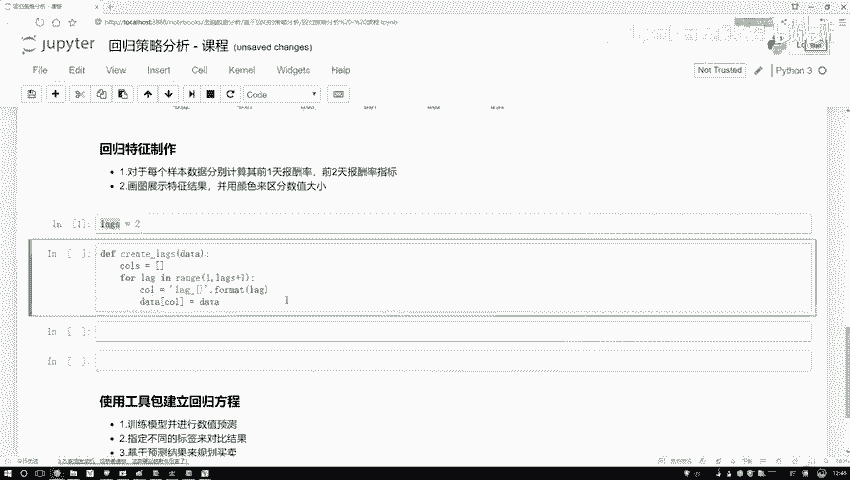

对于我们的什么，咱们之前是不是returns啊，好了，把这个returns我直接给它复制过来。

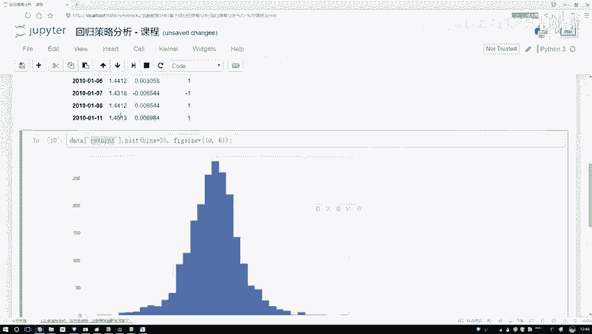

把这个returns拿到手，对它执行什么，只需要我去点shift一下就行了，好了，来看吧，对它直接点shift一下，那一次移动几个单元格啊。

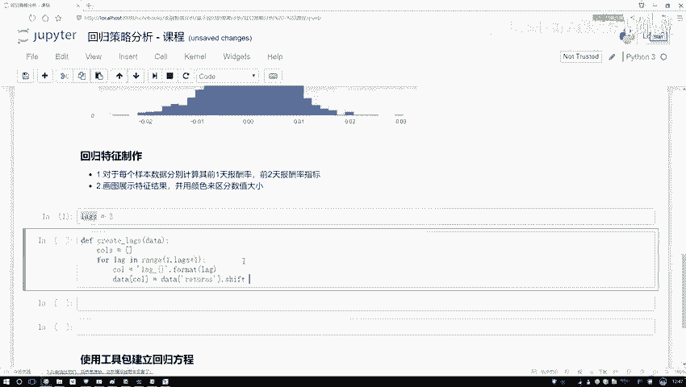

或者说你是前一天还是前两天啊。

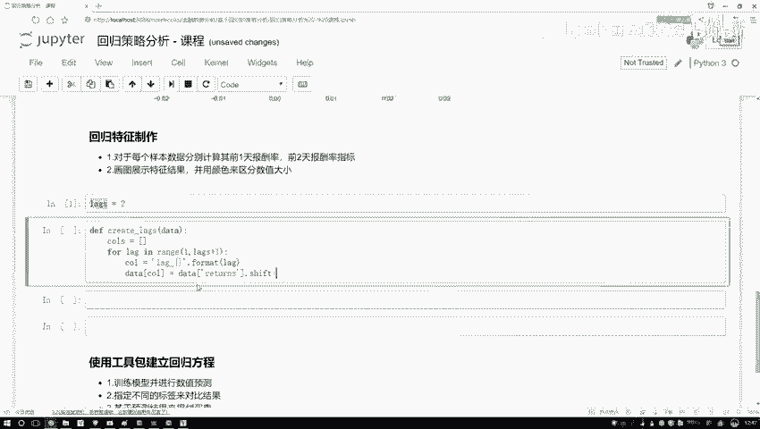

哪个变量指定的，这里是不是说第一次是一，第二次是二啊，好了，把它当做参数拿过来。

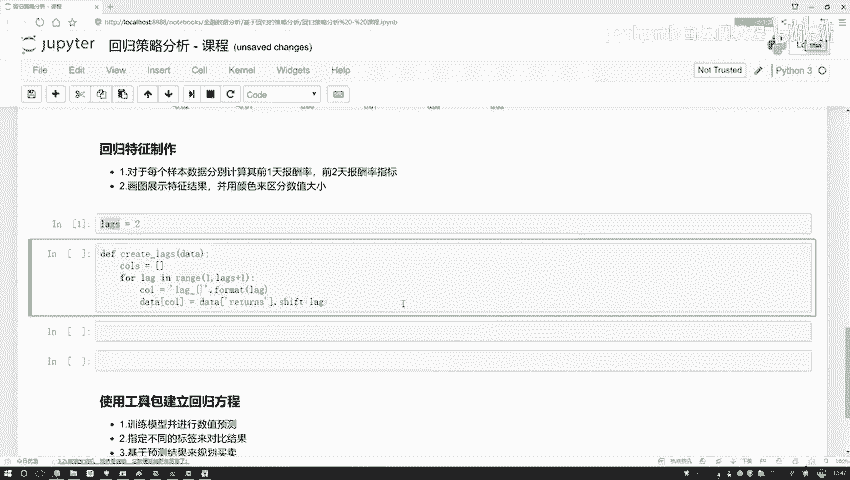

这就可以了，然后呢这是列名二列文当中，我说我把当前这个列给它再传进去吧，可能后续我还会有用的，好了，这样咱就完事了，是不是现在我们来执行一下吧，看一下我们当前的一个结果哦，这一块还没执行出来。

我们得把这个函数啊实际的去运行一下，就是我们的这个data吧。

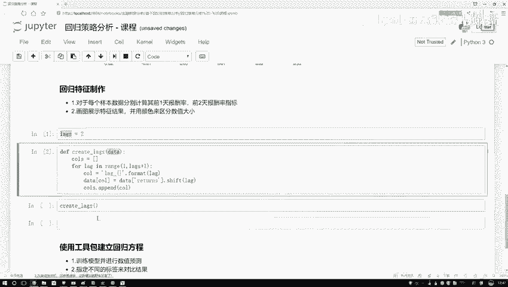

名字咱们之前读页数据就叫做这个data是吧，好了，然后我们来去执行一下哦。

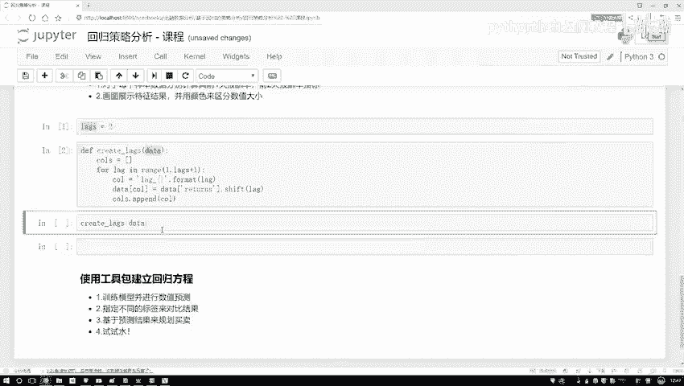

这个data没定义，这样咱们重新执行一下，在这里我把之前的结果重新的执行一下。

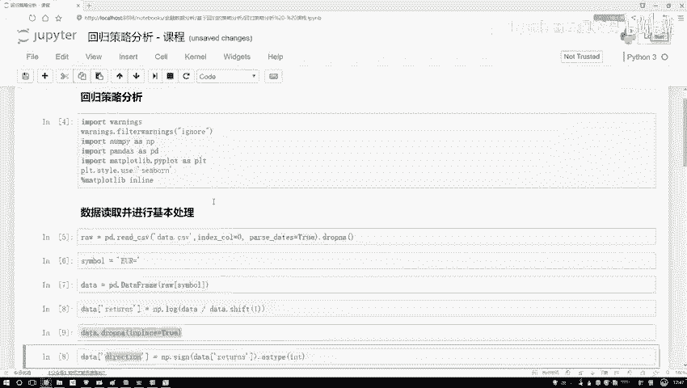

然后这块也一样，我们也重新执行一下。

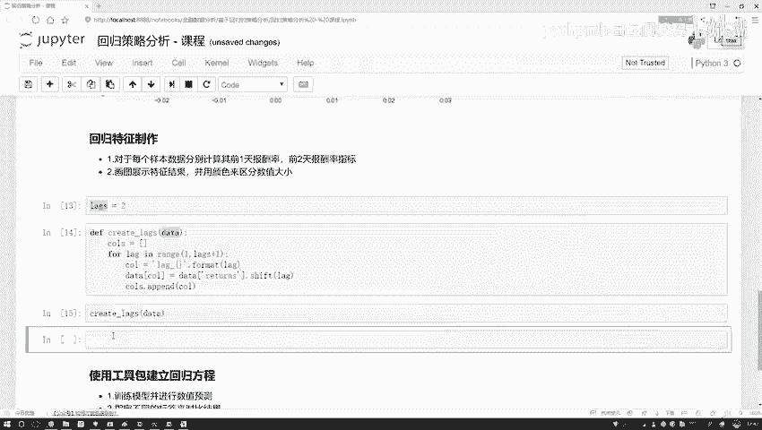

好啦，看一下咱们这个data a当中啊，多么多什么东西怎么样，是不是现在我们有了一些数据了，我们有了这个前一天的数据，还有什么前两天的一个数据了吧。

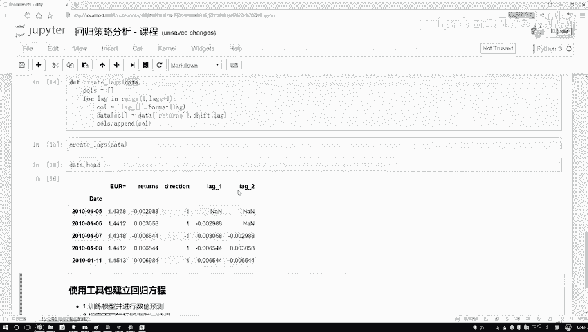

但是注意点啊，这块出现缺失值啊，确实值咱是不要的呃。

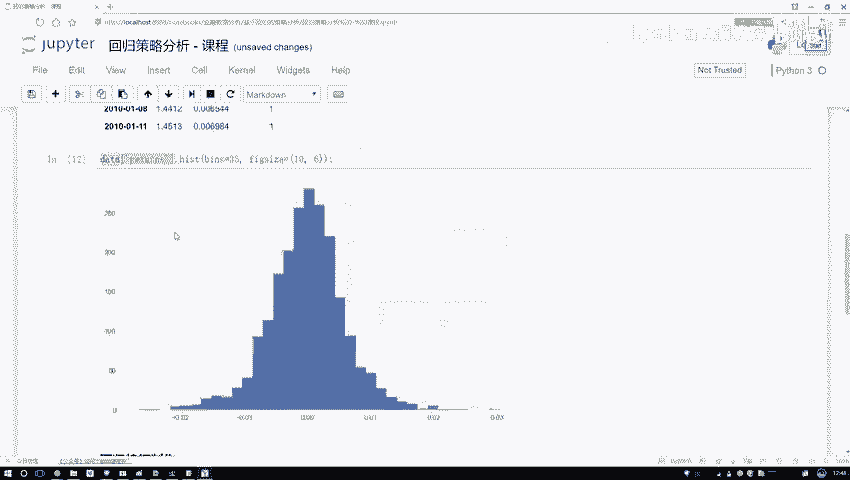

我把这行复制过来，咱把缺失值还是给它剔除掉，在这里好。

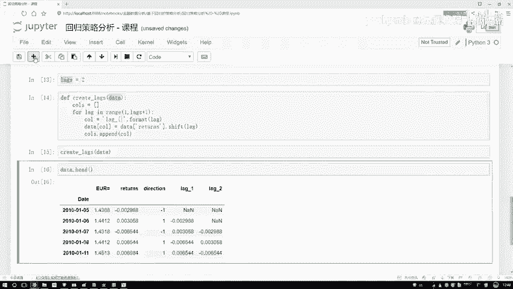

缺失值，我重新的给它剔除掉，这样我们有什么了，是不是就有了我们的一个呃。

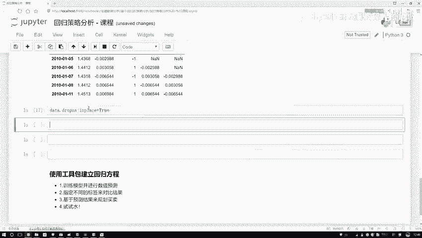

可以说是我们一会要用的一些特征了吧，前一天前两天有了。

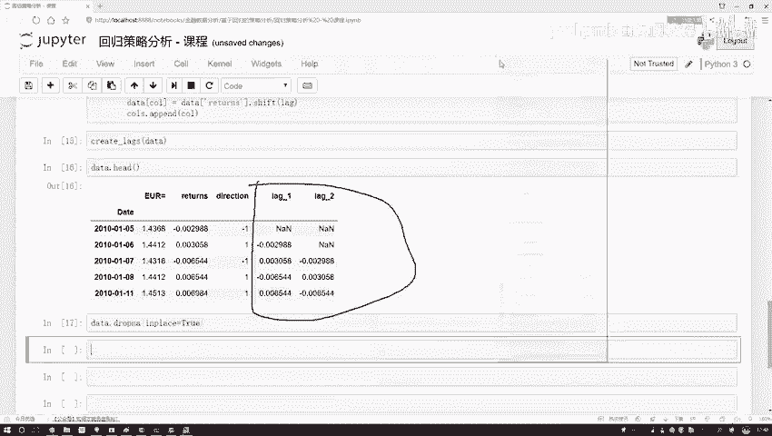

然后看下任务当中啊，还有一个要求啊，现在我们已经把这个，前一天和前两天的数据使用出来了，然后呢他说啊让我去画图啊，展示一下这个特征结果，并且呢用不同的颜色来区分数值的一个大小啊，它是这个意思。

现在你不是有这个前一天的，然后还有这个前两天的了吧，那是不是还有那个当天的就实际的一个Y值啊，那你可以给我画一个图，在这图当中呢，我说横轴啊，是这个前一天的，纵轴呢是这个前两天的。

然后这个数实际数据点啊，你再用不同颜色表示出来呃，当天他的一个实际的收益率啊。

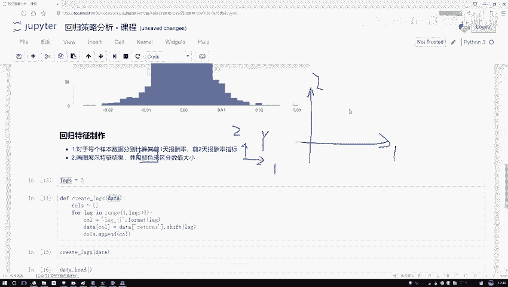

和实际的一个报酬率是等于多少，说要做这样一件事啊。

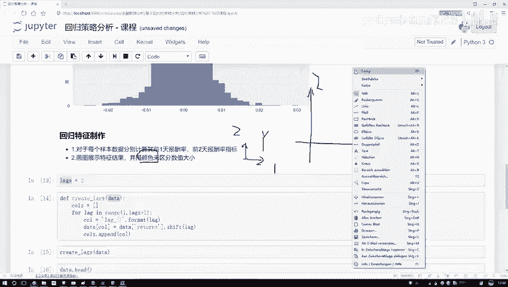

那怎么做呢，现在来来写一下吧，在这里啊，咱们还是对我这个data去画一个图是吧，data点pat一下呃，PO当中咱们拿你看这里边都什么，这是有昨天的指标，还有今天指标，这是点吧。

那我们直接画一个散点图就行了，在这个三角图当中啊，你要指定X它是什么X它是哪一列啊，我说X轴它是哦我们那个前一天的，然后呢指定Y轴，Y轴是Y轴，是我们的一个前两天的Y轴，前两天的是吧。

然后呢我说我用不同的一个颜色呀，表示着当天的一个实际的结果，当天实际的结果是谁啊，是不是returns这个指标啊。

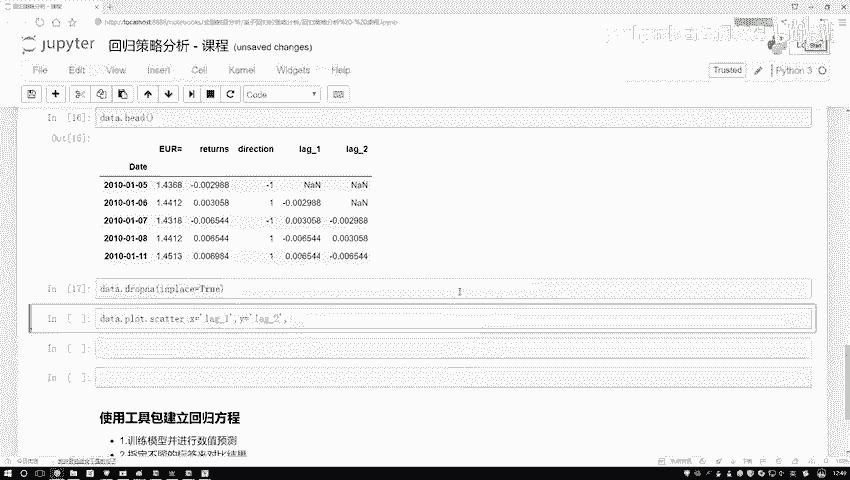

好了啊，用不同颜色不指定个C啊，等于一个当前这个returns。

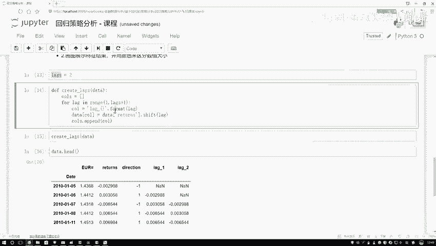

我把这个returns给它复制过来啊，这是实际它的一个结果，那你说是不是，咱得用不同的一个颜色来做这样一个表示啊，那怎么样去表现出来不同的颜色啊，呃在幻物当中啊，我之前我忘记咱说说了。

有个东西叫做一个color map，Color meat，意思就是用一种热度图的方式，这样都给得给大家画完吧，我给大家画完之后啊，大家可以看到就是这个热度图啊，你可以画的比较好看。

咱先有一个浅色到一个深色热度图啊，一会大家看一下这个长什么样子，然后呢指定一个future size，图标大小啊，指定成一个16，然后咱把那个图的，就是那个呃颜色的一个坐标轴。

就是一个color bar也给它指定出来啊，color bar然后指定成一个处值。

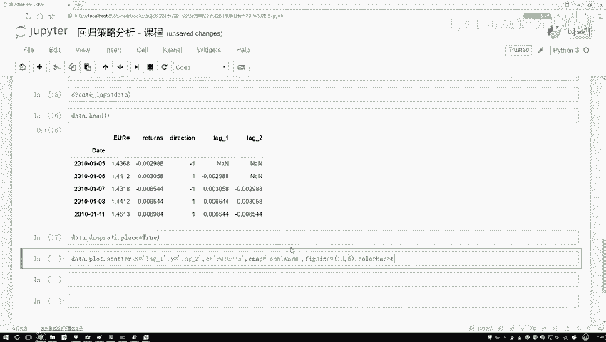

我们先来看一下，就是画完图之后啊，它的一个结果嘶啊，这是我们现在展示出来的图，你看这里右边有什么，你看这块他说了一个returns，return是什么意思啊，就是实际当中啊。

你看这有些点是不是有一些蓝色的，有一些红色的，红色代表什么，代表着当天它实际的一个收益率怎么样啊，是一个正的，并且颜色越接近这个红色或者颜色越深的，红色越深的时候，它是什么啊。

它是一个就是呃就是数值会越大哦，这蓝色越深呢，你看这样蓝色越深，它就是跌的越狠，红色越深就是涨得越狠啊，大概是这样一个意思，其中啊就是这个color map啊，有好多种不同颜色可选，感兴趣啊。

大家可以进去看他看的那个API，或者是CBA当中一些好多工具包当中啊，都有一些可用颜色来选啊，到时候大家自己来选吧，这里只是给大家举这样一个例子，然后呢这是我的一个横轴啊。

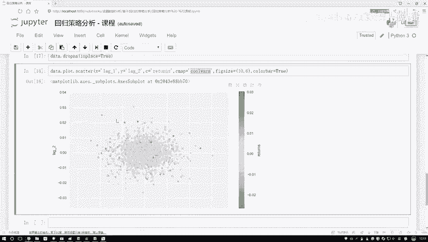

横轴纵轴还没有是吧，这样吧，现在画起来像是一个像是一个太空似的是吧，咱把这个横轴纵轴也画一下啊，我们来画一下横轴纵轴当中啊，无非就是什么，你可以在这里我去加一条线吧，好了，我们加一条线呃，加一条线当中。

那我去指定一下吧，呃指定一下我的一个就是你水平加线，还有一个数值加线是吧。

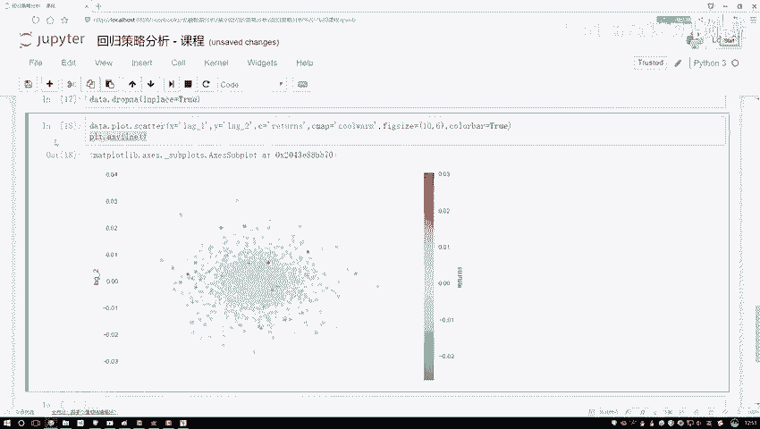

我都指定一下水平，我加一个线，然后咱们再数值加上一个线啊，都指定一下，然后呢把参数写线就是呃主要是什么，主要是我的一个颜色，颜色咱也不区分了啊，都是用这个红色得了，然后指定一种线条的格式。

再用一种呃虚线的格式吧，杠杠虚线的格式。

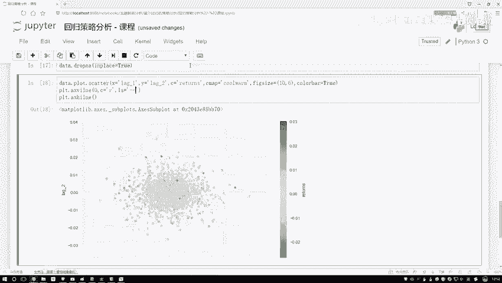

这就行了，参数直接复制过来就完事了，然后执行一下，看一看呃。

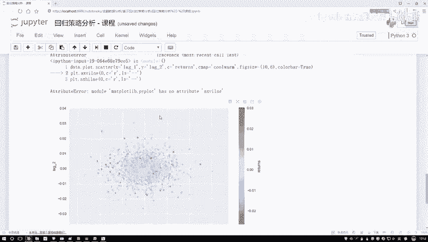

看见没出来看这里啊，他说了哦，这个东西PLT点哦，ax b l哦，多了一个东西是吧啊。

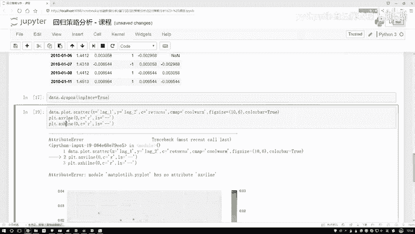

这个I写错了，I是在这里，I是在这里行，再执行一下好了，这坐标系咱就画完了啊，刚才像我说的呃，这里X轴是我们的前一天，然后Y轴呢是我们的一个前两天啊，咱们现在就把这个结果给画出来了。

然后呢不同颜色点表示是当天实际的一个return值，结果等于多少，其实也相当于是一个三维图了是吧，只不过我们用我们的第三个维度，使用不同颜色啊来进行区分的，没有单独画一个Z轴。

这样就是显得画起来会更好看一点啊。

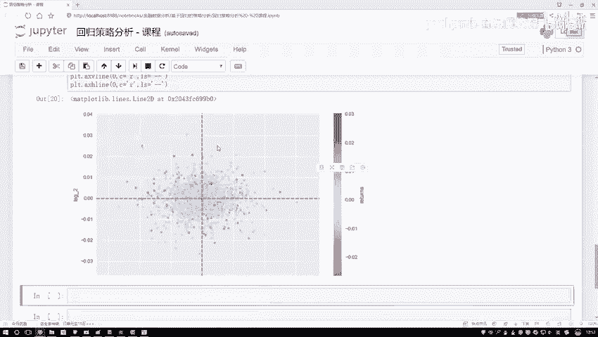

并且通过颜色你也直接能够看出来，当天实际的一个情况吧。

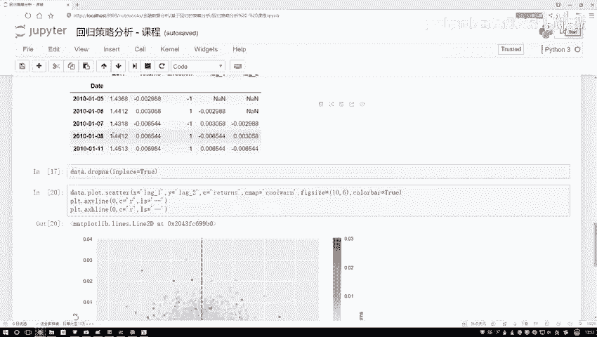

啊这个就是咱用啊我们的一个不同的一个。

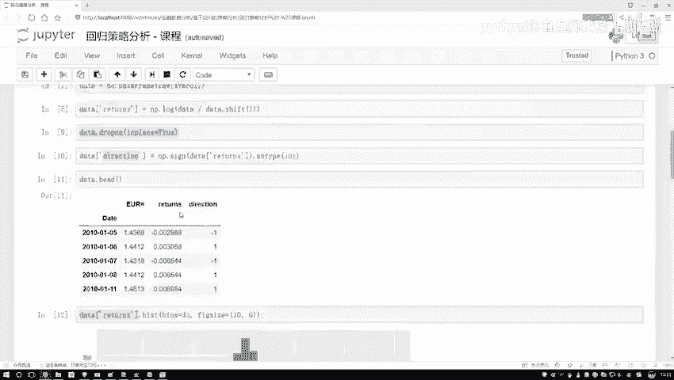

这里就是按照我们的一个问题当中啊，咱们做两步，第一步啊，特征我有了是吧，前一天前两天。

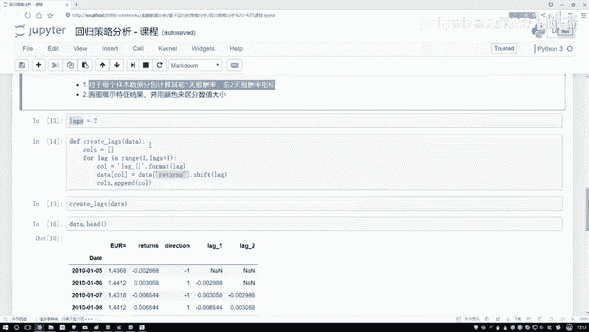

第二呢画图给大家看了一下，并且我们可以用不同的颜色来区分一下实际啊。

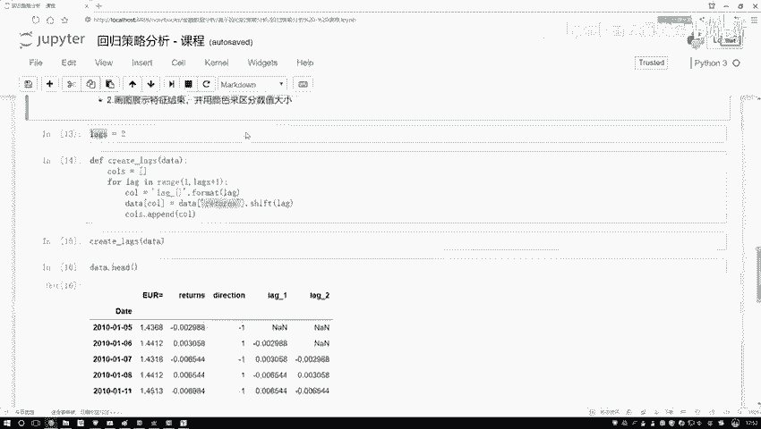

我们的一个结果，这是我们当前完成了第一步。

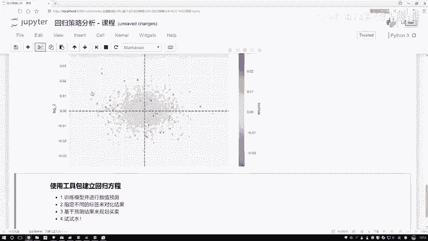