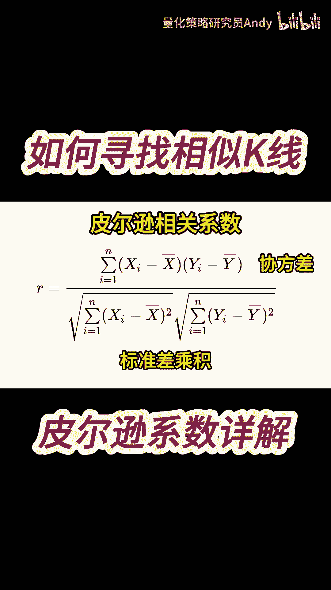
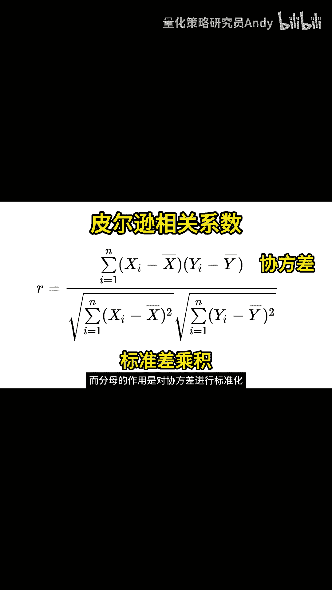

# 【皮尔逊系数】如何寻找历史上的相似K线 - P1 - 量化策略研究员Andy - BV1qZ421H7pY

要想知道两组K线之间的相似度，我们需要先了解一个概念，叫做皮尔逊相关系数，皮尔逊相关系数是度量两个变量之间，线性相关程度的统计量，它是由英国统计学家卡尔皮尔逊，在1895年提出的，他的计算公式如下。

这个公式中的R就代表皮尔逊系数，X和Y是两个变量，大家可以理解为两组K线的收盘价序列，其中xi和YI分别表示两个变量的第I个值，这里的X上面加一个横杠，代表X的平均值，读作X8。

上面的分子部分代表X和Y的协方差，先计算每个变量与各自均值之差的乘积，然后再计算这些乘积的和，下面的分母部分是代表X和Y的标准差乘积，先计算每个变量与各自均值之差的平方和，然后再计算出两个平方根的乘积。

分子中的协方差，就能够反映两组变量之间的相关性。

