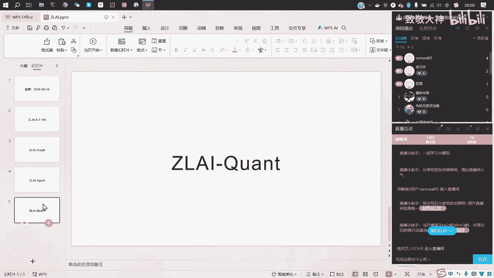
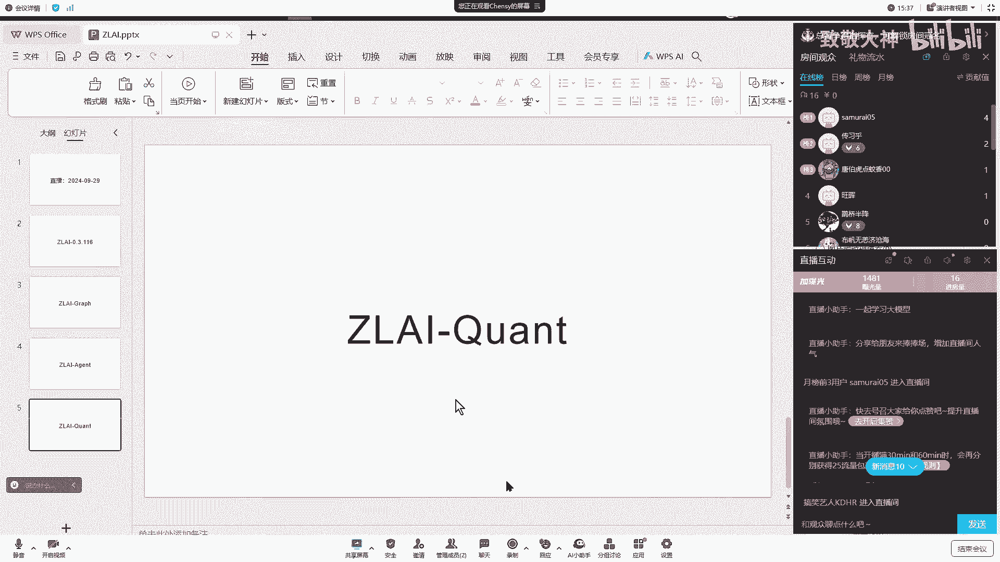
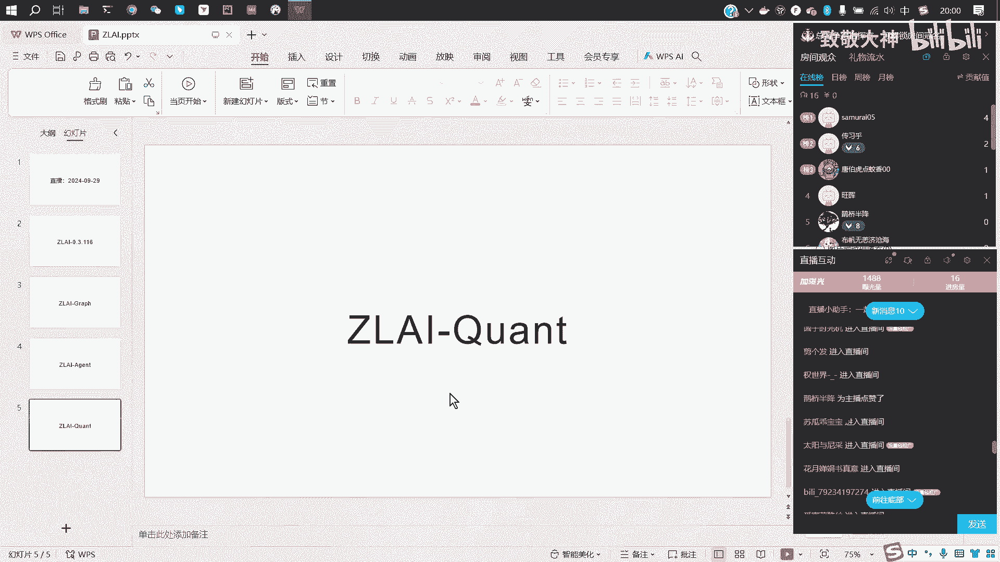
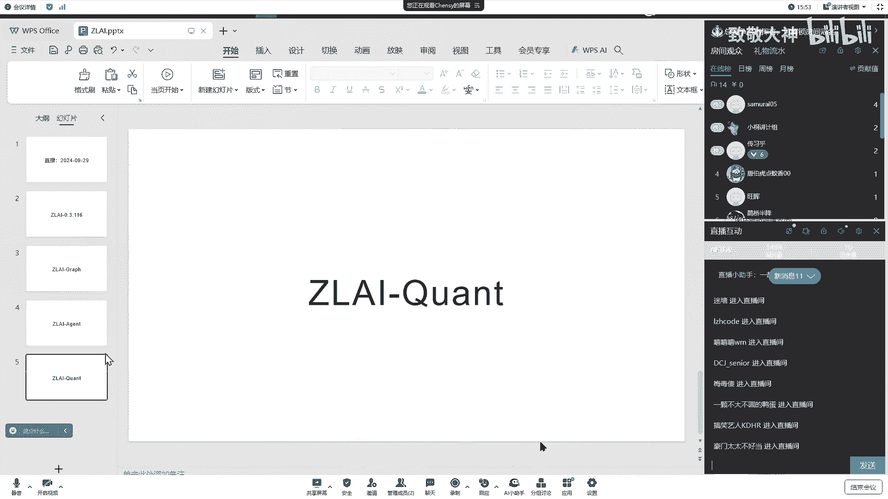
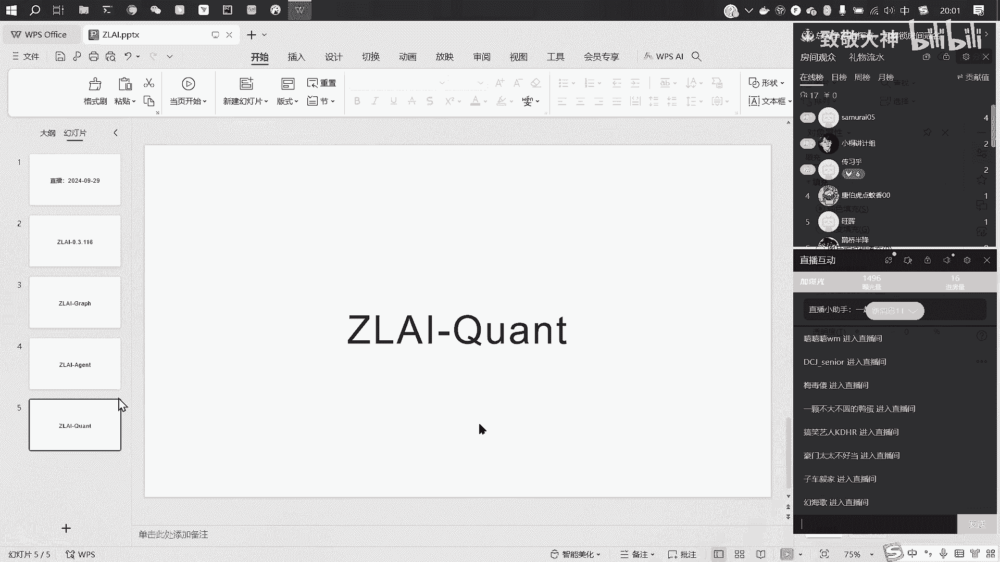
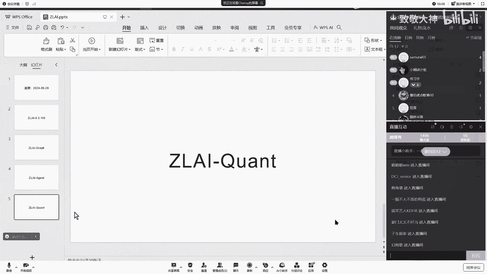
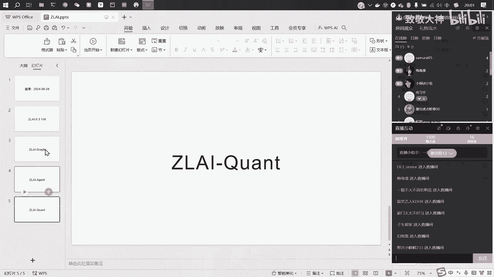

# 【直播回放】Zlai大模型知识图谱联网与金融量化应用 - P1：01_本期内容大纲 - 致敬大神 - BV1bZxyeAEjB

9月份做了一个新版本，就是原来是0。3。115，然后9月份统一发了一个版本，然后然后那么下一个月就是10月份的版本了，那最近的一个版本就是116，这个版本就116，这个版本一会会做一个就是增删了。

或者是增加了哪些内容，会给大家做一个说明，然后会花个10分钟到15分钟这样，然后第二块内容的话是呃，用大模型做了一个知识图谱，然后最近也是打这个黑悟空嗯，查了一点。

这个这个这个西游记的一些原著的一些东西，用这个西游记百回本的这个原著，做了一个这个人物啊，地点啊，他的一些物品的一个知识图谱，然后会会把整个做这个知识图谱的流程，然后跟大家去过一遍，然后第三块的话呃。

第三块是这个agent agent，它这块呃会做一个更细致的一个一个一个说明，然后还是依赖于这个，再来这个项目去去做一个更细致的说明，然后把它单独哦嗯拿出来去去讲一下，然后第四块的话是最近搜罗了很多。

这个宏观的呀。

还有这个财经的一些嗯研报，然后新闻。

然后还有一些股票的一些一些数据，然后这一块呢和这个agent呢其实可以联动起来，那么这些数据真实世界里发生的这些研报啊。

啊每天发生的这些股票交易啊，怎么能够跟大模型去做一些啊，有意义的一些尝试嗯。

第五块，第四块主要是这个可能偏一点量化。

但是更多的是消息面的一些一些文本的先处理，然后这也不构成什么这个这个投资的建议啊。

