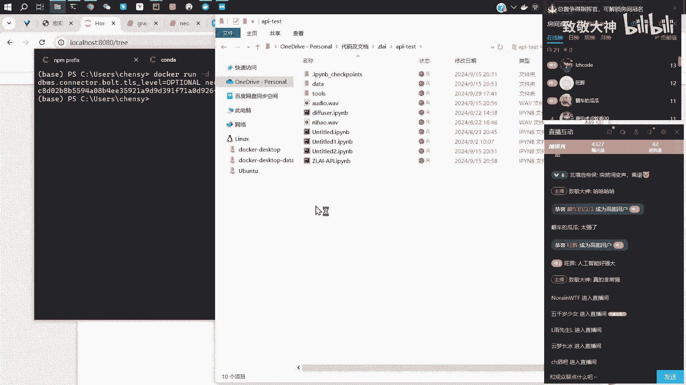
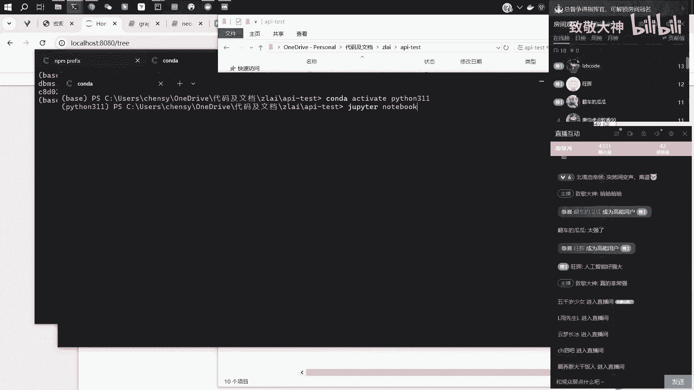
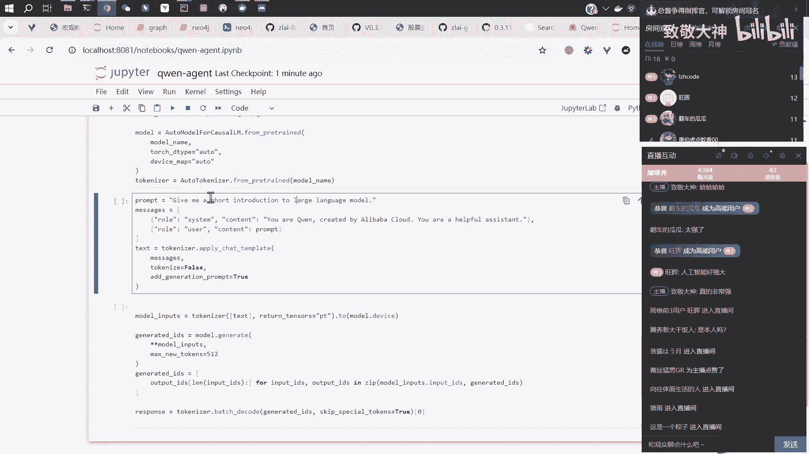
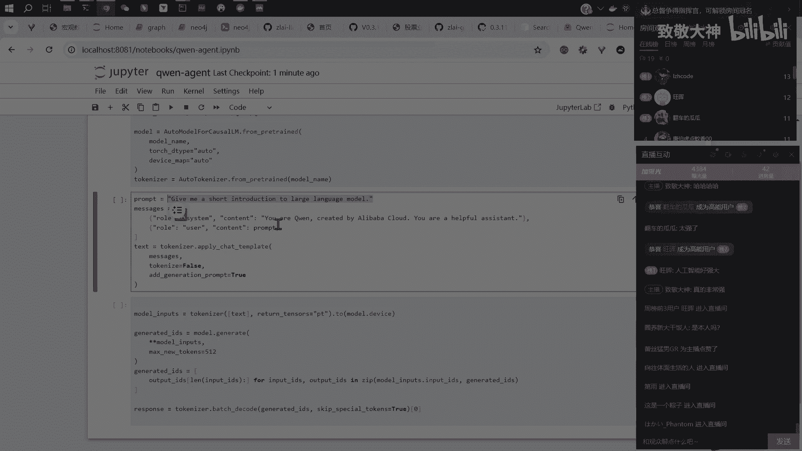
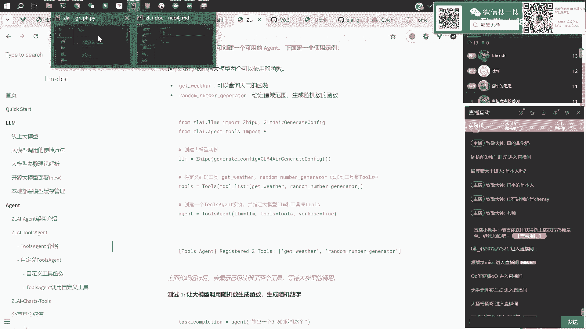
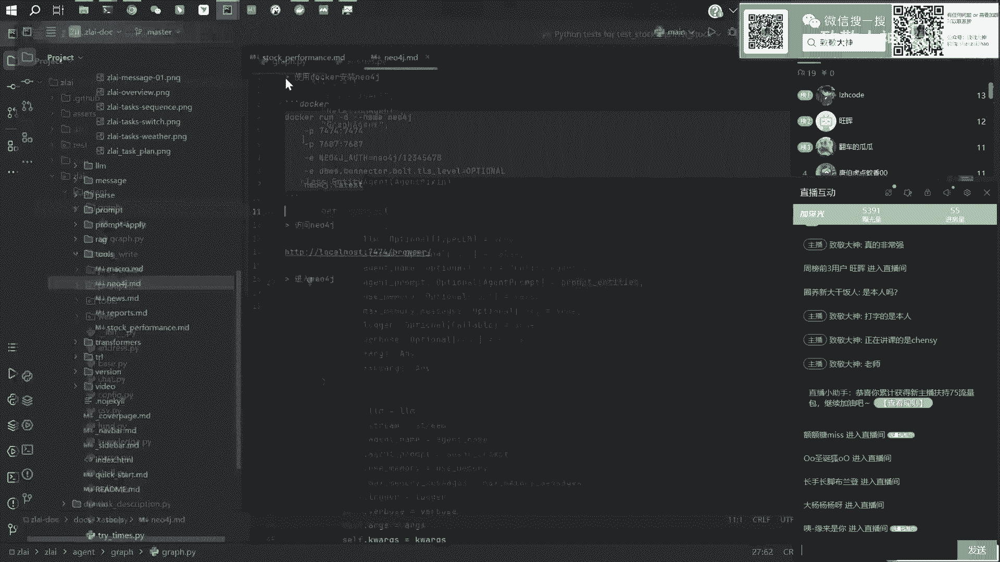
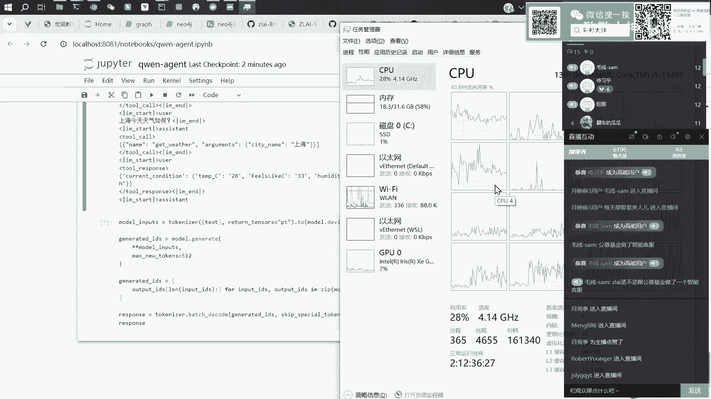

# 【直播回放】Zlai大模型知识图谱联网与金融量化应用 - P4：04_Zlai工具tools模块的使用 - 致敬大神 - BV1bZxyeAEjB

这个这个这个部分嗯，AZ呢其实在大模型火火起来之后呃，尤其是今年其实呃被嗯就是被广泛的提起啊，就是到现在一直热度比较高，嗯他核心的一个思想是什么，就还是人们还是希望让大模型去去做一些嗯。

信息的一些调用给他一些赋予它一些权限，然后赋予他去查询一些东西的公呃，一查询一些呃信息的一些接口，让大模型决定嗯，你这个问题到底他应该去获取哪些消息，来去回答你，你你的这个问题，就比如说我想问一下啊。

今天某某股票它的一个走势是怎么样的，那如果说我只是一个大模型嗯，那么我可能没有办法去回答你，这个实时的一个消息，然后但是如果我这个大模型可以直接去调用，某一个接口哦。

或者说它能够判断呃他应该去调哪个接口，那么他得到了这个接口的消息之后，他就可以给你一个啊更为准确的一个回答，那这个是这个agent的一个一个思想，一个思路嗯，然后我们现在可以简单的去啊聊一下。

就是说现在大模型去做这个接口的调用，或者说啊去做这些信息的查询，大概他是怎样的一个思路嗯，然后我们我们找找哈根菲斯，去去随便找一个模型，你比如说最近发布的，请问2。5找一下，啊我不会去直接调这个模型啊。

但我们我给大家展示一下，他这个呃token anizer，他这个他他这个加入了这个加入了这个工具，或者说家用了调用接口这个功能之后，那么模型会收到怎样的一个信息，以及它会给你一个怎样的一个回答啊。

我这里我看一下啊，找另外一个地方嗯，新开一个猪皮头。

然后新建一个新建一个JUPITT吧，哦看下不用这个版本，有点卡，用这个最小尺寸的这个版本，我们做一个最简单的展示，嗯先把模型读进来，OK那这个模型就就读进来了，然后嗯。

那正常状态下呢就是我们去调用这个大模型啊，然后会把这个比如说呃他这里让他去介绍一个。

介绍一下这个大模型，然后他他给这个模型的话。

会会给这个message是两条消息，第一条的话是一个呃system，一个一个系统级别的一个指令，他说你你是千问，然后是被阿里巴巴所创造的，然后你是一个有有帮助的一个助手助手。

然后这个是他的系统的一个指令，然后我们第二那下面一个问题就是user，就是用户发出的，然后问了问了一句，就是呃给一个简单的一个介绍，去去介绍这个大模型，然然后那么实际上计算机它是呃。

不能够理解这些文字的，那么我们需要把这些文字全都变成一些数字，然后模型是实际上还是在计算这些数字，然后那么面对这种嗯，有很多条消息的这种指令的话，他首先会把这些多条的这些指令。

去拼接成一个很长的一个字符串，这个token nezer，然后这里有一个apply啊，Chat template，就是去就是去做一个消息的一个模板，然后他把这种一条一条的消息，去拼接成一个字符串。

我们看一下它这个字符串长成什么样子，我把它打印一下，然后这里你会看到啊，这里是一个消息的一个一个开始的一个标，标识符，然后他说system，然后你是什么什么东西，然后user然后说了一些什么样的东西。

然后那么开始了这个地方是嗯assistant助手，他有了这样的system user assistant啊，这样的一个标记，那么模型就会根据这个位置的这个标记，去做下一个问题的一个续写，也就是说。

无论我们进行多少次的多少轮的对话啊，那么模型它接收到你这些文字之后呢，他首先会把这些一条一条的消息，按照某一种嗯，按照某一种就是文本的组织方式，去把它拼接成一个很长的一个字符串，然后拼接成字符串之后。

然后再按照一个词表把它转变成一个模型，可以输入的一个啊这个这个这个这个数字，然后这个数字其实它代表的是整个字符串的，拼接之后的一个长度的一个信息量，然后再把这些信息啊交给这个大模型去做。

Generate，去做这个预测，然后这里写的最多，他要生成512字，最后它生成出来的内容，我们看一下，我们问一个简单的内容，因为这个是笔记本跑，它会很慢，然后我就给他打个招呼，hi然后再运行一下吧。

要跑多久，哦那他破号了，这个是它生成的这个generate id，它生成的这个回答的一些一些呃标号，然后我需要通过这个他回答的这个标号，把它转变成这个我们能够认识的一个汉字，然后得到最终的回答。

嗯嗯这个是最终的一个回答，把它打印出来啊，那我说的是hi吗，他说hello，他说我可以怎样保证你今天啊，这这个就是他的一个回答，这个是正常来说，我们去做这个对话呃，的一个一个调用的一个流程。

然后刚才我们说了嘛，其实这个场景下我们考虑的是呃，让模型告诉我们给它一个，就是我们给模型一系列的工具嗯，比如说天气查询的工具，股票查询的工具啊，或者说接口，然后模型回答我的是什么呢。

回答我的是他要嗯调用哪个接口啊，这个时候我们怎么去操作，然后嗯，现在我我去找一个这个这个示例啊，找一个这个哦，我下文档，在这个，function call这个部分，然后这里这里是一个呃，工具的一个描述。

我不用这个了，我找找下面，用这个好了。

啊这里有两个工具我们可以使用啊，就是已经在这个项目里写好的，一个是什么，获取这个天气，一个是这个这个这个呃生成一个随机数，这是两个很非常简单的一个事例，然后我们可以看一下这个代码，它写的是怎样的。

然后获取这个是获取天气的这个这个代码，然后就是很正常的一个一个函数，然后只需要告诉他这个城市的名称，然后他就去调用这个接口，返回这个啊什么这个地方的一个温度呀，是否在下雨啊。

这样的一个一个一个一个一个事实的一个信息，最后会把这个返回的内容啊转成一个字符串，然后去返回出来，然后这是这个工具，然后这个随机数呢就更简单了，是是生成一个额，有一个给他一个随机种子。

然后告诉他你随机数的一个范围，然后他去给你生成随机数，用的就是这个random，其实是两个非常简单的功能，然后我们把它封装到这个TOS之后，我们看一下我们将要给模型哪些内容。

首先呃这个tools它是有一个tool的，一个description的一个参数，这个参数实际上额是这两个函数的一个说明，就是说这是一个什么样的一个函数，然后它的名称是什么啊。

然然后他的这个函数的描述是什么，然后它的它有哪些参数啊，就生成了一个包含这两个函数的一个额，一个描述，那下面的话我们需要把这个描述哦，告诉这个大模型，那么我就需要在这个编辑，这。

个就是因为这段话是我们要拼接成一个字符串，交给大模型去做生成的，所以我们需要把我们工具的这些信息呢，呃在呃他问问题的时候呢，也把它编辑进去，就告诉模型，那你现在有这些工具可以是去使用嗯。

这个地方有一个tools的一个参数放在这个地方，啊OK运行一下，哎这哪里去了啊，好了，然后那么刚才的话，比如说我们做个对比看一下，我们把这行注释掉啊，这个是我们原来的一个结果啊。

就是没有加这个tools，然后他他就是一个系统指令，一个这个user啊，我说了hi，然后那么下面就该这个呃机器人回答了，就这个AI去回答，然后我加了这个tooth之后呢。

它会在这里有一个tooth的一个一个标志，然后呃我会告诉他，你也许是是去需要，就是靠嗯一个或者是多个的function to，去去解决你这个用户的这个问题，然后然后这是这个to的一个描述信息。

这个to的描述信息呢，就是刚才我们看到的那个to的description，我们复复制给他的那个啊tools description，就是这个东西，那么他就把我们这个to的一个描述工具。

的一个描述放在这个地方，然后额再是user，我说了一个汉，那么这样的话，我就通过这种方式就把这个啊工具的信息唉，告诉这个模型了，那模型唉我们问问题的时候，他就会意识到就说唉我是不是可以啊。

调用这上面的工具去回答用户的这个问题，然后额我们也可以从这个项目的，他们这个开源的项目里，这个源码源码里面找到这些嗯，编排这些信息的一个一个一个方式，就是为什么，为什么它是以这种格式组组组织起来的。

其他的格式行不行，嗯其实也是可以的，但是你需要去改造它的某一个文件，我帮大家找一下啊，应该是这个，嗯token ize config，应该是这个文件，是不是看一下是不是好，是这个。

然后他这里有一个chat template，在这个里面我们把它复制出来看一下啊，好长啊，复制到复制到这边，啊你可以看到这个就是前问他们官方给定的，一个一个呃消息的一个模板，然后这个是system嘛。

然后你你它的一个嗯system级别的一个定义，如果呃它这里有一个if，就是如果发现了to的话，它会把to的信息以个for循环的形式，然后放在这个system的下面，然后下面才是其他的一些信息的一些编排。

你可以看到他其实整个信息的编排嗯，to的话会放在比较靠前的一个位置，然后下面也是有很多关tools相关的一些内容，这个我就不去做很细节的一些展示，那反正他是用这个chat template。

就是这样的一一个模板，去把你的各种各样的消息，什么system啊，user啊啊，然后以及你的工具啊，用这套哎消息模板把它组织起来形成，最终形成一个呃什么信息信息都有的，然后也有这种开始结束的一些标识符。

的一个字符串，再交给模型去去做额回答的一个生成，OK那这个就是嗯嗯agent它它它怎么去呃去去调用，或者说模型怎么怎么接收到这个一些工具的啊，一个一个介绍，然后下面我展示一下我，我把这个问题改一下。

就是问他一下，就是杭州上海吧，上海今天天气如何，就问他一个跟天气相关的，我们看一下这个呃0。5B的这个模型，它能不能回答的出来，其实因为我我们期望是他能够嗯，在下一步回答里面。

他说他去调用get weather这个这个啊function，我们看一下，然后你可以看到这个这个地方已经改了，然后我们把它变成编码，然后去做生成，这个过程会可能会慢一点啊，因为这个是小笔记本跑的。

现在用的是什么模型啊，干嘛千万2。52。50。5B它最小尺寸哪，那那那那你用CPU就可以跑呀，对对千万2。5CPU就OK，哦不不不，0。5B的这个CPU可以大一点的就不行了。

这个这个就就哎我怎么确定确定这个模型，我现在的比如说啊，假设我现在就只有这个CPU，然后我的内存是多少，我怎么确定这个模型我能不能用呢，你确定你CPU能能不能用，还是说你GPU呃。

就是就比如我就假如说我现在只有这个CPU，然后我的内存像你这样是三十三十二个G呗，然后那你就是我就跟你说吧，就是就是3B以下的模，3B以下的模型，OK3B以上的就不要想了，这个3B是指什么呢。

是指30亿，参数是指参数量，3B0对参数量，3B是指参数量，所以参数量小于3B的呃，这种情况是不利用对你CPU能跑出个结果，但是会比较慢，你看我现在跑0。5B，我这个笔记本就就就慢了，就跑不出来。

估计我跑一会一分钟那几，那如果那他嗯相当于是它的参数量，是跟CPU有关系，跟内存有关系吗，嗯嗯你你在你在你自己的这个CPU上跑，更多的是是你这个CPU的计算性能，这个是是影响你速度快慢的一个点。

就是如果是上GPU的话，像GPU更多的是你的显存，嗯比如说我我这台电脑，我30多G的内存，那我我只是参数的话，我30多G的内存，我可以至少读到内存里去，20B以内的模型我都能读到内存里去。

但是你CPU计算不出来啊，哦对吧，你CPU计算的超级慢的，也就是说主要的限制条件，现在是CPU的算计算速度，限制了我模型大小的那个参数，对对对，你你你对对对，你用CPU的话。

那肯定就是算力在就是计算的能力，CPU在卡着你，如果你用GPU的话，那就是显存，你考虑有多少显存，你用怎样的一个模型，那比如说它的显存，假如说是十二十二G的那种，它它大概能跑的模型参数量是什么样。

2G6B吧，6B左右，6B可能也也难，就是你上下文长度，就是你的问题的长度是到达一个一个长度的，上线之后也就跑不动，他只能说你能够把这个模型，6B的模型调用起来，67B的模型调用起来。

然后你比如说你问一个，让它生生成的长度比较长，生成个七八百字啊，1000字啊，可能他就他就报报内存，就是显存就爆了哦，就是用是可以用，但是可能就掉是可以掉，但是用的话可能就会有一些呃限制。

就可能会用不好，对对对，是的对啊，那他这里有结果了，大家可以看一下，就是就是我们刚才不是问了，就是说我们给他的一个问题是，上海今天天气如何，那么下面他给出来一个回答是啊。

就不是说胡说一个天气的一个回答告诉你，就是说他瞎编一个温度参数什么的，不会他会说他要去调用这个这个模型，这个这个这个这个函数，那么我们其实嗯，这个地方我看一下啊，BRT一下。

OK然后他说是这样的一个结果，然后我们需要在实际的这个开发的过程中，我们需要把这个这个东西把它提取出来，就是他输出了一个调用了一个一个，一个字典，然后这个东西我们要提取出来，嗯啊，这个字典就是。

这样的一个东西，然后嗯，我们是上面不是用了一个to的一个post，的一个一个方法嘛，就是我们这里有一个实例化，就是我们把这两个函数，用这个tools去做了这个封装嘛，然后还有一个参数。

除了这个tools description，那就是工具的描述哦，有一串文本之后还有一个to的一个hook，就是我们链接了这两个函数，就比如说嗯，我想去调用这个get weather这个这个方法。

那我只需要to call，点at name就OK了，然后他会给到这个函数的这个指针，然后我再给他这个这个参数，达到这个参数，好那就会得到这样的一个温度的一个一个返回，就说额上海现在应该是二十二十八度。

这个测量的观测时间是上午10。56嗯，这是我们调用那个那个这个函数得到的，这个回答，那么也不回答，就是调用这个呃接口得到的这个这个天气信息，然后我们再把这个天气信息交给这个大模型。

让他过去回答一个总结性的一个回答，因为可能呃人们看这种接口数据，还是有一点困难的，那给它生成一句话可能会更直观一点，然后我们去找一下啊，找一下上面的内容对，啊这里我们第一个问题是问的上海天气怎么样。

然后第二个问题，然后他他没有直接回答他，他给出的回答是是哪里，啊是这个是，这个是模型的一个回答，这句话是不是有问题，这，个地方，这是模型的第一次回答，然后假设我们通过后台技术手段再给他去补上，干什么。

看看他的那个标识有哪些，这是啥呀，想看一下他那个供，就是回传的那个参数的标识是什么，啊或者说看这个就可以看上面那个这个地方，就是他有多少种角色，这个是system cos，右er system。

这个选to，因为这个是调用这个工具，我靠卡住了，卡住了，刷新一下，卡住了怎么回事，编辑不了了，我保存一下，我看看，重启一下，话说这个猪皮尔诺布改版了这个界面，我当时第一次装装电脑的时候变成这样。

我还以为是我电脑出问题了，哎呦我去，这里重新跑一下，把这个模型读进来，然后这里从这儿开始弄就行了，这个地方改成to，因为这里是额调用工具得到的一个消息，所以要把这个消息这个角色有user，就你问的问题。

他的回答，然后这个调用工具得到的信息，然后把它拼装起来，哎这就又有啥问题，你少个逗号，云杀，这里有问题，哦知道了，那就OK了哦，这是整个模型接收到消息的一个编排，然后再去，要去把它变成这个，异步输出。

运行一下就可能花的时间会更长一点，因为他他接收到的消息就比较长了，就从这里开始，一直到最下面会比较长，然后看一下看一下，就是直播间的问题吧。

