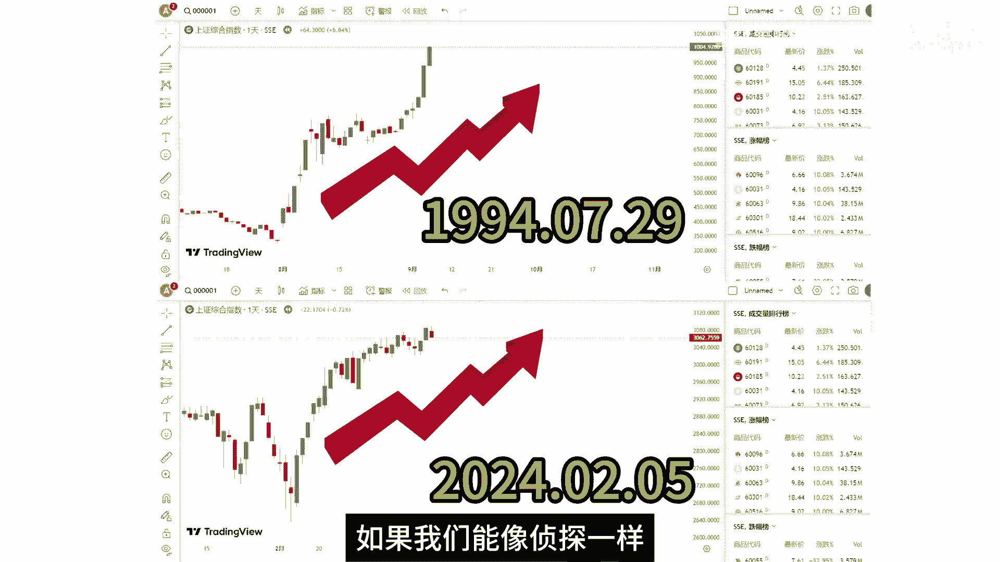
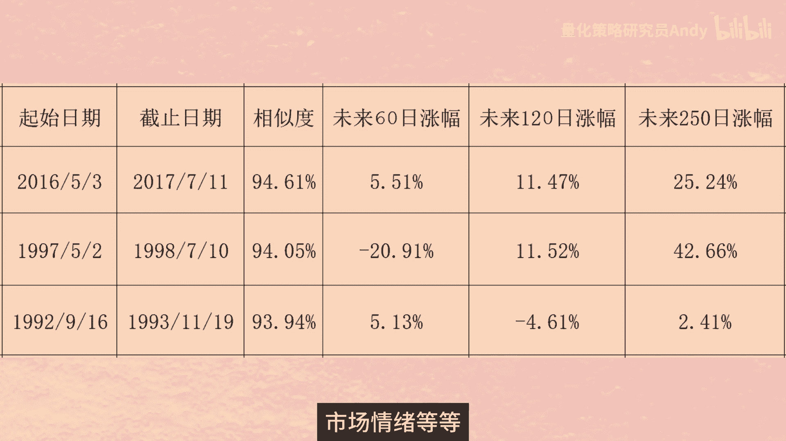

# 【相似K线】如何寻找历史中的相似行情 ｜ 皮尔逊相关系数 ｜ 量化交易 ｜ Python量化编程 ｜ 量化投资 - P1 - 量化策略研究员Andy - BV1hw4m1q73E

以史为镜，可以知兴替，以图为鉴，方能变涨跌，你是否听过这样一种说法，现在市场的走势很像历史上的某段行情，如果时间回到2024年2月5号，你该如何判断这里就是底部呢，注意看图中这两组K线，分别是。

2024年2月5号和，1994年7月29号前后的，上证指数K线图，我们知道在今年的2月5号市场见底之后，迎来了一波强势的反弹，在1994年的7月29号，市场也发生了同样的事情，在金融市场中。

似乎总有些模式总在不断重演，就像一部没有尽头的电视剧，剧情虽有变化，但总有似曾相识的感觉，想象一下，如果我们能像侦探一样。

用一把神奇的尺子量一量，就能找到那些惊人相似的历史片段。

岂不妙哉，那今天我们就从量化投资的角度来，寻找历史中的相似行情，如果你对此感到好奇，那本期视频将带你一探究竟，图中这两组K线看上去长得很像，那它们的相似度是多少，有没有一个可以量化的指标来衡量呢。

要想知道两组K线之间的相似度，我们需要先了解一个概念，叫做皮尔逊相关系数，皮尔逊相关系数是度量两个变量之间，线性相关程度的统计量，它是由英国统计学家卡尔皮尔逊，在1895年提出的，他的计算公式如下。

这个公式中的R就代表皮尔逊系数，X和Y是两个变量，大家可以理解为两组K线的收盘价序列，其中xi和YI分别表示两个变量的第I个值，这里的X上面加一个横杠，代表X的平均值读作X8。

上面的分子部分代表X和Y的协方差，先计算每个变量与各自均值之差的乘积，然后再计算这些乘积的和，下面的分母部分是代表X和Y的标准差乘积，先计算每个变量与各自均值之差的平方和，然后再计算出两个平方根的乘积。

分子中的协方差，就能够反映两组变量之间的相关性，而分母的作用是对协方差进行标准化，确保皮尔逊系数，不仅考虑了两个变量是否同向变动，还考虑了这种变动，相对于各自数据分散程度的大小，通过这样的标准化处理。

皮尔逊系数的取值范围，被限定在了-1~1之间，使得它能够更直观地反映两个变量间，线性相关性的强度和方向，而不受变量测量尺度的影响，简而言之，分母提供了对变量波动规模的调整。

使得皮尔逊系数成为了一个相对度量，易于跨数据及比较，当R等于一时，表示两个变量完全正相关，当R等于一时表示两个变量完全负相关，当R等于零时，表示两个变量之间没有线性相关性。

现在我们知道了求两组变量的相关性公式，下面我们就利用Python编程，来寻找历史上的相似K线组合，好我们来看一下代码，首先是导入一些代码中要用到的包，然后获取上证指数的价格数据。

我们筛选出2024年2月5号之前的数据，因为在这个案例中，我们是站在2月5号当天进行分析的，接下来是计算未来若干天的收益率，待会我们会找出历史上的相似K线，这个数据就是用来分析。

在历史行情中出现这种相似的K线走势之后，在未来一段时间的收益率是多少，这个参数length等于100，表示往前获取100根K线，作为我们的基准K线，当然这个参数100大家可以修改。

比如改成50或者200也都是可以的，不同的参数代表不同的周期，下面的df history也就是剔除这100根K线之后，历史上的全部K线，我们把这两个数据打印出来看一下，第一组数据是从2023年9月8号。

到2024年2月5号的100根K线，第二组数据是上证指数有史以来，从1990年12月19号，到2023年9月7号的全部数据，总共有7995条数据，接下来我们就要从这7995条数据中。

寻找到与第一组的100个数据，相似度最高的K线组合，我们来看第二段代码，首先是初始化df result，用来记录寻找到K线组合的，起始日期和截止日期以及相关系数，然后就是循环计算K线组合的相关性。

因为一个K线是由高开低收四个价格组成的，所以我们分别计算这四个价格数据的相关性，然后再求平均值，得到的就是最终的相关系数，最后我们把两个DF拼接起来，并打印出最终的数据，可以看到相关性最高的三个数据。

大约都在0。924左右，时间分别是在1994年，1996年和2003年，下面我们切换到K线图中来，直观的看一下K线的走势，这四张图分别是上证指数，在2023年9月8号到2024年2月5号。

1994年3月11号到7月29号，1995年9月1号，到1996年1月23号，以及2003年5月27号，到10月20号的走势图，其中这三张K线图，与左上角第一张K线图的相似度，分别是92。4%，七。

92。4%，四，92。42%，我们刚才也统计了这三段行情未来的收益率，1994年的7月29号，未来20天，60天和120天的收益率，分别是118。8%，五122。9%，六77。7%，八。

1996年的1月23号，未来20天，60天和120天的收益率，分别是12。9%，八3%，十，1。09，70。8%，22003年的10月20号，未来20天，60天和120天的收益率分别是负的，2。3%。

一18。6%，二24。59%，虽然10月20号这一天并没有见到最低点，但这里无疑是底部区域了，在不久的11月，13号指数就见到了阶段低点，随后展开反弹，在这三段行情中，未来的三个月到半年。

指数均取得了较高的正收益，找到历史中的相似K线，对于帮助我们判断当前的行情，有着较大的参考价值，尤其是对于大盘指数而言，这种参考价值比个股更高，下面我们再来看一下美国的纳斯达克指数，我这边整理好了。

那只从1971年到今年5月份的数据，我们读取这个CSV表格，这里的参数我取300根K线，那只从2022年12月份上涨到现在，涨幅已经超过了60%，那它未来会继续上涨，还是进入调整呢，我们运行一下代码。

看看，可以看到这里有很多个，2017年7月份的数据，我们要剔除日期存在重叠的数据，比如前面两条数据的K线截止日期，分别是2017年的7月11号和7月12号，显然这两组K线的大部分数据都是重复的。

我们把第二条数据剔除，最后我们筛选出K线日期不重复的，并且相关性最高的三组数据来分析，我把数据整理到这张表格里，我们来看一下，在2017年7月11号之后的一年时间里，纳指还是继续保持稳步上涨。

一年的涨幅达到25%，而在1998年的7月10号之后，那只先跌后涨，60个交易日，跌了20%，随后展开强势反弹，一年之后大涨42%，最后是1993年的11月19号，一年之内，那只基本处于窄幅震荡之中。

这里要做一个风险提示，虽然历史总是惊人的相似，但不会简单的重演，即使两组K线图在历史上显示出高度的相关性，这并不意味着，未来他们一定会以相同的方式发展，因为股市受到多种因素的影响，包括宏观经济公司业绩。

政策变动，市场情绪等等，这些因素都可能影响价格好了。

本期视频就到这里，大家记得点赞关注我们，下期视频再见。