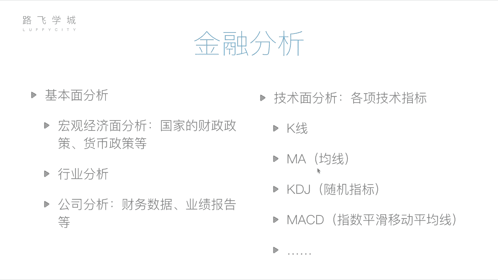
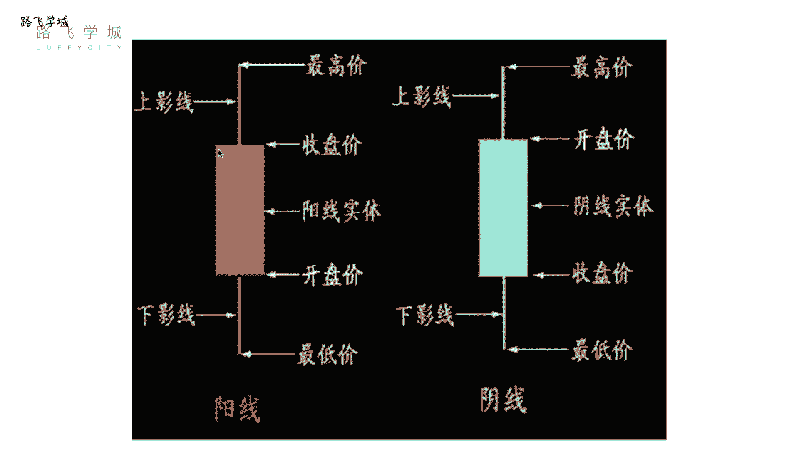
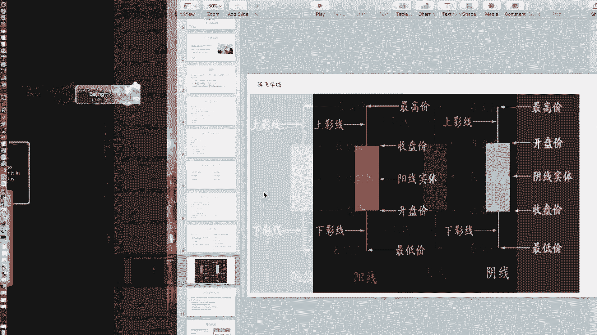
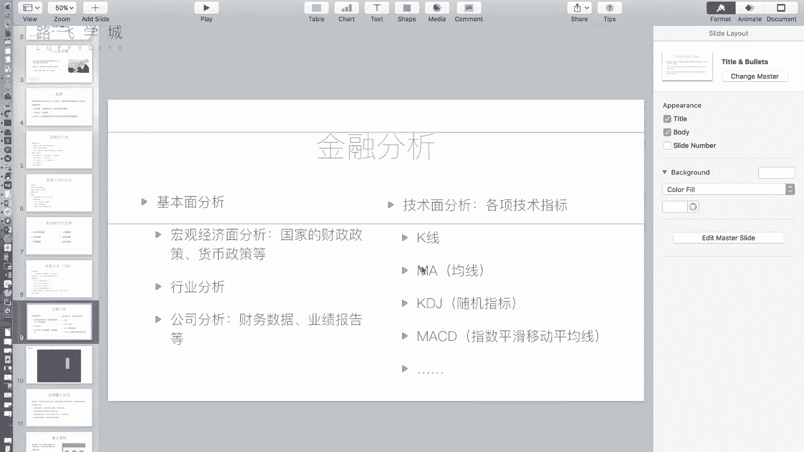
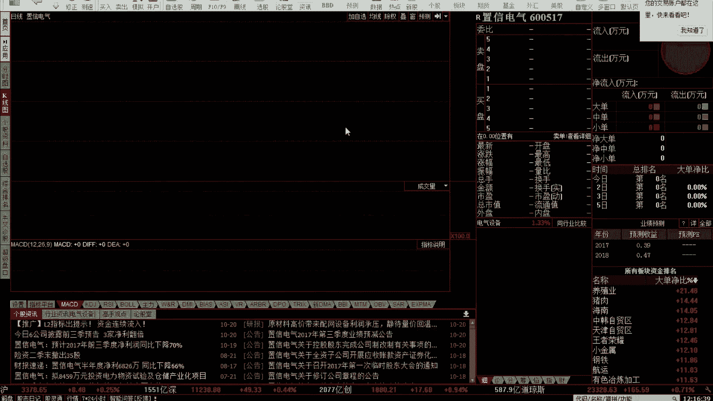
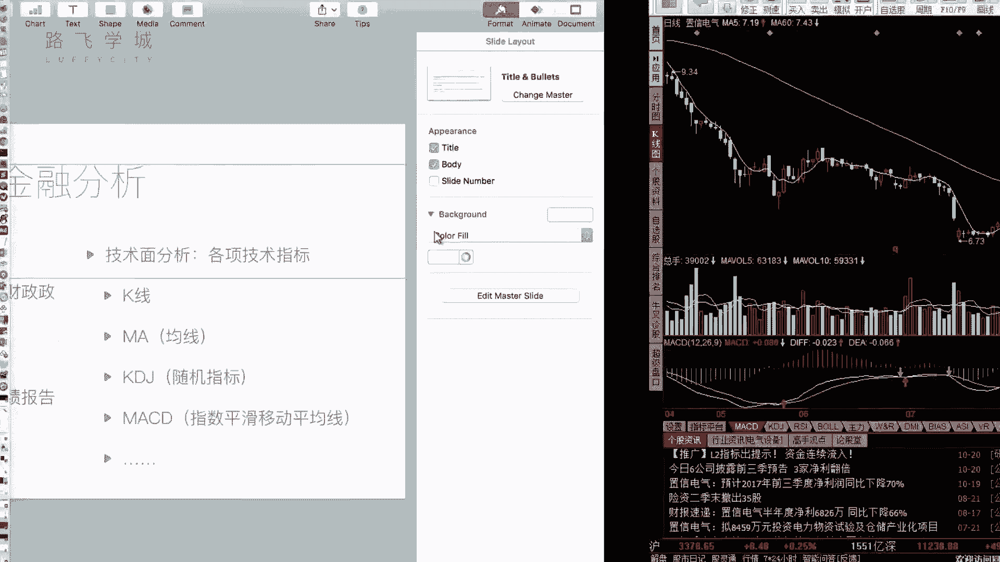

# 【耗时半年】python量化交易，从入门到实战，做好资产管理，年薪百万不是梦，收藏起来慢慢看！ - P5：05 金融量化分析-金融分析 - Python之家 - BV1QWDnYyE7M

好那接下来讲完了啊，金融和股票的一些基础知识，我们来说一下金融分析，也就是说诶我买卖股票我怎么买，我不能瞎买吧，嗯哼那我有一些分析的手段，我来判断这个股票我是不是可以买。

我判断他接下来可能会涨还是可能会赔，好，瞎买的都赔了，对，瞎买的瞎买的其实就是赌博嘛，就赌博对我之前就是赌博，纯赌博，什么都不懂，就是瞎买对，那我们金融分析有两方面的分析方法，第一个叫做基本面分析。

第二就是技术面分析啊，所谓基本面分析说的是什么呢，说的是你要啊看你这个公司的运营状况啊，其实也就是我们之前说的影响股价的因素之呃，公司的公司自身的因素对，就是说当前的经济状况好不好。

国家的经济状况好不好，这个行业的灯光好不好，你这个公司运营是不是好诶，通过它来跟你这个决定，我是买还是不买诶，好包括三方面，第一个宏观经济面分析，包括你分析一些国家的财政政策啊，货币政策等等。

就是你看国家最近是他想让钱去股市，还是想让钱存着，那当然这个宏观经济变分析啊，也不要过多的陷到现在里边，因为事事实证明，好多跟这个我们的规律都不太一样，这个不一定的啊，第二一个是行业分析。

嗯啊就是说你这个你要判断，这也是相当于一个比较宏观的东西啦，你判断整个行业，整个行业就你当年的教育行业是不是好，你这个i it是不是好，包括你这个什么一些什么炼钢炼煤。

这个挖煤这些行业哪个行业好一点发展，还这是行业问题，你可以提取，比如说提取这个行业啊，几只有代表性的股票，看一眼他的走势呀，大家都能看得出来，好再往下具体的最具体的公司分析啊。

比如说我要买这个中国茅台这支股票啊，我就看这个公司啊，因为你公司上市之后，你所有的财务数据都要公开呀，对所以这个就是说啊，每年这个上市公司集中在呃，这个就是什么要发几次财报，那那个在春节33月份是发。

好像是全年的财报，平常每隔一个季度也会发财报，那全年的财报之前就说如果你已经啊，比如说现行你自己本身就了解这个公司很久了，然后你本来就知道他今年的经营非常好，那你不用等财报出来之前。

你已经知道他经营很好了，但是普通小散户他可能不知道，所以你就可以趁机提前进入啊，那等他财报一发，肯定会大涨，几乎会答对啊，这个是他说的一些就是策略吧，就是你等他财务报表出来判断，就预先那个时间段先买啊。

我说的是你如果不知道他他好还是不好，我就看财报员对，我就看财务报表，他今年赚了多少钱，每个股票值多少钱等等，每家上市公司都会定期发他的财报，这些都是公开，并且是客观公正的，对啊。

那也就是经过这种会计事务所审计的，所以数据一般来讲整体来讲是比较比较靠谱，真的对啊，比较真啊，这是我们说通过你的财务数据，包括你自己判断，看新闻等等，这个自己实实地考察等等啊，你做公司的粉丝。

就是看你公司运营状况好还是不好，那通过这个来判断，如果他的运营运营非常好啊，你觉得他非常赚钱，你可以考虑买它的股票啊，这是基本面分析啊，第二一个叫做技术面分析啊，所谓技术面分析它的核心是什么呢。

是叫所有的这个信息都蕴含在市场，就是你市场交易的信息，也就是说你判断什么呢，你看前历史前一个月，前一星期等等，历史是这个时期一段时期内整个的市场走势，就是你看它就是一个月之内，股票是涨了还是跌了。

包括看一些我们说技术指标啊，当然你看它一个月前涨了，它不一定接下来就会涨，有可能会跌，对不对，那我们就不能只看涨跌，我们要定义一些技术指标，那这些常见的技术指标，比如K线啊，我们会不会说ma均线啊。

包括KDJMACD等等等等啊，我们这儿先简要介绍两前两个啊，K线和MA也就是K线和均线啊，那K线是什么啊，我们先来看一下这个。

那个嗯对好，我们先来看一下，这是一个就是啊就是股票炒股的软件啊，我们可以看到如果不看这两条线的话，这使我们股票每天的走势，这个图叫做K线图啊，所谓K线图，它也就是说它每一天我们看整个的走势来说啊。

先看整个的走势，是从2017年5月4日，到2017年10月20号的股票走势啊，横轴是时间，纵轴是你的股票价格啊，比如说我们看这一天啊，指向2017年5月22号可以看到啊，这上面写的开盘价十块七毛三。

这个收盘价十块三毛三，最高价十块七毛五，最低价十块三毛二啊，这个数怎么来的，整个这四个数都蕴含在这一个K线里，看到吗，就这个白色的一个柱状的东西，我们把它放大看一下好。

就是每一天都会有一根这个柱状的东西，那这个东西叫做K线啊，这个东西怎么看，好我们来看一下K线啊，首先有阳线和阴线之分，阳线是白色的，而是红色的，阴线哎是白色的嗯，在看过是蓝色的，蓝色的。

白色的就是不是红色的，不是红色的，就基本上都是阴线啊，白色的，蓝色的等等都有啊，那一般来说啊，这个图可能还不太准确。

阳线就是大部分都是空心的，我们可以看到这个我们可以看到这个啊。

这个红色的都是空心的，空心的表示阳线嗯，好那这个K线怎么看啊，阳线代表今天的股票是涨的，阴线代表今天的股票是跌的啊，什么叫今天的股票是涨了呢，我们知道股票看长时间，但今天和明天的价格不一样嗯。

但同时今天一天内就是九点到三点这个时间段，每一时刻的价格都不一样，所以它会有四个价格开盘价啊，我们讲开盘价就是什么呢，就是我们说九点到9。25，那个集合竞价出来那个价也就的开盘价。

然后从这个价开始静开始波动啊，最后三点截止那个价叫做收盘价啊，如果开盘价比收盘价低，那就叫做低开高走，对是吧，就是涨了对，就是今天的价格是涨了，那这个线就要用阳线来表扬啊，如果开盘价比低。

收盘价高叫高开低走，高开低走啊，就是高很高的价格开了，但是它往低了走，那今天就跌了，那今天就是跌的就是阴间，那除了开盘价和收盘价，一天内还可能有两个价格，最低最高价和最高价唉，最低价和最高价。

也就是说今天比如说十块钱啊，开大喊，但是夸冲到了15，冲到15之后呢，就是但是最终收盘的时候又跌下来了，跌到了这个十二十二，所以他整体还是涨，但是它最高是最高奖，收盘是涨涨，但是如果是冲到了15。

但是最终收盘的时候是九块，那其实是跌了，对对吧，所以他就是一个阴线了对，所以我们说这个有四个价格，表现在这个K线上啊，具体表现四个价格分为看啊，阳线的话，阳线做例子啊，有实体这个中间的红色的这个框框嗯。

这个长方形叫做实体，上面这个跟下边这一这两道叫做影线啊，实体的上下边缘表示开盘价和收盘价，嗯啊影线的最高端叫做最高价，影线的最低端叫做最低价啊，所以就这么一根K线表示出了你这四个价格，很牛逼对很牛逼。

一个对线，这个县其实最最最初来源于这，来源于日本日本鳗鱼啊，啊鱼式上他们用这个来表示啊，然后来股票借鉴过来了，对然后你拿真的看一下啊，没说完呢，啊阴线我们来看一下跟阳线有什么区别啊。

第一个它的颜色不一样，第二个你发现它的啊，下边对实体的下边缘表示收盘价，上边缘表示开盘价，为啥呢，因为你跌了，所以肯定你开往下走，对你开盘价要比收盘价高嘛，对所以上半表示开盘价是吧。

那我们来看一下嗯啊真实的例子对，比如说这根这根K线啊，这个没有那个上影线，这个有上影线，有上影线短一点啊，我们来看这个吧，对我们来看5月25号这根这个线啊，它的下边你看右边显示十块一毛一对吧。

你看开盘价是不是啊，不太就差一分钱吧，可能有一点我指的不太准，十块一毛对吧，这个收盘价你看右边指的是十块二毛九，对不对，他这是十块，也是二毛多对吧，那这是下边这块，你看他打出来这个最低价。

最低价九块九毛五啊，最高价在这最高价优惠是十块五左右，对不对，好，这是一个K线，当然K线可能有一些特殊的情况，比如说啊比如说这个啊，这个看到十字键是什么呢，开盘价和收盘价是一样的。

嗯啊开盘价和收盘价是统一的啊，也有可能什么呢，没有某个影响，你比如这个啊，这个就特别特殊，这个没有两根引线，这就是什么呢，就是开盘价和收盘价就是最高价和最低价嗯，就是中间波动过，你的对中间波动过。

但是没有十块开盘，然后没有比12收盘，12收盘它可能一直在涨，就才十块，十块一十块就不可能超过12，可能有些特殊的形态啊，那可以有一些根据K线的形态方式来做分析啊，各种各样的形态，我们后面可能会说到好。

这是K线，那第二个指标我们介绍的是均线嗯。

好什么是均线嗯。

行，我们可以看啊，显示两条均线，我们可以看到这根白色的线和这根黄色的线，就是两条均线，那均线是什么意思呢，白色的线啊，是我们叫看那写的左上角写的ma5嗯，它叫做5日均线，黄色的线60叫做60日均线。

什么意思呢，是什么意思呢，所谓均线就是取你前若干天的价格，做一个平均啊，平均值是收盘的平均值还是开盘的平均值呃，是收盘的平均值嗯是吧，你不确定应该是收看率平均值什么，反正是个平均值。

就是你选一个价格作为今天的代表，是一个平均值，没有问题啊，然后我们看啊，比如说这个7月4号这一天，它的均线的值是怎么算出来，它是算3号，2号啊，不是3号，因为这个3号，然后6月30号。

因为他没有2号和一号和，两天前周末放假了对吧，就是往前数五天，这五天的价格做一个平均，就是这一天今天的K线均线的值值点，然后你把每天的点都连起来，哎，就是一条均线对，然后60均线就是你往前数60天。

60天的价格走平啊啊这就是M60，所以它的英文叫做moving every，中文叫做移动平均线啊，不是说从今天开始算之前，所有从就是股票上市开始，不是算所有，只是往前算，就两天，你往前算若干天啊。

这个是表示你能表示你最近的一个波动两，那就叫做均线，那关于均线，咱们后边讲量化策略的时候，会有这个双均线策略，说到啊。

