# 【视频讲解】Python深度学习股价预测、量化交易策略：LSTM、GRU深度门控循环神经网络附代码数据 - P1 - 拓端tecdat - BV19KHMe4ExE

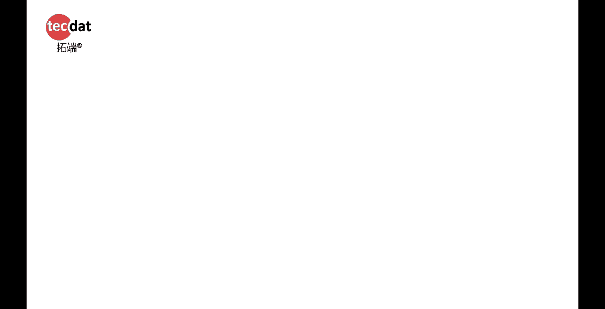

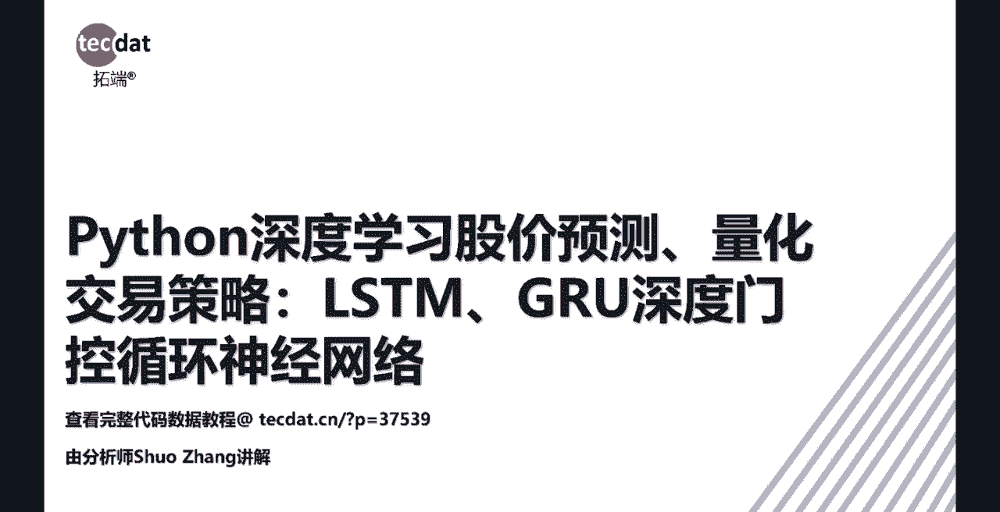

包括三个方面，分别是输入层，隐藏层和输出层，它们各各个层之间都会有一个箭头连接，然后深度循环神经深度的神经网络呢，然后就是比这个简单的人工神经网络，它的这个层数然后增多，然后这个是神经网络的正向传播。

然后就是介绍一下，就是是输入怎么怎么输入，怎么输出的，你看下这个输入input输入，然后W是全输，然后输入之后，然后进入中间层，然后处理，然后这个是用的是西格玛西格mode的函数，然后下面会介绍到。

然后再进行输出，然后的话然后进行预测的话，然后就要考虑它的损失函数，然后就是要减小它的误差嘛，然后它的损失函数的一个定义，然后就是以一个梯度梯度下降的方法，就是不断求导的过程，对损失函数进行求导。

然后让参数按照导数的方向变化，然后这样的话它的他的这个误差，减小的是最快的，那不断重复这个过程，这个是他的损失函数的一个表现形式。

关于激活函数的话，然后也是这上面的集合函数，然后是right luo，SIG格mode和TANENT，然后这三个几个函数，然后像上面印的这个就是sigmmo c mod的话，就是把数据呢。

然后把数据输入，然后把它给标准到0~1之间。

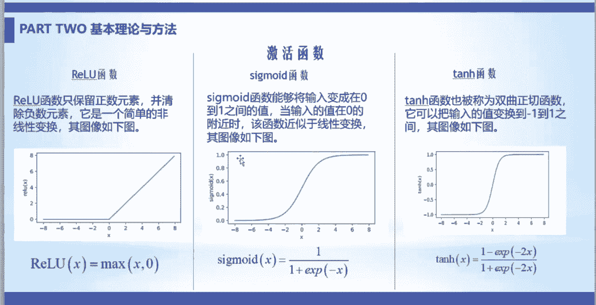

然后丢弃法，然后就是隐藏层的话，如果有的时候隐藏层太多的话，然后它就会造成过拟合的问题，然后这时候的话你就要一些硬件方法，然后用捉破丢弃法，然后对他进行正则化，然后就是减小它的隐藏，隐藏隐藏层的。

然后单元的个数，然后去防止它过拟合，下面讲的人工神经网络，然后人工神经络下一次呢下一层的，然后就是新的发展，然后出来新冠神经网络，主要处理时间序列的问题，很明显，然后就是相对于人工神经网络的话。

循环神经网络它就多了这一条线，这条线呢是指它除了在T时刻，除了T时刻的输入之外，然后还有T时刻之前的信息，然后他也循环输入进去，然后共同去输出这个Y。

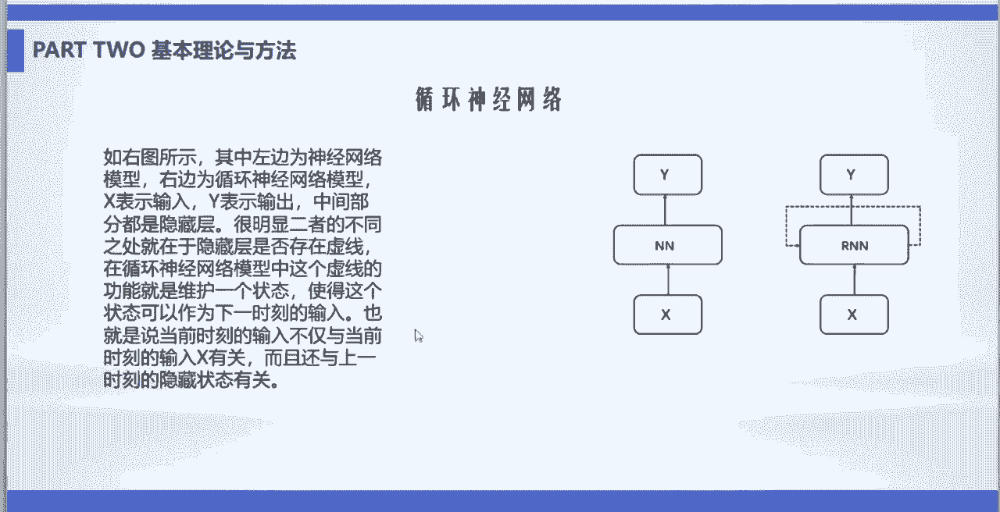

然后这是循环神经网络的一个内层结构，然后这是他的公式，然后这里面N的函函数，旧函数是times，那你看这一个除了XT，然后做这个词刻的输入之外，然后这个XT减一的，它的一个输出也做出来XT的一个输入。

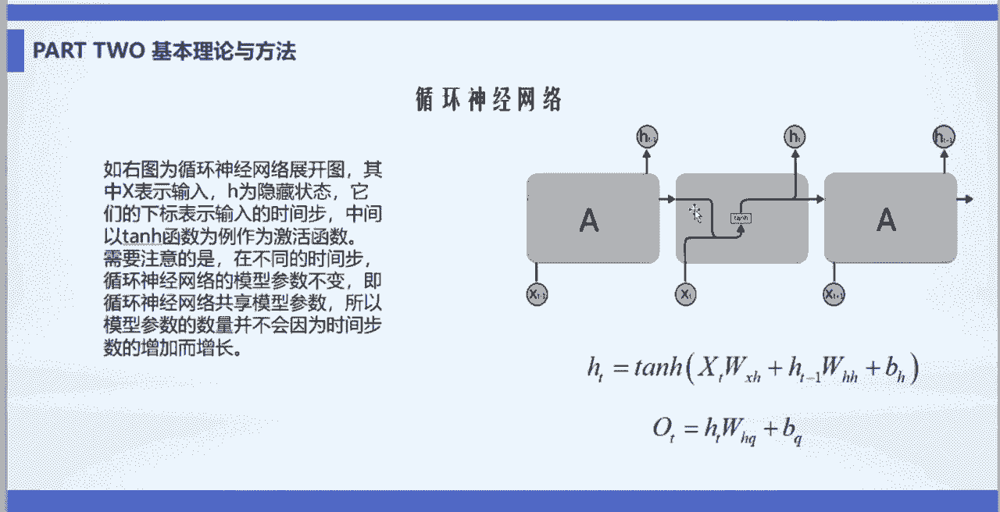

然后一块输出，然后深度循环神经网络的话，就是比简单的只有单层的循环神经网络，多了几个隐藏层，他的公式的话相信也会有些改变，然后循环神经网络的优缺点，就是循环神经网络的话，它只能处理短期的一些依赖问题。

就是只有在较短期的像22年的数据啊，他就做不了了，像短期的1。12年的数据，它是可以做的，然后就是因为因为你随着层数的增多的话，它的序列增加，然后它的参数之间的累成现象了，就会很容易造成这个梯度消失。

梯度爆炸的问题，这样的话他的梯度下降法就失效了，看这一个公式，如果把这个嗯HT减一带进去的话，然后就变成这样，而且T加如果带减的再带进去的话，就一直这样叠加的话，就就会很变得很冗杂的这个地方。

那现在就是介绍我用到的，让ISTM神经网络模型，这里面用的就是用一个一个门控的机制，然后有一个输入门，遗忘门和输出门，你看他在，他也有保留了循环神经网络的一个优点，像你的隐藏状态。

HT眼也就是像T时刻前的一些信息，记忆细胞记忆的是T时刻前的信息，然后经过遗忘门，决定是否要这个体检验时刻的一个信息，如果不要的话，然后就不参与他这个他这个输入输入输入里面，然后输入输入门。

然后选记忆包，然后输出，然后用ISTM网络。

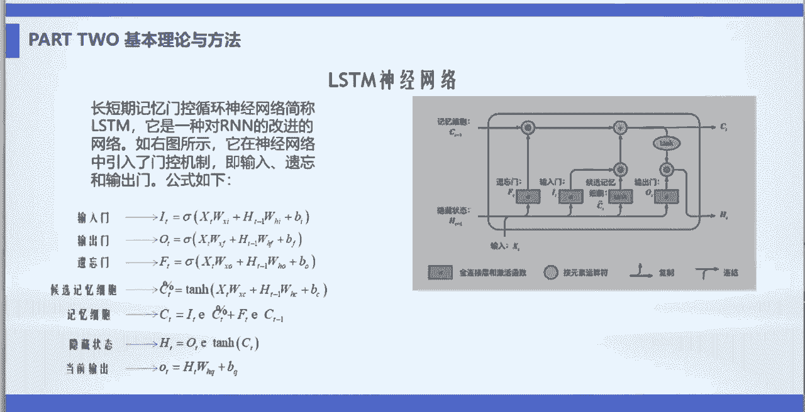

神行神经网络去训练的时候，然后就是这几个步骤，那就设计好SISTF神经网络的结构，然后确定好损失函数，我用的损失函数，然后就是用均方误差进行定义的，然后建立好模型之后，然后再初始化模型参数。

然后根据损失函数对参数进行求导，计算梯度信息等，然后第二第三步的话。

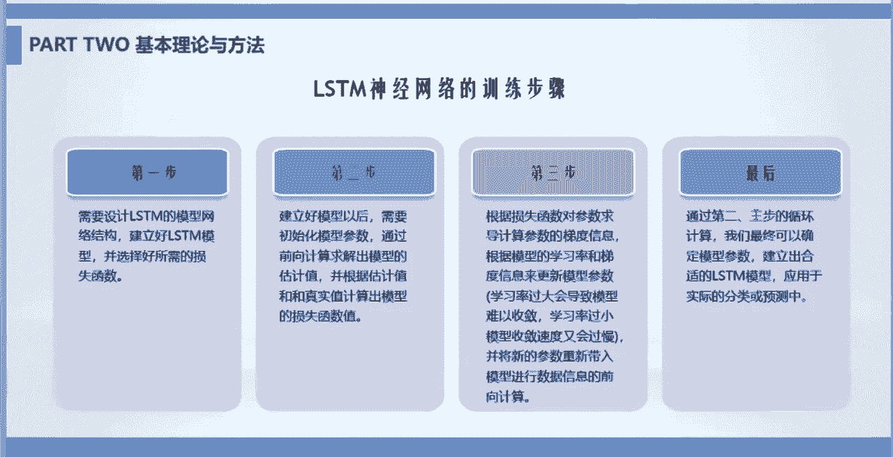

然后第最后就是一直循环，值得要求你来满足你的要求，就当时我用的是Python的图哨库，然后去爬取的将近20年的日交易。

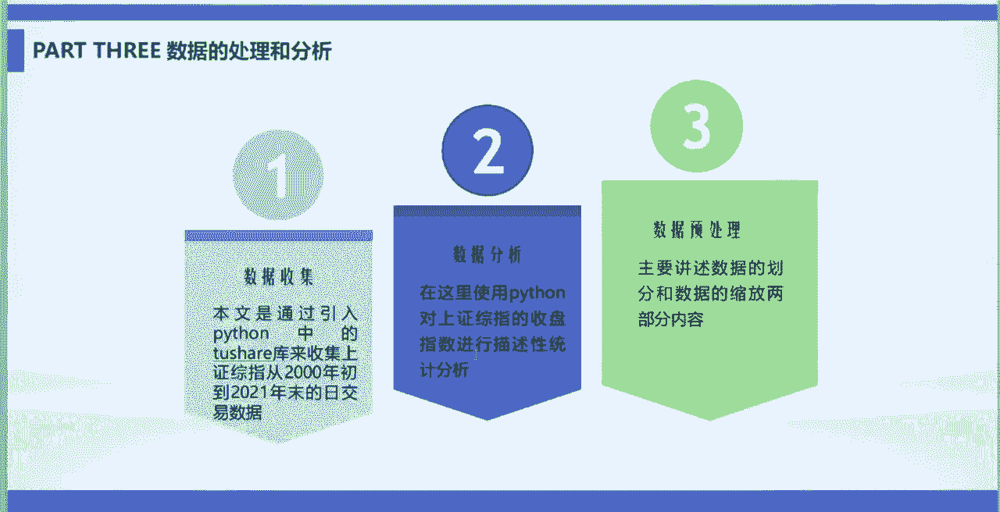

日交易数量嘛，然后现在瞄准统计分析这些，就然而当时我用那个模型，然后爬取的数据的，这是一个前几行和后几行，还有数据分析，然后这些描述性统计分析法的中位数最大值。

最小值，然后做出来，还有还做出来一个趋势图形，要数据的划分，因为你要验证这个模型它是否是好是坏的话，要用训练集训练模型，然后还要去用验证集和测试集去去看，你这个用训练营训练的模拟它的好坏。

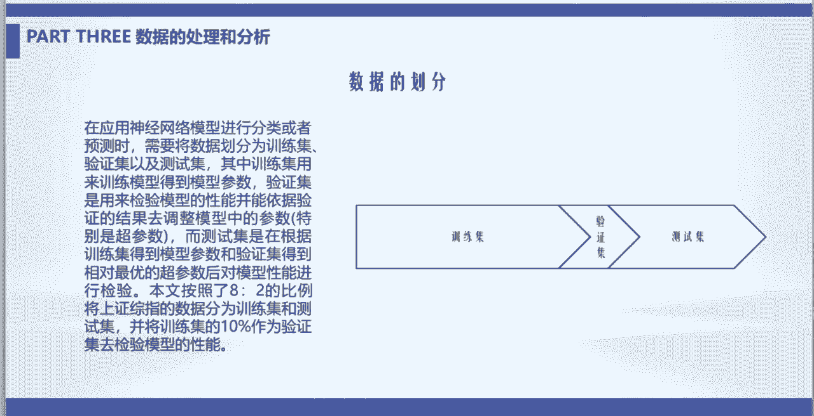

然后数据的缩放呢，数据的规范和标准化，就是为了防止他们的，他们的那个嗯亮标不一样嘛，就是他们那个那个要对他做量纲不一样，因为你要做做无量纲化处理，然后本我当时用的是数据的归一化处理。

这样的话数据在0~1之间，它的那个量量量纲是一样的。

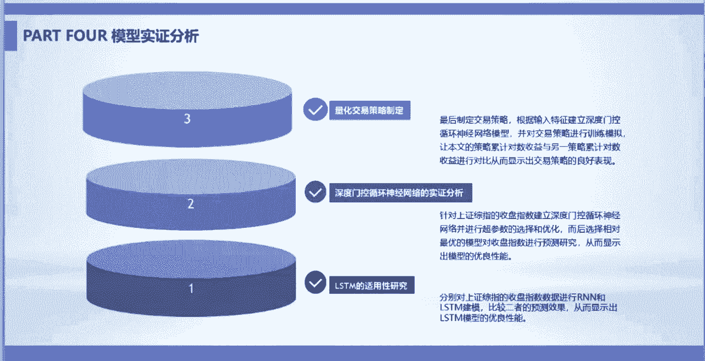

然后当时训练的时候是，这是普通的人工人工人工网络，人工神经网络，这个是用的STM神经网络，然后做的一些误差，发现ISTM地址AINN的话，要要优优化很多，但是一因为挨着天的话。

也有很多参数你要进行调整啊，像窗口大小的话，还有批次量，单数批次量，然后隐藏增神经单元个数，你的堆积率是多少，激活函数优化器，还有你训练的轮数，以及2STM神经的神经网络的一个层数。

然后这就是进行优化过程中，然后在优化的时候，你很明显他这个他这个误差是在逐渐减小，减小到一定就慢慢的减小，然后当时进行超参数选出个优化的时候，然后就找到了一个最优的，然后层数是两层，单元数是56。

期率是30，然后P四六十四，然后是最小的时候是这个，然后做出来的一个预测的结果，和真实值进行比较，你看这个绿色的就是预测的，然后这个红色的就是原来的，然后发现他这个效果还是不错的，然后这是显示函数。

就是看它的损失函数大小，你看这是还在接受范围之内，垃圾定定义量化交易策略的时候，然后就是先定义一个新变量，Price rise，然后要预测的值，然后就是预测，当你预测的时候。

你明列数房价如果大于当时房价的话，就给这个复制为一，给这个变量赋值为一，否则就复制为零，但是按F比二划分了新的一个测试集，然后当时用的变量就有这些开盘价，最高价最低价，收盘价还有一些呃，像3日均线。

10日均线了，相对强弱指数都是一些股票方面的一些呃，一些相关的指标，然后这是当时我训练出来的那一个，有自己的参数a dam，然后基本之20损失函数YMCE等等，然后当时得到的。

你看这样一个他的一个训练的误差，是逐渐减小的，这个训练的精准度逐渐上升。

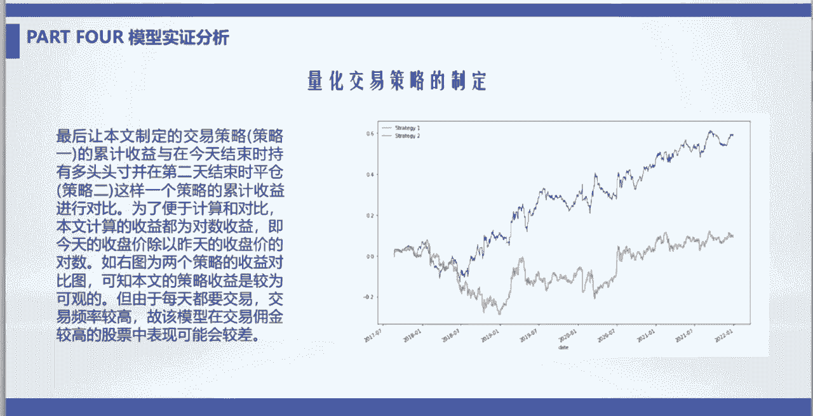

然后当然最后做出来的量化交易的一个，一个收益比，然后这个黄色的线呢是嗯简单，今天买明天，然后就卖了一个策略，然后就发现就是基本基本上就是保持收益都，刚开始，到最后就是保持几乎一个不变的一个状态。

然后如果用这个，我SM神经网络模型去模拟的话，然后就是预测到明天如果是涨的话，然后就是就留着，如果是如果是降的话，然后就卖掉了，然后这样一个收益策略的话，然后前期的话表现不太好，然后之后会发现它的效。

它这个策略还是比较。