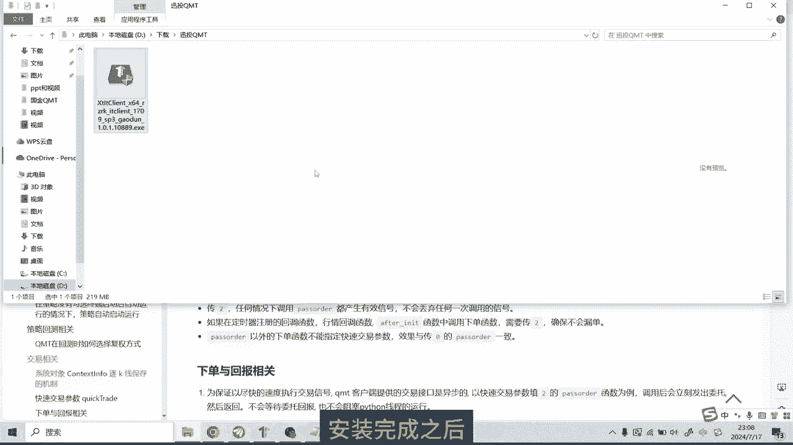
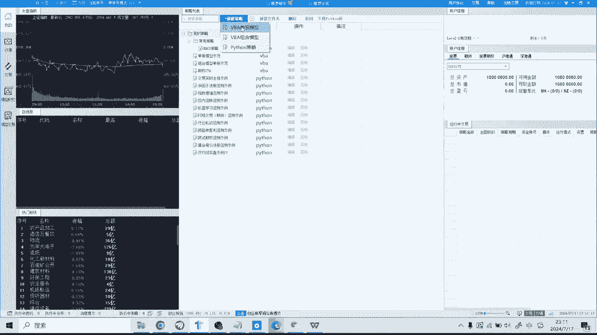
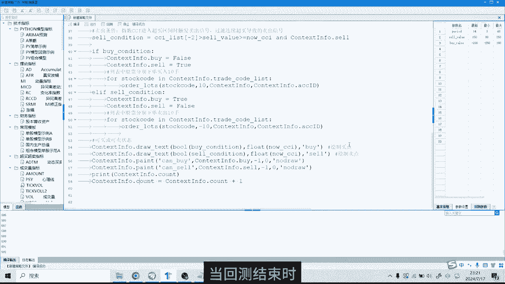

# 【迅投QMT】使用教程 _ 低门槛的量化交易实盘软件 #迅投qmt #量化交易 #教程 #python编程 - P1 - 无限超人Infinitman - BV1UA1tYyEa1

哈喽大家好，我是量化策略研究员ANDY，今天跟大家介绍一款量化交易软件，迅头q mt，逊头支持用户使用vb a和拍摄语言编写策略。

并且还提供了丰富的API和使用教程，确保用户可以顺利完成自己的策略，那在安装QMT之前呢，我们首先需要下载一个安装包和一个测试账号，那这两个东西如果你还没有的话，可以向我要整个安装过程是比较简单的。

跟普通的软件安装是一样的，那我这里就不再演示了，安装完成之后。

我们登录到这个软件，首先要下载Python的第三方库，点击主页上方这里的下载Python库，然后点击这里的Python库下载，下载需要一点时间，大家稍等一下，目前讯投这款软件已经接入了多家券商。

可以支持量化实盘交易，但是很多券商的门槛是比较高的，动辄就要100万，200万的资产才能开通量化实盘权限，我这里帮大家申请了专属的渠道，只要较低的门槛就可以开通量化实盘权限，而且手续费也是比较低的。

如果有需要的小伙伴可以跟我联系，好现在Python库就下载好了，下载完成之后，我们需要重启一下软件，接下来我们来看第二部补充历史数据，因为QMT回车都是在本地运行的，因此需要把历史数据下载到本地。

首先点击左上角的操作，然后点击数据管理，选择补充数据，左侧可以选择数据类型和对应的交易数，包括K线数据，财务数据等等，那我这里选择K线数据，右边这里可以选择数据范围，最近一周，最近1月或者全部。

那我这里选择全部，下面周期选项，这里我这里选择日线数据，然后点击开始，如果是第一次补充数据，时间可能会比较久，大家耐心等待一下，好现在数据已经补充完成了，那我们新建一个策略，点击上方的新建策略。

迅头支持VBA和Python两种语言，那我这里选择Python策略。

这是默认的策略代码，那上方主要是一些策略注释和导入第三方库，代码主要分为下面两个部分，第一个是INIT函数，还有一个是handle by函数，INIT函数是初始化函数，它在整个程序中只运行一次。

我们可以在函数里面设定要操作的股票，定义一些全局变量等等，而handle bar函数是每根K线运行一次，比如我选择日线级别的回撤，那在我选定的回撤时间段内。

每一个交易日handle bar函数会被运行一次，本期视频我主要演示q mt如何使用，代码部分我就不展开讲解了，对于Python量化编程感兴趣的小伙伴，可以加入我的量化投资交流群一起学习。

那如果整个代码都写完之后呢，在界面的右侧，我们需要对一些参数进行配置，首先需要设定回撤的起始日期和结束日期，比如我们可以从2022年1月1号开始，一直回撤到昨天，2024年7月16号，7月16号。

然后是设置基准，基准是指将策略的业绩与某一个指数进行比较，通常情况下，我们会选择将沪深300作为默认的基准，那初始资金，这里是指策略分配的虚拟资金总额额，用于模拟交易，下面这个保证金比例。

这个参数通常是用于期货交易，由于我们这里回车的是股票，因此可以忽略这个设置，下面这个是滑点设置，下面是手续费设置，不过为了演示方便，我们这里就不设置滑点和手续费了，最后一个是最大成交比例。

这个主要是用来控制回撤中的成交量，不超过市场成交量的一定比例啊，比如设置为10%，那策略每天的成交量，就不超过市场当天成交量的10%了，然后是基本信息部分还需要设置，比如说策略的名称快捷码。

包括策略的书名分类，策略分类可以将策略归类到不同的类别当中啊，然后运行的位置，通常策略会运行在附图上，那默认周期可以是日线，月线，分中线等等，那这里我们选择日线默认品种，这里是指主图显示的股票代码。

下面这个复权方式是可以选择前复权，后复权或者等比复权，我这里选择前复权了，还有一个参数设置在这里，可以自定义一些全局变量，那我们这里就先按照系统默认的设置，完成了这些设置后。

我们的交易策略就可以顺利的运行了，首先我们需要编译，编译是指对策略进行保存和更新啊，然后点击回车按钮，当回测结束时。

我们把代码界面最小化，可以在界面上看到策略回测的结果，左侧是K线图，右侧展示了策略的绩效数据，K线图的上半部分为主图，下半部分为副图，在附图上，我们可以看到策略的净值以及开平仓次数，胜率等一些信息。

通过使用键盘的上下键，我们可以对K线图进行缩放，左右键则是用于移动K线图，右侧的图表与左侧的K线图是相互关联的，因此当我们移动K线时，右侧的数据也会相应的变化，比如我随机选择某一天。

右侧的图表会展示截止当天的年化收益率，夏普比率等策略评价指标，以及买入卖出和持仓的详细信息，在持仓分析页面，我们可以查看所有持仓股票的权重，在历史汇总页面上半部分显示个股的盈亏汇总。

下半部分则展示板块的盈亏汇总，在日志输出方面，上半部分记录了回撤期间所有股票的买卖记录，下半部分则是策略的详细日志，这就是如何使用迅投q mt进行，策略回测的全过程，好了本期视频就到这里，我们下次再见。

