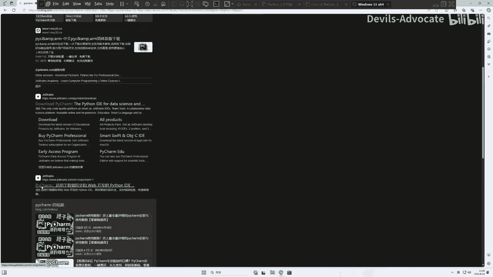
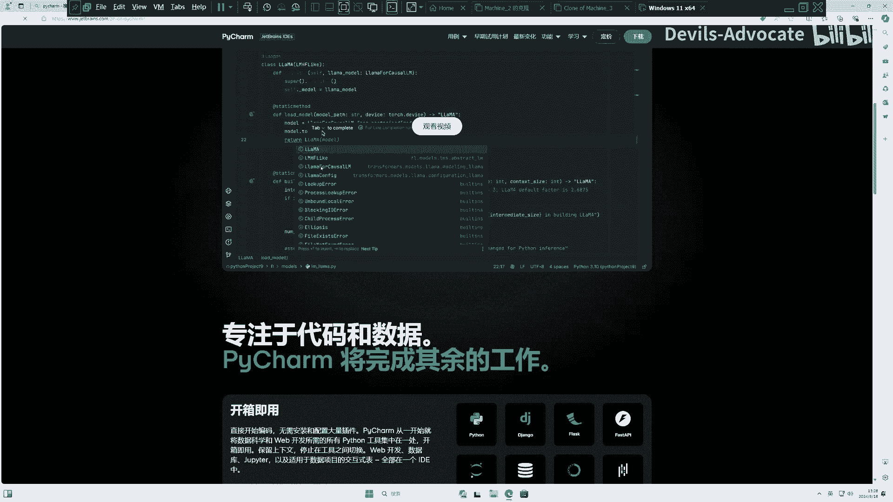
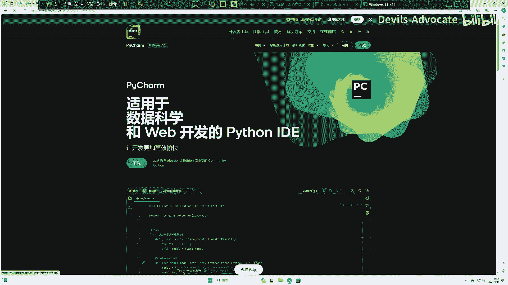
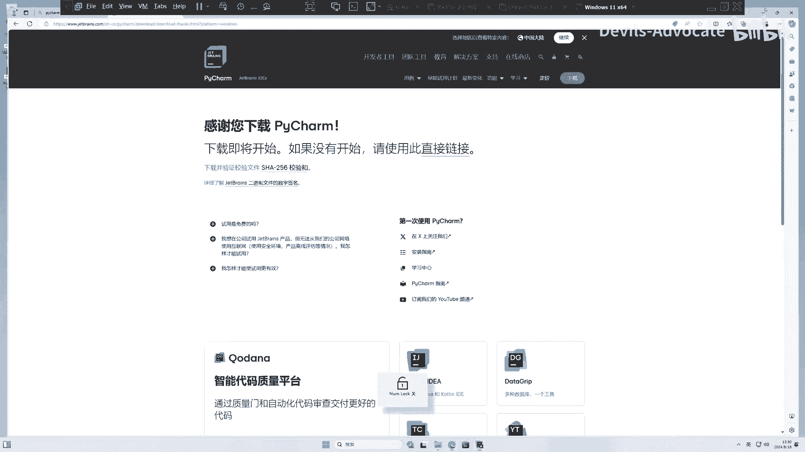
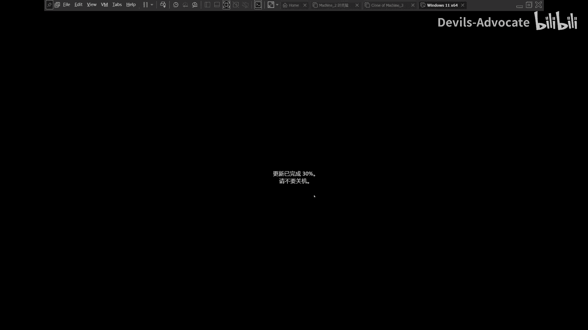
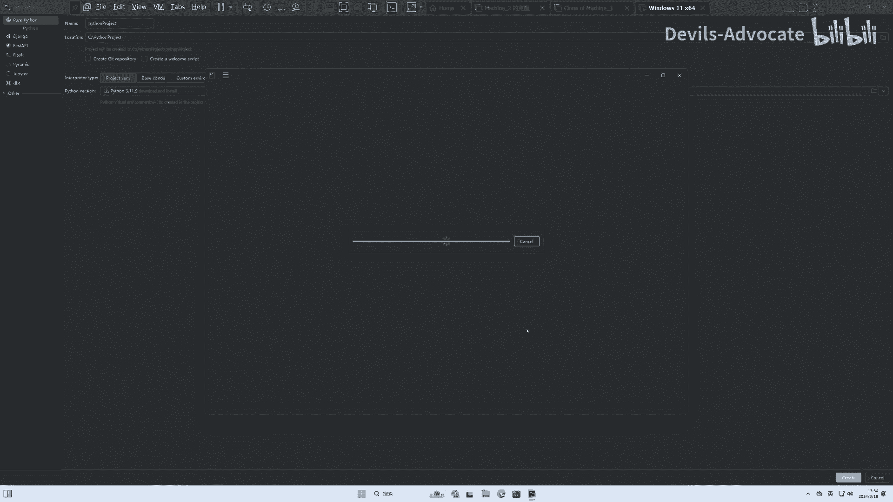
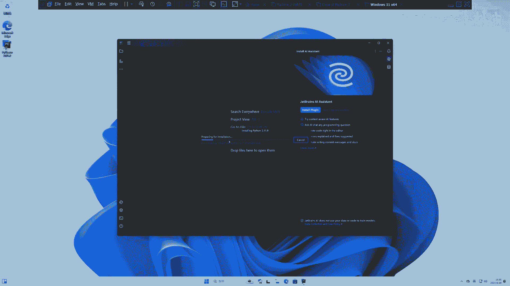
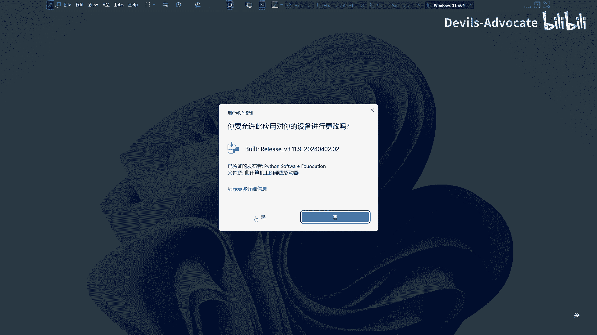
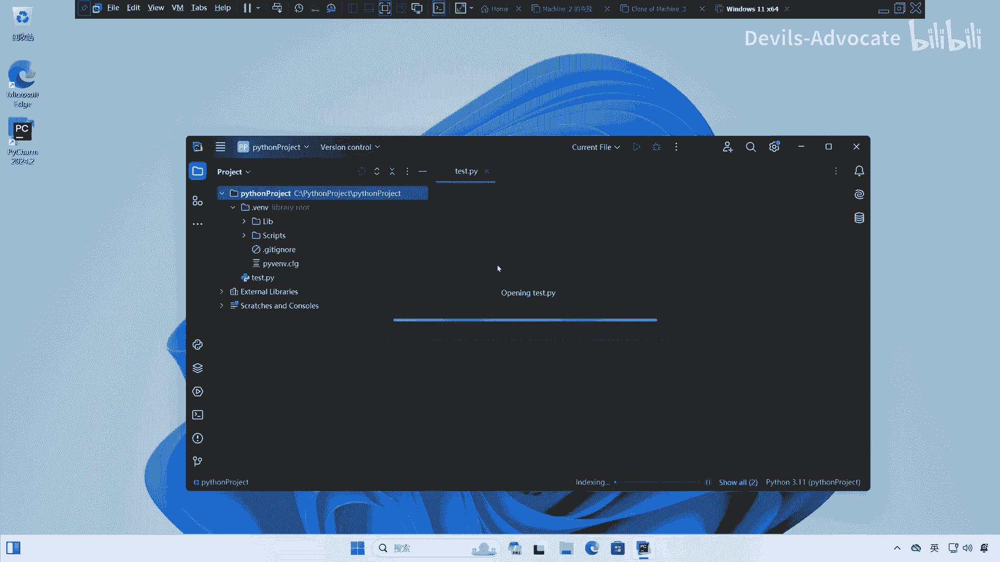

# 【量化交易】Python入门之数据分析【1／4】｜ 金融工程 量化金融 - P3：0. Python 安装1-python和pycharm安装【推荐步骤】 - Devils-Advocate - BV1efHAe2EAR

大家好，这次我们来演示一下怎样设置拍放on的环境。那么我在windows11上这边我打开一个浏览器。我们找一个搜索引擎，我喜我我比较喜欢用bin。然后呢我们搜索一下把H charm。

H charm这是1个IDE就是运行pyython的一个软件。然后呢，这边应该有个中文版的，呃，找到它的官方网站jat brains，然后找找到这个排ch。

然后我们来找一下它的下载地方。

这里下载。

然后你可以看到它是professional，就是专业版的。啊，除此之外，还有micacwise嗯，咱找windows下面的professional版本，它的激活码你可以在某宝上自己买一下。

如果你没有激活版呢，就是你没有激活码，你也可以用一下30天免费。呃，我们进来。直接下一下。然后我们这边。下完了把它打开。呃。原点允许。我安装在C盘的这里，但是大家你可以变成D盘啊或者E盘。

然后桌面创建一下快捷方式。嗯。创建关联吧。并添加到pass里去。后jebra让他安装就行了。

然后我这边安装完完全了，我们来重启一下电脑。

行，我这边重启完成了，我们打开一下排charm。确认。不发烧。如果你们买了激活码，可以在这边选择activact paid the license。

或者呢我们 start a free30 day trial。30天免费使用。也可以关掉。然后这是我们界面，我们点一下new project。这边其实后面应该可以换成中文版嗯。等会儿找一下。

我们点一下newproject。然后呢，pyython project。这边选一下我们要放在哪，把这个。新建一个文件夹。拍yon。Project。我在C盘里见的，大家可以自己选一个别的盘。嗯。

Python version。选3。11。9，当然你可以选高一点的，其实无所谓。但是大家如果想跟我一样的话，嗯，可以选3。11。9，然后project。

V virtual environment这个VENV就是virtual environment。其他的我觉得应该可以，就这样了。Yeah great。

然后他自己会下好我们的pyython3。11。9。这个关系我觉得有必要跟大家讲一下，pyython它是一个单独的一个程序。那么这个py charmm呢是它的一个界面，就是我们可以有很多不同的界面。

有jupyter notebook呀，有py charm呀，或者有或者有像其他的spider，嗯VX code。对吧这些都是就是运行排thon的一个界面化的一个软件。但是不管哪个软件。

它背后都得有拍on支持。就是我们所以他现在我我我是先安装了这个呃它的界面软件，然后由他自己把排档下下来，这样就比如省呃省去，我再去排档那边自己单独下了嘛。然后我们现在等待它安装好。因为它可能连的是外网。

所以这个速度有点慢。

好了，经过漫长的等待呢，它这边已经基本上完成了，然后我来安装一下。

他给我下下来的拍档。这边有个microsoft defender configuration，这个就是windows自带的。呃，自带的那个防火枪，然后要让它能。把这个排 charm给放行一下。好。

这个我把它关掉，这边可以关掉。那么这边就是我新。Inst的。排呃排就是排 charm的地方，然后我可以比说新建一个。拍档发呀。Test a。这边点示就好了。test。

Print。Hello。应该没啥问题了。SQ line python console。那这边有几个地方哈。这个是我们的python console，然后这个是我们的电脑的seasn terminal。

我们如果安装包啊什么的，会在会在这里在这个terminal这边安装。如果是指跟python两互动的话，我们在呃这是我们写代码的地方，这是我们的。就是排ython运行的结果。

excu execute execute line in python council或者是outshift加一。🎼呃，我直接outtoshift加E了，它就会在这儿打印，或者是我们也可以在这儿直接写。

Print， hello。他也会打印出来。那么这个位置呢，我们可以用open in exploreer。在我们的C盘就是我刚刚才创建的地方。这里是test，然后剩下的两个地方。

doVENV这个是我们的系统文件，就是pyython为我们这个project创建的。系统或者是包的保存点，大家不要动，然后idea是临时储存的点，大家也不要动，这边就可以，这是你自己啊刚才新建的东西。

然后还有就是我要讲一点，就是因为我们直接从外网下包的话会比较慢。所以呢我们用我们要把这个。下包的地方改成国内。へ？🎼config就大家跟我这样设置一下，到terminal里面。

然后我们的pa confi set global。🎼global点index。URL。DDB。🎼P，Y PI tuna。🎼清华。这是清华园点EDU。就是这个圆是清华的镜像。这样就行了，然后我们打个回去。

然后以后我们下包就是从从这个清华的这个镜像源头开始下。呃，就不会跑到国外去了。然后我们要干嘛呢？我们要inst一下这个我们呃后面会要用的包。Inst。南派。这边要等一下。目才虽然我设置了清华园。

但是怎么还是没接上去，有点慢，所以用这行代码pep3in number排。一个小杠I，然后我们用PYPI two的清华到simle，然后回下车就行了。然后我们还得安装一下pandadas。

🎼然后将n派和pandaas9安装好了，我们inport一下。🎼なはい。P。应该没有问题吧。可以啊，能麦和paas呃已经可以用了，所以这基本上就是我们后面需要用到的几个包。那么这里就设置完毕了。

谢谢各位。

