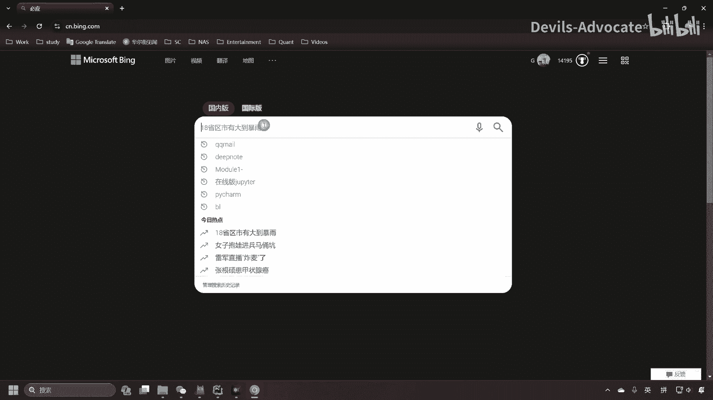
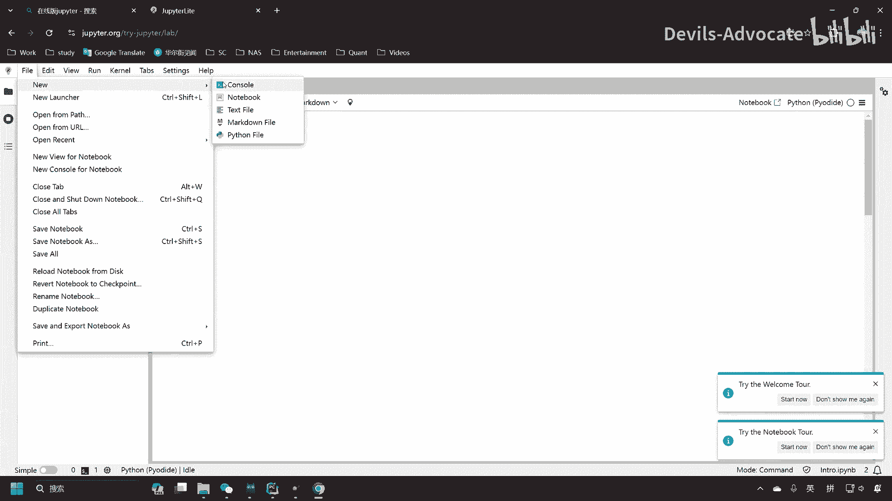
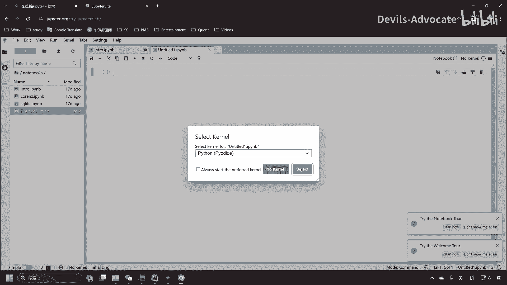
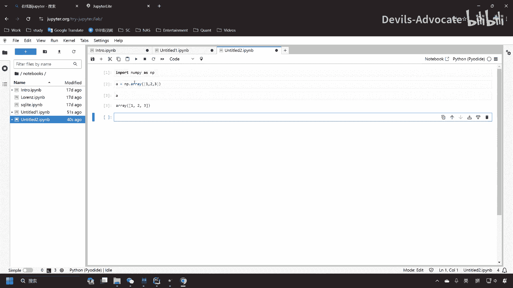

# 【量化交易】Python入门之数据分析【1／4】｜ 金融工程 量化金融 - P5：0-1（可选） Python环境：线上环境jupyter（如果步骤0失败，或者想直接使用python的快速步骤） - Devils-Advocate - BV1efHAe2EAR

我们首先来配置一下环境。呃，那么我先这里介绍一个在线的配置方案，就是大家如果不想安装。电在不想在电脑上安装任何程序的话，我们先来到B。然后这是我们的microsoft bin啊的搜索页面。

然后我们搜索一下在线版jupyter。

注意是jupiter，然后。诶。然后我们会点到这个jupyter project project juter这个。

或者你直接打jupyter dotorg到try也行。然后我们走到这个jupyter lab。在这里呢我们可以点一下start files，star呃star a new notebook。

这里应该是我们。你在这再点一下这个加号啊，然后这边相当于我们创建了一个一个的那个jupyter的。呃，文件在这里呢呃可以跟上我上课讲的东西。Important。by。🎼比如说A等于NP点2。

我这边就可以直接运行了啊，省掉了各位各种的安装步骤。

