# 【量化交易】Python入门之数据分析【1／4】｜ 金融工程 量化金融 - P8：3. Python数据分析：Module1-数据类型2之字典和元组(Dict and Tuples) - Devils-Advocate - BV1efHAe2EAR

前面我们讲了数据类型和列表，字典呢是python非常常用的一个功能。呃，这边大家。呃，认真听一下，呃，会对你以后使用python非非常大的帮助。嗯。😊，我们先来说一下字典的结构，基本上它是一个大括号。

跟之前的列表list相比，list似的是中括号嘛，字典是大括号，嗯，它可以有两部分组成。比如说。这边。小明李，然后我把他的email写在后面。小明李爱叉叉univeity。

的PDU然后我可以再给他另外一个人，比如说。Aone。Mask。At。Les啦。com，所以这个字典呢大家有没有看出来，就是一个一个key对应一个value。这后面呢我们叫它值这个前面的部分。

我们叫它key键就是。嗯，我打一下吧。き？K等于键按键的键。valueue值。所以dig是由这两部分键和值对应组成的。然后你可以有很多呃键值，然后它的值呢可能不只是string类型。

它可能是整个一个list都可能。呃，但目前你现在知道这就行了。呃，我把它复制给X。

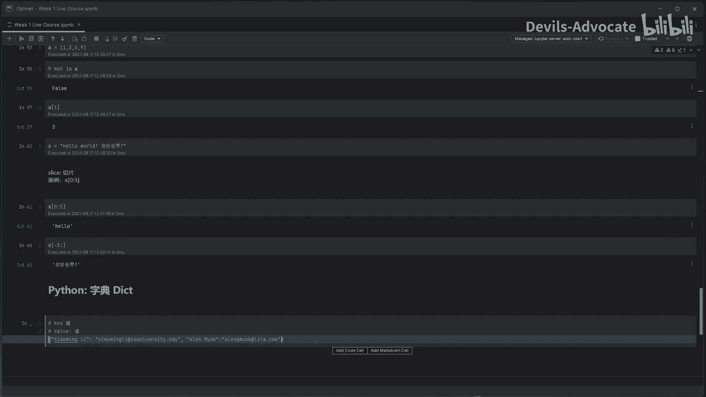

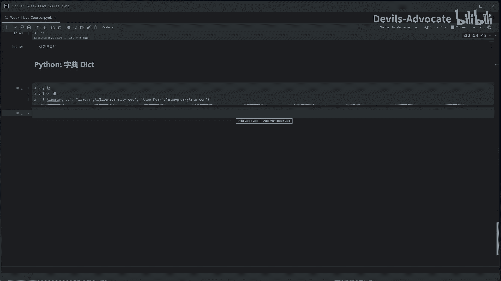

然后我们看一下X。嗯，待会就变成这个形式，这就是我们的字典。那我如果想调用某一个，嗯，比如说小明，我想我想知道小明的他的email是什么，那我们可以这样做X。小明李，然后就会得到他的值。

就是我们把件给他，然后他就给我他就会给我返回出来这个。嗯，它的那个值，比如说我想增加一个嗯，alice王。但是他没有email，我们可以让他等于弄。

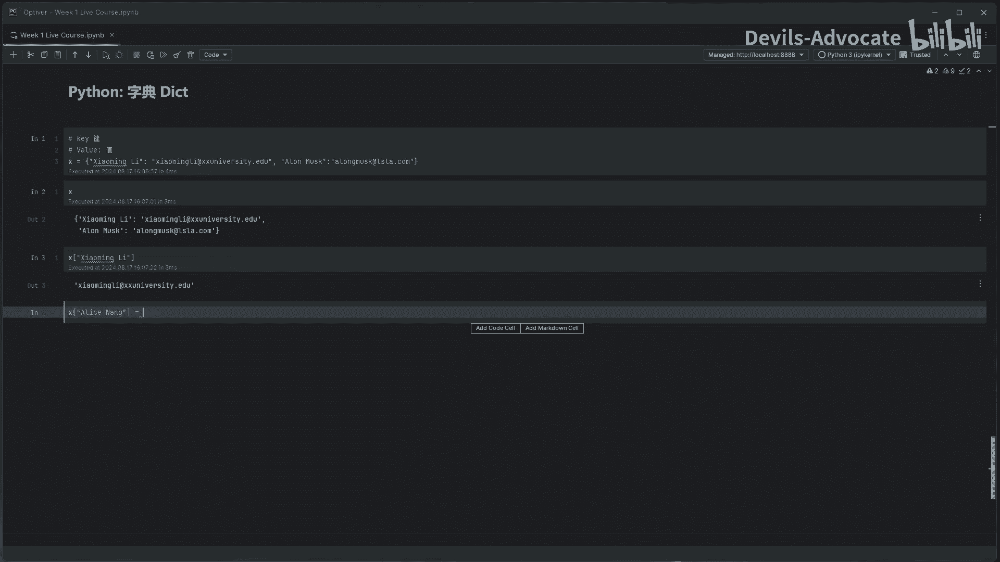

我们再来看一下这个字典，那我们就可以看到alice邦，它它这边它的值就是n。那如果你想要alice斯邦的。呃，他的那个他的email会得到什么呢？

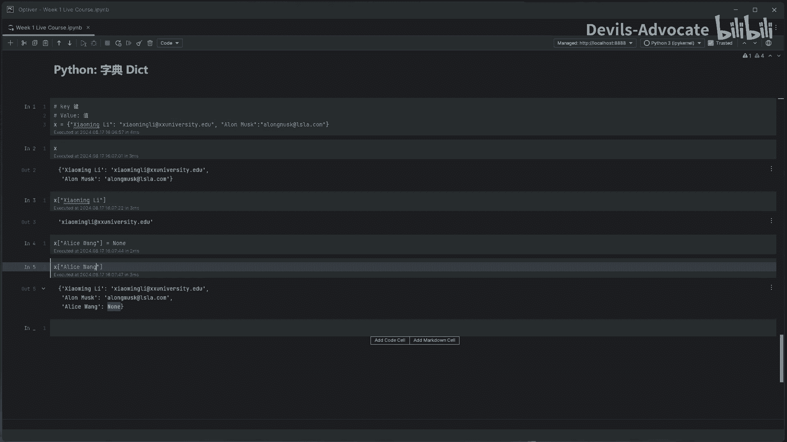

n就是n就是没有的意思，就是什么也没有。但是这字典里面还得显示出一个东西。那就是n。这个大家记住行了。然后我如果想便利所有的建头呃，我们应该怎么办呢？For。Name in X。Print。X。

Name。就是我们需要便利啊，他们的名字就这个键或者叫它key也行。X key。

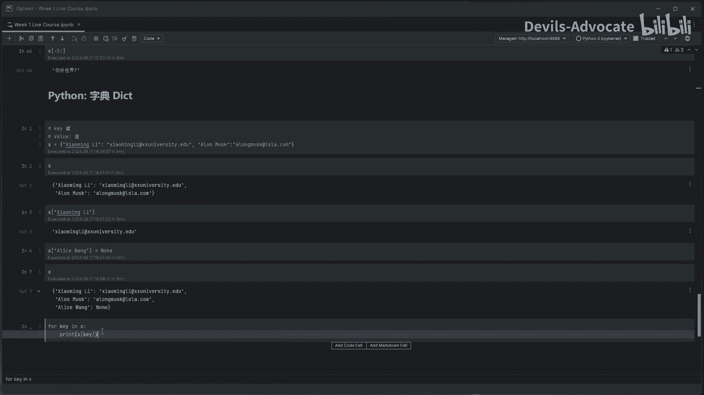

呃，for key in X，然后然后我们就会打印出它的值，对吧？我们会把他们的把他们三三个人的，他们的email都打印出来。

所以我们可以这么来辩历。然后我们如果想便利所所有的value怎么办呢？Or。Email。In x到t values。你这样子啊X点values，我们可以printemail。可以看一下。

那或者是我们直接看一下X86是什么意思啊。

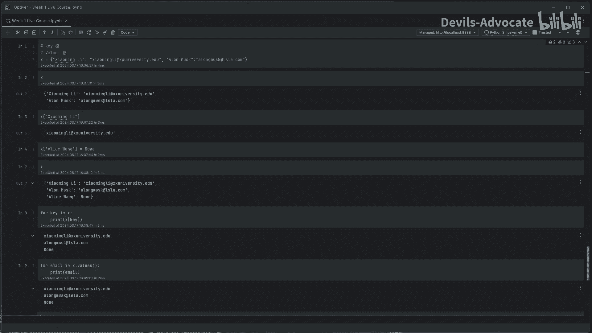

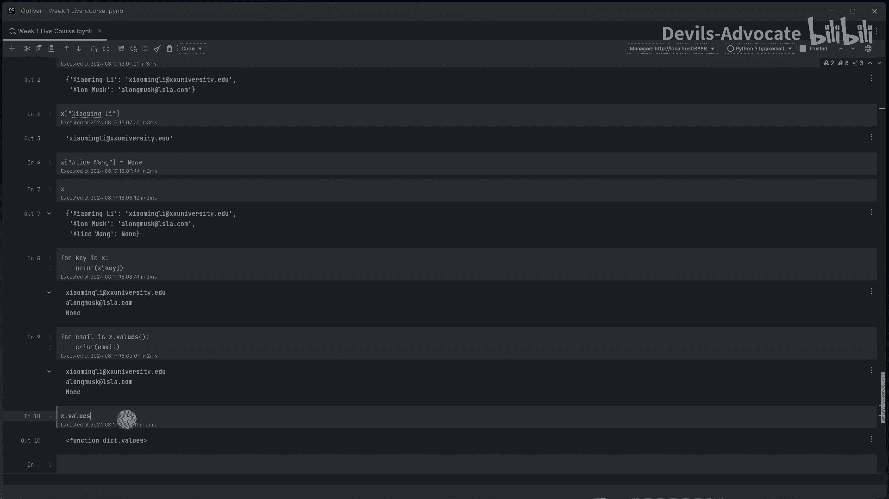

那这边就是dict value。他就是小明礼，对吧？alon和n能不能选中呢？我们选小明理，那这样子是不行的。就是你你虽然他这么给你值，但是你不能直接在这里选，你必须得变利。

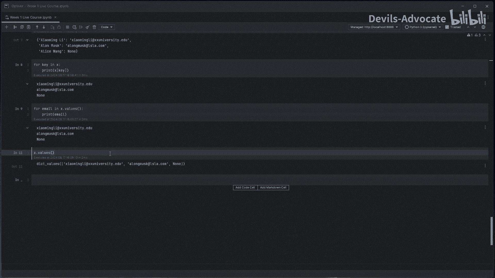

就是必须从email。呃，for email in X values这样的方法来便利便利，你是不能直接呃用d values再来选，这样子是不行的。然后我还可以干嘛呢？

我还可以建和值一起 for key and value in X dotI。Priring the key。Print value。这样子我就可以呃让他把他的名字和。这个email嗯就是都便历出来。

就是一起便历。

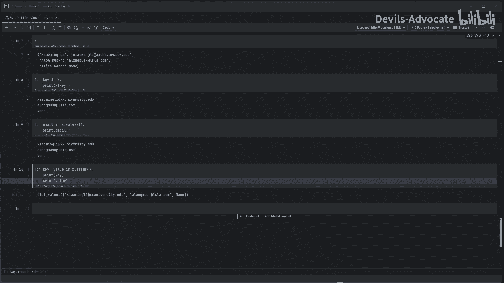

然后我们可以看一下X到 items到底是什么东西。这样我们看到dig item就是每一个iteen，它就是一个一个原括号。大家这意这个方括号原括号要注意了，它这个digdig item。

和那个嗯它是一个先是一个原括号，然后再像一个列表一样的东西存在这里，然后再来一个原括号呃，两两只之间一个原括号。但这个方括号嗯这个方括号类似于list的，但是它是框在 item里面，这不一样。

就比如说如果我想选中第零个，那如果是list的，它就是我们就可以直接选中了，对吧？但如果是这个dig就不行。就是所以说如果它是字典形式啊，字典它是一个没有顺序的东西，你你不能拿就是你不能拿索引来选择它。

你只能拿key和 value来选择啊，或者是用fo loop把它把里面东西弄出来。

呃，那这个是字典。

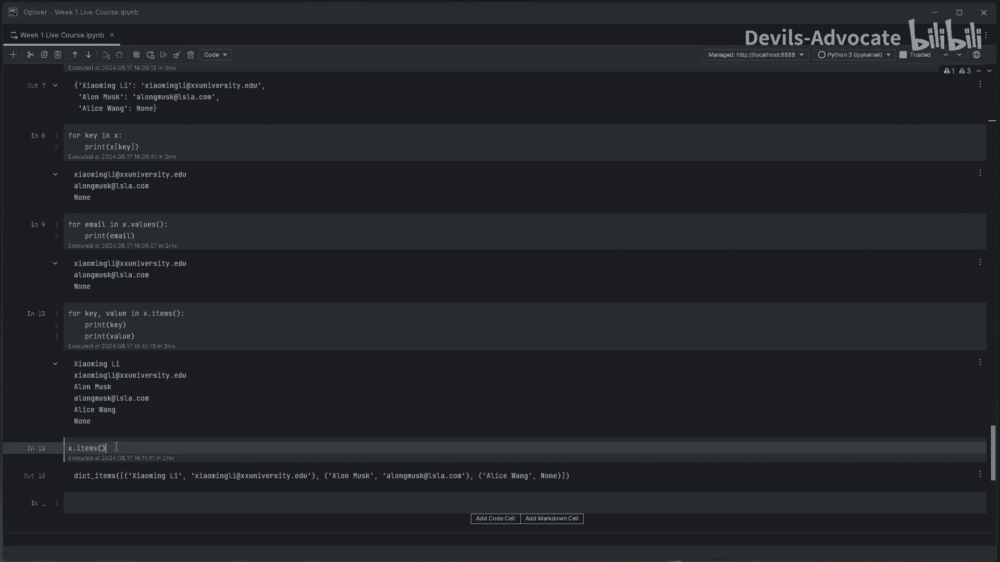

然后我们来讲一下压缩。嗯。比如说。X等于。Alice。小明。

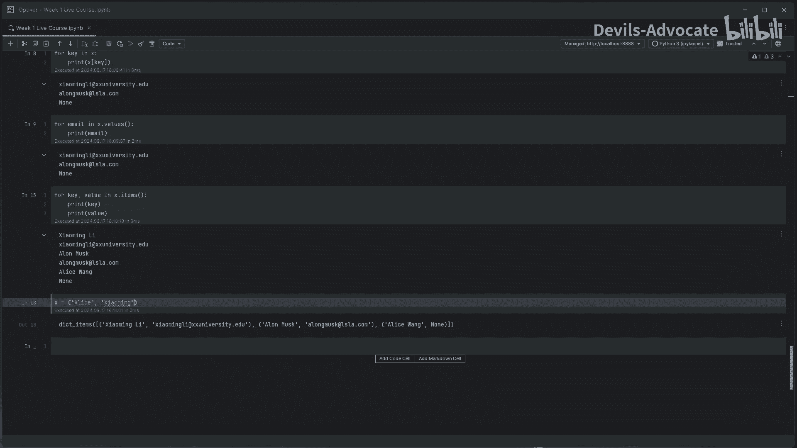

还有allonallon。那X的是不是三个值啊，那我是不是。比如说。嗯。A。X。哇，这个这个。这个不好，alice王。讲样呃 lets。1 do。Disrupive。Algo点com。

大家如果想来VC的我们的我们的网网站可以走这里。呃，这是。来ice是王的。First name， F name。Last name。 our name。

还有email。等于X。

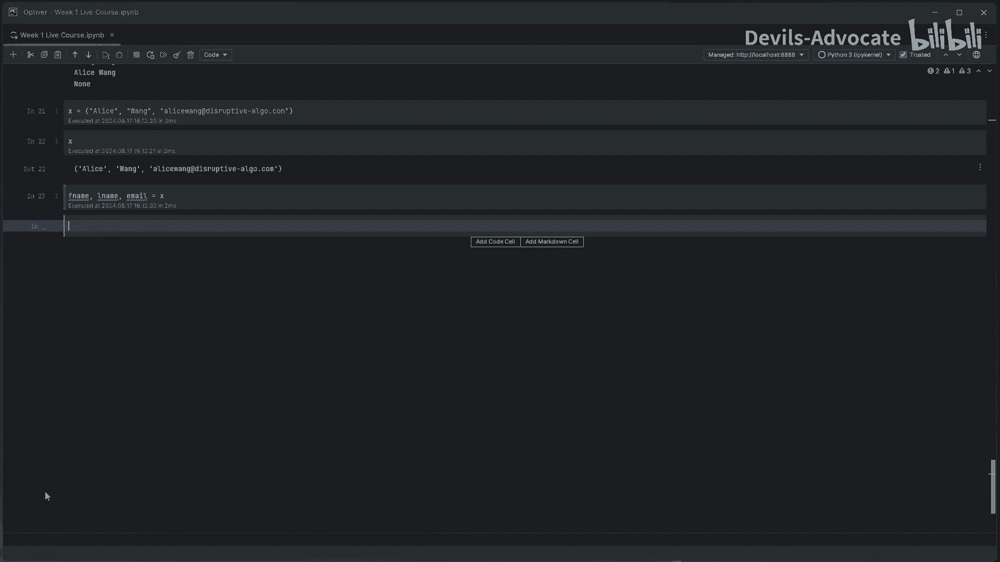

就相当于我把它打包到一起，然后我可以一句话给它拆分，然后呢。呃，我们可以看到是第一first name就是alice，那last name肯定就是王了，email就是他的email。

所以这是一个可以拆分的一个东西。那你要确保他这个这两个。这个元素跟它的值是对应出来的那我如果想再多拿一个啊B，那你就拆分布出来。因为你只有三个元素。那如果你想你多一个呢，比如说电话176。

我就我就这么打了，对吧？那如果拿三个来接这四个的那肯定也不行，那所以我还要要一个。

放了。这样子才行。所以这是我们的打包和拆分。那有的同学说这个圆括号是什么？圆括号其实应该讲一下，但是原组。

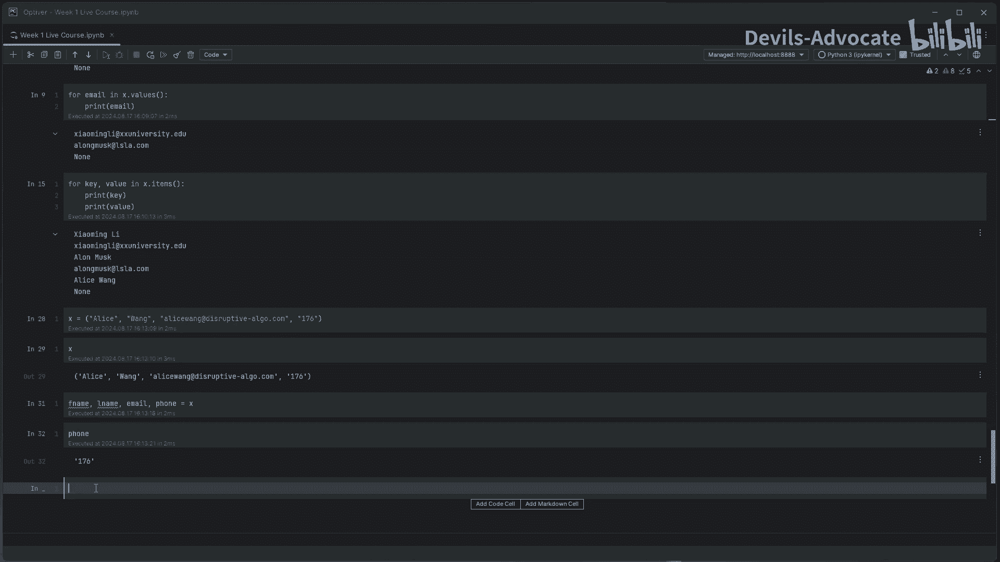

呃，这个。在这里吧加个mer等。The。我们也叫它ts。或者有人会念t po都行。元组。那比如说X。X等于。一。A。2。

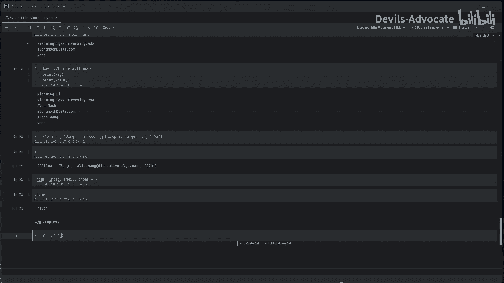

毕业。这是我们的X，它跟list有点像，但不同的是什么呢？比如说。他这个呃拿一号元素吧，一号元素是A，我给它换一下。诶开成 c。就不行，所以这是为什么呢？tuups它跟list的一个区别是tupo。

它是不可以改变它的数据结构的。就呃所以我们有三种数据，三种数据嘛。List。大家如果还记得的话，用方括号。Dict。

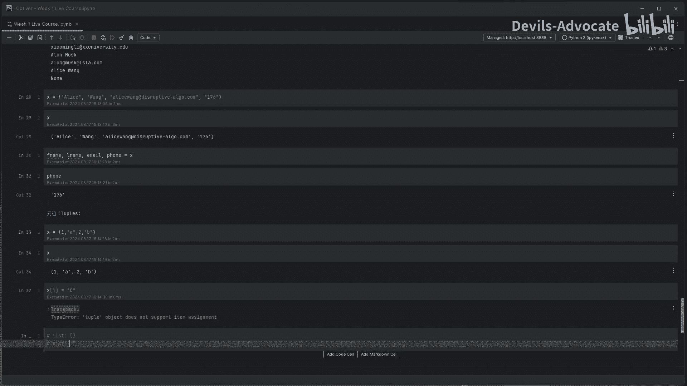

大括号。然后还有tups。原括号。嗯。list它这个有顺序。有索引。他这个无顺序。无所以。我不能拿后面我不能拿这个东西来找d里面吧，但是它有key和valuekey和value有键和值。

tuupils tu，它是有顺序。有所引。所以。不能更改。呃，可这个是可以更改，所以这是他们三个之间的关系。作为list的，我我可以这么我可以这么来，对吧？如果X是一个list的话。

比如说那那X现在是一个元组嘛，那我A。

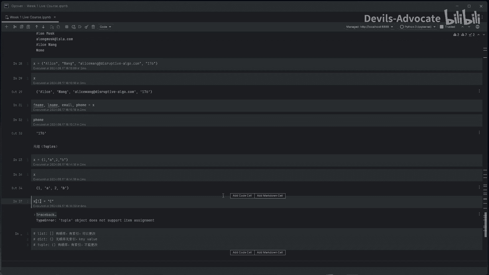

A。等于。反那A的。比如说。第一个元素就0一它是2行，那等于3，那是可以改的。我再把A打出来，对吧？133那。tu pulse它就不行，dck的升级，它没有顺序，你没法缩引，你只能按键和值来打。

但是这个是可以更改的。就像就像我上面说的啊，如果你拿alice王对吧？它等于none。

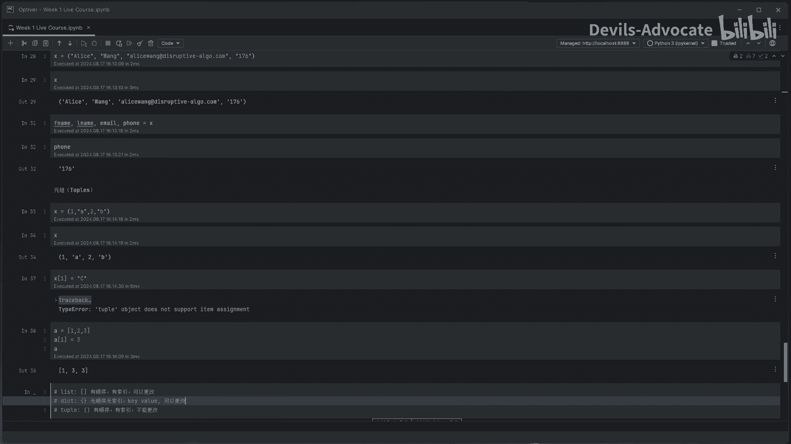

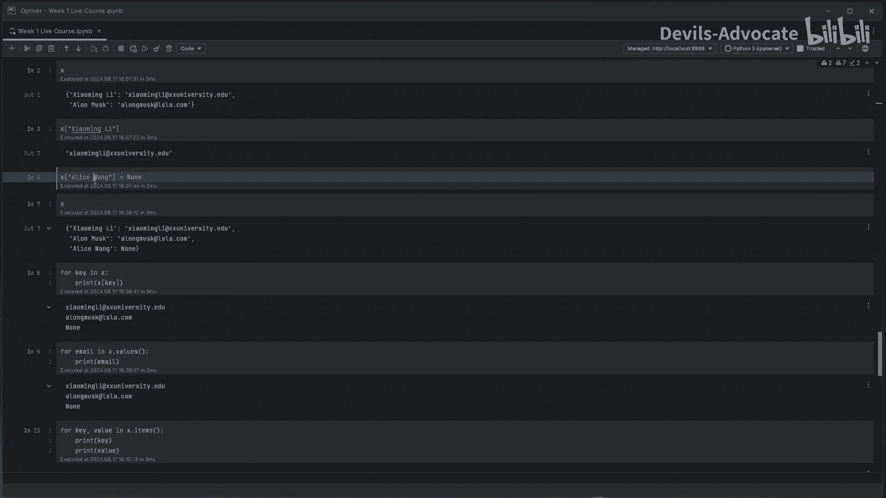

比如说这里我再重新给它复制一遍。然后来让他等于。

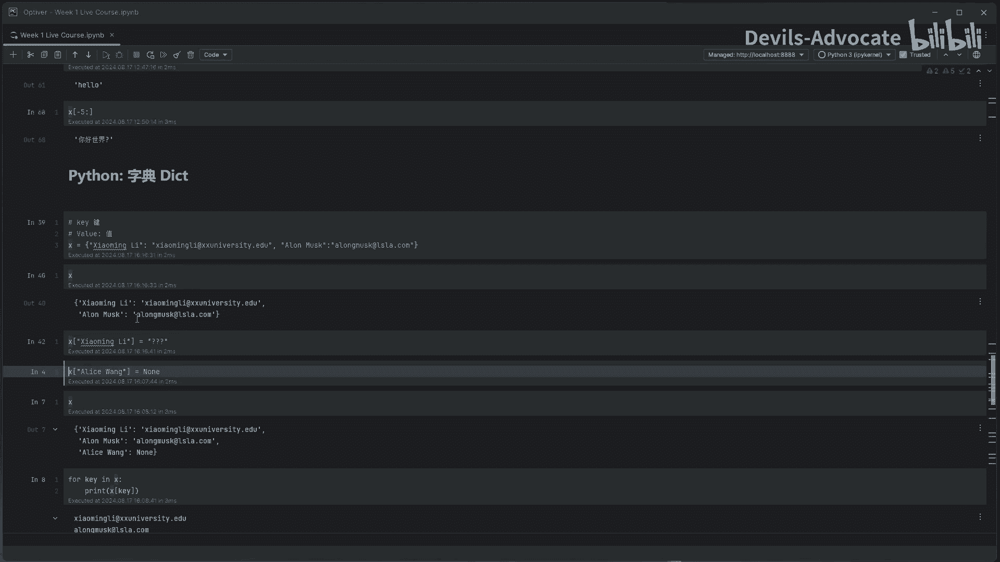

对吧这不就改了吗？那我们再来看小明，那我是不是把他这上面赋值的这个啊他的email给删掉了，改成三个问号。当然你改成什么都行了。啊，所以这是三种不一样的数据。如果大家没理清楚的话，理一理，这个非常重要。

在你用不同。

呃，做不同数据的时候，你会非常频繁的用到这三种不同的数据结构，啊，这也是非常基本的一种pyython的数据结构。那我们在module two里面会讲到像excel表一样的那种东西。

那叫pas叫呃面板数据。但是module one我们不会讲。

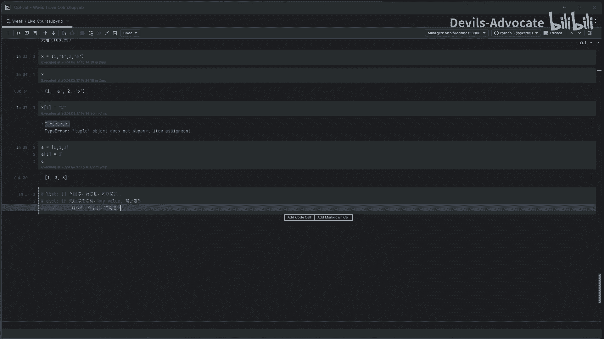

那么这节课我们讲了。嗯，讲个字典and。

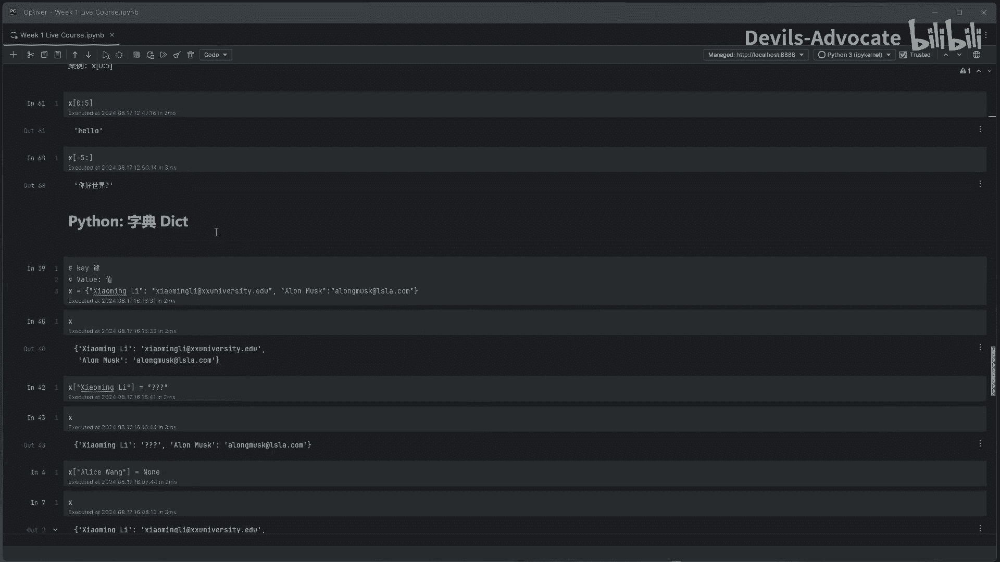

原子。

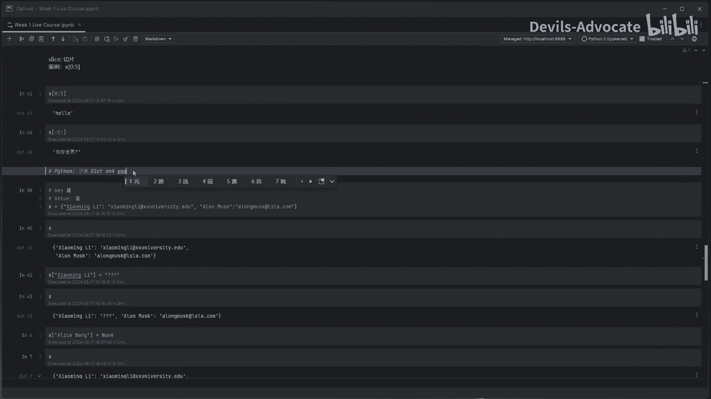

Tos。

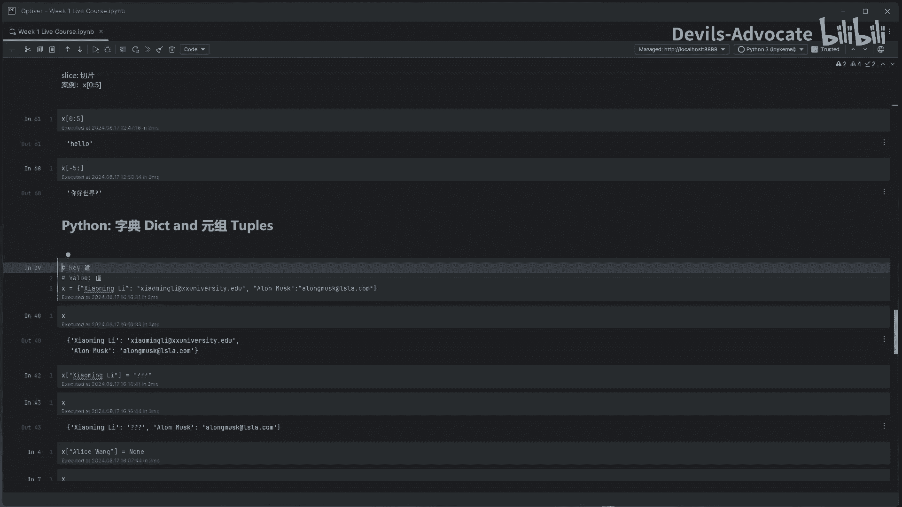

感谢各位啊。😊。