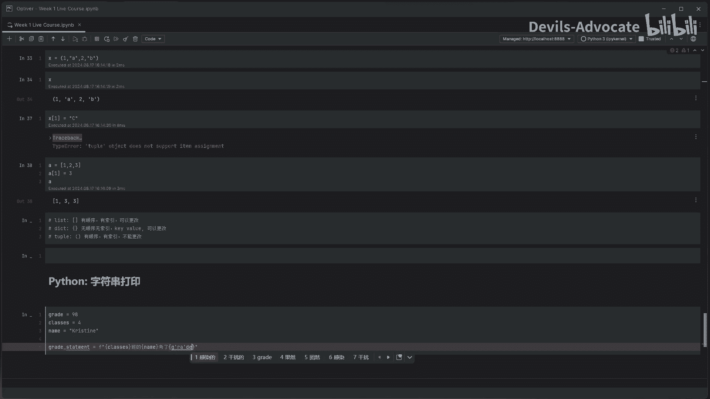
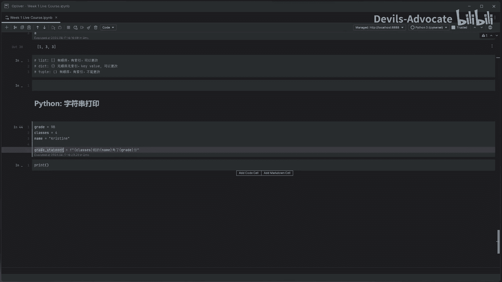
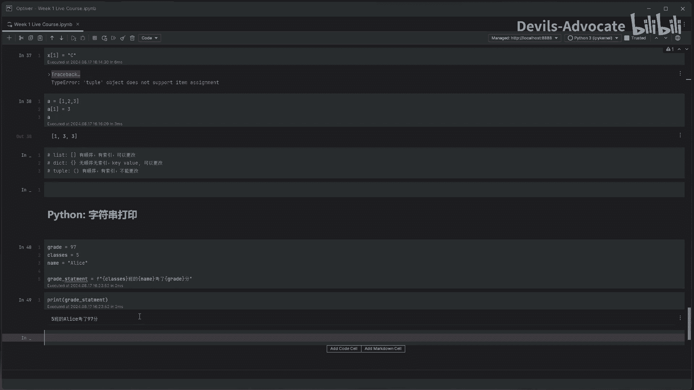

# 【量化交易】Python入门之数据分析【1／4】｜ 金融工程 量化金融 - P9：4. Python数据分析：Module1-字符串打印模板 - Devils-Advocate - BV1efHAe2EAR

上节课我们讲一下dict和元组，就是字典和元组这两种数据。这节课呢我们讲一下比较实用的一个东西，字符串打印。就是比如说一篇文章，它里面的它里面某些元素是否可以咱把它替换掉，对吧？呃。

这样你比如说我拿到一些数据的时候，是不是可以生成不同的文章的模板，那就是按照模板生成不同的文章，就假如假如说你有一个研究报告，它每次只改几份几个数字。那我是不是可以很方便的把它们就是每次数据变了的时候。

我直接塞到这报告里，我就不用不用每次输入了，对吧？呃，比如说我现在举个例子，grade。等于98。classassess4对吧？name。嗯。Christine。所以这是这是比如说他的成绩数据。G。

Statement。等于一个，那就就这里注意一下F。然后一个双引号，然后我们用中括号来表示。Classes。Yeah。我是不是打错了和。呃，4分。的谁呀？christine。Name。好了。grade。

3。这样子我们来看一下，打印一下这个。T a great statement。

所以说4班chtine考了98分，那我如果变一下97。对吧那就变成97分啊，alice，我如果数据又变一下5万的alice考了97分，是不是这样子的话就能很方便的把这个字符串打印出来。

那这堂课就是其实就很简单啊，大家可以练习一下，就是把这个字符串进行打印。当然后。后面我们会讲下拍放中日期和时间这个概念。

