# 【量化交易】Python入门之数据分析【3／4】｜ 金融工程 量化金融 - P4：3-3. Python数据分析：Module3-Pivot table 数据透视表 - Devils-Advocate - BV1vVHveqEJH

各位好，这节课我们来讲一下pe table数据透视表。那么经常用excel的伙伴呢。大家应该比较熟悉。那如果不太熟悉我们透数据透视表的呢，可以跟我们一起往下来看一下。数据透视表呢。

我们首先要建立一个我们的d frame。那我们的这个数据已经给出来了。我们看一下DF有日期、城市销售量和收入。

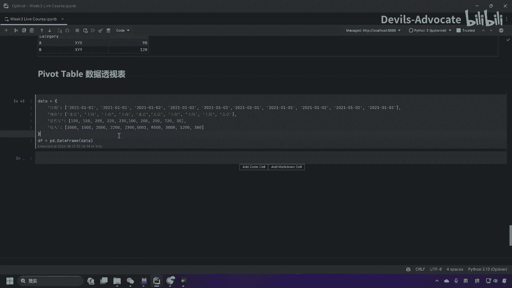

那么城市在分为上海和北京销售量，嗯，它是一个量的概念，收入那自然是收入的一个概念。

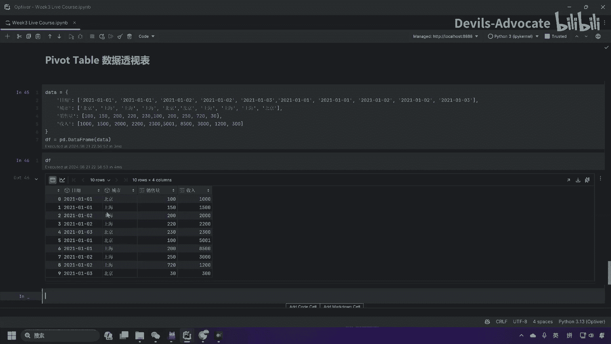

然后还有我们的日期是123号，当然这边不是按照一个升虚或者降息的来排列的。

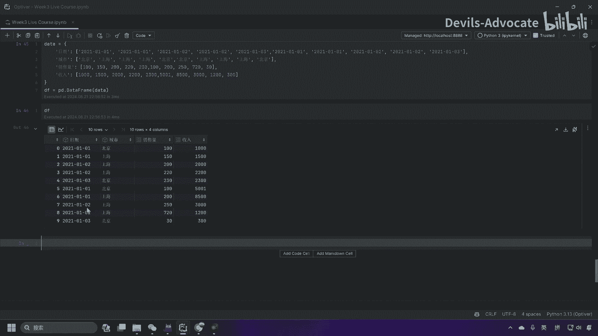

我们首先看一下总我们如果要建立一个透视表，总结不同城市在不同日期的销售量。

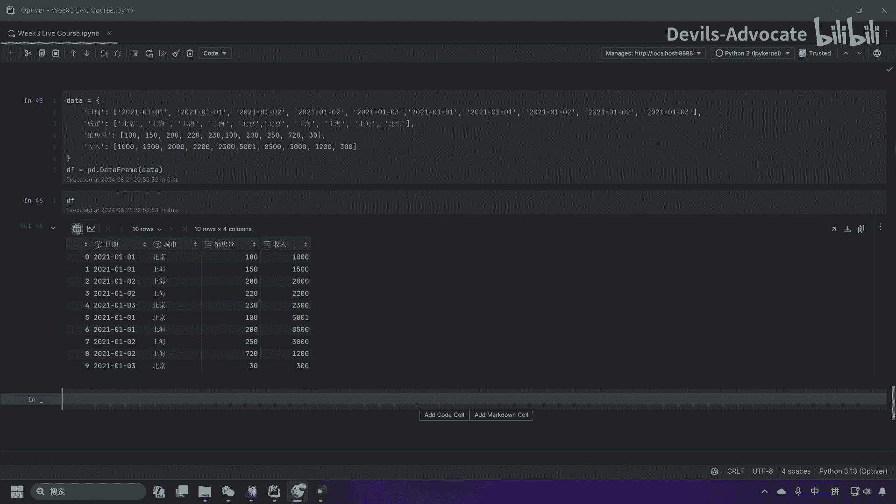

我把这个题目放上来，不同城市，那就是北京或者上海。在不同日期，它可能有一号、2号、3号。

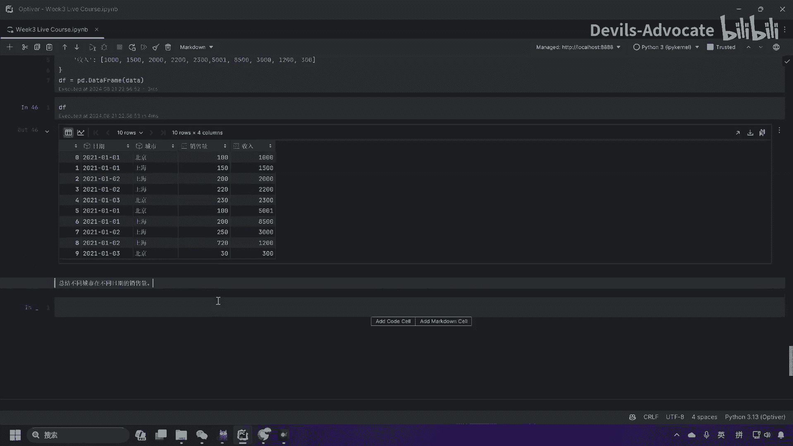

的销售量，它的一个销售量，这应该怎么做呀？之前我们可能用到了一个。分组group by的方法。那么这里我们用pbble table。

我先给复制成一个paperDFPD然后我们call一下paper table。然后我们把之前给的数据塞进来，data frame index，这就是它的索引。我们用日期。然后columns。我们有城市。

销售量也就是我们的数据。用values等于。行。调色量。

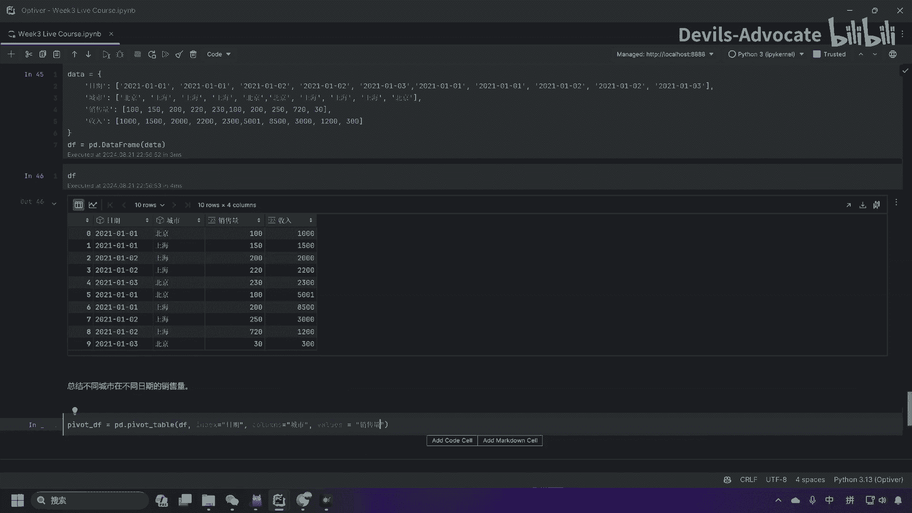

然后我们来看一下我们的tabletable长什么样。

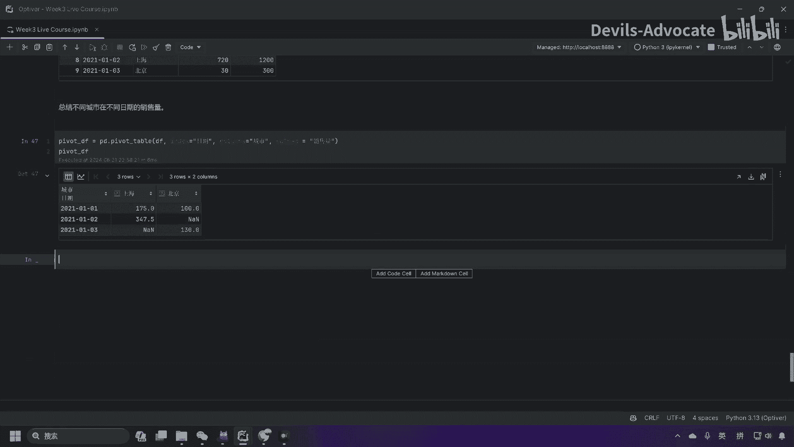

那么这里就是我们的。你看这里有不同的日期，那在这里呢我们把它进行了一个加走。

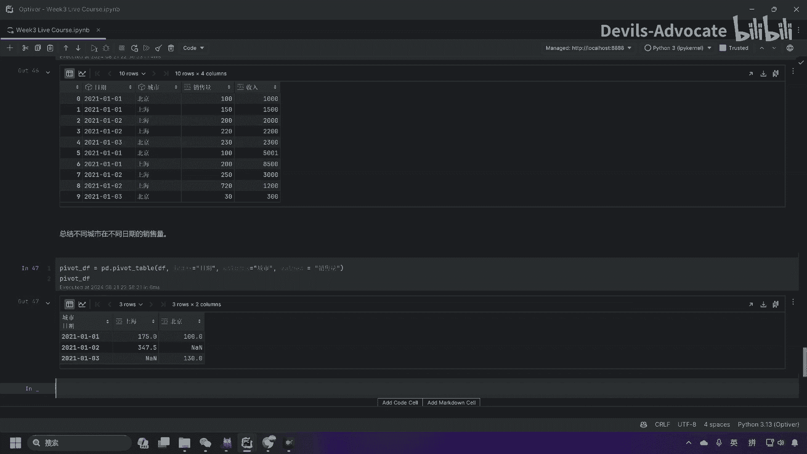

啊，这边是这不是加总啊，这是一个呃默认的take the average。那这问题也是总结不同城市在不同日期的销售量。那如果我们要用加总怎么办呢？我们要看一下，而且是就假如说我们不仅是销售量。

那也也要对收入进行加总。

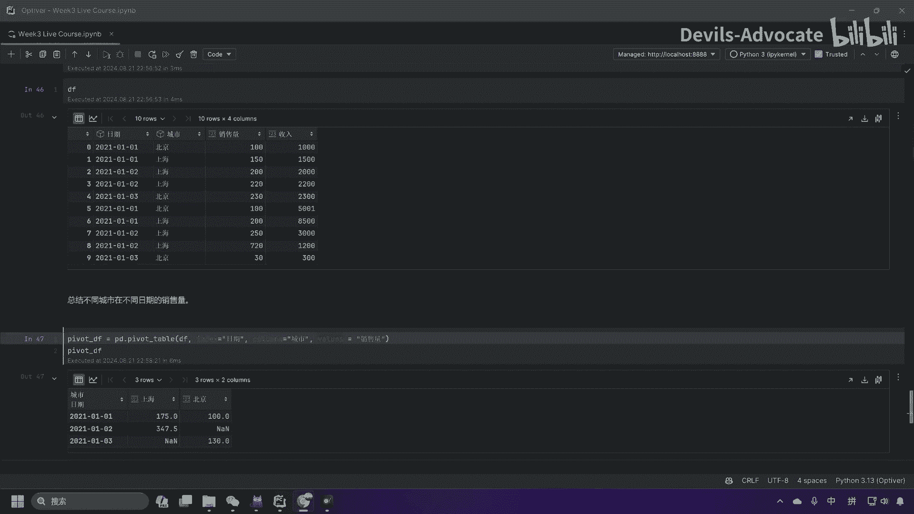

这应该怎么办呢？我们用仍然用pa tape，我们先把这个上面的复制下来，但是有些东西要变一下。比如说values我们可能就不止销售量了，我们要把收入也进行一个加总。然后后面就没有完。

我们要有个A fun。等于。大括号。我把这两个值先拷进来，销售量要做。Some。先注意这边是一个str的形式，收入呢也是一个so。

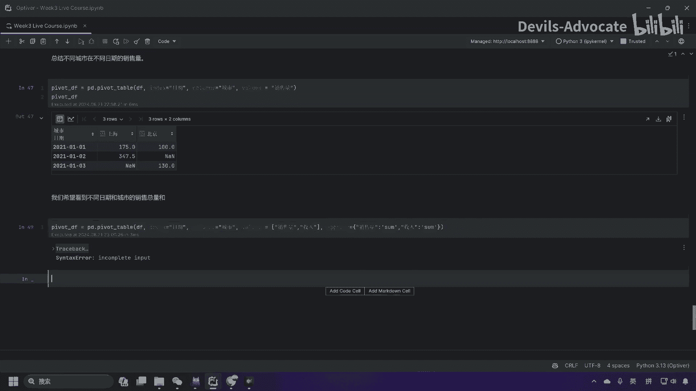

然我们来看一下我们的tabletable。那这就是一个收入的加总，可以看到销售量的上海，销售量的北京，收入的上海，收入的北京对应我们的收入和销售量，还有北京或者上海在1月23号。所以这有不同的变量。

然后它就会多几列。

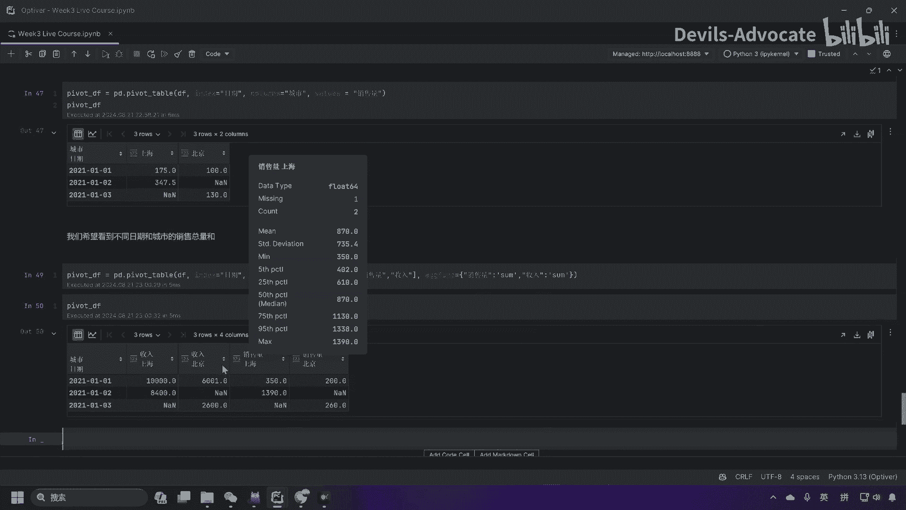

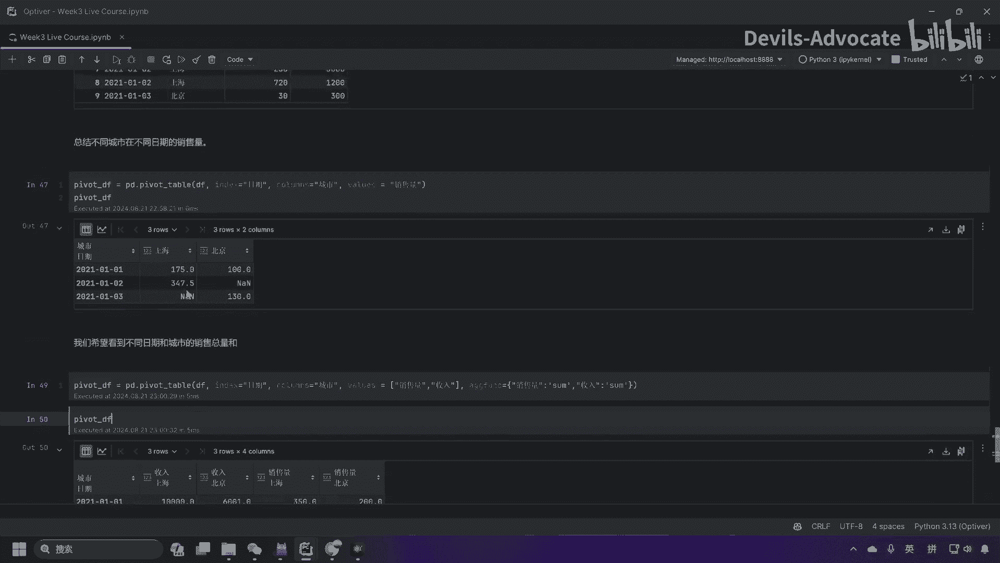

那如果你要拿除了s以外，那咱是不是可以avage呀？呃，用平均数对吧？那么我们这边其实也非常方便，就是me收入我们取平均数销售量，我们取总和。

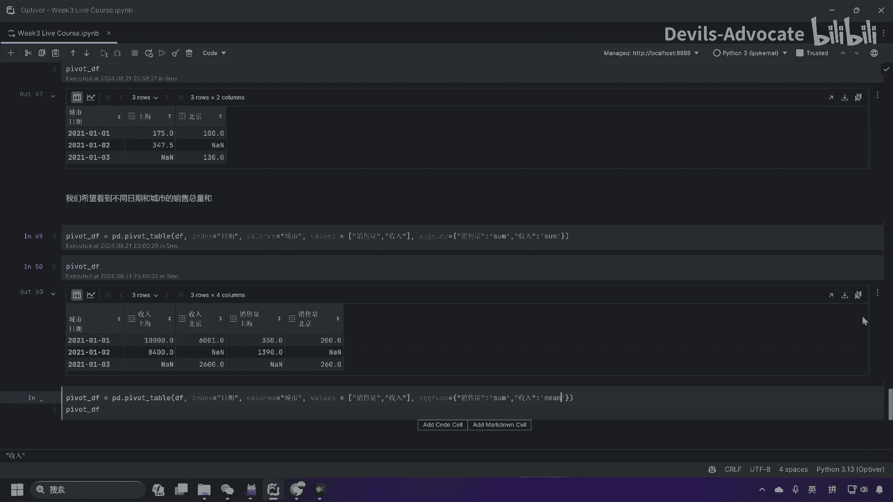

那么这里收入可以看到跟上面已经不一样了。我这边是3000，上面是。

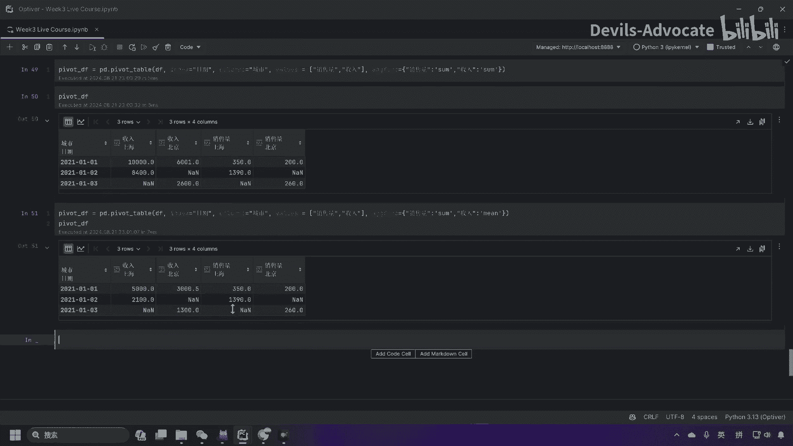

呃，6001对吧？那这个应该是有两。就除以除了2嘛，对吧？然后这个也是除了2。

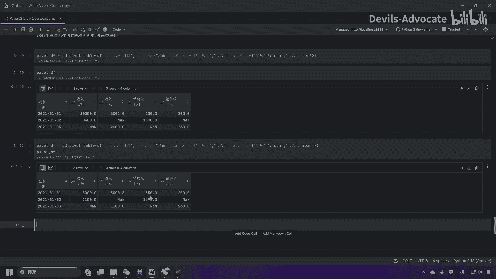

当然我们的这个销售量仍然做加总，这个没有变。那么我们得到的这个data frame，它可能有an non value，我们如何填充呢？那么我们可以用fill value等于零的方式。

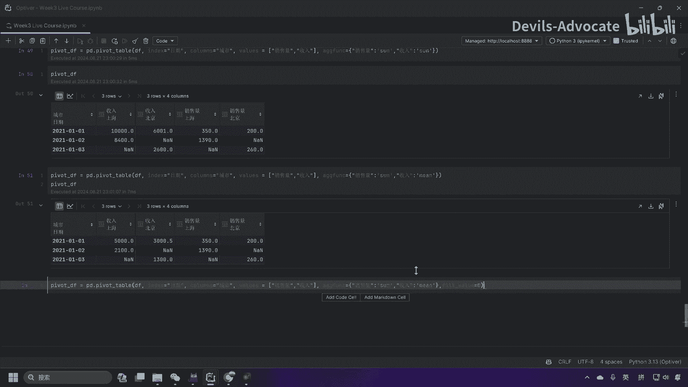

我们再嚟看下皮肤提播。那么这边呃nonown的 value都被零填充了。那么这里就是我们数据透视表的一个应用。

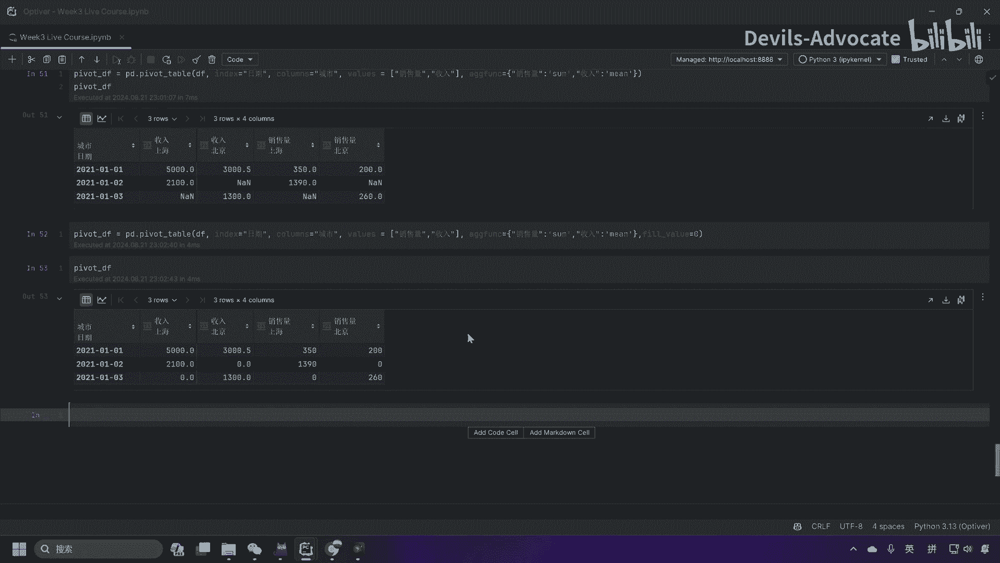