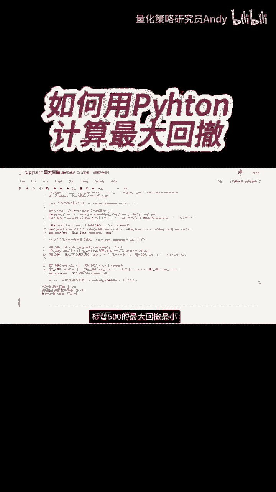
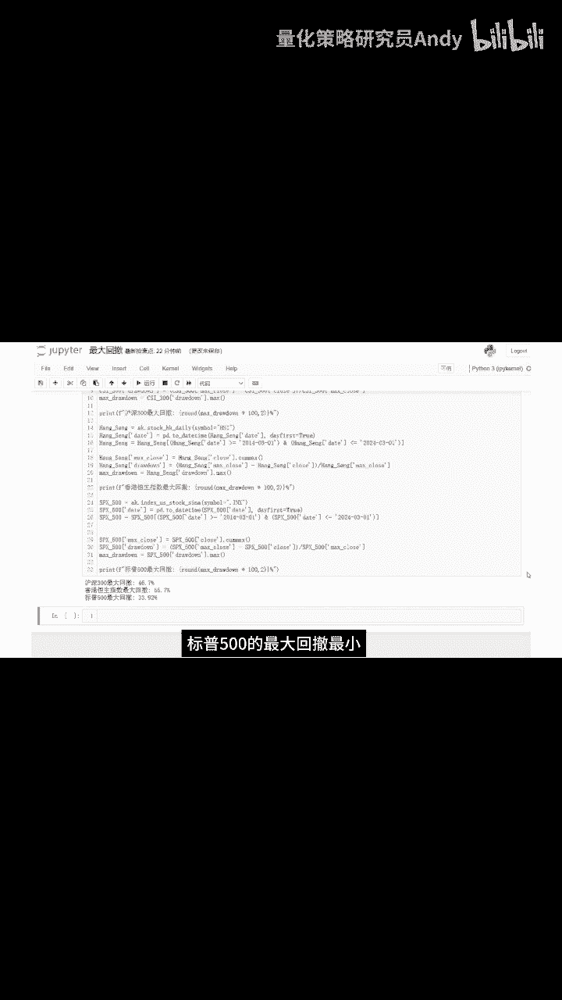

# 【量化交易】如何利用python代码计算最大回撤 - P1：短视频6 - 量化策略研究员Andy - BV1Np421U7rv

我们来看一下最大回撤的代码，获取数据的部分跟前面一样，主要是这三行代码，这个come max函数的作用是，求出迄今为止最大的收盘价，举个例子，比如今天是2015年3月2号。

那今天的最大收盘价就是从最开始的数据至今，也就是2014年3月1号到，2015年3月2号，这段区间内所有收盘价的最大值，然后用这个最大收盘价减去当天的收盘价，再除以最大收盘价，就是回撤。

最后再计算出回撤这一列的最大值，就是我们要求的最大回撤，我们运行一下代码，可以看到标普500的最大回撤。

