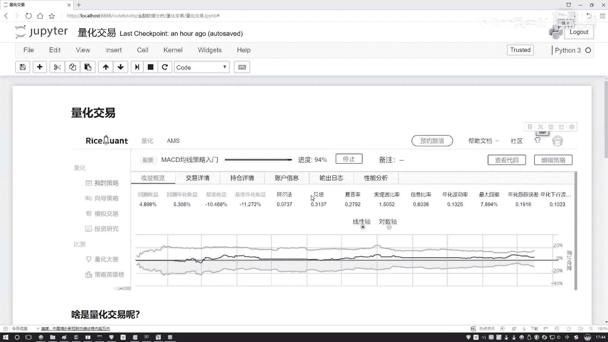
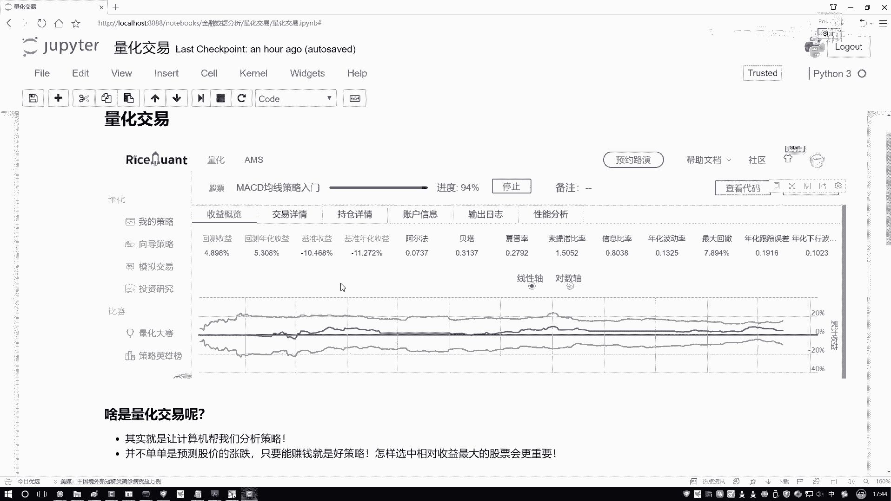
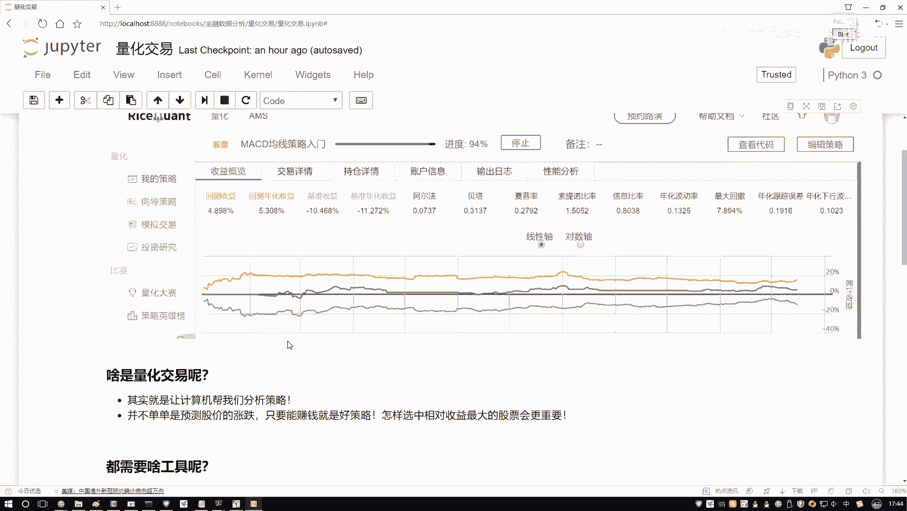
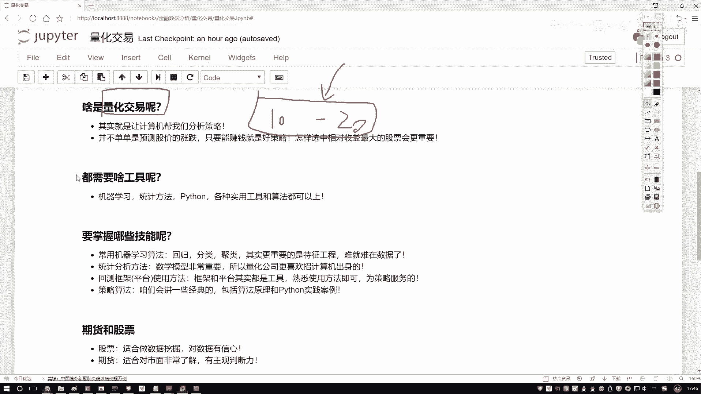
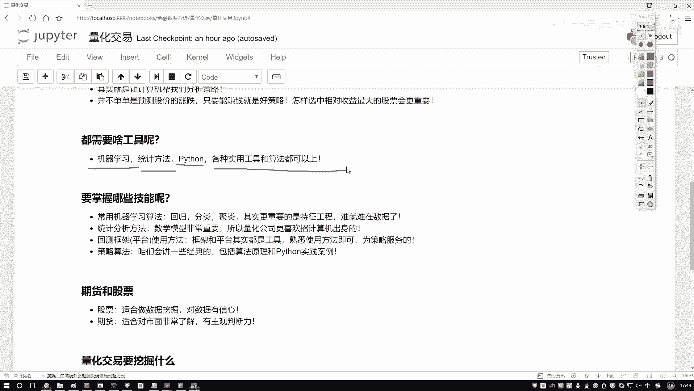

# 【量化交易全教程】三天拿下Python金融量化，比刷剧还爽！Python金融量化+股票交易，海归计算机博士手把手带你入门到金融实战！｜人工智能｜深度学习 - P18：05-量化交易与回测平台解读-1-量化交易概述 - 跟派大星学AI - BV1MnCGYcECZ

这节课呀咱们来说一下什么是量化交易，以及呢当我们在做的过程当中啊，有哪些个核心技能是我们所必须啊，要掌握起来的这张图啊，它是啊截了一个平台交易框架当中啊，做了一个策略分析等。

后续啊咱们会详细给大家去看啊，这里哎只是给大家放一张图，哎大家先不用去关注啊。

这节课我们主要来讲一讲量化交易呀，做了一件什么事，咱们讲的过程当中啊，就是所有的长篇大论那些东西啊，就通通去掉了，没必要知道那么多的一些历史啊，概述啊，还有一些发展前景啊。

这些东西啊没什么价值，哎咱们都不说，咱就来究其本质，唠一唠量化交易啊。

到底做了一件什么事儿，那以前啊你就说这个炒股吧，咱拿股票来说，以前咱说炒股都是谁去做啊，都我们自己去做吧，他在这个电脑面前是不是生怕发生什么事，生怕有一些指标变了，我们都不敢离开，一天一天盯着那瞅着呀。

以前咱要这么去做的，那你说即便你瞅个3年五年的，哎，你说你的水平特别高了吗，你就成为一个大神了吗，就能每次都赚钱吗，好像也不能，因为第一点啊，我们人都有什么一个主观性，哎呀我的一个主观性。

可能会使得我的判断有一些不准确吧，这是第一点，第二点呢你即便看了3年五年，你才能分析多少个股票啊，也就撑死那么十几个或者撑死哎，再多一点，是不是你没法看一个全局吧。

甚至你不能从很早的一个时间段到问到现在吧，比如说间隔个10年八年的，你分析这样一个历史数据，你能分析吗，好像也不能吧，精力时间计算力是不是都是有限的呀，那量化是什么意思啊，还是要做这样一件事，什么事。

我们最终的目标就一个怎么样去赚钱吧，但是呢不是我们人类自己得去想，还怎么去做，具体怎么赚钱，这个策略交给计算机哎，比如说我说告计算机，你就给我想一想什么样的策略是合适的，或者说你就简单点来说。

你告诉我什么时候买，什么时候卖，能使得比如说咱们两年时间内我赚的钱最多，这就是一种策略吧，我们要做的目标就是要去赚钱，那怎么赚钱呢，究其本质，我们要设计出来一些策略吧，那怎么设计策略呢，就是要通过什么。

我们拿到的这些股票的历史数据吧，比如现在我说股市当中啊，啊咱们先不说20年，咱们说这个10年吧，比如说现在有10年到这个20年啊，有这么十来年这个数据，然后呢某只股票的数据吧。

然后说啊把这10年数据拿出来，那都是历史的了，都是摆在那了，哎定型了吧，它数据也不会去变了，然后呢我说我想一想有什么样的方法，然后我想出个方法之后啊，我说应用到这个历史的，或者说过去的数据当中吧。

看一看我的方法能不能让我去赚钱，或者说通过好多项指标，后续咱们会说啊，有好多项指标，能不能通过哪些指标去判断一下，当前我这个策略是好呢还是坏呢，这个就叫做量化交易了，什么意思啊，基于我们的历史数据啊。

已经过去的那些数据要干什么，要做分析了，经常说一个词儿啊，叫做一个回测，回测什么意思，就是去分析一下这些历史数据当中，有哪些个价值信息，我们该怎么样去设计策略，来使得怎么样收益最大吧啊这就是量化交易。

让计算机针对历史数据，在数据当中做一个数据挖掘的任务，挖掘挖掘什么样的策略好，什么样的策略能够使得我赚钱，这说白了就是量化交易以前什么样，可能我那个我小时候啊，我小时候就是别人家孩子都是看动画片长大的。

我小时候什么样，我小时候都是看股票长大的，为什么，因为我爸非常爱炒股，从小的时候啊，就家里啊那家电视台上全是放股票，但凡开电视机，那就听各个评论员讲，这个股票咋地咋地，那股票咋地咋地。

那方法论那个策略方法，那家伙讲的哎呦，我天就是神乎其技一般哎，吹的特别狠是吧，然后呢，我爸炒这么多年股，最后也没有赚钱，为什么，因为说白了都是人在去做吧，主观性太强了，而且没有什么数据分析。

那你说现在呢现在什么样还真的需要人，我们死盯着丝绸去做吗，好像不需要了，大数据时代，人工智能时代，量化交易就来了，基于数据应用什么智能的一些算法吧，来去帮我们让收益最大，哎这就是量化交易行了。

刚才给大家简单的强调了一下量化交易，哎大家大概明白了，就是现在有一批历史数据来了，我说我现在想设计一些方法，设计策略，使得我的收益最大，那都需要什么呢。

在需要的过程当中啊，哎呀其实蛮多的，我觉着啊就是量化交易这个东西啊，它可能是一个交叉学科啊，这里边需要大家掌握的知识可能会偏多一些啊，大家可能觉着哎呀一些金融学的知识，我是不是都要去掌握呢。

其实我觉得这样在量化交易当中啊，一些金融方面知识你只需要去了解就可以了，哎就别人说什么事，你大概知道哎大概什么意思就行了，不需要把这个方案当做重点，但是应该把什么当作重点呢。

把我们跟计算机相关的什么意思啊，你看这里我列出来一些一些机器学习算法啊，机器学习算法什么意思啊，现在拿数据了，我要去预测一些结果，我要去预测未来的一个走势，这是机器学习吧。

统计方法呢给我一批数据数据当中啊，哎呀它是指标表示什么样的信息呢，这些指标我该怎么去计算呢，怎么样去做一些分析，哎这是统计方法吧，那还有什么刚才说的东西，给我们感觉像是方法论似的，怎么去做呢。

这里我是不是提了一个Python吧，我们得编程自己去实践吧，其实说白了就是这样一件事，当我们在做量化交易过程当中啊，也没有什么必备的工具，你能想到的，或者但凡你要用上的，只要你觉得好。

只要能让你的收益最大，那就是好的，这一个就是我们常用的一些工具了，可能金融学的一些知识点，一些知识不是特别重要，而什么最为重要，怎么样处理数据，怎么样操纵数据，怎么样让数据变钱吧。

其实说白了就是数据挖掘啊，你可以把量化交易当做是数据挖掘领域当中啊。

呃现在来说比较吃香啊。